**CAPSTONE PROJECT REPORT**

**Report 4 - Software Design Document**

**Khoga Cafe Shop Management System**

Version: 1.0 | Date: 2026-06-18

**Table of Contents**
* [I. Record of Changes](#i-record-of-changes)
* [II. Software Design Document](#ii-software-design-document)
  * [1. System Design](#1-system-design)
    * [1.1 System Architecture](#11-system-architecture)
    * [1.2 Package Diagram](#12-package-diagram)
  * [2. Database Design](#2-database-design)
    * [2.1. Core Sales & POS ERD](#21-core-sales--pos-erd)
    * [2.2. Operations, Staffing & Audit ERD](#22-operations-staffing--audit-erd)
  * [3. Detailed Design](#3-detailed-design)
    * [3.1 System Access & Security](#31-system-access--security)
    * [3.2 User Account Management](#32-user-account-management)
    * [3.3 Menu & Category Management](#33-menu--category-management)
    * [3.4 Voucher Management](#34-voucher-management)
    * [3.5 Customer & Membership Management](#35-customer--membership-management)
    * [3.6 Inventory & Stock Management](#36-inventory--stock-management)
    * [3.7 POS Transaction Management](#37-pos-transaction-management)
    * [3.8 Order & Queue Management](#38-order--queue-management)
    * [3.9 Staff Management](#39-staff-management)
    * [3.10 Reports & Analytics](#310-reports--analytics)
    * [3.11 System Configuration & Branch Management](#311-system-configuration--branch-management)

---

# **I. Record of Changes**

| Date | A\*M, D | In charge | Change Description |
| ----- | ----- | ----- | ----- |
| 2026-06-18 | A | Software Engineering Team | Initial creation of RDS v1.0 — Iteration A: Section I (Record of Changes), Section 1.1 (System Architecture), Section 1.2 (Package Diagram), Section 2 (Database Design — 21 tables). |
| 2026-06-18 | A | Software Engineering Team | Iteration B: Section 3.1 (System Access & Security), Section 3.2 (User Management), Section 3.3 (Menu & Category Management), Section 3.4 (Voucher Management). |
| 2026-06-18 | A | Software Engineering Team | Iteration B cont.: Section 3.5 (Customer & Membership), Section 3.6 (Inventory & Stock), Section 3.7 (POS Transaction), Section 3.8 (Order Management). |
| 2026-06-18 | A | Software Engineering Team | Iteration B cont.: Section 3.9 (Staff Management), Section 3.10 (Reports & Analytics), Section 3.11 (System Configuration & Branch Management). |
| 2026-06-18 | M | Software Engineering Team | Simplified Section 1.2 Package Diagram to follow the core MVC 6-package structure (bean, view, controller, filter, dao, util). |
| 2026-06-18 | M | Software Engineering Team | Rebuilt Section 2 (Database Design) ERD to display full column definitions (PK, FK, types) inside each entity, matching Visual Paradigm format. Restored all 21 SRS entities with exact columns from SRS §3.1.6. |
| 2026-06-18 | M | Software Engineering Team | Split Section 2 Database Design ERD into 2 diagrams (Core Sales & POS, Operations/Staffing/Audit) to prevent cluttering and improve readability. |
| 2026-06-18 | M | Software Engineering Team | Translated Section 2.1 & 2.2 titles/descriptions to English and unified font formatting (monospace inline code blocks) for database tables, columns, PK, FK, enums, data types, and roles. |
| 2026-06-18 | M | Software Engineering Team | Standardized Section 1.2 Package Diagram to UML package diagram conventions (Visual Paradigm style), organizing 18 subsystems into structured tiers with explicit dependency stereotypes (use, import, access). |
| 2026-06-18 | M | Software Engineering Team | Standardized all 4 Statechart diagrams (USER, VOUCHER, SHIFT, ORDER lifecycles) to UML-compliant syntax matching Visual Paradigm layout (Trigger [Guard] / Action format). |
| 2026-06-18 | M | Software Engineering Team | Standardized all 32 Sequence diagrams to UML method signature conventions, converting free-text labels to formal API/event operation calls. |
| 2026-06-18 | M | Software Engineering Team | SRS-consistency review fixes: corrected mis-mapped use-case numbers in section/sequence titles (UC-51/53 in §3.7, UC-55 cancel in §3.8, UC-49 redeem in §3.5, UC-76/77 in §3.10, dropped wrong UC-66/UC-73 labels); fixed wrong business-rule citations (BR-11/42/54/68/81/88) across §3.1/3.2/3.4/3.7/3.10/3.11 and the Package Diagram. |
| 2026-06-18 | M | Software Engineering Team | Reconciled class diagrams to the 21-table schema: removed non-schema attributes (Customer.birthDate/isActive, StockItem.unit, Order.notes, StockTransaction before/after) and aligned types (pos_register_id String, OrderRefund.shift_session_id added). Standardized enums to SRS (payment_status COMPLETED not PAID; audit action_type UPDATE; voucher state SCHEDULED). |
| 2026-06-18 | M | Software Engineering Team | Closed business-logic gaps: USER lockout 15-min auto-clear (BR-11); ORDER READY→ABANDONED via timeout + SM force-close (BR-88); SM cash-refund debits open drawer + loyalty reversal (BR-09/BR-08/BR-67); branch deactivation checks non-terminal orders + cascade (BR-55/BR-56). Documented `SystemConfig` as an infrastructure key-value store outside the 21-entity business ERD. |
|  |  |  |  |

\*A – Added   M – Modified   D – Deleted

# **II. Software Design Document**

## **1\. System Design**

### **1.1 System Architecture**

*\[The content of this section includes the overall diagram which includes the sub-systems, the external systems, and the relationship/connection among them. The explanation for each of the diagram components (modules, sub-systems, external systems, etc.) is provided in the component descriptions table below. The system adopts a 4-Tier MVC architecture combined with COMET EBC (Entity–Boundary–Control) design method.\]*

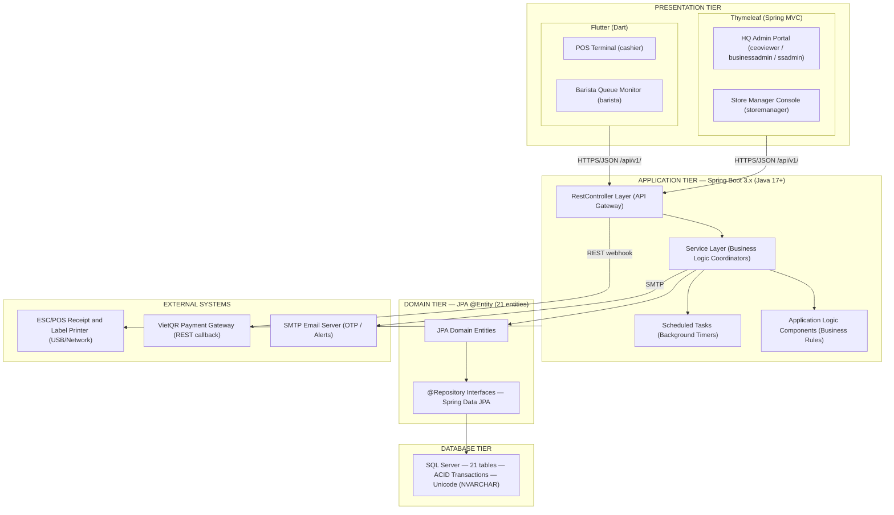
```mermaid
graph TB
    subgraph PRESENTATION["PRESENTATION TIER"]
        direction LR
        subgraph WEB["Thymeleaf (Spring MVC)"]
            HQ["HQ Admin Portal (ceoviewer / businessadmin / ssadmin)"]
            MGR["Store Manager Console (storemanager)"]
        end
        subgraph FLUTTER["Flutter (Dart)"]
            POS["POS Terminal (cashier)"]
            BAR["Barista Queue Monitor (barista)"]
        end
    end

    subgraph APP["APPLICATION TIER — Spring Boot 3.x (Java 17+)"]
        direction TB
        CTRL["RestController Layer (API Gateway)"]
        SVC["Service Layer (Business Logic Coordinators)"]
        LOGIC["Application Logic Components (Business Rules)"]
        SCHED["Scheduled Tasks (Background Timers)"]
    end

    subgraph DOMAIN["DOMAIN TIER — JPA @Entity (21 entities)"]
        ENT["JPA Domain Entities"]
        REPO["@Repository Interfaces — Spring Data JPA"]
    end

    subgraph DB["DATABASE TIER"]
        SQLSERVER["SQL Server — 21 tables — ACID Transactions — Unicode (NVARCHAR)"]
    end

    subgraph EXT["EXTERNAL SYSTEMS"]
        VIETQR["VietQR Payment Gateway (REST callback)"]
        EMAIL["SMTP Email Server (OTP / Alerts)"]
        PRINTER["ESC/POS Receipt and Label Printer (USB/Network)"]
    end

    WEB -->|"HTTPS/JSON /api/v1/"| CTRL
    FLUTTER -->|"HTTPS/JSON /api/v1/"| CTRL
    CTRL --> SVC
    SVC --> LOGIC
    SVC --> SCHED
    SVC --> ENT
    ENT --> REPO
    REPO --> SQLSERVER
    CTRL -->|"REST webhook"| VIETQR
    SVC -->|"SMTP"| EMAIL
    APP -->|"ESC/POS"| PRINTER
```

***Diagram Component Descriptions***

| No | Component | COMET Type | Description |
| :---: | ----- | ----- | ----- |
| 01 | Thymeleaf Web Frontend | «boundary» (UI) | Server-side rendered web frontend using Spring Boot Thymeleaf templates for HQ Admin Portal (roles: ceoviewer, businessadmin, ssadmin) and Store Manager Console (role: storemanager). Views are rendered on the server and delivered as HTML pages. |
| 02 | Flutter (Dart) Mobile/Tablet App | «boundary» (UI) | Mobile/tablet frontend for POS Terminal (role: cashier) and Barista Queue Monitor (role: barista). Always-online operation; communicates with backend via REST API over HTTPS/JSON. |
| 03 | @RestController Layer | «boundary» (API Gateway) | Spring Boot REST controllers. Receive HTTP requests, validate inputs using Bean Validation, apply JWT authentication, and delegate to @Service layer. All endpoints prefixed `/api/v1/`. |
| 04 | @Service Layer | «control» (Coordinator) | Business logic orchestration. Each service coordinates domain entities, calls application logic components, and manages transactions via @Transactional. |
| 05 | Application Logic Components | «application logic» | Stateless business rule engines: DiscountStackingEngine (BR-70), RecipeDeductionEngine (BR-89), LoyaltyPointCalculator, COGSCalculator, AnomalyDetector, AttendancePhotoManager (PDPA). |
| 06 | @Scheduled Tasks | «timer» | Spring @Scheduled background timers: OrderTimeoutTimer (15 min), ShiftAutoCloseTimer (23:59 cron), LowStockAlertTimer (22:00 cron), PhotoAutoDeleteTimer (02:00 cron — PDPA 90-day purge BR-72), OtpExpiryTimer (10 min). |
| 07 | @Entity / @Repository (Domain Tier) | «entity» | 21 JPA domain entities mapped to SQL Server tables via Spring Data JPA repositories. All PK are UUID VARCHAR(36). |
| 08 | SQL Server | Database | Relational database with ACID transactions, Unicode support (NVARCHAR). 21 tables. |
| 09 | VietQR Payment Gateway | External System | Vietnamese QR payment provider. Integrated via REST webhook callback with idempotency key (orderId) to prevent duplicate charges (BR-84/BR-85). |
| 10 | SMTP Email Server | External System | Email delivery service for: OTP delivery (BR-16), low stock daily alerts (22:00), and welcome email for new staff accounts. |
| 11 | ESC/POS Printer | External System | Receipt and cup label printers connected via USB/Network to POS Terminal (Flutter) and Barista tablets. Triggered by PrinterServiceProxy after order completion. |

***COMET EBC Stereotype → Spring Boot MVC Mapping***

| COMET Stereotype | Spring Boot Implementation | Examples |
| ----- | ----- | ----- |
| «boundary» (UI Screen) | View: Thymeleaf templates (.html), Flutter Widgets | LoginForm, PosCheckoutGrid, BaristaQueueMonitor |
| «boundary» (API Endpoint) | Controller: @RestController | AuthController, OrderController, PosController |
| «boundary» (External Proxy) | Adapter: RestTemplate / WebClient | VietQRClient, EmailService, PrinterService |
| «control» (Coordinator) | Service: @Service (business orchestration) | AuthService, CheckoutService, OrderQueueService |
| «application logic» (Engine) | Component: @Component (pure business rules) | DiscountStackingEngine, RecipeDeductionEngine |
| «entity» (Domain Object) | Model: @Entity + @Repository | User, Order, MenuItem, StockItem, AuditLog |
| «timer» (Scheduled Task) | Scheduler: @Scheduled / @Async | OrderTimeoutScheduler, ShiftAutoCloseScheduler |

### **1.2 Package Diagram**

*\[The overall package diagram shows the decomposition of the system into 18 subsystems (packages). Each package follows the COMET Information Hiding principle, encapsulating its own controller, service, repository, and domain components. The Spring Boot backend is organized under the root package `com.khoga.coffeeshop`. The web frontend uses Thymeleaf templates in `src/main/resources/templates/`. The Flutter application is a separate project `khoga_pos_app/`.\]*

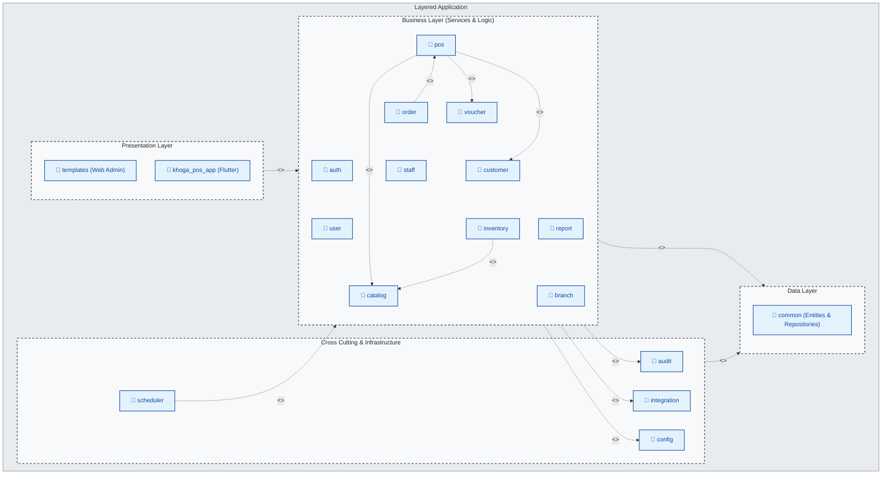
```mermaid
graph TB
    %% Khoga Coffee Shop - Layered Application Package Diagram
    
    subgraph LAYERED["Layered Application"]
        
        subgraph PRESENTATION["Presentation Layer"]
            WEBUI["📁 templates (Web Admin)"]
            FLUTTER["📁 khoga_pos_app (Flutter)"]
        end

        subgraph BUSINESS["Business Layer (Services & Logic)"]
            AUTH["📁 auth"] ~~~ USER["📁 user"] ~~~ CATALOG["📁 catalog"]
            VOUCHER["📁 voucher"] ~~~ CUSTOMER["📁 customer"] ~~~ INVENTORY["📁 inventory"]
            POS["📁 pos"] ~~~ ORDER["📁 order"] ~~~ STAFF["📁 staff"]
            REPORT["📁 report"] ~~~ BRANCH["📁 branch"]
            
            %% Core Business Dependencies
            POS -.->|"<<access>>"| CATALOG
            POS -.->|"<<access>>"| VOUCHER
            POS -.->|"<<access>>"| CUSTOMER
            ORDER -.->|"<<access>>"| POS
            INVENTORY -.->|"<<access>>"| CATALOG
        end

        subgraph DATA["Data Layer"]
            COMMON["📁 common (Entities & Repositories)"]
        end

        subgraph CROSS_CUTTING["Cross Cutting & Infrastructure"]
            AUDIT["📁 audit"]
            INTEGRATION["📁 integration"]
            SCHEDULER["📁 scheduler"]
            CONFIG["📁 config"]
        end
        
    end

    %% Force Vertical Alignment for Layers
    PRESENTATION ~~~ BUSINESS ~~~ DATA

    %% Layer-to-Layer & Cross-Cutting Dependencies
    PRESENTATION -.->|"<<access>>"| BUSINESS
    BUSINESS -.->|"<<import>>"| DATA
    
    %% Specific Cross-Cutting relationships
    BUSINESS -.->|"<<import>>"| INTEGRATION
    BUSINESS -.->|"<<access>>"| AUDIT
    BUSINESS -.->|"<<access>>"| CONFIG
    SCHEDULER -.->|"<<access>>"| BUSINESS
    
    %% Cross-Cutting to Data
    CROSS_CUTTING -.->|"<<import>>"| DATA

    %% Visual Styling
    classDef package fill:#e3f2fd,stroke:#0d47a1,stroke-width:1.5px,color:#0d47a1;
    classDef layer fill:#f8f9fa,stroke:#495057,stroke-width:2px,color:#212529,stroke-dasharray: 5 5;
    classDef mainLayer fill:#e9ecef,stroke:#adb5bd,stroke-width:2px;

    class WEBUI,FLUTTER,AUTH,USER,CATALOG,VOUCHER,CUSTOMER,INVENTORY,POS,ORDER,STAFF,REPORT,BRANCH,COMMON,AUDIT,INTEGRATION,SCHEDULER,CONFIG package;
    class PRESENTATION,BUSINESS,DATA,CROSS_CUTTING layer;
    class LAYERED mainLayer;
```

***Package Descriptions***

| No | Package | Description |
| :---: | ----- | ----- |
| 01 | `com.khoga.auth` | Authentication subsystem. Manages JWT token lifecycle, MFA (Email OTP), and password policy enforcement. Contains `AuthController` («boundary»), `AuthService` («control»), `JwtTokenProvider`, `MfaService`, `OtpService` («application logic»). Coordinates UC-01→UC-06. |
| 02 | `com.khoga.user` | User account management for ssadmin. Contains `UserController` («boundary»), `UserService` («control»), `PasswordPolicyValidator` («application logic»). Coordinates UC-10→UC-14. |
| 03 | `com.khoga.catalog` | Chain-wide menu catalog: menu items, categories, option toppings, raw material master catalog, and recipe formulation. Contains controllers and services for Menu, Category, Topping, RawMaterial, Recipe. Coordinates UC-15→UC-19, UC-68→UC-74. |
| 04 | `com.khoga.voucher` | Promotional voucher CRUD and checkout validation. Contains `VoucherController` («boundary»), `VoucherService` («control»). Coordinates UC-20→UC-23. |
| 05 | `com.khoga.customer` | Customer CRM registry and loyalty point calculation. Contains `CustomerController` («boundary»), `CustomerService` («control»), `LoyaltyPointService` («application logic»). Coordinates UC-24→UC-27, UC-49. |
| 06 | `com.khoga.inventory` | Branch stock management: import, export, physical audit, and recipe-based automatic stock deduction when orders transition to PREPARING. Contains `StockController` («boundary»), `StockService` («control»), `RecipeDeductionService` («application logic»). Coordinates UC-31→UC-34, UC-61, UC-62. |
| 07 | `com.khoga.pos` | POS terminal management: shift open/close, full checkout pipeline (cart building, discount/voucher/loyalty application), VietQR payment integration, shift cash reconciliation. Contains `PosController` («boundary»), multiple service classes («control»), `DiscountStackingService`, `ShiftReconciliationService` («application logic»). Coordinates UC-44→UC-55, UC-75. |
| 08 | `com.khoga.order` | Order lifecycle: queue display, barista status update, cashier cancellation (PENDING only), SM-authorized refund/comp. Contains `OrderController` («boundary»), `OrderService`, `OrderQueueService`, `CancellationService`, `RefundService` («control»). Coordinates UC-55→UC-60, UC-73, UC-75. |
| 09 | `com.khoga.staff` | Staff scheduling and attendance tracking. Schedule CRUD by storemanager. Attendance check-in with PIN + camera photo (PDPA-compliant BR-72). Worked-hours export. Contains schedule/attendance controllers and services, `AttendancePhotoManager` («application logic»). Coordinates UC-35→UC-39, UC-66, UC-80. |
| 10 | `com.khoga.report` | All reporting and analytics: HQ consolidated dashboard, COGS/margin, price change history, loyalty liability, labour efficiency, Z-report archive, anomaly detection. Contains `ReportController` («boundary»), multiple report service classes («application logic»). Coordinates UC-28→UC-29, UC-40→UC-41, UC-76→UC-83. |
| 11 | `com.khoga.branch` | Branch lifecycle management: add, edit, deactivate. Enforces MAX_ACTIVE_BRANCHES constraint (BR-54). Contains `BranchController` («boundary»), `BranchService` («control»). Coordinates UC-63→UC-65. |
| 12 | `com.khoga.config` | Central system configuration (tax rate, loyalty rates, VietQR credentials) managed by ssadmin, and branch-local overrides by storemanager. Contains `ConfigController` («boundary»), `SystemConfigService` («control»). Coordinates UC-30, UC-42. |
| 13 | `com.khoga.audit` | Immutable audit log service auto-triggered by @EntityListeners for: price changes, voucher mutations, user account changes, checkout voucher/loyalty usage. Contains `AuditLogService`. Supports BR-68, BR-80, BR-81. |
| 14 | `com.khoga.integration` | External system adapters («boundary» external proxies): `VietQRClient` + `VietQRSettlementHandler` (payment gateway), `EmailService` (SMTP OTP/alerts), `PrinterService` (ESC/POS receipt and cup label). |
| 15 | `com.khoga.common` | Shared persistence layer: all 21 JPA `@Entity` classes, `@Repository` interfaces, request/response DTOs, custom exceptions, `@ControllerAdvice`, and input validators. Classified as «entity» (data) subsystem. |
| 16 | `com.khoga.scheduler` | Spring `@Scheduled` background timer tasks («timer» subsystem): `OrderTimeoutScheduler` (READY→ABANDONED after `READY_ABANDON_TIMEOUT`, BR-88), `ShiftAutoCloseScheduler` (23:59 cron, BR-88), `LowStockAlertScheduler` (22:00 cron), `OtpExpiryScheduler` (10-min), `PhotoAutoDeleteScheduler` (02:00 cron — PDPA BR-72). |
| 17 | `src/main/resources/templates/` | Thymeleaf server-side rendered web frontend for HQ Admin Portal and Store Manager Console. Views are rendered by Spring MVC controllers and delivered as HTML. Static assets (CSS/JS/images) reside in `src/main/resources/static/`. Classified as «boundary» (UI Web) subsystem. |
| 18 | `khoga_pos_app/` | Flutter application for POS Terminal and Barista Queue Monitor. Communicates via `dio` HTTP client over HTTPS/JSON. Always-online; requires active network connection to process transactions. Classified as «boundary» (UI Flutter) subsystem. |

***Subsystem-level Package Diagram***

*\[A typical backend subsystem (e.g., `com.khoga.auth`, `com.khoga.inventory`) follows the package structure diagram below, encapsulating its controller, service, repository, and model packages. This organization isolates the data access, business coordination, and interface boundary logic inside each package, conforming to the COMET information hiding principles.\]*

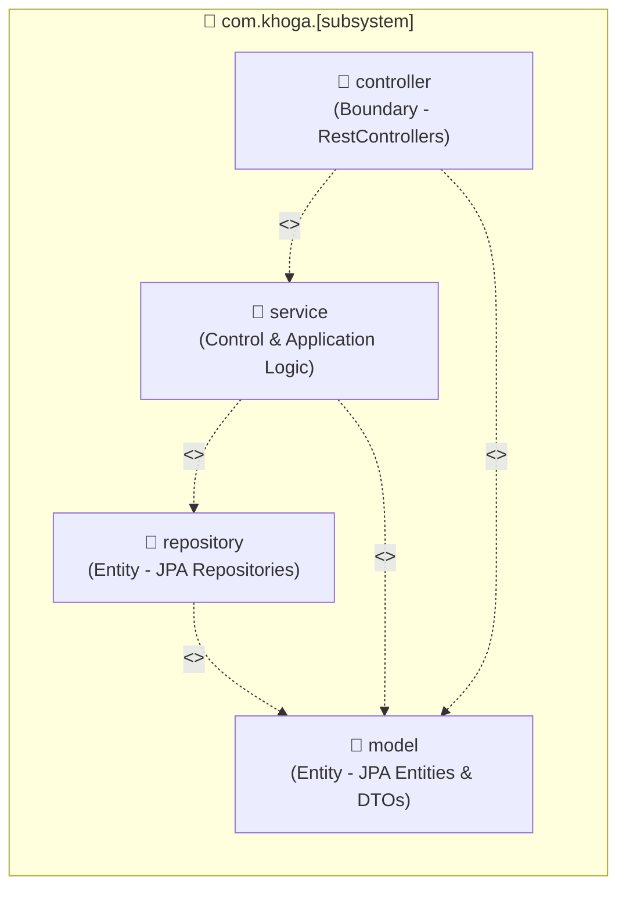
```mermaid
graph TB
    subgraph SUBSYSTEM["📁 com.khoga.[subsystem]"]
        direction TB
        CTRL["📁 controller<br/>(Boundary - RestControllers)"]
        SVC["📁 service<br/>(Control & Application Logic)"]
        REPO["📁 repository<br/>(Entity - JPA Repositories)"]
        MODEL["📁 model<br/>(Entity - JPA Entities & DTOs)"]

        CTRL -.->|"<<use>>"| SVC
        SVC -.->|"<<use>>"| REPO
        REPO -.->|"<<access>>"| MODEL
        CTRL -.->|"<<access>>"| MODEL
        SVC -.->|"<<access>>"| MODEL
    end
```

***Package and Class Naming Conventions***

| Stereotype / Element | Package / Location | Naming Pattern / Suffix | Examples | Description |
| :--- | :--- | :--- | :--- | :--- |
| **Subsystem Package** | `com.khoga.*` | Lowercase singular/plural nouns representing functional domains. | `com.khoga.auth`, `com.khoga.inventory`, `com.khoga.pos` | Flat package layout grouping all domain-specific EBC classes together. |
| **«boundary» (API)** | `com.khoga.*.controller` | `[Feature]Controller` | `AuthController`, `PosController`, `OrderController` | Spring Boot `@RestController` mapping endpoints under `/api/v1/`. |
| **«boundary» (UI Web)** | `src/main/resources/templates/` | `[Feature/Role]_[Action].html` or PascalCase widgets | `login_web.html`, `materials_web.html`, `branch_add_web.html` | Thymeleaf templates for server-side rendered admin portals. |
| **«boundary» (UI Flutter)** | `khoga_pos_app/` | `[Feature][Form/Grid/Monitor]` in PascalCase | `LoginForm`, `PosCheckoutGrid`, `BaristaQueueMonitor` | Flutter UI widgets for cashier and barista terminals. |
| **«boundary» (External Proxy)** | `com.khoga.integration` | `[Service]Client` or `[Service]ServiceProxy` | `VietQRClient`, `EmailService`, `PrinterService` | External service integration gateways and adapters. |
| **«control» (Service)** | `com.khoga.*.service` | `[Feature]Service` or `[Feature]Coordinator` | `AuthService`, `UserService`, `UserManagementCoordinator` | Spring `@Service` managing transactions and workflow orchestration. |
| **«application logic»** | `com.khoga.*.service` | `[Feature][Engine/Calculator/Validator/Manager]` | `DiscountStackingEngine`, `LoyaltyPointCalculator`, `PasswordPolicyValidator`, `AttendancePhotoManager` | Stateless helper components containing pure business calculations or validations. |
| **«entity» (JPA Entity)** | `com.khoga.common` (mapped in `com.khoga.*.model`) | PascalCase singular nouns matching database tables | `User`, `MenuItem`, `StockTransaction`, `AuditLog` | `@Entity` classes representing the database relational schema. |
| **«entity» (Repository)** | `com.khoga.common` (mapped in `com.khoga.*.repository`) | `[EntityName]Repository` | `UserRepository`, `MenuItemRepository`, `StockItemRepository` | `@Repository` interfaces extending Spring Data JPA repositories. |
| **«timer» (Scheduler)** | `com.khoga.scheduler` | `[Task]Scheduler` or `[Task]Timer` | `OrderTimeoutScheduler`, `ShiftAutoCloseScheduler`, `OtpExpiryTimer` | Spring `@Scheduled` background timers handling automated cron jobs. |

## **2\. Database Design**

*\[The database design follows the entity relationships defined in the SRS (§3.1.5 / §3.1.6). The system uses `SQL Server` with ACID transactions and Unicode support (`NVARCHAR`). All primary keys use `UUID` (`VARCHAR(36)`). The diagrams below show the entity relationships with full column definitions, followed by the table descriptions.\]*

> **Note regarding System Configuration (`system_configs`)**: Following the Product Owner's decision, system configuration parameters (e.g., `MAX_ACTIVE_BRANCHES`, `VAT`, `VietQR` credentials) are treated as infrastructure-level key-value settings. They are managed outside the 21 core business entities defined in this schema and do not participate in standard relational constraints.

### **2.1. Core Sales & POS ERD**

*\[This diagram focuses on sales flows at the POS terminal, Menu information, Customers, Shift sessions, and Promotions.\]*

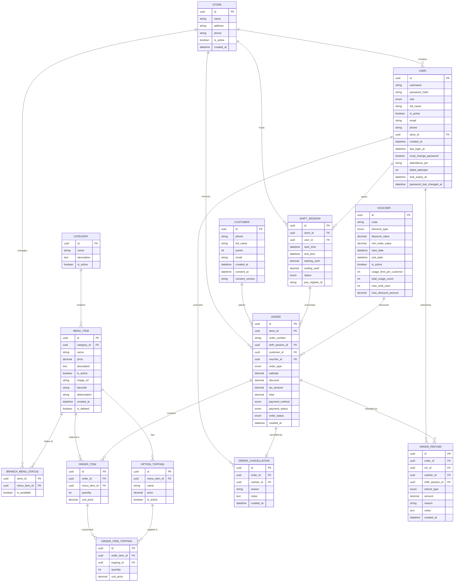
```mermaid
erDiagram
    STORE {
        uuid id PK
        string name
        string address
        string phone
        boolean is_active
        datetime created_at
    }

    USER {
        uuid id PK
        string username
        string password_hash
        enum role
        string full_name
        boolean is_active
        string email
        string phone
        uuid store_id FK
        datetime created_at
        datetime last_login_at
        boolean must_change_password
        string attendance_pin
        int failed_attempts
        datetime lock_expiry_at
        datetime password_last_changed_at
    }

    CATEGORY {
        uuid id PK
        string name
        text description
        boolean is_active
    }

    MENU_ITEM {
        uuid id PK
        uuid category_id FK
        string name
        decimal price
        text description
        boolean is_active
        string image_url
        string barcode
        string abbreviation
        datetime created_at
        boolean is_deleted
    }

    BRANCH_MENU_STATUS {
        uuid store_id PK
        uuid menu_item_id PK
        boolean is_available
    }

    OPTION_TOPPING {
        uuid id PK
        uuid menu_item_id FK
        string name
        decimal price
        boolean is_active
    }

    CUSTOMER {
        uuid id PK
        string phone
        string full_name
        int points
        string email
        datetime created_at
        datetime consent_at
        string consent_version
    }

    SHIFT_SESSION {
        uuid id PK
        uuid store_id FK
        uuid user_id FK
        datetime start_time
        datetime end_time
        decimal starting_cash
        decimal ending_cash
        enum status
        string pos_register_id
    }

    ORDER {
        uuid id PK
        uuid store_id FK
        string order_number
        uuid shift_session_id FK
        uuid customer_id FK
        uuid voucher_id FK
        enum order_type
        decimal subtotal
        decimal discount
        decimal tax_amount
        decimal total
        enum payment_method
        enum payment_status
        enum order_status
        datetime created_at
    }

    ORDER_ITEM {
        uuid id PK
        uuid order_id FK
        uuid menu_item_id FK
        int quantity
        decimal unit_price
    }

    ORDER_ITEM_TOPPING {
        uuid id PK
        uuid order_item_id FK
        uuid topping_id FK
        int quantity
        decimal unit_price
    }

    ORDER_CANCELLATION {
        uuid id PK
        uuid order_id FK
        uuid cashier_id FK
        string reason
        text notes
        datetime created_at
    }

    ORDER_REFUND {
        uuid id PK
        uuid order_id FK
        uuid sm_id FK
        uuid cashier_id FK
        uuid shift_session_id FK
        enum refund_type
        decimal amount
        string reason
        text notes
        datetime created_at
    }

    VOUCHER {
        uuid id PK
        string code
        enum discount_type
        decimal discount_value
        decimal min_order_value
        datetime start_date
        datetime end_date
        boolean is_active
        int usage_limit_per_customer
        int total_usage_count
        int max_total_uses
        decimal max_discount_amount
    }

    %% Relationships
    STORE ||--o{ USER : "contains"
    STORE ||--o{ SHIFT_SESSION : "hosts"
    STORE ||--o{ ORDER : "receives"
    STORE ||--o{ BRANCH_MENU_STATUS : "manages"

    USER ||--o{ SHIFT_SESSION : "opens"
    USER ||--o{ ORDER_CANCELLATION : "executes"
    USER ||--o{ ORDER_REFUND : "authorises"

    CATEGORY ||--o{ MENU_ITEM : "contains"
    MENU_ITEM ||--o{ OPTION_TOPPING : "has"
    MENU_ITEM ||--o{ ORDER_ITEM : "ordered in"
    MENU_ITEM ||--o{ BRANCH_MENU_STATUS : "status at"

    ORDER ||--o{ ORDER_ITEM : "contains"
    ORDER ||--o| ORDER_CANCELLATION : "cancelled by"
    ORDER ||--o{ ORDER_REFUND : "refunded by"
    ORDER_ITEM ||--o{ ORDER_ITEM_TOPPING : "customized"
    OPTION_TOPPING ||--o{ ORDER_ITEM_TOPPING : "applied in"

    CUSTOMER ||--o{ ORDER : "places"
    SHIFT_SESSION ||--o{ ORDER : "processes"
    VOUCHER ||--o{ ORDER : "discounts"
```

### **2.2. Operations, Staffing & Audit ERD**

*\[This diagram focuses on inventory management, recipe formulation for items/toppings, staff schedules, attendance tracking, and system audit logs.\]*

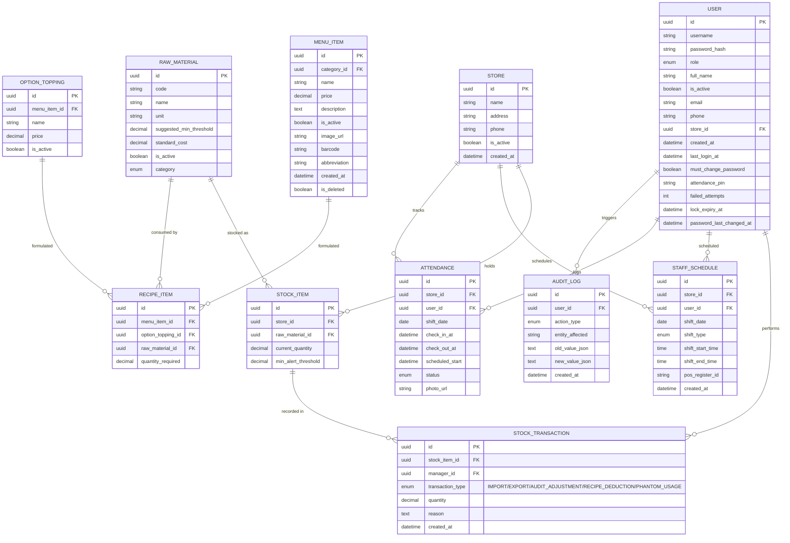
```mermaid
erDiagram
    STORE {
        uuid id PK
        string name
        string address
        string phone
        boolean is_active
        datetime created_at
    }

    USER {
        uuid id PK
        string username
        string password_hash
        enum role
        string full_name
        boolean is_active
        string email
        string phone
        uuid store_id FK
        datetime created_at
        datetime last_login_at
        boolean must_change_password
        string attendance_pin
        int failed_attempts
        datetime lock_expiry_at
        datetime password_last_changed_at
    }

    RAW_MATERIAL {
        uuid id PK
        string code
        string name
        string unit
        decimal suggested_min_threshold
        decimal standard_cost
        boolean is_active
        enum category
    }

    STOCK_ITEM {
        uuid id PK
        uuid store_id FK
        uuid raw_material_id FK
        decimal current_quantity
        decimal min_alert_threshold
    }

    STOCK_TRANSACTION {
        uuid id PK
        uuid stock_item_id FK
        uuid manager_id FK
        enum transaction_type "IMPORT/EXPORT/AUDIT_ADJUSTMENT/RECIPE_DEDUCTION/PHANTOM_USAGE"
        decimal quantity
        text reason
        datetime created_at
    }

    RECIPE_ITEM {
        uuid id PK
        uuid menu_item_id FK
        uuid option_topping_id FK
        uuid raw_material_id FK
        decimal quantity_required
    }

    MENU_ITEM {
        uuid id PK
        uuid category_id FK
        string name
        decimal price
        text description
        boolean is_active
        string image_url
        string barcode
        string abbreviation
        datetime created_at
        boolean is_deleted
    }

    OPTION_TOPPING {
        uuid id PK
        uuid menu_item_id FK
        string name
        decimal price
        boolean is_active
    }

    STAFF_SCHEDULE {
        uuid id PK
        uuid store_id FK
        uuid user_id FK
        date shift_date
        enum shift_type
        time shift_start_time
        time shift_end_time
        string pos_register_id
        datetime created_at
    }

    ATTENDANCE {
        uuid id PK
        uuid store_id FK
        uuid user_id FK
        date shift_date
        datetime check_in_at
        datetime check_out_at
        datetime scheduled_start
        enum status
        string photo_url
    }

    AUDIT_LOG {
        uuid id PK
        uuid user_id FK
        enum action_type
        string entity_affected
        text old_value_json
        text new_value_json
        datetime created_at
    }

    %% Relationships
    STORE ||--o{ STOCK_ITEM : "holds"
    STORE ||--o{ STAFF_SCHEDULE : "schedules"
    STORE ||--o{ ATTENDANCE : "tracks"

    USER ||--o{ STOCK_TRANSACTION : "performs"
    USER ||--o{ STAFF_SCHEDULE : "scheduled"
    USER ||--o{ ATTENDANCE : "logs"
    USER ||--o{ AUDIT_LOG : "triggers"

    RAW_MATERIAL ||--o{ STOCK_ITEM : "stocked as"
    RAW_MATERIAL ||--o{ RECIPE_ITEM : "consumed by"
    STOCK_ITEM ||--o{ STOCK_TRANSACTION : "recorded in"

    MENU_ITEM ||--o{ RECIPE_ITEM : "formulated"
    OPTION_TOPPING ||--o{ RECIPE_ITEM : "formulated"
```

***Table Descriptions***

| No | Table | Description |
| :---- | :---- | :---- |
| 01 | users | Stores login credentials, RBAC roles, and attendance PIN for check-in/out (BR-93). attendance_pin must be unique per store (store_id). Key definitions: PK is id (UUID); FK is store_id → stores(id) |
| 02 | categories | Main food and beverage product groupings (e.g., Coffee, Tea, Pastry). Used to organize the menu catalog chain-wide. Key definitions: PK is id (UUID) |
| 03 | menu_items | Individual beverage/food catalog listings with pricing, barcodes, chain-wide active status, and image references. Soft-delete supported via is_deleted flag. Key definitions: PK is id (UUID); FK is category_id → categories(id) |
| 04 | branch_menu_status | Per-branch item availability toggle. Allows Store Manager to temporarily disable items locally without affecting other branches. Key definitions: PK is (store_id, menu_item_id) — composite; FK is store_id → stores(id), menu_item_id → menu_items(id) |
| 05 | option_toppings | Customizable add-ons for menu items (e.g., Extra Shot, Oat Milk, Tapioca Pearls). Each topping has a price and may have a recipe formula. Key definitions: PK is id (UUID); FK is menu_item_id → menu_items(id) |
| 06 | customers | Loyalty membership registry tracking points balance. Includes PDPA consent timestamp (consent_at) and consent version (consent_version) (BR-71). Key definitions: PK is id (UUID) |
| 07 | shift_sessions | POS cashier work session records including opening/closing cash float, discrepancy, and shift status (OPEN / CLOSED). Key definitions: PK is id (UUID); FK is store_id → stores(id), user_id → users(id) |
| 08 | orders | Sales transaction records linking customer, shift, voucher, payment status, and fulfillment status (7 states: PENDING / PREPARING / HOLD / READY / COMPLETED / CANCELLED / ABANDONED). Key definitions: PK is id (UUID); FK is store_id → stores(id), shift_session_id → shift_sessions(id), customer_id → customers(id), voucher_id → vouchers(id) |
| 09 | order_items | Line items of each order with quantity and unit price snapshot at time of sale. Key definitions: PK is id (UUID); FK is order_id → orders(id), menu_item_id → menu_items(id) |
| 10 | order_item_toppings | Toppings applied to specific order line items, with quantity and price snapshot at time of sale. Key definitions: PK is id (UUID); FK is order_item_id → order_items(id), topping_id → option_toppings(id) |
| 11 | order_cancellations | Immutable audit log for PENDING order cancellations (BR-05). Records the cashier, reason code, and notes. One record per cancelled order. Key definitions: PK is id (UUID); FK is order_id → orders(id) UNIQUE, cashier_id → users(id) |
| 12 | order_refunds | Store-Manager authorized refund/comp audit log for post-PENDING complaints (UC-75, BR-67). Supports REFUND and COMP_REMAKE types, partial refund amounts. Key definitions: PK is id (UUID); FK is order_id → orders(id), sm_id → users(id), cashier_id → users(id), shift_session_id → shift_sessions(id) |
| 13 | raw_materials | Chain-wide master catalog of ingredients/materials owned exclusively by Business Admin (UC-74). The canonical source for recipe formulations and branch stock dropdowns. Supports soft-delete. Key definitions: PK is id (UUID) |
| 14 | stock_items | Per-branch on-hand quantity of a master raw material. Scoped to one store. Unique constraint on (store_id, raw_material_id). Key definitions: PK is id (UUID); FK is store_id → stores(id), raw_material_id → raw_materials(id) |
| 15 | stock_transactions | Historical ledger of all stock movements: IMPORT, EXPORT, AUDIT_ADJUSTMENT, RECIPE_DEDUCTION, PHANTOM_USAGE. System recipe deductions and phantom usage transactions have null manager_id. Key definitions: PK is id (UUID); FK is stock_item_id → stock_items(id), manager_id → users(id) |
| 16 | vouchers | Promotional discount codes with type (PERCENTAGE / FIXED_AMOUNT), usage limits per customer and total, validity dates, and cap amount for percentage discounts. Key definitions: PK is id (UUID) |
| 17 | recipe_items | Ingredient formula defining how much of a raw material is consumed to produce one unit of a menu item or topping. Exactly one of menu_item_id or option_topping_id is non-null. Key definitions: PK is id (UUID); FK is menu_item_id → menu_items(id), option_topping_id → option_toppings(id), raw_material_id → raw_materials(id) |
| 18 | stores | Physical branch locations with name, address, phone, and active status. Root entity that many other entities reference. Key definitions: PK is id (UUID) |
| 19 | staff_schedules | Assigned employee shift blocks (MORNING / AFTERNOON / FULL_DAY) per date and branch. Includes shift_start_time, shift_end_time, and optional pos_register_id allocation. Key definitions: PK is id (UUID); FK is store_id → stores(id), user_id → users(id) |
| 20 | attendance_logs | Employee clock-in/out records. At check-in, system snapshots scheduled_start (shift start time) to calculate lateness dynamically at the reporting layer; lateness is not stored in the database. Mandatory check-in photo_path stored server-side. PDPA: auto-purged after 90 days (BR-72). Key definitions: PK is id (UUID); FK is store_id → stores(id), user_id → users(id) |
| 21 | audit_logs | Immutable security event log (append-only, no UPDATE / DELETE permitted). Records price changes, voucher mutations, user account changes, checkout voucher/point usage. Key definitions: PK is id (UUID); FK is user_id → users(id) |

> **NOTE — Central configuration (`SystemConfig`):** Central parameters edited via UC-30 (tax rate BR-45, loyalty params BR-94, `MAX_ACTIVE_BRANCHES` BR-54, VietQR credentials, etc.) are persisted in an **infrastructure-level key-value store** (`config_key` / `config_value` / `scope` / `store_id` / `updated_by` / `updated_at`). This is **intentionally kept outside the 21-entity business ERD** above; it is referenced by the detailed designs in §3.7 and §3.11 as the `SystemConfig` «entity». The 21-table count therefore covers only the core business domain.

## **3\. Detailed Design**

### **3.1 System Access & Security**

*\[Provide the detailed design for System Access & Security, covering UC-01→UC-09 (Authentication, MFA, Forgot Password, Force Password Change, Profile Management). Actor: User (all 6 roles). For features with the same class structure, the class diagram is provided once and referenced from related features. The class diagram below covers UC-01→UC-09 collectively; each sequence diagram covers one specific use case flow.\]*

#### ***3.1.1 Class Diagram***

*\[This part presents the class diagram for the System Access & Security feature. COMET stereotypes applied: LoginForm, MfaChallengeForm, ForgotPasswordForm, OtpVerificationForm, SetNewPasswordForm, ForcePasswordChangeForm, ProfileView, EditProfileForm, ChangePasswordForm («boundary»), EmailServiceProxy («boundary» external); AuthenticationCoordinator, ProfileCoordinator («control»); PasswordPolicyValidator («application logic»); OtpExpiryTimer («timer»); User («entity»).\]*

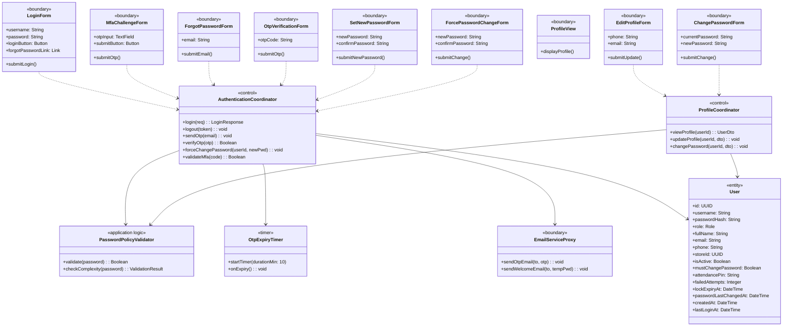
```mermaid
classDiagram
    class LoginForm {
        <<boundary>>
        +username: String
        +password: String
        +loginButton: Button
        +forgotPasswordLink: Link
        +submitLogin()
    }
    class MfaChallengeForm {
        <<boundary>>
        +otpInput: TextField
        +submitButton: Button
        +submitOtp()
    }
    class ForgotPasswordForm {
        <<boundary>>
        +email: String
        +submitEmail()
    }
    class OtpVerificationForm {
        <<boundary>>
        +otpCode: String
        +submitOtp()
    }
    class SetNewPasswordForm {
        <<boundary>>
        +newPassword: String
        +confirmPassword: String
        +submitNewPassword()
    }
    class ForcePasswordChangeForm {
        <<boundary>>
        +newPassword: String
        +confirmPassword: String
        +submitChange()
    }
    class ProfileView {
        <<boundary>>
        +displayProfile()
    }
    class EditProfileForm {
        <<boundary>>
        +phone: String
        +email: String
        +submitUpdate()
    }
    class ChangePasswordForm {
        <<boundary>>
        +currentPassword: String
        +newPassword: String
        +submitChange()
    }
    class AuthenticationCoordinator {
        <<control>>
        +login(req): LoginResponse
        +logout(token): void
        +sendOtp(email): void
        +verifyOtp(otp): Boolean
        +forceChangePassword(userId, newPwd): void
        +validateMfa(code): Boolean
    }
    class ProfileCoordinator {
        <<control>>
        +viewProfile(userId): UserDto
        +updateProfile(userId, dto): void
        +changePassword(userId, dto): void
    }
    class PasswordPolicyValidator {
        <<application logic>>
        +validate(password): Boolean
        +checkComplexity(password): ValidationResult
    }
    class OtpExpiryTimer {
        <<timer>>
        +startTimer(durationMin: 10)
        +onExpiry(): void
    }
    class EmailServiceProxy {
        <<boundary>>
        +sendOtpEmail(to, otp): void
        +sendWelcomeEmail(to, tempPwd): void
    }
    class User {
        <<entity>>
        +id: UUID
        +username: String
        +passwordHash: String
        +role: Role
        +fullName: String
        +email: String
        +phone: String
        +storeId: UUID
        +isActive: Boolean
        +mustChangePassword: Boolean
        +attendancePin: String
        +failedAttempts: Integer
        +lockExpiryAt: DateTime
        +passwordLastChangedAt: DateTime
        +createdAt: DateTime
        +lastLoginAt: DateTime
    }

    LoginForm ..> AuthenticationCoordinator
    MfaChallengeForm ..> AuthenticationCoordinator
    ForgotPasswordForm ..> AuthenticationCoordinator
    OtpVerificationForm ..> AuthenticationCoordinator
    SetNewPasswordForm ..> AuthenticationCoordinator
    ForcePasswordChangeForm ..> AuthenticationCoordinator
    EditProfileForm ..> ProfileCoordinator
    ChangePasswordForm ..> ProfileCoordinator
    AuthenticationCoordinator --> PasswordPolicyValidator
    AuthenticationCoordinator --> OtpExpiryTimer
    AuthenticationCoordinator --> EmailServiceProxy
    AuthenticationCoordinator --> User
    ProfileCoordinator --> PasswordPolicyValidator
    ProfileCoordinator --> User
```

#### ***3.1.2 UC-01 Login (including MFA for HQ Roles)***

*\[Describes the login flow. HQ roles (ceoviewer, businessadmin, ssadmin) require MFA via email OTP after password verification (BR-83). Branch roles (storemanager, cashier, barista) login with username/password only. After successful login, if must_change_password = true, user is redirected to Force Password Change screen (UC-06).\]*

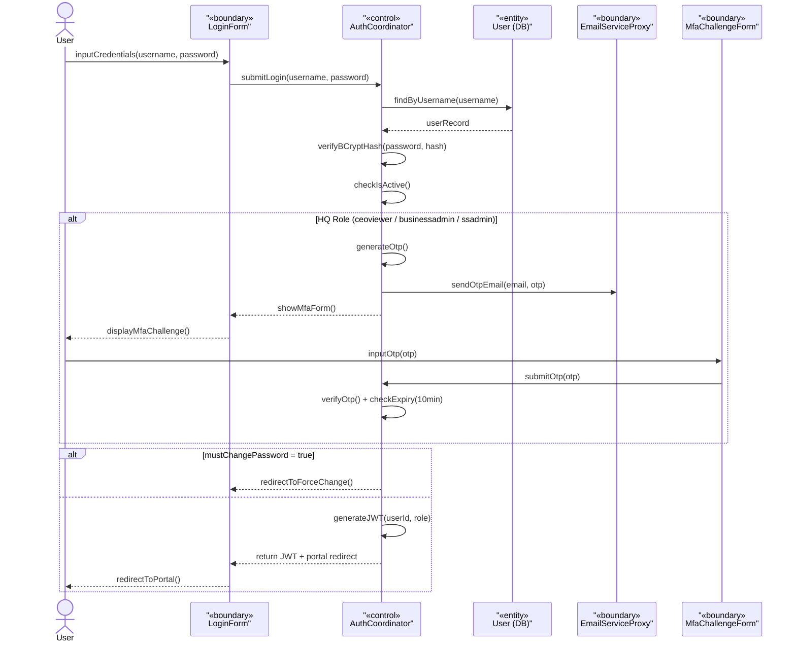
```mermaid
sequenceDiagram
    actor User
participant LoginForm as "«boundary»<br/>LoginForm"
participant AuthCoordinator as "«control»<br/>AuthCoordinator"
participant UserDB as "«entity»<br/>User (DB)"
participant EmailSvc as "«boundary»<br/>EmailServiceProxy"
participant MfaForm as "«boundary»<br/>MfaChallengeForm"

    User->>LoginForm: inputCredentials(username, password)
    LoginForm->>AuthCoordinator: submitLogin(username, password)
    AuthCoordinator->>UserDB: findByUsername(username)
    UserDB-->>AuthCoordinator: userRecord
    AuthCoordinator->>AuthCoordinator: verifyBCryptHash(password, hash)
    AuthCoordinator->>AuthCoordinator: checkIsActive()

    alt HQ Role (ceoviewer / businessadmin / ssadmin)
        AuthCoordinator->>AuthCoordinator: generateOtp()
        AuthCoordinator->>EmailSvc: sendOtpEmail(email, otp)
        AuthCoordinator-->>LoginForm: showMfaForm()
        LoginForm-->>User: displayMfaChallenge()

        User->>MfaForm: inputOtp(otp)
        MfaForm->>AuthCoordinator: submitOtp(otp)
        AuthCoordinator->>AuthCoordinator: verifyOtp() + checkExpiry(10min)
    end

    alt mustChangePassword = true
        AuthCoordinator-->>LoginForm: redirectToForceChange()
    else
        AuthCoordinator->>AuthCoordinator: generateJWT(userId, role)
        AuthCoordinator-->>LoginForm: return JWT + portal redirect
        LoginForm-->>User: redirectToPortal()
    end
```

#### ***3.1.3 UC-03/04/05 Forgot Password → OTP → Reset Password***

*\[Describes the password recovery flow. User submits registered email → system generates OTP and sends via email → OTP timer set to 10 minutes (BR-16) → user verifies OTP → user sets new password meeting complexity policy.\]*

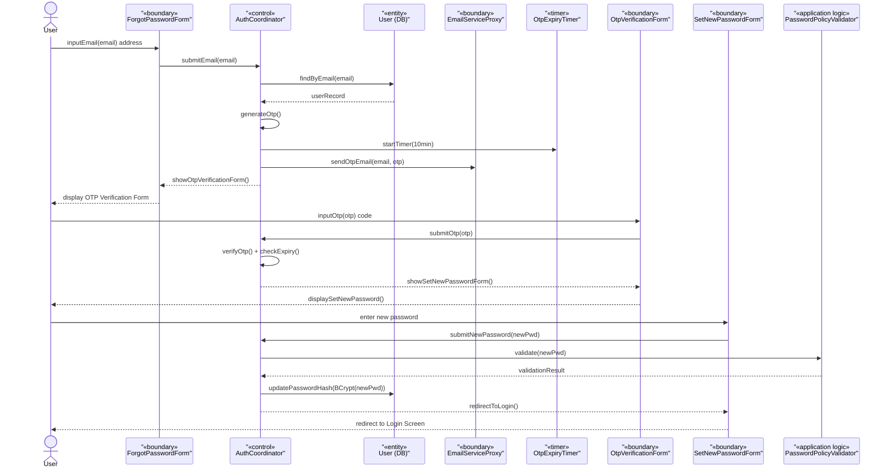
```mermaid
sequenceDiagram
    actor User
participant ForgotForm as "«boundary»<br/>ForgotPasswordForm"
participant AuthCoordinator as "«control»<br/>AuthCoordinator"
participant UserDB as "«entity»<br/>User (DB)"
participant EmailSvc as "«boundary»<br/>EmailServiceProxy"
participant OtpTimer as "«timer»<br/>OtpExpiryTimer"
participant OtpForm as "«boundary»<br/>OtpVerificationForm"
participant SetPassForm as "«boundary»<br/>SetNewPasswordForm"
participant Validator as "«application logic»<br/>PasswordPolicyValidator"

    User->>ForgotForm: inputEmail(email) address
    ForgotForm->>AuthCoordinator: submitEmail(email)
    AuthCoordinator->>UserDB: findByEmail(email)
    UserDB-->>AuthCoordinator: userRecord
    AuthCoordinator->>AuthCoordinator: generateOtp()
    AuthCoordinator->>OtpTimer: startTimer(10min)
    AuthCoordinator->>EmailSvc: sendOtpEmail(email, otp)
    AuthCoordinator-->>ForgotForm: showOtpVerificationForm()
    ForgotForm-->>User: display OTP Verification Form

    User->>OtpForm: inputOtp(otp) code
    OtpForm->>AuthCoordinator: submitOtp(otp)
    AuthCoordinator->>AuthCoordinator: verifyOtp() + checkExpiry()
    AuthCoordinator-->>OtpForm: showSetNewPasswordForm()
    OtpForm-->>User: displaySetNewPassword()

    User->>SetPassForm: enter new password
    SetPassForm->>AuthCoordinator: submitNewPassword(newPwd)
    AuthCoordinator->>Validator: validate(newPwd)
    Validator-->>AuthCoordinator: validationResult
    AuthCoordinator->>UserDB: updatePasswordHash(BCrypt(newPwd))
    AuthCoordinator-->>SetPassForm: redirectToLogin()
    SetPassForm-->>User: redirect to Login Screen
```

#### ***3.1.4 UC-06 Force Password Change (First Login)***

*\[When must_change_password = true (set on account creation by ssadmin), the user is redirected to Force Password Change screen immediately after first login. The user cannot access the portal until they complete this step.\]*

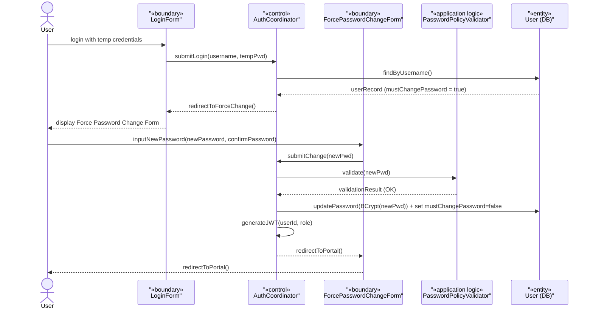
```mermaid
sequenceDiagram
    actor User
participant LoginForm as "«boundary»<br/>LoginForm"
participant AuthCoordinator as "«control»<br/>AuthCoordinator"
participant ForceChangeForm as "«boundary»<br/>ForcePasswordChangeForm"
participant Validator as "«application logic»<br/>PasswordPolicyValidator"
participant UserDB as "«entity»<br/>User (DB)"

    User->>LoginForm: login with temp credentials
    LoginForm->>AuthCoordinator: submitLogin(username, tempPwd)
    AuthCoordinator->>UserDB: findByUsername()
    UserDB-->>AuthCoordinator: userRecord (mustChangePassword = true)
    AuthCoordinator-->>LoginForm: redirectToForceChange()
    LoginForm-->>User: display Force Password Change Form

    User->>ForceChangeForm: inputNewPassword(newPassword, confirmPassword)
    ForceChangeForm->>AuthCoordinator: submitChange(newPwd)
    AuthCoordinator->>Validator: validate(newPwd)
    Validator-->>AuthCoordinator: validationResult (OK)
    AuthCoordinator->>UserDB: updatePassword(BCrypt(newPwd)) + set mustChangePassword=false
    AuthCoordinator->>AuthCoordinator: generateJWT(userId, role)
    AuthCoordinator-->>ForceChangeForm: redirectToPortal()
    ForceChangeForm-->>User: redirectToPortal()
```

#### ***3.1.5 UC-07/08/09 View Profile / Update Profile / Change Password***

*\[Profile management use cases share the ProfileCoordinator. All roles can view and update their own contact information. Change Password requires the current password for identity verification before allowing the update.\]*

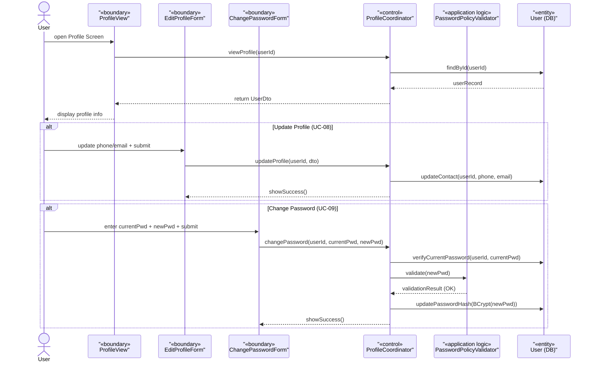
```mermaid
sequenceDiagram
    actor User
participant ProfileView as "«boundary»<br/>ProfileView"
participant EditProfileForm as "«boundary»<br/>EditProfileForm"
participant ChangePassForm as "«boundary»<br/>ChangePasswordForm"
participant ProfileCoordinator as "«control»<br/>ProfileCoordinator"
participant Validator as "«application logic»<br/>PasswordPolicyValidator"
participant UserDB as "«entity»<br/>User (DB)"

    User->>ProfileView: open Profile Screen
    ProfileView->>ProfileCoordinator: viewProfile(userId)
    ProfileCoordinator->>UserDB: findById(userId)
    UserDB-->>ProfileCoordinator: userRecord
    ProfileCoordinator-->>ProfileView: return UserDto
    ProfileView-->>User: display profile info

    alt Update Profile (UC-08)
        User->>EditProfileForm: update phone/email + submit
        EditProfileForm->>ProfileCoordinator: updateProfile(userId, dto)
        ProfileCoordinator->>UserDB: updateContact(userId, phone, email)
        ProfileCoordinator-->>EditProfileForm: showSuccess()
    end

    alt Change Password (UC-09)
        User->>ChangePassForm: enter currentPwd + newPwd + submit
        ChangePassForm->>ProfileCoordinator: changePassword(userId, currentPwd, newPwd)
        ProfileCoordinator->>UserDB: verifyCurrentPassword(userId, currentPwd)
        ProfileCoordinator->>Validator: validate(newPwd)
        Validator-->>ProfileCoordinator: validationResult (OK)
        ProfileCoordinator->>UserDB: updatePasswordHash(BCrypt(newPwd))
        ProfileCoordinator-->>ChangePassForm: showSuccess()
    end
```

#### ***3.1.6 USER Account Statechart***

*\[The User account lifecycle has 4 states. The CREATED state forces a password change on first login. ACTIVE is the normal operational state. LOCKED occurs after 5 consecutive failed login attempts and is a time-bound 15-minute suspension that auto-clears (BR-11); an ssadmin may also unlock manually. INACTIVE results from manual deactivation by ssadmin or storemanager (own branch staff only).\]*

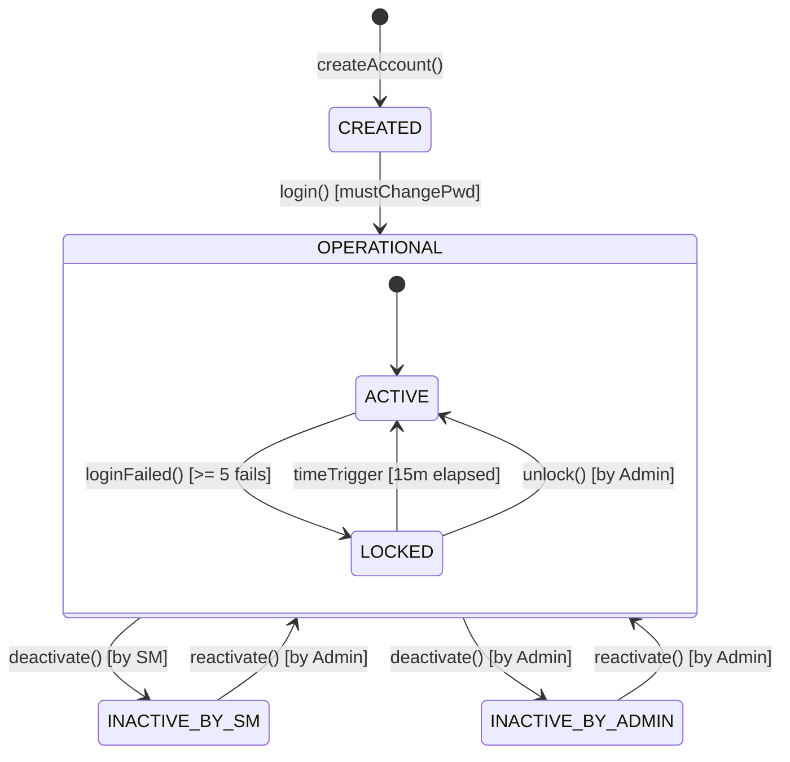
```mermaid
stateDiagram-v2
    [*] --> CREATED : createAccount()

    CREATED --> OPERATIONAL : login() [mustChangePwd]

    state OPERATIONAL {
        [*] --> ACTIVE
        ACTIVE --> LOCKED : loginFailed() [>= 5 fails]
        LOCKED --> ACTIVE : timeTrigger [15m elapsed]
        LOCKED --> ACTIVE : unlock() [by Admin]
    }

    OPERATIONAL --> INACTIVE_BY_SM : deactivate() [by SM]
    OPERATIONAL --> INACTIVE_BY_ADMIN : deactivate() [by Admin]

    INACTIVE_BY_SM --> OPERATIONAL : reactivate() [by Admin]
    INACTIVE_BY_ADMIN --> OPERATIONAL : reactivate() [by Admin]
```

### **3.2 User Account Management**

*\[Provide the detailed design for User Account Management, covering UC-10→UC-14 (View User List, Add User, Update User, View User Detail, Deactivate/Reactivate User). Actor: ssadmin. The class diagram covers all user management use cases. Sequence diagrams cover the Add User and Update/Deactivate User flows.\]*

#### ***3.2.1 Class Diagram***

*\[Class diagram for User Account Management. COMET stereotypes: UserListView, AddUserForm, EditUserForm, UserDetailView («boundary»); UserManagementCoordinator («control»); PasswordPolicyValidator («application logic»); User, Store, AuditLog («entity»); EmailServiceProxy («boundary» external).\]*

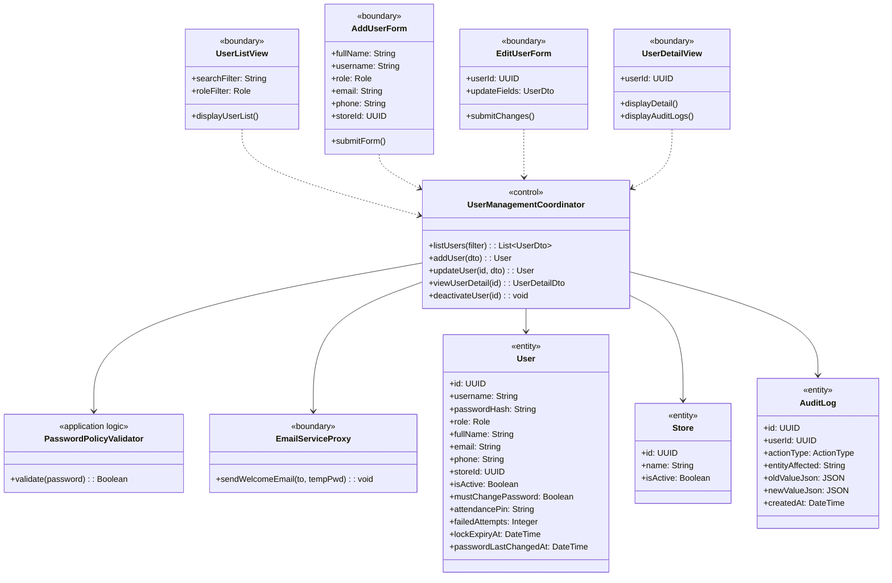
```mermaid
classDiagram
    class UserListView {
        <<boundary>>
        +searchFilter: String
        +roleFilter: Role
        +displayUserList()
    }
    class AddUserForm {
        <<boundary>>
        +fullName: String
        +username: String
        +role: Role
        +email: String
        +phone: String
        +storeId: UUID
        +submitForm()
    }
    class EditUserForm {
        <<boundary>>
        +userId: UUID
        +updateFields: UserDto
        +submitChanges()
    }
    class UserDetailView {
        <<boundary>>
        +userId: UUID
        +displayDetail()
        +displayAuditLogs()
    }
    class UserManagementCoordinator {
        <<control>>
        +listUsers(filter): List~UserDto~
        +addUser(dto): User
        +updateUser(id, dto): User
        +viewUserDetail(id): UserDetailDto
        +deactivateUser(id): void
    }
    class PasswordPolicyValidator {
        <<application logic>>
        +validate(password): Boolean
    }
    class EmailServiceProxy {
        <<boundary>>
        +sendWelcomeEmail(to, tempPwd): void
    }
    class User {
        <<entity>>
        +id: UUID
        +username: String
        +passwordHash: String
        +role: Role
        +fullName: String
        +email: String
        +phone: String
        +storeId: UUID
        +isActive: Boolean
        +mustChangePassword: Boolean
        +attendancePin: String
        +failedAttempts: Integer
        +lockExpiryAt: DateTime
        +passwordLastChangedAt: DateTime
    }
    class Store {
        <<entity>>
        +id: UUID
        +name: String
        +isActive: Boolean
    }
    class AuditLog {
        <<entity>>
        +id: UUID
        +userId: UUID
        +actionType: ActionType
        +entityAffected: String
        +oldValueJson: JSON
        +newValueJson: JSON
        +createdAt: DateTime
    }

    UserListView ..> UserManagementCoordinator
    AddUserForm ..> UserManagementCoordinator
    EditUserForm ..> UserManagementCoordinator
    UserDetailView ..> UserManagementCoordinator
    UserManagementCoordinator --> PasswordPolicyValidator
    UserManagementCoordinator --> EmailServiceProxy
    UserManagementCoordinator --> User
    UserManagementCoordinator --> Store
    UserManagementCoordinator --> AuditLog
```

#### ***3.2.2 UC-11 Add User Account***

*\[ssadmin creates a new employee account. System auto-generates a temporary password, sends a welcome email with the temporary password, sets mustChangePassword = true, and writes an audit log entry (BR-81).\]*

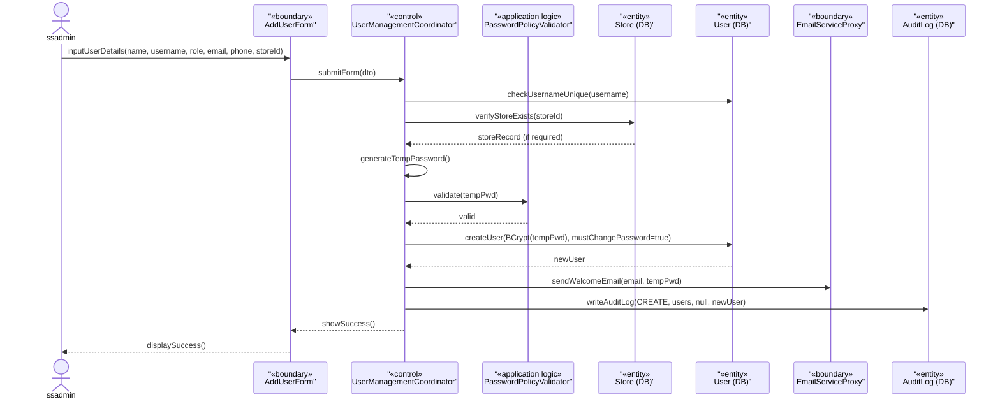
```mermaid
sequenceDiagram
    actor ssadmin
    participant AddForm as "«boundary»<br/>AddUserForm"
    participant UserMgmtCoord as "«control»<br/>UserManagementCoordinator"
    participant Validator as "«application logic»<br/>PasswordPolicyValidator"
    participant StoreDB as "«entity»<br/>Store (DB)"
    participant UserDB as "«entity»<br/>User (DB)"
    participant EmailSvc as "«boundary»<br/>EmailServiceProxy"
    participant AuditDB as "«entity»<br/>AuditLog (DB)"

    ssadmin->>AddForm: inputUserDetails(name, username, role, email, phone, storeId)
    AddForm->>UserMgmtCoord: submitForm(dto)
    UserMgmtCoord->>UserDB: checkUsernameUnique(username)
    UserMgmtCoord->>StoreDB: verifyStoreExists(storeId)
    StoreDB-->>UserMgmtCoord: storeRecord (if required)
    UserMgmtCoord->>UserMgmtCoord: generateTempPassword()
    UserMgmtCoord->>Validator: validate(tempPwd)
    Validator-->>UserMgmtCoord: valid
    UserMgmtCoord->>UserDB: createUser(BCrypt(tempPwd), mustChangePassword=true)
    UserDB-->>UserMgmtCoord: newUser
    UserMgmtCoord->>EmailSvc: sendWelcomeEmail(email, tempPwd)
    UserMgmtCoord->>AuditDB: writeAuditLog(CREATE, users, null, newUser)
    UserMgmtCoord-->>AddForm: showSuccess()
    AddForm-->>ssadmin: displaySuccess()
```

#### ***3.2.3 UC-12/UC-14 Update / Deactivate User Account***

*\[ssadmin updates user profile details or deactivates an account. Self-role escalation is blocked (BR-82): ssadmin cannot elevate their own role. An audit log is written for every change (BR-81). Deactivated users cannot login.\]*

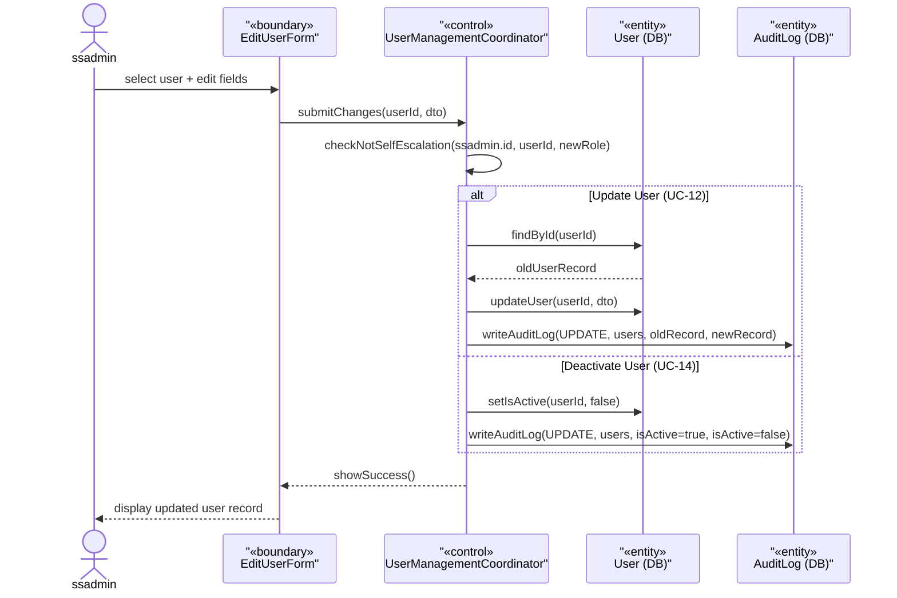
```mermaid
sequenceDiagram
    actor ssadmin
    participant EditForm as "«boundary»<br/>EditUserForm"
    participant UserMgmtCoord as "«control»<br/>UserManagementCoordinator"
    participant UserDB as "«entity»<br/>User (DB)"
    participant AuditDB as "«entity»<br/>AuditLog (DB)"

    ssadmin->>EditForm: select user + edit fields
    EditForm->>UserMgmtCoord: submitChanges(userId, dto)
    UserMgmtCoord->>UserMgmtCoord: checkNotSelfEscalation(ssadmin.id, userId, newRole)

    alt Update User (UC-12)
        UserMgmtCoord->>UserDB: findById(userId)
        UserDB-->>UserMgmtCoord: oldUserRecord
        UserMgmtCoord->>UserDB: updateUser(userId, dto)
        UserMgmtCoord->>AuditDB: writeAuditLog(UPDATE, users, oldRecord, newRecord)
    else Deactivate User (UC-14)
        UserMgmtCoord->>UserDB: setIsActive(userId, false)
        UserMgmtCoord->>AuditDB: writeAuditLog(UPDATE, users, isActive=true, isActive=false)
    end

    UserMgmtCoord-->>EditForm: showSuccess()
    EditForm-->>ssadmin: display updated user record
```

### **3.3 Menu & Category Management**

*\[Provide the detailed design for Menu & Category Management, covering UC-15→UC-19, UC-68→UC-74 (View/Add/Update/Delete Menu Items, Categories, Toppings, Raw Material Master, Recipe Management, Branch Availability Toggle). Actors: businessadmin (chain-wide catalog CRUD), storemanager (local branch availability toggle via branch_menu_status). For features with the same class structure, the class diagram is provided once.\]*

#### ***3.3.1 Class Diagram***

*\[Class diagram for Menu & Category Management. COMET stereotypes: MenuCategoryView, AddMenuItemForm, EditMenuItemForm, AddCategoryForm, RawMaterialMasterView («boundary»); CatalogCoordinator («control»); MenuItem, Category, OptionTopping, RecipeItem, RawMaterial, BranchMenuStatus, AuditLog («entity»).\]*

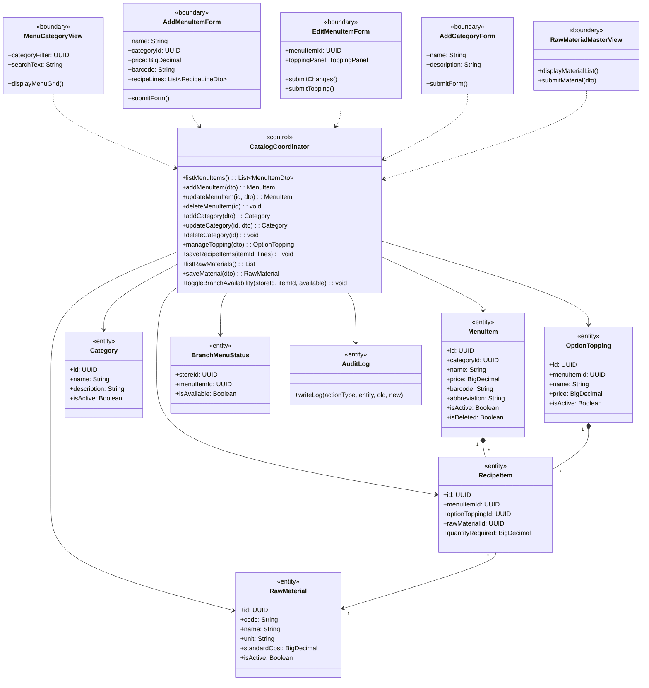
```mermaid
classDiagram
    class MenuCategoryView {
        <<boundary>>
        +categoryFilter: UUID
        +searchText: String
        +displayMenuGrid()
    }
    class AddMenuItemForm {
        <<boundary>>
        +name: String
        +categoryId: UUID
        +price: BigDecimal
        +barcode: String
        +recipeLines: List~RecipeLineDto~
        +submitForm()
    }
    class EditMenuItemForm {
        <<boundary>>
        +menuItemId: UUID
        +toppingPanel: ToppingPanel
        +submitChanges()
        +submitTopping()
    }
    class AddCategoryForm {
        <<boundary>>
        +name: String
        +description: String
        +submitForm()
    }
    class RawMaterialMasterView {
        <<boundary>>
        +displayMaterialList()
        +submitMaterial(dto)
    }
    class CatalogCoordinator {
        <<control>>
        +listMenuItems(): List~MenuItemDto~
        +addMenuItem(dto): MenuItem
        +updateMenuItem(id, dto): MenuItem
        +deleteMenuItem(id): void
        +addCategory(dto): Category
        +updateCategory(id, dto): Category
        +deleteCategory(id): void
        +manageTopping(dto): OptionTopping
        +saveRecipeItems(itemId, lines): void
        +listRawMaterials(): List
        +saveMaterial(dto): RawMaterial
        +toggleBranchAvailability(storeId, itemId, available): void
    }
    class MenuItem {
        <<entity>>
        +id: UUID
        +categoryId: UUID
        +name: String
        +price: BigDecimal
        +barcode: String
        +abbreviation: String
        +isActive: Boolean
        +isDeleted: Boolean
    }
    class Category {
        <<entity>>
        +id: UUID
        +name: String
        +description: String
        +isActive: Boolean
    }
    class OptionTopping {
        <<entity>>
        +id: UUID
        +menuItemId: UUID
        +name: String
        +price: BigDecimal
        +isActive: Boolean
    }
    class RecipeItem {
        <<entity>>
        +id: UUID
        +menuItemId: UUID
        +optionToppingId: UUID
        +rawMaterialId: UUID
        +quantityRequired: BigDecimal
    }
    class RawMaterial {
        <<entity>>
        +id: UUID
        +code: String
        +name: String
        +unit: String
        +standardCost: BigDecimal
        +isActive: Boolean
    }
    class BranchMenuStatus {
        <<entity>>
        +storeId: UUID
        +menuItemId: UUID
        +isAvailable: Boolean
    }
    class AuditLog {
        <<entity>>
        +writeLog(actionType, entity, old, new)
    }

    MenuCategoryView ..> CatalogCoordinator
    AddMenuItemForm ..> CatalogCoordinator
    EditMenuItemForm ..> CatalogCoordinator
    AddCategoryForm ..> CatalogCoordinator
    RawMaterialMasterView ..> CatalogCoordinator
    CatalogCoordinator --> MenuItem
    CatalogCoordinator --> Category
    CatalogCoordinator --> OptionTopping
    CatalogCoordinator --> RecipeItem
    CatalogCoordinator --> RawMaterial
    CatalogCoordinator --> BranchMenuStatus
    CatalogCoordinator --> AuditLog
    RecipeItem "*" --> "1" RawMaterial
    MenuItem "1" *-- "*" RecipeItem
    OptionTopping "1" *-- "*" RecipeItem
```

#### ***3.3.2 UC-18 Add Menu Item with Recipe Formula***

*\[businessadmin creates a new menu item and links its raw material recipe formula. System validates barcode uniqueness and recipe unit consistency (BR-73) before saving. Price change triggers an audit log entry (BR-68).\]*

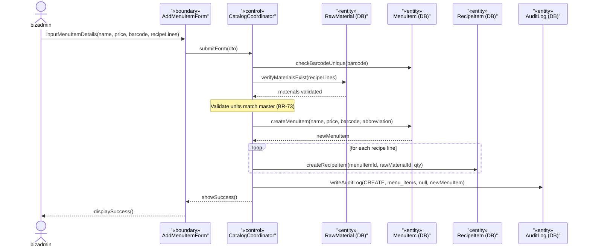
```mermaid
sequenceDiagram
    actor bizadmin
participant AddForm as "«boundary»<br/>AddMenuItemForm"
participant CatalogCoord as "«control»<br/>CatalogCoordinator"
participant RawMatDB as "«entity»<br/>RawMaterial (DB)"
participant MenuDB as "«entity»<br/>MenuItem (DB)"
participant RecipeDB as "«entity»<br/>RecipeItem (DB)"
participant AuditDB as "«entity»<br/>AuditLog (DB)"

    bizadmin->>AddForm: inputMenuItemDetails(name, price, barcode, recipeLines)
    AddForm->>CatalogCoord: submitForm(dto)
    CatalogCoord->>MenuDB: checkBarcodeUnique(barcode)
    CatalogCoord->>RawMatDB: verifyMaterialsExist(recipeLines)
    RawMatDB-->>CatalogCoord: materials validated
    Note over CatalogCoord: Validate units match master (BR-73)
    CatalogCoord->>MenuDB: createMenuItem(name, price, barcode, abbreviation)
    MenuDB-->>CatalogCoord: newMenuItem
    loop for each recipe line
        CatalogCoord->>RecipeDB: createRecipeItem(menuItemId, rawMaterialId, qty)
    end
    CatalogCoord->>AuditDB: writeAuditLog(CREATE, menu_items, null, newMenuItem)
    CatalogCoord-->>AddForm: showSuccess()
    AddForm-->>bizadmin: displaySuccess()
```

#### ***3.3.3 UC-71 Manage Toppings & Options (with Recipe)***

*\[businessadmin adds or edits toppings for a menu item. Each topping may optionally have its own recipe formula (ingredients consumed when the topping is ordered). Price must be >= 0. Recipe unit consistency is validated against raw material master (BR-73).\]*

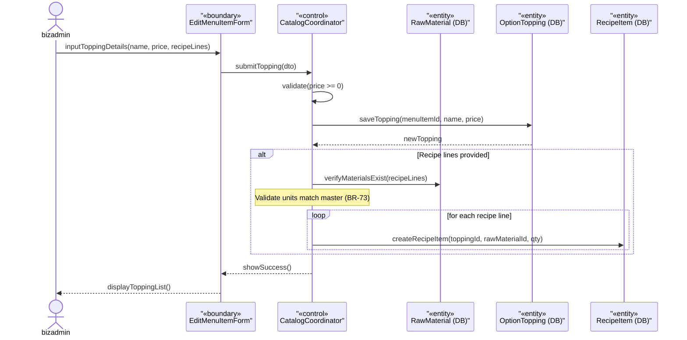
```mermaid
sequenceDiagram
    actor bizadmin
participant EditForm as "«boundary»<br/>EditMenuItemForm"
participant CatalogCoord as "«control»<br/>CatalogCoordinator"
participant RawMatDB as "«entity»<br/>RawMaterial (DB)"
participant ToppingDB as "«entity»<br/>OptionTopping (DB)"
participant RecipeDB as "«entity»<br/>RecipeItem (DB)"

    bizadmin->>EditForm: inputToppingDetails(name, price, recipeLines)
    EditForm->>CatalogCoord: submitTopping(dto)
    CatalogCoord->>CatalogCoord: validate(price >= 0)
    CatalogCoord->>ToppingDB: saveTopping(menuItemId, name, price)
    ToppingDB-->>CatalogCoord: newTopping

    alt Recipe lines provided
        CatalogCoord->>RawMatDB: verifyMaterialsExist(recipeLines)
        Note over CatalogCoord: Validate units match master (BR-73)
        loop for each recipe line
            CatalogCoord->>RecipeDB: createRecipeItem(toppingId, rawMaterialId, qty)
        end
    end

    CatalogCoord-->>EditForm: showSuccess()
    EditForm-->>bizadmin: displayToppingList()
```

#### ***3.3.4 UC-16/17/70 CRUD Category***

*\[businessadmin creates, updates, or soft-deletes product categories. Delete (soft) is blocked if the category still contains active menu items, preventing orphaned items.\]*

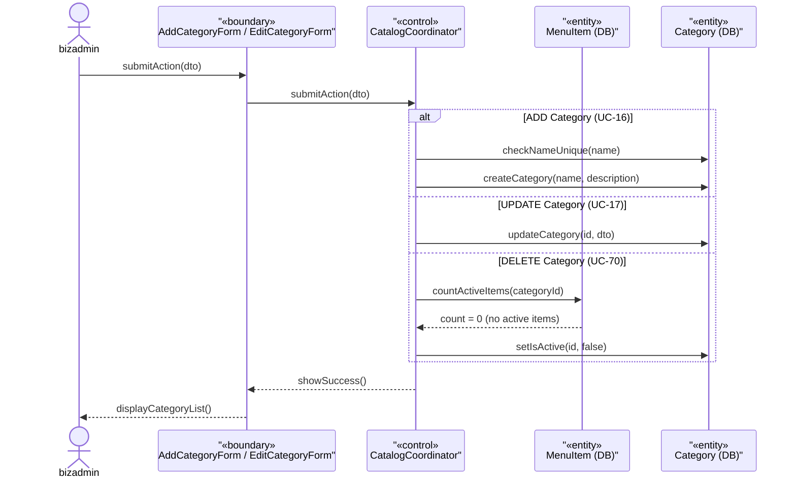
```mermaid
sequenceDiagram
    actor bizadmin
participant CatForm as "«boundary»<br/>AddCategoryForm / EditCategoryForm"
participant CatalogCoord as "«control»<br/>CatalogCoordinator"
participant MenuDB as "«entity»<br/>MenuItem (DB)"
participant CatDB as "«entity»<br/>Category (DB)"

    bizadmin->>CatForm: submitAction(dto)
    CatForm->>CatalogCoord: submitAction(dto)

    alt ADD Category (UC-16)
        CatalogCoord->>CatDB: checkNameUnique(name)
        CatalogCoord->>CatDB: createCategory(name, description)
    else UPDATE Category (UC-17)
        CatalogCoord->>CatDB: updateCategory(id, dto)
    else DELETE Category (UC-70)
        CatalogCoord->>MenuDB: countActiveItems(categoryId)
        MenuDB-->>CatalogCoord: count = 0 (no active items)
        CatalogCoord->>CatDB: setIsActive(id, false)
    end

    CatalogCoord-->>CatForm: showSuccess()
    CatForm-->>bizadmin: displayCategoryList()
```

#### ***3.3.5 UC-74 Manage Raw Material Master Catalog***

*\[businessadmin maintains the chain-wide raw material catalog. Material code is immutable after creation. Unit is locked once the material is referenced by any stock transaction (BR-63/BR-64). Soft-delete via is_active flag prevents deletion of materials referenced by recipes.\]*

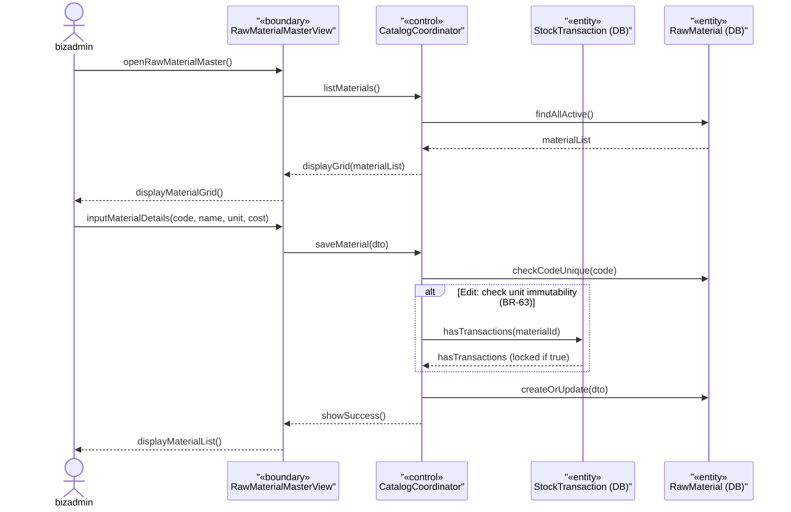
```mermaid
sequenceDiagram
    actor bizadmin
participant MatView as "«boundary»<br/>RawMaterialMasterView"
participant CatalogCoord as "«control»<br/>CatalogCoordinator"
participant StockTxDB as "«entity»<br/>StockTransaction (DB)"
participant MatDB as "«entity»<br/>RawMaterial (DB)"

    bizadmin->>MatView: openRawMaterialMaster()
    MatView->>CatalogCoord: listMaterials()
    CatalogCoord->>MatDB: findAllActive()
    MatDB-->>CatalogCoord: materialList
    CatalogCoord-->>MatView: displayGrid(materialList)
    MatView-->>bizadmin: displayMaterialGrid()

    bizadmin->>MatView: inputMaterialDetails(code, name, unit, cost)
    MatView->>CatalogCoord: saveMaterial(dto)
    CatalogCoord->>MatDB: checkCodeUnique(code)

    alt Edit: check unit immutability (BR-63)
        CatalogCoord->>StockTxDB: hasTransactions(materialId)
        StockTxDB-->>CatalogCoord: hasTransactions (locked if true)
    end

    CatalogCoord->>MatDB: createOrUpdate(dto)
    CatalogCoord-->>MatView: showSuccess()
    MatView-->>bizadmin: displayMaterialList()
```

### **3.4 Voucher Management**

*\[Provide the detailed design for Voucher Management, covering UC-20→UC-23 (View/Add/Update/Delete Voucher). Voucher application at checkout is described in Section 3.7 POS Transaction (UC-48). Actor: businessadmin (CRUD). The class diagram covers the voucher lifecycle; the sequence diagram covers the add/update flow. The VOUCHER statechart documents the full lifecycle.\]*

#### ***3.4.1 Class Diagram***

*\[Class diagram for Voucher Management. COMET stereotypes: VoucherListView, AddVoucherForm, EditVoucherForm («boundary»); VoucherCoordinator («control»); Voucher, AuditLog («entity»).\]*

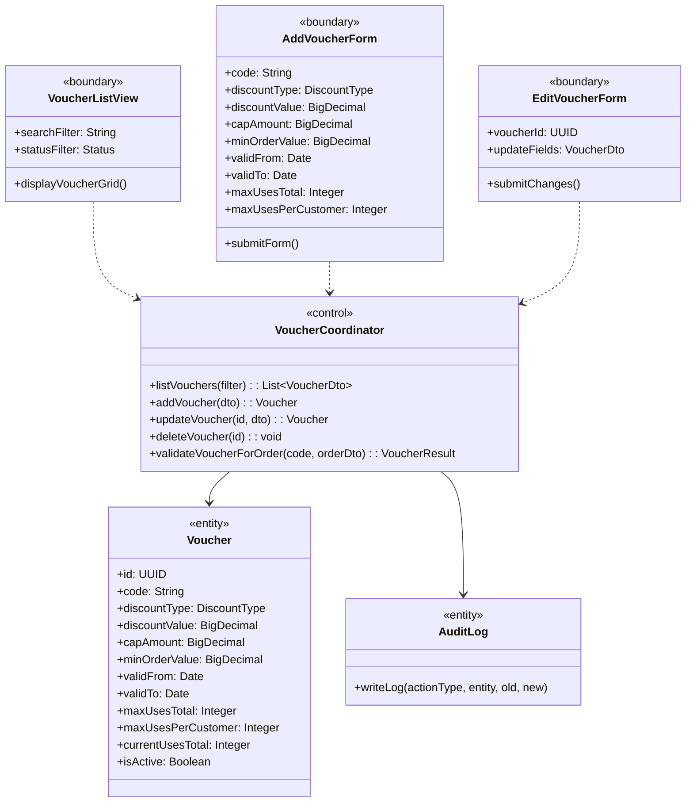
```mermaid
classDiagram
    class VoucherListView {
        <<boundary>>
        +searchFilter: String
        +statusFilter: Status
        +displayVoucherGrid()
    }
    class AddVoucherForm {
        <<boundary>>
        +code: String
        +discountType: DiscountType
        +discountValue: BigDecimal
        +capAmount: BigDecimal
        +minOrderValue: BigDecimal
        +validFrom: Date
        +validTo: Date
        +maxUsesTotal: Integer
        +maxUsesPerCustomer: Integer
        +submitForm()
    }
    class EditVoucherForm {
        <<boundary>>
        +voucherId: UUID
        +updateFields: VoucherDto
        +submitChanges()
    }
    class VoucherCoordinator {
        <<control>>
        +listVouchers(filter): List~VoucherDto~
        +addVoucher(dto): Voucher
        +updateVoucher(id, dto): Voucher
        +deleteVoucher(id): void
        +validateVoucherForOrder(code, orderDto): VoucherResult
    }
    class Voucher {
        <<entity>>
        +id: UUID
        +code: String
        +discountType: DiscountType
        +discountValue: BigDecimal
        +capAmount: BigDecimal
        +minOrderValue: BigDecimal
        +validFrom: Date
        +validTo: Date
        +maxUsesTotal: Integer
        +maxUsesPerCustomer: Integer
        +currentUsesTotal: Integer
        +isActive: Boolean
    }
    class AuditLog {
        <<entity>>
        +writeLog(actionType, entity, old, new)
    }

    VoucherListView ..> VoucherCoordinator
    AddVoucherForm ..> VoucherCoordinator
    EditVoucherForm ..> VoucherCoordinator
    VoucherCoordinator --> Voucher
    VoucherCoordinator --> AuditLog
```

#### ***3.4.2 UC-21/22 Add / Update Voucher***

*\[businessadmin creates or updates a voucher. System validates: code uniqueness on add, validFrom < validTo, PERCENTAGE type must have capAmount set (BR-42), discountValue must be in [1..100] for PERCENTAGE type. Every mutation is audit-logged (BR-68).\]*

```mermaid
sequenceDiagram
    actor bizadmin
participant VoucherForm as "«boundary»<br/>AddVoucherForm / EditVoucherForm"
participant VoucherCoord as "«control»<br/>VoucherCoordinator"
participant VoucherDB as "«entity»<br/>Voucher (DB)"
participant AuditDB as "«entity»<br/>AuditLog (DB)"

    bizadmin->>VoucherForm: inputVoucherDetails(code, discountType, discountValue, capAmount, validity, limits)
    VoucherForm->>VoucherCoord: submitForm(dto)

    alt ADD Voucher (UC-21)
        VoucherCoord->>VoucherDB: checkCodeUnique(code)
    else UPDATE Voucher (UC-22)
        VoucherCoord->>VoucherDB: findById(id)
        VoucherDB-->>VoucherCoord: oldVoucherRecord
    end

    Note over VoucherCoord: Validate validFrom < validTo
    Note over VoucherCoord: PERCENTAGE type must have capAmount set (BR-42)
    Note over VoucherCoord: discountValue in [1..100] for PERCENTAGE type

    VoucherCoord->>VoucherDB: save(dto)
    VoucherDB-->>VoucherCoord: savedVoucher
    VoucherCoord->>AuditDB: writeAuditLog(action, vouchers, oldRecord, savedVoucher)
    VoucherCoord-->>VoucherForm: showSuccess()
    VoucherForm-->>bizadmin: displayVoucherList()
```

#### ***3.4.3 VOUCHER Lifecycle Statechart***

*\[The Voucher lifecycle has 4 states. State names align with SRS BR-52: SCHEDULED (before start date), ACTIVE, and a terminal end state. The terminal EXHAUSTED state covers BOTH the SRS EXPIRED case (currentDate > validTo) AND the usage-limit-reached case (currentUsesTotal >= maxUsesTotal). Vouchers that have been used in orders cannot be deleted from the database (foreign key constraint on orders table); deactivation via is_active flag is used instead of deletion.\]*

```mermaid
stateDiagram-v2
    [*] --> SCHEDULED : createVoucher() [future date]

    SCHEDULED --> ACTIVE : timeTrigger [valid date]

    ACTIVE --> EXHAUSTED : useVoucher() [limit reached]

    ACTIVE --> DEACTIVATED : deactivate() [by Admin]

    DEACTIVATED --> ACTIVE : reactivate() [by Admin]

    EXHAUSTED --> [*] : archive()
    DEACTIVATED --> [*] : archive()
```

### **3.5 Customer & Membership Management**

*\[Provide the detailed design for Customer & Membership Management, covering UC-24→UC-27 (View/Add/Update Customer, View Customer History) and UC-49 (Redeem Loyalty Points at Checkout). Actors: cashier (CRM lookup and register at POS), businessadmin (CRM management & loyalty history). Key design: PDPA consent is mandatory before any loyalty data is stored (BR-71). Checkout application is covered in Section 3.7.\]*

#### ***3.5.1 Class Diagram***

*\[Class diagram for Customer & Membership. COMET stereotypes: CustomerSearchView, AddCustomerForm, EditCustomerForm, RedemptionPanel («boundary»); CustomerCoordinator («control»); LoyaltyPointCalculator («application logic»); Customer («entity»).\]*

```mermaid
classDiagram
    class CustomerSearchView {
        <<boundary>>
        +phoneSearch: String
        +displayCustomerCard()
    }
    class AddCustomerForm {
        <<boundary>>
        +fullName: String
        +phone: String
        +email: String
        +pdpaConsentCheckbox: Boolean
        +submitForm()
    }
    class EditCustomerForm {
        <<boundary>>
        +customerId: UUID
        +updateFields: CustomerDto
        +submitChanges()
    }
    class RedemptionPanel {
        <<boundary>>
        +customerId: UUID
        +pointsToRedeem: Integer
        +calculateEquivalentDiscount()
        +confirmRedemption()
    }
    class CustomerCoordinator {
        <<control>>
        +searchCustomer(phone): CustomerDto
        +addCustomer(dto): Customer
        +updateCustomer(id, dto): Customer
        +getPointsBalance(customerId): Integer
        +applyRedemption(customerId, orderId, points): void
    }
    class LoyaltyPointCalculator {
        <<application logic>>
        +calculateEarned(orderTotal): Integer
        +calculateRedemptionValue(points): BigDecimal
        +validateSufficientPoints(balance, toRedeem): Boolean
    }
    class Customer {
        <<entity>>
        +id: UUID
        +fullName: String
        +phone: String
        +email: String
        +points: Integer
        +consentAt: DateTime
        +consentVersion: String
        +createdAt: DateTime
    }

    CustomerSearchView ..> CustomerCoordinator
    AddCustomerForm ..> CustomerCoordinator
    EditCustomerForm ..> CustomerCoordinator
    RedemptionPanel ..> CustomerCoordinator
    CustomerCoordinator --> LoyaltyPointCalculator
    CustomerCoordinator --> Customer
```

#### ***3.5.2 UC-25 Add Customer with PDPA Consent***

*\[Cashier registers a new loyalty customer. PDPA consent checkbox is mandatory before submitting the form (BR-71). System stores consent timestamp and consent version. Phone number must be unique. Initial loyalty points balance is 0.\]*

```mermaid
sequenceDiagram
    actor cashier
participant AddForm as "«boundary»<br/>AddCustomerForm"
participant CustomerCoord as "«control»<br/>CustomerCoordinator"
participant CustomerDB as "«entity»<br/>Customer (DB)"

    cashier->>AddForm: inputCustomerDetails(name, phone, email)
    AddForm->>AddForm: validate PDPA checkbox = true (mandatory, BR-71)
    AddForm->>CustomerCoord: submitForm(dto)
    CustomerCoord->>CustomerDB: checkPhoneUnique(phone)
    CustomerDB-->>CustomerCoord: phone available
    CustomerCoord->>CustomerDB: createCustomer(dto, consentAt=now, consentVersion, points=0)
    CustomerDB-->>CustomerCoord: newCustomer
    CustomerCoord-->>AddForm: return newCustomer (points=0)
    AddForm-->>cashier: displayCustomerCard()
```

#### ***3.5.3 UC-49 Redeem Loyalty Points***

*\[Cashier applies loyalty points as a discount during checkout. The points-to-VND conversion rate is configured in SystemConfig (UC-30). Sufficient points balance is validated before confirming. Points are deducted immediately upon redemption confirmation.\]*

```mermaid
sequenceDiagram
    actor cashier
    participant RedemptionPanel
participant CustomerCoord as "«control»<br/>CustomerCoordinator"
participant LoyaltyCalc as "«application logic»<br/>LoyaltyPointCalculator"
participant CustomerDB as "«entity»<br/>Customer (DB)"

    cashier->>RedemptionPanel: inputRedemptionDetails(customerId, pointsToRedeem)
    RedemptionPanel->>CustomerCoord: getPointsBalance(customerId)
    CustomerCoord->>CustomerDB: findById(customerId)
    CustomerDB-->>CustomerCoord: customer (loyaltyPoints = N)
    CustomerCoord-->>RedemptionPanel: displayPointsBalance(points)

    RedemptionPanel->>LoyaltyCalc: calculateRedemptionValue(pointsToRedeem)
    LoyaltyCalc-->>RedemptionPanel: discountValue (VND equivalent)

    cashier->>RedemptionPanel: confirmRedemption()
    RedemptionPanel->>CustomerCoord: applyRedemption(customerId, orderId, points)
    CustomerCoord->>LoyaltyCalc: validateSufficientPoints(N, pointsToRedeem)
    LoyaltyCalc-->>CustomerCoord: valid
    CustomerCoord->>CustomerDB: decrementPoints(customerId, pointsToRedeem)
    CustomerCoord-->>RedemptionPanel: showSuccess(remainingPoints)
    RedemptionPanel-->>cashier: displayUpdatedBalance(remainingPoints)
```

### **3.6 Inventory & Stock Management**

*\[Provide the detailed design for Inventory & Stock Management, covering UC-31→UC-34 (View Stock Dashboard, Import Stock, Export Stock, Stock Audit/Physical Count), UC-61 (View Import/Export History — reuses the StockDashboard read view), and UC-62 (Recipe-based Auto-Deduction on PREPARING status) plus the automated daily Low Stock Alert. Actors: storemanager (manual import/export/audit), system scheduler (auto-deduction via RecipeDeductionService, daily alert via LowStockAlertScheduler).\]*

#### ***3.6.1 Class Diagram***

*\[Class diagram for Inventory & Stock. COMET stereotypes: StockDashboardView, ImportStockForm, ExportStockForm, StockAuditForm («boundary»), EmailServiceProxy («boundary» external); StockCoordinator («control»); RecipeDeductionService («application logic»); LowStockAlertScheduler («timer»); StockItem, StockTransaction, RawMaterial («entity»).\]*

```mermaid
classDiagram
    class StockDashboardView {
        <<boundary>>
        +branchId: UUID
        +displayStockGrid()
        +displayAlerts()
    }
    class ImportStockForm {
        <<boundary>>
        +stockItemId: UUID
        +quantity: BigDecimal
        +note: String
        +submitImport()
    }
    class ExportStockForm {
        <<boundary>>
        +stockItemId: UUID
        +quantity: BigDecimal
        +reason: String
        +submitExport()
    }
    class StockAuditForm {
        <<boundary>>
        +stockItemId: UUID
        +actualQuantity: BigDecimal
        +note: String
        +submitAudit()
    }
    class StockCoordinator {
        <<control>>
        +viewStock(storeId): List~StockItemDto~
        +importStock(dto): StockTransaction
        +exportStock(dto): StockTransaction
        +auditStock(dto): StockTransaction
        +checkLowStock(storeId): List~LowStockAlert~
    }
    class RecipeDeductionService {
        <<application logic>>
        +deductIngredients(orderId): DeductionResult
        +calculateRequiredQty(orderItems, recipes): Map
        +createPhantomUsageTx(stockItemId, shortageQty): void
    }
    class LowStockAlertScheduler {
        <<timer>>
        +schedule: "0 0 22 * * *" (daily 22:00)
        +scanAllBranches(): void
        +onLowStockDetected(storeId, items): void
    }
    class StockItem {
        <<entity>>
        +id: UUID
        +storeId: UUID
        +rawMaterialId: UUID
        +currentQuantity: BigDecimal
        +minAlertThreshold: BigDecimal
    }
    class StockTransaction {
        <<entity>>
        +id: UUID
        +stockItemId: UUID
        +managerId: UUID
        +transactionType: TxType
        +quantity: BigDecimal
        +reason: String
        +createdAt: DateTime
    }
    class RawMaterial {
        <<entity>>
        +id: UUID
        +code: String
        +name: String
        +unit: String
    }
    class EmailServiceProxy {
        <<boundary>>
        +sendLowStockAlert(to, items): void
    }

    StockDashboardView ..> StockCoordinator
    ImportStockForm ..> StockCoordinator
    ExportStockForm ..> StockCoordinator
    StockAuditForm ..> StockCoordinator
    StockCoordinator --> RecipeDeductionService
    StockCoordinator --> StockItem
    StockCoordinator --> StockTransaction
    StockCoordinator --> RawMaterial
    LowStockAlertScheduler --> StockCoordinator
    LowStockAlertScheduler --> EmailServiceProxy
```

#### ***3.6.2 UC-32 Import Stock***

*\[storemanager records an incoming stock delivery. System validates quantity > 0, reads current on-hand quantity, creates an IMPORT transaction with before/after snapshot for audit trail, then increments the stock item quantity.\]*

```mermaid
sequenceDiagram
    actor storemanager
participant ImportForm as "«boundary»<br/>ImportStockForm"
participant StockCoord as "«control»<br/>StockCoordinator"
participant StockItemDB as "«entity»<br/>StockItem (DB)"
participant TxDB as "«entity»<br/>StockTransaction (DB)"

    storemanager->>ImportForm: select stock item + enter quantity + note
    ImportForm->>StockCoord: submitImport(dto)
    StockCoord->>StockCoord: validate(quantity > 0)
    StockCoord->>StockItemDB: findByIdForUpdate(stockItemId)
    StockItemDB-->>StockCoord: stockItem (quantityBefore = Q)
    StockCoord->>StockItemDB: incrementQuantity(stockItemId, quantity)
    StockCoord->>TxDB: createTransaction(IMPORT, stockItemId, +qty, managerId, reason)
    TxDB-->>StockCoord: txRecord
    StockCoord-->>ImportForm: showSuccess(newOnHand = Q+qty)
    ImportForm-->>storemanager: display updated stock level
```

#### ***3.6.3 UC-34 Stock Audit / Physical Count Adjustment***

*\[storemanager performs a physical count. If actual count differs from system quantity, an AUDIT_ADJUSTMENT transaction is created recording the discrepancy delta. A note explaining the difference is mandatory.\]*

```mermaid
sequenceDiagram
    actor storemanager
participant AuditForm as "«boundary»<br/>StockAuditForm"
participant StockCoord as "«control»<br/>StockCoordinator"
participant StockItemDB as "«entity»<br/>StockItem (DB)"
participant TxDB as "«entity»<br/>StockTransaction (DB)"

    storemanager->>AuditForm: enter actual count (actualQty) for each item + note
    AuditForm->>StockCoord: submitAudit(dtoList)
    loop for each item
        StockCoord->>StockItemDB: findByIdForUpdate(stockItemId)
        StockItemDB-->>StockCoord: stockItem (systemQty = S)
        StockCoord->>StockCoord: adjustment = actualQty - S
        StockCoord->>StockItemDB: setQuantity(stockItemId, actualQty)
        StockCoord->>TxDB: createTransaction(AUDIT_ADJUSTMENT, stockItemId, adjustment, managerId, reason)
    end
    StockCoord-->>AuditForm: showAuditSummary(adjustmentReport)
    AuditForm-->>storemanager: display adjustment report (discrepancy per item)
```

#### ***3.6.4 UC-62 Automatic Recipe-Based Stock Deduction***

*\[When the Barista updates order status to PREPARING, the RecipeDeductionService is triggered. Each order item's recipe formula is consumed from branch stock. If any ingredient is insufficient, the system still deducts everything (allowing negative balance) and records a `phantom_usage` transaction to monitor leakage (BR-89). It does NOT set the order status to HOLD. A low-stock alert MSG07 is dispatched, but the order preparation proceeds without blocking. RECIPE_DEDUCTION transactions have null manager_id to distinguish them from manual adjustments.\]*

```mermaid
sequenceDiagram
    actor barista
participant BaristaMonitor as "«boundary»<br/>BaristaQueueMonitor"
participant OrderCoord as "«control»<br/>OrderCoordinator"
participant RecipeDeductSvc as "«application logic»<br/>RecipeDeductionService"
participant RecipeDB as "«entity»<br/>RecipeItem (DB)"
participant StockItemDB as "«entity»<br/>StockItem (DB)"
participant TxDB as "«entity»<br/>StockTransaction (DB)"

    barista->>BaristaMonitor: startPreparation(orderId) on order
    BaristaMonitor->>OrderCoord: updateStatus(orderId, PREPARING)
    OrderCoord->>RecipeDeductSvc: deductIngredients(orderId)
    RecipeDeductSvc->>RecipeDB: fetchRecipesForOrder(orderId)
    RecipeDB-->>RecipeDeductSvc: requireMap (ingredientId to qty)

    loop for each ingredient in requireMap
        RecipeDeductSvc->>StockItemDB: getStockItem(storeId, ingredientId)
        StockItemDB-->>RecipeDeductSvc: stockItem (currentOnHand)
        
        Note over RecipeDeductSvc, StockItemDB: Decrement qty from stock level (may go negative)
        RecipeDeductSvc->>StockItemDB: setQuantity(stockItemId, currentOnHand - requiredQty)
        RecipeDeductSvc->>TxDB: createTransaction(RECIPE_DEDUCTION, stockItemId, requiredQty, managerId=null)
        
        alt currentOnHand - requiredQty < 0
            Note over RecipeDeductSvc, TxDB: Create phantom_usage transaction for the deficit (BR-89)
            RecipeDeductSvc->>TxDB: createTransaction(PHANTOM_USAGE, stockItemId, abs(deficit), managerId=null)
            RecipeDeductSvc-->>OrderCoord: triggerLowStockAlert(MSG07, ingredientId)
        end
    end
    
    RecipeDeductSvc-->>OrderCoord: SUCCESS
    OrderCoord-->>BaristaMonitor: showStatus(PREPARING)
```

### **3.7 POS Transaction**

*\[Provide the detailed design for POS Transaction, covering UC-44→UC-55 (Open Shift, Full Checkout Pipeline, VietQR Payment, Close Shift/Z-Report). Actor: cashier (POS Terminal on Flutter). Key design decisions: (1) DiscountStackingEngine enforces voucher + loyalty point stacking rules (BR-70); (2) VietQR uses idempotency key = orderId (BR-84/BR-85); (3) ShiftAutoCloseScheduler force-closes open shifts at 23:59.\]*

#### ***3.7.1 Class Diagram***

*\[Class diagram for POS Transaction. COMET stereotypes: ShiftOpenForm, PosCheckoutGrid, PaymentPanel, ShiftCloseForm («boundary»); VietQRClient, PrinterServiceProxy («boundary» external); CheckoutCoordinator, ShiftSessionCoordinator («control»); DiscountStackingEngine, ShiftReconciliationService («application logic»); ShiftAutoCloseScheduler («timer»); ShiftSession, Order, Voucher, Customer, SystemConfig («entity»).\]*

```mermaid
classDiagram
    class ShiftOpenForm {
        <<boundary>>
        +cashierId: UUID
        +openingCash: BigDecimal
        +posRegisterId: String
        +submitOpen()
    }
    class PosCheckoutGrid {
        <<boundary>>
        +menuGrid: MenuItemGrid
        +cart: CartPanel
        +customerPanel: CustomerPanel
        +voucherInput: TextField
        +totalPanel: TotalPanel
        +submitOrder()
    }
    class PaymentPanel {
        <<boundary>>
        +paymentMethod: PaymentMethod
        +cashReceived: BigDecimal
        +qrCodeDisplay: QRImage
        +confirmCash()
        +confirmQrPaid()
    }
    class ShiftCloseForm {
        <<boundary>>
        +closingCash: BigDecimal
        +submitClose()
    }

    class CheckoutCoordinator {
        <<control>>
        +buildCart(items): CartDto
        +applyVoucher(code, cart): CartDto
        +applyLoyaltyPoints(customerId, points, cart): CartDto
        +submitOrder(cart, paymentMethod): OrderDto
        +confirmCashPayment(orderId, cashReceived): ReceiptDto
        +initiateQrPayment(orderId): QrPaymentDto
        +handleQrCallback(orderId, status): void
        +printReceipt(orderId): void
    }
    class ShiftSessionCoordinator {
        <<control>>
        +openShift(dto): ShiftSession
        +closeShift(sessionId, closingCash): ZReportDto
        +getActiveShift(cashierId): ShiftSession
    }
    class DiscountStackingEngine {
        <<application logic>>
        +applyVoucher(voucherCode, cart): CartDto
        +applyLoyaltyPoints(points, cart): CartDto
        +computeFinalTotal(cart): BigDecimal
        +enforceStackingRules(cart): CartDto
    }
    class ShiftReconciliationService {
        <<application logic>>
        +computeExpectedCash(sessionId): BigDecimal
        +computeDiscrepancy(expected, actual): BigDecimal
        +generateZReport(sessionId): ZReportDto
    }

    class ShiftAutoCloseScheduler {
        <<timer>>
        +schedule: "59 23 * * *" (23:59 cron)
        +forceCloseOpenShifts(): void
    }
    class ShiftSession {
        <<entity>>
        +id: UUID
        +storeId: UUID
        +userId: UUID
        +posRegisterId: String
        +startingCash: BigDecimal
        +endingCash: BigDecimal
        +status: ShiftStatus
        +startTime: DateTime
        +endTime: DateTime
    }
    class VietQRClient {
        <<boundary>>
        +generateQrCode(orderId, amount): QrPaymentDto
        +verifyWebhookSignature(payload): Boolean
        +processCallback(payload): PaymentResult
    }
    class PrinterServiceProxy {
        <<boundary>>
        +printReceipt(receiptDto): void
        +printCupLabel(labelDto): void
    }
    class Voucher {
        <<entity>>
        +id: UUID
        +code: String
        +discountType: DiscountType
    }
    class Customer {
        <<entity>>
        +id: UUID
        +loyaltyPoints: Integer
    }
    class SystemConfig {
        <<entity>>
        +configKey: String
        +configValue: String
        +scope: ConfigScope
        +storeId: UUID
    }

    ShiftOpenForm ..> ShiftSessionCoordinator
    ShiftCloseForm ..> ShiftSessionCoordinator
    PosCheckoutGrid ..> CheckoutCoordinator
    PaymentPanel ..> CheckoutCoordinator

    CheckoutCoordinator --> DiscountStackingEngine
    CheckoutCoordinator --> ShiftSession
    CheckoutCoordinator --> VietQRClient
    CheckoutCoordinator --> PrinterServiceProxy
    ShiftSessionCoordinator --> ShiftReconciliationService
    ShiftSessionCoordinator --> ShiftSession
    ShiftAutoCloseScheduler --> ShiftSessionCoordinator
    DiscountStackingEngine --> Voucher
    DiscountStackingEngine --> Customer
    DiscountStackingEngine --> SystemConfig
```

#### ***3.7.2 UC-44 Open Shift***

*\[Cashier opens a new work shift by declaring the opening cash float. Only one OPEN shift is allowed per register per branch at a time (design constraint; see SHIFT statechart §3.7.6). System validates no duplicate active shift before creating the ShiftSession record.\]*

```mermaid
sequenceDiagram
    actor cashier
participant OpenForm as "«boundary»<br/>ShiftOpenForm"
participant ShiftCoord as "«control»<br/>ShiftSessionCoordinator"
participant ShiftDB as "«entity»<br/>ShiftSession (DB)"

    cashier->>OpenForm: inputOpeningCashFloat(openingCash) + register number
    OpenForm->>ShiftCoord: openShift(cashierId, storeId, openingCash, register)
    ShiftCoord->>ShiftDB: findOpenShift(storeId, register)
    ShiftDB-->>ShiftCoord: null (no active shift — OK)
    ShiftCoord->>ShiftDB: createShift(dto, status=OPEN, openedAt=now)
    ShiftDB-->>ShiftCoord: newSession
    ShiftCoord-->>OpenForm: return sessionId + shiftOpenedMsg
    OpenForm-->>cashier: navigate to POS Checkout Grid
```

#### ***3.7.3 UC-48/49/50/51 Full Checkout Pipeline (Cash Payment)***

*\[Cashier builds cart → optionally attaches customer and applies voucher/loyalty points → selects payment method → confirms payment → system creates order, earns loyalty points for customer, writes audit log, and prints receipt + cup label.\]*

```mermaid
sequenceDiagram
    actor cashier
    participant PosGrid as PosCheckoutGrid
participant CheckoutCoord as "«control»<br/>CheckoutCoordinator"
participant DiscountEngine as "«application logic»<br/>DiscountStackingEngine"
participant VoucherDB as "«entity»<br/>Voucher (DB)"
participant CustomerDB as "«entity»<br/>Customer (DB)"
participant OrderDB as "«entity»<br/>Order (DB)"
    participant PayPanel as PaymentPanel
participant PrintSvc as "«boundary»<br/>PrinterServiceProxy"
participant AuditDB as "«entity»<br/>AuditLog (DB)"

    cashier->>PosGrid: add items to cart
    cashier->>PosGrid: (optional) search + attach customer
    cashier->>PosGrid: (optional) enter voucher code
    PosGrid->>CheckoutCoord: applyVoucher(code, cart)
    CheckoutCoord->>DiscountEngine: applyVoucher(code, cart)
    DiscountEngine->>VoucherDB: validateVoucher(code, orderTotal)
    VoucherDB-->>DiscountEngine: voucherRecord (valid + discountValue)
    DiscountEngine-->>CheckoutCoord: updatedCart (discountApplied)

    cashier->>PosGrid: (optional) apply loyalty points
    PosGrid->>CheckoutCoord: applyLoyaltyPoints(customerId, points, cart)
    CheckoutCoord->>DiscountEngine: applyLoyaltyPoints(points, cart)
    DiscountEngine->>CustomerDB: getBalance(customerId)
    DiscountEngine-->>CheckoutCoord: updatedCart (pointsDeducted)

    cashier->>PosGrid: confirm order
    PosGrid->>CheckoutCoord: submitOrder(cart, CASH)
    CheckoutCoord->>OrderDB: createOrder(cart, status=PENDING, payment=PENDING)
    OrderDB-->>CheckoutCoord: newOrder

    cashier->>PayPanel: enter cash received
    PayPanel->>CheckoutCoord: confirmCashPayment(orderId, cashReceived)
    CheckoutCoord->>OrderDB: updatePaymentStatus(COMPLETED)
    CheckoutCoord->>CustomerDB: incrementPoints(customerId, earnedPoints)
    CheckoutCoord->>AuditDB: writeAuditLog(CHECKOUT, voucher/points usage)
    CheckoutCoord->>PrintSvc: printReceipt(orderId)
    CheckoutCoord->>PrintSvc: printCupLabel(orderId)
    CheckoutCoord-->>PayPanel: showChange(cashReceived - totalAmount)
    PayPanel-->>cashier: display change + order goes to barista queue
```

#### ***3.7.4 UC-51 VietQR Payment Flow***

*\[When cashier selects VietQR, system calls VietQR gateway to generate a QR code. Customer scans QR and completes payment in their banking app. Gateway sends a webhook callback. System verifies HMAC signature and marks order as PAID (BR-84/BR-85).\]*

```mermaid
sequenceDiagram
    actor cashier
    actor customer
    participant PayPanel as PaymentPanel
participant CheckoutCoord as "«control»<br/>CheckoutCoordinator"
participant VietQRClient as "«boundary»<br/>VietQRClient"
    participant VietQRGateway as VietQR Gateway (External)
participant OrderDB as "«entity»<br/>Order (DB)"
participant PrintSvc as "«boundary»<br/>PrinterServiceProxy"

    cashier->>PayPanel: select VietQR payment
    PayPanel->>CheckoutCoord: initiateQrPayment(orderId)
    CheckoutCoord->>VietQRClient: generateQrCode(orderId, totalAmount)
    VietQRClient->>VietQRGateway: POST /create-payment (idempotencyKey=orderId)
    VietQRGateway-->>VietQRClient: qrPaymentUrl + transactionRef
    VietQRClient-->>CheckoutCoord: QrPaymentDto
    CheckoutCoord-->>PayPanel: displayQrCode(qrPaymentUrl)
    PayPanel-->>cashier: show QR code on screen

    customer->>VietQRGateway: scan QR + complete bank payment
    VietQRGateway->>CheckoutCoord: POST /api/v1/payments/vietqr/callback (webhook)
    CheckoutCoord->>VietQRClient: verifyWebhookSignature(payload)
    VietQRClient-->>CheckoutCoord: signature valid
    CheckoutCoord->>OrderDB: updatePaymentStatus(COMPLETED, transactionRef)
    CheckoutCoord->>PrintSvc: printReceipt(orderId)
    CheckoutCoord->>PrintSvc: printCupLabel(orderId)
    CheckoutCoord-->>PayPanel: notifyPaidSuccess()
    PayPanel-->>cashier: show "Payment Received" confirmation
```

#### ***3.7.5 UC-53 Close Shift (Z-Report)***

*\[Cashier declares the closing cash amount. System computes expected cash from all CASH orders in the shift, calculates discrepancy, generates Z-Report, and sets shift to CLOSED. ShiftAutoCloseScheduler forces close at 23:59 if cashier forgets.\]*

```mermaid
sequenceDiagram
    actor cashier
participant CloseForm as "«boundary»<br/>ShiftCloseForm"
participant ShiftCoord as "«control»<br/>ShiftSessionCoordinator"
participant ReconcileSvc as "«application logic»<br/>ShiftReconciliationService"
participant OrderDB as "«entity»<br/>Order (DB)"
participant ShiftDB as "«entity»<br/>ShiftSession (DB)"

    cashier->>CloseForm: enter closing cash amount
    CloseForm->>ShiftCoord: closeShift(sessionId, closingCash)
    ShiftCoord->>ReconcileSvc: computeExpectedCash(sessionId)
    ReconcileSvc->>OrderDB: sumCashPayments(sessionId, status=PAID)
    OrderDB-->>ReconcileSvc: totalCashSales
    ReconcileSvc->>ReconcileSvc: expectedCash = openingCash + totalCashSales - refunds
    ReconcileSvc->>ReconcileSvc: discrepancy = closingCash - expectedCash
    ReconcileSvc->>ReconcileSvc: generateZReport(sessionId, summary)
    ReconcileSvc-->>ShiftCoord: ZReportDto
    ShiftCoord->>ShiftDB: updateShift(sessionId, closingCash, status=CLOSED, closedAt=now)
    ShiftCoord-->>CloseForm: displayZReport(ZReportDto)
    CloseForm-->>cashier: displayZReport(ZReportDto)
```

#### ***3.7.6 SHIFT Session Statechart***

*\[A ShiftSession follows a simple 2-state lifecycle: OPEN → CLOSED. Only one shift can be OPEN per register per branch. ShiftAutoCloseScheduler forces CLOSED at 23:59 daily for any session still OPEN (BR-88).\]*

```mermaid
stateDiagram-v2
    [*] --> OPEN : openShift()

    OPEN --> CLOSED : closeShift()

    OPEN --> CLOSED : timeTrigger [23:59]

    CLOSED --> [*] : archive()
```

### **3.8 Order Management**

*\[Provide the detailed design for Order Management, covering UC-57 (View Order Queue Display), UC-58 (Update Preparation Status by barista), UC-55 (Cancel PENDING Order / Request Transaction Refund by cashier), UC-75 (SM-Authorized Refund/Comp), and the automated READY auto-abandon (BR-88). Actors: cashier (cancel PENDING only), storemanager (refund/comp authorization), barista (queue display + status transitions), system scheduler (auto-abandon after READY_ABANDON_TIMEOUT). The ORDER statechart documents all 7 valid states and their transitions.\]*

#### ***3.8.1 Class Diagram***

*\[Class diagram for Order Management. COMET stereotypes: OrderQueueView, BaristaQueueMonitor, CancellationDialog, RefundAuthDialog («boundary»); OrderCoordinator, OrderQueueCoordinator («control»); OrderTimeoutScheduler («timer»); Order, OrderItem, OrderItemTopping, OrderCancellation, OrderRefund («entity»).\]*

```mermaid
classDiagram
    class OrderQueueView {
        <<boundary>>
        +storeId: UUID
        +statusFilter: OrderStatus
        +displayOrders()
    }
    class BaristaQueueMonitor {
        <<boundary>>
        +displayPendingQueue()
        +updateStatus(orderId, status)
    }
    class CancellationDialog {
        <<boundary>>
        +orderId: UUID
        +reason: CancelReason
        +notes: String
        +confirmCancel()
    }
    class RefundAuthDialog {
        <<boundary>>
        +orderId: UUID
        +refundType: RefundType
        +amount: BigDecimal
        +smApprovalPin: String
        +submitRefund()
    }
    class OrderCoordinator {
        <<control>>
        +getOrderQueue(storeId, filter): List~OrderDto~
        +updateOrderStatus(orderId, newStatus): OrderDto
        +cancelOrder(dto): OrderCancellation
        +authorizeRefund(dto): OrderRefund
    }
    class OrderQueueCoordinator {
        <<control>>
        +getActiveQueue(storeId): List~OrderDto~
        +pushStatusUpdate(orderId, status): void
    }
    class OrderTimeoutScheduler {
        <<timer>>
        +checkInterval: "*/1 * * * *" (every 1 min)
        +scanReadyOrders(): void
        +onTimeout(orderId): void
    }
    class Order {
        <<entity>>
        +id: UUID
        +storeId: UUID
        +orderNumber: String
        +shiftSessionId: UUID
        +customerId: UUID
        +voucherId: UUID
        +orderType: OrderType
        +status: OrderStatus
        +paymentStatus: PaymentStatus
        +paymentMethod: PaymentMethod
        +subtotal: BigDecimal
        +discount: BigDecimal
        +taxAmount: BigDecimal
        +total: BigDecimal
        +createdAt: DateTime
    }
    class OrderItem {
        <<entity>>
        +id: UUID
        +orderId: UUID
        +menuItemId: UUID
        +quantity: Integer
        +unitPrice: BigDecimal
    }
    class OrderItemTopping {
        <<entity>>
        +id: UUID
        +orderItemId: UUID
        +toppingId: UUID
        +quantity: Integer
        +unitPrice: BigDecimal
    }
    class OrderCancellation {
        <<entity>>
        +id: UUID
        +orderId: UUID
        +cashierId: UUID
        +reason: CancelReason
        +notes: String
        +cancelledAt: DateTime
    }
    class OrderRefund {
        <<entity>>
        +id: UUID
        +orderId: UUID
        +smId: UUID
        +cashierId: UUID
        +shiftSessionId: UUID
        +refundType: RefundType
        +amount: BigDecimal
        +reason: String
        +notes: String
        +createdAt: DateTime
    }

    OrderQueueView ..> OrderCoordinator
    BaristaQueueMonitor ..> OrderQueueCoordinator
    CancellationDialog ..> OrderCoordinator
    RefundAuthDialog ..> OrderCoordinator
    OrderTimeoutScheduler --> OrderCoordinator
    OrderCoordinator --> Order
    OrderCoordinator --> OrderItem
    OrderCoordinator --> OrderCancellation
    OrderCoordinator --> OrderRefund
    OrderQueueCoordinator --> Order
    Order *-- OrderItem
    Order *-- OrderCancellation
    Order *-- OrderRefund
    OrderItem *-- OrderItemTopping
```

#### ***3.8.2 UC-55 Cancel PENDING Order***

*\[Only PENDING orders can be cancelled by cashier (BR-05). The cancellation creates an immutable OrderCancellation record with the reason code and notes. Order status transitions to CANCELLED. Cancelled orders cannot be reopened.\]*

```mermaid
sequenceDiagram
    actor cashier
participant CancelDialog as "«boundary»<br/>CancellationDialog"
participant OrderCoord as "«control»<br/>OrderCoordinator"
participant OrderDB as "«entity»<br/>Order (DB)"
participant CancelDB as "«entity»<br/>OrderCancellation (DB)"

    cashier->>CancelDialog: inputCancellationDetails(orderId, reason, notes)
    CancelDialog->>OrderCoord: cancelOrder(dto)
    OrderCoord->>OrderDB: findById(orderId)
    OrderDB-->>OrderCoord: orderRecord
    OrderCoord->>OrderCoord: verifyStatus(order.status == PENDING)
    OrderCoord->>OrderDB: updateStatus(orderId, CANCELLED)
    OrderCoord->>CancelDB: createCancellation(orderId, cashierId, reason, notes, now)
    CancelDB-->>OrderCoord: cancellationRecord
    OrderCoord-->>CancelDialog: showCancellationSuccess()
    CancelDialog-->>cashier: displaySuccess()
```

#### ***3.8.3 UC-75 SM-Authorized Refund / Comp Remake***

*\[For post-PENDING complaints (e.g., wrong order already prepared), only storemanager can authorize a REFUND or COMP_REMAKE (BR-67). SM enters their PIN to authorize. System creates an immutable OrderRefund record. A CASH refund debits the currently-open shift drawer (BR-09) and stamps `shift_session_id`; card/VietQR refunds go via the gateway with no drawer impact. Loyalty points earned/redeemed on the original order are reversed per BR-08. For COMP_REMAKE type, a new duplicate order is created in PENDING status.\]*

```mermaid
sequenceDiagram
    actor cashier
    actor storemanager
participant RefundDialog as "«boundary»<br/>RefundAuthDialog"
participant OrderCoord as "«control»<br/>OrderCoordinator"
participant UserDB as "«entity»<br/>User (DB)"
participant OrderDB as "«entity»<br/>Order (DB)"
participant RefundDB as "«entity»<br/>OrderRefund (DB)"
participant ShiftDB as "«entity»<br/>ShiftSession (DB)"
participant CustomerDB as "«entity»<br/>Customer (DB)"

    cashier->>RefundDialog: inputRefundDetails(orderId, refundType, amount)
    RefundDialog->>RefundDialog: requestSmPin()
    storemanager->>RefundDialog: inputSmPin(smPin)
    RefundDialog->>OrderCoord: authorizeRefund(dto, smPin)
    OrderCoord->>UserDB: verifySmPin(smId, smPin)
    UserDB-->>OrderCoord: authenticated
    OrderCoord->>OrderDB: findById(orderId)
    OrderDB-->>OrderCoord: orderRecord

    alt CASH refund (BR-09)
        OrderCoord->>ShiftDB: getOpenShift(storeId)
        ShiftDB-->>OrderCoord: openShift (drawer to debit)
        Note over OrderCoord, ShiftDB: refund debits the currently-open drawer; shift_session_id stamped
    else CARD / VietQR refund
        Note over OrderCoord: gateway refund API — no drawer impact
    end

    OrderCoord->>RefundDB: createRefund(orderId, smId, cashierId, shiftSessionId, refundType, amount, reason, notes, now)
    RefundDB-->>OrderCoord: refundRecord
    OrderCoord->>CustomerDB: reverseLoyalty(orderId) (BR-08)

    alt REFUND type
        OrderCoord->>OrderDB: flagRefunded(orderId)
    else COMP_REMAKE type
        OrderCoord->>OrderDB: createNewOrder(cloneOf=orderId, status=PENDING)
    end

    OrderCoord-->>RefundDialog: showRefundSuccess(refundRecord)
    RefundDialog-->>cashier: displaySuccess()
```

#### ***3.8.4 Auto-Abandon READY Orders (OrderTimeoutScheduler, BR-88 — automated)***

*\[READY orders not picked up within `READY_ABANDON_TIMEOUT` are automatically set to ABANDONED by the OrderTimeoutScheduler (BR-88). This is an automated system function (not a user use case). It prevents stale orders from persisting indefinitely in the barista queue.\]*

```mermaid
sequenceDiagram
participant TimeoutScheduler as "«timer»<br/>OrderTimeoutScheduler"
participant OrderCoord as "«control»<br/>OrderCoordinator"
participant OrderDB as "«entity»<br/>Order (DB)"

    loop every 1 minute
        TimeoutScheduler->>OrderDB: findReadyOrdersOlderThan(15min)
        OrderDB-->>TimeoutScheduler: expiredOrders[]

        loop for each expiredOrder
            TimeoutScheduler->>OrderCoord: updateOrderStatus(orderId, ABANDONED)
            OrderCoord->>OrderDB: updateStatus(orderId, ABANDONED)
        end
    end
```

#### ***3.8.5 ORDER Lifecycle Statechart***

*\[The Order has 7 states. Transitions are enforced by OrderCoordinator. The HOLD state is triggered when a preparation issue is reported by the Barista (reportIssue()). ABANDONED is reached two ways (BR-88): system-triggered after `READY_ABANDON_TIMEOUT` in READY state, or Store-Manager force-close of remaining READY orders at shift close. CANCELLED and ABANDONED are terminal states.\]*

```mermaid
stateDiagram-v2
    [*] --> PENDING : submitCheckout() / status = PENDING

    PENDING --> IN_PROGRESS : startPreparation() / deductStock()
    PENDING --> CANCELLED : cancelOrder(reason) [status == PENDING] / logCancellation()

    state IN_PROGRESS {
        [*] --> PREPARING
        PREPARING --> HOLD : reportIssue()
        HOLD --> PREPARING : resolveIssue()
        PREPARING --> READY : completePreparation()
    }

    IN_PROGRESS --> COMPLETED : confirmPickup() [status == READY] / status = COMPLETED
    IN_PROGRESS --> ABANDONED : timeTrigger [elapsedTime >= READY_ABANDON_TIMEOUT] / status = ABANDONED
    IN_PROGRESS --> ABANDONED : forceCloseAtShiftClose() [isStoreManager == true] / status = ABANDONED

    COMPLETED --> [*] : archive()
    CANCELLED --> [*] : archive()
    ABANDONED --> [*] : archive()
```

### **3.9 Staff Management**

*\[Provide the detailed design for Staff Management, covering UC-35→UC-39 (View/Create/Update/Delete Schedule, View Attendance Report), Attendance Check-In/Out with PIN + Photo Capture (automated popup function per BR-38/BR-53/BR-93 — not a standalone use case), and UC-80 (Export Worked Hours). Actors: storemanager (schedule CRUD + attendance oversight), cashier/barista (self check-in at branch). Key PDPA design: attendance photos are stored on server filesystem (path only in DB), automatically purged by PhotoAutoDeleteScheduler after 90 days (BR-72).\]*

#### ***3.9.1 Class Diagram***

*\[Class diagram for Staff Management. COMET stereotypes: ScheduleCalendarView, CreateScheduleForm, AttendanceCheckInScreen, AttendanceReportView («boundary»); ScheduleCoordinator, AttendanceCoordinator («control»); AttendancePhotoManager («application logic»); PhotoAutoDeleteScheduler («timer»); StaffSchedule, AttendanceLog, User («entity»).\]*

```mermaid
classDiagram
    class ScheduleCalendarView {
        <<boundary>>
        +weekView: CalendarGrid
        +storeId: UUID
        +displaySchedule()
    }
    class CreateScheduleForm {
        <<boundary>>
        +employeeId: UUID
        +date: Date
        +shiftType: ShiftType
        +startTime: Time
        +endTime: Time
        +posRegisterId: String
        +submitSchedule()
    }
    class AttendanceCheckInScreen {
        <<boundary>>
        +employeeId: UUID
        +pin: TextField
        +cameraCapture: CameraWidget
        +submitCheckIn()
        +submitCheckOut()
    }
    class AttendanceReportView {
        <<boundary>>
        +storeId: UUID
        +dateRange: DateRange
        +displayReport()
        +exportExcel()
    }
    class ScheduleCoordinator {
        <<control>>
        +getSchedule(storeId, week): List~ScheduleDto~
        +createSchedule(dto): StaffSchedule
        +updateSchedule(id, dto): StaffSchedule
        +deleteSchedule(id): void
        +validateWorkingHoursConstraints(employeeId, shiftDate, startTime, endTime): Boolean
        +validateLabourBudget(storeId, shiftDate, additionalHours): BudgetValidationResult
        +assignCrossBranch(employeeId, targetStoreId, shiftDate, shiftType): StaffSchedule
    }
    class AttendanceCoordinator {
        <<control>>
        +checkIn(storeId, pin, photo): AttendanceLog
        +checkOut(attendanceId, pin): AttendanceLog
        +getAttendanceReport(storeId, range): ReportDto
        +exportWorkedHours(storeId, range): ExcelFile
        +validatePinUniquenessInBranch(storeId, pin): Boolean
        +deriveLatenessAndOT(scheduledShift, checkInTime, checkOutTime): AttendanceMetrics
    }
    class AttendancePhotoManager {
        <<application logic>>
        +savePhotoToFilesystem(photoData): String
        +getPhotoPath(attendanceId): String
        +validatePhotoFormat(data): Boolean
    }
    class PhotoAutoDeleteScheduler {
        <<timer>>
        +schedule: "0 2 * * *" (daily 02:00)
        +purgePhotosOlderThan(days: 90): void
    }
    class StaffSchedule {
        <<entity>>
        +id: UUID
        +storeId: UUID
        +userId: UUID
        +shiftDate: Date
        +shiftType: ShiftType
        +shiftStartTime: Time
        +shiftEndTime: Time
        +posRegisterId: String
    }
    class AttendanceLog {
        <<entity>>
        +id: UUID
        +storeId: UUID
        +userId: UUID
        +scheduledDate: Date
        +checkInTime: DateTime
        +checkOutTime: DateTime
        +scheduledStart: DateTime
        +status: AttendanceStatus
        +photoPath: String
    }
    class User {
        <<entity>>
        +id: UUID
        +attendancePin: String
        +fullName: String
        +role: Role
    }

    ScheduleCalendarView ..> ScheduleCoordinator
    CreateScheduleForm ..> ScheduleCoordinator
    AttendanceCheckInScreen ..> AttendanceCoordinator
    AttendanceReportView ..> AttendanceCoordinator
    AttendanceCoordinator --> AttendancePhotoManager
    AttendanceCoordinator --> AttendanceLog
    AttendanceCoordinator --> User
    ScheduleCoordinator --> StaffSchedule
    ScheduleCoordinator --> User
    PhotoAutoDeleteScheduler --> AttendanceLog
```

#### ***3.9.2 UC-36 Create Staff Schedule (with Cross-Branch and Hours Validation)***

*\[storemanager creates a schedule entry for a specific employee in the branch. System validates the employee belongs to the branch (or handles cross-branch assignment per BR-90 directly without target-branch host approval), validates working hour limits (BR-92), and detects scheduling conflicts (same employee, overlapping dates/shifts). POS register ID is optionally assigned to cashier shifts.\]*

```mermaid
sequenceDiagram
    actor storemanager
participant CreateForm as "«boundary»<br/>CreateScheduleForm"
participant ScheduleCoord as "«control»<br/>ScheduleCoordinator"
participant UserDB as "«entity»<br/>User (DB)"
participant ScheduleDB as "«entity»<br/>StaffSchedule (DB)"
participant AuditDB as "«entity»<br/>AuditLog (DB)"

    storemanager->>CreateForm: inputScheduleDetails(employeeId, date, shiftType, targetStoreId)
    CreateForm->>ScheduleCoord: createSchedule(dto)
    
    alt Cross-Branch Assignment (BR-90)
        ScheduleCoord->>UserDB: verifyEmployeeHomeBranch(employeeId)
        UserDB-->>ScheduleCoord: homeStoreId
        Note over ScheduleCoord, UserDB: Store Manager assigns employee to targetStoreId directly
        ScheduleCoord->>AuditDB: logCrossBranchAssignment(employeeId, homeStoreId, targetStoreId, managerId)
    else Standard Assignment
        ScheduleCoord->>UserDB: verifyEmployeeInBranch(employeeId, storeId)
        UserDB-->>ScheduleCoord: employee confirmed
    end

    Note over ScheduleCoord, ScheduleDB: Labour Budget & Time Constraints Validation (BR-92)
    ScheduleCoord->>ScheduleCoord: validateDailyWeeklyRestHours(employeeId, date, shiftType)
    
    alt Exceeds Hard Blocks (MAX_DAILY_HOURS, MAX_WEEKLY_HOURS, MIN_REST_HOURS)
        ScheduleCoord-->>CreateForm: showValidationError(ERR_TIME_CONSTRAINTS)
        CreateForm-->>storemanager: display error and block save
    else Within Constraints
        ScheduleCoord->>ScheduleCoord: checkLabourHourBudget(targetStoreId, date)
        alt Soft Budget Exceeded
            ScheduleCoord-->>CreateForm: promptForBudgetOverrideReason()
            CreateForm-->>storemanager: display warning and ask for reason
            storemanager->>CreateForm: inputOverrideReason(reasonText)
            CreateForm->>ScheduleCoord: createScheduleWithOverride(dto, reasonText)
            ScheduleCoord->>AuditDB: logBudgetOverride(targetStoreId, date, reasonText)
        end
        
        ScheduleCoord->>ScheduleDB: checkConflict(employeeId, date, startTime, endTime)
        ScheduleDB-->>ScheduleCoord: noConflict
        ScheduleCoord->>ScheduleDB: createSchedule(dto)
        ScheduleDB-->>ScheduleCoord: newSchedule
        ScheduleCoord-->>CreateForm: showSuccess()
        CreateForm-->>storemanager: refreshCalendarView()
    end
```

#### ***3.9.3 Attendance Check-In/Out with Photo (BR-38/BR-53/BR-93, PDPA-Compliant & Fallback)***

*\[Employee clocks in at branch using their 4-digit PIN + camera photo capture (BR-93). System validates that the PIN is unique within the store and identifies the employee. Camera snapshot is mandatory at check-in/out; if the camera is unavailable, the action is queued and flagged for Store Manager confirmation rather than recorded without a photo. PDPA compliance: photos are auto-purged after 90 days by PhotoAutoDeleteScheduler (BR-72).\]*

```mermaid
sequenceDiagram
    actor employee
participant CheckInScreen as "«boundary»<br/>AttendanceCheckInScreen"
participant AttendCoord as "«control»<br/>AttendanceCoordinator"
participant PhotoMgr as "«application logic»<br/>AttendancePhotoManager"
participant UserDB as "«entity»<br/>User (DB)"
participant ScheduleDB as "«entity»<br/>StaffSchedule (DB)"
participant AttendDB as "«entity»<br/>AttendanceLog (DB)"

    employee->>CheckInScreen: inputPinAndCapturePhoto(pin, photoData)
    CheckInScreen->>AttendCoord: checkIn(storeId, pin, photoData)
    
    Note over AttendCoord, UserDB: Identify employee via branch-unique PIN (BR-93)
    AttendCoord->>UserDB: findByStoreAndPin(storeId, pin)
    
    alt PIN invalid / Not unique / Locked
        UserDB-->>AttendCoord: notFound / locked
        AttendCoord-->>CheckInScreen: showAuthError(MSG02 / MSG03)
        CheckInScreen-->>employee: display error (remaining attempts)
    else Employee identified
        UserDB-->>AttendCoord: employeeRecord
        
        alt Camera/Photo Unavailable
            Note over AttendCoord, AttendDB: Flag check-in for manager confirmation (BR-93 fallback)
            AttendCoord->>AttendDB: createPendingVerificationLog(employeeId, storeId, checkInTime, photoStatus=MISSING)
            AttendDB-->>AttendCoord: pendingLog
            AttendCoord-->>CheckInScreen: showWarning("Check-in queued. Requires Store Manager photo verification.")
            CheckInScreen-->>employee: displayWarning()
        else Photo Captured
            AttendCoord->>PhotoMgr: validatePhotoFormat(photoData)
            PhotoMgr-->>AttendCoord: valid
            AttendCoord->>PhotoMgr: savePhotoToFilesystem(photoData)
            PhotoMgr-->>AttendCoord: photoPath (server filesystem path, BR-72 PDPA)
            
            AttendCoord->>ScheduleDB: findTodaySchedule(employeeId, storeId)
            ScheduleDB-->>AttendCoord: scheduleRecord (startTime)
            
            Note over AttendCoord: Lateness & OT derived dynamically at reporting layer (BR-39/BR-91)
            AttendCoord->>AttendDB: createAttendanceLog(employeeId, checkInTime, startTime, photoPath, status)
            AttendDB-->>AttendCoord: attendanceRecord
            AttendCoord-->>CheckInScreen: showCheckInSuccess(status)
            CheckInScreen-->>employee: displaySuccess()
        end
    end
```

#### ***3.9.4 PDPA Photo Auto-Deletion (PhotoAutoDeleteScheduler)***

*\[PhotoAutoDeleteScheduler runs every day at 02:00 (cron). It finds all attendance log records with non-null photo paths older than 90 days, deletes the physical files from the server filesystem, and sets photoPath to null in the database. This satisfies BR-72 (PDPA data minimization).\]*

```mermaid
sequenceDiagram
participant PhotoScheduler as "«timer»<br/>PhotoAutoDeleteScheduler"
participant AttendDB as "«entity»<br/>AttendanceLog (DB)"
    participant Filesystem as Server Filesystem

    Note over PhotoScheduler: Triggered at 02:00 daily (cron: 0 2 * * *)
    PhotoScheduler->>AttendDB: findLogsWithPhotosOlderThan(90 days)
    AttendDB-->>PhotoScheduler: expiredLogsList[]

    loop for each attendanceLog in expiredLogsList
        PhotoScheduler->>Filesystem: deleteFile(log.photoPath)
        Filesystem-->>PhotoScheduler: deleted OK
        PhotoScheduler->>AttendDB: setPhotoPath(log.id, null)
    end

    Note over PhotoScheduler: PDPA BR-72 compliance satisfied
```

#### ***3.9.5 UC-39/UC-80 View Attendance Report & Worked Hours (BR-91 Derivation)***

*\[storemanager views the branch attendance report and exports worked hours (UC-80). The AttendanceCoordinator retrieves schedules and logs, and derives key attendance metrics (Absence, Overtime, and Early-Leave) dynamically in branch-local timezone as per BR-39 and BR-91. Outliers are flagged for review.\]*

```mermaid
sequenceDiagram
    actor storemanager
participant ReportView as "«boundary»<br/>AttendanceReportView"
participant AttendCoord as "«control»<br/>AttendanceCoordinator"
participant AttendDB as "«entity»<br/>AttendanceLog (DB)"
participant ScheduleDB as "«entity»<br/>StaffSchedule (DB)"

    storemanager->>ReportView: requestAttendanceReport(storeId, dateRange)
    ReportView->>AttendCoord: getAttendanceReport(storeId, dateRange)
    AttendCoord->>AttendDB: fetchLogsForStore(storeId, dateRange)
    AttendDB-->>AttendCoord: attendanceLogs[]
    AttendCoord->>ScheduleDB: fetchSchedulesForStore(storeId, dateRange)
    ScheduleDB-->>AttendCoord: schedules[]

    loop for each employee in range
        Note over AttendCoord: Derive Absence, OT, and Early-Leave per BR-91
        AttendCoord->>AttendCoord: deriveLatenessAndOT(schedule, log)
        alt Schedule exists but no log
            AttendCoord->>AttendCoord: setMetric(ABSENT)
        else Log check_out < schedule end
            AttendCoord->>AttendCoord: calculateEarlyLeaveMinutes()
        else Log total_hours > schedule_hours
            AttendCoord->>AttendCoord: calculateOvertimeHours()
        end
    end

    AttendCoord-->>ReportView: ReportDto (with derived Absence/OT/Early-Leave flags)
    ReportView-->>storemanager: displayReportGrid()
```

### **3.10 Reports & Analytics**

*\[Provide the detailed design for Reports & Analytics, covering UC-28→UC-29 (HQ Consolidated Revenue Dashboard & Export), UC-40→UC-41 (Branch Sales Report & Export), and UC-76→UC-83: UC-76 (COGS/Margin & Ingredient Shrinkage), UC-77 (Price & Voucher Change History), UC-78 (Loyalty Liability & Movement), UC-79 (Labour Hours vs Revenue), UC-81 (Daily Z-Report), UC-82 (Cashier Void/Refund Anomaly), UC-83 (User Account Change & Access Review); UC-80 (Worked-Hours Export) is detailed in §3.9. Actors: ceoviewer (HQ read-only reports), storemanager (branch-level reports per §3.1). NOTE: UC-78/UC-81/UC-83 reuse the same ReportCoordinator → «application logic» service → read-only entity pattern in §3.10.1; per COMET "same structure described once", only representative sequences (UC-28/29, UC-76, UC-77, UC-82) are drawn. Data sources: Order, StockTransaction, AuditLog, ShiftSession tables (read-only).\]*

#### ***3.10.1 Class Diagram***

*\[Class diagram for Reports & Analytics. COMET stereotypes: HQDashboardView, BranchReportView, ZReportArchiveView, PriceHistoryView («boundary»); ReportCoordinator («control»); COGSCalculator, AnomalyDetector, LabourEfficiencyService, LoyaltyLiabilityService («application logic»); Order, StockTransaction, ShiftSession, AuditLog («entity»).\]*

```mermaid
classDiagram
    class HQDashboardView {
        <<boundary>>
        +dateRange: DateRange
        +branchFilter: UUID
        +displayConsolidatedRevenue()
        +displayBranchComparison()
        +exportReport()
    }
    class BranchReportView {
        <<boundary>>
        +storeId: UUID
        +dateRange: DateRange
        +displaySalesReport()
        +displayZReportArchive()
    }
    class ZReportArchiveView {
        <<boundary>>
        +shiftSessionId: UUID
        +displayZReport()
    }
    class PriceHistoryView {
        <<boundary>>
        +menuItemId: UUID
        +displayPriceChanges()
    }
    class ReportCoordinator {
        <<control>>
        +getHQConsolidatedReport(filter): HQReportDto
        +getBranchSalesReport(storeId, range): BranchReportDto
        +getCOGSReport(storeId, range): COGSReportDto
        +getZReportArchive(storeId, range): List~ZReportDto~
        +getAnomalyReport(storeId, range): AnomalyReportDto
        +getLoyaltyLiabilityReport(): LoyaltyLiabilityDto
        +getLabourEfficiencyReport(storeId, range): LabourDto
        +getPriceChangeHistory(itemId): List~AuditLogDto~
    }
    class COGSCalculator {
        <<application logic>>
        +calculateCOGS(orderId): BigDecimal
        +calculateMargin(revenue, cogs): BigDecimal
        +aggregateCOGSByPeriod(storeId, range): COGSReportDto
    }
    class AnomalyDetector {
        <<application logic>>
        +detectHighCancellationRatio(storeId, range): List~AnomalyFlag~
        +detectStockDiscrepancy(storeId, range): List~AnomalyFlag~
        +detectRefundSpike(storeId, range): List~AnomalyFlag~
    }
    class LabourEfficiencyService {
        <<application logic>>
        +calculateWorkedHours(storeId, range): Map~User_Hours~
        +calculateRevenuePerStaffHour(storeId, range): BigDecimal
    }
    class LoyaltyLiabilityService {
        <<application logic>>
        +getTotalOutstandingPoints(): Integer
        +estimateLiabilityValue(points, conversionRate): BigDecimal
    }
    class Order {
        <<entity>>
        +totalAmount: BigDecimal
        +status: OrderStatus
        +createdAt: DateTime
    }
    class StockTransaction {
        <<entity>>
        +transactionType: TxType
        +quantityChange: BigDecimal
        +createdAt: DateTime
    }
    class AuditLog {
        <<entity>>
        +actionType: ActionType
        +oldValueJson: JSON
        +newValueJson: JSON
        +createdAt: DateTime
    }
    class ShiftSession {
        <<entity>>
        +id: UUID
        +storeId: UUID
        +cashierId: UUID
        +status: ShiftStatus
        +openedAt: DateTime
        +closedAt: DateTime
    }

    HQDashboardView ..> ReportCoordinator
    BranchReportView ..> ReportCoordinator
    ZReportArchiveView ..> ReportCoordinator
    PriceHistoryView ..> ReportCoordinator
    ReportCoordinator --> COGSCalculator
    ReportCoordinator --> AnomalyDetector
    ReportCoordinator --> LabourEfficiencyService
    ReportCoordinator --> LoyaltyLiabilityService
    ReportCoordinator --> Order
    ReportCoordinator --> StockTransaction
    ReportCoordinator --> AuditLog
    ReportCoordinator --> ShiftSession
```

#### ***3.10.2 UC-28/29 HQ Consolidated Revenue Report***

*\[ceoviewer views revenue consolidated across all branches for a selected date range (HQ Business Reports, screen 23, is ceoviewer-only per §3.1). Supports per-branch breakdown and date granularity (daily/weekly/monthly). Exportable to Excel format.\]*

```mermaid
sequenceDiagram
    actor hquser
participant HQDash as "«boundary»<br/>HQDashboardView"
participant ReportCoord as "«control»<br/>ReportCoordinator"
participant OrderDB as "«entity»<br/>Order (DB)"

    hquser->>HQDash: selectDateRangeAndBranchFilter(dateRange, branchFilter)
    HQDash->>ReportCoord: getHQConsolidatedReport(filter)
    ReportCoord->>OrderDB: aggregateRevenue(dateRange, branchFilter, status=COMPLETED)
    OrderDB-->>ReportCoord: revenueByBranch[]
    ReportCoord->>OrderDB: aggregateCancellationRatio(dateRange)
    OrderDB-->>ReportCoord: cancellationData[]
    ReportCoord->>ReportCoord: buildHQReportDto(revenue, cancellations, branchComparison)
    ReportCoord-->>HQDash: HQReportDto
    HQDash-->>hquser: displayDashboardAndComparisonChart()

    opt Export to Excel
        hquser->>HQDash: clickExport()
        HQDash->>ReportCoord: exportReport(filter, format=EXCEL)
        ReportCoord-->>HQDash: excelFile (byte stream)
        HQDash-->>hquser: downloadExcelFile()
    end
```

#### ***3.10.3 UC-76 COGS & Margin Report***

*\[ceoviewer (chain-wide) or storemanager (own branch) views Cost of Goods Sold by period (BR-66). COGSCalculator multiplies each sold order item's recipe quantities by the raw material standard cost, summing across all completed orders in the period.\]*

```mermaid
sequenceDiagram
    actor reporter
participant BranchReport as "«boundary»<br/>BranchReportView"
participant ReportCoord as "«control»<br/>ReportCoordinator"
participant COGSCalc as "«application logic»<br/>COGSCalculator"
participant OrderDB as "«entity»<br/>Order (DB)"
participant RecipeDB as "«entity»<br/>RecipeItem (DB)"
participant RawMatDB as "«entity»<br/>RawMaterial (DB)"

    reporter->>BranchReport: requestCogsReport(dateRange)
    BranchReport->>ReportCoord: getCOGSReport(storeId, range)
    ReportCoord->>COGSCalc: aggregateCOGSByPeriod(storeId, range)
    COGSCalc->>OrderDB: fetchCompletedOrders(storeId, range)
    OrderDB-->>COGSCalc: orderItemsList[]
    COGSCalc->>RecipeDB: fetchRecipes(menuItemIds)
    RecipeDB-->>COGSCalc: recipeList[]
    COGSCalc->>RawMatDB: fetchStandardCosts(rawMaterialIds)
    RawMatDB-->>COGSCalc: materialCosts[]
    COGSCalc->>COGSCalc: computeCOGS = Sum(qty x stdCost) per item
    COGSCalc->>COGSCalc: computeMargin% = (revenue - cogs) / revenue x 100
    COGSCalc-->>ReportCoord: COGSReportDto
    ReportCoord-->>BranchReport: display COGS report (revenue, cogs, margin%)
    BranchReport-->>reporter: displayCogsReport()
```

#### ***3.10.4 UC-82 Anomaly Detection Report***

*\[Store Manager (own branch) or CEO Viewer (chain) views anomaly flags (UC-82, BR-79). The AnomalyDetector scans for: cancellation ratio exceeding threshold, large stock adjustment discrepancies, and refund/comp rate spikes above baseline. Detective control only — does not block.\]*

```mermaid
sequenceDiagram
    actor admin
participant HQDash as "«boundary»<br/>HQDashboardView"
participant ReportCoord as "«control»<br/>ReportCoordinator"
participant AnomalyDetector as "«application logic»<br/>AnomalyDetector"
participant OrderDB as "«entity»<br/>Order (DB)"
participant StockDB as "«entity»<br/>StockTransaction (DB)"
participant RefundDB as "«entity»<br/>OrderRefund (DB)"

    admin->>HQDash: requestAnomalyReport()
    HQDash->>ReportCoord: getAnomalyReport(storeId, range)

    ReportCoord->>AnomalyDetector: detectHighCancellationRatio(storeId, range)
    AnomalyDetector->>OrderDB: getCancellationRatioByBranch(range)
    OrderDB-->>AnomalyDetector: ratioData[]
    AnomalyDetector->>AnomalyDetector: flagIfRatio > threshold (e.g. > 10%)

    ReportCoord->>AnomalyDetector: detectStockDiscrepancy(storeId, range)
    AnomalyDetector->>StockDB: getAuditAdjustments(storeId, range)
    StockDB-->>AnomalyDetector: adjustmentList[]
    AnomalyDetector->>AnomalyDetector: flagLargeAdjustments

    ReportCoord->>AnomalyDetector: detectRefundSpike(storeId, range)
    AnomalyDetector->>RefundDB: getRefundRatioByBranch(range)
    RefundDB-->>AnomalyDetector: refundData[]
    AnomalyDetector-->>ReportCoord: AnomalyFlagsList[]

    ReportCoord-->>HQDash: AnomalyReportDto
    HQDash-->>admin: displayAnomalyReport()
```

#### ***3.10.5 UC-77 Price & Voucher Change History***

*\[ceoviewer views the full history of price (and voucher) changes for a menu item — read-only compensating control for the single businessadmin role. Data is sourced from the immutable AuditLog (append-only, no UPDATE/DELETE permitted), written on every price/voucher mutation per BR-68.\]*

```mermaid
sequenceDiagram
    actor viewer
participant PriceHistView as "«boundary»<br/>PriceHistoryView"
participant ReportCoord as "«control»<br/>ReportCoordinator"
participant AuditDB as "«entity»<br/>AuditLog (DB)"

    viewer->>PriceHistView: selectMenuItem(menuItemId)
    PriceHistView->>ReportCoord: getPriceChangeHistory(menuItemId)
    ReportCoord->>AuditDB: findByEntityAndAction(entity=menu_items, id=menuItemId, action=UPDATE)
    AuditDB-->>ReportCoord: auditLogs[] (oldPrice, newPrice, changedBy, changedAt)
    ReportCoord-->>PriceHistView: List~PriceChangeDto~
    PriceHistView-->>viewer: displayPriceChangeTimeline()
```

### **3.11 System Configuration & Branch Management**

*\[Provide the detailed design for System Configuration & Branch Management, covering UC-30 (Central System Config by ssadmin), UC-42 (Branch-Local Config Override by storemanager), and UC-63→UC-65 (Branch Lifecycle: Add/Edit/Deactivate). Key constraints: Adding a branch is blocked if MAX_ACTIVE_BRANCHES is reached (BR-54). Deactivating a branch is blocked if the branch has OPEN shift sessions OR any orders in non-terminal states (PENDING/PREPARING/HOLD/READY) per BR-55, and on success cascades per BR-56 (deactivate branch staff + delete future schedules with notification). All config changes are audit-logged. NOTE: `SystemConfig` is an infrastructure-level key-value store (config_key/config_value/scope), intentionally outside the 21-entity business ERD of Section 2; it persists central parameters editable via UC-30 with updatedBy/updatedAt for the audit trail.\]*

#### ***3.11.1 Class Diagram***

*\[Class diagram for Config & Branch Management. COMET stereotypes: SystemConfigForm, BranchLocalConfigForm, AddBranchForm, EditBranchForm, BranchListView («boundary»); SystemConfigCoordinator, BranchCoordinator («control»); SystemConfig, Store, AuditLog («entity»).\]*

```mermaid
classDiagram
    class SystemConfigForm {
        <<boundary>>
        +configKey: String
        +configValue: String
        +scope: ConfigScope
        +submitUpdate()
    }
    class BranchLocalConfigForm {
        <<boundary>>
        +storeId: UUID
        +configKey: String
        +overrideValue: String
        +submitOverride()
    }
    class AddBranchForm {
        <<boundary>>
        +name: String
        +address: String
        +phone: String
        +managerUserId: UUID
        +submitCreate()
    }
    class EditBranchForm {
        <<boundary>>
        +storeId: UUID
        +updateFields: StoreDto
        +submitChanges()
    }
    class BranchListView {
        <<boundary>>
        +displayBranches()
        +searchFilter: String
    }
    class SystemConfigCoordinator {
        <<control>>
        +getSystemConfig(key): ConfigDto
        +updateSystemConfig(key, value): void
        +getBranchLocalConfig(storeId, key): ConfigDto
        +updateBranchLocalConfig(storeId, key, value): void
    }
    class BranchCoordinator {
        <<control>>
        +listBranches(filter): List~StoreDto~
        +addBranch(dto): Store
        +updateBranch(id, dto): Store
        +deactivateBranch(id): void
    }
    class SystemConfig {
        <<entity>>
        +id: UUID
        +configKey: String
        +configValue: String
        +scope: ConfigScope
        +storeId: UUID
        +updatedBy: UUID
        +updatedAt: DateTime
    }
    class Store {
        <<entity>>
        +id: UUID
        +name: String
        +address: String
        +phone: String
        +isActive: Boolean
        +createdAt: DateTime
    }
    class AuditLog {
        <<entity>>
        +writeLog(actionType, entity, old, new)
    }

    SystemConfigForm ..> SystemConfigCoordinator
    BranchLocalConfigForm ..> SystemConfigCoordinator
    AddBranchForm ..> BranchCoordinator
    EditBranchForm ..> BranchCoordinator
    BranchListView ..> BranchCoordinator
    SystemConfigCoordinator --> SystemConfig
    SystemConfigCoordinator --> AuditLog
    BranchCoordinator --> Store
    BranchCoordinator --> AuditLog
```

#### ***3.11.2 UC-30 Central System Configuration***

*\[ssadmin manages central system-wide configurations: tax rate (BR-45), loyalty earn/redemption parameters (BR-94), VietQR API credentials, MAX_ACTIVE_BRANCHES (BR-54), and other global parameters held in the `SystemConfig` infrastructure key-value store. Every change is audit-logged. Config values are loaded fresh from the store on each request (no restart needed), applying to new orders per BR-46.\]*

```mermaid
sequenceDiagram
    actor ssadmin
participant ConfigForm as "«boundary»<br/>SystemConfigForm"
participant ConfigCoord as "«control»<br/>SystemConfigCoordinator"
participant ConfigDB as "«entity»<br/>SystemConfig (DB)"
participant AuditDB as "«entity»<br/>AuditLog (DB)"

    ssadmin->>ConfigForm: openConfigPanel()
    ConfigForm->>ConfigCoord: getSystemConfig(key="*")
    ConfigCoord->>ConfigDB: findAllGlobalConfigs()
    ConfigDB-->>ConfigCoord: configList[]
    ConfigCoord-->>ConfigForm: displayConfigGrid()

    ssadmin->>ConfigForm: inputConfigValue(key, value)
    ConfigForm->>ConfigCoord: updateSystemConfig(key, newValue, scope=GLOBAL)
    ConfigCoord->>ConfigDB: findByKey(key)
    ConfigDB-->>ConfigCoord: oldConfig
    ConfigCoord->>ConfigDB: updateConfig(key, newValue, updatedBy=ssadmin.id, updatedAt=now)
    ConfigCoord->>AuditDB: writeAuditLog(UPDATE, system_configs, oldConfig, newConfig)
    ConfigCoord-->>ConfigForm: showSuccess(key, newValue)
    ConfigForm-->>ssadmin: displayUpdatedConfigGrid()
```

#### ***3.11.3 UC-63/64/65 Branch Lifecycle Management***

*\[ssadmin creates, updates, or deactivates branch records. Adding a branch checks MAX_ACTIVE_BRANCHES constraint (BR-54). Deactivating a branch checks that no OPEN shift sessions AND no non-terminal orders exist (BR-55); on success it cascades per BR-56 (deactivate branch staff + terminate their sessions, delete future schedules with notification; historical records preserved read-only). All operations are audit-logged.\]*

```mermaid
sequenceDiagram
    actor ssadmin
participant BranchForm as "«boundary»<br/>AddBranchForm / EditBranchForm"
participant BranchCoord as "«control»<br/>BranchCoordinator"
    participant ConfigDB as SystemConfig (KV store)
participant ShiftDB as "«entity»<br/>ShiftSession (DB)"
participant OrderDB as "«entity»<br/>Order (DB)"
participant StoreDB as "«entity»<br/>Store (DB)"
participant UserDB as "«entity»<br/>User (DB)"
participant ScheduleDB as "«entity»<br/>StaffSchedule (DB)"
participant AuditDB as "«entity»<br/>AuditLog (DB)"

    ssadmin->>BranchForm: submitBranchAction(dto)
    BranchForm->>BranchCoord: submitAction(dto)

    alt ADD Branch (UC-63)
        BranchCoord->>ConfigDB: getConfig(MAX_ACTIVE_BRANCHES)
        ConfigDB-->>BranchCoord: maxBranches = N
        BranchCoord->>StoreDB: countActiveBranches()
        StoreDB-->>BranchCoord: currentCount = C
        BranchCoord->>BranchCoord: validate(C < N) — blocked if C >= N (BR-54)
        BranchCoord->>StoreDB: createStore(dto, isActive=true)
        StoreDB-->>BranchCoord: newStore
        BranchCoord->>AuditDB: writeAuditLog(CREATE, stores, null, newStore)
    else EDIT Branch (UC-64)
        BranchCoord->>StoreDB: findById(storeId)
        StoreDB-->>BranchCoord: oldStoreRecord
        BranchCoord->>StoreDB: updateStore(storeId, dto)
        BranchCoord->>AuditDB: writeAuditLog(UPDATE, stores, oldRecord, newRecord)
    else DEACTIVATE Branch (UC-65)
        BranchCoord->>ShiftDB: findOpenShifts(storeId)
        ShiftDB-->>BranchCoord: openShiftsList (must be empty)
        BranchCoord->>OrderDB: findNonTerminalOrders(storeId)
        OrderDB-->>BranchCoord: activeOrders (must be empty — BR-55)
        BranchCoord->>BranchCoord: validate(openShifts.isEmpty() && activeOrders.isEmpty()) — else block
        BranchCoord->>StoreDB: setIsActive(storeId, false)
        Note over BranchCoord, ScheduleDB: Cascade per BR-56
        BranchCoord->>UserDB: deactivateBranchStaff(storeId) + terminateSessions()
        BranchCoord->>ScheduleDB: deleteFutureSchedules(storeId) + notifyEmployees()
        BranchCoord->>AuditDB: writeAuditLog(UPDATE, stores, isActive=true, isActive=false)
    end

    BranchCoord-->>BranchForm: showSuccess()
    BranchForm-->>ssadmin: refreshBranchList()
```

