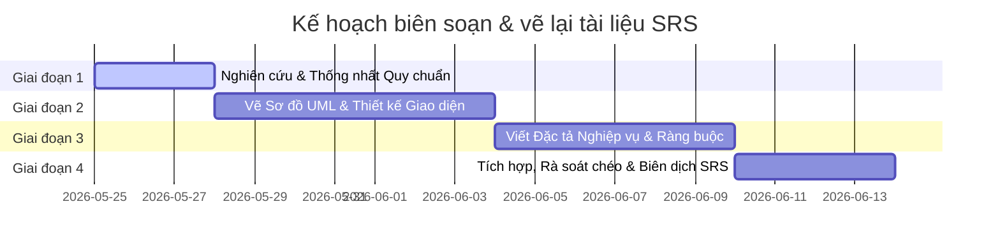

# Kế Hoạch Phân Chia Công Việc Nhóm (5 Thành Viên) - Dự Án Coffee Shop Management System

Tài liệu này trình bày kế hoạch phân chia chi tiết cho nhóm **5 thành viên** để thiết kế lại, vẽ sơ đồ và hoàn thiện tài liệu Đặc tả Yêu cầu Phần mềm (SRS) cho **Hệ thống Quản lý Quán Cà phê (Coffee Shop Management System)**.

---

## 1. Nguyên Tắc Phân Chia (Division Principles)

Để đảm bảo dự án triển khai suôn sẻ và công bằng, kế hoạch phân chia công việc tuân theo các nguyên tắc sau:
1. **Cân bằng khối lượng công việc (Workload Balance):** Mỗi thành viên phụ trách số lượng màn hình (Screens), Use Cases và sơ đồ (Diagrams) có độ phức tạp tương đương nhau.
2. **Nhất quán theo luồng nghiệp vụ (Cohesion):** Các chức năng có tính liên kết chặt chẽ (ví dụ: Menu với Category, POS với Payments, Shifts với Attendance) sẽ được phân cho cùng một người để tránh xung đột logic.
3. **Rõ ràng về sản phẩm đầu ra (Clear Deliverables):** Mỗi thành viên tự chịu trách nhiệm vẽ các sơ đồ (UML Diagrams), thiết kế Mockups giao diện và đặc tả chi tiết (Use Case Descriptions, Business Rules) cho các phần được phân công.

---

## 2. Bảng Phân Bổ Chi Tiết Theo Mục Lục (TOC Assignment Matrix)

Dưới đây là sơ đồ phân công các file tài liệu nằm trong thư mục `sections/` cho từng thành viên:

| Thành viên | Vai trò & Phạm vi Nghiệp vụ chính | Các file tài liệu phụ trách (`sections/`) | Sơ đồ chính cần vẽ (UML & UI) |
|---|---|---|---|
| **Thành viên 1** (Trưởng nhóm) | **Tổng quan & Bảo mật hệ thống**<br>- Thiết lập cấu trúc tài liệu<br>- Quản lý tài khoản nhân sự & Phân quyền truy cập | - [00_record_of_changes.md](file:///c:/Users/pc/.gemini/antigravity-ide/scratch/coffee_shop_srs/sections/00_record_of_changes.md)<br>- [01_product_overview.md](file:///c:/Users/pc/.gemini/antigravity-ide/scratch/coffee_shop_srs/sections/01_product_overview.md)<br>- [02_user_requirements.md](file:///c:/Users/pc/.gemini/antigravity-ide/scratch/coffee_shop_srs/sections/02_user_requirements.md)<br>- [03_2_system_access_security.md](file:///c:/Users/pc/.gemini/antigravity-ide/scratch/coffee_shop_srs/sections/03_2_system_access_security.md) | - Sơ đồ ngữ cảnh (System Context Diagram)<br>- Sơ đồ Phân cấp Actor (Actor Generalization)<br>- Sơ đồ Use Case Hệ thống Authentication<br>- Giao diện (Mockups) Đăng nhập, Profile, Quản lý tài khoản |
| **Thành viên 2** | **Quản lý Danh mục & Chiến dịch Marketing**<br>- Thực đơn & Công thức chế biến (Recipes)<br>- Khuyến mãi, Mã giảm giá (Vouchers)<br>- Cấu hình hệ thống | - [03_3_menu_management.md](file:///c:/Users/pc/.gemini/antigravity-ide/scratch/coffee_shop_srs/sections/03_3_menu_management.md)<br>- [03_4_category_management.md](file:///c:/Users/pc/.gemini/antigravity-ide/scratch/coffee_shop_srs/sections/03_4_category_management.md)<br>- [03_10_promotion_campaign.md](file:///c:/Users/pc/.gemini/antigravity-ide/scratch/coffee_shop_srs/sections/03_10_promotion_campaign.md)<br>- [03_13_system_configuration.md](file:///c:/Users/pc/.gemini/antigravity-ide/scratch/coffee_shop_srs/sections/03_13_system_configuration.md) | - Sơ đồ Use Case cho Menu & Categories<br>- Sơ đồ Use Case cho Vouchers<br>- Luồng chuyển màn hình (Screen Flow) quản lý Catalog & Khuyến mãi<br>- Giao diện Form thêm món ăn, cấu hình công thức, tạo Voucher |
| **Thành viên 3** | **Giao dịch POS & Thanh toán**<br>- Nghiệp vụ bán hàng tại quầy (POS Checkout)<br>- Quản lý Ca làm việc (Shifts) của Thu ngân<br>- Xử lý hoàn tiền & Sự phê duyệt của Quản lý | - [03_6_pos_transaction.md](file:///c:/Users/pc/.gemini/antigravity-ide/scratch/coffee_shop_srs/sections/03_6_pos_transaction.md)<br>- Một phần [05_appendix_mapping.md](file:///c:/Users/pc/.gemini/antigravity-ide/scratch/coffee_shop_srs/sections/05_appendix_mapping.md) (Quy tắc áp dụng mã giảm giá & Danh sách thông báo hệ thống) | - Sơ đồ Use Case POS Sales & Shifts<br>- Sơ đồ hoạt động (Activity Diagram) cho Luồng thanh toán (Process Payment) & Đóng ca (Close Shift)<br>- Giao diện POS Touchscreen Grid, màn hình checkout VietQR dynamic, modal hoàn tiền |
| **Thành viên 4** | **Quản lý Đơn hàng, Pha chế & Báo cáo**<br>- Hàng chờ pha chế (Kitchen Queue)<br>- Tích hợp đối tác giao hàng (GrabFood/ShopeeFood)<br>- Dashboards báo cáo doanh thu | - [03_7_order_management.md](file:///c:/Users/pc/.gemini/antigravity-ide/scratch/coffee_shop_srs/sections/03_7_order_management.md)<br>- [03_11_delivery_partner.md](file:///c:/Users/pc/.gemini/antigravity-ide/scratch/coffee_shop_srs/sections/03_11_delivery_partner.md)<br>- [03_12_dashboard_reporting.md](file:///c:/Users/pc/.gemini/antigravity-ide/scratch/coffee_shop_srs/sections/03_12_dashboard_reporting.md) | - Sơ đồ Use Case Quản lý Đơn hàng & Barista<br>- Sơ đồ tuần tự (Sequence Diagram) tích hợp API/Webhook đối tác giao hàng<br>- Sơ đồ trạng thái đơn hàng (Order State Machine Diagram)<br>- Giao diện hàng chờ pha chế Barista, HQ Revenue Dashboard |
| **Thành viên 5** | **Kho hàng, Nhân sự & Thiết kế Cơ sở dữ liệu (Database)**<br>- Nhập/Xuất/Kiểm kho<br>- Lịch trình làm việc & Điểm danh nhân viên<br>- Thành viên thân thiết (CRM Loyalty Points)<br>- Thiết kế ERD & Cấu trúc dữ liệu tổng quát | - [03_1_functional_overview.md](file:///c:/Users/pc/.gemini/antigravity-ide/scratch/coffee_shop_srs/sections/03_1_functional_overview.md) (ERD & Chi tiết thực thể)<br>- [03_5_inventory_management.md](file:///c:/Users/pc/.gemini/antigravity-ide/scratch/coffee_shop_srs/sections/03_5_inventory_management.md)<br>- [03_8_customer_membership.md](file:///c:/Users/pc/.gemini/antigravity-ide/scratch/coffee_shop_srs/sections/03_8_customer_membership.md)<br>- [03_9_staff_management.md](file:///c:/Users/pc/.gemini/antigravity-ide/scratch/coffee_shop_srs/sections/03_9_staff_management.md)<br>- Phần còn lại của [05_appendix_mapping.md](file:///c:/Users/pc/.gemini/antigravity-ide/scratch/coffee_shop_srs/sections/05_appendix_mapping.md) | - Sơ đồ thực thể liên kết (Entity Relationship Diagram - ERD)<br>- Sơ đồ Use Case Inventory, CRM, & Staff Schedules<br>- Giao diện Kiểm kho (Inventory Audit), Lịch làm việc nhân viên (Shift Scheduler) |

---

## 3. Nhiệm Vụ Chi Tiết Từng Thành Viên (Detailed Tasks per Member)

### Thành viên 1: Tổng quan hệ thống & Quản lý Truy cập
- **Tập tin phụ trách:** 
  - [01_product_overview.md](file:///c:/Users/pc/.gemini/antigravity-ide/scratch/coffee_shop_srs/sections/01_product_overview.md)
  - [02_user_requirements.md](file:///c:/Users/pc/.gemini/antigravity-ide/scratch/coffee_shop_srs/sections/02_user_requirements.md)
  - [03_2_system_access_security.md](file:///c:/Users/pc/.gemini/antigravity-ide/scratch/coffee_shop_srs/sections/03_2_system_access_security.md)
- **Nhiệm vụ vẽ sơ đồ & UI:**
  - **System Context Diagram:** Sơ đồ luồng dữ liệu thô giữa hệ thống và 5 tác nhân bên ngoài (Admin, Manager, Cashier, Barista, Delivery Partner).
  - **Actor Generalization Diagram:** Thể hiện cấu trúc kế thừa quyền từ lớp cơ sở `User` đến các vai trò chuyên biệt.
  - **Use Case Diagram - Authentication:** Mô tả luồng Đăng nhập, Đăng xuất, Đổi mật khẩu, Quên mật khẩu & Verify OTP.
  - **Screen Flows:** Vẽ luồng di chuyển màn hình xác thực (Authentication Screen Flow).
  - **UI Mockups:** Vẽ mockup màn hình Đăng nhập (Mobile), Xem thông tin tài khoản (Mobile), Danh sách tài khoản nhân viên (Desktop), Chi tiết tài khoản & Nhật ký hoạt động (Desktop).
- **Mục tiêu mô tả nghiệp vụ cần hoàn thiện:**
  - Định nghĩa chính xác quy tắc khóa tài khoản sau 5 lần nhập sai mật khẩu (BR-11).
  - Quy định thời gian hết hạn mã OTP gửi qua email trong vòng 10 phút (BR-16) và số lần nhập sai tối đa là 3 lần (BR-17).
  - Đặc tả chi tiết Luồng bắt buộc đổi mật khẩu lần đầu (Force Password Change) (UC-06).

---

### Thành viên 2: Quản lý Danh mục sản phẩm & Tiếp thị
- **Tập tin phụ trách:**
  - [03_3_menu_management.md](file:///c:/Users/pc/.gemini/antigravity-ide/scratch/coffee_shop_srs/sections/03_3_menu_management.md)
  - [03_4_category_management.md](file:///c:/Users/pc/.gemini/antigravity-ide/scratch/coffee_shop_srs/sections/03_4_category_management.md)
  - [03_10_promotion_campaign.md](file:///c:/Users/pc/.gemini/antigravity-ide/scratch/coffee_shop_srs/sections/03_10_promotion_campaign.md)
  - [03_13_system_configuration.md](file:///c:/Users/pc/.gemini/antigravity-ide/scratch/coffee_shop_srs/sections/03_13_system_configuration.md)
- **Nhiệm vụ vẽ sơ đồ & UI:**
  - **Use Case Diagram - Catalog & Promos:** Tổng hợp hành vi quản lý Thực đơn, Danh mục món ăn, Toppings/Options, Vouchers và Cấu hình hệ thống.
  - **Screen Flows:** Luồng thêm mới món ăn liên kết cấu hình công thức định lượng (Recipe), luồng tạo và phát hành chiến dịch Voucher.
  - **UI Mockups:** Màn hình quản lý danh sách thực đơn, Form thêm/sửa món ăn kèm chọn nguyên liệu cho công thức, Form tạo Voucher (thiết lập hạn mức, ngày hiệu lực).
- **Mục tiêu mô tả nghiệp vụ cần hoàn thiện:**
  - Định nghĩa mối liên kết giữa thực đơn và nguyên vật liệu để tự động trừ kho khi bán hàng (BR-26).
  - Đặc tả quy tắc cấu hình Voucher: thiết lập giá trị giảm tối thiểu/tối đa, giới hạn lượt dùng mỗi khách hàng (BR-31).
  - Mô tả cấu hình thuế VAT (mặc định bao gồm trong đơn giá) và cài đặt kết nối thiết bị phần cứng (máy in hóa đơn).

---

### Thành viên 3: Nghiệp vụ Bán hàng POS & Billing
- **Tập tin phụ trách:**
  - [03_6_pos_transaction.md](file:///c:/Users/pc/.gemini/antigravity-ide/scratch/coffee_shop_srs/sections/03_6_pos_transaction.md)
  - [05_appendix_mapping.md](file:///c:/Users/pc/.gemini/antigravity-ide/scratch/coffee_shop_srs/sections/05_appendix_mapping.md) (Quy tắc giảm giá & Messages List)
- **Nhiệm vụ vẽ sơ đồ & UI:**
  - **Use Case Diagram - POS Operations:** Bao quát toàn bộ hoạt động từ Mở ca, Bán hàng, Áp dụng Voucher, Đổi điểm Loyalty, Thanh toán, Xuất hóa đơn, đến Đóng ca và Yêu cầu hoàn tiền.
  - **Activity Diagram - Checkout Flow:** Vẽ chi tiết từng bước kiểm tra giỏ hàng, tra cứu thành viên, áp dụng mã giảm giá, sinh mã VietQR động, và in hóa đơn.
  - **Activity Diagram - Close Shift Dispute:** Mô tả luồng xử lý khi số tiền mặt thực tế kiểm đếm lệch so với hệ thống tính toán lúc đóng ca (Đòi hỏi xác thực của Quản lý cửa hàng).
  - **UI Mockups:** Màn hình POS bán hàng dạng lưới (Touchscreen POS Grid), Modal thanh toán QR động, Modal đổi điểm tích lũy của khách hàng, Modal nhập mã đè quyền của Quản lý (Manager Override).
- **Mục tiêu mô tả nghiệp vụ cần hoàn thiện:**
  - **Quy tắc xếp chồng ưu đãi (BR-33 / Stacking Rules):** Làm rõ thứ tự áp dụng: Chiết khấu thành viên -> Voucher giảm giá -> Đổi điểm Loyalty tích lũy.
  - Định nghĩa cơ chế sinh mã QR thanh toán động tích hợp giá trị tiền VND chính xác đến từng đơn vị đồng.
  - Quy trình xử lý lỗi kết nối và khôi phục giao dịch POS ở chế độ Ngoại tuyến (Offline POS Resilience Mode).

---

### Thành viên 4: Pha chế bếp, Giao hàng & Dashboards Báo cáo
- **Tập tin phụ trách:**
  - [03_7_order_management.md](file:///c:/Users/pc/.gemini/antigravity-ide/scratch/coffee_shop_srs/sections/03_7_order_management.md)
  - [03_11_delivery_partner.md](file:///c:/Users/pc/.gemini/antigravity-ide/scratch/coffee_shop_srs/sections/03_11_delivery_partner.md)
  - [03_12_dashboard_reporting.md](file:///c:/Users/pc/.gemini/antigravity-ide/scratch/coffee_shop_srs/sections/03_12_dashboard_reporting.md)
- **Nhiệm vụ vẽ sơ đồ & UI:**
  - **Use Case Diagram - Orders & Delivery:** Bao gồm theo dõi hàng chờ Barista, in tem dán cốc, đồng bộ đối tác giao hàng.
  - **Order State Machine Diagram:** Sơ đồ các trạng thái của đơn hàng (Pending -> Preparing -> Ready -> Completed / Cancelled) và các điều kiện chuyển trạng thái.
  - **Sequence Diagram - Delivery Partner Integration:** Thể hiện luồng gọi API/Webhooks đồng bộ danh mục thực đơn và trạng thái chuẩn bị món với đối tác thứ 3 (GrabFood/ShopeeFood).
  - **UI Mockups:** Giao diện màn hình hàng chờ pha chế của Barista (hiển thị danh sách món cần làm kèm ghi chú toppings), thiết kế nhãn dán cốc (Sticker), Dashboard báo cáo doanh thu tổng công ty (HQ Revenue) và báo cáo doanh thu cửa hàng lẻ.
- **Mục tiêu mô tả nghiệp vụ cần hoàn thiện:**
  - Quy chế tự động in nhãn dán cốc khi đơn hàng được chuyển sang trạng thái "Preparing" (Pha chế).
  - Nghiệp vụ đồng bộ trạng thái "Hết hàng" (Out of Stock) từ kho nguyên liệu trực tiếp lên ứng dụng của đối tác giao hàng.
  - Báo cáo tài chính chia nhóm theo phương thức thanh toán (Tiền mặt, Thẻ ngân hàng, Chuyển khoản VietQR) để hỗ trợ chốt ca.

---

### Thành viên 5: Thiết kế Database, Quản lý Kho & Nhân sự
- **Tập tin phụ trách:**
  - [03_1_functional_overview.md](file:///c:/Users/pc/.gemini/antigravity-ide/scratch/coffee_shop_srs/sections/03_1_functional_overview.md) (ERD & Database Schema)
  - [03_5_inventory_management.md](file:///c:/Users/pc/.gemini/antigravity-ide/scratch/coffee_shop_srs/sections/03_5_inventory_management.md)
  - [03_8_customer_membership.md](file:///c:/Users/pc/.gemini/antigravity-ide/scratch/coffee_shop_srs/sections/03_8_customer_membership.md)
  - [03_9_staff_management.md](file:///c:/Users/pc/.gemini/antigravity-ide/scratch/coffee_shop_srs/sections/03_9_staff_management.md)
- **Nhiệm vụ vẽ sơ đồ & UI:**
  - **Entity Relationship Diagram (ERD):** Sơ đồ quan hệ thực thể đầy đủ (bao gồm các bảng: `users`, `branches`, `menu_items`, `categories`, `recipes`, `ingredients`, `inventory_logs`, `orders`, `order_items`, `customers`, `vouchers`, `shifts`, `attendances`).
  - **Use Case Diagram - Operations & CRM:** Các Use Cases quản lý kho, xếp lịch làm việc nhân viên, điểm danh và quản lý hội viên.
  - **UI Mockups:** Giao diện kiểm kho thực tế (Inventory Audit Form) với trường nhập lý do lệch kho bắt buộc, lịch xếp ca làm việc tuần dạng bảng (Shift Scheduler).
- **Mục tiêu mô tả nghiệp vụ cần hoàn thiện:**
  - **Định nghĩa chi tiết cấu trúc Database (Data Dictionary):** Mô tả kiểu dữ liệu, ràng buộc (Primary Key, Foreign Key, Nullability) của từng cột trong các bảng dữ liệu.
  - Cơ chế tự động trừ kho nguyên liệu dựa trên định lượng công thức nấu (Recipe) của món ăn bán ra (BR-32).
  - Quy tắc tích lũy điểm và thăng hạng thành viên: Đồng (Bronze) -> Bạc (Silver) -> Vàng (Gold), cùng thời gian hết hạn điểm tích lũy 12 tháng (BR-34, BR-35).

---

## 4. Kế Hoạch Thực Hiện & Lộ Trình (Execution Plan & Timeline)

Dự án hoàn thiện tài liệu SRS được thực hiện qua **4 giai đoạn chính**:



### Chi tiết các giai đoạn:
1. **Giai đoạn 1: Nghiên cứu & Thống nhất Quy chuẩn (3 ngày)**
   - Toàn bộ 5 thành viên đọc hiểu cấu trúc SRS hiện tại trong file [srs_document_full.md](file:///c:/Users/pc/.gemini/antigravity-ide/scratch/coffee_shop_srs/srs_document_full.md).
   - Thống nhất phong cách vẽ sơ đồ (sử dụng công cụ Mermaid, Draw.io hoặc Figma) và bảng màu thiết kế UI Mockups để đảm bảo tính nhất quán trực quan.
2. **Giai đoạn 2: Vẽ Sơ đồ UML & Thiết kế Giao diện (7 ngày)**
   - Mỗi thành viên vẽ các sơ đồ Use Case, Activity, Sequence, State Machine được giao.
   - Thiết kế giao diện (Mockups) và chuẩn bị các bảng định nghĩa trường dữ liệu cho màn hình (Screen Definitions).
3. **Giai đoạn 3: Viết Đặc tả Nghiệp vụ & Ràng buộc (6 ngày)**
   - Viết các mô tả Use Case chi tiết (Luồng chính, luồng thay thế/ngoại lệ) vào các file markdown tương ứng.
   - Bổ sung các quy tắc nghiệp vụ (Business Rules) và mã thông báo tương ứng cho từng chức năng.
4. **Giai đoạn 4: Tích hợp, Rà soát chéo & Biên dịch SRS (4 ngày)**
   - Nhóm tiến hành rà soát chéo tài liệu của nhau để kiểm tra tính logic và sửa lỗi chính tả.
   - Cập nhật nhật ký thay đổi trong file [00_record_of_changes.md](file:///c:/Users/pc/.gemini/antigravity-ide/scratch/coffee_shop_srs/sections/00_record_of_changes.md).
   - Chạy tập lệnh Python [compile_srs.py](file:///c:/Users/pc/.gemini/antigravity-ide/scratch/coffee_shop_srs/compile_srs.py) hoặc PowerShell [compile_srs.ps1](file:///c:/Users/pc/.gemini/antigravity-ide/scratch/coffee_shop_srs/compile_srs.ps1) để biên dịch toàn bộ các phần riêng lẻ thành một tài liệu duy nhất: [srs_document_full.md](file:///c:/Users/pc/.gemini/antigravity-ide/scratch/coffee_shop_srs/srs_document_full.md).

---

## 5. Hướng Dẫn Tích Hợp Và Biên Dịch Tài Liệu (Integration Guide)

Sau khi hoàn thành phần viết đặc tả trong các file markdown đơn lẻ trong thư mục `sections/`, thành viên phụ trách tích hợp sẽ thực hiện các bước sau:

1. **Kiểm tra sự tồn tại của các file:** Đảm bảo các tập tin đặc tả có cấu trúc và vị trí chính xác như được liệt kê trong tập lệnh biên dịch.
2. **Chạy script biên dịch:**
   - **Cách 1: Sử dụng Python** (Khuyên dùng)
     ```bash
     python compile_srs.py
     ```
   - **Cách 2: Sử dụng PowerShell** (Dành cho môi trường Windows)
     ```powershell
     ./compile_srs.ps1
     ```
3. **Kiểm tra kết quả:** Mở file [srs_document_full.md](file:///c:/Users/pc/.gemini/antigravity-ide/scratch/coffee_shop_srs/srs_document_full.md) để kiểm tra tính liền mạch, định dạng markdown hiển thị đúng và sơ đồ Mermaid không bị lỗi cú pháp.
