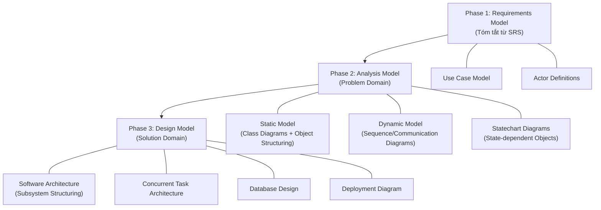
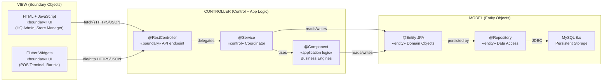
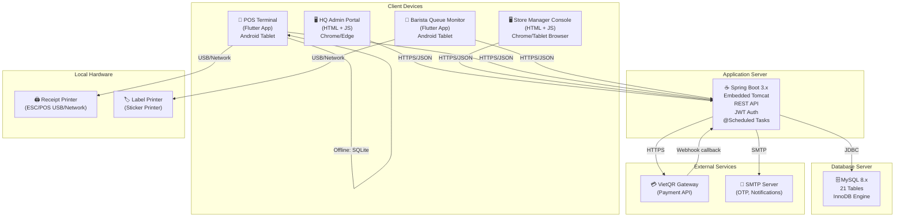

# Kế Hoạch Hoàn Thành RDS — Khoga Café Shop
## Tuân Thủ Nghiêm Ngặt Chuẩn COMET (Hassan Gomaa)

> **COMET** = **C**oncurrent **O**bject **M**odeling and Architectural D**e**sign Me**t**hod
> Phương pháp thiết kế phần mềm hướng đối tượng, use-case-driven, sử dụng UML, chuyên biệt cho hệ thống concurrent/distributed.
> Ref: *Hassan Gomaa, "Software Modeling and Design: UML, Use Cases, Patterns, and Software Architectures", Cambridge University Press.*

---

## Tổng Quan Cấu Trúc RDS Theo COMET

RDS sẽ được tổ chức theo **3 phase chính** của COMET, mỗi phase tạo ra các artifact cụ thể:



---

# PHASE 1: REQUIREMENTS MODEL (Tóm Tắt Từ SRS)

> Mục đích: Xác định **"hệ thống làm gì"** — hệ thống là black box.
> SRS đã hoàn thành phase này. RDS sẽ tóm tắt làm đầu vào cho Analysis & Design.

## 1.1 Use Case Model (Đã có trong SRS)

- **83 use cases** (UC-01 → UC-83) chia thành 11 nhóm chức năng
- **6 actors** theo mô hình RBAC: `ceoviewer`, `businessadmin`, `ssadmin`, `storemanager`, `cashier`, `barista`
- **60 màn hình** trải qua 5 luồng portal
- **94 business rules** (BR-01 → BR-94)
- **6 non-screen automated functions**

## 1.2 Tóm Tắt 11 Module Chức Năng

| # | Module | Use Cases chính | Entity objects liên quan |
|---|--------|----------------|--------------------------|
| 1 | System Access & Security | UC-01→UC-09, UC-83 | USER, AUDIT_LOG |
| 2 | User Account Management | UC-10→UC-14 | USER, STORE, AUDIT_LOG |
| 3 | Menu & Category Management | UC-15→UC-19, UC-68→UC-72, UC-74 | MENU_ITEM, CATEGORY, OPTION_TOPPING, RAW_MATERIAL, RECIPE_ITEM, BRANCH_MENU_STATUS |
| 4 | Voucher Management | UC-20→UC-23 | VOUCHER, AUDIT_LOG |
| 5 | Customer & Membership | UC-24→UC-27, UC-49 | CUSTOMER, ORDER |
| 6 | Inventory & Stock | UC-31→UC-34, UC-61, UC-62 | STOCK_ITEM, STOCK_TRANSACTION, RAW_MATERIAL |
| 7 | POS Transaction | UC-44→UC-53, UC-55 | ORDER, ORDER_ITEM, SHIFT_SESSION, CUSTOMER, VOUCHER |
| 8 | Order Management & Queue | UC-57→UC-60, UC-73, UC-75 | ORDER, ORDER_ITEM, ORDER_CANCELLATION, ORDER_REFUND, ORDER_ITEM_TOPPING |
| 9 | Staff Management | UC-35→UC-39, UC-66, UC-80 | STAFF_SCHEDULE, ATTENDANCE, USER |
| 10 | Reports & Analytics | UC-28→UC-29, UC-40→UC-41, UC-76→UC-82 | (Aggregation queries across all entities) |
| 11 | System Configuration & Branch | UC-30, UC-42, UC-63→UC-65 | STORE, system config parameters |

---

# PHASE 2: ANALYSIS MODEL (Problem Domain)

> Mục đích: Xác định **cấu trúc nội tại** của hệ thống — các object tham gia vào từng use case, quan hệ giữa chúng, và hành vi động.
> **Không quan tâm** đến implementation/technology — chỉ tập trung vào domain.

## 2.1 Object Structuring Criteria (Tiêu Chí Phân Loại Object)

Theo COMET, mỗi object tham gia use case được phân loại bằng **5 stereotype UML**:

### 2.1.1 «entity» — Entity Objects
Đối tượng thông tin tồn tại lâu dài (persistent), đại diện dữ liệu nghiệp vụ.

| # | Entity Object | Mô tả (từ SRS §3.1.6) |
|---|---------------|------------------------|
| 1 | `User` | Tài khoản nhân viên, 6 roles RBAC |
| 2 | `Category` | Nhóm sản phẩm (Coffee, Tea, Pastry) |
| 3 | `MenuItem` | Sản phẩm thực đơn, giá, barcode |
| 4 | `BranchMenuStatus` | Trạng thái bán/ngưng bán theo chi nhánh |
| 5 | `OptionTopping` | Topping tùy chọn cho sản phẩm |
| 6 | `Customer` | Khách hàng thành viên, loyalty points |
| 7 | `ShiftSession` | Ca làm việc POS cashier |
| 8 | `Order` | Đơn hàng bán lẻ, 7 trạng thái |
| 9 | `OrderItem` | Dòng sản phẩm trong đơn hàng |
| 10 | `OrderItemTopping` | Topping đã chọn cho từng OrderItem |
| 11 | `OrderCancellation` | Log huỷ đơn PENDING |
| 12 | `OrderRefund` | Log hoàn/comp post-PENDING (SM authorized) |
| 13 | `RawMaterial` | Catalog nguyên liệu thô chuỗi |
| 14 | `StockItem` | Tồn kho theo chi nhánh |
| 15 | `StockTransaction` | Lịch sử nhập/xuất/audit kho |
| 16 | `Voucher` | Mã khuyến mãi, điều kiện, ngày hiệu lực |
| 17 | `RecipeItem` | Công thức: nguyên liệu → sản phẩm |
| 18 | `Store` | Chi nhánh cửa hàng |
| 19 | `StaffSchedule` | Lịch ca nhân viên |
| 20 | `Attendance` | Chấm công (PIN + ảnh + scheduled_start) |
| 21 | `AuditLog` | Log bảo mật bất biến |

### 2.1.2 «boundary» — Boundary Objects
Đối tượng tại biên hệ thống, giao tiếp với actors bên ngoài.

**a) User Interface Boundary Objects** (65 boundary objects từ SRS §3.1.2):

| Nhóm | Boundary Objects |
|-------|-----------------|
| Authentication | `LoginForm`, `LogoutConfirmModal`, `ForgotPasswordForm`, `OtpVerificationForm`, `SetNewPasswordForm`, `ForcePasswordChangeForm`, `ProfileView`, `EditProfileForm`, `ChangePasswordForm`, `MfaChallengeForm` |
| HQ Admin Portal | `AdminDashboard`, `UserListView`, `AddUserForm`, `EditUserForm`, `UserDetailView`, `MenuCategoryView`, `MenuItemDetailView`, `AddCategoryForm`, `EditCategoryForm`, `AddMenuItemForm`, `EditMenuItemForm`, `VoucherListView`, `VoucherDetailView`, `AddVoucherForm`, `EditVoucherForm`, `CustomerListView`, `CustomerDetailView`, `HQReportsView`, `CentralConfigView`, `BranchListView`, `AddBranchForm`, `EditBranchForm`, `RawMaterialMasterView`, `AccessReviewReportView`, `PriceChangeHistoryView`, `LoyaltyLiabilityReportView`, `COGSReportView`, `AnomalyReportView` |
| Store Manager | `ManagerDashboard`, `StockListView`, `StockHistoryView`, `StockImportForm`, `StockExportForm`, `StockAuditForm`, `ShiftSchedulerView`, `AddShiftForm`, `EditShiftForm`, `AttendanceReportView`, `StoreRevenueView`, `ReportsExportModal`, `BranchSettingsForm`, `BranchStaffListView`, `ManagerOrderHistoryView`, `OrderDetailView`, `LabourHoursReportView`, `WorkedHoursExportView`, `ZReportView` |
| Cashier POS | `OpenShiftForm`, `PosCheckoutGrid`, `MembershipLookupPopup`, `ApplyVoucherModal`, `RedeemPointsModal`, `PaymentCheckoutModal`, `PaymentRetryModal`, `CashierOrderHistoryView`, `CloseShiftForm`, `RefundCompModal` |
| Barista | `BaristaQueueMonitor`, `ReportIssueForm` |
| Common | `AttendanceCheckInPopup` |

**b) External System Boundary Objects** (Proxy/Adapter):

| Boundary Object | Hệ thống bên ngoài |
|-----------------|---------------------|
| `VietQRProxy` | VietQR Payment Gateway |
| `EmailServiceProxy` | Email SMTP (OTP, thông báo) |
| `PrinterProxy` | Máy in hóa đơn/nhãn |

### 2.1.3 «control» — Control Objects
Đối tượng điều phối luồng xử lý use case, trung gian giữa Boundary và Entity.

| # | Control Object | Use Cases điều phối |
|---|----------------|---------------------|
| 1 | `AuthenticationCoordinator` | UC-01→UC-06 (Login, MFA, OTP, Password) |
| 2 | `ProfileCoordinator` | UC-07→UC-09 (View/Update Profile, Change Password) |
| 3 | `UserManagementCoordinator` | UC-10→UC-14 (CRUD User Account) |
| 4 | `CatalogCoordinator` | UC-15→UC-19, UC-68→UC-72, UC-74 (Menu, Category, Topping, RawMaterial) |
| 5 | `VoucherCoordinator` | UC-20→UC-23 (CRUD Voucher) |
| 6 | `CustomerCoordinator` | UC-24→UC-27 (CRM, Loyalty) |
| 7 | `InventoryCoordinator` | UC-31→UC-34, UC-61, UC-62 (Stock CRUD, Auto-deduct) |
| 8 | `POSTransactionCoordinator` | UC-44→UC-55, UC-75 (Shift, Checkout, Payment, Refund) |
| 9 | `OrderQueueCoordinator` | UC-57→UC-60, UC-73 (Queue, Prep Status, Label) |
| 10 | `StaffCoordinator` | UC-35→UC-39, UC-66, UC-80 (Schedule, Attendance) |
| 11 | `ReportCoordinator` | UC-28→UC-29, UC-40→UC-41, UC-76→UC-82 (All Reports) |
| 12 | `ConfigCoordinator` | UC-30, UC-42 (Central/Branch Settings) |
| 13 | `BranchCoordinator` | UC-63→UC-65 (Branch Lifecycle) |

### 2.1.4 «application logic» — Application Logic Objects
Chứa logic nghiệp vụ phức tạp, không phải coordination đơn thuần.

| # | Application Logic Object | Mô tả |
|---|--------------------------|-------|
| 1 | `DiscountStackingEngine` | Tính toán thứ tự Voucher→Points→VAT→Accrual (BR-70) |
| 2 | `LoyaltyPointCalculator` | Tính điểm tích luỹ (BR-69), quy đổi (BR-74), hết hạn (BR-35) |
| 3 | `RecipeDeductionEngine` | Trừ tồn kho theo recipe khi PREPARING (UC-62, BR-89) |
| 4 | `ShiftReconciliationEngine` | Đối soát tiền mặt cuối ca (UC-53) |
| 5 | `COGSCalculator` | Tính chi phí nguyên liệu chuẩn (BR-66) |
| 6 | `AnomalyDetector` | Phát hiện bất thường huỷ/hoàn (BR-79) |
| 7 | `LabourEfficiencyCalculator` | Tính KPI giờ làm/doanh thu (BR-76) |
| 8 | `PasswordPolicyValidator` | Kiểm tra độ phức tạp mật khẩu (BR-14) |
| 9 | `OfflineSyncManager` | Quản lý chế độ offline, cash-only, đồng bộ (BR-86) |
| 10 | `VietQRSettlementHandler` | Xử lý callback VietQR, idempotency (BR-84/BR-85) |

### 2.1.5 «timer» — Timer Objects
Đối tượng xử lý sự kiện phụ thuộc thời gian.

| # | Timer Object | Mô tả | Chu kỳ |
|---|-------------|-------|--------|
| 1 | `OtpExpiryTimer` | OTP hết hạn sau 10 phút (BR-16) | One-shot 10 min |
| 2 | `OrderTimeoutTimer` | Huỷ đơn PENDING quá 15 phút | One-shot 15 min |
| 3 | `ShiftAutoCloseTimer` | Tự đóng ca lúc 23:59 hàng ngày | Daily 23:59 |
| 4 | `LowStockAlertTimer` | Email cảnh báo tồn kho lúc 22:00 | Daily 22:00 |
| 5 | `ReadyAbandonTimer` | READY → ABANDONED sau timeout (BR-88) | Configurable |
| 6 | `TokenRefreshTimer` | Tự gia hạn JWT trước khi hết hạn | Periodic |

---

## 2.2 Static Model — Class Diagrams (Analysis Level)

> Theo COMET: Class Diagram ở phase analysis thể hiện **domain classes** với stereotypes, attributes, và relationships. Chưa có operations chi tiết.

### Artifacts cần tạo cho mỗi module:

Mỗi module sẽ có **1 Analysis Class Diagram** thể hiện:
- Tất cả **«entity»** objects tham gia
- Các **«boundary»** objects (UI + external system proxy)
- Các **«control»** objects điều phối
- Các **«application logic»** objects phức tạp
- Relationships: association, aggregation, composition, generalization
- Multiplicity (1..*, 0..1, etc.)
- Stereotypes UML rõ ràng

| # | Analysis Class Diagram | Objects tham gia |
|---|------------------------|-------------------|
| ACD-01 | Authentication & Profile | `LoginForm`, `MfaChallengeForm`, `AuthenticationCoordinator`, `User`, `OtpExpiryTimer`, `EmailServiceProxy`, `PasswordPolicyValidator` |
| ACD-02 | User Account Management | `UserListView`, `AddUserForm`, `UserManagementCoordinator`, `User`, `Store`, `AuditLog`, `EmailServiceProxy` |
| ACD-03 | Menu & Category | `MenuCategoryView`, `AddMenuItemForm`, `CatalogCoordinator`, `MenuItem`, `Category`, `OptionTopping`, `RecipeItem`, `RawMaterial`, `BranchMenuStatus`, `AuditLog` |
| ACD-04 | Voucher Management | `VoucherListView`, `AddVoucherForm`, `VoucherCoordinator`, `Voucher`, `AuditLog` |
| ACD-05 | Customer & Membership | `CustomerListView`, `MembershipLookupPopup`, `CustomerCoordinator`, `Customer`, `Order`, `LoyaltyPointCalculator` |
| ACD-06 | Inventory & Stock | `StockListView`, `StockImportForm`, `StockAuditForm`, `InventoryCoordinator`, `StockItem`, `StockTransaction`, `RawMaterial`, `RecipeDeductionEngine`, `LowStockAlertTimer` |
| ACD-07 | POS Transaction | `PosCheckoutGrid`, `PaymentCheckoutModal`, `OpenShiftForm`, `POSTransactionCoordinator`, `Order`, `OrderItem`, `ShiftSession`, `Customer`, `Voucher`, `DiscountStackingEngine`, `VietQRProxy`, `PrinterProxy`, `OfflineSyncManager` |
| ACD-08 | Order Management & Queue | `BaristaQueueMonitor`, `OrderDetailView`, `RefundCompModal`, `OrderQueueCoordinator`, `Order`, `OrderItem`, `OrderCancellation`, `OrderRefund`, `OrderItemTopping`, `ReadyAbandonTimer` |
| ACD-09 | Staff Management | `ShiftSchedulerView`, `AttendanceReportView`, `StaffCoordinator`, `StaffSchedule`, `Attendance`, `User`, `LabourEfficiencyCalculator` |
| ACD-10 | Reports & Analytics | `HQReportsView`, `StoreRevenueView`, `ZReportView`, `ReportCoordinator`, `COGSCalculator`, `AnomalyDetector`, `LoyaltyPointCalculator` |
| ACD-11 | System Config & Branch | `CentralConfigView`, `BranchListView`, `ConfigCoordinator`, `BranchCoordinator`, `Store` |

---

## 2.3 Dynamic Model — Sequence Diagrams (Analysis Level)

> Theo COMET: Sequence Diagram thể hiện **interaction giữa objects** khi thực hiện use case.
> **Quy tắc tương tác nghiêm ngặt:**
> - Actor chỉ giao tiếp với **«boundary»**
> - «boundary» giao tiếp với **«control»**
> - «control» giao tiếp với **«entity»**, **«application logic»**, **«timer»**, và **«boundary»** (external proxy)
> - «entity» chỉ giao tiếp với **«control»** (không trực tiếp với boundary)

> **Ghi chú phạm vi**: Các UC đơn giản (CRUD list/view/delete) như UC-02 (Logout), UC-07 (View Profile), UC-08 (Update Profile), UC-09 (Change Password), UC-15/16 (View Menu List/Detail), UC-20 (View Voucher List), UC-23 (Delete Voucher), UC-24/26/27 (View/Update/View History Customer), UC-31/61 (View Stock/History), UC-35/37/38 (View/Update/Delete Schedule), UC-40/41 (Store Revenue/Export), UC-42 (Branch Settings), UC-45→UC-48 (Add/Modify/View/Remove cart items — gộp vào SD-18), UC-66 (View Branch Staff List) đều tuân theo pattern CRUD chuẩn `Actor→Boundary→Control→Entity` và **không cần Sequence Diagram riêng**. Chúng sẽ được thiết kế theo template CRUD chung.

### Danh sách Sequence Diagrams cần tạo (các luồng phức tạp):

| # | Sequence Diagram | Use Case(s) | Objects tham gia |
|---|------------------|-------------|-------------------|
| **Authentication & Security** ||||
| SD-01 | Login (incl. MFA for HQ) | UC-01 | Actor→`LoginForm`→`AuthCoordinator`→`User`→`MfaChallengeForm`→`EmailServiceProxy`→`OtpExpiryTimer` |
| SD-02 | Forgot Password → OTP → Reset | UC-03/04/05 | Actor→`ForgotPasswordForm`→`AuthCoordinator`→`User`→`EmailServiceProxy`→`OtpVerificationForm`→`SetNewPasswordForm`→`PasswordPolicyValidator` |
| SD-03 | Force Password Change | UC-06 | Actor→`ForcePasswordChangeForm`→`AuthCoordinator`→`User`→`PasswordPolicyValidator` |
| **User Management** ||||
| SD-04 | Add User Account | UC-11 | Actor→`AddUserForm`→`UserMgmtCoordinator`→`User`→`Store`→`AuditLog`→`EmailServiceProxy` |
| SD-05 | Update/Deactivate User | UC-12/14 | Actor→`EditUserForm`→`UserMgmtCoordinator`→`User`→`AuditLog` |
| **Menu & Category** ||||
| SD-06 | Add Menu Item with Recipe | UC-18 | Actor→`AddMenuItemForm`→`CatalogCoordinator`→`MenuItem`→`RecipeItem`→`RawMaterial`→`AuditLog` |
| SD-07 | Manage Toppings (incl. recipe) | UC-71 | Actor→`EditMenuItemForm`→`CatalogCoordinator`→`OptionTopping`→`RecipeItem`→`RawMaterial` |
| SD-08 | CRUD Category | UC-16/17/70 | Actor→`AddCategoryForm`→`CatalogCoordinator`→`Category`→`MenuItem` |
| SD-09 | Manage Raw Material Master | UC-74 | Actor→`RawMaterialMasterView`→`CatalogCoordinator`→`RawMaterial` |
| **Voucher** ||||
| SD-10 | Add/Update Voucher | UC-21/22 | Actor→`AddVoucherForm`→`VoucherCoordinator`→`Voucher`→`AuditLog` |
| **Customer & Membership** ||||
| SD-11 | Add Customer (PDPA consent) | UC-25 | Actor→`MembershipLookupPopup`→`CustomerCoordinator`→`Customer` |
| SD-12 | Redeem Loyalty Points | UC-49 | Actor→`RedeemPointsModal`→`POSTransactionCoordinator`→`Customer`→`LoyaltyPointCalculator`→`DiscountStackingEngine` |
| **Inventory** ||||
| SD-13 | Import Stock (invoice grid) | UC-32 | Actor→`StockImportForm`→`InventoryCoordinator`→`StockItem`→`StockTransaction`→`RawMaterial` |
| SD-14 | Export Stock | UC-33 | Actor→`StockExportForm`→`InventoryCoordinator`→`StockItem`→`StockTransaction` |
| SD-15 | Perform Inventory Audit | UC-34 | Actor→`StockAuditForm`→`InventoryCoordinator`→`StockItem`→`StockTransaction` |
| SD-16 | Auto-Deduct on PREPARING | UC-62 | `OrderQueueCoordinator`→`RecipeDeductionEngine`→`RecipeItem`→`StockItem`→`StockTransaction`→`LowStockAlertTimer` |
| **POS Transaction** ||||
| SD-17 | Open Shift | UC-44 | Actor→`OpenShiftForm`→`POSTransactionCoordinator`→`ShiftSession`→`User` |
| SD-18 | Full POS Checkout Flow | UC-45→UC-52 | Actor→`PosCheckoutGrid`→`POSTransactionCoordinator`→`MenuItem`→`OrderItem`→`Order`→`DiscountStackingEngine`→`VietQRProxy`/`PrinterProxy` |
| SD-19 | Close Shift (reconciliation) | UC-53 | Actor→`CloseShiftForm`→`POSTransactionCoordinator`→`ShiftSession`→`ShiftReconciliationEngine` |
| SD-20 | VietQR Payment + callback | UC-51 | Actor→`PaymentCheckoutModal`→`POSTransactionCoordinator`→`VietQRProxy`→`VietQRSettlementHandler`→`Order` |
| SD-21 | Offline Cash-Only Mode | UC-51 AT4 | Actor→`PosCheckoutGrid`→`POSTransactionCoordinator`→`OfflineSyncManager`→`Order` |
| **Order Management** ||||
| SD-22 | Cancel PENDING Order | UC-55 | Actor→`CashierOrderHistoryView`→`POSTransactionCoordinator`→`Order`→`OrderCancellation`→`StockItem` |
| SD-23 | SM Refund/Comp post-PENDING | UC-75 | Actor→`RefundCompModal`→`OrderQueueCoordinator`→`Order`→`OrderRefund`→`Customer`→`LoyaltyPointCalculator`→`AuditLog` |
| SD-24 | Barista Update Prep + Print Label | UC-58/59 | Actor→`BaristaQueueMonitor`→`OrderQueueCoordinator`→`Order`→`PrinterProxy` |
| SD-25 | READY Auto-Abandon | (BR-88) | `ReadyAbandonTimer`→`OrderQueueCoordinator`→`Order` |
| **Staff Management** ||||
| SD-26 | Create Staff Schedule | UC-36 | Actor→`AddShiftForm`→`StaffCoordinator`→`StaffSchedule`→`User`→`LabourEfficiencyCalculator` |
| SD-27 | Attendance Check-in/out (PIN+photo) | UC-39 | Actor→`AttendancePopup`→`StaffCoordinator`→`Attendance`→`User` |
| SD-28 | Export Worked-Hours | UC-80 | Actor→`WorkedHoursExportView`→`StaffCoordinator`→`Attendance`→`PrinterProxy` |
| **Reports** ||||
| SD-29 | HQ Consolidated Reports | UC-28 | Actor→`HQReportsView`→`ReportCoordinator`→(aggregation queries) |
| SD-30 | COGS/Margin & Shrinkage | UC-76 | Actor→`COGSReportView`→`ReportCoordinator`→`COGSCalculator`→`RecipeItem`→`StockTransaction` |
| SD-31 | Daily Z-Report | UC-81 | Actor→`ZReportView`→`ReportCoordinator`→`ShiftSession`→`Order` |
| SD-32 | Cashier Void/Refund Anomaly | UC-82 | Actor→`AnomalyReportView`→`ReportCoordinator`→`AnomalyDetector`→`OrderCancellation`→`OrderRefund` |
| SD-33 | Loyalty Liability & Movement | UC-78 | Actor→`LoyaltyLiabilityReportView`→`ReportCoordinator`→`LoyaltyPointCalculator`→`Customer`→`Order` |
| **Config & Branch** ||||
| SD-34 | Configure Central Settings | UC-30 | Actor→`CentralConfigView`→`ConfigCoordinator`→`AuditLog` |
| SD-35 | Add/Update/Deactivate Branch | UC-63/64/65 | Actor→`AddBranchForm`→`BranchCoordinator`→`Store`→`User`→`StaffSchedule` |

---

## 2.4 Statechart Diagrams (State-Dependent Objects)

> Theo COMET: Đối tượng có **hành vi phụ thuộc trạng thái** cần Statechart Diagram.

### 2.4.1 ORDER Statechart
7 trạng thái: `PENDING` → `PREPARING` → `HOLD` → `READY` → `COMPLETED` → `CANCELLED` / `ABANDONED`

```
Tạo statechart diagram cho:
- Events gây chuyển trạng thái (cashier confirm, barista start prep, barista ready, customer pickup, cancel, timeout)
- Guard conditions (BR-05: chỉ cancel PENDING, BR-88: READY auto-abandon timeout)
- Actions (stock deduction on PREPARING, loyalty accrual on COMPLETED, stock reversal on CANCEL)
```

### 2.4.2 SHIFT_SESSION Statechart
2 trạng thái: `OPEN` → `CLOSED`
- Events: cashier open shift, cashier close shift, auto-close timer
- Actions: record opening/closing cash, calculate discrepancy

### 2.4.3 USER Account Statechart
Trạng thái: `ACTIVE` (must_change_password=true) → `ACTIVE` (normal) → `LOCKED` (5 failed attempts) → `INACTIVE`

### 2.4.4 VOUCHER Lifecycle Statechart
Trạng thái: `ACTIVE` → `EXPIRED` (hết ngày hiệu lực) / `EXHAUSTED` (hết lượt sử dụng) / `DELETED` (soft-delete)
- Events: time passes end_date, usage_count >= max_usage, businessadmin deletes
- Guard conditions: current_date > end_date, remaining_usage == 0
- Actions: không còn áp dụng được tại checkout

---

# PHASE 3: DESIGN MODEL (Solution Domain)

> Mục đích: Chuyển Analysis Model sang **kiến trúc phần mềm** cụ thể.
> **Tech Stack đã xác nhận:**
> - **Backend**: Java 17+ / Spring Boot 3.x (REST API, Security, JPA, Scheduling)
> - **Web Frontend**: HTML5 + JavaScript (Vanilla JS / Thymeleaf cho HQ Admin Portal, Store Manager Console)
> - **Mobile/Tablet Frontend**: Flutter (Dart) — cho POS Terminal, Barista Queue Monitor
> - **Database**: MySQL 8.x (hoặc PostgreSQL 15+)

## 3.0 Technology Stack Overview

| Layer | Công nghệ | Vai trò |
|-------|-----------|----------|
| **Backend Framework** | Spring Boot 3.x (Java 17+) | REST API, business logic, authentication |
| **Security** | Spring Security + JWT + TOTP | RBAC, MFA cho HQ roles, stateless sessions |
| **ORM / Data Access** | Spring Data JPA + Hibernate | Entity mapping, repository pattern |
| **Database** | MySQL 8.x | Relational storage, ACID transactions |
| **Scheduling** | Spring `@Scheduled` / `@Async` | Timer objects, background tasks |
| **Email** | Spring Boot Mail (JavaMailSender) | OTP, notifications, low stock alerts |
| **Payment Integration** | RestTemplate / WebClient | VietQR API callback handling |
| **Web Frontend** | HTML5 + JavaScript + CSS | HQ Admin Portal, Store Manager Console |
| **Mobile/Tablet Frontend** | Flutter (Dart) | POS Terminal, Barista Queue Monitor |
| **API Communication** | RESTful JSON over HTTPS | Web ↔ Backend, Flutter ↔ Backend |
| **Offline Support** | Flutter SQLite (sqflite) + Sync Queue | POS offline cash-only mode |
| **Build** | Maven / Gradle | Backend build & dependency management |
| **Containerization** | Docker + Docker Compose | Development & deployment |

---

## 3.0.1 MVC Architecture Pattern

> Hệ thống áp dụng mô hình **MVC (Model–View–Controller)** kết hợp với COMET.
> COMET's Entity–Boundary–Control (EBC) pattern ánh xạ tự nhiên sang MVC:
>
> **Lưu ý quan trọng về dual perspective**: Trong COMET, `@RestController` được phân loại là `«boundary»` vì nó nằm ở biên hệ thống server (nhận request từ client). Tuy nhiên, trong mô hình MVC, nó thuộc **Controller layer** vì nó nhận request và delegate cho Service. Hai phân loại này **không mâu thuẫn** — chúng mô tả cùng một thành phần từ **hai góc nhìn** khác nhau: COMET nhìn từ system boundary, MVC nhìn từ request flow.

### COMET → MVC Mapping



### MVC Layer Details

| MVC Layer | COMET Stereotype | Spring Boot Implementation | Trách nhiệm |
|-----------|-----------------|---------------------------|--------------|
| **Model** | `«entity»` | `@Entity` (JPA/Hibernate) + `@Repository` (Spring Data) | Đại diện dữ liệu nghiệp vụ, persistence, business state. Bao gồm 21 domain entities (User, Order, MenuItem, etc.) và data access interfaces. |
| **View** | `«boundary»` (UI) | **Web**: HTML5 + JavaScript (`src/main/resources/static/`) | Hiển thị dữ liệu, thu thập input từ user. Gọi REST API qua `fetch()`/`XMLHttpRequest`. |
| | | **Mobile**: Flutter Widgets (`khoga_pos_app/lib/`) | Hiển thị dữ liệu, thu thập input. Gọi REST API qua `dio`/`http` package. Hỗ trợ offline cache (SQLite). |
| **Controller** | `«control»` + `«application logic»` | `@RestController` (API entry point) + `@Service` (business logic coordinator) + `@Component` (complex engines) | Nhận request từ View, điều phối xử lý, gọi Model, trả response. Phân tách 2 tầng: API Controller (thin) và Service (thick business logic). |

### MVC Request Flow

#### Flow 1: Web Client (HTML/JS) → Spring Boot MVC

```
┌──────────────────┐     HTTPS/JSON      ┌──────────────────────────────────────────┐
│   VIEW           │ ──────────────────→  │   CONTROLLER                             │
│                  │                      │                                          │
│  HTML Page       │                      │  @RestController (API Gateway)           │
│  + JavaScript    │  ← JSON Response ──  │      ↓ delegates                         │
│  (fetch API)     │                      │  @Service (Business Logic)               │
│                  │                      │      ↓ uses                              │
└──────────────────┘                      │  @Component (Application Logic Engines)  │
                                          │      ↓ reads/writes                      │
                                          │  ─────────────────────────────────────── │
                                          │   MODEL                                  │
                                          │  @Entity (JPA Domain Objects)             │
                                          │  @Repository (Spring Data JPA)            │
                                          │      ↓ JDBC                              │
                                          │  MySQL 8.x                               │
                                          └──────────────────────────────────────────┘
```

#### Flow 2: Flutter Client → Spring Boot MVC

```
┌──────────────────┐     HTTPS/JSON      ┌──────────────────────────────────────────┐
│   VIEW           │ ──────────────────→  │   CONTROLLER                             │
│                  │                      │                                          │
│  Flutter Widget  │                      │  @RestController (API Gateway)           │
│  + Dart HTTP     │  ← JSON Response ──  │      ↓ delegates                         │
│  (dio package)   │                      │  @Service (Business Logic)               │
│                  │                      │      ↓ uses                              │
│  ┌────────────┐  │                      │  @Component (Application Logic Engines)  │
│  │SQLite Cache│  │                      │      ↓ reads/writes                      │
│  │(Offline)   │  │                      │  ─────────────────────────────────────── │
│  └────────────┘  │                      │   MODEL                                  │
│                  │                      │  @Entity (JPA Domain Objects)             │
└──────────────────┘                      │  @Repository (Spring Data JPA)            │
                                          │      ↓ JDBC                              │
                                          │  MySQL 8.x                               │
                                          └──────────────────────────────────────────┘
```

### MVC × COMET × Spring Boot — Ví Dụ Cụ Thể: UC-51 Process Payment

| Bước | MVC Layer | COMET Object | Spring Class | Mô tả |
|------|-----------|-------------|-------------|-------|
| 1 | **View** | `«boundary»` PaymentCheckoutModal | `payment_screen.dart` (Flutter) | Cashier chọn phương thức thanh toán, nhấn "Pay" |
| 2 | **Controller** | `«boundary»` API endpoint | `PosController.processPayment()` (`@RestController`) | Nhận POST `/api/pos/payment`, validate request DTO |
| 3 | **Controller** | `«control»` Coordinator | `CheckoutService.processPayment()` (`@Service`) | Điều phối: kiểm tra shift, tính discount, gọi payment |
| 4 | **Controller** | `«application logic»` | `DiscountStackingService.calculate()` (`@Component`) | Tính Voucher→Points→VAT theo BR-70 |
| 5 | **Controller** | `«boundary»` External Proxy | `VietQRClient.createQR()` (`@Component`) | Gọi VietQR API tạo mã QR thanh toán |
| 6 | **Model** | `«entity»` Order | `Order.java` (`@Entity`) | Cập nhật payment_status = COMPLETED |
| 7 | **Model** | `«entity»` Repository | `OrderRepository.save()` (`@Repository`) | Persist vào MySQL |
| 8 | **Controller** | `«control»` | `CheckoutService` | Gọi LoyaltyPointService tính điểm, gọi PrinterService in hóa đơn |
| 9 | **View** | `«boundary»` | Flutter Widget | Hiển thị kết quả thanh toán thành công |

---

## 3.1 Software Architecture — Subsystem Structuring

> Theo COMET: Hệ thống được phân rã thành **subsystems** — các aggregate objects thực hiện information hiding. Mỗi subsystem có interface (contract) rõ ràng.
> Trong Spring Boot, mỗi subsystem ánh xạ thành **1 Java package** với cấu trúc `Controller → Service → Repository`.

### 3.1.1 Tiêu Chí Phân Subsystem (theo Gomaa)
- **Functional dependency**: Objects tham gia cùng use cases → cùng subsystem
- **Separation of concerns**: Mỗi subsystem thực hiện 1 chức năng chính
- **Information hiding**: Chi tiết nội bộ ẩn sau subsystem contract/interface

### 3.1.2 Subsystem → Spring Boot Package Mapping

| # | Subsystem (COMET) | Loại | Java Package | Spring Components |
|---|-------------------|------|-------------|--------------------|
| 1 | `AuthSubsystem` | **Service** | `com.khoga.auth` | `AuthController` (`@RestController`), `AuthService` (`@Service`), `JwtTokenProvider`, `MfaService`, `OtpService` |
| 2 | `UserSubsystem` | **Service** | `com.khoga.user` | `UserController`, `UserService`, `UserRepository` (`@Repository` / JPA) |
| 3 | `CatalogSubsystem` | **Service** | `com.khoga.catalog` | `MenuController`, `CategoryController`, `ToppingController`, `RawMaterialController`, + Services + Repositories |
| 4 | `VoucherSubsystem` | **Service** | `com.khoga.voucher` | `VoucherController`, `VoucherService`, `VoucherRepository` |
| 5 | `CustomerSubsystem` | **Service** | `com.khoga.customer` | `CustomerController`, `CustomerService`, `LoyaltyPointService`, `CustomerRepository` |
| 6 | `InventorySubsystem` | **Service** | `com.khoga.inventory` | `StockController`, `StockService`, `RecipeDeductionService`, `StockItemRepository`, `StockTransactionRepository` |
| 7 | `POSSubsystem` | **Coordinator** | `com.khoga.pos` | `PosController`, `CheckoutService` (`@Service`), `PaymentService`, `ShiftSessionService`, `DiscountStackingService` |
| 8 | `OrderSubsystem` | **Service** | `com.khoga.order` | `OrderController`, `OrderService`, `OrderQueueService`, `CancellationService`, `RefundService` |
| 9 | `StaffSubsystem` | **Service** | `com.khoga.staff` | `ScheduleController`, `AttendanceController`, `ScheduleService`, `AttendanceService` |
| 10 | `ReportSubsystem` | **Service** | `com.khoga.report` | `ReportController`, `DashboardService`, `COGSReportService`, `ZReportService`, `AnomalyReportService` |
| 11 | `ConfigSubsystem` | **Service** | `com.khoga.config` | `ConfigController`, `SystemConfigService` |
| 12 | `BranchSubsystem` | **Service** | `com.khoga.branch` | `BranchController`, `BranchService`, `StoreRepository` |
| 13 | `AuditSubsystem` | **Service** | `com.khoga.audit` | `AuditLogService` (`@Service`), `AuditLogRepository`, `@EntityListeners` |
| 14 | `ExternalInterfaceSubsystem` | **Boundary** | `com.khoga.integration` | `VietQRClient` (`RestTemplate`), `EmailService` (`JavaMailSender`), `PrinterService` |
| 15 | `PersistenceSubsystem` | **Entity (Data)** | `com.khoga.common.entity` | All `@Entity` classes + `@Repository` interfaces |
| 16 | `UISubsystem (Web)` | **Boundary** | HTML/JS files in `src/main/resources/static/` | Trang HTML + JS gọi REST API |
| 17 | `UISubsystem (Flutter)` | **Boundary** | Flutter project `khoga_pos_app/` | Dart widgets + HTTP client gọi REST API |

### 3.1.3 Spring Boot Package Structure

```
com.khoga.coffeeshop/
├── KhogaApplication.java                  // @SpringBootApplication
├── config/
│   ├── SecurityConfig.java                 // Spring Security + JWT filter chain
│   ├── CorsConfig.java                     // CORS for Web & Flutter
│   ├── SchedulingConfig.java               // @EnableScheduling, @EnableAsync
│   └── JpaAuditConfig.java                 // @EnableJpaAuditing
├── auth/
│   ├── controller/AuthController.java      // «boundary» @RestController
│   ├── service/AuthService.java            // «control» @Service
│   ├── service/JwtTokenProvider.java       // «application logic»
│   ├── service/MfaService.java             // «application logic» (TOTP/OTP)
│   ├── service/OtpService.java             // «application logic»
│   ├── dto/LoginRequest.java, LoginResponse.java
│   └── filter/JwtAuthenticationFilter.java
├── user/
│   ├── controller/UserController.java      // «boundary»
│   ├── service/UserService.java            // «control»
│   ├── repository/UserRepository.java      // «entity» access (JPA)
│   └── dto/
├── catalog/
│   ├── controller/{Menu,Category,Topping,RawMaterial}Controller.java
│   ├── service/{Menu,Category,Topping,RawMaterial,Recipe}Service.java
│   ├── repository/{MenuItem,Category,OptionTopping,RawMaterial,RecipeItem}Repository.java
│   └── dto/
├── voucher/
│   ├── controller/VoucherController.java
│   ├── service/VoucherService.java
│   └── repository/VoucherRepository.java
├── customer/
│   ├── controller/CustomerController.java
│   ├── service/{CustomerService, LoyaltyPointService}.java
│   └── repository/CustomerRepository.java
├── inventory/
│   ├── controller/StockController.java
│   ├── service/{StockService, RecipeDeductionService}.java
│   └── repository/{StockItemRepository, StockTransactionRepository}.java
├── pos/
│   ├── controller/PosController.java
│   ├── service/{CheckoutService, PaymentService, ShiftSessionService, DiscountStackingService}.java
│   ├── repository/ShiftSessionRepository.java  // «entity» access for ShiftSession
│   └── dto/
├── order/
│   ├── controller/OrderController.java
│   ├── service/{OrderService, OrderQueueService, CancellationService, RefundService}.java
│   └── repository/{OrderRepository, OrderItemRepository, ...}.java
├── staff/
│   ├── controller/{ScheduleController, AttendanceController}.java
│   ├── service/{ScheduleService, AttendanceService}.java
│   └── repository/{StaffScheduleRepository, AttendanceRepository}.java
├── report/
│   ├── controller/ReportController.java
│   ├── service/{DashboardService, COGSReportService, ZReportService, AnomalyReportService, ...}.java
│   └── dto/
├── branch/
│   ├── controller/BranchController.java
│   ├── service/BranchService.java
│   └── repository/StoreRepository.java
├── audit/
│   ├── service/AuditLogService.java
│   └── repository/AuditLogRepository.java
├── integration/
│   ├── vietqr/VietQRClient.java            // «boundary» external proxy
│   ├── email/EmailService.java             // «boundary» JavaMailSender
│   └── printer/PrinterService.java         // «boundary» ESC/POS
├── common/
│   ├── entity/                             // All @Entity JPA classes
│   │   ├── User.java, Category.java, MenuItem.java, ...
│   │   └── enums/{Role, OrderStatus, PaymentStatus, ...}.java
│   ├── dto/                                // Shared DTOs
│   ├── exception/                          // Custom exceptions + @ControllerAdvice
│   └── util/                               // Validators, converters
└── scheduler/
    ├── OrderTimeoutScheduler.java          // «timer» @Scheduled
    ├── ShiftAutoCloseScheduler.java        // «timer» @Scheduled(cron)
    ├── LowStockAlertScheduler.java         // «timer» @Scheduled(cron)
    └── ReadyAbandonScheduler.java          // «timer» @Scheduled
```

### 3.1.4 Component Diagram (Kiến Trúc 4-Tier Cụ Thể)

```
┌─────────────────────────────────────────────────────────────────────┐
│                     PRESENTATION TIER                               │
│                                                                     │
│  ┌──────────────────────────┐  ┌─────────────────────────────────┐  │
│  │   HTML + JavaScript      │  │         Flutter (Dart)          │  │
│  │   (src/main/resources/   │  │   (khoga_pos_app/)              │  │
│  │    static/)              │  │                                 │  │
│  │                          │  │  ┌───────────┐ ┌─────────────┐  │  │
│  │  • HQ Admin Portal       │  │  │ POS       │ │ Barista     │  │  │
│  │  • Store Manager Console │  │  │ Terminal  │ │ Queue       │  │  │
│  │                          │  │  │ (Tablet)  │ │ Monitor     │  │  │
│  │  fetch() → REST API      │  │  └───────────┘ └─────────────┘  │  │
│  │                          │  │  http/dio → REST API            │  │
│  │                          │  │  sqflite (offline cache)        │  │
│  └──────────────────────────┘  └─────────────────────────────────┘  │
│                          ▼ HTTPS / JSON ▼                           │
├─────────────────────────────────────────────────────────────────────┤
│                  APPLICATION TIER (Spring Boot)                      │
│                                                                     │
│  @RestController Layer (API Gateway)                                │
│  ┌──────────┬──────────┬──────────┬──────────┬──────────┐          │
│  │ AuthCtrl │ UserCtrl │ PosCtrl  │ OrderCtrl│ ReportCtrl│ ...      │
│  └──────┬───┴──────┬───┴──────┬───┴────┬─────┴──────┬───┘          │
│         ▼          ▼          ▼        ▼            ▼               │
│  @Service Layer (Business Logic + Control Objects)                  │
│  ┌──────────┬──────────┬──────────┬──────────┬──────────┐          │
│  │AuthSvc  │UserSvc   │Checkout  │OrderSvc  │Dashboard │ ...       │
│  │MfaSvc   │          │Svc       │QueueSvc  │Svc       │           │
│  │OtpSvc   │          │PaymentSvc│RefundSvc │COGSSvc   │           │
│  └──────┬───┴──────┬───┴──────┬───┴────┬─────┴──────┬───┘          │
│         ▼          ▼          ▼        ▼            ▼               │
│  Application Logic Objects (@Component)                             │
│  ┌──────────────────┬──────────────────┬────────────────────┐      │
│  │DiscountStacking  │RecipeDeduction   │LoyaltyPointCalc   │ ...  │
│  │Engine            │Engine            │                    │      │
│  └──────────────────┴──────────────────┴────────────────────┘      │
├─────────────────────────────────────────────────────────────────────┤
│                     DOMAIN TIER (JPA Entities)                      │
│                                                                     │
│  @Entity: User, Category, MenuItem, Order, OrderItem, Customer,    │
│           ShiftSession, StockItem, StockTransaction, Voucher,      │
│           RawMaterial, RecipeItem, Store, StaffSchedule,            │
│           Attendance, AuditLog, OrderCancellation, OrderRefund,     │
│           BranchMenuStatus, OptionTopping, OrderItemTopping         │
│                                                                     │
│  @Repository (Spring Data JPA interfaces)                           │
├─────────────────────────────────────────────────────────────────────┤
│                  INFRASTRUCTURE TIER                                 │
│                                                                     │
│  ┌────────────┐ ┌───────────────┐ ┌──────────────┐ ┌────────────┐  │
│  │ MySQL 8.x  │ │VietQR Client  │ │EmailService  │ │PrinterSvc  │  │
│  │ (JPA/JDBC) │ │(RestTemplate) │ │(JavaMailSend)│ │(ESC/POS)   │  │
│  └────────────┘ └───────────────┘ └──────────────┘ └────────────┘  │
│                                                                     │
│  @Scheduled Tasks (Timer Objects):                                  │
│  OrderTimeoutScheduler | ShiftAutoCloseScheduler |                  │
│  LowStockAlertScheduler | ReadyAbandonScheduler                     │
└─────────────────────────────────────────────────────────────────────┘
```

### 3.1.5 COMET Object → Spring Annotation Mapping

| COMET Stereotype | Spring Boot Mapping | Ví dụ |
|------------------|---------------------|-------|
| «boundary» (UI Controller) | `@RestController` + `@RequestMapping` | `AuthController`, `PosController` |
| «boundary» (External Proxy) | `@Component` + `RestTemplate`/`JavaMailSender` | `VietQRClient`, `EmailService` |
| «control» (Coordinator) | `@Service` + `@Transactional` | `AuthService`, `CheckoutService` |
| «entity» (Persistent) | `@Entity` + `@Table` (JPA/Hibernate) | `User`, `Order`, `MenuItem` |
| «entity» (Repository) | `@Repository` (Spring Data JPA) | `UserRepository extends JpaRepository` |
| «application logic» | `@Component` / `@Service` | `DiscountStackingEngine`, `COGSCalculator` |
| «timer» (Scheduled) | `@Component` + `@Scheduled(cron=...)` | `OrderTimeoutScheduler` |
| «timer» (Async) | `@Async` + `CompletableFuture` | `OfflineSyncTask` |

---

## 3.2 Concurrent Task Architecture (Spring Boot Implementation)

> Theo COMET: Phân biệt **Active objects** (task — thread riêng) và **Passive objects** (gọi bởi active objects).
> Trong Spring Boot: Active objects = `@Scheduled` methods + `@Async` methods + Event listeners.

### Active Objects (Concurrent Tasks) — Spring `@Scheduled`

| # | Task Class | Spring Annotation | Cron / Rate | Mô tả |
|---|-----------|-------------------|-------------|-------|
| 1 | `OrderTimeoutScheduler` | `@Scheduled(fixedRate = 60000)` | Mỗi 1 phút | Quét đơn PENDING > 15 phút → auto-cancel |
| 2 | `ShiftAutoCloseScheduler` | `@Scheduled(cron = "59 59 23 * * *")` | 23:59 daily | Tự đóng ca chưa close |
| 3 | `LowStockAlertScheduler` | `@Scheduled(cron = "0 0 22 * * *")` | 22:00 daily | Gửi email cảnh báo tồn kho thấp |
| 4 | `ReadyAbandonScheduler` | `@Scheduled(fixedRate = 30000)` | Mỗi 30 giây | READY > `READY_ABANDON_TIMEOUT` → ABANDONED |
| 5 | `TokenRefreshScheduler` | (Client-side, Flutter) | Before expiry | JWT refresh trên Flutter client |

### Active Objects — Spring `@Async` + Event Listeners

| # | Task | Spring Mechanism | Mô tả |
|---|------|-----------------|-------|
| 6 | `VietQRCallbackHandler` | `@RestController` (webhook endpoint) | Nhận POST callback từ VietQR gateway |
| 7 | `OfflineSyncProcessor` | `@Async` + REST endpoint | Flutter gửi batch offline orders khi có mạng |
| 8 | `AuditLogWriter` | `@Async` + `@TransactionalEventListener` | Ghi audit log bất đồng bộ |

### Passive Objects
Tất cả `@Entity`, `@Service` (business logic), `@Repository` là **passive** — được gọi bởi request threads (Tomcat thread pool) hoặc scheduled threads.

### Thread Pool Configuration
```java
// SchedulingConfig.java
@Configuration
@EnableScheduling
@EnableAsync
public class SchedulingConfig {
    @Bean
    public TaskScheduler taskScheduler() {
        ThreadPoolTaskScheduler scheduler = new ThreadPoolTaskScheduler();
        scheduler.setPoolSize(5); // For @Scheduled tasks
        scheduler.setThreadNamePrefix("khoga-scheduler-");
        return scheduler;
    }

    @Bean
    public Executor asyncExecutor() {
        ThreadPoolTaskExecutor executor = new ThreadPoolTaskExecutor();
        executor.setCorePoolSize(3);  // For @Async tasks
        executor.setMaxPoolSize(10);
        executor.setThreadNamePrefix("khoga-async-");
        return executor;
    }
}
```

---

## 3.3 Database Design (MySQL 8.x + Spring Data JPA)

### 3.3.1 ERD Hoàn Chỉnh
Vẽ lại ERD từ SRS §3.1.5 dưới dạng Mermaid erDiagram với **21 bảng**, đầy đủ PK/FK relationships và multiplicity.

### 3.3.2 JPA Entity Mapping
Mỗi entity object → 1 `@Entity` class với:
- `@Id` + `@GeneratedValue(strategy = GenerationType.UUID)` cho Primary Key
- `@ManyToOne`, `@OneToMany`, `@ManyToMany` cho Foreign Key relationships
- `@Column(unique = true, nullable = false, length = ...)` cho constraints
- `@Enumerated(EnumType.STRING)` cho ENUMs (Role, OrderStatus, PaymentStatus, etc.)
- `@CreatedDate`, `@LastModifiedDate` cho audit timestamps

### 3.3.3 Table Descriptions
Cho mỗi bảng, mô tả chi tiết:
- **Primary Keys** (UUID — `BINARY(16)` hoặc `CHAR(36)` trong MySQL)
- **Foreign Keys** (tham chiếu cụ thể với `ON DELETE` behavior)
- **Constraints** (UNIQUE, NOT NULL, CHECK, DEFAULT)
- **Data types** (VARCHAR, UUID, DECIMAL(15,2) cho VND, TIMESTAMP, ENUM)
- **Indexes** quan trọng (covering indexes cho queries phổ biến)

*(Danh sách 21 bảng — xem Phase 2 §2.1.1)*

### 3.3.4 Spring Data JPA Repository Pattern
```java
// Ví dụ: OrderRepository.java
@Repository
public interface OrderRepository extends JpaRepository<Order, UUID> {
    List<Order> findByStoreIdAndOrderStatus(UUID storeId, OrderStatus status);
    List<Order> findByCreatedAtBetween(LocalDateTime start, LocalDateTime end);
    @Query("SELECT o FROM Order o WHERE o.orderStatus = 'PENDING' AND o.createdAt < :cutoff")
    List<Order> findTimedOutPendingOrders(@Param("cutoff") LocalDateTime cutoff);
}
```

---

## 3.4 Deployment Diagram



### Deployment Nodes Detail

| Node | Phần cứng | Phần mềm | Ghi chú |
|------|-----------|----------|----------|
| **HQ Admin Portal** | PC/Laptop | Chrome/Edge + HTML/JS | Truy cập qua browser, responsive |
| **Store Manager Console** | Laptop/Tablet | Chrome/Edge + HTML/JS | Có thể dùng trên tablet browser |
| **POS Terminal** | Android Tablet (10"+) | Flutter APK | Offline-capable (SQLite cache), kết nối máy in |
| **Barista Queue Monitor** | Android Tablet (10"+) | Flutter APK | Real-time queue via polling/SSE |
| **Application Server** | Cloud VM / On-premise | JDK 17 + Spring Boot JAR + Docker | Scalable, stateless |
| **Database Server** | Cloud VM / On-premise | MySQL 8.x | Backup daily, replication optional |
| **Receipt/Label Printer** | USB/Network connected | ESC/POS compatible | Kết nối trực tiếp với POS/Barista tablet |

---

# Thứ Tự Thực Hiện RDS

| Bước | Section RDS | COMET Phase | Ước lượng |
|------|-------------|-------------|-----------|
| **1** | §I Record of Changes | — | Ngắn |
| **2** | §1 Requirements Model Summary + UC Master List (83 UCs) | Phase 1 | Ngắn |
| **3** | §2.1 Object Structuring (5 stereotype tables) | Phase 2 - Static | Trung bình |
| **4** | §2.2 Analysis Class Diagrams (11 ACDs) | Phase 2 - Static | Dài |
| **5** | §2.3 Sequence Diagrams (35 SDs) + CRUD Template | Phase 2 - Dynamic | Dài |
| **6** | §2.4 Statechart Diagrams (4: Order, Shift, User, Voucher) | Phase 2 - Dynamic | Trung bình |
| **7** | §3.0 Technology Stack + §3.0.1 MVC Architecture Pattern | Phase 3 - Architecture | Ngắn |
| **8** | §3.1 Subsystem Decomposition + Component Diagram | Phase 3 - Architecture | Trung bình |
| **9** | §3.2 Concurrent Task Architecture | Phase 3 - Concurrency | Ngắn |
| **10** | §3.3 Database Design (ERD + 21 Table Descriptions) | Phase 3 - Data | Dài |
| **11** | §3.4 Deployment Diagram | Phase 3 - Deployment | Ngắn |
| **12** | §3.5 NFR Design Mapping (optional) | Phase 3 - Quality | Trung bình |

---

## Open Questions

> [!IMPORTANT]
> **Q1**: Bạn muốn RDS viết bằng **tiếng Anh** (giống SRS) hay **tiếng Việt**?

> [!IMPORTANT]
> **Q2**: Bạn muốn tạo **tất cả 35 sequence diagrams** hay chỉ các luồng chính (~15 diagram quan trọng nhất)?

> [!NOTE]
> ~~**Q3**~~: **ĐÃ TRẢ LỜI** — Tech stack: Spring Boot 3.x (Java 17+) + HTML/JS (Web) + Flutter (Mobile/Tablet) + MySQL 8.x

> [!IMPORTANT]
> **Q4**: Bạn muốn RDS xuất ra dưới dạng **1 file Markdown duy nhất** hay **nhiều file** chia theo phase?
