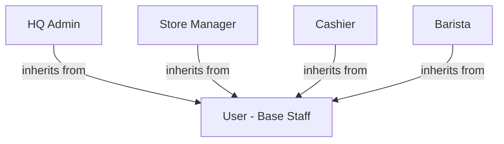

# Tóm Tắt Dự Án Coffee Shop Management System (Khoga Café)

Tài liệu này tóm tắt toàn bộ Đặc tả Yêu cầu Phần mềm (SRS) của dự án **Hệ thống Quản lý Quán Cà phê (Khoga Café)**, bao gồm mục tiêu, phân hệ chức năng, các luồng quy trình cốt lõi và các ràng buộc phi chức năng quan trọng.

---

## 1. Mục Tiêu & Phạm Vi Dự Án

### 1.1 Mục tiêu
*   **Vận hành hiệu quả (Operational Efficiency)**: Đẩy nhanh tốc độ gọi món, xử lý đơn và thanh toán tại quầy POS.
*   **Kiểm soát kho chặt chẽ (Inventory Control)**: Theo dõi nguyên vật liệu theo thời gian thực, tự động trừ kho dựa trên định lượng công thức món, cấu hình cảnh báo tồn kho thấp.
*   **Phân quyền rõ ràng (Role-based Security)**: Định hình ranh giới chức năng rõ rệt cho Admin, Quản lý cửa hàng (Store Manager), Thu ngân (Cashier) và Nhân viên pha chế (Barista).
*   **Báo cáo tập trung**: Cung cấp cái nhìn tài chính toàn diện qua các báo cáo doanh thu chi tiết theo chi nhánh và toàn chuỗi.

### 1.2 Phạm vi dự án
*   **Trong phạm vi (In-Scope)**:
    *   Xác thực & Bảo mật (Đăng nhập, OTP phục hồi mật khẩu, Force Password Change lần đầu đăng nhập).
    *   Quản lý danh mục & thực đơn (Menu, Categories, Toppings & Options).
    *   Logistics kho hàng (Nhập kho, Xuất kho, Kiểm kho điều chỉnh lệch, lịch sử giao dịch kho).
    *   Bán hàng POS tại quầy (Quản lý ca làm việc, giỏ hàng, VietQR động, thẻ hội viên, voucher).
    *   Nhân sự chi nhánh (Lịch phân ca, chấm công tự động qua đăng nhập/đăng xuất).
    *   Chương trình Hội viên Loyalty (Tích lũy & khấu trừ điểm thành viên).
    *   Dashboards báo cáo doanh thu cấp chi nhánh và cấp tổng công ty (HQ).
*   **Ngoài phạm vi (Out-of-Scope)**:
    *   Không tính toán bảng lương chi tiết hay trực tiếp thực hiện thanh toán lương (chỉ xuất báo cáo chấm công & số phút đi muộn sang hệ thống kế toán).

---

## 2. Hệ Thống Vai Trò & Tác Nhân (Actors)

Tất cả tài khoản hệ thống kế thừa quyền hạn cơ bản từ một Base Actor gọi là `User`. Các vai trò chuyên biệt bao gồm:

*   **HQ Admin (Quản trị viên Trung tâm)**: Quản lý danh mục thực đơn toàn hệ thống, cấu hình chuỗi chi nhánh, điều hành chiến dịch khuyến mãi (Vouchers), cấp phát tài khoản nhân sự và xem báo cáo hợp nhất toàn chuỗi.
*   **Store Manager (Quản lý Cửa hàng)**: Phụ trách một chi nhánh. Quản lý kho, điều chỉnh kiểm kê, xếp ca làm việc tuần cho nhân viên, xem báo cáo doanh thu nội bộ và chấm công.
*   **Cashier (Thu ngân)**: Thao tác chính trên POS bán hàng. Thực hiện mở/đóng ca, chọn món, tra cứu thông tin khách hàng, áp dụng giảm giá, in hóa đơn và xử lý hủy/hoàn trả đơn hàng.
*   **Barista (Nhân viên Pha chế)**: Sử dụng màn hình tablet ngang để theo dõi hàng chờ đơn hàng, cập nhật trạng thái chế biến, in tem dán cốc và báo cáo lỗi thiết bị/nguyên liệu.

---

## 3. Các Luồng Nghiệp Vụ Cốt Lõi

### 3.1 Quy trình Trừ Kho tự động dựa trên công thức (Recipe Deduction)
1.  Đơn hàng được Cashier thanh toán thành công và chuyển sang hàng đợi ở trạng thái **PENDING**.
2.  Barista bấm **START PREP** (Bắt đầu pha chế) chuyển trạng thái đơn hàng sang **PREPARING**.
3.  Hệ thống tự động tra cứu bảng Công thức (`recipe_items`) của các món trong đơn hàng và trừ trực tiếp số lượng nguyên liệu tương ứng trong kho chi nhánh (`stock_items`).
4.  Nếu nguyên liệu chạm ngưỡng tối thiểu (`min_alert_threshold`), hệ thống lập tức hiển thị cảnh báo tồn kho thấp và gửi email tổng hợp hàng đêm lúc 22:00.

### 3.2 Quy trình Đóng/Mở ca và Đối chiếu két tiền
*   **Mở ca (Open Shift)**: Thu ngân bắt buộc nhập mã két POS và số tiền mặt ban đầu trong két (starting cash float).
*   **Đóng ca (Close Shift)**: Thu ngân kiểm đếm tiền mặt thực tế và nhập vào hệ thống.
*   **Tách biệt Logout & Active Shift**: Thu ngân được phép đăng xuất (User Session) mà không bắt buộc phải Đóng ca (Close Shift). Ca làm việc (Shift Session) của két POS vẫn được duy trì mở để người khác đăng nhập bán tiếp.
    *   Hệ thống tính toán số tiền mặt lý thuyết dựa trên doanh số thanh toán bằng tiền mặt trừ đi tiền hoàn trả trong ca.
    *   Nếu phát hiện chênh lệch giữa số tiền đếm thực tế và lý thuyết **vượt quá 100.000 VND**, hệ thống sẽ ghi nhận log chênh lệch và tự động gửi email cảnh báo tới Quản lý cửa hàng (hoặc đẩy thông báo về Admin Portal nếu gửi mail lỗi).
    *   Ca làm việc chỉ được đóng khi tất cả đơn hàng thuộc ca đó đã đạt trạng thái cuối cùng (**COMPLETED** hoặc **CANCELLED**).

### 3.3 Quy trình Khách hàng thân thiết (CRM) & Voucher
*   **Quy tắc tích lũy điểm**: Tích lũy điểm hội viên theo % Net Total Payable (có giới hạn tích lũy tối đa/đơn). Points are not accrued for the portion covered by point redemption.
*   **Quy tắc tiêu điểm**: Chỉ những khách hàng đạt tối thiểu hạng **Silver** mới được phép quy đổi điểm thưởng để giảm giá hóa đơn, giới hạn tối đa % hóa đơn được giảm và số tiền giảm tối đa/đơn.
*   **Phân hạng hội viên cập nhật thời gian thực**:
    *   **Bronze**: 0 - 99 điểm (Ưu đãi 0%).
    *   **Silver**: 100 - 499 điểm (Giảm giá 5% hóa đơn).
    *   **Gold**: 500 - 999 điểm (Giảm giá 10% hóa đơn).
    *   **Diamond**: 1000+ điểm (Giảm giá 15% hóa đơn).
*   **Quy tắc xếp chồng ưu đãi (Discount Stacking Rules)**:
    1. Áp dụng Chiết khấu theo hạng thành viên (Tier Discount) trước.
    2. Áp dụng Mã giảm giá (Voucher) sau đó.
    3. Áp dụng khấu trừ điểm Loyalty tích lũy cuối cùng.
    *Lưu ý*: Tổng số tiền thanh toán cuối cùng không bao giờ được âm (tối thiểu là 0 VND).

### 3.4 Quy trình Hủy Đơn & Hoàn Tiền (Order Cancellation)
*   **Quy tắc hủy**: Chỉ cho phép hủy đơn khi đang ở trạng thái **PENDING** (Chờ chế biến/Chưa thanh toán). Khi đã chuyển sang chế biến (**PREPARING** trở đi), chức năng hủy đơn bị vô hiệu hóa hoàn toàn đối với mọi vai trò.
*   **Vận hành**: Thu ngân tự bấm hủy trực tiếp trên màn hình chi tiết đơn hàng POS, không cần mã PIN phê duyệt của Quản lý cửa hàng.
*   **Tác động kho hàng khi hủy**:
    *   Vì đơn bị hủy ở trạng thái **PENDING** nên các sản phẩm tự chế biến chưa trừ kho (chỉ trừ khi sang **PREPARING**). Các sản phẩm đóng gói/bán sẵn (đã trừ lúc thanh toán) sẽ được tự động hoàn trả lại vào kho.
*   **Hoàn tiền**: Hoàn tiền mặt lấy từ két thu ngân. Hoàn thanh toán thẻ/VietQR sẽ gọi API hoàn trả của cổng thanh toán. Hạn mức hoàn tiền tối đa trong vòng **7 ngày** từ khi mua.

### 3.5 Chế độ Ngoại tuyến (Offline POS Resilience Mode)
*   Khi chi nhánh mất kết nối internet, máy POS của Thu ngân chuyển sang chế độ ngoại tuyến:
    *   Cho phép thực hiện gọi món và thanh toán bằng tiền mặt/thẻ vật lý bình thường.
    *   Tạm khóa các tính năng cần kết nối trực tuyến như: Quét mã VietQR động, tra cứu/tiêu điểm Loyalty, xác thực voucher trực tuyến (chỉ cho phép xác thực voucher lưu cục bộ).
    *   Đơn hàng ngoại tuyến được mã hóa và lưu trữ an toàn trong bộ nhớ máy POS (`local storage`).
    *   Khi khôi phục kết nối internet, hệ thống tự động đồng bộ tất cả đơn hàng ngoại tuyến lên máy chủ trong vòng **60 giây**.

---

## 4. Các Ràng Buộc & Yêu Cầu Phi Chức Năng (NFRs)

*   **Quy mô tối đa**: Hệ thống hỗ trợ giới hạn số lượng chi nhánh hoạt động đồng thời một cách linh hoạt thông qua cấu hình tham số hệ thống `MAX_ACTIVE_BRANCHES`. Các chi nhánh bị ngắt hoạt động (`is_active = false`) không tính vào giới hạn này.
*   **Uptime**: Cam kết dịch vụ máy chủ hoạt động liên tục đạt **99.9% uptime**.
*   **Thời gian phản hồi**:
    *   Thêm món vào giỏ hàng POS: dưới **100ms**.
    *   Xác nhận thanh toán / tạo QR: dưới **1.5s**.
    *   Tải báo cáo tài chính/doanh thu: dưới **2s**.
*   **Bảo mật**:
    *   Mã hóa toàn bộ lưu lượng qua HTTPS với giao thức TLS 1.3.
    *   Khóa đăng nhập tài khoản 15 phút nếu nhập sai mật khẩu 5 lần liên tiếp.
    *   Token phiên làm việc tự động thu hồi sau 30 phút nếu người dùng không có hoạt động tương tác.
*   **Sao lưu dữ liệu**:
    *   RPO (Recovery Point Objective): Tối đa mất mát dữ liệu trong **1 giờ** (tự động backup DB mỗi 60 phút).
    *   RTO (Recovery Time Objective): Phục hồi hoàn toàn hệ thống sau thảm họa trong vòng **4 giờ**.
