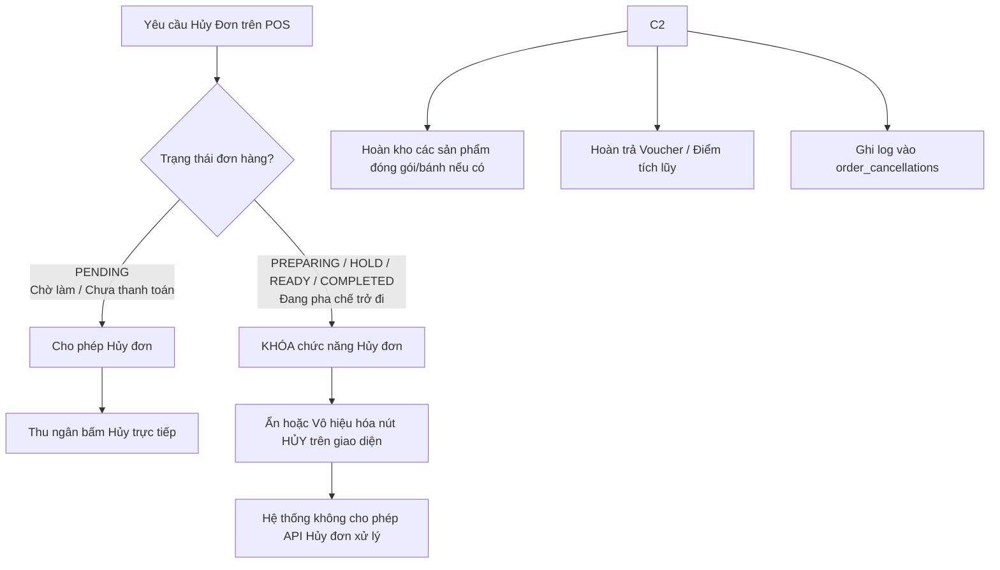

# Đặc Tả Quy Trình Hủy Đơn Hàng Tối Giản (Khoga Café)
Tài liệu đặc tả quy trình hủy đơn hàng được đơn giản hóa tối đa: **Chỉ cho phép hủy đơn khi ở trạng thái `PENDING`**. Một khi đơn hàng đã bắt đầu chế biến, hệ thống sẽ khóa hoàn toàn chức năng hủy đơn.

---

## 1. Nguyên Tắc Thiết Kế Luồng Hủy Đơn Tối Giản

Quy trình hủy đơn mới cực kỳ đơn giản và không cần mã PIN phê duyệt của Quản lý:



### Chi tiết nghiệp vụ:

1.  **Đơn hàng được phép hủy (Chỉ trạng thái `PENDING`)**:
    *   **Đối tượng thực hiện**: Thu ngân (Cashier) bấm hủy trực tiếp trên màn hình POS. Không cần mã PIN xác nhận của Quản lý.
    *   **Thời điểm**: Khách hàng đổi ý ngay khi vừa gọi món xong hoặc thu ngân phát hiện nhập nhầm thông tin trước khi chuyển cho quầy pha chế.
    *   **Xử lý kho & khuyến mãi**: Hoàn kho sản phẩm đóng chai/bánh đóng gói, khôi phục lại Voucher và điểm tích lũy của thành viên.

2.  **Đơn hàng KHÔNG được phép hủy (`PREPARING`, `HOLD`, `READY`, `COMPLETED`)**:
    *   **Nguyên tắc**: Khi Barista đã nhấn "Bắt đầu pha chế" (`START PREP`), đơn hàng chính thức đi vào quy trình sản xuất tiêu hao nguyên liệu. Hệ thống sẽ **khóa/vô hiệu hóa hoàn toàn nút Hủy** trên cả màn hình của Thu ngân và Quản lý.
    *   **Lợi ích**: 
        *   Loại bỏ hoàn toàn rủi ro gian lận tiền mặt bằng cách hủy đơn sau khi khách đã nhận hàng.
        *   Không cần xử lý nghiệp vụ "hao hụt nguyên vật liệu do hủy đơn" phức tạp trên phần mềm (vì không cho phép hủy khi đang làm).
        *   Không cần thiết kế luồng xác thực mã PIN Quản lý phiền phức.

---

## 2. Cập Nhật Cấu Trúc Cơ Sở Dữ Liệu

Vì không cần người duyệt hủy (chỉ có Thu ngân tự hủy đơn `PENDING`), cấu trúc bảng `order_cancellations` sẽ trở nên cực kỳ tinh gọn.

### Schema SQL:
```sql
CREATE TABLE order_cancellations (
    id UUID PRIMARY KEY DEFAULT gen_random_uuid(),
    order_id UUID NOT NULL REFERENCES orders(id),
    cashier_id UUID NOT NULL REFERENCES users(id), -- Thu ngân thực hiện hủy
    reason VARCHAR(100) NOT NULL,                  -- Lý do hủy (Lỗi nhập liệu, Khách đổi ý,...)
    notes TEXT NOT NULL,                           -- Giải trình chi tiết của thu ngân
    created_at TIMESTAMP WITH TIME ZONE DEFAULT CURRENT_TIMESTAMP
);

CREATE INDEX idx_cancellations_order ON order_cancellations(order_id);
```

---

## 3. Hướng Dẫn Cập Nhật Tài Liệu SRS Chính

Để đồng bộ nghiệp vụ tối giản này vào tài liệu SRS chính, bạn chỉ cần sửa đổi các mục sau:

### Vị trí 1: Cập nhật Business Rules tại file [05_appendix_mapping.md](file:///c:/Users/pc/.gemini/antigravity-ide/scratch/coffee_shop_srs/sections/05_appendix_mapping.md)

*   **Sửa đổi [BR-51] (Order Cancellation Logging):**
    *   *Nội dung mới*: "Every order cancellation action must record the cashier's identity, timestamp, cancellation reason, and detailed notes in the `order_cancellations` log. **Order cancellation is only permitted when the order is in `PENDING` status. No manager authorization or PIN verification is required.**"

### Vị trí 2: Cập nhật Nghiệp vụ POS tại file [03_7_order_management.md](file:///c:/Users/pc/.gemini/antigravity-ide/scratch/coffee_shop_srs/sections/03_7_order_management.md)

*   **Sửa đổi [BR-05] (Cashier Cancellation Limit) tại trang quản lý đơn:**
    *   *Nội dung cũ*: "Cashiers can cancel orders at any status except COMPLETED (including PENDING, PREPARING, HOLD, and READY)."
    *   *Nội dung mới*: "**Order cancellation is strictly restricted to the `PENDING` status.** Once the order transitions to `PREPARING` (preparation started), the cancellation action is disabled for all users, including Cashiers and Managers."
*   **Cập nhật Use Case `UC-55` (Request Transaction Refund):**
    *   *Precondition*: Order is in `PENDING` status.
    *   *Main Flow*:
        1.  Thu ngân chọn đơn hàng ở trạng thái `PENDING` từ danh sách lịch sử.
        2.  Thu ngân bấm nút "Hủy đơn" (nút này chỉ xuất hiện hoặc sáng lên khi trạng thái đơn là `PENDING`).
        3.  Thu ngân chọn lý do hủy và điền ghi chú.
        4.  Hệ thống cập nhật trạng thái đơn thành `CANCELLED`, hoàn trả voucher/điểm và ghi log.

---

## 4. Cập Nhật Thiết Kế Giao Diện POS

*   **Màn hình Chi tiết đơn hàng (Order Detail)**:
    *   Nếu `status == 'PENDING'`: Nút **[ HỦY ĐƠN ]** hiển thị bình thường.
    *   Nếu `status` thuộc `['PREPARING', 'HOLD', 'READY', 'COMPLETED']`: Nút **[ HỦY ĐƠN ]** sẽ bị ẩn hoặc làm mờ đi (disabled) và không thể bấm được.
