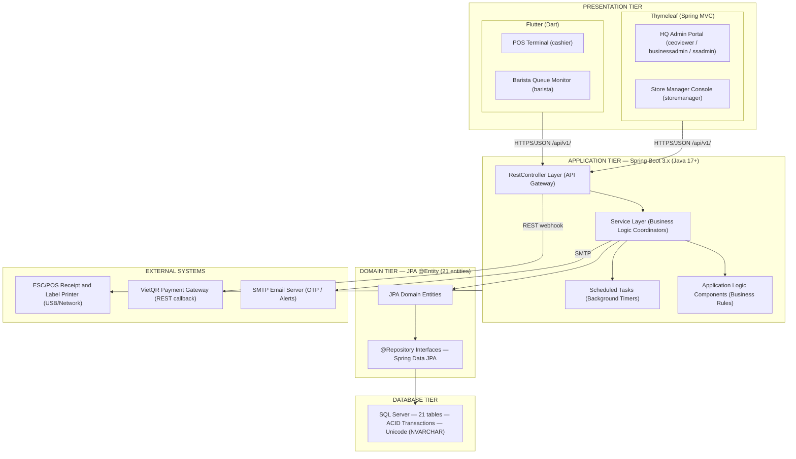

## **1\. System Design**

### **1.1 System Architecture**

*\[The content of this section includes the overall diagram which includes the sub-systems, the external systems, and the relationship/connection among them. The explanation for each of the diagram components (modules, sub-systems, external systems, etc.) is provided in the component descriptions table below. The system adopts a 4-Tier MVC architecture combined with COMET EBC (Entity–Boundary–Control) design method.\]*

***Diagram Component Descriptions***

| No | Component | COMET Type | Description |
| :---: | ----- | ----- | ----- |
| 01 | Thymeleaf Web Frontend | «boundary» (UI) | Server-side rendered web frontend using Spring Boot Thymeleaf templates for HQ Admin Portal (roles: ceoviewer, businessadmin, ssadmin) and Store Manager Console (role: storemanager). Views are rendered on the server and delivered as HTML pages. |
| 02 | Flutter (Dart) Mobile/Tablet App | «boundary» (UI) | Mobile/tablet frontend for POS Terminal (role: cashier) and Barista Queue Monitor (role: barista). Supports offline mode via sqflite SQLite for cash-only transactions (BR-86). |
| 03 | @RestController Layer | «boundary» (API Gateway) | Spring Boot REST controllers. Receive HTTP requests, validate inputs using Bean Validation, apply JWT authentication, and delegate to @Service layer. All endpoints prefixed `/api/v1/`. |
| 04 | @Service Layer | «control» (Coordinator) | Business logic orchestration. Each service coordinates domain entities, calls application logic components, and manages transactions via @Transactional. |
| 05 | Application Logic Components | «application logic» | Stateless business rule engines: DiscountStackingEngine (BR-70), RecipeDeductionEngine (BR-89), LoyaltyPointCalculator, COGSCalculator, AnomalyDetector, AttendancePhotoManager (PDPA). |
| 06 | @Scheduled Tasks | «timer» | Spring @Scheduled background timers: OrderTimeoutTimer (15 min), ShiftAutoCloseTimer (23:59 cron), LowStockAlertTimer (22:00 cron), PhotoAutoDeleteTimer (02:00 cron — PDPA 90-day purge BR-72), OtpExpiryTimer (10 min). |
| 07 | @Entity / @Repository (Domain Tier) | «entity» | 21 JPA domain entities mapped to SQL Server tables via Spring Data JPA repositories. All PK are UUID VARCHAR(36). |
| 08 | SQL Server | Database | Relational database with ACID transactions, Unicode support (NVARCHAR). 21 tables. |
| 09 | VietQR Payment Gateway | External System | Vietnamese QR payment provider. Integrated via REST webhook callback with idempotency key (orderId) to prevent duplicate charges (BR-84/BR-85). |
| 10 | SMTP Email Server | External System | Email delivery service for: OTP delivery (BR-16), low stock daily alerts (22:00), and welcome email for new staff accounts. |
| 11 | ESC/POS Printer | External System | Receipt and cup label printers connected via USB/Network to POS Terminal (Flutter) and Barista tablets. Triggered by PrinterServiceProxy after order completion. |

***COMET EBC Stereotype → Spring Boot MVC Mapping***

| COMET Stereotype | Spring Boot Implementation | Examples |
| ----- | ----- | ----- |
| «boundary» (UI Screen) | View: Thymeleaf templates (.html), Flutter Widgets | LoginForm, PosCheckoutGrid, BaristaQueueMonitor |
| «boundary» (API Endpoint) | Controller: @RestController | AuthController, OrderController, PosController |
| «boundary» (External Proxy) | Adapter: RestTemplate / WebClient | VietQRClient, EmailService, PrinterService |
| «control» (Coordinator) | Service: @Service (business orchestration) | AuthService, CheckoutService, OrderQueueService |
| «application logic» (Engine) | Component: @Component (pure business rules) | DiscountStackingEngine, RecipeDeductionEngine |
| «entity» (Domain Object) | Model: @Entity + @Repository | User, Order, MenuItem, StockItem, AuditLog |
| «timer» (Scheduled Task) | Scheduler: @Scheduled / @Async | OrderTimeoutScheduler, ShiftAutoCloseScheduler |
