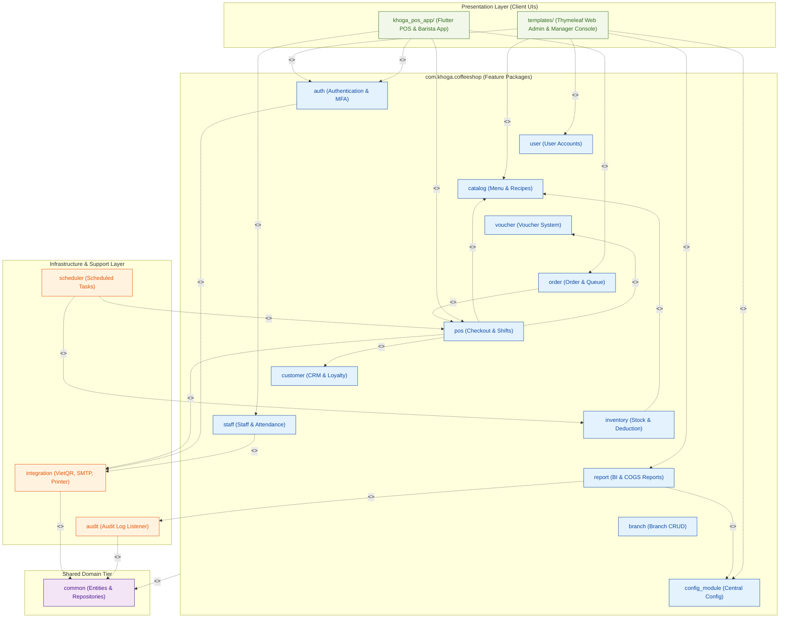

### **1.2 Package Diagram**

*\[The overall package diagram shows the decomposition of the system into 18 subsystems (packages). Each package follows the COMET Information Hiding principle, encapsulating its own controller, service, repository, and domain components. The Spring Boot backend is organized under the root package `com.khoga.coffeeshop`. The web frontend uses Thymeleaf templates in `src/main/resources/templates/`. The Flutter application is a separate project `khoga_pos_app/`.\]*

***Package Descriptions***

| No | Package | Description |
| :---: | ----- | ----- |
| 01 | `com.khoga.auth` | Authentication subsystem. Manages JWT token lifecycle, MFA (Email OTP), and password policy enforcement. Contains `AuthController` («boundary»), `AuthService` («control»), `JwtTokenProvider`, `MfaService`, `OtpService` («application logic»). Coordinates UC-01→UC-06. |
| 02 | `com.khoga.user` | User account management for ssadmin. Contains `UserController` («boundary»), `UserService` («control»), `PasswordPolicyValidator` («application logic»). Coordinates UC-10→UC-14. |
| 03 | `com.khoga.catalog` | Chain-wide menu catalog: menu items, categories, option toppings, raw material master catalog, and recipe formulation. Contains controllers and services for Menu, Category, Topping, RawMaterial, Recipe. Coordinates UC-15→UC-19, UC-68→UC-74. |
| 04 | `com.khoga.voucher` | Promotional voucher CRUD and checkout validation. Contains `VoucherController` («boundary»), `VoucherService` («control»). Coordinates UC-20→UC-23. |
| 05 | `com.khoga.customer` | Customer CRM registry and loyalty point calculation. Contains `CustomerController` («boundary»), `CustomerService` («control»), `LoyaltyPointService` («application logic»). Coordinates UC-24→UC-27, UC-49. |
| 06 | `com.khoga.inventory` | Branch stock management: import, export, physical audit, and recipe-based automatic stock deduction when orders transition to PREPARING. Contains `StockController` («boundary»), `StockService` («control»), `RecipeDeductionService` («application logic»). Coordinates UC-31→UC-34, UC-61, UC-62. |
| 07 | `com.khoga.pos` | POS terminal management: shift open/close, full checkout pipeline (cart building, discount/voucher/loyalty application), VietQR payment integration, offline sync, shift cash reconciliation. Contains `PosController` («boundary»), multiple service classes («control»), `DiscountStackingService`, `OfflineSyncManager` («application logic»). Coordinates UC-44→UC-55, UC-75. |
| 08 | `com.khoga.order` | Order lifecycle: queue display, barista status update, cashier cancellation (PENDING only), SM-authorized refund/comp. Contains `OrderController` («boundary»), `OrderService`, `OrderQueueService`, `CancellationService`, `RefundService` («control»). Coordinates UC-55→UC-60, UC-73, UC-75. |
| 09 | `com.khoga.staff` | Staff scheduling and attendance tracking. Schedule CRUD by storemanager. Attendance check-in with PIN + camera photo (PDPA-compliant BR-72). Worked-hours export. Contains schedule/attendance controllers and services, `AttendancePhotoManager` («application logic»). Coordinates UC-35→UC-39, UC-66, UC-80. |
| 10 | `com.khoga.report` | All reporting and analytics: HQ consolidated dashboard, COGS/margin, price change history, loyalty liability, labour efficiency, Z-report archive, anomaly detection. Contains `ReportController` («boundary»), multiple report service classes («application logic»). Coordinates UC-28→UC-29, UC-40→UC-41, UC-76→UC-83. |
| 11 | `com.khoga.branch` | Branch lifecycle management: add, edit, deactivate. Enforces MAX_ACTIVE_BRANCHES constraint (BR-35). Contains `BranchController` («boundary»), `BranchService` («control»). Coordinates UC-63→UC-65. |
| 12 | `com.khoga.config_module` | Central system configuration (tax rate, loyalty rates, VietQR credentials) managed by ssadmin, and branch-local overrides by storemanager. Contains `ConfigController` («boundary»), `SystemConfigService` («control»). Coordinates UC-30, UC-42. |
| 13 | `com.khoga.audit` | Immutable audit log service auto-triggered by @EntityListeners for: price changes, voucher mutations, user account changes, checkout voucher/loyalty usage. Contains `AuditLogService`. Supports BR-68, BR-80, BR-81. |
| 14 | `com.khoga.integration` | External system adapters («boundary» external proxies): `VietQRClient` + `VietQRSettlementHandler` (payment gateway), `EmailService` (SMTP OTP/alerts), `PrinterService` (ESC/POS receipt and cup label). |
| 15 | `com.khoga.common` | Shared persistence layer: all 21 JPA `@Entity` classes, `@Repository` interfaces, request/response DTOs, custom exceptions, `@ControllerAdvice`, and input validators. Classified as «entity» (data) subsystem. |
| 16 | `com.khoga.scheduler` | Spring `@Scheduled` background timer tasks («timer» subsystem): `OrderTimeoutScheduler` (15-min READY→ABANDONED), `ShiftAutoCloseScheduler` (23:59 cron), `LowStockAlertScheduler` (22:00 cron), `ReadyAbandonScheduler`, `OtpExpiryScheduler` (10-min), `PhotoAutoDeleteScheduler` (02:00 cron — PDPA BR-72). |
| 17 | `src/main/resources/templates/` | Thymeleaf server-side rendered web frontend for HQ Admin Portal and Store Manager Console. Views are rendered by Spring MVC controllers and delivered as HTML. Static assets (CSS/JS/images) reside in `src/main/resources/static/`. Classified as «boundary» (UI Web) subsystem. |
| 18 | `khoga_pos_app/` | Flutter application for POS Terminal and Barista Queue Monitor. Communicates via `dio` HTTP client. Supports offline mode via `sqflite` SQLite for cash-only operations when network is unavailable (BR-86). Classified as «boundary» (UI Flutter) subsystem. |
