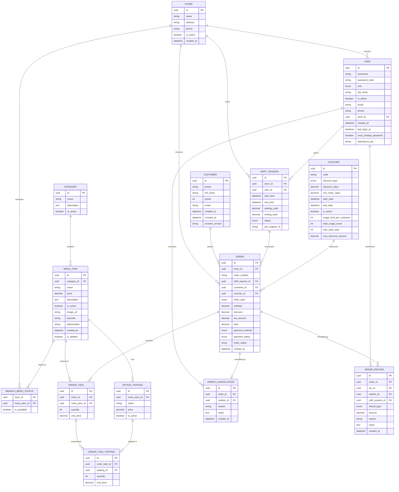
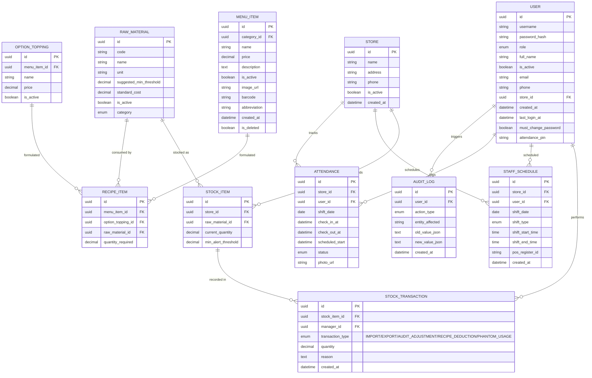

## **2\. Database Design**

*\[The database design follows the entity relationships defined in the SRS (§3.1.5 / §3.1.6). The system uses `SQL Server` with ACID transactions and Unicode support (`NVARCHAR`). All primary keys use `UUID` (`VARCHAR(36)`). The diagrams below show the entity relationships with full column definitions, followed by the table descriptions.\]*

### **2.1. Core Sales & POS ERD**

*\[This diagram focuses on sales flows at the POS terminal, Menu information, Customers, Shift sessions, and Promotions.\]*

### **2.2. Operations, Staffing & Audit ERD**

*\[This diagram focuses on inventory management, recipe formulation for items/toppings, staff schedules, attendance tracking, and system audit logs.\]*

***Table Descriptions***

| No | Table | Description |
| :---- | :---- | :---- |
| 01 | users | Stores login credentials, RBAC roles, and attendance PIN for check-in/out (BR-93). attendance_pin must be unique per store (store_id). Key definitions: PK is id (UUID); FK is store_id → stores(id) |
| 02 | categories | Main food and beverage product groupings (e.g., Coffee, Tea, Pastry). Used to organize the menu catalog chain-wide. Key definitions: PK is id (UUID) |
| 03 | menu_items | Individual beverage/food catalog listings with pricing, barcodes, chain-wide active status, and image references. Soft-delete supported via is_deleted flag. Key definitions: PK is id (UUID); FK is category_id → categories(id) |
| 04 | branch_menu_status | Per-branch item availability toggle. Allows Store Manager to temporarily disable items locally without affecting other branches. Key definitions: PK is (store_id, menu_item_id) — composite; FK is store_id → stores(id), menu_item_id → menu_items(id) |
| 05 | option_toppings | Customizable add-ons for menu items (e.g., Extra Shot, Oat Milk, Tapioca Pearls). Each topping has a price and may have a recipe formula. Key definitions: PK is id (UUID); FK is menu_item_id → menu_items(id) |
| 06 | customers | Loyalty membership registry tracking points balance. Includes PDPA consent timestamp (consent_at) and consent version (consent_version) (BR-71). Key definitions: PK is id (UUID) |
| 07 | shift_sessions | POS cashier work session records including opening/closing cash float, discrepancy, and shift status (OPEN / CLOSED). Key definitions: PK is id (UUID); FK is store_id → stores(id), user_id → users(id) |
| 08 | orders | Sales transaction records linking customer, shift, voucher, payment status, and fulfillment status (7 states: PENDING / PREPARING / HOLD / READY / COMPLETED / CANCELLED / ABANDONED). Key definitions: PK is id (UUID); FK is store_id → stores(id), shift_session_id → shift_sessions(id), customer_id → customers(id), voucher_id → vouchers(id) |
| 09 | order_items | Line items of each order with quantity and unit price snapshot at time of sale. Key definitions: PK is id (UUID); FK is order_id → orders(id), menu_item_id → menu_items(id) |
| 10 | order_item_toppings | Toppings applied to specific order line items, with quantity and price snapshot at time of sale. Key definitions: PK is id (UUID); FK is order_item_id → order_items(id), topping_id → option_toppings(id) |
| 11 | order_cancellations | Immutable audit log for PENDING order cancellations (BR-05). Records the cashier, reason code, and notes. One record per cancelled order. Key definitions: PK is id (UUID); FK is order_id → orders(id) UNIQUE, cashier_id → users(id) |
| 12 | order_refunds | Store-Manager authorized refund/comp audit log for post-PENDING complaints (UC-75, BR-67). Supports REFUND and COMP_REMAKE types, partial refund amounts. Key definitions: PK is id (UUID); FK is order_id → orders(id), sm_id → users(id), cashier_id → users(id), shift_session_id → shift_sessions(id) |
| 13 | raw_materials | Chain-wide master catalog of ingredients/materials owned exclusively by Business Admin (UC-74). The canonical source for recipe formulations and branch stock dropdowns. Supports soft-delete. Key definitions: PK is id (UUID) |
| 14 | stock_items | Per-branch on-hand quantity of a master raw material. Scoped to one store. Unique constraint on (store_id, raw_material_id). Key definitions: PK is id (UUID); FK is store_id → stores(id), raw_material_id → raw_materials(id) |
| 15 | stock_transactions | Historical ledger of all stock movements: IMPORT, EXPORT, AUDIT_ADJUSTMENT, RECIPE_DEDUCTION, PHANTOM_USAGE. System recipe deductions and phantom usage transactions have null manager_id. Key definitions: PK is id (UUID); FK is stock_item_id → stock_items(id), manager_id → users(id) |
| 16 | vouchers | Promotional discount codes with type (PERCENTAGE / FIXED_AMOUNT), usage limits per customer and total, validity dates, and cap amount for percentage discounts. Key definitions: PK is id (UUID) |
| 17 | recipe_items | Ingredient formula defining how much of a raw material is consumed to produce one unit of a menu item or topping. Exactly one of menu_item_id or option_topping_id is non-null. Key definitions: PK is id (UUID); FK is menu_item_id → menu_items(id), option_topping_id → option_toppings(id), raw_material_id → raw_materials(id) |
| 18 | stores | Physical branch locations with name, address, phone, and active status. Root entity that many other entities reference. Key definitions: PK is id (UUID) |
| 19 | staff_schedules | Assigned employee shift blocks (MORNING / AFTERNOON / FULL_DAY) per date and branch. Includes shift_start_time, shift_end_time, and optional pos_register_id allocation. Key definitions: PK is id (UUID); FK is store_id → stores(id), user_id → users(id) |
| 20 | attendance_logs | Employee clock-in/out records. At check-in, system snapshots scheduled_start (shift start time) to calculate lateness dynamically at the reporting layer; lateness is not stored in the database. Mandatory check-in photo_path stored server-side. PDPA: auto-purged after 90 days (BR-72). Key definitions: PK is id (UUID); FK is store_id → stores(id), user_id → users(id) |
| 21 | audit_logs | Immutable security event log (append-only, no UPDATE / DELETE permitted). Records price changes, voucher mutations, user account changes, checkout voucher/point usage. Key definitions: PK is id (UUID); FK is user_id → users(id) |
