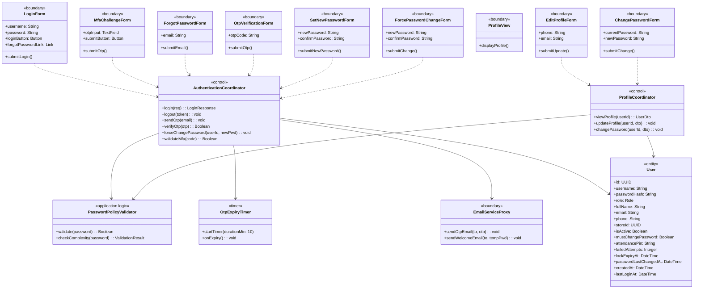
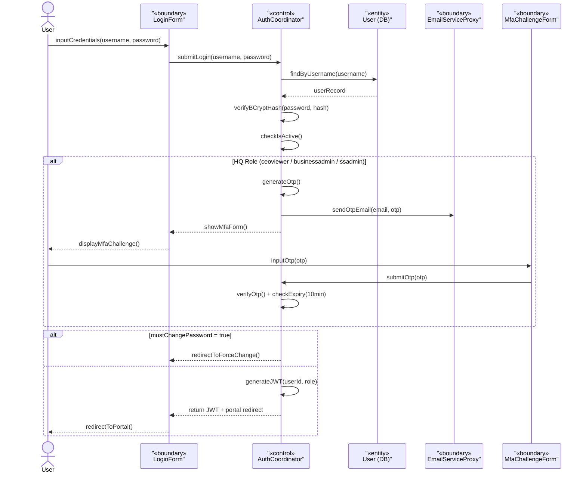
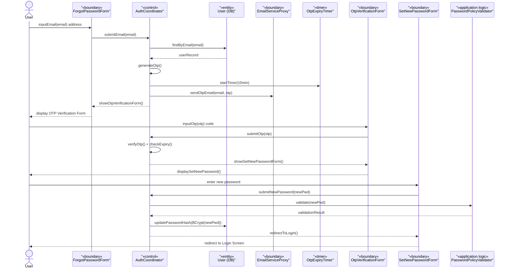
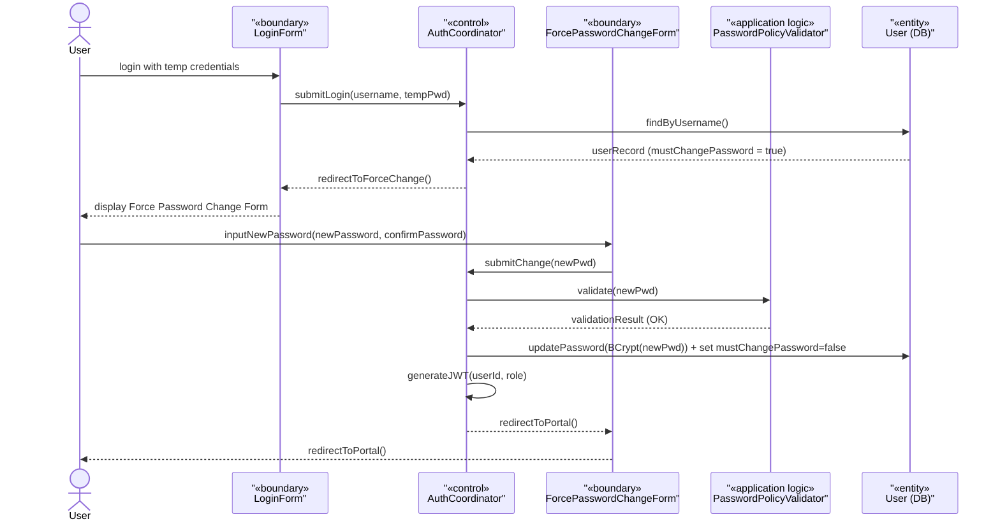
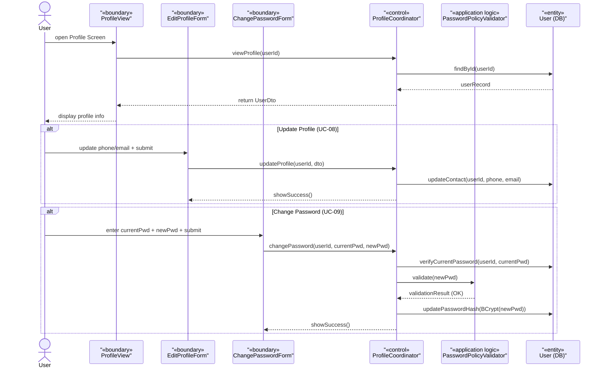
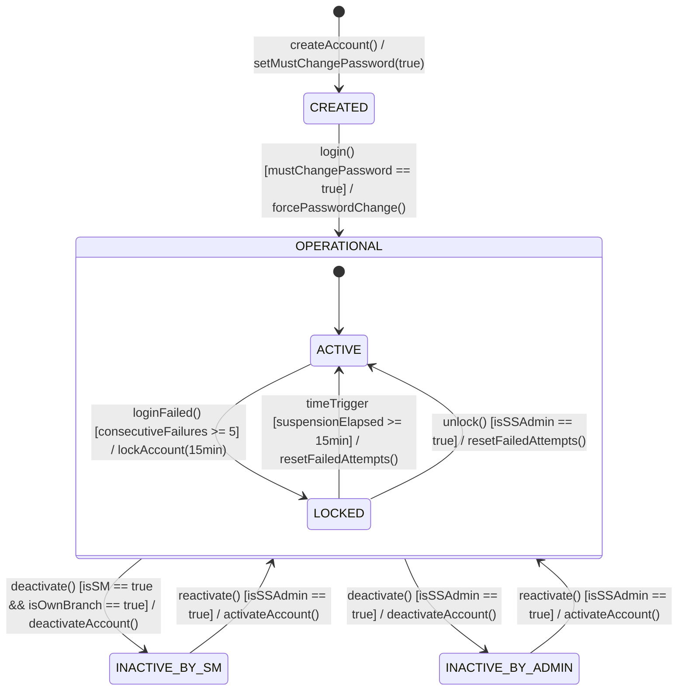

## **3\. Detailed Design**

### **3.1 System Access & Security**

*\[Provide the detailed design for System Access & Security, covering UC-01→UC-09 (Authentication, MFA, Forgot Password, Force Password Change, Profile Management). Actor: User (all 6 roles). For features with the same class structure, the class diagram is provided once and referenced from related features. The class diagram below covers UC-01→UC-09 collectively; each sequence diagram covers one specific use case flow.\]*

#### ***3.1.1 Class Diagram***

*\[This part presents the class diagram for the System Access & Security feature. COMET stereotypes applied: LoginForm, MfaChallengeForm, ForgotPasswordForm, OtpVerificationForm, SetNewPasswordForm, ForcePasswordChangeForm, ProfileView, EditProfileForm, ChangePasswordForm («boundary»), EmailServiceProxy («boundary» external); AuthenticationCoordinator, ProfileCoordinator («control»); PasswordPolicyValidator («application logic»); OtpExpiryTimer («timer»); User («entity»).\]*

#### ***3.1.2 UC-01 Login (including MFA for HQ Roles)***

*\[Describes the login flow. HQ roles (ceoviewer, businessadmin, ssadmin) require MFA via email OTP after password verification (BR-83). Branch roles (storemanager, cashier, barista) login with username/password only. After successful login, if must_change_password = true, user is redirected to Force Password Change screen (UC-06).\]*

#### ***3.1.3 UC-03/04/05 Forgot Password → OTP → Reset Password***

*\[Describes the password recovery flow. User submits registered email → system generates OTP and sends via email → OTP timer set to 10 minutes (BR-16) → user verifies OTP → user sets new password meeting complexity policy.\]*

#### ***3.1.4 UC-06 Force Password Change (First Login)***

*\[When must_change_password = true (set on account creation by ssadmin), the user is redirected to Force Password Change screen immediately after first login. The user cannot access the portal until they complete this step.\]*

#### ***3.1.5 UC-07/08/09 View Profile / Update Profile / Change Password***

*\[Profile management use cases share the ProfileCoordinator. All roles can view and update their own contact information. Change Password requires the current password for identity verification before allowing the update.\]*

#### ***3.1.6 USER Account Statechart***

*\[The User account lifecycle has 4 states. The CREATED state forces a password change on first login. ACTIVE is the normal operational state. LOCKED occurs after 5 consecutive failed login attempts and is a time-bound 15-minute suspension that auto-clears (BR-11); an ssadmin may also unlock manually. INACTIVE results from manual deactivation by ssadmin or storemanager (own branch staff only).\]*

