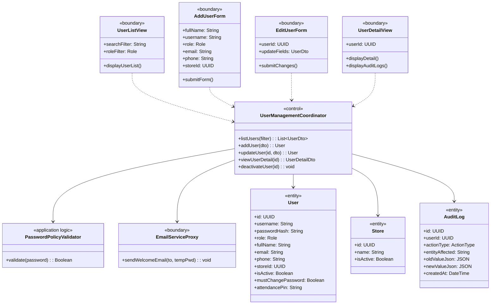
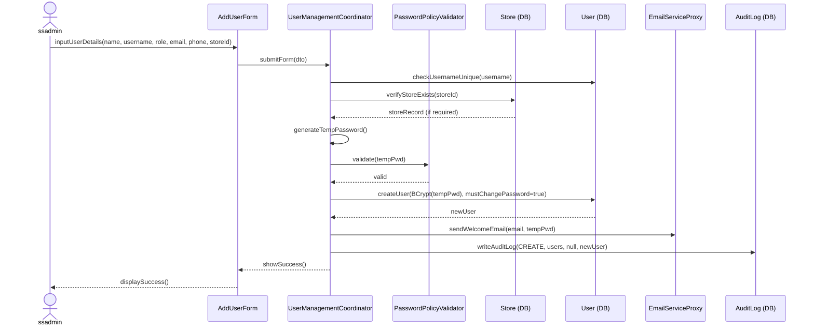
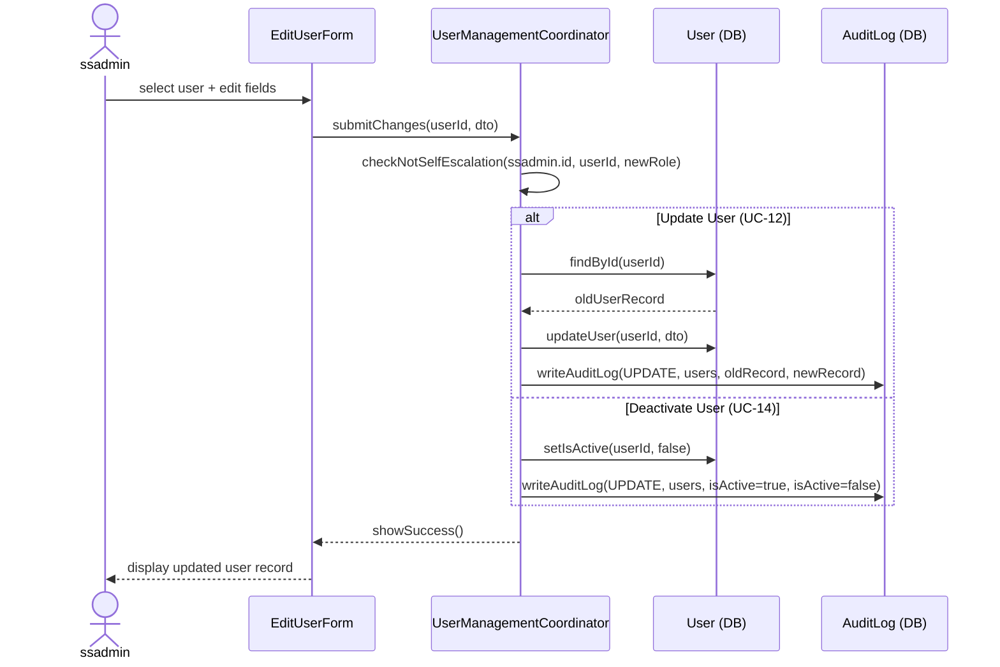

### **3.2 User Account Management**

*\[Provide the detailed design for User Account Management, covering UC-10→UC-14 (View User List, Add User, Update User, View User Detail, Deactivate/Reactivate User). Actor: ssadmin. The class diagram covers all user management use cases. Sequence diagrams cover the Add User and Update/Deactivate User flows.\]*

#### ***3.2.1 Class Diagram***

*\[Class diagram for User Account Management. COMET stereotypes: UserListView, AddUserForm, EditUserForm, UserDetailView («boundary»); UserManagementCoordinator («control»); PasswordPolicyValidator («application logic»); User, Store, AuditLog («entity»); EmailServiceProxy («boundary» external).\]*

#### ***3.2.2 UC-11 Add User Account***

*\[ssadmin creates a new employee account. System auto-generates a temporary password, sends a welcome email with the temporary password, sets mustChangePassword = true, and writes an audit log entry (BR-81).\]*

#### ***3.2.3 UC-12/UC-14 Update / Deactivate User Account***

*\[ssadmin updates user profile details or deactivates an account. Self-role escalation is blocked (BR-82): ssadmin cannot elevate their own role. An audit log is written for every change (BR-81). Deactivated users cannot login.\]*

