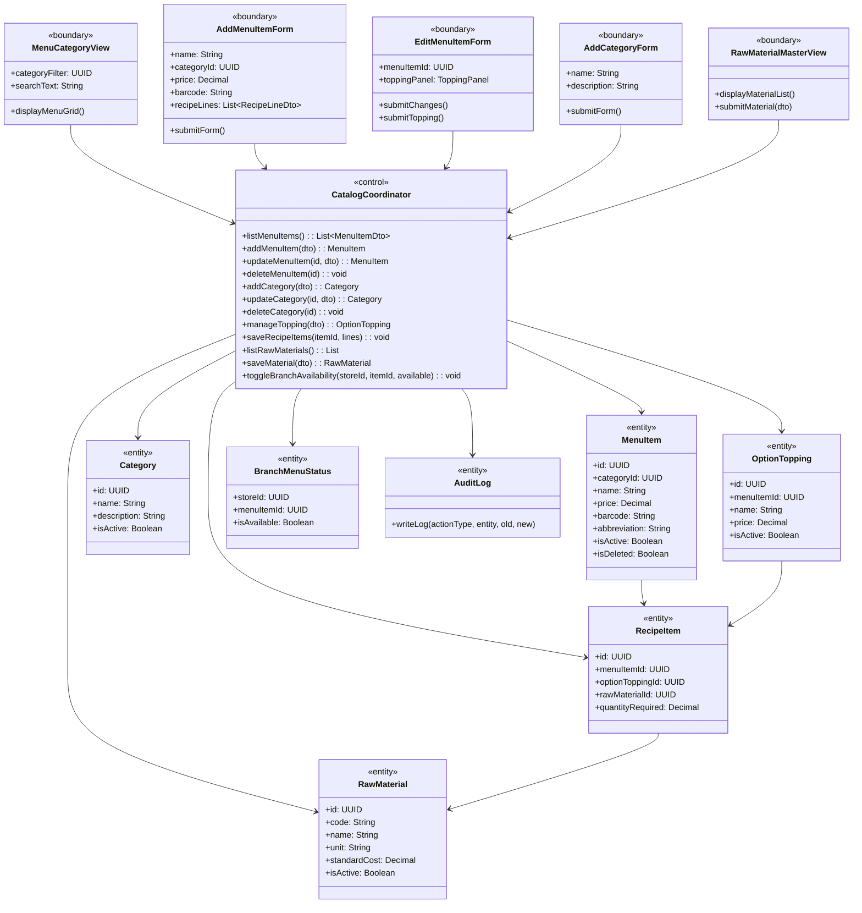
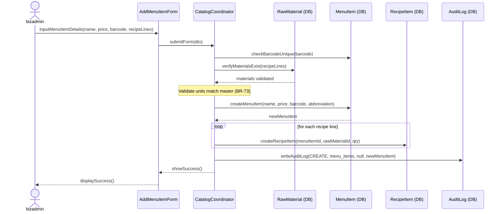
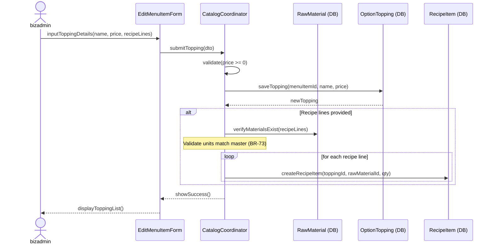
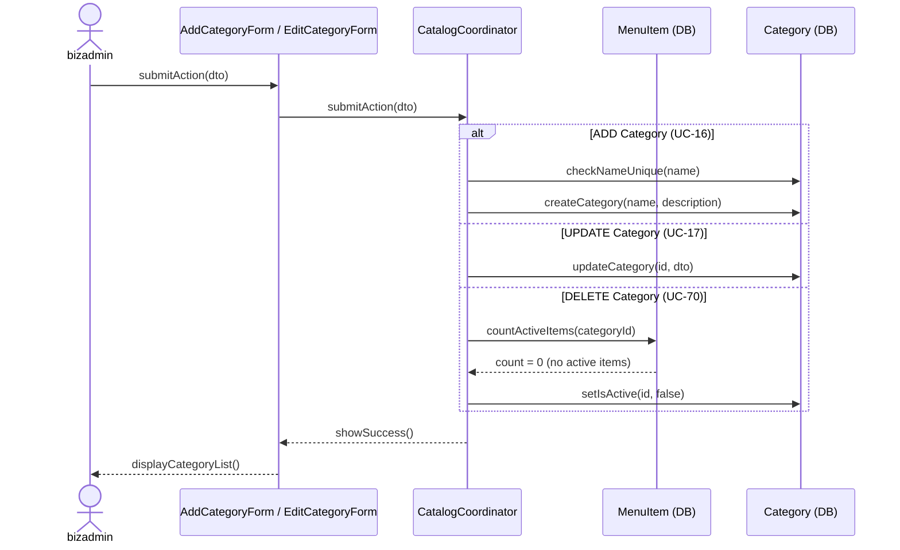
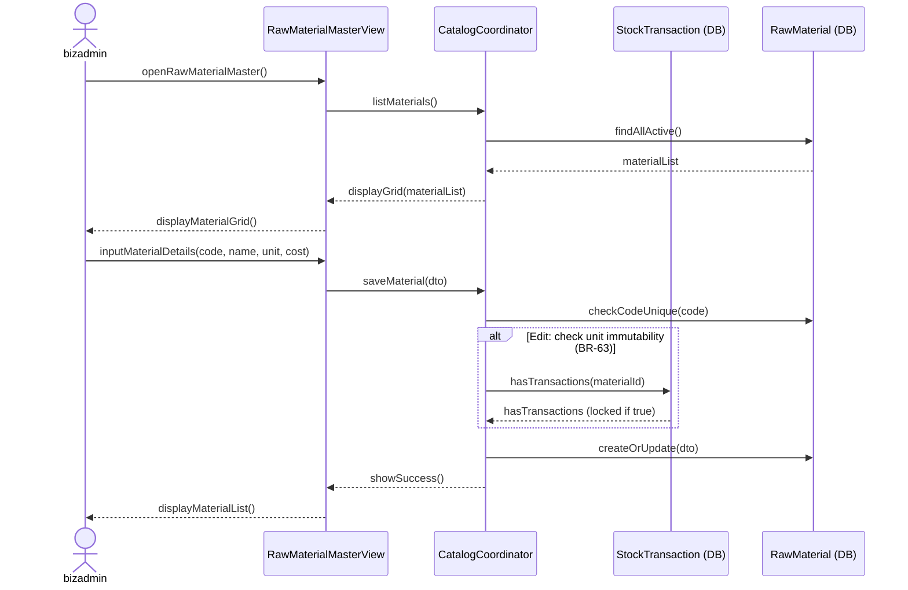

### **3.3 Menu & Category Management**

*\[Provide the detailed design for Menu & Category Management, covering UC-15→UC-19, UC-68→UC-74 (View/Add/Update/Delete Menu Items, Categories, Toppings, Raw Material Master, Recipe Management, Branch Availability Toggle). Actors: businessadmin (chain-wide catalog CRUD), storemanager (local branch availability toggle via branch_menu_status). For features with the same class structure, the class diagram is provided once.\]*

#### ***3.3.1 Class Diagram***

*\[Class diagram for Menu & Category Management. COMET stereotypes: MenuCategoryView, AddMenuItemForm, EditMenuItemForm, AddCategoryForm, RawMaterialMasterView («boundary»); CatalogCoordinator («control»); MenuItem, Category, OptionTopping, RecipeItem, RawMaterial, BranchMenuStatus, AuditLog («entity»).\]*

#### ***3.3.2 UC-18 Add Menu Item with Recipe Formula***

*\[businessadmin creates a new menu item and links its raw material recipe formula. System validates barcode uniqueness and recipe unit consistency (BR-73) before saving. Price change triggers an audit log entry (BR-68).\]*

#### ***3.3.3 UC-71 Manage Toppings & Options (with Recipe)***

*\[businessadmin adds or edits toppings for a menu item. Each topping may optionally have its own recipe formula (ingredients consumed when the topping is ordered). Price must be >= 0. Recipe unit consistency is validated against raw material master (BR-73).\]*

#### ***3.3.4 UC-16/17/70 CRUD Category***

*\[businessadmin creates, updates, or soft-deletes product categories. Delete (soft) is blocked if the category still contains active menu items, preventing orphaned items.\]*

#### ***3.3.5 UC-74 Manage Raw Material Master Catalog***

*\[businessadmin maintains the chain-wide raw material catalog. Material code is immutable after creation. Unit is locked once the material is referenced by any stock transaction (BR-63/BR-64). Soft-delete via is_active flag prevents deletion of materials referenced by recipes.\]*

