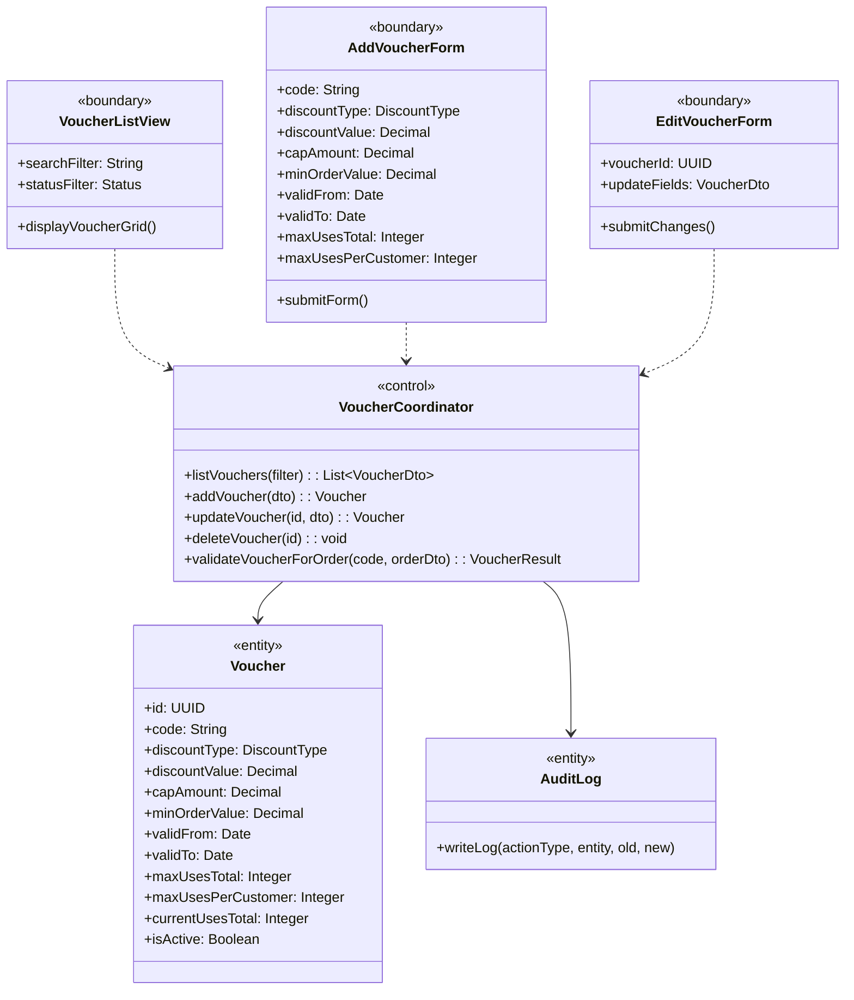
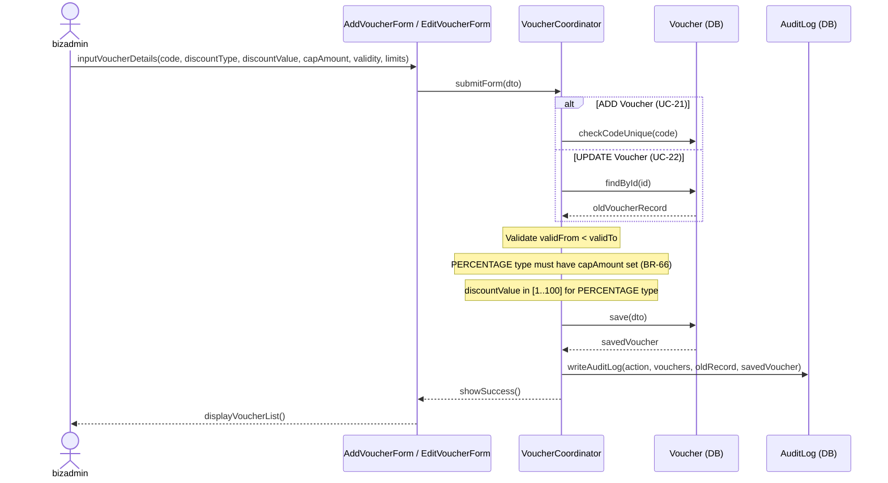
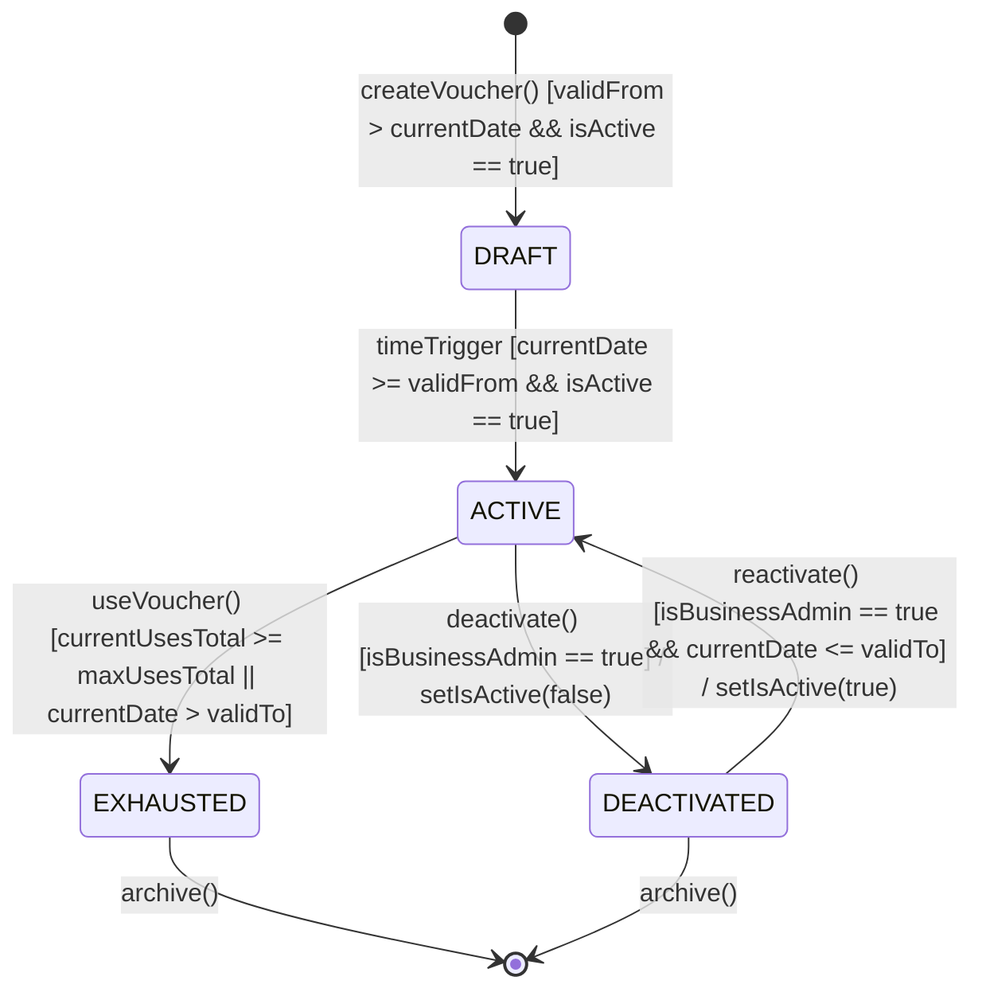

### **3.4 Voucher Management**

*\[Provide the detailed design for Voucher Management, covering UC-20→UC-23 (View/Add/Update/Delete Voucher). Voucher application at checkout is described in Section 3.7 POS Transaction (UC-48). Actor: businessadmin (CRUD). The class diagram covers the voucher lifecycle; the sequence diagram covers the add/update flow. The VOUCHER statechart documents the full lifecycle.\]*

#### ***3.4.1 Class Diagram***

*\[Class diagram for Voucher Management. COMET stereotypes: VoucherListView, AddVoucherForm, EditVoucherForm («boundary»); VoucherCoordinator («control»); Voucher, AuditLog («entity»).\]*

#### ***3.4.2 UC-21/22 Add / Update Voucher***

*\[businessadmin creates or updates a voucher. System validates: code uniqueness on add, validFrom < validTo, PERCENTAGE type must have capAmount set (BR-66), discountValue must be in [1..100] for PERCENTAGE type. Every mutation is audit-logged (BR-81).\]*

#### ***3.4.3 VOUCHER Lifecycle Statechart***

*\[The Voucher lifecycle has 4 states. Vouchers that have been used in orders cannot be deleted from the database (foreign key constraint on orders table). Deactivation via is_active flag is used instead of deletion.\]*

