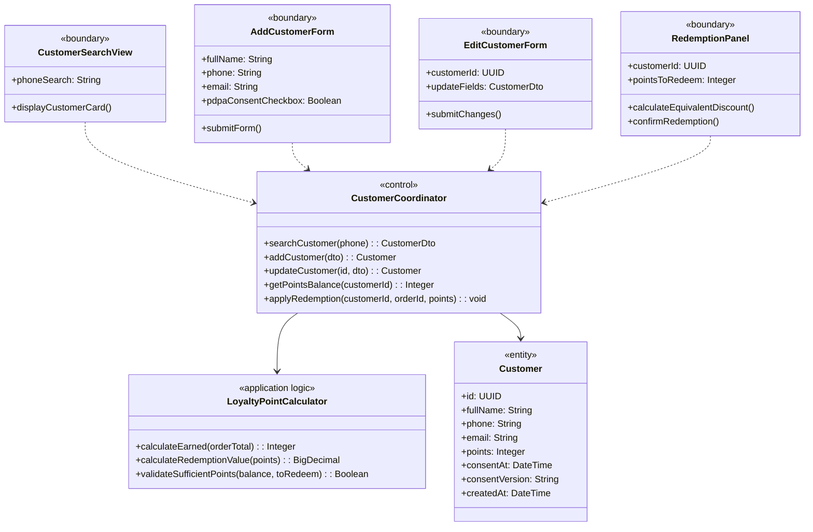
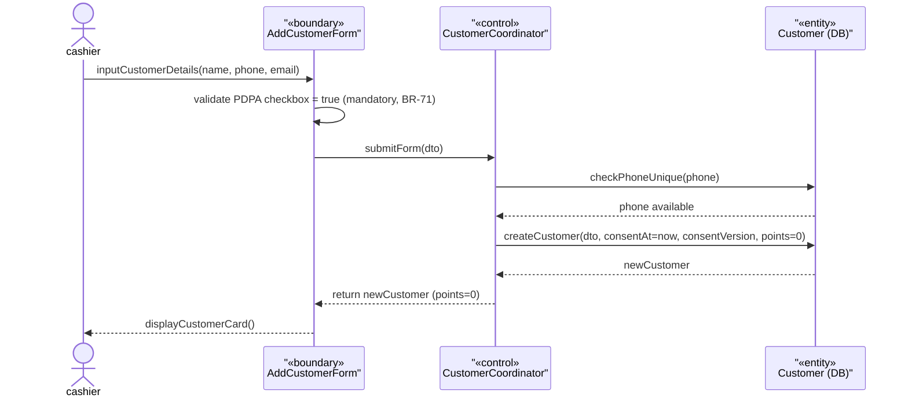
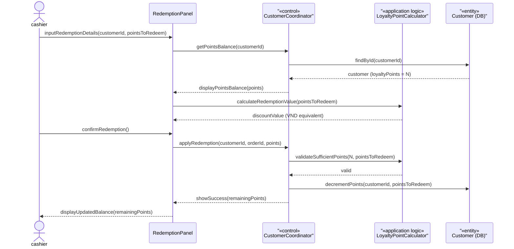

### **3.5 Customer & Membership Management**

*\[Provide the detailed design for Customer & Membership Management, covering UC-24→UC-27 (View/Add/Update Customer, View Customer History) and UC-49 (Redeem Loyalty Points at Checkout). Actors: cashier (CRM lookup and register at POS), businessadmin (CRM management & loyalty history). Key design: PDPA consent is mandatory before any loyalty data is stored (BR-71). Checkout application is covered in Section 3.7.\]*

#### ***3.5.1 Class Diagram***

*\[Class diagram for Customer & Membership. COMET stereotypes: CustomerSearchView, AddCustomerForm, EditCustomerForm, RedemptionPanel («boundary»); CustomerCoordinator («control»); LoyaltyPointCalculator («application logic»); Customer («entity»).\]*

#### ***3.5.2 UC-25 Add Customer with PDPA Consent***

*\[Cashier registers a new loyalty customer. PDPA consent checkbox is mandatory before submitting the form (BR-71). System stores consent timestamp and consent version. Phone number must be unique. Initial loyalty points balance is 0.\]*

#### ***3.5.3 UC-49 Redeem Loyalty Points***

*\[Cashier applies loyalty points as a discount during checkout. The points-to-VND conversion rate is configured in SystemConfig (UC-30). Sufficient points balance is validated before confirming. Points are deducted immediately upon redemption confirmation.\]*

