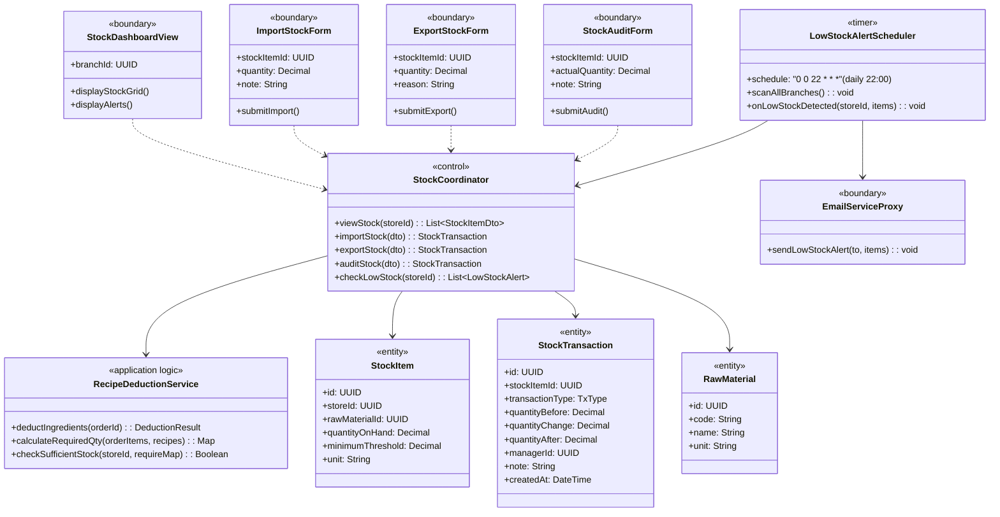
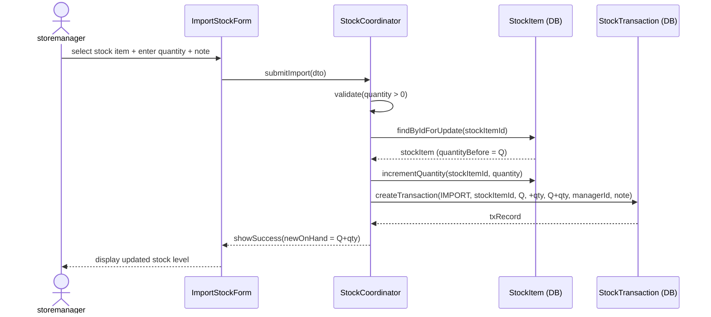
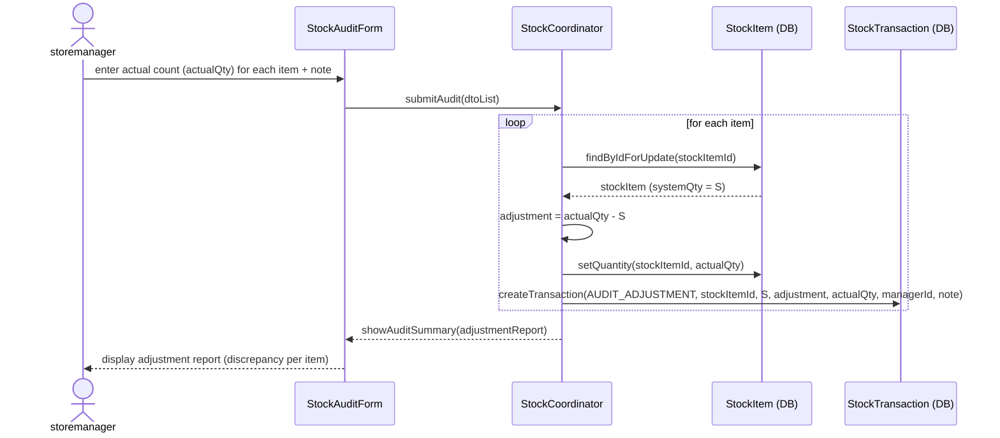
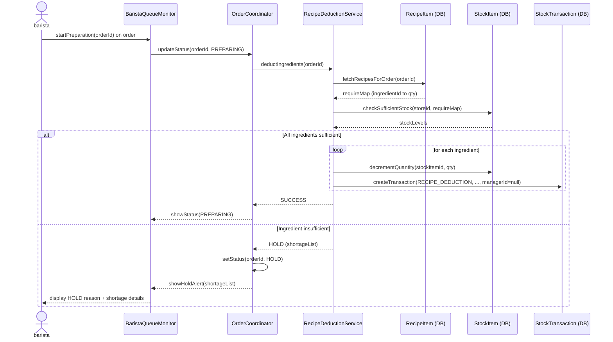

### **3.6 Inventory & Stock Management**

*\[Provide the detailed design for Inventory & Stock Management, covering UC-31→UC-34 (View Stock Dashboard, Import Stock, Export Stock, Stock Audit/Physical Count) and UC-61→UC-62 (Recipe-based Auto-Deduction on PREPARING status, Low Stock Alert). Actors: storemanager (manual import/export/audit), system scheduler (auto-deduction via RecipeDeductionService, daily alert via LowStockAlertScheduler).\]*

#### ***3.6.1 Class Diagram***

*\[Class diagram for Inventory & Stock. COMET stereotypes: StockDashboardView, ImportStockForm, ExportStockForm, StockAuditForm («boundary»), EmailServiceProxy («boundary» external); StockCoordinator («control»); RecipeDeductionService («application logic»); LowStockAlertScheduler («timer»); StockItem, StockTransaction, RawMaterial («entity»).\]*

#### ***3.6.2 UC-32 Import Stock***

*\[storemanager records an incoming stock delivery. System validates quantity > 0, reads current on-hand quantity, creates an IMPORT transaction with before/after snapshot for audit trail, then increments the stock item quantity.\]*

#### ***3.6.3 UC-34 Stock Audit / Physical Count Adjustment***

*\[storemanager performs a physical count. If actual count differs from system quantity, an AUDIT_ADJUSTMENT transaction is created recording the discrepancy delta. A note explaining the difference is mandatory.\]*

#### ***3.6.4 UC-61/62 Automatic Recipe-Based Stock Deduction***

*\[When the Barista updates order status to PREPARING, the RecipeDeductionService is triggered. Each order item's recipe formula is consumed from branch stock. If any ingredient is insufficient, the order is set to HOLD and an alert is shown (BR-89). RECIPE_DEDUCTION transactions have null manager_id to distinguish them from manual adjustments.\]*

