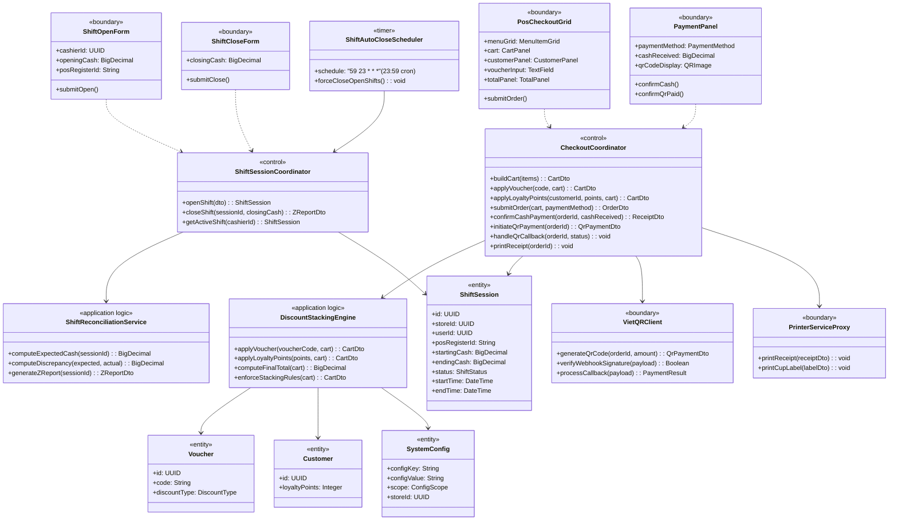
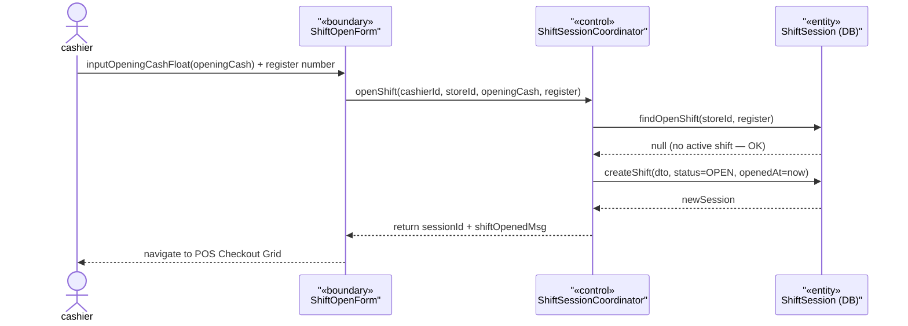
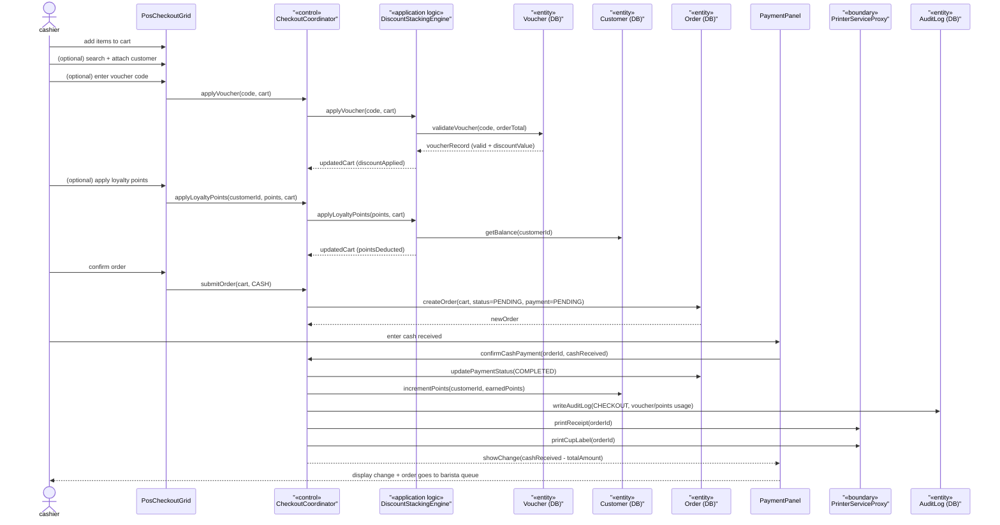
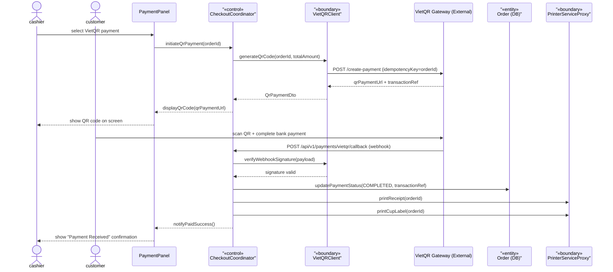
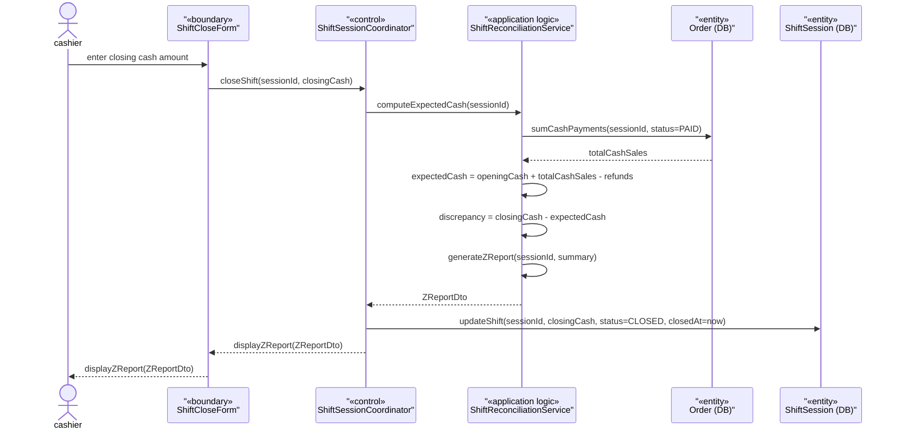
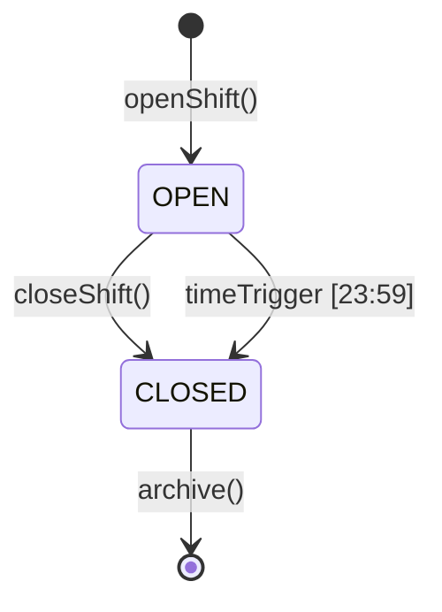

### **3.7 POS Transaction**

*\[Provide the detailed design for POS Transaction, covering UC-44→UC-55 (Open Shift, Full Checkout Pipeline, VietQR Payment, Close Shift/Z-Report). Actor: cashier (POS Terminal on Flutter). Key design decisions: (1) DiscountStackingEngine enforces voucher + loyalty point stacking rules (BR-70); (2) VietQR uses idempotency key = orderId (BR-84/BR-85); (3) ShiftAutoCloseScheduler force-closes open shifts at 23:59.\]*

#### ***3.7.1 Class Diagram***

*\[Class diagram for POS Transaction. COMET stereotypes: ShiftOpenForm, PosCheckoutGrid, PaymentPanel, ShiftCloseForm («boundary»); VietQRClient, PrinterServiceProxy («boundary» external); CheckoutCoordinator, ShiftSessionCoordinator («control»); DiscountStackingEngine, ShiftReconciliationService («application logic»); ShiftAutoCloseScheduler («timer»); ShiftSession, Order, Voucher, Customer, SystemConfig («entity»).\]*

#### ***3.7.2 UC-44 Open Shift***

*\[Cashier opens a new work shift by declaring the opening cash float. Only one OPEN shift is allowed per register per branch at a time (design constraint; see SHIFT statechart §3.7.6). System validates no duplicate active shift before creating the ShiftSession record.\]*

#### ***3.7.3 UC-48/49/50/51 Full Checkout Pipeline (Cash Payment)***

*\[Cashier builds cart → optionally attaches customer and applies voucher/loyalty points → selects payment method → confirms payment → system creates order, earns loyalty points for customer, writes audit log, and prints receipt + cup label.\]*

#### ***3.7.4 UC-51 VietQR Payment Flow***

*\[When cashier selects VietQR, system calls VietQR gateway to generate a QR code. Customer scans QR and completes payment in their banking app. Gateway sends a webhook callback. System verifies HMAC signature and marks order as PAID (BR-84/BR-85).\]*

#### ***3.7.5 UC-53 Close Shift (Z-Report)***

*\[Cashier declares the closing cash amount. System computes expected cash from all CASH orders in the shift, calculates discrepancy, generates Z-Report, and sets shift to CLOSED. ShiftAutoCloseScheduler forces close at 23:59 if cashier forgets.\]*

#### ***3.7.6 SHIFT Session Statechart***

*\[A ShiftSession follows a simple 2-state lifecycle: OPEN → CLOSED. Only one shift can be OPEN per register per branch. ShiftAutoCloseScheduler forces CLOSED at 23:59 daily for any session still OPEN (BR-88).\]*

