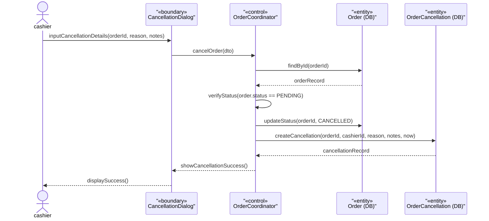
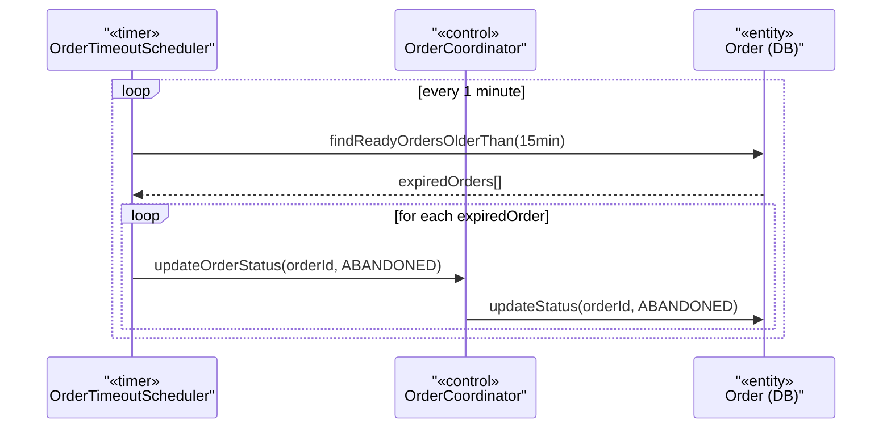
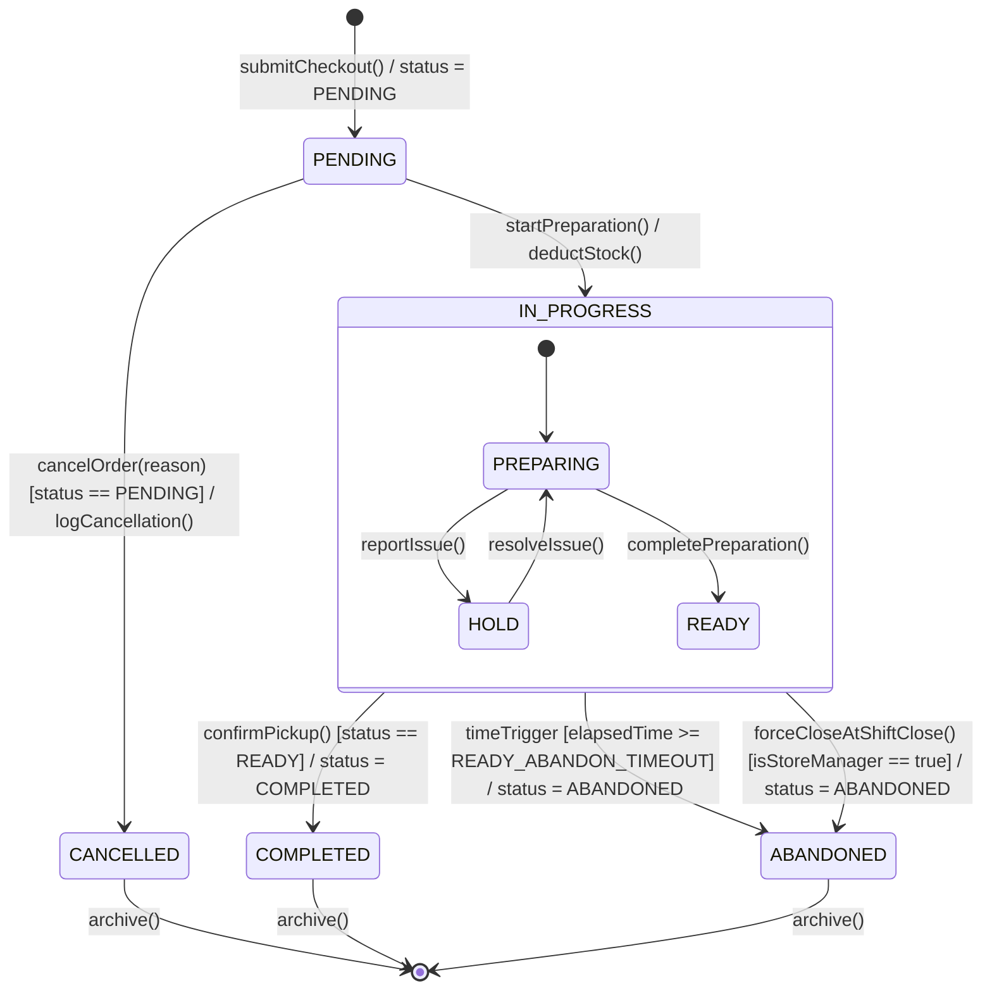

### **3.8 Order Management**

*\[Provide the detailed design for Order Management, covering UC-57 (View Order Queue Display), UC-58 (Update Preparation Status by barista), UC-55 (Cancel PENDING Order / Request Transaction Refund by cashier), UC-75 (SM-Authorized Refund/Comp), and the automated READY auto-abandon (BR-88). Actors: cashier (cancel PENDING only), storemanager (refund/comp authorization), barista (queue display + status transitions), system scheduler (auto-abandon after READY_ABANDON_TIMEOUT). The ORDER statechart documents all 7 valid states and their transitions.\]*

#### ***3.8.1 Class Diagram***

*\[Class diagram for Order Management. COMET stereotypes: OrderQueueView, BaristaQueueMonitor, CancellationDialog, RefundAuthDialog («boundary»); OrderCoordinator, OrderQueueCoordinator («control»); OrderTimeoutScheduler («timer»); Order, OrderItem, OrderItemTopping, OrderCancellation, OrderRefund («entity»).\]*


#### ***3.8.2 UC-55 Cancel PENDING Order***

*\[Only PENDING orders can be cancelled by cashier (BR-05). The cancellation creates an immutable OrderCancellation record with the reason code and notes. Order status transitions to CANCELLED. Cancelled orders cannot be reopened.\]*



#### ***3.8.3 UC-75 SM-Authorized Refund / Comp Remake***

*\[For post-PENDING complaints (e.g., wrong order already prepared), only storemanager can authorize a REFUND or COMP_REMAKE (BR-67). SM enters their PIN to authorize. System creates an immutable OrderRefund record. A CASH refund debits the currently-open shift drawer (BR-09) and stamps `shift_session_id`; card/VietQR refunds go via the gateway with no drawer impact. Loyalty points earned/redeemed on the original order are reversed per BR-08. For COMP_REMAKE type, a new duplicate order is created in PENDING status.\]*

```mermaid
sequenceDiagram
    actor cashier
    actor storemanager
participant RefundDialog as "«boundary»<br/>RefundAuthDialog"
participant OrderCoord as "«control»<br/>OrderCoordinator"
participant UserDB as "«entity»<br/>User (DB)"
participant OrderDB as "«entity»<br/>Order (DB)"
participant RefundDB as "«entity»<br/>OrderRefund (DB)"
participant ShiftDB as "«entity»<br/>ShiftSession (DB)"
participant CustomerDB as "«entity»<br/>Customer (DB)"

    cashier->>RefundDialog: inputRefundDetails(orderId, refundType, amount)
    RefundDialog->>RefundDialog: requestSmPin()
    storemanager->>RefundDialog: inputSmPin(smPin)
    RefundDialog->>OrderCoord: authorizeRefund(dto, smPin)
    OrderCoord->>UserDB: verifySmPin(smId, smPin)
    UserDB-->>OrderCoord: authenticated
    OrderCoord->>OrderDB: findById(orderId)
    OrderDB-->>OrderCoord: orderRecord

    alt CASH refund (BR-09)
        OrderCoord->>ShiftDB: getOpenShift(storeId)
        ShiftDB-->>OrderCoord: openShift (drawer to debit)
        Note over OrderCoord, ShiftDB: refund debits the currently-open drawer; shift_session_id stamped
    else CARD / VietQR refund
        Note over OrderCoord: gateway refund API — no drawer impact
    end

    OrderCoord->>RefundDB: createRefund(orderId, smId, cashierId, shiftSessionId, refundType, amount, reason, notes, now)
    RefundDB-->>OrderCoord: refundRecord
    OrderCoord->>CustomerDB: reverseLoyalty(orderId) (BR-08)

    alt REFUND type
        OrderCoord->>OrderDB: flagRefunded(orderId)
    else COMP_REMAKE type
        OrderCoord->>OrderDB: createNewOrder(cloneOf=orderId, status=PENDING)
    end

    OrderCoord-->>RefundDialog: showRefundSuccess(refundRecord)
    RefundDialog-->>cashier: displaySuccess()
```

#### ***3.8.4 Auto-Abandon READY Orders (OrderTimeoutScheduler, BR-88 — automated)***

*\[READY orders not picked up within `READY_ABANDON_TIMEOUT` are automatically set to ABANDONED by the OrderTimeoutScheduler (BR-88). This is an automated system function (not a user use case). It prevents stale orders from persisting indefinitely in the barista queue.\]*



#### ***3.8.5 ORDER Lifecycle Statechart***

*\[The Order has 7 states. Transitions are enforced by OrderCoordinator. The HOLD state is triggered when a preparation issue is reported by the Barista (reportIssue()). ABANDONED is reached two ways (BR-88): system-triggered after `READY_ABANDON_TIMEOUT` in READY state, or Store-Manager force-close of remaining READY orders at shift close. CANCELLED and ABANDONED are terminal states.\]*



