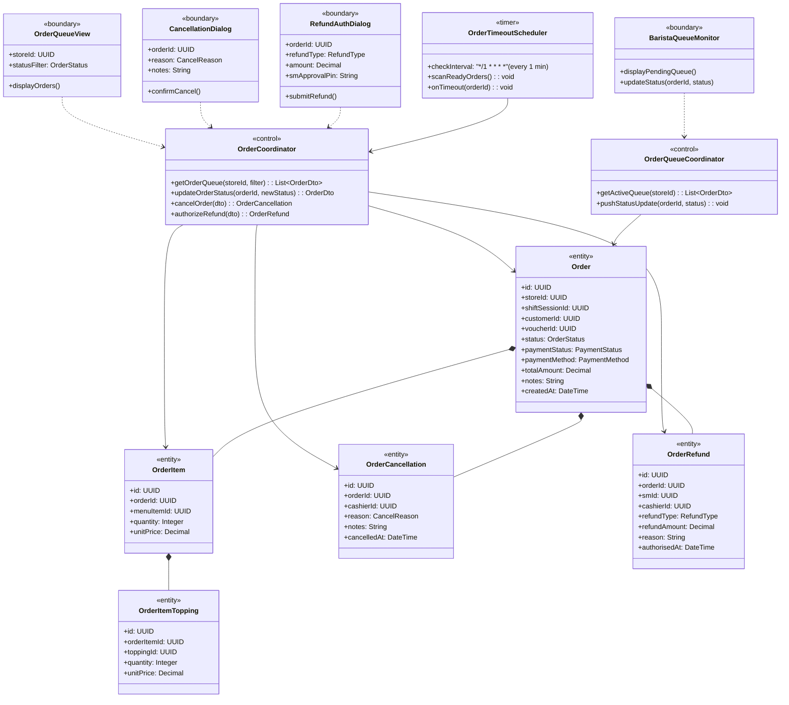
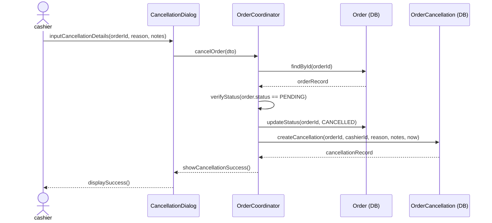
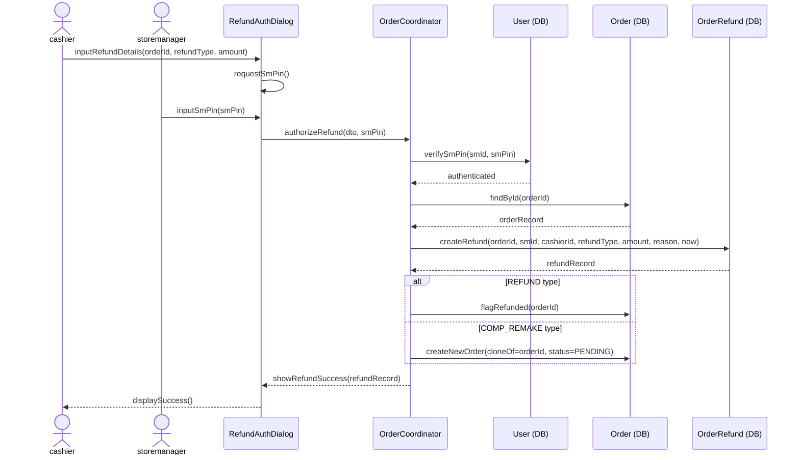
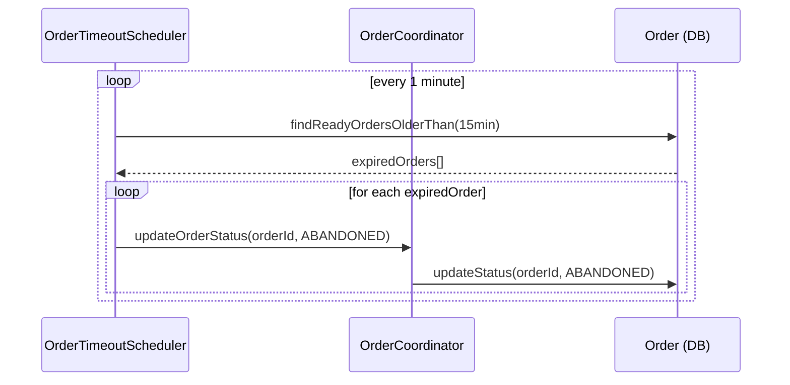

### **3.8 Order Management**

*\[Provide the detailed design for Order Management, covering UC-55→UC-60 (View Order Queue, Barista Update Status), UC-58 (Cancel PENDING Order by cashier), UC-73 (Auto-Abandon READY Orders by system), UC-75 (SM-Authorized Refund/Comp). Actors: cashier (cancel PENDING only), storemanager (refund/comp authorization), barista (queue display + status transitions), system scheduler (auto-abandon after 15 min). The ORDER statechart documents all 7 valid states and their transitions.\]*

#### ***3.8.1 Class Diagram***

*\[Class diagram for Order Management. COMET stereotypes: OrderQueueView, BaristaQueueMonitor, CancellationDialog, RefundAuthDialog («boundary»); OrderCoordinator, OrderQueueCoordinator («control»); OrderTimeoutScheduler («timer»); Order, OrderItem, OrderItemTopping, OrderCancellation, OrderRefund («entity»).\]*

#### ***3.8.2 UC-58 Cancel PENDING Order***

*\[Only PENDING orders can be cancelled by cashier (BR-05). The cancellation creates an immutable OrderCancellation record with the reason code and notes. Order status transitions to CANCELLED. Cancelled orders cannot be reopened.\]*

#### ***3.8.3 UC-75 SM-Authorized Refund / Comp Remake***

*\[For post-PENDING complaints (e.g., wrong order already prepared), only storemanager can authorize a REFUND or COMP_REMAKE. SM enters their PIN to authorize. System creates an immutable OrderRefund record. For COMP_REMAKE type, a new duplicate order is created in PENDING status.\]*

#### ***3.8.4 UC-73 Auto-Abandon READY Orders (OrderTimeoutScheduler)***

*\[READY orders not picked up within 15 minutes are automatically set to ABANDONED by the OrderTimeoutScheduler. This prevents stale orders from persisting indefinitely in the barista queue.\]*

#### ***3.8.5 ORDER Lifecycle Statechart***

*\[The Order has 7 states. Transitions are enforced by OrderCoordinator. The HOLD state is system-triggered when recipe stock is insufficient. ABANDONED is system-triggered after 15 min in READY state. CANCELLED and ABANDONED are terminal states.\]*

```mermaid
stateDiagram-v2
    [*] --> PENDING : submitCheckout() / status = PENDING

    PENDING --> PREPARING : startPreparation() [hasIngredients == true] / deductStock(); status = PREPARING

    PENDING --> CANCELLED : cancelOrder(reason) [status == PENDING] / logCancellation(); status = CANCELLED

    PREPARING --> HOLD : startPreparation() [hasIngredients == false] / status = HOLD

    PREPARING --> READY : completePreparation() / status = READY

    HOLD --> PREPARING : resumeOrder() [stockRestored == true] / deductStock(); status = PREPARING

    READY --> COMPLETED : confirmPickup() / status = COMPLETED

    READY --> ABANDONED : timeTrigger [elapsedTime >= 15min] / status = ABANDONED

    COMPLETED --> [*] : archive()
    CANCELLED --> [*] : archive()
    ABANDONED --> [*] : archive()
```

