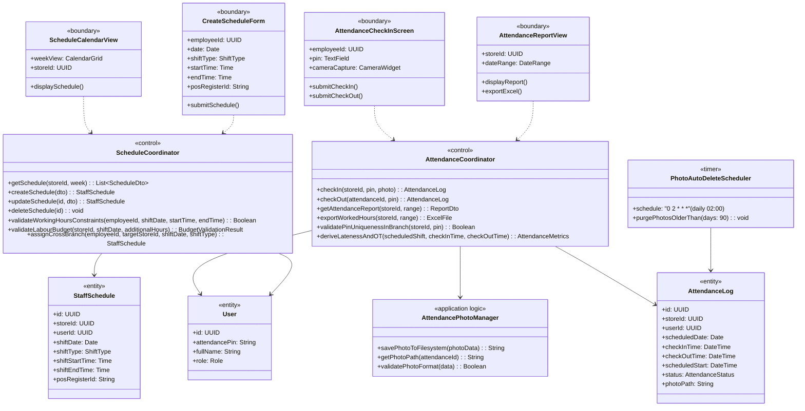
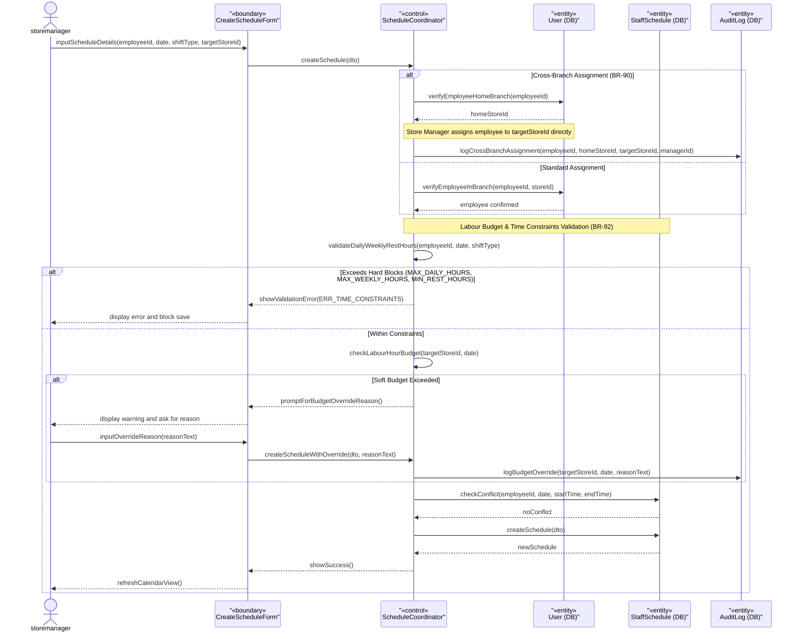
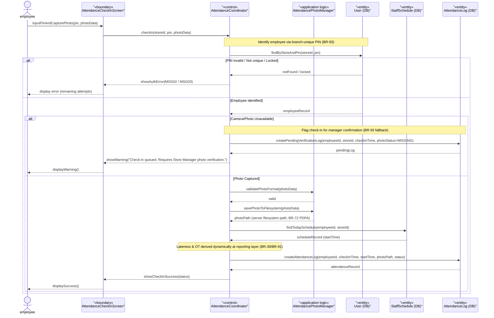
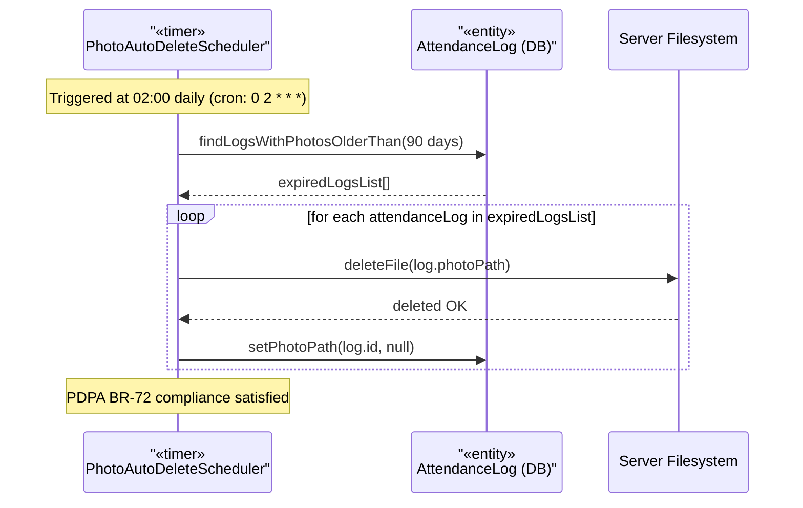
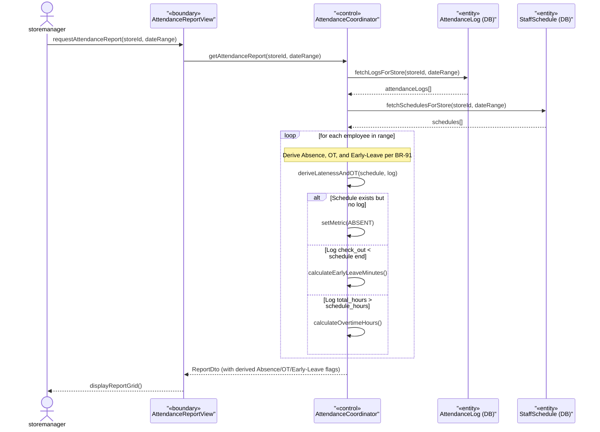

### **3.9 Staff Management**

*\[Provide the detailed design for Staff Management, covering UC-35→UC-39 (View/Create/Update/Delete Schedule, View Attendance Report), Attendance Check-In/Out with PIN + Photo Capture (automated popup function per BR-38/BR-53/BR-93 — not a standalone use case), and UC-80 (Export Worked Hours). Actors: storemanager (schedule CRUD + attendance oversight), cashier/barista (self check-in at branch). Key PDPA design: attendance photos are stored on server filesystem (path only in DB), automatically purged by PhotoAutoDeleteScheduler after 90 days (BR-72).\]*

#### ***3.9.1 Class Diagram***

*\[Class diagram for Staff Management. COMET stereotypes: ScheduleCalendarView, CreateScheduleForm, AttendanceCheckInScreen, AttendanceReportView («boundary»); ScheduleCoordinator, AttendanceCoordinator («control»); AttendancePhotoManager («application logic»); PhotoAutoDeleteScheduler («timer»); StaffSchedule, AttendanceLog, User («entity»).\]*

#### ***3.9.2 UC-36 Create Staff Schedule (with Cross-Branch and Hours Validation)***

*\[storemanager creates a schedule entry for a specific employee in the branch. System validates the employee belongs to the branch (or handles cross-branch assignment per BR-90 directly without target-branch host approval), validates working hour limits (BR-92), and detects scheduling conflicts (same employee, overlapping dates/shifts). POS register ID is optionally assigned to cashier shifts.\]*

#### ***3.9.3 Attendance Check-In/Out with Photo (BR-38/BR-53/BR-93, PDPA-Compliant & Fallback)***

*\[Employee clocks in at branch using their 4-digit PIN + camera photo capture (BR-93). System validates that the PIN is unique within the store and identifies the employee. Camera snapshot is mandatory at check-in/out; if the camera is unavailable, the action is queued and flagged for Store Manager confirmation rather than recorded without a photo. PDPA compliance: photos are auto-purged after 90 days by PhotoAutoDeleteScheduler (BR-72).\]*

#### ***3.9.4 PDPA Photo Auto-Deletion (PhotoAutoDeleteScheduler)***

*\[PhotoAutoDeleteScheduler runs every day at 02:00 (cron). It finds all attendance log records with non-null photo paths older than 90 days, deletes the physical files from the server filesystem, and sets photoPath to null in the database. This satisfies BR-72 (PDPA data minimization).\]*

#### ***3.9.5 UC-39/UC-80 View Attendance Report & Worked Hours (BR-91 Derivation)***

*\[storemanager views the branch attendance report and exports worked hours (UC-80). The AttendanceCoordinator retrieves schedules and logs, and derives key attendance metrics (Absence, Overtime, and Early-Leave) dynamically in branch-local timezone as per BR-39 and BR-91. Outliers are flagged for review.\]*

