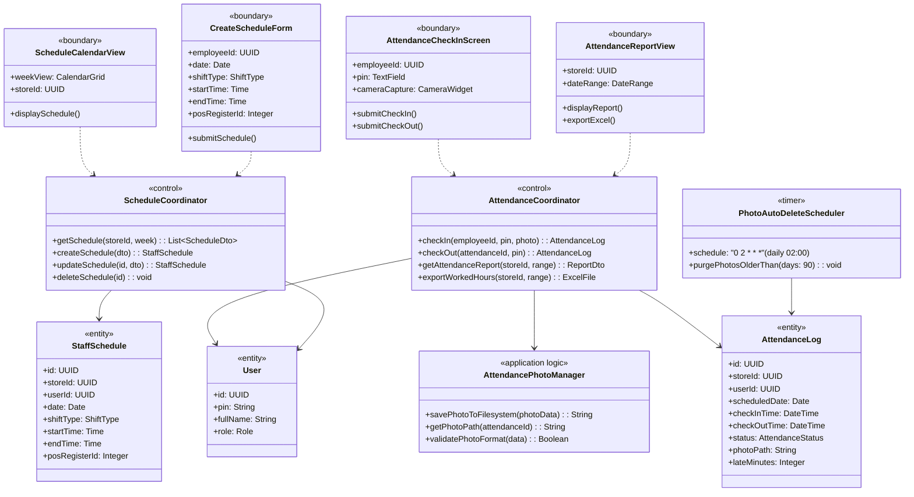
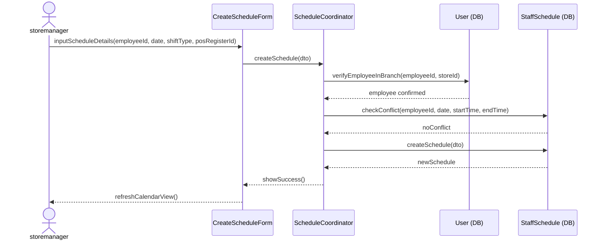
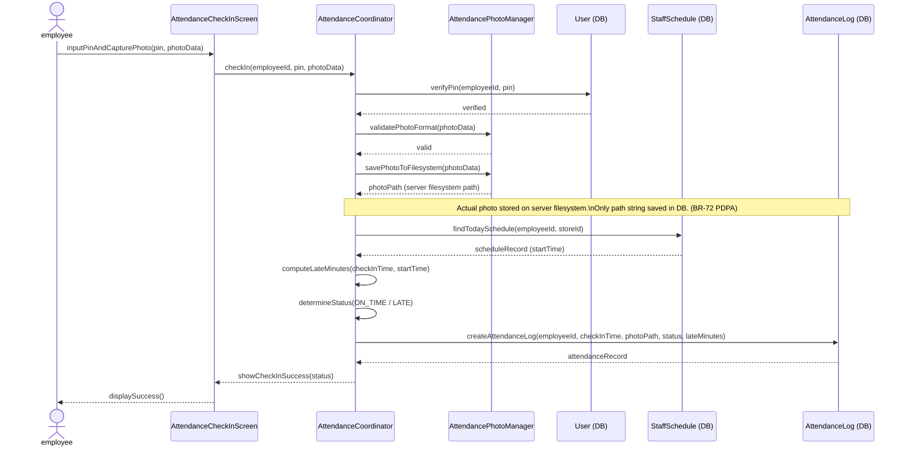
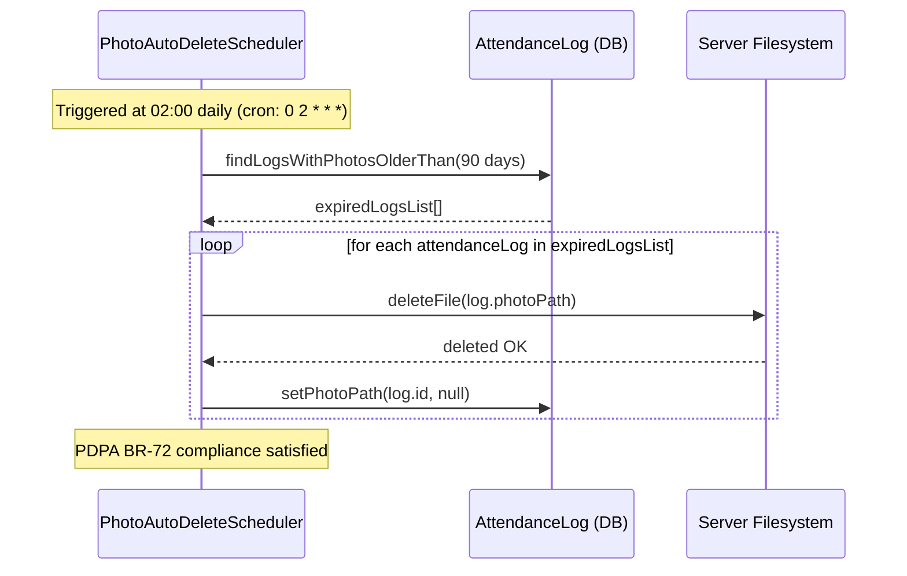

### **3.9 Staff Management**

*\[Provide the detailed design for Staff Management, covering UC-35→UC-39 (View/Create/Update/Delete Schedule, View Attendance Report), UC-66 (Attendance Check-in/out with PIN + Photo Capture), and UC-80 (Export Worked Hours). Actors: storemanager (schedule CRUD + attendance oversight), cashier/barista (self check-in at branch). Key PDPA design: attendance photos are stored on server filesystem (path only in DB), automatically purged by PhotoAutoDeleteScheduler after 90 days (BR-72).\]*

#### ***3.9.1 Class Diagram***

*\[Class diagram for Staff Management. COMET stereotypes: ScheduleCalendarView, CreateScheduleForm, AttendanceCheckInScreen, AttendanceReportView («boundary»); ScheduleCoordinator, AttendanceCoordinator («control»); AttendancePhotoManager («application logic»); PhotoAutoDeleteScheduler («timer»); StaffSchedule, AttendanceLog, User («entity»).\]*

#### ***3.9.2 UC-36 Create Staff Schedule***

*\[storemanager creates a schedule entry for a specific employee in the branch. System validates the employee belongs to the branch and detects scheduling conflicts (same employee, overlapping dates/shifts). POS register ID is optionally assigned to cashier shifts.\]*

#### ***3.9.3 UC-66 Attendance Check-In with Photo (PDPA-Compliant)***

*\[Employee clocks in at branch using their 4-digit PIN + camera photo capture (BR-93). System validates PIN, saves photo to server filesystem (only the path is stored in DB), computes lateness against scheduled start time, and creates an AttendanceLog record. PDPA compliance: photos are auto-purged after 90 days by PhotoAutoDeleteScheduler (BR-72).\]*

#### ***3.9.4 PDPA Photo Auto-Deletion (PhotoAutoDeleteScheduler)***

*\[PhotoAutoDeleteScheduler runs every day at 02:00 (cron). It finds all attendance log records with non-null photo paths older than 90 days, deletes the physical files from the server filesystem, and sets photoPath to null in the database. This satisfies BR-72 (PDPA data minimization).\]*

