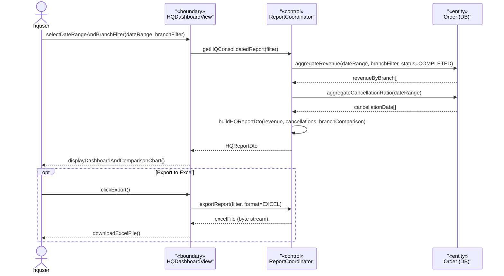
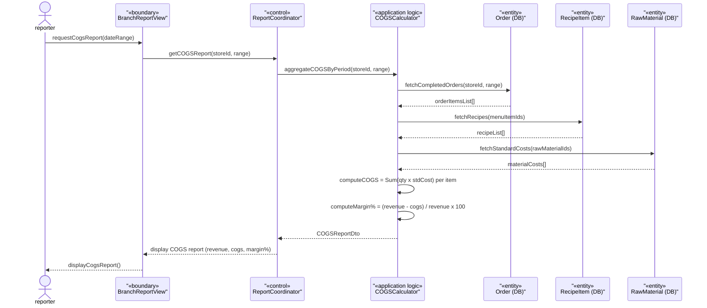
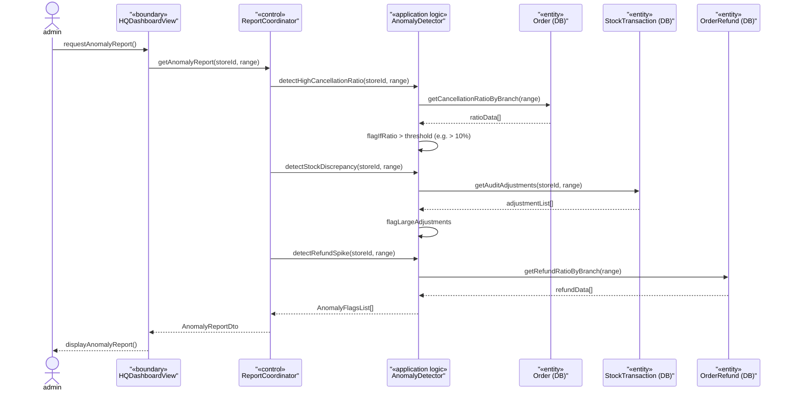
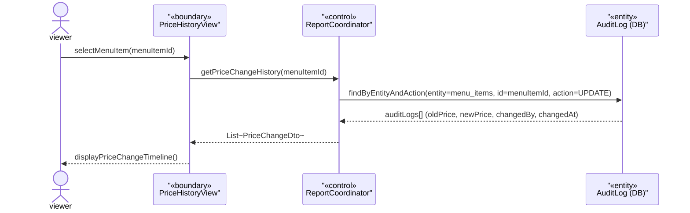

### **3.10 Reports & Analytics**

*\[Provide the detailed design for Reports & Analytics, covering UC-28→UC-29 (HQ Consolidated Revenue Dashboard & Export), UC-40→UC-41 (Branch Sales Report & Export), and UC-76→UC-83: UC-76 (COGS/Margin & Ingredient Shrinkage), UC-77 (Price & Voucher Change History), UC-78 (Loyalty Liability & Movement), UC-79 (Labour Hours vs Revenue), UC-81 (Daily Z-Report), UC-82 (Cashier Void/Refund Anomaly), UC-83 (User Account Change & Access Review); UC-80 (Worked-Hours Export) is detailed in §3.9. Actors: ceoviewer (HQ read-only reports), storemanager (branch-level reports per §3.1). NOTE: UC-78/UC-81/UC-83 reuse the same ReportCoordinator → «application logic» service → read-only entity pattern in §3.10.1; per COMET "same structure described once", only representative sequences (UC-28/29, UC-76, UC-77, UC-82) are drawn. Data sources: Order, StockTransaction, AuditLog, ShiftSession tables (read-only).\]*

#### ***3.10.1 Class Diagram***

*\[Class diagram for Reports & Analytics. COMET stereotypes: HQDashboardView, BranchReportView, ZReportArchiveView, PriceHistoryView («boundary»); ReportCoordinator («control»); COGSCalculator, AnomalyDetector, LabourEfficiencyService, LoyaltyLiabilityService («application logic»); Order, StockTransaction, ShiftSession, AuditLog («entity»).\]*

```mermaid
classDiagram
    class HQDashboardView {
        <<boundary>>
        +dateRange: DateRange
        +branchFilter: UUID
        +displayConsolidatedRevenue()
        +displayBranchComparison()
        +exportReport()
    }
    class BranchReportView {
        <<boundary>>
        +storeId: UUID
        +dateRange: DateRange
        +displaySalesReport()
        +displayZReportArchive()
    }
    class ZReportArchiveView {
        <<boundary>>
        +shiftSessionId: UUID
        +displayZReport()
    }
    class PriceHistoryView {
        <<boundary>>
        +menuItemId: UUID
        +displayPriceChanges()
    }
    class ReportCoordinator {
        <<control>>
        +getHQConsolidatedReport(filter): HQReportDto
        +getBranchSalesReport(storeId, range): BranchReportDto
        +getCOGSReport(storeId, range): COGSReportDto
        +getZReportArchive(storeId, range): List~ZReportDto~
        +getAnomalyReport(storeId, range): AnomalyReportDto
        +getLoyaltyLiabilityReport(): LoyaltyLiabilityDto
        +getLabourEfficiencyReport(storeId, range): LabourDto
        +getPriceChangeHistory(itemId): List~AuditLogDto~
    }
    class COGSCalculator {
        <<application logic>>
        +calculateCOGS(orderId): BigDecimal
        +calculateMargin(revenue, cogs): BigDecimal
        +aggregateCOGSByPeriod(storeId, range): COGSReportDto
    }
    class AnomalyDetector {
        <<application logic>>
        +detectHighCancellationRatio(storeId, range): List~AnomalyFlag~
        +detectStockDiscrepancy(storeId, range): List~AnomalyFlag~
        +detectRefundSpike(storeId, range): List~AnomalyFlag~
    }
    class LabourEfficiencyService {
        <<application logic>>
        +calculateWorkedHours(storeId, range): Map~User_Hours~
        +calculateRevenuePerStaffHour(storeId, range): BigDecimal
    }
    class LoyaltyLiabilityService {
        <<application logic>>
        +getTotalOutstandingPoints(): Integer
        +estimateLiabilityValue(points, conversionRate): BigDecimal
    }
    class Order {
        <<entity>>
        +totalAmount: BigDecimal
        +status: OrderStatus
        +createdAt: DateTime
    }
    class StockTransaction {
        <<entity>>
        +transactionType: TxType
        +quantityChange: BigDecimal
        +createdAt: DateTime
    }
    class AuditLog {
        <<entity>>
        +actionType: ActionType
        +oldValueJson: JSON
        +newValueJson: JSON
        +createdAt: DateTime
    }
    class ShiftSession {
        <<entity>>
        +id: UUID
        +storeId: UUID
        +cashierId: UUID
        +status: ShiftStatus
        +openedAt: DateTime
        +closedAt: DateTime
    }

    HQDashboardView ..> ReportCoordinator
    BranchReportView ..> ReportCoordinator
    ZReportArchiveView ..> ReportCoordinator
    PriceHistoryView ..> ReportCoordinator
    ReportCoordinator --> COGSCalculator
    ReportCoordinator --> AnomalyDetector
    ReportCoordinator --> LabourEfficiencyService
    ReportCoordinator --> LoyaltyLiabilityService
    ReportCoordinator --> Order
    ReportCoordinator --> StockTransaction
    ReportCoordinator --> AuditLog
    ReportCoordinator --> ShiftSession
```

#### ***3.10.2 UC-28/29 HQ Consolidated Revenue Report***

*\[ceoviewer views revenue consolidated across all branches for a selected date range (HQ Business Reports, screen 23, is ceoviewer-only per §3.1). Supports per-branch breakdown and date granularity (daily/weekly/monthly). Exportable to Excel format.\]*

#### ***3.10.3 UC-76 COGS & Margin Report***

*\[ceoviewer (chain-wide) or storemanager (own branch) views Cost of Goods Sold by period (BR-66). COGSCalculator multiplies each sold order item's recipe quantities by the raw material standard cost, summing across all completed orders in the period.\]*

#### ***3.10.4 UC-82 Anomaly Detection Report***

*\[Store Manager (own branch) or CEO Viewer (chain) views anomaly flags (UC-82, BR-79). The AnomalyDetector scans for: cancellation ratio exceeding threshold, large stock adjustment discrepancies, and refund/comp rate spikes above baseline. Detective control only — does not block.\]*

#### ***3.10.5 UC-77 Price & Voucher Change History***

*\[ceoviewer views the full history of price (and voucher) changes for a menu item — read-only compensating control for the single businessadmin role. Data is sourced from the immutable AuditLog (append-only, no UPDATE/DELETE permitted), written on every price/voucher mutation per BR-68.\]*

