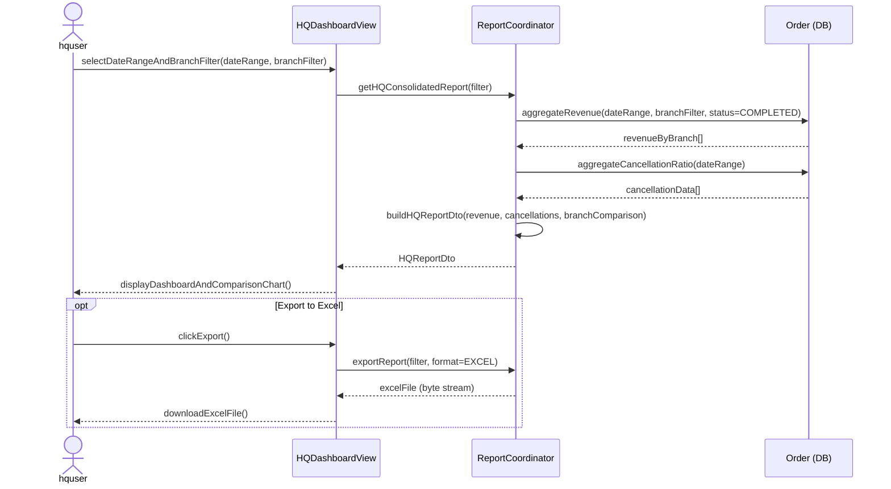
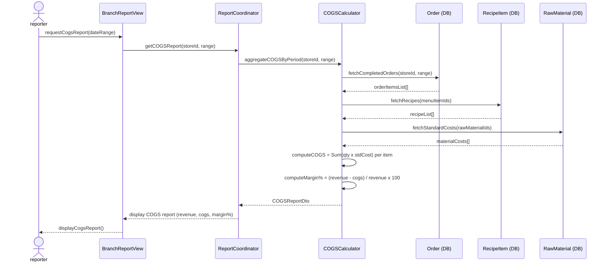
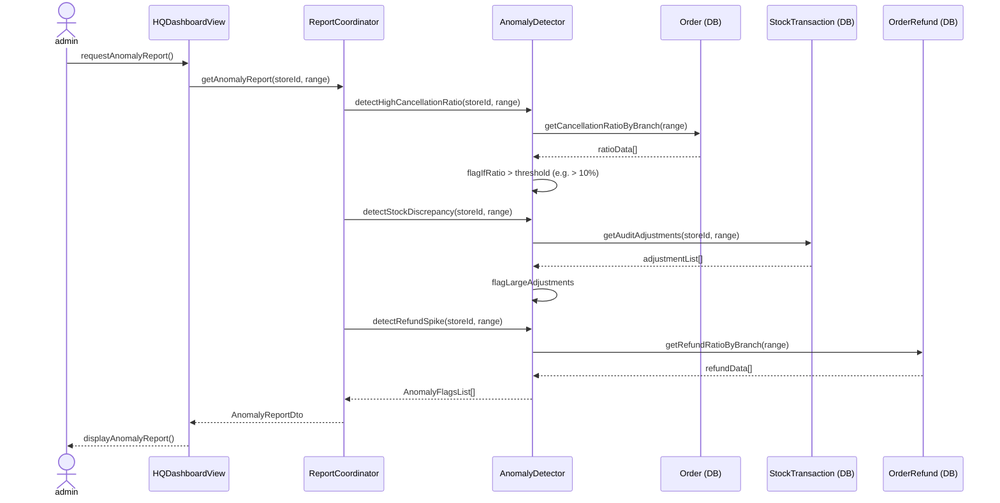
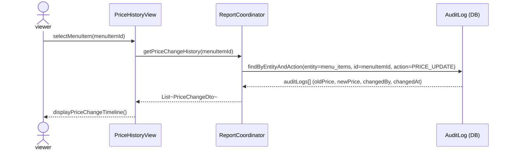

### **3.10 Reports & Analytics**

*\[Provide the detailed design for Reports & Analytics, covering UC-28→UC-29 (HQ Consolidated Revenue Dashboard), UC-40→UC-41 (Branch Sales Report, Z-Report Archive), UC-76→UC-83 (Price Change History, Voucher Usage Report, Loyalty Liability, Labour Efficiency, COGS/Margin Report, Anomaly Detection, Z-Report Archive). Actors: ceoviewer/businessadmin/ssadmin (HQ reports), storemanager (branch-level reports). Data sources: Order, StockTransaction, AuditLog, ShiftSession tables (read-only).\]*

#### ***3.10.1 Class Diagram***

*\[Class diagram for Reports & Analytics. COMET stereotypes: HQDashboardView, BranchReportView, ZReportArchiveView, PriceHistoryView («boundary»); ReportCoordinator («control»); COGSCalculator, AnomalyDetector, LabourEfficiencyService, LoyaltyLiabilityService («application logic»); Order, StockTransaction, AuditLog, ShiftSession («entity»).\]*

```mermaid
classDiagram
    class HQDashboardView {
        <<boundary>>
        +dateRange: DateRange
        +branchFilter: UUID
        +displayConsolidatedRevenue()
        +displayBranchComparison()
        +exportReport()
    }
    class BranchReportView {
        <<boundary>>
        +storeId: UUID
        +dateRange: DateRange
        +displaySalesReport()
        +displayZReportArchive()
    }
    class ZReportArchiveView {
        <<boundary>>
        +shiftSessionId: UUID
        +displayZReport()
    }
    class PriceHistoryView {
        <<boundary>>
        +menuItemId: UUID
        +displayPriceChanges()
    }
    class ReportCoordinator {
        <<control>>
        +getHQConsolidatedReport(filter): HQReportDto
        +getBranchSalesReport(storeId, range): BranchReportDto
        +getCOGSReport(storeId, range): COGSReportDto
        +getZReportArchive(storeId, range): List~ZReportDto~
        +getAnomalyReport(storeId, range): AnomalyReportDto
        +getLoyaltyLiabilityReport(): LoyaltyLiabilityDto
        +getLabourEfficiencyReport(storeId, range): LabourDto
        +getPriceChangeHistory(itemId): List~AuditLogDto~
    }
    class COGSCalculator {
        <<application logic>>
        +calculateCOGS(orderId): Decimal
        +calculateMargin(revenue, cogs): Decimal
        +aggregateCOGSByPeriod(storeId, range): COGSReportDto
    }
    class AnomalyDetector {
        <<application logic>>
        +detectHighCancellationRatio(storeId, range): List~AnomalyFlag~
        +detectStockDiscrepancy(storeId, range): List~AnomalyFlag~
        +detectRefundSpike(storeId, range): List~AnomalyFlag~
    }
    class LabourEfficiencyService {
        <<application logic>>
        +calculateWorkedHours(storeId, range): Map~User_Hours~
        +calculateRevenuePerStaffHour(storeId, range): Decimal
    }
    class LoyaltyLiabilityService {
        <<application logic>>
        +getTotalOutstandingPoints(): Integer
        +estimateLiabilityValue(points, conversionRate): Decimal
    }
    class Order {
        <<entity>>
        +totalAmount: Decimal
        +status: OrderStatus
        +createdAt: DateTime
    }
    class StockTransaction {
        <<entity>>
        +transactionType: TxType
        +quantityChange: Decimal
        +createdAt: DateTime
    }
    class AuditLog {
        <<entity>>
        +actionType: ActionType
        +oldValueJson: JSON
        +newValueJson: JSON
        +createdAt: DateTime
    }

    HQDashboardView --> ReportCoordinator
    BranchReportView --> ReportCoordinator
    ZReportArchiveView --> ReportCoordinator
    PriceHistoryView --> ReportCoordinator
    ReportCoordinator --> COGSCalculator
    ReportCoordinator --> AnomalyDetector
    ReportCoordinator --> LabourEfficiencyService
    ReportCoordinator --> LoyaltyLiabilityService
    ReportCoordinator --> Order
    ReportCoordinator --> StockTransaction
    ReportCoordinator --> AuditLog
```

#### ***3.10.2 UC-28/29 HQ Consolidated Revenue Report***

*\[ceoviewer or businessadmin views revenue consolidated across all branches for a selected date range. Supports per-branch breakdown and date granularity (daily/weekly/monthly). Exportable to Excel format.\]*

#### ***3.10.3 UC-79 COGS & Margin Report***

*\[businessadmin or storemanager views Cost of Goods Sold by period. COGSCalculator multiplies each sold order item's recipe quantities by the raw material standard cost, summing across all completed orders in the period.\]*

#### ***3.10.4 UC-82 Anomaly Detection Report***

*\[ssadmin or businessadmin views anomaly flags across branches. The AnomalyDetector scans for: cancellation ratio exceeding threshold, large stock adjustment discrepancies, and refund/comp rate spikes above baseline.\]*

#### ***3.10.5 UC-76 Price Change History***

*\[businessadmin or ceoviewer views the full history of price changes for a menu item. Data is sourced from the immutable AuditLog (append-only, no UPDATE/DELETE permitted per BR-80/BR-81).\]*

