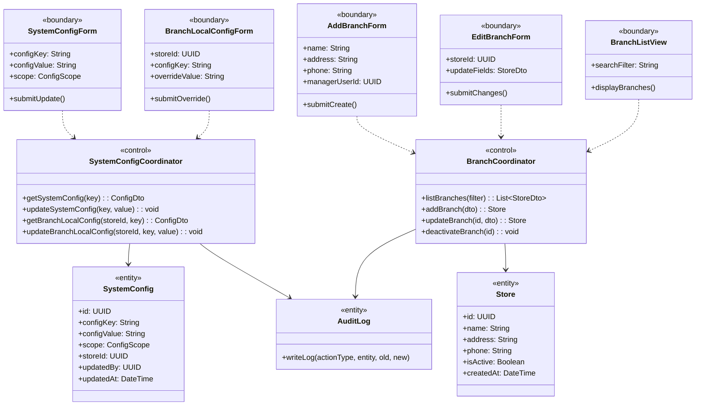
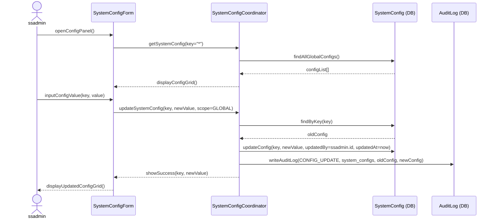
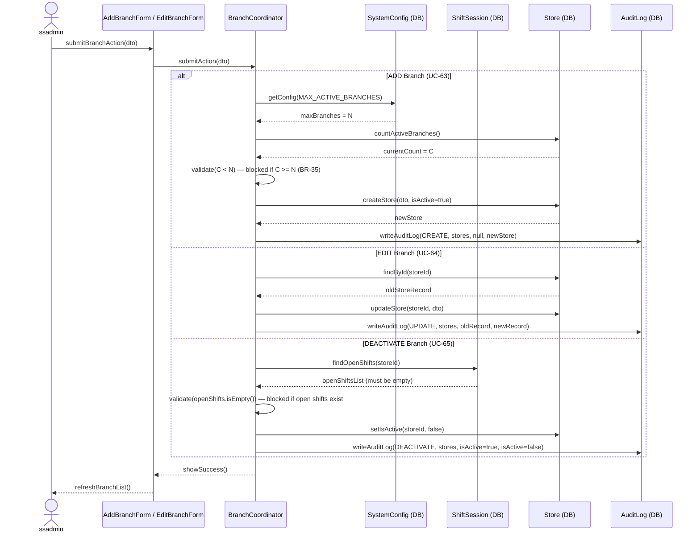

### **3.11 System Configuration & Branch Management**

*\[Provide the detailed design for System Configuration & Branch Management, covering UC-30 (Central System Config by ssadmin), UC-42 (Branch-Local Config Override by storemanager), and UC-63→UC-65 (Branch Lifecycle: Add/Edit/Deactivate). Key constraints: Adding a branch is blocked if MAX_ACTIVE_BRANCHES is reached (BR-35). Deactivating a branch is blocked if the branch has OPEN shift sessions. All config changes are audit-logged.\]*

#### ***3.11.1 Class Diagram***

*\[Class diagram for Config & Branch Management. COMET stereotypes: SystemConfigForm, BranchLocalConfigForm, AddBranchForm, EditBranchForm, BranchListView («boundary»); SystemConfigCoordinator, BranchCoordinator («control»); SystemConfig, Store, AuditLog («entity»).\]*

#### ***3.11.2 UC-30 Central System Configuration***

*\[ssadmin manages central system-wide configurations: tax rate, loyalty earn rate (points per VND), loyalty redemption rate (VND per point), VietQR API credentials, MAX_ACTIVE_BRANCHES, and other global parameters. Every change is audit-logged (BR-80). Config values are loaded fresh from DB on each request (no restart needed).\]*

#### ***3.11.3 UC-63/64/65 Branch Lifecycle Management***

*\[ssadmin creates, updates, or deactivates branch records. Adding a branch checks MAX_ACTIVE_BRANCHES constraint (BR-35). Deactivating a branch checks that no OPEN shift sessions exist. All operations are audit-logged.\]*

