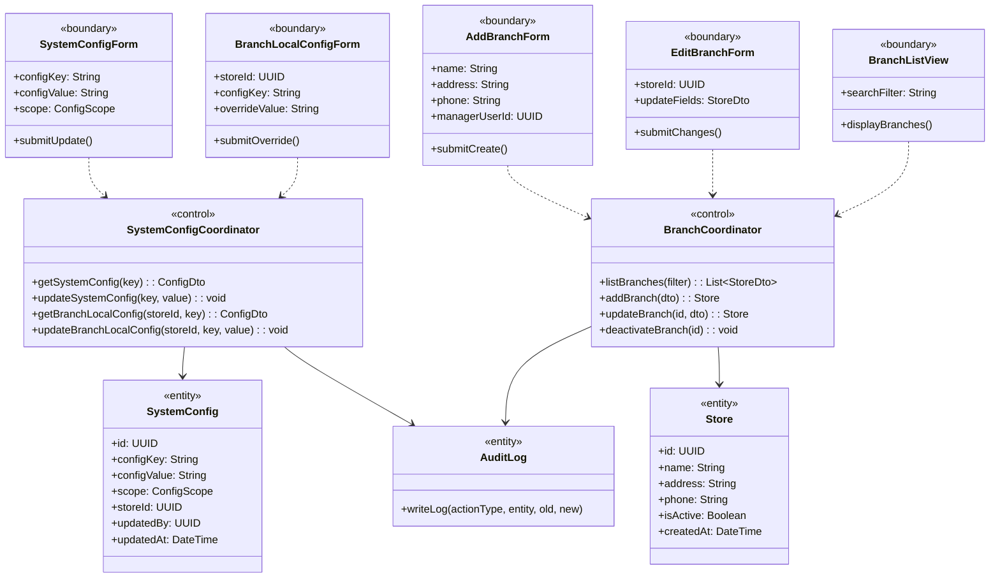
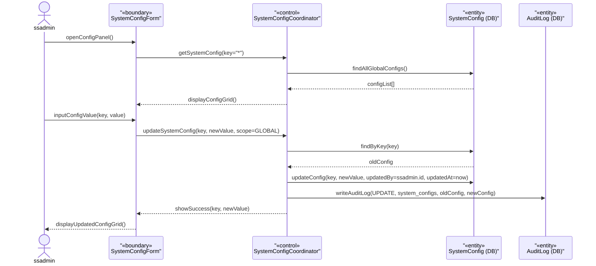
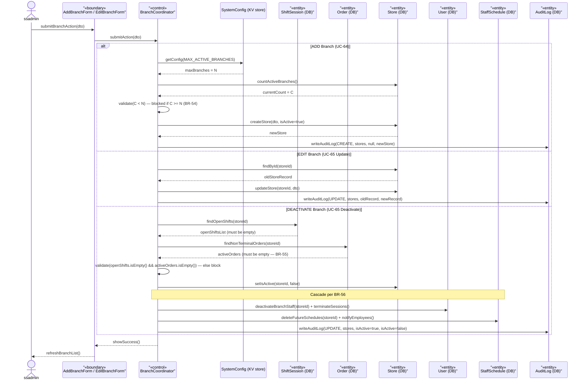

### **3.11 System Configuration & Branch Management**

*\[Provide the detailed design for System Configuration & Branch Management, covering UC-30 (Central System Config by ssadmin), UC-42 (Branch-Local Config Override by storemanager), and UC-63→UC-65 (Branch Lifecycle: Add/Edit/Deactivate). Key constraints: Adding a branch is blocked if MAX_ACTIVE_BRANCHES is reached (BR-54). Deactivating a branch is blocked if the branch has OPEN shift sessions OR any orders in non-terminal states (PENDING/PREPARING/HOLD/READY) per BR-55, and on success cascades per BR-56 (deactivate branch staff + delete future schedules with notification). All config changes are audit-logged. NOTE: `SystemConfig` is an infrastructure-level key-value store (config_key/config_value/scope), intentionally outside the 21-entity business ERD of Section 2; it persists central parameters editable via UC-30 with updatedBy/updatedAt for the audit trail.\]*

#### ***3.11.1 Class Diagram***

*\[Class diagram for Config & Branch Management. COMET stereotypes: SystemConfigForm, BranchLocalConfigForm, AddBranchForm, EditBranchForm, BranchListView («boundary»); SystemConfigCoordinator, BranchCoordinator («control»); SystemConfig, Store, AuditLog («entity»).\]*

#### ***3.11.2 UC-30 Central System Configuration***

*\[ssadmin manages central system-wide configurations: tax rate (BR-45), loyalty earn/redemption parameters (BR-94), VietQR API credentials, MAX_ACTIVE_BRANCHES (BR-54), and other global parameters held in the `SystemConfig` infrastructure key-value store. Every change is audit-logged. Config values are loaded fresh from the store on each request (no restart needed), applying to new orders per BR-46.\]*

#### ***3.11.3 UC-63/64/65 Branch Lifecycle Management***

*\[ssadmin creates, updates, or deactivates branch records. Adding a branch checks MAX_ACTIVE_BRANCHES constraint (BR-54). Deactivating a branch checks that no OPEN shift sessions AND no non-terminal orders exist (BR-55); on success it cascades per BR-56 (deactivate branch staff + terminate their sessions, delete future schedules with notification; historical records preserved read-only). All operations are audit-logged.\]*

