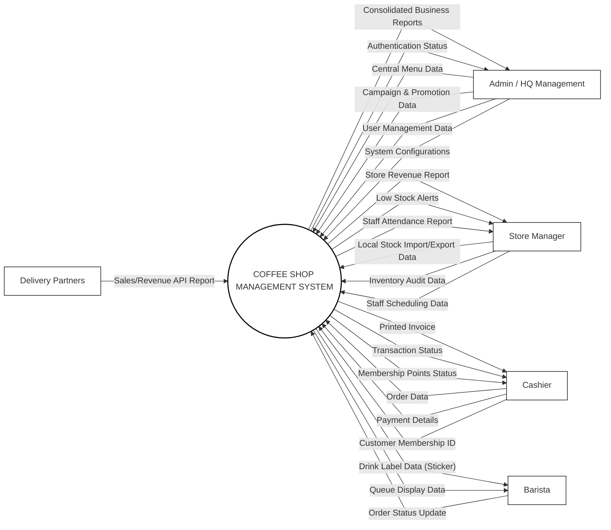

# 1. Product Overview

The Coffee Shop Management System is an integrated software solution designed to streamline the operations of a modern coffee shop. This section details the objectives, scope, and system context of the product.

## 1.1 Product Purpose & Objectives
The primary purpose of the Coffee Shop Management System is to automate, coordinate, and optimize daily coffee shop operations. The system aims to achieve the following key objectives:
- **Operational Efficiency**: Accelerate order taking, processing, and checkout workflows at the Point of Sale (POS).
- **Inventory Control**: Real-time tracking of ingredients, automated low-stock alerts, and structured audit procedures to minimize wastage and stockouts.
- **Role-based Access & Security**: Establish clear operational boundaries and authorization levels for admins, managers, cashiers, and baristas.
- **Data-Driven Insights**: Deliver comprehensive financial, inventory, and staff performance reports to enable management to make informed business decisions.
- **Consolidated Revenue Reporting**: Automatically retrieve sales and revenue figures from third-party delivery partners via API for unified store performance analysis.

## 1.2 Product Scope
The system will manage the following core domains:
- **Authentication & Security**: Multi-role login, profile updates, and secure account creation/management.
- **Catalog & Promotion**: Dynamic category and menu creation, pricing adjustments, options/toppings management, and voucher configurations.
- **Inventory Audit & Logistics**: Standardized stock import (nhập kho), stock export (xuất kho), low-stock monitoring, and audit logs.
- **POS & Order Transactions**: Efficient shift management, barcode/text menu search, order line assembly, automatic discount calculations, tax/invoice generation, and order queues.
- **Human Resources**: Barista and cashier schedule creation, viewable shift schedules, and staff attendance reports.
- **Customer CRM**: Member point accumulation, lookup, and historical purchase data.
- **Reporting**: Monthly store revenue charts, consolidated business reports, and export options.

### Out of Scope
The system will *not* support:
- **Real-time Order Processing & Delivery Integration**: Direct handling of online order lifecycles, courier dispatching, or kitchen sync with third-party delivery apps. Instead, the system only fetches aggregate sales reports from third-party delivery partner APIs.
- **Payroll Calculation & Payouts**: The system will track staff schedules and attendance reports, but financial payroll calculations and payroll payouts are handled by external accounting systems.

---

## 1.3 System Context Diagram
The system context diagram below illustrates the external entities interacting with the Coffee Shop Management System and the primary data flows between them.

