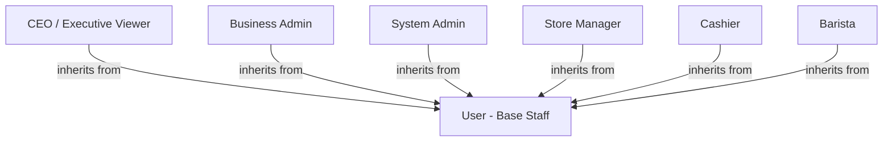
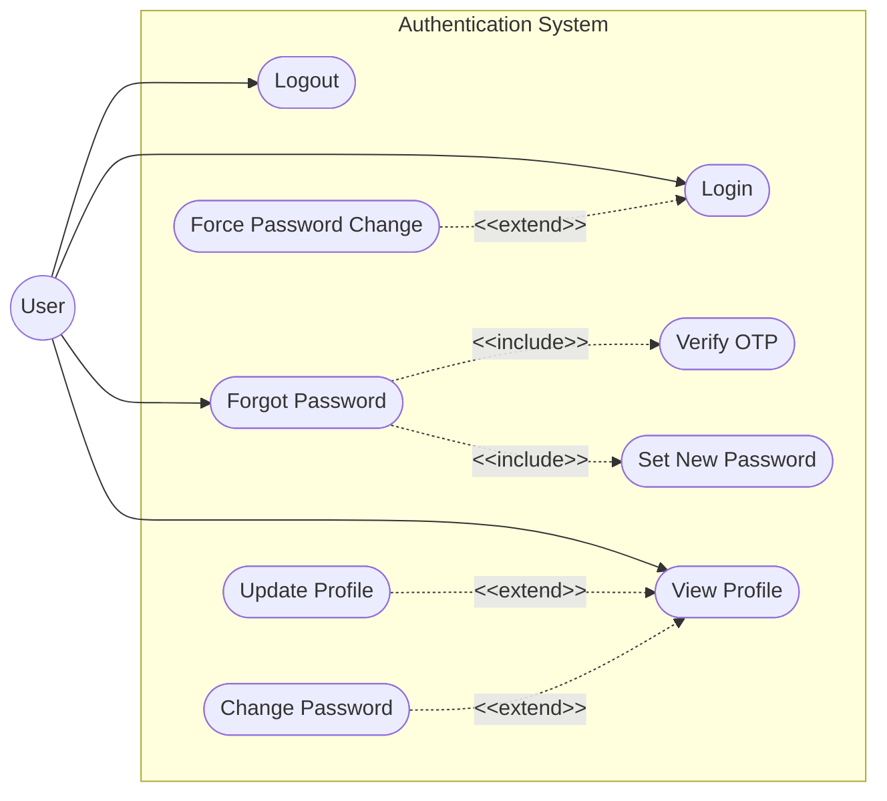
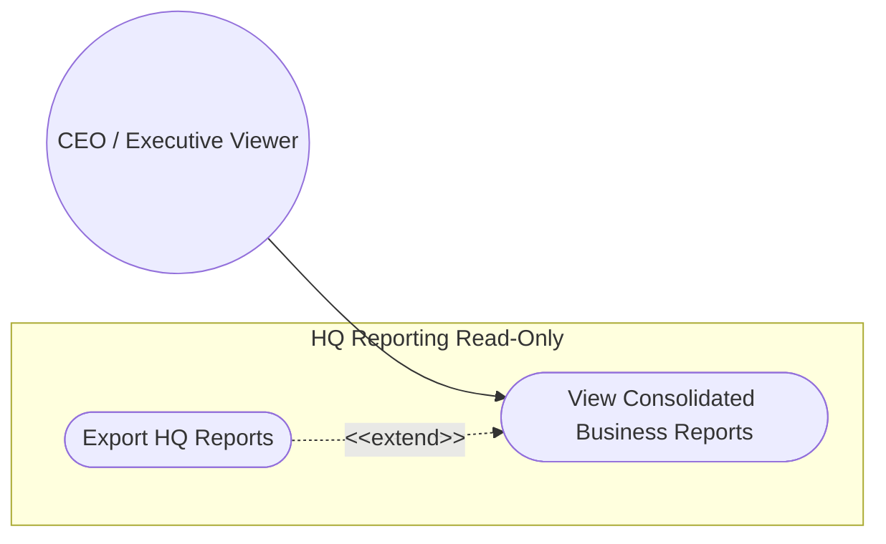
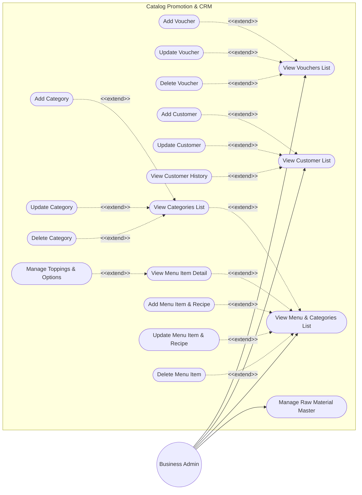
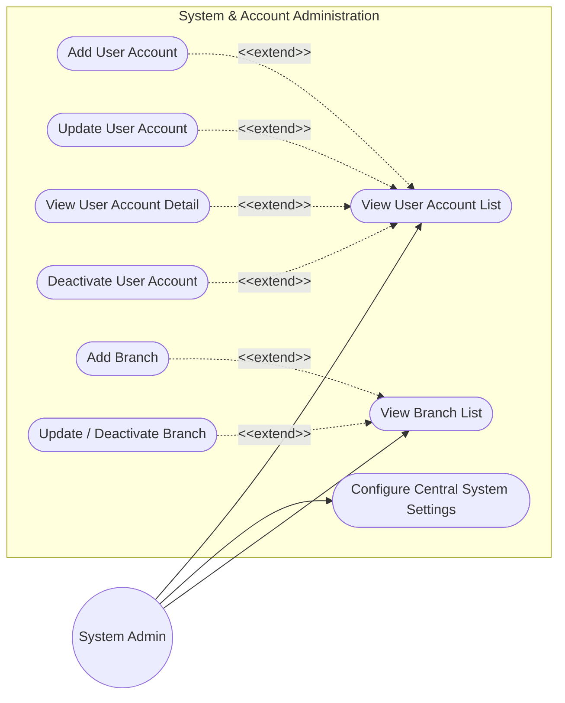
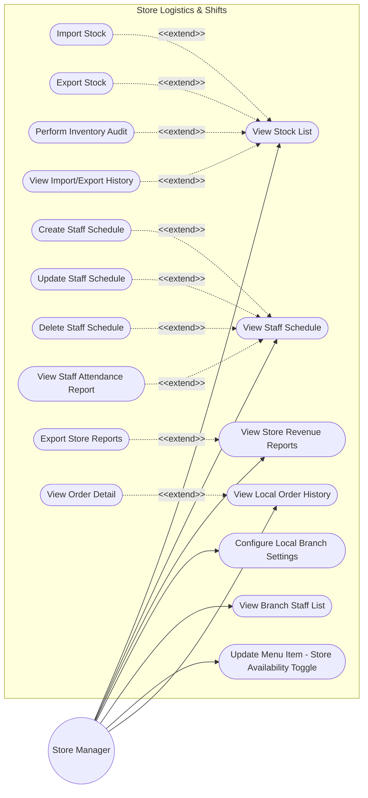
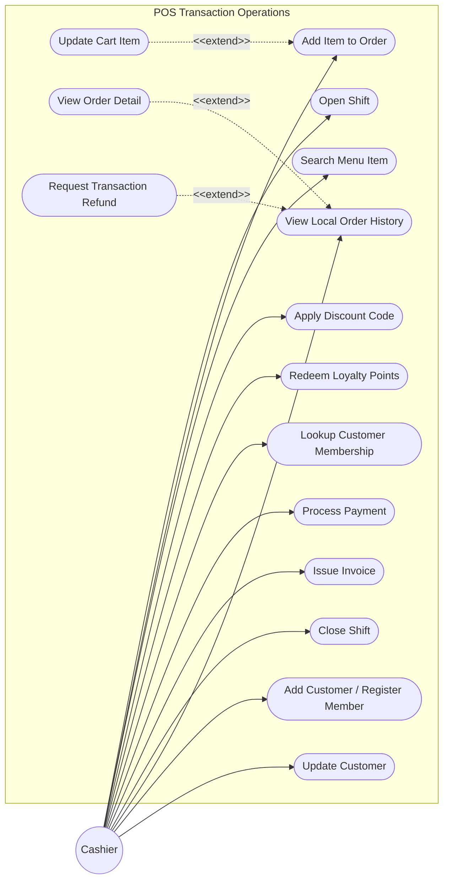
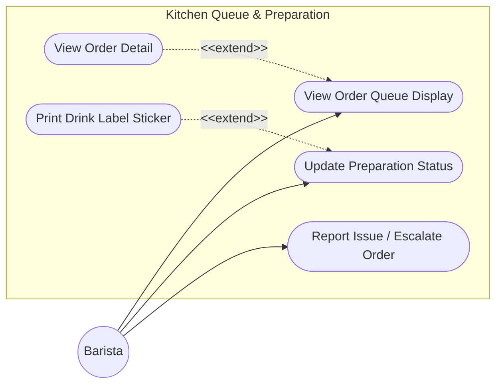

# 2. User Requirements

This section defines the system actors and maps their operational use cases within the Coffee Shop Management System. The use cases are partitioned into separate, clear diagrams per role to prevent overlapping paths and ensure clean software design boundaries.

---

## 2.1 Actors
The system defines the following roles (actors), structured under a generalization hierarchy where all roles inherit basic account privileges from a base `User` actor:

1. **User (Base Actor)**:
   - The generalization of all employee roles. Contains basic access control, profile viewing, and password management.
2. **CEO / Executive Viewer (`ceoviewer`)**:
   - Inherits from `User`. HQ role with **read-only** access to the HQ Dashboard and consolidated chain-wide business reports. Cannot create, edit, or delete any operational data.
3. **Business Admin (`businessadmin`)**:
   - Inherits from `User`. HQ Ops & Marketing role managing chain-wide master data: menu items, recipes, categories, vouchers, and customer/CRM records.
4. **System Admin (`ssadmin`)**:
   - Inherits from `User`. HQ IT role managing user account provisioning, central system configuration (VietQR/OTP, `MAX_ACTIVE_BRANCHES`), and the branch lifecycle.
5. **Store Manager (`storemanager`)**:
   - Inherits from `User`. Manages local inventory logistics, shift scheduling, and views local store revenue audits.
6. **Cashier (`cashier`)**:
   - Inherits from `User`. Operates the POS terminal for order-taking, member lookups, checkout, and receipt printing.
7. **Barista (`barista`)**:
   - Inherits from `User`. Coordinates drink preparation using the queue monitor and prints label stickers.

---

## 2.2 Use Cases

### 2.2.1 General User & Authentication Use Cases
This diagram defines common access operations available to any authenticated employee.

---

### 2.2.2 CEO / Executive Viewer Use Cases
The CEO / Executive Viewer (`ceoviewer`) has read-only access to consolidated chain-wide reports for management review. No data mutation is permitted.

---

### 2.2.3 Business Admin Use Cases
The Business Admin (`businessadmin`) manages chain-wide catalog assets (menu, categories, recipes, toppings), promotional vouchers, and customer/CRM records.

---

### 2.2.4 System Admin Use Cases
The System Admin (`ssadmin`) provisions user accounts, configures central system settings, and manages the branch lifecycle.

---

### 2.2.5 Store Manager Use Cases
The Store Manager oversees local inventory adjustments, scheduling staff shifts, and local store financial reports.

---

### 2.2.6 Cashier Use Cases
The Cashier uses the POS terminal to process orders, apply vouchers, lookup customer memberships, register/update customers, and print receipts.

---

### 2.2.7 Barista Use Cases
The Barista tracks drink prep status, prints cup labels, and escalates preparation issues in the beverage preparation area.

---

## 2.3 Use Case Descriptions
This part describes the use cases & their main flow (the list of the user actions and corresponding system responses that will take place during execution of the use case under normal, expected conditions), using the table format below.

| ID | Group function | Use Case | Actors | Use Case Description & Main Flow |
|---|---|---|---|---|
| **UC-01** | Authentication & Profile | Login | User (Base Staff) | **Description**: Authenticates employee entry to the application. **Main Flow**: 1. User enters username and password. 2. User accesses the system and is directed to their operational portal. |
| **UC-02** | Authentication & Profile | Logout | User (Base Staff) | **Description**: Terminates active session. **Main Flow**: 1. User signs out of the application. 2. User is redirected back to the login gateway. |
| **UC-03** | Authentication & Profile | Forgot Password | User (Base Staff) | **Description**: Requests password recovery details. **Main Flow**: 1. User submits their email address. 2. User receives a verification code via email. |
| **UC-04** | Authentication & Profile | Verify OTP | User (Base Staff) | **Description**: Validates the recovery code. **Main Flow**: 1. User submits the verification code. 2. User is permitted to configure a new password. |
| **UC-05** | Authentication & Profile | Set New Password | User (Base Staff) | **Description**: Creates a new secure password. **Main Flow**: 1. User submits the new password. 2. User is returned to the login page to sign in again. |
| **UC-06** | Authentication & Profile | Force Password Change | User (Base Staff) | **Description**: Mandates password update upon first sign-in. **Main Flow**: 1. User signs in with initial temporary credentials. 2. User is immediately prompted to replace the temporary password with a personal one before performing work. |
| **UC-07** | Authentication & Profile | View Profile | User (Base Staff) | **Description**: Accesses employee details. **Main Flow**: 1. User opens their profile details. 2. User views their contact details, assigned branch, and operational role. |
| **UC-08** | Authentication & Profile | Update Profile | User (Base Staff) | **Description**: Edits employee contact information. **Main Flow**: 1. User updates contact details (e.g., phone or email) and saves. 2. The profile displays the updated information. |
| **UC-09** | Authentication & Profile | Change Password | User (Base Staff) | **Description**: Modifies active password. **Main Flow**: 1. User enters current password and a new secure password. 2. User receives a password change confirmation. |
| **UC-10** | User Management | View User Account List | System Admin | **Description**: Lists employee user accounts. **Main Flow**: 1. System Admin opens the employee list. 2. System Admin views active, suspended, and role-categorized profiles. |
| **UC-11** | User Management | Add User Account | System Admin | **Description**: Registers a new employee profile. **Main Flow**: 1. System Admin submits new employee info, role, and branch assignment. 2. A new staff profile is created, enabling them to log in. |
| **UC-12** | User Management | Update User Account | System Admin | **Description**: Modifies employee details. **Main Flow**: 1. System Admin edits employee details and saves. 2. The employee profile is updated. |
| **UC-13** | User Management | View User Account Detail | System Admin | **Description**: Audits employee history. **Main Flow**: 1. System Admin selects a user profile. 2. System Admin reviews profile metadata and activity records. |
| **UC-14** | User Management | Deactivate User Account | System Admin | **Description**: Revokes employee system access. **Main Flow**: 1. System Admin suspends employee profile. 2. Active access is revoked, preventing further login. |
| **UC-15** | Menu & Categories | View Menu & Categories List | Business Admin | **Description**: Reviews catalog items. **Main Flow**: 1. Business Admin opens the product catalog. 2. Business Admin reviews categories, active dishes/beverages, and prices. |
| **UC-68** | Menu & Categories | View Menu Item Detail | Business Admin | **Description**: Displays the detailed card of a specific menu item, including its ingredients recipe and options. **Main Flow**: 1. Business Admin selects an item from the menu grid. 2. Portal displays detailed properties: pricing, description, abbreviation, custom toppings list, and recipe mappings. |
| **UC-69** | Menu & Categories | View Categories List | Business Admin | **Description**: Displays all product categories. **Main Flow**: 1. Business Admin opens Category Management. 2. Portal displays current categories and associated item count metrics. |
| **UC-16** | Menu & Categories | Add Category | Business Admin | **Description**: Creates a new product category. **Main Flow**: 1. Business Admin inputs category details and saves. 2. New category is added to the menu configuration. |
| **UC-17** | Menu & Categories | Update Category | Business Admin | **Description**: Modifies category settings. **Main Flow**: 1. Business Admin updates category details or visibility. 2. The category parameters are updated. |
| **UC-70** | Menu & Categories | Delete Category | Business Admin | **Description**: Deactivates/deletes an empty category. **Main Flow**: 1. Business Admin clicks delete on a row. 2. Portal displays Delete Category Confirmation modal. 3. Business Admin clicks "Confirm Delete". 4. Portal deletes category and returns to list view. |
| **UC-18** | Menu & Categories | Add Menu Item & Recipe | Business Admin | **Description**: Creates a new product and links its raw recipe. **Main Flow**: 1. Business Admin inputs name, price, barcode, and raw ingredient list. 2. The product and recipe are registered, making them available for checkout. |
| **UC-71** | Menu & Categories | Manage Toppings & Options | Business Admin | **Description**: Configures modifiers that customers can add to their drinks. **Main Flow**: 1. Business Admin enters Name and Price, and clicks "Add Topping". 2. Portal validates inputs and saves new topping. |
| **UC-19** | Menu & Categories | Update Menu Item & Recipe | Business Admin, Store Manager | **Description**: Edits product details or recipes, or toggles store availability. **Main Flow**: 1. Actor alters item pricing, details, or store availability. 2. Adjustments are saved, updating local POS catalogs. |
| **UC-72** | Menu & Categories | Delete Menu Item | Business Admin | **Description**: Soft deletes a menu item. **Main Flow**: 1. Business Admin selects a menu item and deactivates or removes it. 2. The item is removed from the active menu list and POS checkout. |
| **UC-74** | Raw Materials | Manage Raw Material Master | Business Admin | **Description**: Maintains the chain-wide catalog of raw materials/ingredients — the canonical source for recipe formulations and branch Import/Export stock dropdowns (§3.5.0, BR-63/64). **Main Flow**: 1. Business Admin opens the Raw Material Master screen and reviews the catalog. 2. Business Admin adds or edits a material (Code, Name, Unit, Suggested Minimum), or sets it `Inactive` (soft-delete). |
| **UC-20** | Voucher Management | View Vouchers List | Business Admin | **Description**: Lists active discount promotions. **Main Flow**: 1. Business Admin opens promotions list. 2. Business Admin views campaign details, voucher codes, and usage metrics. |
| **UC-21** | Voucher Management | Add Voucher | Business Admin | **Description**: Configures new promotional discount. **Main Flow**: 1. Business Admin submits voucher code, discount values, minimum caps, and active dates. 2. The voucher configuration is saved. |
| **UC-22** | Voucher Management | Update Voucher | Business Admin | **Description**: Edits voucher parameters. **Main Flow**: 1. Business Admin adjusts campaign dates, total usage caps, or customer limits. 2. The voucher rules are updated. |
| **UC-23** | Voucher Management | Delete Voucher | Business Admin | **Description**: Deactivates or removes a voucher code. **Main Flow**: 1. Business Admin selects voucher and deactivates it. 2. The voucher code is disabled, preventing further usage at checkout. |
| **UC-24** | Customer Management | View Customer List | Business Admin | **Description**: Reviews membership registry. **Main Flow**: 1. Business Admin views customer directory. 2. Business Admin reviews list of active members and loyalty point balances. |
| **UC-25** | Customer Management | Add Customer | Business Admin, Cashier | **Description**: Registers a new membership customer. **Main Flow**: 1. Business Admin or Cashier enters member details (name, phone, email) and saves. 2. Customer is registered as a loyalty member. |
| **UC-26** | Customer Management | Update Customer | Business Admin, Cashier | **Description**: Modifies customer details. **Main Flow**: 1. Business Admin or Cashier edits member details and saves. 2. The membership profile is updated. |
| **UC-27** | Customer Management | View Customer History | Business Admin | **Description**: Reviews membership loyalty records. **Main Flow**: 1. Business Admin opens member profile. 2. Business Admin reviews historical orders, point accumulation ledger, and redemption history. |
| **UC-28** | Reports & Analytics | View Consolidated Business Reports | CEO Viewer | **Description**: Accesses centralized reports. **Main Flow**: 1. CEO Viewer opens consolidation dashboard. 2. CEO Viewer reviews global brand revenue, compares branch performance, and views best-seller charts. |
| **UC-29** | Reports & Analytics | Export HQ Reports | CEO Viewer | **Description**: Downloads brand report sheets. **Main Flow**: 1. CEO Viewer triggers export. 2. The report files are generated and downloaded. |
| **UC-76** | Reports & Analytics | View COGS / Margin & Ingredient Shrinkage Report | CEO Viewer | **Description**: Chain-wide gross margin per item (price − standard-cost COGS, BR-66) and ingredient shrinkage (theoretical vs audited usage), by branch and chain-wide (§3.12.4). **Main Flow**: 1. CEO Viewer selects date range/branch. 2. Portal computes margin and shrinkage tables and flags anomalies. |
| **UC-77** | Reports & Analytics | View Price & Voucher Change History | CEO Viewer | **Description**: Read-only audit trail of every menu price change and voucher create/update/delete from `AUDIT_LOG` (BR-68); compensating control for the single businessadmin role (§3.12.5). **Main Flow**: 1. CEO Viewer filters by date/entity/actor. 2. Portal displays the change history with before/after values. |
| **UC-78** | Reports & Analytics | View Loyalty Liability & Movement Report | CEO Viewer | **Description**: Outstanding chain loyalty liability (total un-redeemed/un-expired points) + period movement issued/redeemed/expired, reported in points (BR-75, §3.12.6). **Main Flow**: 1. CEO Viewer selects a period/branch. 2. Portal shows outstanding balance and the issued/redeemed/expired movement table. |
| **UC-79** | Reports & Analytics | View Labour Hours vs Revenue Report | CEO Viewer; Store Manager (own branch) | **Description**: Non-monetary staffing-efficiency KPI relating worked-hours to net sales per branch (Hours/1M VND, VND/Hour); no wages — payroll is external (BR-76, §3.12.7). **Main Flow**: 1. Actor selects a period (and branch if CEO Viewer). 2. Portal sums worked-hours and net sales per branch and computes ratios. |
| **UC-80** | Staff & Schedule | Export Worked-Hours Report | Store Manager (own branch) | **Description**: Per-employee worked-hours for a pay period, exportable (CSV/PDF) to feed external payroll; hours only, no wage calc (BR-77, §1.2, §3.9.6). **Main Flow**: 1. Manager selects a pay period. 2. Portal pairs CHECK_IN/CHECK_OUT, sums hours, flags missing checkouts, and exports. |
| **UC-81** | POS Sales & Billing | View Daily Z-Report | Store Manager (own branch) | **Description**: End-of-day consolidated branch statement aggregating all shifts: gross/net sales, voucher/point discounts, VAT, refunds, tender breakdown (BR-78, §3.12.8). **Main Flow**: 1. Manager selects a business day. 2. Portal aggregates the day's shift sessions into one Z-report and offers export/print. |
| **UC-82** | Reports & Analytics | View Cashier Void/Refund Anomaly Report | Store Manager (own branch); CEO Viewer (chain) | **Description**: Detective control surfacing per-cashier cancellation/refund/voucher/comp activity, flagging outliers above `CANCEL_REFUND_ALERT_THRESHOLD` (BR-79/BR-80, §3.12.9). **Main Flow**: 1. Actor selects a period (and branch if CEO Viewer). 2. Portal aggregates per-cashier voids/refunds/discounts and flags anomalies. |
| **UC-83** | System Access & Security | View User Account Change & Access Review Report | CEO Viewer | **Description**: SoD compensating control — lists current HQ-role accounts for periodic attestation + every account create/role-change/deactivate/credential-reset from `AUDIT_LOG` (BR-81, §3.2.15). **Main Flow**: 1. CEO Viewer selects a period/role filter. 2. Portal displays current HQ accounts and the account-change log. |
| **UC-30** | System Configuration | Configure Central System Settings | System Admin | **Description**: Configures central parameters. **Main Flow**: 1. System Admin modifies tax rates, loyalty points rates, or API credentials. 2. Changes to central configurations are saved. |
| **UC-31** | Inventory Management | View Stock List | Store Manager | **Description**: Reviews store stock levels. **Main Flow**: 1. Manager opens branch inventory list. 2. Manager reviews raw materials quantities and low stock indicators. |
| **UC-32** | Inventory Management | Import Stock | Store Manager | **Description**: Logs raw material receipt from suppliers. **Main Flow**: 1. Manager inputs invoice detail, items, and quantities received. 2. Stock counts are updated and import actions are recorded. |
| **UC-33** | Inventory Management | Export Stock | Store Manager | **Description**: Logs physical material withdrawal. **Main Flow**: 1. Manager selects items, inputs quantities, and reasons (e.g., wastage/damage). 2. Stock counts are updated and export actions are recorded. |
| **UC-34** | Inventory Management | Perform Inventory Audit | Store Manager | **Description**: Conducts physical inventory audit. **Main Flow**: 1. Manager inputs physically counted stock quantities. 2. Any discrepancy is calculated, stock counts are reconciled, and stock balances are updated. |
| **UC-35** | Staff & Schedule | View Staff Schedule | Store Manager | **Description**: Displays shift calendar. **Main Flow**: 1. Manager accesses scheduling calendar. 2. Manager reviews cashier and barista shift assignments. |
| **UC-36** | Staff & Schedule | Create Staff Schedule | Store Manager | **Description**: Assigns employee to shift. **Main Flow**: 1. Manager assigns employee, date, and shift time. 2. The shift is registered and the calendar is updated. |
| **UC-37** | Staff & Schedule | Update Staff Schedule | Store Manager | **Description**: Modifies schedule assignments. **Main Flow**: 1. Manager adjusts shift dates or employee assignments on the calendar. 2. The scheduling calendar is updated. |
| **UC-38** | Staff & Schedule | Delete Staff Schedule | Store Manager | **Description**: Removes shift assignments. **Main Flow**: 1. Manager deletes a shift assignment. 2. The shift assignment is removed and the calendar is updated. |
| **UC-39** | Staff & Schedule | View Staff Attendance Report | Store Manager | **Description**: Accesses attendance sheets. **Main Flow**: 1. Manager displays attendance details. 2. Manager reviews check-in/out logs, showing late times. |
| **UC-66** | Staff & Schedule | View Branch Staff List | Store Manager | **Description**: Reviews the roster list and contact profiles of staff assigned to their branch. **Main Flow**: 1. Store Manager opens the Branch Staff list module. 2. Portal retrieves active and deactivated users whose assigned branch matches the manager's branch. 3. Portal shows aggregated stats and lists cards containing Names, Roles, Contacts and Badges. |
| **UC-40** | Reports & Analytics | View Store Revenue Reports | Store Manager | **Description**: Accesses local branch reports. **Main Flow**: 1. Manager opens store report panel. 2. Manager reviews local sales revenue, shift closures, and payment breakdowns. |
| **UC-41** | Reports & Analytics | Export Store Reports | Store Manager | **Description**: Exports store-specific files. **Main Flow**: 1. Manager exports local sales and inventory spreadsheets. 2. Report files are generated and downloaded. |
| **UC-42** | System Configuration | Configure Local Branch Settings | Store Manager | **Description**: Configures local branch settings (timezone, hardware connection, receipt logo) for their assigned branch. **Main Flow**: 1. Store Manager opens Local Branch settings. 2. Store Manager updates operational parameters and saves. |
| **UC-44** | POS Sales & Billing | Open Shift | Cashier | **Description**: Opens cashier POS session. **Main Flow**: 1. Cashier inputs POS register ID and opening drawer cash float (VND). 2. The shift state is validated and the session is opened. |
| **UC-45** | POS Sales & Billing | Add Item to Order | Cashier | **Description**: Adds product to checkout cart. **Main Flow**: 1. Cashier clicks a menu item or scans SKU barcode. 2. Availability is validated and the item is added to the order cart. |
| **UC-46** | POS Sales & Billing | Update Cart Item | Cashier | **Description**: Modifies quantity or toppings in cart. **Main Flow**: 1. Cashier adjusts quantity or selects option toppings. 2. The cart items are updated and the subtotal is recalculated. |
| **UC-47** | POS Sales & Billing | Search Menu Item | Cashier | **Description**: Quick item lookup. **Main Flow**: 1. Cashier inputs search text or scans barcode. 2. The menu grid is filtered by name, abbreviation, or SKU. |
| **UC-48** | POS Sales & Billing | Apply Discount Code | Cashier | **Description**: Applies coupon code to cart. **Main Flow**: 1. Cashier inputs voucher code or selects matching code. 2. Constraints are validated and the order total is updated. |
| **UC-49** | POS Sales & Billing | Redeem Loyalty Points | Cashier | **Description**: Redeems customer loyalty points for a cash discount at checkout. **Main Flow**: 1. Cashier checks customer's available points balance. 2. Cashier enters points amount to redeem, applying a corresponding discount to the order. |
| **UC-50** | POS Sales & Billing | Lookup Customer Membership | Cashier | **Description**: Finds membership details for cart. **Main Flow**: 1. Cashier inputs customer phone number. 2. Customer details are retrieved, and active discount rates are applied. |
| **UC-51** | POS Sales & Billing | Process Payment | Cashier | **Description**: Completes order transaction. **Main Flow**: 1. Cashier selects payment method (dynamic VietQR/cash/card). 2. Payment is processed and the payment status is updated. |
| **UC-52** | POS Sales & Billing | Issue Invoice | Cashier | **Description**: Prints receipt and kitchen sticker. **Main Flow**: 1. The receipt is printed upon payment completion. 2. Cashier hands invoice and sequential order sticker to client. |
| **UC-53** | POS Sales & Billing | Close Shift | Cashier | **Description**: Closes POS session. **Main Flow**: 1. Cashier counts cash and inputs closing float. 2. Discrepancies are calculated and flagged, and the session is closed. |
| **UC-54** | POS Sales & Billing | View Local Order History | Cashier | **Description**: Displays local branch orders. **Main Flow**: 1. Cashier opens order history grid. 2. Cash drawer orders processed during the current shift are displayed. |
| **UC-73** | POS Sales & Billing | View Order Detail | Cashier, Store Manager, Barista | **Description**: Displays receipt details, payments, and fulfillment tracking metrics for an order. **Main Flow**: 1. User taps on specific order. 2. Portal displays details, payments log, and order item list. |
| **UC-55** | POS Sales & Billing | Request Transaction Refund | Cashier | **Description**: Initiates refund and cancellation process for PENDING orders. **Precondition**: Order must be in `PENDING` state. **Main Flow**: 1. Cashier selects a pending order and clicks Cancel Order. 2. Cashier inputs cancellation reason and details, then confirms cancellation. POS voids transaction and updates stock immediately. |
| **UC-75** | POS Sales & Billing | Store-Manager Refund or Comp | Store Manager | **Description**: Handles complaints after preparation has started (`PREPARING`/`READY`/`COMPLETED`) — cannot be cancelled (BR-05). SM authorises a Refund or a Comp/Remake; logged with `sm_id` (§3.7.5a, BR-67). **Main Flow**: 1. Cashier opens the order and taps Refund/Comp; Store Manager authorises (login/PIN). 2. SM selects Refund (full/partial) or Comp/Remake, enters reason; system applies money + loyalty effects and logs the record. |
| **UC-57** | Order Prep & Queue | View Order Queue Display | Barista | **Description**: Monitors preparation queue. **Main Flow**: 1. Barista opens queue display. 2. Pending, preparing, and ready orders are displayed. |
| **UC-58** | Order Prep & Queue | Update Preparation Status | Barista | **Description**: Modifies preparation flags. **Main Flow**: 1. Barista selects active order and moves it to preparing/ready. 2. Timestamps are logged and the cashier status is updated. |
| **UC-59** | Order Prep & Queue | Print Drink Label Sticker | Barista | **Description**: Prints label stickers for cups. **Main Flow**: 1. Barista clicks Print Sticker for drink item. 2. The label parameters are sent to the local printer. |
| **UC-60** | Order Prep & Queue | Report Issue / Escalate Order | Barista | **Description**: Flags order preparation errors. **Main Flow**: 1. Barista reports machine/ingredient issue. 2. The order is marked with an issue flag, notifying POS cashiers. |
| **UC-61** | Inventory Management | View Import/Export History | Store Manager | **Description**: Reviews past stock movements. **Main Flow**: 1. Manager opens history logs. 2. Details of stock imports and exports are displayed. |
| **UC-62** | Inventory Management | Auto-Deduct Inventory on Order Completion | System (automated) | **Description**: Automatically deducts ingredient quantities from stock based on the recipe formulation when an order transitions to the PREPARING state. **Main Flow**: 1. Barista taps "START PREP" on an order. 2. System retrieves recipes for each menu item. 3. System deducts corresponding ingredient quantities and logs transactions. |
| **UC-63** | Branch Management | View Branch List | System Admin | **Description**: Lists all registered branches and their statuses. **Main Flow**: 1. System Admin opens the Branch Management panel. 2. System Admin views all branches with name, address, phone, and active/inactive status. |
| **UC-64** | Branch Management | Add Branch | System Admin | **Description**: Registers a new store branch. **Main Flow**: 1. System Admin enters branch name, address, and phone number, then clicks "Save". 2. A new branch is created with active status and appears in the branch list. |
| **UC-65** | Branch Management | Update / Deactivate Branch | System Admin | **Description**: Updates branch information or deactivates (closes) a branch. **Main Flow**: 1. System Admin edits branch details or sets status to Inactive, then clicks "Save". 2. Branch information is updated. If deactivated, all associated staff accounts are disabled and future schedules are cancelled. |

