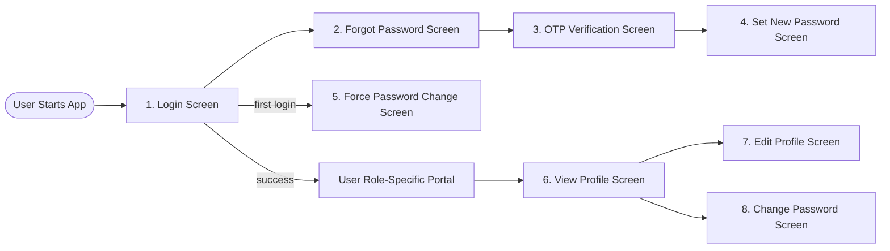
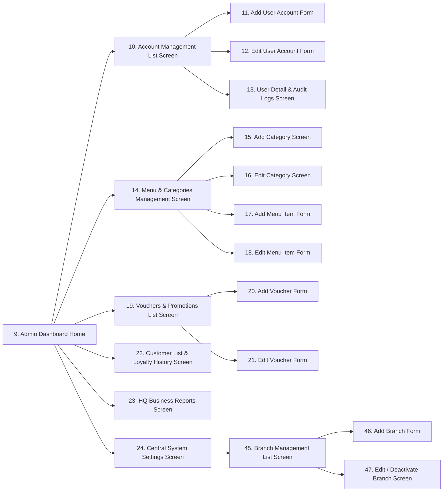
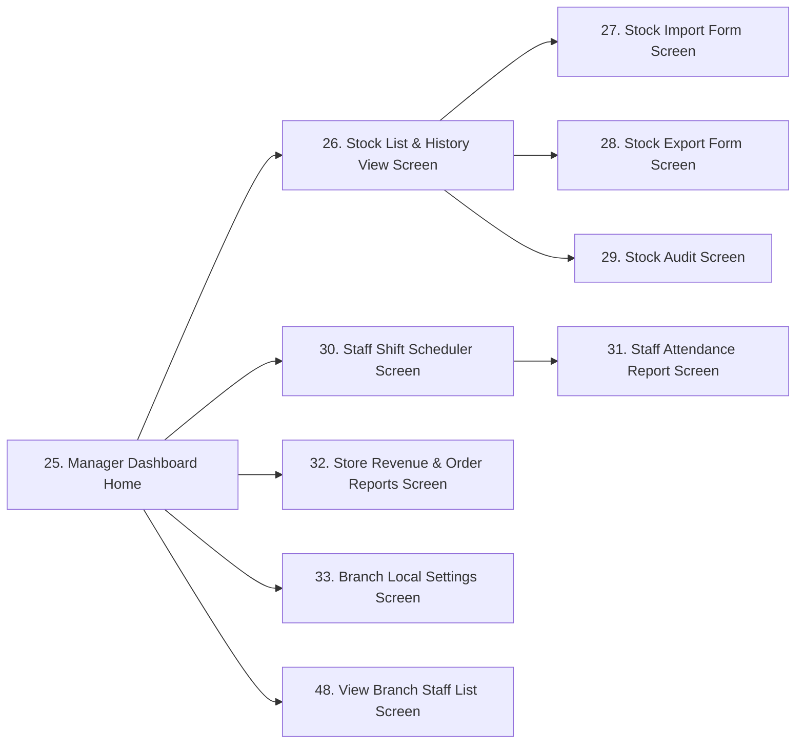
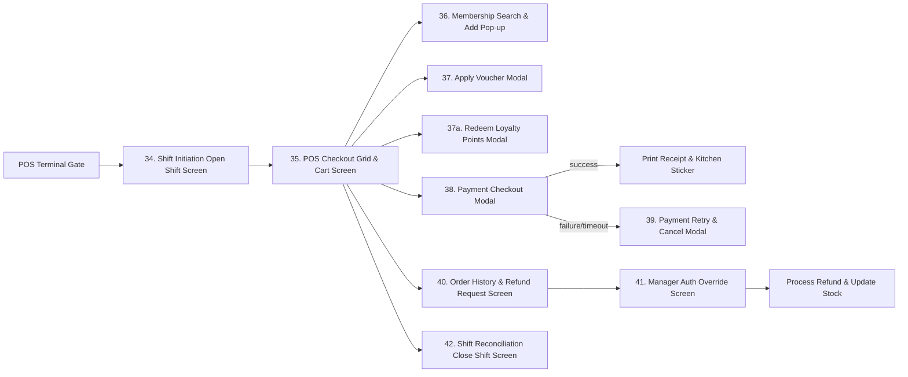
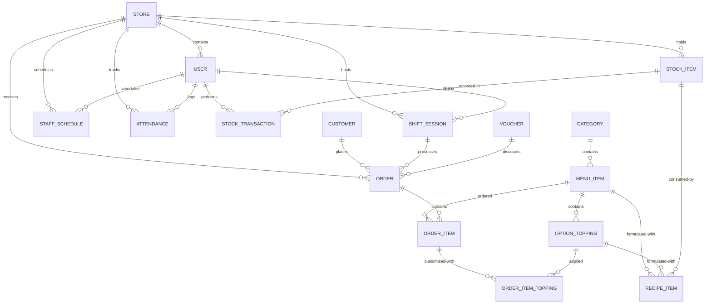

# 3.1 Functional Overview

This section outlines the application's design system structure, screen flows, security mappings, and the underlying data schema representing the system entities.

## 3.1.1 Screens Flow
The Coffee Shop Management System consists of distinct application interfaces mapped to roles. The screen transitions flow within role-specific portals as detailed below:

### 1. Common Authentication & Profile Screen Flow
Provides secure application entry, password recovery, mandatory first-time password resets, and profile management for all employees.

### 2. HQ Admin Portal Screen Flow
A desktop portal enabling administrative personnel to manage employees, global menus, vouchers, customer records, global settings, and view brand-wide reports.

### 3. Store Manager Console Screen Flow
A tablet or desktop dashboard for local store management overseeing logistics, inventory items, audits, scheduling, and store-specific performance logs.

### 4. Cashier POS Terminal Screen Flow
An optimized touchscreen terminal interface designed to handle shift controls, scan items, search memberships, apply coupon codes, process transaction payments, print invoices, and initiate supervisor overrides.

### 5. Barista Queue Monitor Screen Flow
An interactive tablet console in the preparation zone to manage product lines, change order processing flags, print cup stickers, and trigger item issue warnings.

---

## 3.1.2 Screen Descriptions
The system comprises the following screens across its user portals:

| # | Feature | Screen | Description |
|---|---|---|---|
| 1 | System Access & Security | Login Screen | Allows staff to securely access the system using their credentials. |
| | | Logout | Allow users to log out the system. |
| | | Forgot Password Screen | When users forget their password, they can retrieve it. |
| | | OTP Verification Screen | Verify user account via 6-digit OTP code. |
| | | Set New Password Screen | Allow users to set a new password after OTP verification. |
| | | Force Password Change Screen | Forces first-time login users to replace their temporary password before accessing the system. |
| | | View Profile Screen | Allow users to view personal information. |
| | | Edit Profile Screen | Allow users to update personal information. |
| | | Change Password Screen | Allows users to change their password. |
| 2 | User Account Management | Admin Dashboard Home | HQ Admin portal home screen with navigation to all administrative modules. |
| | | Account Management List Screen | Allows Admin to view all employee accounts. |
| | | Add User Account Form | Enables Admin to create and register new employee profiles. |
| | | Edit User Account Form | Allows Admin to edit employee details and roles. |
| | | User Detail & Audit Logs Screen | Displays profile details and historical activity records. |
| 3 | Menu & Category Management | Menu & Categories Management Screen | Main catalog panel to review product categories and menu listings. |
| | | Add Category Screen | Form to add a new category to the menu structure. |
| | | Edit Category Screen | Form to edit category details and visibility. |
| | | Add Menu Item Form | Form to create a new beverage or food entry with prices and recipes. |
| | | Edit Menu Item Form | Form to modify drink pricing, availability, or recipes. |
| 4 | Voucher Management | Vouchers & Promotions List Screen | Grid of active discount promotions, codes, and usage metrics. |
| | | Add Voucher Form | Form to configure new vouchers with discount rates and limits. |
| | | Edit Voucher Form | Form to modify voucher dates or total usage limits. |
| 5 | Customer Management | Customer List & Loyalty History Screen | Customer registry for searching and registering membership details. |
| 6 | Reports & Analytics | HQ Business Reports Screen | HQ dashboard comparing revenue, best-sellers, and store metrics. |
| | | Store Revenue & Order Reports Screen | Local branch dashboard showing sales, shift closures, and cash reports. |
| 7 | System Configuration | Central System Settings Screen | Central configuration screen for tax rates and brand settings. |
| | | Branch Local Settings Screen | Local settings screen for branch hardware and POS registers. |
| | | Branch Management List Screen | Lists all store branches with status indicators for Admin management. |
| | | Add Branch Form | Form for Admin to register a new store branch with name, address, and phone. |
| | | Edit / Deactivate Branch Screen | Form to modify branch details or deactivate (close) a branch. |
| 8 | Inventory Management | Manager Dashboard Home | Store Manager portal home screen with navigation to all manager modules. |
| | | Stock List & History View Screen | Displays branch inventory quantities and historical ledger logs. |
| | | Stock Import Form Screen | Form to record supplier inventory imports. |
| | | Stock Export Form Screen | Form to log physical stock exports, wastage, or damage. |
| | | Stock Audit Screen | Grid to count physical stock and reconcile discrepancies. |
| 9 | Staff & Shift Management | Staff Shift Scheduler Screen | Calendar to schedule cashiers and baristas into shift blocks. |
| | | Staff Attendance Report Screen | Logs check-in/out times and attendance details. |
| | | View Branch Staff List Screen | Roster directory showing assigned branch staff contact details and operational roles. |
| 10 | POS Sales & Billing | Shift Initiation Open Shift Screen | Prompts cashier for register ID and starting cash float. |
| | | POS Checkout Grid & Cart Screen | Main sales screen with catalog search and cart grid. |
| | | Membership Search & Add Pop-up | Modal to look up or register membership customers. |
| | | Apply Voucher Modal | Modal to select active vouchers matching cart values. |
| | | Redeem Loyalty Points Modal | Modal to input points count for customer cash discount redemptions. |
| | | Payment Checkout Modal | Modal to process card, cash, or dynamic QR code payments. |
| | | Payment Retry & Cancel Modal | Modal to handle payment failures and gateway timeouts. |
| | | Order History & Refund Request Screen | Logs local terminal transactions for refund requests. |
| | | Manager Auth Override Screen | Gate for manager credential validation during overrides. |
| | | Shift Reconciliation Close Shift Screen | Prompts cashier for counted closing cash drawer float input. |
| 11 | Order Prep & Queue | Barista Queue Monitor Screen | Live prep queue for Baristas showing order status columns. |
| | | Report Issue & Hold Order Screen | Modal to flag drink prep issues to cashiers and managers. |
---

## 3.1.3 Screen Authorization
The table below specifies access control policies across all 48 screens:

| Screen Name | Admin | Store Manager | Cashier | Barista |
|---|:---:|:---:|:---:|:---:|
| 1. Login Screen | Yes | Yes | Yes | Yes |
| 2. Forgot Password Screen | Yes | Yes | Yes | Yes |
| 3. OTP Verification Screen | Yes | Yes | Yes | Yes |
| 4. Set New Password Screen | Yes | Yes | Yes | Yes |
| 5. Force Password Change Screen | Yes | Yes | Yes | Yes |
| 6. View Profile Screen | Yes | Yes | Yes | Yes |
| 7. Edit Profile Screen | Yes | Yes | Yes | Yes |
| 8. Change Password Screen | Yes | Yes | Yes | Yes |
| Logout Screen/Action | Yes | Yes | Yes | Yes |
| 9. Admin Dashboard Home | **Yes** | No | No | No |
| 10. Account Management List | **Yes** | No | No | No |
| 11. Add User Account Form | **Yes** | No | No | No |
| 12. Edit User Account Form | **Yes** | No | No | No |
| 13. User Detail & Audit Logs | **Yes** | No | No | No |
| 14. Menu & Categories Management | **Yes** | No | No | No |
| 15. Add Category Screen | **Yes** | No | No | No |
| 16. Edit Category Screen | **Yes** | No | No | No |
| 17. Add Menu Item Form | **Yes** | No | No | No |
| 18. Edit Menu Item Form | **Yes** | No | No | No |
| 19. Vouchers & Promotions List | **Yes** | No | No | No |
| 20. Add Voucher Form | **Yes** | No | No | No |
| 21. Edit Voucher Form | **Yes** | No | No | No |
| 22. Customer List & Loyalty History | **Yes** | **Yes** | **Yes** | No |
| 23. HQ Business Reports | **Yes** | No | No | No |
| 24. Central System Settings | **Yes** | No | No | No |
| 25. Manager Dashboard Home | No | **Yes** | No | No |
| 26. Stock List & History View | **Yes** | **Yes** | No | No |
| 27. Stock Import Form | No | **Yes** | No | No |
| 28. Stock Export Form | No | **Yes** | No | No |
| 29. Stock Audit Screen | No | **Yes** | No | No |
| 30. Staff Shift Scheduler | No | **Yes** | No | No |
| 31. Staff Attendance Report | No | **Yes** | No | No |
| 32. Store Revenue & Order Reports | No | **Yes** | No | No |
| 33. Branch Local Settings | No | **Yes** | No | No |
| 34. Shift Initiation Open Shift | No | No | **Yes** | No |
| 35. POS Checkout Grid & Cart | No | No | **Yes** | No |
| 36. Membership Search & Add | No | No | **Yes** | No |
| 37. Apply Voucher Modal | No | No | **Yes** | No |
| 37a. Redeem Loyalty Points Modal | No | No | **Yes** | No |
| 38. Payment Checkout Modal | No | No | **Yes** | No |
| 39. Payment Retry & Cancel Modal | No | No | **Yes** | No |
| 40. Order History & Refund Request | No | No | **Yes** | No |
| 41. Manager Auth Override | **Yes** | **Yes** | No | No |
| 42. Shift Reconciliation Close Shift | No | No | **Yes** | No |
| 43. Barista Queue Monitor | No | Yes | Yes | **Yes** |
| 44. Report Issue & Hold Order | No | No | No | **Yes** |
| 45. Branch Management List | **Yes** | No | No | No |
| 46. Add Branch Form | **Yes** | No | No | No |
| 47. Edit / Deactivate Branch | **Yes** | No | No | No |
| 48. View Branch Staff List Screen | No | **Yes** | No | No |

---

## 3.1.4 Non-Screen Functions
These automated backend processes do not require direct human interaction:

| # | Feature | System Function | Description |
|---|---|---|---|
| 1 | System Access & Security | Logout | Invalidate the current user session or token and clear client-side storage. |
| 2 | System Access & Security | Silent Token Refresh | Automatically refresh JWT token in the background when it is close to expiration and client is active. |
| 3 | Inventory Management | Recipe-Based Stock Deduction | Automatically deduct stock ingredients based on menu recipes when an order moves to the PREPARING state. |
| 4 | Inventory Management | Low Stock Notification Engine | Evaluates active stock levels against thresholds in real-time, displaying alert badges and sending nightly aggregated emails at 22:00. |
| 5 | POS Transaction | Auto-Close Abandoned Shifts | Nightly scheduler runs at 11:59 PM to automatically close active cashier shifts left open, logging discrepancies. |
| 6 | POS Transaction | Order Timeout Handler | Automatically cancels orders that are in a pending payment state for more than 15 minutes. |
| 7 | Delivery Partner Integration | Auto-Sync Scheduler | Periodic background task running every 15 minutes to synchronize menu items, availability status, and inventory metrics with delivery partners. |
| 8 | Delivery Partner Integration | Real-time Out-of-Stock Webhooks | Immediately pushes out-of-stock statuses of menu items to third-party delivery partners when stock is depleted. |

---

## 3.1.5 Entity Relationship Diagram (ERD)
The entity relationships are structured as follows:

---

### Entities Description

| # | Entity | Description |
|---|---|---|
| 1 | users | Stores login credentials and role-based permissions for employees (Admin, Manager, Cashier, Barista) within the system. |
| 2 | categories | Represents main food and beverage groups to organize the product catalog. |
| 3 | menu_items | Holds individual beverage and food listings, including catalog pricing, barcodes, availability status, and image references. |
| 4 | option_toppings | Stores customizable add-ons that can be added to menu items. |
| 5 | customers | Registry of all enrolled loyalty membership customers, tracking membership tiers and accrued points. |
| 6 | shift_sessions | Tracks active work sessions of POS cashier registers, including opening/closing float values. |
| 7 | orders | Represents sales transactions, linking customers, shifts, payment statuses, and fulfillment statuses. |
| 8 | order_items | Line items detailing the specific menu products and quantities purchased in an order. |
| 9 | order_item_toppings | Tracks specific toppings applied to ordered menu items. |
| 10 | stock_items | Raw materials and shop supplies inventory quantities scoped per branch. |
| 11 | stock_transactions | Historical ledger recording inventory imports, exports, physical audits, and wastage logs. |
| 12 | vouchers | Stores promotional discount rules, coupon codes, validation dates, and customer usage limits. |
| 13 | recipe_items | Defines the raw stock ingredient quantity consumed to produce one unit of a menu item or topping. |
| 14 | stores | Represents physical store branches and geographic coffee shop locations. |
| 15 | staff_schedules | Stores assigned employee work shifts, scheduled date blocks, and register terminals allocations. |
| 16 | attendances | Logs employee clock-in/out timestamps, date records, and lateness metadata. |

---

### 3.1.6 Entity Details

### 1. `USER`
Represents employees and system administrators.

| # | Attribute name | PK | Type | Mandatory | Description |
|---|---|---|---|---|---|
| 1 | id | x | UUID | Yes | Unique identifier for the user. |
| 2 | username | | VARCHAR(50) | Yes | Account login name, unique. |
| 3 | password_hash | | VARCHAR(255) | Yes | Securely hashed password. |
| 4 | role | | Enum | Yes | User role: `ADMIN`, `STORE_MANAGER`, `CASHIER`, `BARISTA`. |
| 5 | full_name | | VARCHAR(100) | Yes | Employee full name. |
| 6 | is_active | | BOOLEAN | Yes | Current status of the account. |
| 7 | email | | VARCHAR(100) | Yes | Employee contact email address, unique. |
| 8 | phone | | VARCHAR(20) | Yes | Employee contact phone number. |
| 9 | store_id | | UUID | No | Foreign Key (FK) - references store/branch. Null for HQ Admin. |
| 10 | created_at | | TIMESTAMP | Yes | Account creation timestamp. |
| 11 | last_login_at | | TIMESTAMP | No | Timestamp of the most recent successful login. |
| 12 | must_change_password | | BOOLEAN | Yes | Flag indicating if the user must reset their password upon next login. Default: true. |

### 2. `CATEGORY`
Main food and beverage groups.

| # | Attribute name | PK | Type | Mandatory | Description |
|---|---|---|---|---|---|
| 1 | id | x | UUID | Yes | Unique identifier for the category. |
| 2 | name | | VARCHAR(100) | Yes | Category name (e.g., "Coffee", "Tea", "Pastry"). |
| 3 | description | | TEXT | No | Details of the category. |
| 4 | is_active | | BOOLEAN | Yes | Visibility flag. |

### 3. `MENU_ITEM`
Individual food/beverage listings.

| # | Attribute name | PK | Type | Mandatory | Description |
|---|---|---|---|---|---|
| 1 | id | x | UUID | Yes | Unique identifier for the menu item. |
| 2 | category_id | | UUID | Yes | Foreign Key (FK) - references CATEGORY(id). |
| 3 | name | | VARCHAR(100) | Yes | Name of the food or beverage (e.g., "Espresso", "Peach Tea"). |
| 4 | price | | DECIMAL(12,2) | Yes | Base price. |
| 5 | description | | TEXT | No | Description of the item. |
| 6 | is_available | | BOOLEAN | Yes | Availability status in stock. |
| 7 | image_url | | VARCHAR(255) | No | URL path to the product image file. |
| 8 | barcode | | VARCHAR(50) | No | Barcode or SKU for POS barcode scanner lookup (unique). |
| 9 | abbreviation | | VARCHAR(50) | Yes | Auto-generated abbreviation (e.g. cfd). |
| 10 | created_at | | TIMESTAMP | Yes | Date and time the item was added to the catalog. |
| 11 | is_deleted | | BOOLEAN | Yes | Soft-delete status flag. Default: false. |

### 4. `OPTION_TOPPING`
Add-ons like extra espresso shots, milk options, or tapioca pearls.

| # | Attribute name | PK | Type | Mandatory | Description |
|---|---|---|---|---|---|
| 1 | id | x | UUID | Yes | Unique identifier for the option/topping. |
| 2 | menu_item_id | | UUID | No | Foreign Key (FK) - references MENU_ITEM(id). Optional link, null for global toppings. |
| 3 | name | | VARCHAR(100) | Yes | Option or topping name (e.g., "Extra Espresso Shot", "Oat Milk"). |
| 4 | price | | DECIMAL(12,2) | Yes | Add-on cost in VND. |
| 5 | is_active | | BOOLEAN | Yes | Active/inactive visibility status. |

### 5. `CUSTOMER`
Registered membership details.

| # | Attribute name | PK | Type | Mandatory | Description |
|---|---|---|---|---|---|
| 1 | id | x | UUID | Yes | Unique identifier for the customer. |
| 2 | phone | | VARCHAR(20) | Yes | Primary lookup identifier (phone number, unique). |
| 3 | full_name | | VARCHAR(100) | Yes | Customer's full name. |
| 4 | points | | INTEGER | Yes | Loyalty points accrued. |
| 5 | membership_tier | | Enum | Yes | Loyalty tier: `BRONZE`, `SILVER`, `GOLD`, `DIAMOND`. |
| 6 | email | | VARCHAR(100) | No | Customer contact email. |
| 7 | created_at | | TIMESTAMP | Yes | Date and time of membership enrollment. |

### 6. `SHIFT_SESSION`
Tracks cashier sessions at POS terminals.

| # | Attribute name | PK | Type | Mandatory | Description |
|---|---|---|---|---|---|
| 1 | id | x | UUID | Yes | Unique identifier for the shift session. |
| 2 | store_id | | UUID | Yes | Foreign Key (FK) - references store branch. |
| 3 | user_id | | UUID | Yes | Foreign Key (FK) - references USER(id). The cashier who opened the shift. |
| 4 | start_time | | TIMESTAMP | Yes | Timestamp when the shift started. |
| 5 | end_time | | TIMESTAMP | No | Timestamp when the shift was closed. |
| 6 | starting_cash | | DECIMAL(12,2) | Yes | Float cash amount in cash drawer at start. |
| 7 | ending_cash | | DECIMAL(12,2) | No | Actual cash counted in drawer at close. |
| 8 | status | | Enum | Yes | Shift session status: `OPEN`, `CLOSED`. |
| 9 | pos_register_id | | VARCHAR(50) | Yes | Identifier of the POS terminal/register (e.g., "POS-01"). |

### 7. `ORDER`
Sales transactions.

| # | Attribute name | PK | Type | Mandatory | Description |
|---|---|---|---|---|---|
| 1 | id | x | UUID | Yes | Unique identifier for the order. |
| 2 | store_id | | UUID | Yes | Foreign Key (FK) - references store branch. |
| 3 | order_number | | VARCHAR(50) | Yes | Short 3-digit order sequence (e.g., `#001`), reset daily per branch. If the count exceeds 999, it continues to 1000 without truncating. |
| 4 | shift_session_id | | UUID | No | Foreign Key (FK) - references SHIFT_SESSION(id). Null for online delivery orders. |
| 5 | customer_id | | UUID | No | Foreign Key (FK) - references CUSTOMER(id). Null for guest orders. |
| 6 | voucher_id | | UUID | No | Foreign Key (FK) - references VOUCHER(id). Null if no discount applied. |
| 7 | order_type | | Enum | Yes | Order type: `DINE_IN`, `TAKE_AWAY`, `DELIVERY`. |
| 8 | subtotal | | DECIMAL(12,2) | Yes | Total price before discounts. |
| 9 | discount | | DECIMAL(12,2) | Yes | Total discount amount subtracted. |
| 10 | tax_amount | | DECIMAL(12,2) | Yes | The VAT amount calculated for this order based on global config. |
| 11 | total | | DECIMAL(12,2) | Yes | Net payable amount. |
| 12 | payment_method | | Enum | Yes | Payment method: `CASH`, `CARD`, `VIETQR`, `SHOPEEFOOD`. |
| 13 | payment_status | | Enum | Yes | Payment status: `PENDING`, `COMPLETED`, `FAILED`, `REFUNDED`. |
| 14 | order_status | | Enum | Yes | Fulfillment status: `PENDING`, `PREPARING`, `HOLD`, `READY`, `COMPLETED`, `CANCELLED`. |
| 15 | created_at | | TIMESTAMP | Yes | Date and time the order was placed. |

### 8. `ORDER_ITEM`
Line items in an order.

| # | Attribute name | PK | Type | Mandatory | Description |
|---|---|---|---|---|---|
| 1 | id | x | UUID | Yes | Unique identifier for the order line item. |
| 2 | order_id | | UUID | Yes | Foreign Key (FK) - references ORDER(id). |
| 3 | menu_item_id | | UUID | Yes | Foreign Key (FK) - references MENU_ITEM(id). |
| 4 | quantity | | INTEGER | Yes | Quantity purchased. |
| 5 | unit_price | | DECIMAL(12,2) | Yes | Price of the item at the time of purchase. |

### 9. `ORDER_ITEM_TOPPING`
Toppings attached to a specific order line item.

| # | Attribute name | PK | Type | Mandatory | Description |
|---|---|---|---|---|---|
| 1 | id | x | UUID | Yes | Unique identifier for the order item topping. |
| 2 | order_item_id | | UUID | Yes | Foreign Key (FK) - references ORDER_ITEM(id). |
| 3 | topping_id | | UUID | Yes | Foreign Key (FK) - references OPTION_TOPPING(id). |
| 4 | quantity | | INTEGER | Yes | Quantity of the topping applied. |
| 5 | unit_price | | DECIMAL(12,2) | Yes | Price of the topping at the time of purchase. |

### 10. `STOCK_ITEM`
Raw inventory tracking (e.g., Coffee Beans, Milk, Paper Cups) scoped per branch.

| # | Attribute name | PK | Type | Mandatory | Description |
|---|---|---|---|---|---|
| 1 | id | x | UUID | Yes | Unique identifier for the stock item. |
| 2 | store_id | | UUID | Yes | Foreign Key (FK) - references store branch. |
| 3 | name | | VARCHAR(100) | Yes | Item name (e.g., "Coffee Beans", "Milk"). |
| 4 | unit | | VARCHAR(20) | Yes | Unit of measurement (e.g., "kg", "liter", "piece"). |
| 5 | current_quantity | | DECIMAL(12,4) | Yes | Remaining physical amount in stock. |
| 6 | min_alert_threshold | | DECIMAL(12,4) | Yes | Threshold triggering low stock alert. |
| 7 | category | | VARCHAR(50) | Yes | Grouping label (e.g., "Ingredients", "Packaging"). |

### 11. `STOCK_TRANSACTION`
Historical ledger of stock modifications.

| # | Attribute name | PK | Type | Mandatory | Description |
|---|---|---|---|---|---|
| 1 | id | x | UUID | Yes | Unique identifier for the stock transaction. |
| 2 | stock_item_id | | UUID | Yes | Foreign Key (FK) - references STOCK_ITEM(id). |
| 3 | manager_id | | UUID | No | Foreign Key (FK) - references USER(id). The manager who logged it. Null for system-triggered automated recipe deductions. |
| 4 | transaction_type | | Enum | Yes | Transaction type: `IMPORT`, `EXPORT`, `AUDIT_ADJUSTMENT`. |
| 5 | quantity | | DECIMAL(12,4) | Yes | Volume of stock moved. |
| 6 | reason | | TEXT | No | Reason details (e.g., "Weekly Restock", "Soured Milk Disposal"). |
| 7 | created_at | | TIMESTAMP | Yes | Date and time of the transaction. |

### 12. `VOUCHER`
Marketing and promotional discount codes.

| # | Attribute name | PK | Type | Mandatory | Description |
|---|---|---|---|---|---|
| 1 | id | x | UUID | Yes | Unique identifier for the voucher. |
| 2 | code | | VARCHAR(50) | Yes | Unique alphanumeric code (e.g., "COFFEE20"). |
| 3 | discount_type | | Enum | Yes | Discount type: `PERCENTAGE`, `FIXED_AMOUNT`. |
| 4 | discount_value | | DECIMAL(12,2) | Yes | Value of discount (percentage or flat amount). |
| 5 | min_order_value | | DECIMAL(12,2) | Yes | Minimum subtotal value required to apply voucher. |
| 6 | start_date | | TIMESTAMP | Yes | Voucher validity start date and time. |
| 7 | end_date | | TIMESTAMP | Yes | Voucher expiration date and time. |
| 8 | is_active | | BOOLEAN | Yes | Active status flag. |
| 9 | usage_limit_per_customer | | INTEGER | No | Maximum usage count per customer (null for unlimited). |
| 10 | total_usage_count | | INTEGER | Yes | Total redemptions count across all customers. Default: 0. |
| 11 | max_total_uses | | INTEGER | No | Overall maximum total uses cap (null for unlimited). |

### 13. `RECIPE_ITEM`
Defines the ingredients/stock consumed to produce menu items and toppings.

| # | Attribute name | PK | Type | Mandatory | Description |
|---|---|---|---|---|---|
| 1 | id | x | UUID | Yes | Unique identifier for the recipe item. |
| 2 | menu_item_id | | UUID | No | Foreign Key (FK) - references MENU_ITEM(id). Nullable if linked to topping instead. |
| 3 | option_topping_id | | UUID | No | Foreign Key (FK) - references OPTION_TOPPING(id). Nullable if linked to menu item instead. |
| 4 | stock_item_id | | UUID | Yes | Foreign Key (FK) - references STOCK_ITEM(id) being consumed. |
| 5 | quantity_required | | DECIMAL(12,4) | Yes | Ingredient quantity required to produce one unit of menu item or topping. |

### 14. `STORE`
Represents physical store branches and geographic coffee shop locations.

| # | Attribute name | PK | Type | Mandatory | Description |
|---|---|---|---|---|---|
| 1 | id | x | UUID | Yes | Unique identifier for the store branch. |
| 2 | name | | VARCHAR(100) | Yes | Store/Branch name (e.g. "Nguyen Du Branch"). |
| 3 | address | | VARCHAR(255) | Yes | Physical address of the branch store. |
| 4 | phone | | VARCHAR(20) | Yes | Branch contact phone number. |
| 5 | is_active | | BOOLEAN | Yes | Flag indicating if store is active. Default: true. |
| 6 | created_at | | TIMESTAMP | Yes | Timestamp of store registration. |

### 15. `STAFF_SCHEDULE`
Stores assigned employee work shifts, scheduled date blocks, and register terminals allocations.

| # | Attribute name | PK | Type | Mandatory | Description |
|---|---|---|---|---|---|
| 1 | id | x | UUID | Yes | Unique identifier for the schedule slot. |
| 2 | store_id | | UUID | Yes | Foreign Key (FK) - references STORE(id). Scopes schedule to branch. |
| 3 | user_id | | UUID | Yes | Foreign Key (FK) - references USER(id). The scheduled employee. |
| 4 | shift_date | | DATE | Yes | Date of the scheduled shift. |
| 5 | shift_type | | Enum | Yes | Shift type block: `MORNING`, `AFTERNOON`, `FULL_DAY`. |
| 6 | pos_register_id | | VARCHAR(50) | No | Reference to register terminal ID, if register allocated. |
| 7 | created_at | | TIMESTAMP | Yes | Timestamp when schedule slot was created. |

### 16. `ATTENDANCE`
Logs employee clock-in/out timestamps, date records, and lateness metadata.

| # | Attribute name | PK | Type | Mandatory | Description |
|---|---|---|---|---|---|
| 1 | id | x | UUID | Yes | Unique identifier for the attendance slot. |
| 2 | store_id | | UUID | Yes | Foreign Key (FK) - references STORE(id). Scopes attendance to branch. |
| 3 | user_id | | UUID | Yes | Foreign Key (FK) - references USER(id). The employee user profile. |
| 4 | shift_date | | DATE | Yes | Date of the recorded attendance. |
| 5 | check_in_at | | TIMESTAMP | No | Actual clock-in timestamp (null if absent). |
| 6 | check_out_at | | TIMESTAMP | No | Actual clock-out timestamp (null if absent or active shift). |
| 7 | lateness_minutes | | INTEGER | Yes | Calculated late check-in minutes relative to shift. Default: 0. |
| 8 | status | | Enum | Yes | Attendance status: `ON_TIME`, `LATE`, `ABSENT`. Default: `ABSENT`. |

