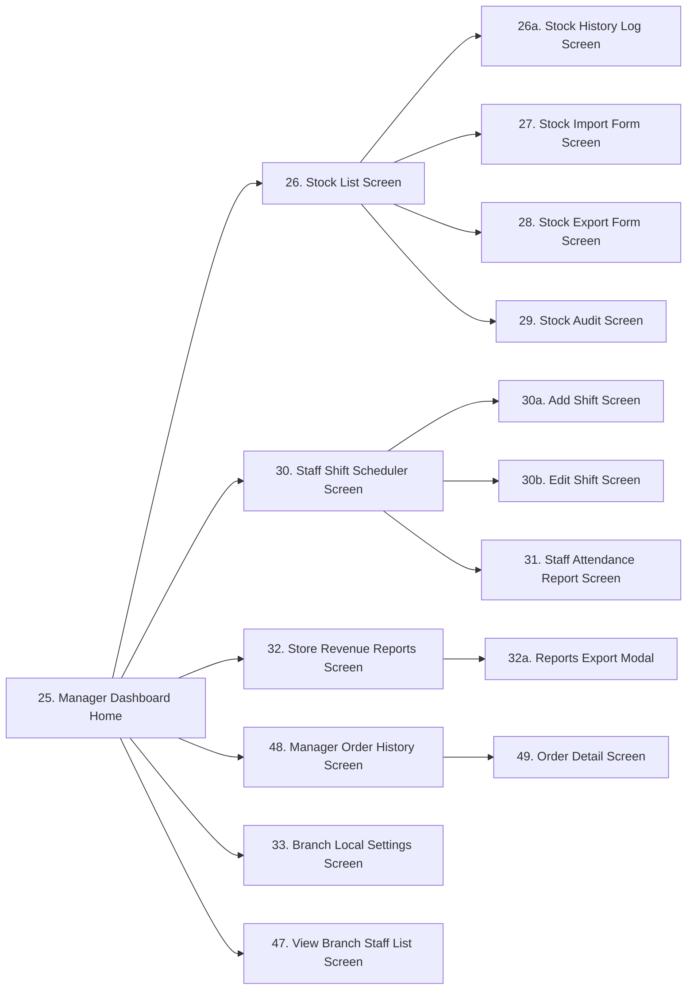
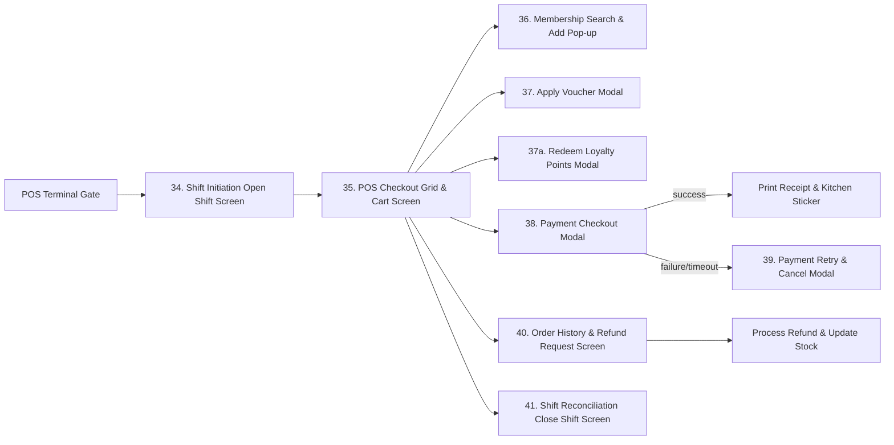
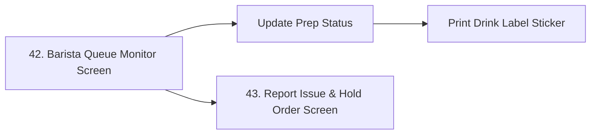
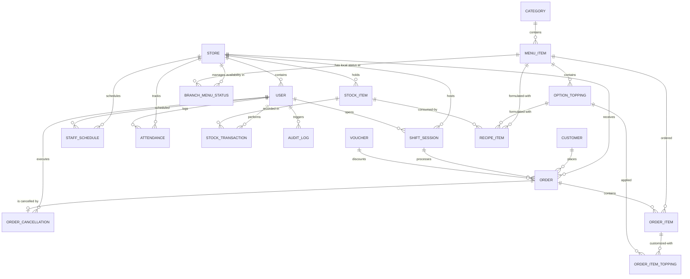

# 3.1 Functional Overview

This section outlines the application's design system structure, screen flows, security mappings, and the underlying data schema representing the system entities.

## 3.1.1 Screens Flow
The Coffee Shop Management System consists of distinct application interfaces mapped to roles. The screen transitions flow within role-specific portals as detailed below:

### 1. Common Authentication & Profile Screen Flow
Provides secure application entry, password recovery, mandatory first-time password resets, and profile management for all employees.

### 2. HQ Admin Portal Screen Flow
A desktop portal enabling administrative personnel to manage employees, global menus, vouchers, customer records, global settings, and view brand-wide reports. The portal is shared by the three HQ roles, each seeing only its permitted modules: `ceoviewer` (read-only HQ reports), `businessadmin` (menu, category, voucher, and CRM management), and `ssadmin` (user provisioning, central system settings, and branch lifecycle).

### 3. Store Manager Console Screen Flow
A tablet or desktop dashboard for local store management overseeing logistics, inventory items, audits, scheduling, and store-specific performance logs.

### 4. Cashier POS Terminal Screen Flow
An optimized touchscreen terminal interface designed to handle shift controls, scan items, search memberships, apply coupon codes, process transaction payments, print invoices, and initiate supervisor overrides.

### 5. Barista Queue Monitor Screen Flow
An interactive tablet console in the preparation zone to manage product lines, change order processing flags, print cup stickers, and trigger item issue warnings.

---

## 3.1.2 Screen Descriptions
The system comprises the following screens across its user portals:

| # | Feature | Screen | Description |
|---|---|---|---|
| 1 | System Access & Security | Login Screen | Allows staff to securely access the system using their credentials. |
| | | Logout | Allow users to log out the system. |
| | | Forgot Password Screen | When users forget their password, they can retrieve it. |
| | | OTP Verification Screen | Verify user account via 6-digit OTP code. |
| | | Set New Password Screen | Allow users to set a new password after OTP verification. |
| | | Force Password Change Screen | Forces first-time login users to replace their temporary password before accessing the system. |
| | | View Profile Screen | Allow users to view personal information. |
| | | Edit Profile Screen | Allow users to update personal information. |
| | | Change Password Screen | Allows users to change their password. |
| 2 | User Account Management | Admin Dashboard Home | Shared HQ portal home screen; each HQ role (ceoviewer, businessadmin, ssadmin) sees navigation to only its permitted modules. |
| | | Account Management List Screen | Allows System Admin to view all employee accounts. |
| | | Add User Account Form | Enables System Admin to create and register new employee profiles. |
| | | Edit User Account Form | Allows System Admin to edit employee details and roles. |
| | | User Detail & Audit Logs Screen | Displays profile details and historical activity records. |
| 3 | Menu & Category Management | Menu & Categories Management Screen | Main catalog panel to review product categories and menu listings. |
| | | Add Category Screen | Form to add a new category to the menu structure. |
| | | Edit Category Screen | Form to edit category details and visibility. |
| | | Add Menu Item Form | Form to create a new beverage or food entry with prices and recipes. |
| | | Edit Menu Item Form | Form to modify drink pricing, availability, or recipes. |
| 4 | Voucher Management | Vouchers & Promotions List Screen | Grid of active discount promotions, codes, and usage metrics. |
| | | Add Voucher Form | Form to configure new vouchers with discount rates and limits. |
| | | Edit Voucher Form | Form to modify voucher dates or total usage limits. |
| 5 | Customer Management | Customer List & Loyalty History Screen | Customer registry for searching and registering membership details. |
| 6 | Reports & Analytics | HQ Business Reports Screen | HQ dashboard comparing revenue, best-sellers, and store metrics. |
| | | Store Revenue Reports Screen | Local branch dashboard showing retail sales, shift closures, and payment metrics. |
| | | Reports Export Modal | Modal to export branch sales and inventory reports to PDF/Excel. |
| 7 | System Configuration | Central System Settings Screen | Central configuration screen for tax rates and brand settings. |
| | | Branch Local Settings Screen | Local settings screen for branch hardware and POS registers. |
| | | Branch Management List Screen | Lists all store branches with status indicators for System Admin management. |
| | | Add Branch Form | Form for System Admin to register a new store branch with name, address, and phone. |
| | | Edit / Deactivate Branch Screen | Form to modify branch details or deactivate (close) a branch. |
| 8 | Inventory Management | Manager Dashboard Home | Store Manager portal home screen with navigation to all manager modules. |
| | | Stock List Screen | Displays branch inventory quantities and alert flags. |
| | | Stock History Log Screen | Displays historical ledger logs of all stock imports/exports. |
| | | Stock Import Form Screen | Form to record supplier inventory imports. |
| | | Stock Export Form Screen | Form to log physical stock exports, wastage, or damage. |
| | | Stock Audit Screen | Grid to count physical stock and reconcile discrepancies. |
| 9 | Staff & Shift Management | Staff Shift Scheduler Screen | Calendar to schedule cashiers and baristas into shift blocks. |
| | | Add Shift Screen | Form to schedule a cashier or barista to a new shift. |
| | | Edit Shift Screen | Form to modify or delete an existing staff shift. |
| | | Staff Attendance Report Screen | Logs check-in/out times and attendance details. |
| | | View Branch Staff List Screen | Roster directory showing assigned branch staff contact details and operational roles. |
| 10 | POS Sales & Billing | Shift Initiation Open Shift Screen | Prompts cashier for register ID and starting cash float. |
| | | POS Checkout Grid & Cart Screen | Main sales screen with catalog search and cart grid. |
| | | Membership Search & Add Pop-up | Modal to look up or register membership customers. |
| | | Apply Voucher Modal | Modal to select active vouchers matching cart values. |
| | | Redeem Loyalty Points Modal | Modal to input points count for customer cash discount redemptions. |
| | | Payment Checkout Modal | Modal to process card, cash, or dynamic QR code payments. |
| | | Payment Retry & Cancel Modal | Modal to handle payment failures and gateway timeouts. |
| | | Order History & Refund Request Screen | Logs local terminal transactions for refund requests. |
| | | Shift Reconciliation Close Shift Screen | Prompts cashier for counted closing cash drawer float input. |
| | | Manager Order History Screen | Displays list of orders processed at the branch with filters. |
| | | Order Detail Screen | Displays item details, payment transactions, and fulfillment logs for a specific order, allowing managers, cashiers, and baristas to view it, and managers to cancel/refund pending orders directly. |
| 11 | Order Prep & Queue | Barista Queue Monitor Screen | Live prep queue for Baristas showing order status columns. |
| | | Report Issue & Hold Order Screen | Modal to flag drink prep issues to cashiers and managers. |
---

## 3.1.3 Screen Authorization
The table below specifies access control policies across all 50 screens. The single former "Admin" column is split into the three HQ roles (`ceoviewer`, `businessadmin`, `ssadmin`) per the authoritative RBAC matrix in §3.2.0 of [03_2 System Access & Security](03_2_system_access_security.md):

| Screen Name | ceoviewer | businessadmin | ssadmin | Store Manager | Cashier | Barista |
|---|:---:|:---:|:---:|:---:|:---:|:---:|
| 1. Login Screen | Yes | Yes | Yes | Yes | Yes | Yes |
| 2. Forgot Password Screen | Yes | Yes | Yes | Yes | Yes | Yes |
| 3. OTP Verification Screen | Yes | Yes | Yes | Yes | Yes | Yes |
| 4. Set New Password Screen | Yes | Yes | Yes | Yes | Yes | Yes |
| 5. Force Password Change Screen | Yes | Yes | Yes | Yes | Yes | Yes |
| 6. View Profile Screen | Yes | Yes | Yes | Yes | Yes | Yes |
| 7. Edit Profile Screen | Yes | Yes | Yes | Yes | Yes | Yes |
| 8. Change Password Screen | Yes | Yes | Yes | Yes | Yes | Yes |
| Logout Screen/Action | Yes | Yes | Yes | Yes | Yes | Yes |
| 9. Admin Dashboard Home | **Yes** | **Yes** | **Yes** | No | No | No |
| 10. Account Management List | No | No | **Yes** | No | No | No |
| 11. Add User Account Form | No | No | **Yes** | No | No | No |
| 12. Edit User Account Form | No | No | **Yes** | No | No | No |
| 13. User Detail & Audit Logs | No | No | **Yes** | No | No | No |
| 14. Menu & Categories Management | No | **Yes** | No | No | No | No |
| 15. Add Category Screen | No | **Yes** | No | No | No | No |
| 16. Edit Category Screen | No | **Yes** | No | No | No | No |
| 17. Add Menu Item Form | No | **Yes** | No | No | No | No |
| 18. Edit Menu Item Form | No | **Yes** | No | No | No | No |
| 19. Vouchers & Promotions List | No | **Yes** | No | No | No | No |
| 20. Add Voucher Form | No | **Yes** | No | No | No | No |
| 21. Edit Voucher Form | No | **Yes** | No | No | No | No |
| 22. Customer List & Loyalty History | No | **Yes** | No | **Yes** | **Yes** | No |
| 23. HQ Business Reports | **Yes** | No | No | No | No | No |
| 24. Central System Settings | No | No | **Yes** | No | No | No |
| 25. Manager Dashboard Home | No | No | No | **Yes** | No | No |
| 26. Stock List Screen | No | No | No | **Yes** | No | No |
| 26a. Stock History Log Screen | No | No | No | **Yes** | No | No |
| 27. Stock Import Form | No | No | No | **Yes** | No | No |
| 28. Stock Export Form | No | No | No | **Yes** | No | No |
| 29. Stock Audit Screen | No | No | No | **Yes** | No | No |
| 30. Staff Shift Scheduler | No | No | No | **Yes** | No | No |
| 30a. Add Shift Screen | No | No | No | **Yes** | No | No |
| 30b. Edit Shift Screen | No | No | No | **Yes** | No | No |
| 31. Staff Attendance Report | No | No | No | **Yes** | No | No |
| 32. Store Revenue Reports Screen | No | No | No | **Yes** | No | No |
| 32a. Reports Export Modal | No | No | No | **Yes** | No | No |
| 33. Branch Local Settings | No | No | No | **Yes** | No | No |
| 34. Shift Initiation Open Shift | No | No | No | No | **Yes** | No |
| 35. POS Checkout Grid & Cart | No | No | No | No | **Yes** | No |
| 36. Membership Search & Add | No | No | No | No | **Yes** | No |
| 37. Apply Voucher Modal | No | No | No | No | **Yes** | No |
| 37a. Redeem Loyalty Points Modal | No | No | No | No | **Yes** | No |
| 38. Payment Checkout Modal | No | No | No | No | **Yes** | No |
| 39. Payment Retry & Cancel Modal | No | No | No | No | **Yes** | No |
| 40. Order History & Refund Request | No | No | No | No | **Yes** | No |
| 41. Shift Reconciliation Close Shift | No | No | No | No | **Yes** | No |
| 42. Barista Queue Monitor | No | No | No | Yes | Yes | **Yes** |
| 43. Report Issue & Hold Order | No | No | No | No | No | **Yes** |
| 44. Branch Management List | No | No | **Yes** | No | No | No |
| 45. Add Branch Form | No | No | **Yes** | No | No | No |
| 46. Edit / Deactivate Branch | No | No | **Yes** | No | No | No |
| 47. View Branch Staff List Screen | No | No | No | **Yes** | No | No |
| 48. Manager Order History Screen | No | No | No | **Yes** | No | No |
| 49. Order Detail Screen | No | No | No | **Yes** | **Yes** | **Yes** |
| 50. Raw Material Master | No | **Yes** | No | No | No | No |

> **Note on inventory access (two layers):** **Branch stock quantities** (Stock List/History/Import/Export/Audit, screens 26–29) are owned exclusively by the `storemanager`. The previous "Admin = Read (auditing)" access on Stock List/History (screens 26/26a) is removed — no HQ role has direct access to branch stock screens; chain-wide stock visibility reaches `ceoviewer` only through consolidated HQ reports. Separately, the **Raw Material Master** (screen 50, UC-74) is a chain-wide *catalog* — defining which materials exist — owned by the `businessadmin`; it carries no per-branch quantities. There is no central warehouse.

---

## 3.1.4 Non-Screen Functions
These automated backend processes do not require direct human interaction:

| # | Feature | System Function | Description |
|---|---|---|---|
| 1 | System Access & Security | Logout | Invalidate the current user session or token and clear client-side storage. |
| 2 | System Access & Security | Silent Token Refresh | Automatically refresh JWT token in the background when it is close to expiration and client is active. |
| 3 | Inventory Management | Recipe-Based Stock Deduction | Automatically deduct stock ingredients based on menu recipes when an order moves to the PREPARING state. |
| 4 | Inventory Management | Low Stock Notification Engine | Evaluates active stock levels against thresholds in real-time, displaying alert badges and sending nightly aggregated emails at 22:00. |
| 5 | POS Transaction | Auto-Close Abandoned Shifts | Nightly scheduler runs at 11:59 PM to automatically close active cashier shifts left open, logging discrepancies. |
| 6 | POS Transaction | Order Timeout Handler | Automatically cancels orders that are in a pending payment state for more than 15 minutes. |

---

## 3.1.5 Entity Relationship Diagram (ERD)
The entity relationships are structured as follows:

---

### Entities Description

| # | Entity | Description |
|---|---|---|
| 1 | users | Stores login credentials and role-based permissions for employees (CEO Viewer, Business Admin, System Admin, Store Manager, Cashier, Barista) within the system. |
| 2 | categories | Represents main food and beverage groups to organize the product catalog. |
| 3 | menu_items | Holds individual beverage and food listings, including catalog pricing, barcodes, chain-wide active status, and image references. |
| 3a | branch_menu_status | Manages item availability status independently per branch store. |
| 4 | option_toppings | Stores customizable add-ons that can be added to menu items. |
| 5 | customers | Registry of all enrolled loyalty membership customers, tracking points. |
| 6 | shift_sessions | Tracks active work sessions of POS cashier registers, including opening/closing float values. |
| 7 | orders | Represents sales transactions, linking customers, shifts, payment statuses, and fulfillment statuses. |
| 8 | order_items | Line items detailing the specific menu products and quantities purchased in an order. |
| 9 | order_item_toppings | Tracks specific toppings applied to ordered menu items. |
| 10 | stock_items | Raw materials and shop supplies inventory quantities scoped per branch. |
| 11 | stock_transactions | Historical ledger recording inventory imports, exports, physical audits, and wastage logs. |
| 12 | vouchers | Stores promotional discount rules, coupon codes, validation dates, and customer usage limits. |
| 13 | recipe_items | Defines the raw stock ingredient quantity consumed to produce one unit of a menu item or topping. |
| 14 | stores | Represents physical store branches and geographic coffee shop locations. |
| 15 | staff_schedules | Stores assigned employee work shifts, scheduled date blocks, and register terminals allocations. |
| 16 | attendances | Logs employee clock-in/out timestamps, date records, snapshot photos, and lateness metadata. |
| 17 | audit_logs | Central security audit logs for critical database updates. |

---

### 3.1.6 Entity Details

### 1. `USER`
Represents employees and system administrators.

| # | Attribute name | PK | Type | Mandatory | Description |
|---|---|---|---|---|---|
| 1 | id | x | Unique ID (UUID) | Yes | Unique identifier for the user. |
| 2 | username | | Text (Max 50 characters) | Yes | Account login name, unique. |
| 3 | password_hash | | Text (Max 255 characters) | Yes | Securely hashed password. |
| 4 | role | | Selection (Role: CEOVIEWER, BUSINESSADMIN, SSADMIN, STOREMANAGER, CASHIER, BARISTA) | Yes | User role. |
| 5 | full_name | | Text (Max 100 characters) | Yes | Employee full name. |
| 6 | is_active | | Yes/No (Boolean) | Yes | Current status of the account. |
| 7 | email | | Text (Max 100 characters) | Yes | Employee contact email address, unique. |
| 8 | phone | | Text (Max 20 characters) | Yes | Employee contact phone number, unique. |
| 9 | store_id | | Unique ID (UUID) | No | Foreign Key (FK) - references store/branch. Null for HQ roles (ceoviewer / businessadmin / ssadmin). |
| 10 | created_at | | Date & Time | Yes | Account creation timestamp. |
| 11 | last_login_at | | Date & Time | No | Timestamp of the most recent successful login. |
| 12 | must_change_password | | Yes/No (Boolean) | Yes | Flag indicating if the user must reset their password upon next login. Default: true. |

### 2. `CATEGORY`
Main food and beverage groups.

| # | Attribute name | PK | Type | Mandatory | Description |
|---|---|---|---|---|---|
| 1 | id | x | Unique ID (UUID) | Yes | Unique identifier for the category. |
| 2 | name | | Text (Max 100 characters) | Yes | Category name (e.g., "Coffee", "Tea", "Pastry"). |
| 3 | description | | Long Text | No | Details of the category. |
| 4 | is_active | | Yes/No (Boolean) | Yes | Visibility flag. |

### 3. `MENU_ITEM`
Individual food/beverage listings.

| # | Attribute name | PK | Type | Mandatory | Description |
|---|---|---|---|---|---|
| 1 | id | x | Unique ID (UUID) | Yes | Unique identifier for the menu item. |
| 2 | category_id | | Unique ID (UUID) | No | Foreign Key (FK) - references CATEGORY(id). Nullable to set NULL on category deletion. |
| 3 | name | | Text (Max 100 characters) | Yes | Name of the food or beverage (e.g., "Espresso", "Peach Tea"). |
| 4 | price | | Decimal (Currency/VND) | Yes | Base price. |
| 5 | description | | Long Text | No | Description of the item. |
| 6 | is_active | | Yes/No (Boolean) | Yes | Visibility flag for entire chain, decided by Business Admin at HQ (default: true). |
| 7 | image_url | | Text (Max 255 characters) | No | URL path to the product image file. |
| 8 | barcode | | Text (Max 50 characters) | No | Barcode or SKU for POS barcode scanner lookup (unique). |
| 9 | abbreviation | | Text (Max 50 characters) | Yes | Auto-generated abbreviation (e.g. cfd). |
| 10 | created_at | | Date & Time | Yes | Date and time the item was added to the catalog. |
| 11 | is_deleted | | Yes/No (Boolean) | Yes | Soft-delete status flag. Default: false. |

### 3a. `BRANCH_MENU_STATUS`
Manages item availability status independently per branch store.

| # | Attribute name | PK | Type | Mandatory | Description |
|---|---|---|---|---|---|
| 1 | store_id | x | Unique ID (UUID) | Yes | Foreign Key (FK) - references STORE(id). |
| 2 | menu_item_id | x | Unique ID (UUID) | Yes | Foreign Key (FK) - references MENU_ITEM(id). |
| 3 | is_available | | Yes/No (Boolean) | Yes | Availability status of menu item in this specific branch store. |

### 4. `OPTION_TOPPING`
Add-ons like extra espresso shots, milk options, or tapioca pearls.

| # | Attribute name | PK | Type | Mandatory | Description |
|---|---|---|---|---|---|
| 1 | id | x | Unique ID (UUID) | Yes | Unique identifier for the option/topping. |
| 2 | menu_item_id | | Unique ID (UUID) | No | Foreign Key (FK) - references MENU_ITEM(id). Optional link, null for global toppings. |
| 3 | name | | Text (Max 100 characters) | Yes | Option or topping name (e.g., "Extra Espresso Shot", "Oat Milk"). |
| 4 | price | | Decimal (Currency/VND) | Yes | Add-on cost in VND. |
| 5 | is_active | | Yes/No (Boolean) | Yes | Active/inactive visibility status. |

### 5. `CUSTOMER`
Registered membership details.

| # | Attribute name | PK | Type | Mandatory | Description |
|---|---|---|---|---|---|
| 1 | id | x | Unique ID (UUID) | Yes | Unique identifier for the customer. |
| 2 | phone | | Text (Max 20 characters) | Yes | Primary lookup identifier (phone number, unique). |
| 3 | full_name | | Text (Max 100 characters) | Yes | Customer's full name. |
| 4 | points | | Whole Number | Yes | Loyalty points accrued. |
| 5 | email | | Text (Max 100 characters) | No | Customer contact email. |
| 6 | created_at | | Date & Time | Yes | Date and time of membership enrollment. |

### 6. `SHIFT_SESSION`
Tracks cashier sessions at POS terminals.

| # | Attribute name | PK | Type | Mandatory | Description |
|---|---|---|---|---|---|
| 1 | id | x | Unique ID (UUID) | Yes | Unique identifier for the shift session. |
| 2 | store_id | | Unique ID (UUID) | Yes | Foreign Key (FK) - references store branch. |
| 3 | user_id | | Unique ID (UUID) | Yes | Foreign Key (FK) - references USER(id). The cashier who opened the shift. |
| 4 | start_time | | Date & Time | Yes | Timestamp when the shift started. |
| 5 | end_time | | Date & Time | No | Timestamp when the shift was closed. |
| 6 | starting_cash | | Decimal (Currency/VND) | Yes | Float cash amount in cash drawer at start. |
| 7 | ending_cash | | Decimal (Currency/VND) | No | Actual cash counted in drawer at close. |
| 8 | status | | Selection (Shift Status: OPEN, CLOSED) | Yes | Shift session status. |
| 9 | pos_register_id | | Text (Max 50 characters) | Yes | Identifier of the POS terminal/register (e.g., "POS-01"). |

### 7. `ORDER`
Sales transactions.

| # | Attribute name | PK | Type | Mandatory | Description |
|---|---|---|---|---|---|
| 1 | id | x | Unique ID (UUID) | Yes | Unique identifier for the order. |
| 2 | store_id | | Unique ID (UUID) | Yes | Foreign Key (FK) - references store branch. |
| 3 | order_number | | Text (Max 50 characters) | Yes | Short 3-digit order sequence (e.g., `#001`), reset daily per branch. If the count exceeds 999, it continues to 1000 without truncating. |
| 4 | shift_session_id | | Unique ID (UUID) | No | Foreign Key (FK) - references SHIFT_SESSION(id). Null for online delivery orders. |
| 5 | customer_id | | Unique ID (UUID) | No | Foreign Key (FK) - references CUSTOMER(id). Null for guest orders. |
| 6 | voucher_id | | Unique ID (UUID) | No | Foreign Key (FK) - references VOUCHER(id). Null if no discount applied. |
| 7 | order_type | | Selection (Order Type: DINE_IN, TAKE_AWAY, DELIVERY) | Yes | Order type. |
| 8 | subtotal | | Decimal (Currency/VND) | Yes | Total price before discounts. |
| 9 | discount | | Decimal (Currency/VND) | Yes | Total discount amount subtracted. |
| 10 | tax_amount | | Decimal (Currency/VND) | Yes | The VAT amount calculated for this order based on global config. |
| 11 | total | | Decimal (Currency/VND) | Yes | Net payable amount. |
| 12 | payment_method | | Selection (Payment Method: CASH, CARD, VIETQR) | Yes | Payment method. |
| 13 | payment_status | | Selection (Payment Status: PENDING, COMPLETED, FAILED, REFUNDED) | Yes | Payment status. |
| 14 | order_status | | Selection (Fulfillment Status: PENDING, PREPARING, HOLD, READY, COMPLETED, CANCELLED) | Yes | Fulfillment status. |
| 15 | created_at | | Date & Time | Yes | Date and time the order was placed. |

### 7a. `ORDER_CANCELLATION`
Fulfillment cancellation and refund audits logs.

| # | Attribute name | PK | Type | Mandatory | Description |
|---|---|---|---|---|---|
| 1 | id | x | Unique ID (UUID) | Yes | Unique identifier for the cancellation. |
| 2 | order_id | | Unique ID (UUID) | Yes | Foreign Key (FK) - references ORDER(id). |
| 3 | cashier_id | | Unique ID (UUID) | Yes | Foreign Key (FK) - references USER(id). The cashier who cancelled. |
| 4 | reason | | Text (Max 100 characters) | Yes | Reason string. |
| 5 | notes | | Long Text | Yes | Detailed comments. |
| 6 | created_at | | Date & Time | Yes | Timestamp of cancellation. |

### 8. `ORDER_ITEM`
Line items in an order.

| # | Attribute name | PK | Type | Mandatory | Description |
|---|---|---|---|---|---|
| 1 | id | x | Unique ID (UUID) | Yes | Unique identifier for the order line item. |
| 2 | order_id | | Unique ID (UUID) | Yes | Foreign Key (FK) - references ORDER(id). |
| 3 | menu_item_id | | Unique ID (UUID) | Yes | Foreign Key (FK) - references MENU_ITEM(id). |
| 4 | quantity | | Whole Number | Yes | Quantity purchased. |
| 5 | unit_price | | Decimal (Currency/VND) | Yes | Price of the item at the time of purchase. |

### 9. `ORDER_ITEM_TOPPING`
Toppings attached to a specific order line item.

| # | Attribute name | PK | Type | Mandatory | Description |
|---|---|---|---|---|---|
| 1 | id | x | Unique ID (UUID) | Yes | Unique identifier for the order item topping. |
| 2 | order_item_id | | Unique ID (UUID) | Yes | Foreign Key (FK) - references ORDER_ITEM(id). |
| 3 | topping_id | | Unique ID (UUID) | Yes | Foreign Key (FK) - references OPTION_TOPPING(id). |
| 4 | quantity | | Whole Number | Yes | Quantity of the topping applied. |
| 5 | unit_price | | Decimal (Currency/VND) | Yes | Price of the topping at the time of purchase. |

### 10. `STOCK_ITEM`
Raw inventory tracking (e.g., Coffee Beans, Milk, Paper Cups) scoped per branch.

| # | Attribute name | PK | Type | Mandatory | Description |
|---|---|---|---|---|---|
| 1 | id | x | Unique ID (UUID) | Yes | Unique identifier for the stock item. |
| 2 | store_id | | Unique ID (UUID) | Yes | Foreign Key (FK) - references store branch. |
| 3 | name | | Text (Max 100 characters) | Yes | Item name (e.g., "Coffee Beans", "Milk"). |
| 4 | unit | | Text (Max 20 characters) | Yes | Unit of measurement (e.g., "kg", "liter", "piece"). |
| 5 | current_quantity | | Decimal (Quantity) | Yes | Remaining physical amount in stock. |
| 6 | min_alert_threshold | | Decimal (Quantity) | Yes | Threshold triggering low stock alert. |
| 7 | category | | Text (Max 50 characters) | Yes | Grouping label (e.g., "Ingredients", "Packaging"). |

### 11. `STOCK_TRANSACTION`
Historical ledger of stock modifications.

| # | Attribute name | PK | Type | Mandatory | Description |
|---|---|---|---|---|---|
| 1 | id | x | Unique ID (UUID) | Yes | Unique identifier for the stock transaction. |
| 2 | stock_item_id | | Unique ID (UUID) | Yes | Foreign Key (FK) - references STOCK_ITEM(id). |
| 3 | manager_id | | Unique ID (UUID) | No | Foreign Key (FK) - references USER(id). The manager who logged it. Null for system-triggered automated recipe deductions. |
| 4 | transaction_type | | Selection (Transaction Type: IMPORT, EXPORT, AUDIT_ADJUSTMENT) | Yes | Transaction type. |
| 5 | quantity | | Decimal (Quantity) | Yes | Volume of stock moved. |
| 6 | reason | | Long Text | No | Reason details (e.g., "Weekly Restock", "Soured Milk Disposal"). |
| 7 | created_at | | Date & Time | Yes | Date and time of the transaction. |

### 12. `VOUCHER`
Marketing and promotional discount codes.

| # | Attribute name | PK | Type | Mandatory | Description |
|---|---|---|---|---|---|
| 1 | id | x | Unique ID (UUID) | Yes | Unique identifier for the voucher. |
| 2 | code | | Text (Max 50 characters) | Yes | Unique alphanumeric code (e.g., "COFFEE20"). |
| 3 | discount_type | | Selection (Discount Type: PERCENTAGE, FIXED_AMOUNT) | Yes | Discount type. |
| 4 | discount_value | | Decimal (Currency/VND) | Yes | Value of discount (percentage or flat amount). |
| 5 | min_order_value | | Decimal (Currency/VND) | Yes | Minimum subtotal value required to apply voucher. |
| 6 | start_date | | Date & Time | Yes | Voucher validity start date and time. |
| 7 | end_date | | Date & Time | Yes | Voucher expiration date and time. |
| 8 | is_active | | Yes/No (Boolean) | Yes | Active status flag. |
| 9 | usage_limit_per_customer | | Whole Number | No | Maximum usage count per customer (null for unlimited). |
| 10 | total_usage_count | | Whole Number | Yes | Total redemptions count across all customers. Default: 0. |
| 11 | max_total_uses | | Whole Number | No | Overall maximum total uses cap (null for unlimited). |
| 12 | max_discount_amount | | Decimal (Currency/VND) | No | Maximum discount amount cap for percentage vouchers. |

### 13. `RECIPE_ITEM`
Defines the ingredients/stock consumed to produce menu items and toppings.

| # | Attribute name | PK | Type | Mandatory | Description |
|---|---|---|---|---|---|
| 1 | id | x | Unique ID (UUID) | Yes | Unique identifier for the recipe item. |
| 2 | menu_item_id | | Unique ID (UUID) | No | Foreign Key (FK) - references MENU_ITEM(id). Nullable if linked to topping instead. |
| 3 | option_topping_id | | Unique ID (UUID) | No | Foreign Key (FK) - references OPTION_TOPPING(id). Nullable if linked to menu item instead. |
| 4 | stock_item_id | | Unique ID (UUID) | Yes | Foreign Key (FK) - references STOCK_ITEM(id) being consumed. |
| 5 | quantity_required | | Decimal (Quantity) | Yes | Ingredient quantity required to produce one unit of menu item or topping. |

### 14. `STORE`
Represents physical store branches and geographic coffee shop locations.

| # | Attribute name | PK | Type | Mandatory | Description |
|---|---|---|---|---|---|
| 1 | id | x | Unique ID (UUID) | Yes | Unique identifier for the store branch. |
| 2 | name | | Text (Max 100 characters) | Yes | Store/Branch name (e.g. "Nguyen Du Branch"). |
| 3 | address | | Text (Max 255 characters) | Yes | Physical address of the branch store. |
| 4 | phone | | Text (Max 20 characters) | Yes | Branch contact phone number. |
| 5 | is_active | | Yes/No (Boolean) | Yes | Flag indicating if store is active. Default: true. |
| 6 | created_at | | Date & Time | Yes | Timestamp of store registration. |

### 15. `STAFF_SCHEDULE`
Stores assigned employee work shifts, scheduled date blocks, and register terminals allocations.

| # | Attribute name | PK | Type | Mandatory | Description |
|---|---|---|---|---|---|
| 1 | id | x | Unique ID (UUID) | Yes | Unique identifier for the schedule slot. |
| 2 | store_id | | Unique ID (UUID) | Yes | Foreign Key (FK) - references STORE(id). Scopes schedule to branch. |
| 3 | user_id | | Unique ID (UUID) | Yes | Foreign Key (FK) - references USER(id). The scheduled employee. |
| 4 | shift_date | | Date | Yes | Date of the scheduled shift. |
| 5 | shift_type | | Selection (Shift Block: MORNING, AFTERNOON, FULL_DAY) | Yes | Shift type block. |
| 6 | pos_register_id | | Text (Max 50 characters) | No | Reference to register terminal ID, if register allocated. |
| 7 | created_at | | Date & Time | Yes | Timestamp when schedule slot was created. |

### 16. `ATTENDANCE`
Logs employee clock-in/out timestamps, date records, and lateness metadata.

| # | Attribute name | PK | Type | Mandatory | Description |
|---|---|---|---|---|---|
| 1 | id | x | Unique ID (UUID) | Yes | Unique identifier for the attendance slot. |
| 2 | store_id | | Unique ID (UUID) | Yes | Foreign Key (FK) - references STORE(id). Scopes attendance to branch. |
| 3 | user_id | | Unique ID (UUID) | Yes | Foreign Key (FK) - references USER(id). The employee user profile. |
| 4 | shift_date | | Date | Yes | Date of the recorded attendance. |
| 5 | check_in_at | | Date & Time | No | Actual clock-in timestamp (null if absent). |
| 6 | check_out_at | | Date & Time | No | Actual clock-out timestamp (null if absent or active shift). |
| 7 | lateness_minutes | | Whole Number | Yes | Calculated late check-in minutes relative to shift. Default: 0. |
| 8 | status | | Selection (Attendance Status: ON_TIME, LATE, ABSENT) | Yes | Attendance status. |
| 9 | photo_url | | Text (Max 255 characters) | No | URL to staff check-in camera snapshot photo. |

### 17. `AUDIT_LOG`
Central security audit logs for critical database updates.

| # | Attribute name | PK | Type | Mandatory | Description |
|---|---|---|---|---|---|
| 1 | id | x | Unique ID (UUID) | Yes | Unique identifier for the audit log. |
| 2 | user_id | | Unique ID (UUID) | Yes | Foreign Key (FK) - references USER(id). |
| 3 | action_type | | Selection (Action Type: CREATE, UPDATE, DELETE) | Yes | Action type. |
| 4 | entity_affected | | Text (Max 100 characters) | Yes | Affected database table name. |
| 5 | old_value_json | | Long Text | No | Previous state of record in JSON format. |
| 6 | new_value_json | | Long Text | No | Updated state of record in JSON format. |
| 7 | created_at | | Date & Time | Yes | Timestamp of log event. |

