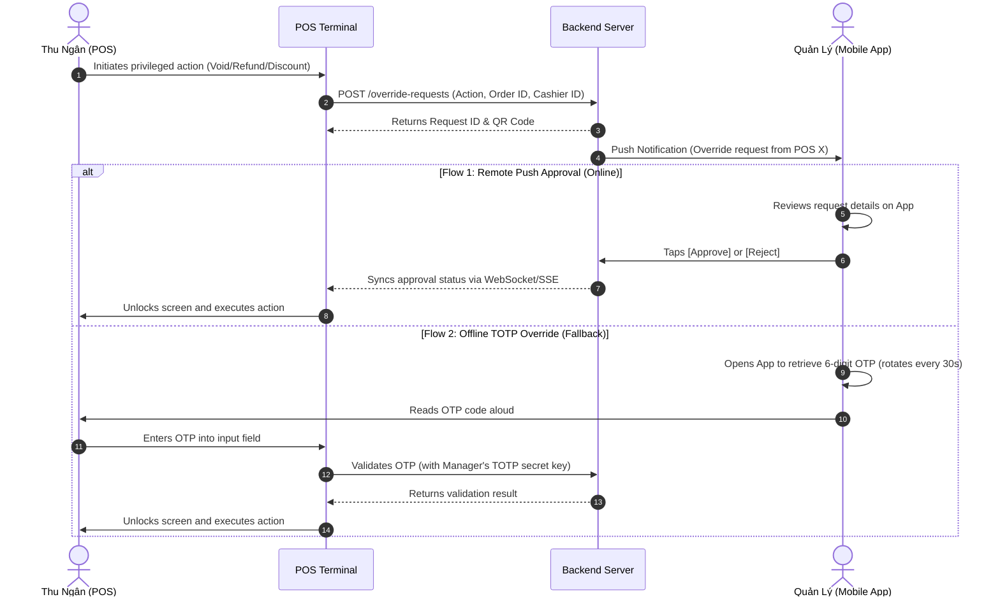

# 3.7 Order Management

This section details specifications for tracking orders, barista queue controls, stickers printing, and cancellation flows.

### Order Status State Machine

All orders follow the state transitions below:

```
[PENDING] ---(Barista: START PREP)---> [PREPARING]
             \--(Cashier cancel)------> [CANCELLED]

[PREPARING] --(Barista: READY)--------> [READY]
             \--(Manager/Admin cancel)-> [CANCELLED]
             \--(Barista: REPORT ISSUE)-> [ON_HOLD]

[ON_HOLD] ----(Barista: RESUME PREP)--> [PREPARING]
           \--(Manager/Admin cancel)---> [CANCELLED]

[READY] -----(Cashier: payment done)--> [COMPLETED]
         \--(Manager/Admin cancel)------> [CANCELLED]

[COMPLETED] → Terminal state (no further transitions)
[CANCELLED]  → Terminal state (no further transitions)
```

> **ON_HOLD state:** Triggered by the Barista via the "Report Issue" action when a preparation problem occurs (missing ingredient, equipment fault, etc.). An ON_HOLD order remains visible in the Barista queue with a highlighted warning indicator. The Store Manager or Admin must be notified. The Barista can resume preparation (→ PREPARING) once the issue is resolved, or the Manager/Admin can cancel the order.

---

## 3.7.1 F35 - View Order List / UC-54 View Local Order History

### 3.7.1.1 Screen Mock-up (Mobile Portrait)
```
+------------------------------------+
|             Order List             |
|                                    |
|  Search: [ #012                  ] |
|  Status: [ All Statuses      ][v]  |
|                                    |
|  - Order #012 (Dine-in)       30k  |
|    Status: Preparing  (09:15)      |
|                                    |
|  - Order #011 (Take-away)    120k  |
|    Status: Ready      (09:05)      |
|                                    |
|                        [ Back ]    |
+------------------------------------+
```

#### Table 3-37: Screen Definition
| # | Field Name | Type | Mandatory | Max Length | Description |
|---|---|---|---|---|---|
| 1 | Search | Text | No | 50 | Search by Order ID, sequence number, or customer name. |
| 2 | Status | Dropdown | Yes | | Filters list by order status. |
| 3 | Back | Button | | | Returns to dashboard portal. |

### 3.7.1.2 Use Case Description

| Use Case ID | UC-54 | Use Case Name | View Local Order History |
|---|---|---|---|
| **Author** | Antigravity | **Version** | 1.0 |
| **Date** | 2026-05-24 | | |

| Field | Description |
|---|---|
| **Actor** | Cashier, Store Manager, Barista |
| **Description** | Displays local branch orders processed during the current shift. |
| **Precondition** | User is logged in. |
| **Trigger** | User navigates to Order History. |
| **Post-Condition** | Displays local order list grid. |

#### Main Flows
| Step | Actor | Action |
|---|---|---|
| 1 | User | Opens Order History screen. |
| 2 | Portal | Displays current branch orders list. |

---

## 3.7.2 F36 - View Order Detail / UC-54b View Order Detail

### 3.7.2.1 Screen Mock-up (Mobile Portrait)
```
+------------------------------------+
|            Order Detail            |
|                                    |
|  Order Number: #012                |
|  ID: ORD-7890                      |
|  Type: Dine-in   Time: 09:15       |
|  Status: Preparing                 |
|                                    |
|  Items:                            |
|  - 1x Espresso (No sugar)      30k |
|                                    |
|  Total Paid: 30,000 VND (VietQR)   |
|                                    |
|       [ CANCEL ]    [ REPRINT ]    |
|                 [ BACK ]           |
+------------------------------------+
```

#### Table 3-38: Screen Definition
| # | Field Name | Type | Mandatory | Max Length | Description |
|---|---|---|---|---|---|
| 1 | Cancel | Button | | | Opens Cancel Order view screen. |
| 2 | Reprint | Button | | | Resends ticket template data to receipt printer. |
| 3 | Back | Button | | | Returns to Order List screen. |

### 3.7.2.2 Use Case Description

| Use Case ID | UC-54b | Use Case Name | View Order Detail |
|---|---|---|---|
| **Author** | Antigravity | **Version** | 1.0 |
| **Date** | 2026-05-24 | | |

| Field | Description |
|---|---|
| **Actor** | Cashier, Store Manager, Barista |
| **Description** | Displays receipt details, payments, and fulfillment tracking metrics for an order. |
| **Precondition** | Order exists. |
| **Trigger** | User taps an order row. |
| **Post-Condition** | Displays detail card. |

#### Main Flows
| Step | Actor | Action |
|---|---|---|
| 1 | User | Taps on specific order. |
| 2 | Portal | Displays details, payments log, and order item list. |

---

## 3.7.3 F37 - View Order Queue Display / UC-57 View Order Queue

### 3.7.3.1 Screen Mock-up (Mobile Landscape / Tablet)
```
+------------------------------------+
|           Barista Queue            |
|                                    |
|  - [ Preparing ] Order #012 (09:15)|
|    1x Espresso (No sugar)          |
|    [ READY ]      [ REPORT ISSUE ] |
|                                    |
|  - [ Pending ] Order #013   (09:20)|
|    1x Latte (Oat Milk)             |
|    [ START PREP ]                  |
+------------------------------------+
```

#### Table 3-39: Screen Definition
| # | Field Name | Type | Mandatory | Max Length | Description |
|---|---|---|---|---|---|
| 1 | START PREP | Button | | | Transitions order status from Pending to Preparing. |
| 2 | READY | Button | | | Transitions order status from Preparing to Ready and prints stickers. |
| 3 | REPORT ISSUE | Button | | | Puts order on Hold due to prep issue. |

### 3.7.3.2 Use Case Description

| Use Case ID | UC-57 | Use Case Name | View Order Queue Display |
|---|---|---|---|
| **Author** | Antigravity | **Version** | 1.0 |
| **Date** | 2026-05-24 | | |

| Field | Description |
|---|---|
| **Actor** | Barista |
| **Description** | Displays queue of active preparation orders sorted by oldest first. |
| **Precondition** | Barista is logged in. |
| **Trigger** | Barista accesses the queue dashboard. |
| **Post-Condition** | Queue is displayed. |

#### Main Flows
| Step | Actor | Action |
|---|---|---|
| 1 | Barista | Opens the queue display. |
| 2 | Portal | Displays pending, preparing, and ready orders. |

---

## 3.7.4 F38 - Print Drink Label Sticker / UC-59 Print Drink Label Sticker

### 3.7.4.1 Screen Mock-up (Mobile Portrait Popup)
```
+------------------------------------+
|            Print Label             |
|                                    |
|       Print Sticker for drink:     |
|       Espresso - Order #012        |
|                                    |
|         [ PRINT ]   [ CLOSE ]      |
+------------------------------------+
```

#### Table 3-40: Screen Definition
| # | Field Name | Type | Mandatory | Max Length | Description |
|---|---|---|---|---|---|
| 1 | Print | Button | | | Dispatches print job to sticker printer. |
| 2 | Close | Button | | | Closes modal window. |

### 3.7.4.2 Use Case Description

| Use Case ID | UC-59 | Use Case Name | Print Drink Label Sticker |
|---|---|---|---|
| **Author** | Antigravity | **Version** | 1.0 |
| **Date** | 2026-05-24 | | |

| Field | Description |
|---|---|
| **Actor** | Barista |
| **Description** | Prints cup stickers to identify beverage customization details. |
| **Precondition** | Order details are loaded. |
| **Trigger** | Barista clicks Print Sticker for drink item. |
| **Post-Condition** | Label is printed. |

#### Main Flows
| Step | Actor | Action |
|---|---|---|
| 1 | Barista | Taps Print Sticker. |
| 2 | Portal | Dispatches item properties (Order number, modifications, time) to printer. |

---

## 3.7.5 F39 - Cancel Order / UC-43, UC-55 Request Refund & Cancellation

### 3.7.5.1 Screen Mock-up (Mobile Portrait)
```
+------------------------------------+
|            Cancel Order            |
|                                    |
|  Reason for Cancellation           |
|  [ Out of Milk ingredient      ][v]|
|                                    |
|  Notes:                            |
|  [ Discarded order, customer refund] |
|                                    |
+------------------------------------+
|  CẦN XÁC THỰC CỦA QUẢN LÝ        |
|  (MANAGER APPROVAL REQUIRED)       |
|                                    |
|  Tác vụ: Hủy đơn hàng #HD-9082    |
|  Số tiền: 140,000 đ                |
|                                    |
|  (o) Đang gửi yêu cầu phê duyệt   |
|      từ xa... Hết hạn sau: 45s     |
|                                    |
|  Hoặc nhập OTP từ Quản lý:        |
|  [ _ _ _ _ _ _ ]                   |
|                                    |
|   [ HỦY YÊU CẦU ]  [ XÁC NHẬN ]  |
+------------------------------------+
```

#### Table 3-41: Screen Definition
| # | Field Name | Type | Mandatory | Max Length | Description |
|---|---|---|---|---|---|
| 1 | Reason | Dropdown | Yes | | Cancellation reason mapping. |
| 2 | Notes | Text | Yes | 250 | Audit explanation. |
| 3 | Remote Approval Status | Display | — | — | Shows real-time status of remote push approval request sent to Store Manager's mobile app. Includes countdown timer (default 60s). |
| 4 | OTP Code | Number Input | Conditional | 6 | 6-digit TOTP code from Manager's mobile app (used as offline fallback when remote push is unavailable). |
| 5 | Confirm | Button | | | Confirms cancellation after manager approval is received or valid OTP is entered. |
| 6 | Cancel Request | Button | | | Cancels the override request and returns to order screen. |

### 3.7.5.2 Use Case Description

| Use Case ID | UC-55 | Use Case Name | Request Transaction Refund |
|---|---|---|---|
| **Author** | Antigravity | **Version** | 1.1 |
| **Date** | 2026-06-01 | | |

| Field | Description |
|---|---|
| **Actor** | Cashier, Store Manager |
| **Description** | Voids an active order and processes payment refund. |
| **Precondition** | **For Cashier:** Order is in `PENDING` state (before kitchen queue entry). **For Store Manager / Admin:** Order is in `PENDING`, `PREPARING`, `ON_HOLD`, or `READY` state (not `COMPLETED`). |
| **Trigger** | Cashier clicks Cancel Order. |
| **Post-Condition** | Order is cancelled, stock rollbacked/marked waste, and refund completed. |

#### Main Flows
| Step | Actor | Action |
|---|---|---|
| 1 | Cashier | Taps Cancel, inputs reason, and triggers manager override request. |
| 2 | Portal | Sends push notification to Store Manager's registered mobile device and displays approval-waiting modal with countdown timer on POS. |
| 3 | Manager | Receives notification on mobile app, reviews override details (action type, order ID, amount), and taps **Approve** or **Reject**. |
| 4 | Portal | Receives approval response via WebSocket/SSE, unlocks POS screen, and executes the action. |

#### Alternative Flow: Offline TOTP Override
| Step | Actor | Action |
|---|---|---|
| 2a | Portal | If push notification cannot be delivered (offline/timeout), POS displays OTP input field as fallback. |
| 3a | Manager | Opens mobile app authenticator to retrieve 6-digit TOTP code (RFC 6238, refreshes every 30s). |
| 4a | Cashier | Enters OTP code on POS screen. Portal validates against Manager's TOTP secret key. On success, action proceeds. |

#### Business Rules
| ID | Rule Description |
|---|---|
| BR-05 | **Cashier Cancellation Limit**: Cashiers can cancel orders only while they are in the `PENDING` state (prior to kitchen queue entry). |
| BR-06 | **Manager/Admin Cancellation Limit**: Store Managers or Admins can cancel orders at any status except `COMPLETED` (including `PENDING`, `PREPARING`, `ON_HOLD`, and `READY`). |
| BR-07 | **Inventory Action on Cancellation**: Inventory is auto-replenished only if the order is cancelled in the `PENDING` state. If cancelled during `PREPARING`, `ON_HOLD`, or `READY`, stock is considered wasted and is not restored (logged as operational waste). |
| BR-08 | **Loyalty & Voucher Rollback**: Order cancellation reverses used vouchers (restoring total and customer limits) and adjusts loyalty points (gained points are deducted, and redeemed points are refunded to the customer balance). |

---

## 3.7.6 Dynamic Override & Remote Authentication System

The Dynamic Override system replaces the legacy static 4-digit Manager Override PIN with a more secure and auditable mechanism combining **Remote Push Approval** (when online) and **Time-based One-Time Password (TOTP)** (as offline fallback).

### 3.7.6.1 System Architecture

The dynamic approval system consists of three components coordinating in real-time:

1. **POS Terminal (Thiết bị Thu ngân):** When a privileged action is triggered (void order, manual discount, cash drawer kick), POS sends a request to Backend and displays an approval-waiting screen (with QR code or OTP input field).
2. **Manager Mobile App (Ứng dụng Quản lý):** The manager's device receives a push notification (Firebase/APNs) or generates a time-based OTP (TOTP) offline.
3. **Backend Server (Hệ thống Trung tâm):** Handles notification dispatch, OTP validation, approval state synchronization, and audit logging.



### 3.7.6.2 Authentication Flows

#### Flow 1: Remote Push Approval — Recommended when Internet is available
1. Cashier presses the button to trigger a privileged action on the POS.
2. POS locks the checkout screen, displays status `"Waiting for remote manager approval... (60s)"` with a QR code.
3. Backend dispatches a Firebase/APNs push notification to the Store Manager's registered mobile device.
4. Manager taps the notification, reviews action details (e.g., *Void Order #1024 — Trà đào cam sả — 140,000 VND*).
5. Manager taps **Approve**. The app sends a digitally signed confirmation to the server.
6. Server records the approval, pushes the status update via WebSocket/SSE to the POS.
7. POS unlocks the screen, executes the voided order and prints the cancellation receipt.

#### Flow 2: Offline TOTP Override — Fallback when network is unavailable
1. POS displays the approval-waiting screen with a 6-digit OTP input field.
2. Manager opens the management app on their phone (pre-configured with a Secret Key during onboarding).
3. The app generates a 6-digit code that rotates every 30 seconds (RFC 6238 TOTP algorithm).
4. Manager reads the OTP code to the Cashier for manual entry on the POS.
5. The POS (or server if online) validates the OTP against the Manager's stored TOTP secret and current time window. If valid, the action proceeds immediately.

### 3.7.6.3 Database Schema Update

To accurately audit override actions and support financial reconciliation, the database adds a `pos_override_log` table linked to existing entities:

```sql
-- Override audit log table
CREATE TABLE pos_override_log (
    id UUID PRIMARY KEY DEFAULT gen_random_uuid(),
    branch_id UUID NOT NULL REFERENCES branches(id),
    pos_session_id UUID NOT NULL,             -- Active POS shift session
    cashier_id UUID NOT NULL REFERENCES users(id),  -- Requesting cashier
    approver_id UUID REFERENCES users(id),    -- Approving manager (if remote)
    action_type VARCHAR(50) NOT NULL,         -- 'VOID_ORDER', 'VOID_ITEM', 'MANUAL_DISCOUNT', 'DRAWER_KICK', 'REFUND'
    action_details JSONB NOT NULL,            -- Details (order ID, voided items, discount amount)
    status VARCHAR(20) NOT NULL,              -- 'PENDING', 'APPROVED', 'REJECTED', 'EXPIRED'
    auth_method VARCHAR(20) NOT NULL,         -- 'REMOTE_APP', 'LOCAL_TOTP'
    otp_used VARCHAR(6),                      -- OTP code used (if TOTP method)
    created_at TIMESTAMP WITH TIME ZONE DEFAULT CURRENT_TIMESTAMP,
    resolved_at TIMESTAMP WITH TIME ZONE
);

-- Performance indexes for reporting queries
CREATE INDEX idx_override_logs_branch ON pos_override_log(branch_id);
CREATE INDEX idx_override_logs_created_at ON pos_override_log(created_at);
```

### 3.7.6.4 Use Cases

#### UC-67: Request POS Privilege Override
* **Actor:** Cashier
* **Precondition:** A cart or paid order requires adjustment (void, discount exceeding threshold).
* **Main Flow:**
  1. Cashier triggers a privileged action on POS.
  2. POS validates the Cashier's role and confirms Manager authorization is required.
  3. POS locks the transaction, creates an override request, and sends it to Backend.
  4. POS displays the approval-waiting modal with countdown timer and OTP fallback input.

#### UC-68: Approve Privilege Override (Remote / Local)
* **Actor:** Store Manager
* **Precondition:** Receives override request notification or is called to the counter by Cashier.
* **Main Flow (Remote Push):**
  1. Manager views the notification on mobile app.
  2. Manager reviews action details (action type, order ID, amount, reason).
  3. Manager taps **Approve** on the app.
  4. POS receives the approval signal, unlocks the screen, and completes the action.
* **Main Flow (Offline TOTP):**
  1. Manager opens the app to retrieve the current 6-digit TOTP code.
  2. Manager or Cashier enters the OTP code into the POS input field.
  3. POS validates the code and executes the action upon success.

### 3.7.6.5 Business Rules

| ID | Rule Description |
|---|---|
| BR-51 | **Dynamic Override Authentication**: Privileged POS actions (void, refund, manual discount, cash drawer kick) require Store Manager authorization via either (a) Remote Push Approval through the Manager's registered mobile device, or (b) a 6-digit TOTP code generated by the Manager's app (RFC 6238, 30-second rotation). The override request expires after 60 seconds if no response is received. Failed OTP validation is limited to 3 consecutive attempts before a 5-minute lockout. All override actions are logged in `pos_override_log` for audit purposes. |

