# SOFTWARE REQUIREMENT SPECIFICATION
## Coffee Shop Management System

---

# I. Record of Changes

This section tracks the revision history and modifications made to the Software Requirements Specification (SRS) document.

| Version | Date | Description of Change | Author | Reviewer / Approved By |
|---|---|---|---|---|
| **1.0** | 2026-05-23 | Initial drafting of the SRS including product scope, actors, use case flows, functional features (Sections 3.2 - 3.13), and non-functional specifications. | Software Engineering Team | Store Management / Product Owner |
| **1.1** | 2026-05-23 | Revised SRS according to srs_business_review.md. Synchronized currency to VND, resolved rules conflicts, detailised delivery, refund, offline mode, and multi-branch specs. | Software Engineering Team | Store Management / Product Owner |
| **1.2** | 2026-05-24 | Fixed 8 technical issues: standardized branch capacity to 5, renamed duplicate UC-31b to UC-61, added missing schema fields, documented offline voucher and order overflow edge cases, added notification fallback to BR-04, and added i18n notes to messages list. | Software Engineering Team | Store Management / Product Owner |
| **1.3** | 2026-05-24 | Resolved 15 schema, visual, and logic defects (N-01 to N-10, X-01 to X-10): added Section 3.6.6 Stacking Rules, defined tier point thresholds, added inclusive VAT to F33 mockup, resolved orphan UC-14, added stores, staff schedules, and attendances database tables, fixed manager_id nullability, and added Section 5.4 Feature-Actor Mapping Matrix. | Software Engineering Team | Store Management / Product Owner |
| **1.4** | 2026-05-24 | Resolved comprehensive review v1.3 issues: defined UC-49 Redeem Loyalty Points, fixed UTF-8 encoding in product scope, matched Login failure alert with MSG02, expanded messages dictionary (MSG09-MSG13), specified tier downgrades (BR-34) and 12-month inactivity point expiry (BR-35), detailed delivery order rejection flow (BR-42), and added new alternative flows for negative audit input and close shift disputes. | Software Engineering Team | Store Management / Product Owner |
| **1.5** | 2026-05-24 | Resolved comprehensive review v1.4 issues: added full Section 3.6.5 F31.1 for UC-49 (containing mock-up, field definition, and alternate flows), updated the Table of Contents, fully synchronized BR-42 in Section 5.1, and standardized MSG12 to pure English dictionary key text. | Software Engineering Team | Store Management / Product Owner |
| **1.6** | 2026-05-24 | Addressed final review feedback: mapped Redeem Loyalty Points Modal (37a) in functional overview and authorization matrix, assigned MSG14 for invalid loyalty redemption multiples, and updated POS transactions flow AT3. | Software Engineering Team | Store Management / Product Owner |
| **1.7** | 2026-06-02 | Added Branch Management functionality (Section 3.13.3): UC-63 View Branch List, UC-64 Add Branch, UC-65 Update/Deactivate Branch. Added 3 new screens (45-47) to Admin Portal flow, updated screen authorization matrix, Feature-Actor Mapping Matrix, and added business rules BR-54, BR-55, BR-56. Added application messages MSG15, MSG16. | Software Engineering Team | Store Management / Product Owner |
| **1.8** | 2026-06-03 | Simplified cancellation to PENDING only (no manager PIN), popup-based 4-digit PIN + camera snapshot attendance, team-based barista KPI, branch menu status table, dynamic branch limit (MAX_ACTIVE_BRANCHES), bulk stock import invoice grid, custom loyalty cap fields, and removed all ShopeeFood/Grab integrations. | Software Engineering Team | Store Management / Product Owner |
| **1.8.1** | 2026-06-03 | Patched discrepancies in v1.8: aligned BR-07/BR-09 with BR-05 (restricting cancellation/refund to PENDING only), added missing use cases (UC-68 to UC-72, UC-61, UC-73) to diagrams, resolved loyalty point config conflict and restored MSG14, authorized Barista for Order Detail screen, and fixed screen numbering gaps. | Software Engineering Team | Store Management / Product Owner |
| **1.8.2** | 2026-06-03 | Integrated Central Loyalty configurations (Accrual rate, Redeem value, Max redeem %, Max discount limit) under Admin system settings. Completely removed customer membership tiers (Bronze/Silver/Gold/Diamond) and their automatic discounts. Simplified checkout stacking and discount priority rules. | Software Engineering Team | Store Management / Product Owner |
| **1.9** | 2026-06-09 | Migrated from the legacy 4-role model to a 6-role RBAC model: the HQ "Admin" umbrella was split into `ceoviewer` (read-only reports), `businessadmin` (menu/recipe/voucher/CRM), and `ssadmin` (users/config/branches). Updated actors, use-case diagrams (§2.2.2–2.2.4), Screen Authorization matrix (§3.1, 6 columns), USER role enum, and Feature-Actor Mapping (§5.4). | Software Engineering Team | Store Management / Product Owner |
| **1.10** | 2026-06-11 | Added UC-74 Manage Raw Material Master (§3.5.0): a chain-wide raw-material master catalog owned by `businessadmin`, source for recipe formulations and branch Import/Export dropdowns. Added screen 50, BR-63/BR-64, the `RAW_MATERIAL` entity to the ERD (with `STOCK_ITEM` and `RECIPE_ITEM` re-pointed to the master), and §2.3 / §2.2.3 use-case entries. | Software Engineering Team | Store Management / Product Owner |
| **1.11** | 2026-06-13 | CEO-review resolutions. **P0 consistency:** finished the 6-role migration in §3.2 (use-case bodies were still 4-role), fixed BR-54 / hardcoded "5" in §3.13, unified inventory-deduction timing to `PREPARING` (UC-62/BR-07), and cleaned stale "central warehouse"/membership-tier wording in the architecture doc. **New capabilities:** (1) UC-75 Store-Manager Refund/Comp for post-`PENDING` complaints + BR-67 + `ORDER_REFUND` entity; (2) topping recipes that deduct stock (BR-65, UC-62 + §3.3.6); (3) standard-cost COGS via `RAW_MATERIAL.standard_cost` (BR-66) + UC-76 COGS/Margin & Shrinkage report; (4) mandatory audit-log of price/voucher changes (BR-68) + UC-77 Change-History report. Screens 51–53 added to §3.1; UC-75/76/77 added to §2.3. | Software Engineering Team | Store Management / Product Owner |
| **1.12** | 2026-06-14 | Cleared the 6 CEO-review **P0** backlog items (`srs_review_findings.md`). **RV-C02/C03:** rebuilt the `attendance_logs` schema — replaced the broken `lateness_minutes` GENERATED column (referenced a non-existent `scheduled_start`) with a real `scheduled_start` column snapshotted at check-in; lateness is now derived at the reporting layer in **branch-local** time, fixing the ±7h UTC error (BR-38/BR-39). **RV-F01/F02:** defined the loyalty accrual base "Net Total Payable" (VAT-inclusive, after voucher & point redemption) as **BR-69** and the fixed Voucher→Points→VAT→accrual stacking order as **BR-70** (§3.6.6.3). **RV-C01:** added PDPA / Decree 13/2023 compliance — customer-consent capture at UC-25 (`consent_at`/`consent_version`, BR-71), 24-month PII retention + on-request erasure and 90-day attendance-photo purge (BR-72), and §4.2.6.1 Personal Data Protection. **RV-O17:** recipe lines must use the raw material's exact master unit — no kg↔g conversion, rejected at save (BR-73, UC-18 AT2). | Software Engineering Team | Store Management / Product Owner |
| **1.16** | 2026-06-15 | **Consistency pass** (pre-merge QA, no spec changes): fixed a duplicate business-rule ID — the §3.13 "Loyalty Config Parameters" rule was mis-numbered `BR-57` (which canonically denotes Employee ID Auto-Allocation) and is renumbered **BR-94** (added to §5.1); fixed a duplicate subsection heading — the pre-existing "Cashier Shift Sessions & Multi-Store Attendance Tracking" was renumbered **§3.7.8** (its children 3.7.8.1/3.7.8.2) so it no longer collides with the new §3.7.7 "Fulfilment Resilience & Queue Lifecycle"; and refreshed the Table of Contents to list the §3.2.14/15, §3.7.5a–3.7.8, §3.9.6, and §3.12.4–3.12.9 subsections added in v1.10–v1.15. | Software Engineering Team | Store Management / Product Owner |
| **1.15** | 2026-06-14 | Cleared the **remaining P1** backlog (operations/inventory + compliance/people/NFR) — **all P0 and P1 findings are now resolved**. **VietQR/payment (RV-O01/O02/O06):** UC-51 auto-confirm on callback, RETRY-QR idempotency (one settlement per `order_id`), and late-callback reconciliation (auto-flag refund, no order revival) — BR-84/BR-85, UC-51 AT2/AT3. **Offline (RV-O05/C19):** cash-only degraded mode (no offline card auth) with client-UUID identifiers, append-only sync, conflict surfacing, and `MAX_OFFLINE_HOURS` — BR-86, UC-51 AT4, §4.2.2 rewritten. **Order lifecycle (RV-O03/O04):** new terminal `ABANDONED` state + `READY_ABANDON_TIMEOUT` auto-expiry + SM force-close at shift close (BR-88); KDS/printer offline fallback (BR-87, §3.7.7). **Inventory (RV-O16):** negative-stock / `phantom_usage` ledger instead of clamping to 0 (BR-89, UC-62 AT1). **Staff (RV-C04/C05/C06/C07/C08):** cross-branch assignment by home SM + audit + BR-59 host-visibility exception (BR-90, UC-36 AT3); consolidated the duplicate BR-38; absence/OT/early-leave derivation (BR-91); labour-budget & max-hours/rest scheduling validation (BR-92, UC-36 AT2); attendance PIN uniqueness + mandatory photo (BR-93). **NFR (RV-C16/C17):** capacity expressed per-branch × `MAX_ACTIVE_BRANCHES`; 99.9% uptime measured excluding the scheduled maintenance window (§4.2.2/§4.2.3/§4.2.5). New BRs **BR-84…BR-93**. | Software Engineering Team | Store Management / Product Owner |
| **1.14** | 2026-06-14 | Cleared the **RV-S (fraud & security) P1** backlog cluster, applying the project's "audit-log instead of maker-checker" philosophy consistently. **RV-S05:** mandatory **MFA for HQ roles** (`ceoviewer`/`businessadmin`/`ssadmin`) via email OTP (reusing UC-03/04) or TOTP, parameter `HQ_MFA_REQUIRED` (default on); POS/branch roles exempt — added UC-01 AT4, §3.2.14 MFA Challenge (screen 58), **BR-83**. **RV-S04:** **BR-82** — first `ssadmin` seeded at install (no in-app bootstrap), self-escalation blocked (own role/status change requires a different ssadmin); added UC-12/14 AT3. **RV-S03:** **BR-81** + **UC-83** User Account Change & Access Review report (CEO Viewer, §3.2.15, screen 60) — audits every account create/role-change/deactivate as the SoD compensating control. **RV-S02:** **BR-80** — every checkout voucher application & point redemption written to immutable `AUDIT_LOG` (§3.6.6.3). **RV-S01:** **UC-82** Cashier Void/Refund Anomaly report (Store Manager + CEO Viewer, §3.12.9, screen 59) + **BR-79** flagging cancel/refund outliers against `CANCEL_REFUND_ALERT_THRESHOLD`; PENDING cancel stays no-PIN (BR-05) and refunds stay SM-authorised (BR-67). Added screens 58–60 to §3.1, UC-82/83 to §2.3, two matrix rows to §5.4, and two security params to §3.13. | Software Engineering Team | Store Management / Product Owner |
| **1.13** | 2026-06-14 | Cleared the **RV-F (financial/reporting) P1** backlog cluster. **RV-F03:** standardised the point-to-cash parameter to `LOYALTY_REDEMPTION_VALUE_PER_POINT` (default 100 VND/point), redemption in multiples of 100, floor-to-VND rounding (**BR-74**; §3.6.5/§3.6.6.3/§3.13). **RV-F04:** confirmed voucher + point stacking (≤1 voucher, points after voucher, combined cap = Gross Subtotal) via cross-reference to BR-70/BR-50 (§3.6.6.3). **RV-F05:** added **UC-78** Loyalty Liability & Movement report (CEO Viewer) reporting outstanding points + issued/redeemed/expired movement in points (**BR-75**, §3.12.6). **RV-F06:** added **UC-79** Labour Hours vs Revenue report (CEO Viewer + Store Manager) — a non-monetary staffing-efficiency KPI that stores no wage data, keeping payroll external per §1.2 (**BR-76**, §3.12.7). **RV-F07:** added **UC-80** Worked-Hours Export (Store Manager, own branch) — paired CHECK_IN/CHECK_OUT hours with missing-checkout flagging, feeding external payroll (**BR-77**, §3.9.6). **RV-F08:** added **UC-81** Daily Z-Report (Store Manager) consolidating all of a day's shifts into one branch statement (**BR-78**, §3.12.8). Added screens 54–57 to §3.1, UC-78/79/80/81 to §2.3, four matrix rows to §5.4. | Software Engineering Team | Store Management / Product Owner |
| **1.17** | 2026-06-16 | Cleaned up non-screen standalone sections across the SRS. Removed Section 3.3.7 (Two-Level Availability Model) and relocated its logic to §3.3 overview. Converted Section 3.6.7 (Discount Priority & Stacking) to subsection §3.6.6.3. Relocated KDS KPI (BR-61) and offline fallback (BR-87) to KDS Queue (§3.7.3), ready auto-abandon (BR-88) to Order History (§3.7.1), cancellation/refund data requirements to UC-55/UC-75, and user session separation rule to UC-44. Relocated BR-62 to UC-70. | Software Engineering Team | Store Management / Product Owner |


# Table of Contents

1. [Product Overview](#1-product-overview)
   - 1.1 Product Purpose & Objectives
   - 1.2 Product Scope
   - 1.3 System Context Diagram

2. [User Requirements](#2-user-requirements)
   - 2.1 Actors
   - 2.2 Use Cases
     - 2.2.1 General User & Authentication Use Cases
     - 2.2.2 CEO / Executive Viewer Use Cases
     - 2.2.3 Business Admin Use Cases
     - 2.2.4 System Admin Use Cases
     - 2.2.5 Store Manager Use Cases
     - 2.2.6 Cashier Use Cases
     - 2.2.7 Barista Use Cases

3. [Software Features](#31-functional-overview)

   - **3.1 Functional Overview**
     - 3.1.1 Screens Flow
     - 3.1.2 Screen Descriptions
     - 3.1.3 Screen Authorization
     - 3.1.4 Non-Screen Functions
     - 3.1.5 Entity Relationship Diagram
     - 3.1.6 Entity Details

   - **3.2 System Access & Security**
     - 3.2.1 Login
     - 3.2.2 Logout
     - 3.2.3 Change Password
     - 3.2.4 Forgot Password
     - 3.2.5 Verify OTP
     - 3.2.6 Set New Password
     - 3.2.7 Force Password Change
     - 3.2.8 View Profile
     - 3.2.9 Update Profile
     - 3.2.10 List User Account
     - 3.2.11 View User Details & History
     - 3.2.12 Add User Account
     - 3.2.13 Update/Deactivate User Account
     - 3.2.14 HQ Multi-Factor Authentication Challenge
     - 3.2.15 User Account Change & Access Review Report (UC-83)

   - **3.3 Menu Management**
     - 3.3.1 View Menu Item List
     - 3.3.2 View Menu Item Detail
     - 3.3.3 Add Menu Item
     - 3.3.4 Update Menu Item
     - 3.3.5 Delete Menu Item
     - 3.3.6 Manage Toppings & Options

   - **3.4 Category Management**
     - 3.4.1 View Category List
     - 3.4.2 Add Category
     - 3.4.3 Update Category
     - 3.4.4 Delete Category

   - **3.5 Inventory & Stock Management**
     - 3.5.0 Manage Raw Material Master (Chain-wide)
     - 3.5.1 View Stock List
     - 3.5.2 Import Stock (Nhập kho)
     - 3.5.3 Export Stock (Xuất kho)
     - 3.5.4 View Import/Export History
     - 3.5.5 Perform Inventory Audit (Kiểm kho)
     - 3.5.6 Auto-Deduct Stock on Prep Start (incl. Low Stock Alert)

    - **3.6 POS Transaction**
      - 3.6.1 Open Shift
      - 3.6.2 POS Checkout Grid
      - 3.6.3 Lookup Customer Membership
      - 3.6.4 Apply Voucher (Discount Code)
      - 3.6.5 Redeem Loyalty Points
      - 3.6.6 Process Payment
        - 3.6.6.3 Discount Priority & Stacking Rules
      - 3.6.8 Issue Invoice
      - 3.6.9 Close Shift

   - **3.7 Order Management**
     - 3.7.1 View Order List
     - 3.7.2 View Order Detail
     - 3.7.3 View Order Queue Display
     - 3.7.4 Print Drink Label (Sticker)
     - 3.7.5 Cancel Order
     - 3.7.5a Refund / Comp After Preparation (UC-75)
     - 3.7.6 Void & Cancellation Audit Logging
     - 3.7.7 Fulfilment Resilience & Queue Lifecycle
     - 3.7.8 Cashier Shift Sessions & Multi-Store Attendance Tracking

   - **3.8 Customer & Membership Management**
     - 3.8.1 List Customer
     - 3.8.2 Add Customer
     - 3.8.3 Update Customer
     - 3.8.4 View Customer History

   - **3.9 Staff Management**
     - 3.9.1 Create Staff Schedule / Shift
     - 3.9.2 View Staff Schedule
     - 3.9.3 Update/Delete Staff Schedule
     - 3.9.4 View Staff Attendance Report
     - 3.9.5 View Branch Staff List
     - 3.9.6 Export Worked-Hours Report (UC-80)

   - **3.10 Promotion & Campaign Management**
     - 3.10.1 List Voucher / Promotion
     - 3.10.2 Add Voucher / Promotion
     - 3.10.3 Update/Delete Voucher / Promotion

   - **3.12 Dashboard & Reporting**
     - 3.12.1 HQ Revenue Dashboard
     - 3.12.2 Export Report
     - 3.12.3 Store Revenue Reports
     - 3.12.4 COGS / Margin & Ingredient Shrinkage Report (UC-76)
     - 3.12.5 Price & Voucher Change History (UC-77)
     - 3.12.6 Loyalty Liability & Movement Report (UC-78)
     - 3.12.7 Labour Hours vs Revenue Report (UC-79)
     - 3.12.8 Daily Z-Report (UC-81)
     - 3.12.9 Cashier Void/Refund Anomaly Report (UC-82)

   - **3.13 System Configuration**
     - 3.13.1 Central System Settings
     - 3.13.2 Branch Local Settings
     - 3.13.3 Branch Management (Add / Edit / Deactivate Branch)

4. [Non-Functional Requirements](#4-non-functional-requirements)
   - 4.1 External Interfaces
     - 4.1.1 User Interfaces
     - 4.1.2 Hardware Interfaces
     - 4.1.3 Software & API Interfaces
   - 4.2 Quality Attributes
     - 4.2.1 Usability
     - 4.2.2 Reliability
     - 4.2.3 Performance
     - 4.2.4 Security & Compliance
     - 4.2.5 Scalability
     - 4.2.6 Data Retention & Archival
     - 4.2.7 Backup & Disaster Recovery
     - 4.2.8 Browser & Device Support

5. [Requirement Appendix & Mapping](#5-requirement-appendix--mapping)
   - 5.1 Business Rules
   - 5.2 Common Requirements
     - 5.2.1 Audit Logging
     - 5.2.2 Datetime Formatting
   - 5.3 Application Messages List
   - 5.4 Feature-Actor Mapping Matrix


---

# 1. Product Overview

The Coffee Shop Management System is an integrated software solution designed to streamline the operations of a modern coffee shop. This section details the objectives, scope, and system context of the product.

## 1.1 Product Purpose & Objectives
The primary purpose of the Coffee Shop Management System is to automate, coordinate, and optimize daily coffee shop operations. The system aims to achieve the following key objectives:
- **Operational Efficiency**: Accelerate order taking, processing, and checkout workflows at the Point of Sale (POS).
- **Inventory Control**: Real-time tracking of ingredients, automated low-stock alerts, and structured audit procedures to minimize wastage and stockouts.
- **Role-based Access & Security**: Establish clear operational boundaries and authorization levels for HQ roles (executive viewer, business admin, system admin), store managers, cashiers, and baristas.
- **Data-Driven Insights**: Deliver comprehensive financial, inventory, and staff performance reports to enable management to make informed business decisions.

## 1.2 Product Scope
The system will manage the following core domains:
- **Authentication & Security**: Multi-role login, profile updates, and secure account creation/management.
- **Catalog & Promotion**: Dynamic category and menu creation, pricing adjustments, options/toppings management, and voucher configurations.
- **Inventory Audit & Logistics**: Standardized stock import (nhập kho), stock export (xuất kho), low-stock monitoring, and audit logs.
- **POS & Order Transactions**: Efficient shift management, barcode/text menu search, order line assembly, automatic discount calculations, tax/invoice generation, and order queues.
- **Human Resources**: Barista and cashier schedule creation, viewable shift schedules, and staff attendance reports.
- **Customer CRM**: Member point accumulation, lookup, and historical purchase data.
- **Reporting**: Monthly store revenue charts, consolidated business reports, and export options.

### Out of Scope
The system will *not* support:
- **Real-time Order Processing & Delivery Integration**: Direct handling of online order lifecycles, courier dispatching, or kitchen sync with third-party delivery apps.
- **Payroll Calculation & Payouts**: The system will track staff schedules and attendance reports, but financial payroll calculations and payroll payouts are handled by external accounting systems.

---

## 1.3 System Context Diagram
The system context diagram below illustrates the external entities interacting with the Coffee Shop Management System and the primary data flows between them.

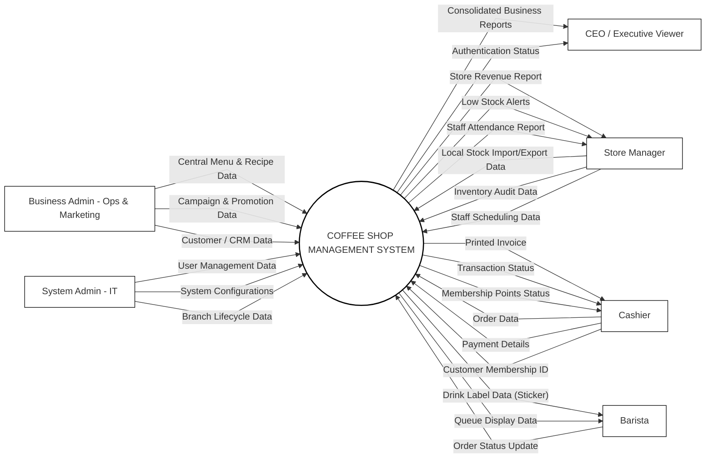


---

# 2. User Requirements

This section defines the system actors and maps their operational use cases within the Coffee Shop Management System. The use cases are partitioned into separate, clear diagrams per role to prevent overlapping paths and ensure clean software design boundaries.

---

## 2.1 Actors
The system defines the following roles (actors), structured under a generalization hierarchy where all roles inherit basic account privileges from a base `User` actor:

1. **User (Base Actor)**:
   - The generalization of all employee roles. Contains basic access control, profile viewing, and password management.
2. **CEO / Executive Viewer (`ceoviewer`)**:
   - Inherits from `User`. HQ role with **read-only** access to the HQ Dashboard and consolidated chain-wide business reports. Cannot create, edit, or delete any operational data.
3. **Business Admin (`businessadmin`)**:
   - Inherits from `User`. HQ Ops & Marketing role managing chain-wide master data: menu items, recipes, categories, vouchers, and customer/CRM records.
4. **System Admin (`ssadmin`)**:
   - Inherits from `User`. HQ IT role managing user account provisioning, central system configuration (VietQR/OTP, `MAX_ACTIVE_BRANCHES`), and the branch lifecycle.
5. **Store Manager (`storemanager`)**:
   - Inherits from `User`. Manages local inventory logistics, shift scheduling, and views local store revenue audits.
6. **Cashier (`cashier`)**:
   - Inherits from `User`. Operates the POS terminal for order-taking, member lookups, checkout, and receipt printing.
7. **Barista (`barista`)**:
   - Inherits from `User`. Coordinates drink preparation using the queue monitor and prints label stickers.


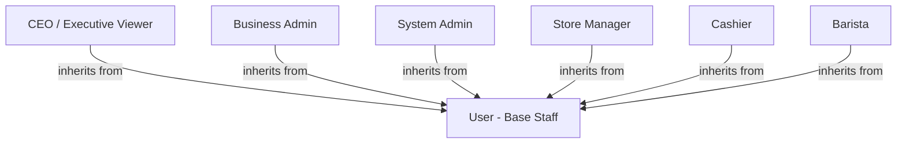

---

## 2.2 Use Cases

### 2.2.1 General User & Authentication Use Cases
This diagram defines common access operations available to any authenticated employee.


---

### 2.2.2 CEO / Executive Viewer Use Cases
The CEO / Executive Viewer (`ceoviewer`) has read-only access to consolidated chain-wide reports for management review. No data mutation is permitted.

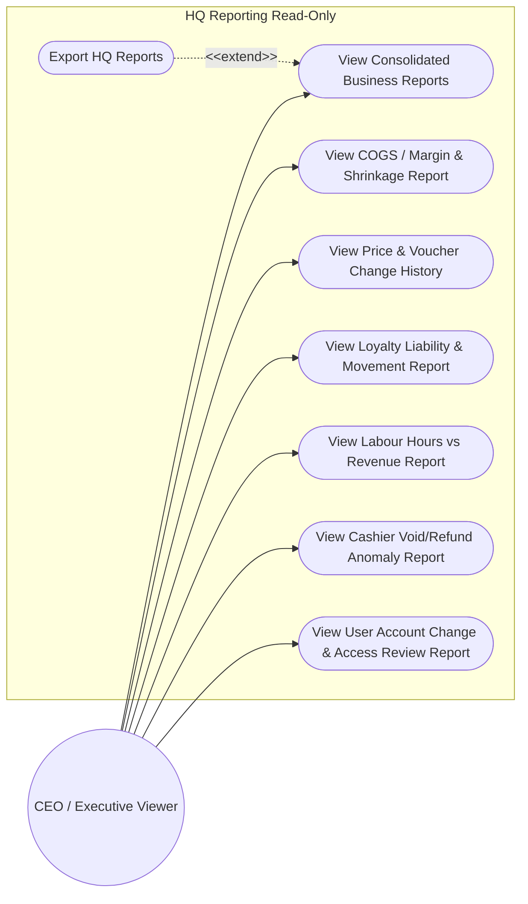

---

### 2.2.3 Business Admin Use Cases
The Business Admin (`businessadmin`) manages chain-wide catalog assets (menu, categories, recipes, toppings), promotional vouchers, and customer/CRM records.

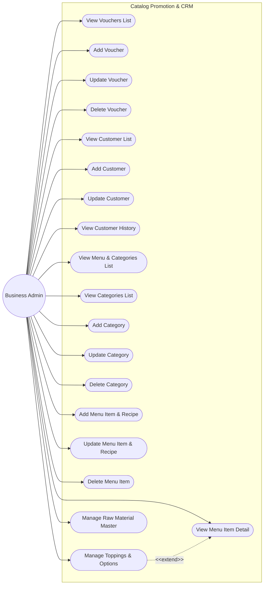

---

### 2.2.4 System Admin Use Cases
The System Admin (`ssadmin`) provisions user accounts, configures central system settings, and manages the branch lifecycle.

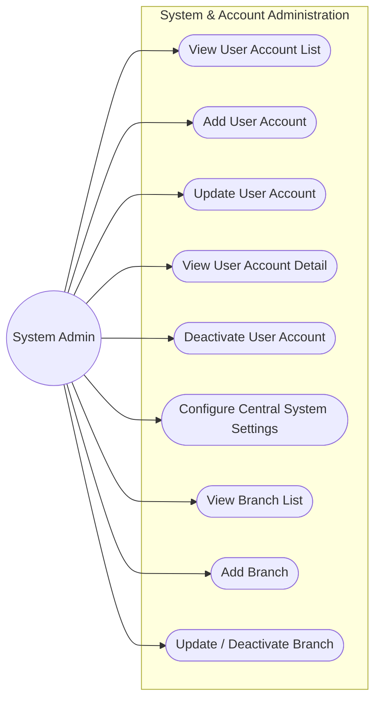


---

### 2.2.5 Store Manager Use Cases
The Store Manager oversees local inventory adjustments, scheduling staff shifts, and local store financial reports.

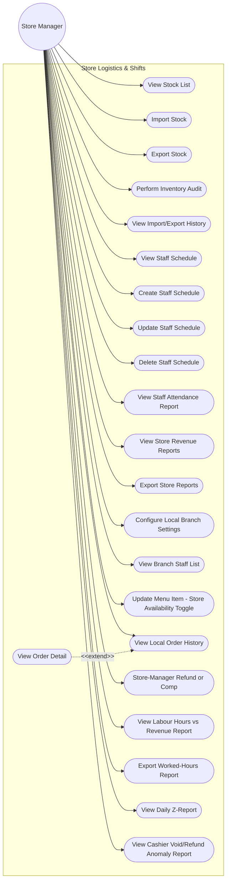


---

### 2.2.6 Cashier Use Cases
The Cashier uses the POS terminal to process orders, apply vouchers, lookup customer memberships, register/update customers, and print receipts.

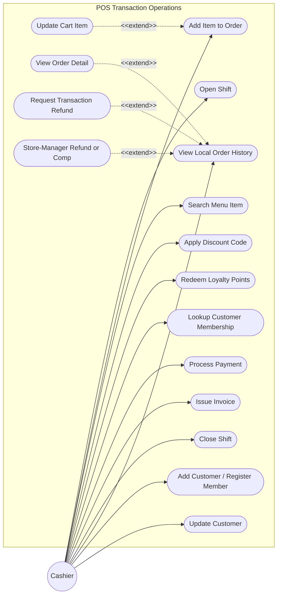


---

### 2.2.7 Barista Use Cases
The Barista tracks drink prep status, prints cup labels, and escalates preparation issues in the beverage preparation area.

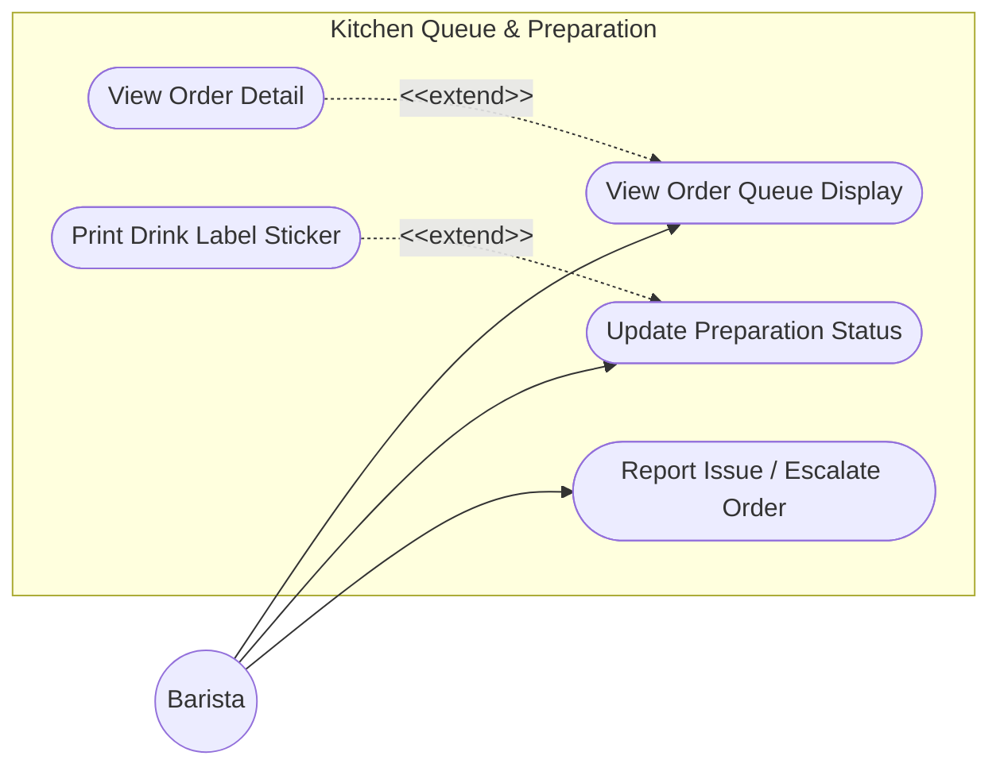

---

## 2.3 Use Case Descriptions
This part describes the use cases & their main flow (the list of the user actions and corresponding system responses that will take place during execution of the use case under normal, expected conditions), using the table format below.

| ID | Group function | Use Case | Actors | Use Case Description & Main Flow |
|---|---|---|---|---|
| **UC-01** | Authentication & Profile | Login | User (Base Staff) | **Description**: Authenticates employee entry to the application.<br>**Main Flow**:<br>1. User enters username and password.<br>2. User accesses the system and is directed to their operational portal. |
| **UC-02** | Authentication & Profile | Logout | User (Base Staff) | **Description**: Terminates active session.<br>**Main Flow**:<br>1. User signs out of the application.<br>2. User is redirected back to the login gateway. |
| **UC-03** | Authentication & Profile | Forgot Password | User (Base Staff) | **Description**: Requests password recovery details.<br>**Main Flow**:<br>1. User submits their email address.<br>2. User receives a verification code via email. |
| **UC-04** | Authentication & Profile | Verify OTP | User (Base Staff) | **Description**: Validates the recovery code.<br>**Main Flow**:<br>1. User submits the verification code.<br>2. User is permitted to configure a new password. |
| **UC-05** | Authentication & Profile | Set New Password | User (Base Staff) | **Description**: Creates a new secure password.<br>**Main Flow**:<br>1. User submits the new password.<br>2. User is returned to the login page to sign in again. |
| **UC-06** | Authentication & Profile | Force Password Change | User (Base Staff) | **Description**: Mandates password update upon first sign-in.<br>**Main Flow**:<br>1. User signs in with initial temporary credentials.<br>2. User is immediately prompted to replace the temporary password with a personal one before performing work. |
| **UC-07** | Authentication & Profile | View Profile | User (Base Staff) | **Description**: Accesses employee details.<br>**Main Flow**:<br>1. User opens their profile details.<br>2. User views their contact details, assigned branch, and operational role. |
| **UC-08** | Authentication & Profile | Update Profile | User (Base Staff) | **Description**: Edits employee contact information.<br>**Main Flow**:<br>1. User updates contact details (e.g., phone or email) and saves.<br>2. The profile displays the updated information. |
| **UC-09** | Authentication & Profile | Change Password | User (Base Staff) | **Description**: Modifies active password.<br>**Main Flow**:<br>1. User enters current password and a new secure password.<br>2. User receives a password change confirmation. |
| **UC-10** | User Management | View User Account List | System Admin | **Description**: Lists employee user accounts.<br>**Main Flow**:<br>1. System Admin opens the employee list.<br>2. System Admin views active, suspended, and role-categorized profiles. |
| **UC-11** | User Management | Add User Account | System Admin | **Description**: Registers a new employee profile.<br>**Main Flow**:<br>1. System Admin submits new employee info, role, and branch assignment.<br>2. A new staff profile is created, enabling them to log in. |
| **UC-12** | User Management | Update User Account | System Admin | **Description**: Modifies employee details.<br>**Main Flow**:<br>1. System Admin edits employee details and saves.<br>2. The employee profile is updated. |
| **UC-13** | User Management | View User Account Detail | System Admin | **Description**: Audits employee history.<br>**Main Flow**:<br>1. System Admin selects a user profile.<br>2. System Admin reviews profile metadata and activity records. |
| **UC-14** | User Management | Deactivate User Account | System Admin | **Description**: Revokes employee system access.<br>**Main Flow**:<br>1. System Admin suspends employee profile.<br>2. Active access is revoked, preventing further login. |
| **UC-15** | Menu & Categories | View Menu & Categories List | Business Admin | **Description**: Reviews catalog items.<br>**Main Flow**:<br>1. Business Admin opens the product catalog.<br>2. Business Admin reviews categories, active dishes/beverages, and prices. |
| **UC-68** | Menu & Categories | View Menu Item Detail | Business Admin | **Description**: Displays the detailed card of a specific menu item, including its ingredients recipe and options.<br>**Main Flow**:<br>1. Business Admin selects an item from the menu grid.<br>2. Portal displays detailed properties: pricing, description, abbreviation, custom toppings list, and recipe mappings. |
| **UC-69** | Menu & Categories | View Categories List | Business Admin | **Description**: Displays all product categories.<br>**Main Flow**:<br>1. Business Admin opens Category Management.<br>2. Portal displays current categories and associated item count metrics. |
| **UC-16** | Menu & Categories | Add Category | Business Admin | **Description**: Creates a new product category.<br>**Main Flow**:<br>1. Business Admin inputs category details and saves.<br>2. New category is added to the menu configuration. |
| **UC-17** | Menu & Categories | Update Category | Business Admin | **Description**: Modifies category settings.<br>**Main Flow**:<br>1. Business Admin updates category details or visibility.<br>2. The category parameters are updated. |
| **UC-70** | Menu & Categories | Delete Category | Business Admin | **Description**: Deactivates/deletes an empty category.<br>**Main Flow**:<br>1. Business Admin clicks delete on a row.<br>2. Portal displays Delete Category Confirmation modal.<br>3. Business Admin clicks "Confirm Delete".<br>4. Portal deletes category and returns to list view. |
| **UC-18** | Menu & Categories | Add Menu Item & Recipe | Business Admin | **Description**: Creates a new product and links its raw recipe.<br>**Main Flow**:<br>1. Business Admin inputs name, price, barcode, and raw ingredient list.<br>2. The product and recipe are registered, making them available for checkout. |
| **UC-71** | Menu & Categories | Manage Toppings & Options | Business Admin | **Description**: Configures modifiers that customers can add to their drinks.<br>**Main Flow**:<br>1. Business Admin enters Name and Price, and clicks "Add Topping".<br>2. Portal validates inputs and saves new topping. |
| **UC-19** | Menu & Categories | Update Menu Item & Recipe | Business Admin, Store Manager | **Description**: Edits product details or recipes, or toggles store availability.<br>**Main Flow**:<br>1. Actor alters item pricing, details, or store availability.<br>2. Adjustments are saved, updating local POS catalogs. |
| **UC-72** | Menu & Categories | Delete Menu Item | Business Admin | **Description**: Soft deletes a menu item.<br>**Main Flow**:<br>1. Business Admin selects a menu item and deactivates or removes it.<br>2. The item is removed from the active menu list and POS checkout. |
| **UC-74** | Raw Materials | Manage Raw Material Master | Business Admin | **Description**: Maintains the chain-wide catalog of raw materials/ingredients — the canonical source for recipe formulations and branch Import/Export stock dropdowns (§3.5.0, BR-63/64).<br>**Main Flow**:<br>1. Business Admin opens the Raw Material Master screen and reviews the catalog.<br>2. Business Admin adds or edits a material (Code, Name, Unit, Suggested Minimum), or sets it `Inactive` (soft-delete). |
| **UC-20** | Voucher Management | View Vouchers List | Business Admin | **Description**: Lists active discount promotions.<br>**Main Flow**:<br>1. Business Admin opens promotions list.<br>2. Business Admin views campaign details, voucher codes, and usage metrics. |
| **UC-21** | Voucher Management | Add Voucher | Business Admin | **Description**: Configures new promotional discount.<br>**Main Flow**:<br>1. Business Admin submits voucher code, discount values, minimum caps, and active dates.<br>2. The voucher configuration is saved. |
| **UC-22** | Voucher Management | Update Voucher | Business Admin | **Description**: Edits voucher parameters.<br>**Main Flow**:<br>1. Business Admin adjusts campaign dates, total usage caps, or customer limits.<br>2. The voucher rules are updated. |
| **UC-23** | Voucher Management | Delete Voucher | Business Admin | **Description**: Deactivates or removes a voucher code.<br>**Main Flow**:<br>1. Business Admin selects voucher and deactivates it.<br>2. The voucher code is disabled, preventing further usage at checkout. |
| **UC-24** | Customer Management | View Customer List | Business Admin | **Description**: Reviews membership registry.<br>**Main Flow**:<br>1. Business Admin views customer directory.<br>2. Business Admin reviews list of active members and loyalty point balances. |
| **UC-25** | Customer Management | Add Customer | Business Admin, Cashier | **Description**: Registers a new membership customer.<br>**Main Flow**:<br>1. Business Admin or Cashier enters member details (name, phone, email) and saves.<br>2. Customer is registered as a loyalty member. |
| **UC-26** | Customer Management | Update Customer | Business Admin, Cashier | **Description**: Modifies customer details.<br>**Main Flow**:<br>1. Business Admin or Cashier edits member details and saves.<br>2. The membership profile is updated. |
| **UC-27** | Customer Management | View Customer History | Business Admin | **Description**: Reviews membership loyalty records.<br>**Main Flow**:<br>1. Business Admin opens member profile.<br>2. Business Admin reviews historical orders, point accumulation ledger, and redemption history. |
| **UC-28** | Reports & Analytics | View Consolidated Business Reports | CEO Viewer | **Description**: Accesses centralized reports.<br>**Main Flow**:<br>1. CEO Viewer opens consolidation dashboard.<br>2. CEO Viewer reviews global brand revenue, compares branch performance, and views best-seller charts. |
| **UC-29** | Reports & Analytics | Export HQ Reports | CEO Viewer | **Description**: Downloads brand report sheets.<br>**Main Flow**:<br>1. CEO Viewer triggers export.<br>2. The report files are generated and downloaded. |
| **UC-76** | Reports & Analytics | View COGS / Margin & Ingredient Shrinkage Report | CEO Viewer | **Description**: Chain-wide gross margin per item (price − standard-cost COGS, BR-66) and ingredient shrinkage (theoretical vs audited usage), by branch and chain-wide (§3.12.4).<br>**Main Flow**:<br>1. CEO Viewer selects date range/branch.<br>2. Portal computes margin and shrinkage tables and flags anomalies. |
| **UC-77** | Reports & Analytics | View Price & Voucher Change History | CEO Viewer | **Description**: Read-only audit trail of every menu price change and voucher create/update/delete from `AUDIT_LOG` (BR-68); compensating control for the single businessadmin role (§3.12.5).<br>**Main Flow**:<br>1. CEO Viewer filters by date/entity/actor.<br>2. Portal displays the change history with before/after values. |
| **UC-78** | Reports & Analytics | View Loyalty Liability & Movement Report | CEO Viewer | **Description**: Outstanding chain loyalty liability (total un-redeemed/un-expired points) + period movement issued/redeemed/expired, reported in points (BR-75, §3.12.6).<br>**Main Flow**:<br>1. CEO Viewer selects a period/branch.<br>2. Portal shows outstanding balance and the issued/redeemed/expired movement table. |
| **UC-79** | Reports & Analytics | View Labour Hours vs Revenue Report | CEO Viewer; Store Manager (own branch) | **Description**: Non-monetary staffing-efficiency KPI relating worked-hours to net sales per branch (Hours/1M VND, VND/Hour); no wages — payroll is external (BR-76, §3.12.7).<br>**Main Flow**:<br>1. Actor selects a period (and branch if CEO Viewer).<br>2. Portal sums worked-hours and net sales per branch and computes ratios. |
| **UC-80** | Staff & Schedule | Export Worked-Hours Report | Store Manager (own branch) | **Description**: Per-employee worked-hours for a pay period, exportable (CSV/PDF) to feed external payroll; hours only, no wage calc (BR-77, §1.2, §3.9.6).<br>**Main Flow**:<br>1. Manager selects a pay period.<br>2. Portal pairs CHECK_IN/CHECK_OUT, sums hours, flags missing checkouts, and exports. |
| **UC-81** | POS Sales & Billing | View Daily Z-Report | Store Manager (own branch) | **Description**: End-of-day consolidated branch statement aggregating all shifts: gross/net sales, voucher/point discounts, VAT, refunds, tender breakdown (BR-78, §3.12.8).<br>**Main Flow**:<br>1. Manager selects a business day.<br>2. Portal aggregates the day's shift sessions into one Z-report and offers export/print. |
| **UC-82** | Reports & Analytics | View Cashier Void/Refund Anomaly Report | Store Manager (own branch); CEO Viewer (chain) | **Description**: Detective control surfacing per-cashier cancellation/refund/voucher/comp activity, flagging outliers above `CANCEL_REFUND_ALERT_THRESHOLD` (BR-79/BR-80, §3.12.9).<br>**Main Flow**:<br>1. Actor selects a period (and branch if CEO Viewer).<br>2. Portal aggregates per-cashier voids/refunds/discounts and flags anomalies. |
| **UC-83** | System Access & Security | View User Account Change & Access Review Report | CEO Viewer | **Description**: SoD compensating control — lists current HQ-role accounts for periodic attestation + every account create/role-change/deactivate/credential-reset from `AUDIT_LOG` (BR-81, §3.2.15).<br>**Main Flow**:<br>1. CEO Viewer selects a period/role filter.<br>2. Portal displays current HQ accounts and the account-change log. |
| **UC-30** | System Configuration | Configure Central System Settings | System Admin | **Description**: Configures central parameters.<br>**Main Flow**:<br>1. System Admin modifies tax rates, loyalty points rates, or API credentials.<br>2. Changes to central configurations are saved. |
| **UC-31** | Inventory Management | View Stock List | Store Manager | **Description**: Reviews store stock levels.<br>**Main Flow**:<br>1. Manager opens branch inventory list.<br>2. Manager reviews raw materials quantities and low stock indicators. |
| **UC-32** | Inventory Management | Import Stock | Store Manager | **Description**: Logs raw material receipt from suppliers.<br>**Main Flow**:<br>1. Manager inputs invoice detail, items, and quantities received.<br>2. Stock counts are updated and import actions are recorded. |
| **UC-33** | Inventory Management | Export Stock | Store Manager | **Description**: Logs physical material withdrawal.<br>**Main Flow**:<br>1. Manager selects items, inputs quantities, and reasons (e.g., wastage/damage).<br>2. Stock counts are updated and export actions are recorded. |
| **UC-34** | Inventory Management | Perform Inventory Audit | Store Manager | **Description**: Conducts physical inventory audit.<br>**Main Flow**:<br>1. Manager inputs physically counted stock quantities.<br>2. Any discrepancy is calculated, stock counts are reconciled, and stock balances are updated. |
| **UC-35** | Staff & Schedule | View Staff Schedule | Store Manager | **Description**: Displays shift calendar.<br>**Main Flow**:<br>1. Manager accesses scheduling calendar.<br>2. Manager reviews cashier and barista shift assignments. |
| **UC-36** | Staff & Schedule | Create Staff Schedule | Store Manager | **Description**: Assigns employee to shift.<br>**Main Flow**:<br>1. Manager assigns employee, date, and shift time.<br>2. The shift is registered and the calendar is updated. |
| **UC-37** | Staff & Schedule | Update Staff Schedule | Store Manager | **Description**: Modifies schedule assignments.<br>**Main Flow**:<br>1. Manager adjusts shift dates or employee assignments on the calendar.<br>2. The scheduling calendar is updated. |
| **UC-38** | Staff & Schedule | Delete Staff Schedule | Store Manager | **Description**: Removes shift assignments.<br>**Main Flow**:<br>1. Manager deletes a shift assignment.<br>2. The shift assignment is removed and the calendar is updated. |
| **UC-39** | Staff & Schedule | View Staff Attendance Report | Store Manager | **Description**: Accesses attendance sheets.<br>**Main Flow**:<br>1. Manager displays attendance details.<br>2. Manager reviews check-in/out logs, showing late times. |
| **UC-66** | Staff & Schedule | View Branch Staff List | Store Manager | **Description**: Reviews the roster list and contact profiles of staff assigned to their branch.<br>**Main Flow**:<br>1. Store Manager opens the Branch Staff list module.<br>2. Portal retrieves active and deactivated users whose assigned branch matches the manager's branch.<br>3. Portal shows aggregated stats and lists cards containing Names, Roles, Contacts and Badges. |
| **UC-40** | Reports & Analytics | View Store Revenue Reports | Store Manager | **Description**: Accesses local branch reports.<br>**Main Flow**:<br>1. Manager opens store report panel.<br>2. Manager reviews local sales revenue, shift closures, and payment breakdowns. |
| **UC-41** | Reports & Analytics | Export Store Reports | Store Manager | **Description**: Exports store-specific files.<br>**Main Flow**:<br>1. Manager exports local sales and inventory spreadsheets.<br>2. Report files are generated and downloaded. |
| **UC-42** | System Configuration | Configure Local Branch Settings | Store Manager | **Description**: Configures local branch settings (timezone, hardware connection, receipt logo) for their assigned branch.<br>**Main Flow**:<br>1. Store Manager opens Local Branch settings.<br>2. Store Manager updates operational parameters and saves. |
| **UC-44** | POS Sales & Billing | Open Shift | Cashier | **Description**: Opens cashier POS session.<br>**Main Flow**:<br>1. Cashier inputs POS register ID and opening drawer cash float (VND).<br>2. The shift state is validated and the session is opened. |
| **UC-45** | POS Sales & Billing | Add Item to Order | Cashier | **Description**: Adds product to checkout cart.<br>**Main Flow**:<br>1. Cashier clicks a menu item or scans SKU barcode.<br>2. Availability is validated and the item is added to the order cart. |
| **UC-46** | POS Sales & Billing | Update Cart Item | Cashier | **Description**: Modifies quantity or toppings in cart.<br>**Main Flow**:<br>1. Cashier adjusts quantity or selects option toppings.<br>2. The cart items are updated and the subtotal is recalculated. |
| **UC-47** | POS Sales & Billing | Search Menu Item | Cashier | **Description**: Quick item lookup.<br>**Main Flow**:<br>1. Cashier inputs search text or scans barcode.<br>2. The menu grid is filtered by name, abbreviation, or SKU. |
| **UC-48** | POS Sales & Billing | Apply Discount Code | Cashier | **Description**: Applies coupon code to cart.<br>**Main Flow**:<br>1. Cashier inputs voucher code or selects matching code.<br>2. Constraints are validated and the order total is updated. |
| **UC-49** | POS Sales & Billing | Redeem Loyalty Points | Cashier | **Description**: Redeems customer loyalty points for a cash discount at checkout.<br>**Main Flow**:<br>1. Cashier checks customer's available points balance.<br>2. Cashier enters points amount to redeem, applying a corresponding discount to the order. |
| **UC-50** | POS Sales & Billing | Lookup Customer Membership | Cashier | **Description**: Finds membership details for cart.<br>**Main Flow**:<br>1. Cashier inputs customer phone number.<br>2. Customer details are retrieved, and active discount rates are applied. |
| **UC-51** | POS Sales & Billing | Process Payment | Cashier | **Description**: Completes order transaction.<br>**Main Flow**:<br>1. Cashier selects payment method (dynamic VietQR/cash/card).<br>2. Payment is processed and the payment status is updated. |
| **UC-52** | POS Sales & Billing | Issue Invoice | Cashier | **Description**: Prints receipt and kitchen sticker.<br>**Main Flow**:<br>1. The receipt is printed upon payment completion.<br>2. Cashier hands invoice and sequential order sticker to client. |
| **UC-53** | POS Sales & Billing | Close Shift | Cashier | **Description**: Closes POS session.<br>**Main Flow**:<br>1. Cashier counts cash and inputs closing float.<br>2. Discrepancies are calculated and flagged, and the session is closed. |
| **UC-54** | POS Sales & Billing | View Local Order History | Cashier | **Description**: Displays local branch orders.<br>**Main Flow**:<br>1. Cashier opens order history grid.<br>2. Cash drawer orders processed during the current shift are displayed. |
| **UC-73** | POS Sales & Billing | View Order Detail | Cashier, Store Manager, Barista | **Description**: Displays receipt details, payments, and fulfillment tracking metrics for an order.<br>**Main Flow**:<br>1. User taps on specific order.<br>2. Portal displays details, payments log, and order item list. |
| **UC-55** | POS Sales & Billing | Request Transaction Refund | Cashier | **Description**: Initiates refund and cancellation process for PENDING orders.<br>**Precondition**: Order must be in `PENDING` state.<br>**Main Flow**:<br>1. Cashier selects a pending order and clicks Cancel Order.<br>2. Cashier inputs cancellation reason and details, then confirms cancellation. POS voids transaction and updates stock immediately. |
| **UC-75** | POS Sales & Billing | Store-Manager Refund or Comp | Store Manager | **Description**: Handles complaints after preparation has started (`PREPARING`/`READY`/`COMPLETED`) — cannot be cancelled (BR-05). SM authorises a Refund or a Comp/Remake; logged with `sm_id` (§3.7.5a, BR-67).<br>**Main Flow**:<br>1. Cashier opens the order and taps Refund/Comp; Store Manager authorises (login/PIN).<br>2. SM selects Refund (full/partial) or Comp/Remake, enters reason; system applies money + loyalty effects and logs the record. |
| **UC-57** | Order Prep & Queue | View Order Queue Display | Barista | **Description**: Monitors preparation queue.<br>**Main Flow**:<br>1. Barista opens queue display.<br>2. Pending, preparing, and ready orders are displayed. |
| **UC-58** | Order Prep & Queue | Update Preparation Status | Barista | **Description**: Modifies preparation flags.<br>**Main Flow**:<br>1. Barista selects active order and moves it to preparing/ready.<br>2. Timestamps are logged and the cashier status is updated. |
| **UC-59** | Order Prep & Queue | Print Drink Label Sticker | Barista | **Description**: Prints label stickers for cups.<br>**Main Flow**:<br>1. Barista clicks Print Sticker for drink item.<br>2. The label parameters are sent to the local printer. |
| **UC-60** | Order Prep & Queue | Report Issue / Escalate Order | Barista | **Description**: Flags order preparation errors.<br>**Main Flow**:<br>1. Barista reports machine/ingredient issue.<br>2. The order is marked with an issue flag, notifying POS cashiers. |
| **UC-61** | Inventory Management | View Import/Export History | Store Manager | **Description**: Reviews past stock movements.<br>**Main Flow**:<br>1. Manager opens history logs.<br>2. Details of stock imports and exports are displayed. |
| **UC-62** | Inventory Management | Auto-Deduct Inventory on Order Completion | System (automated) | **Description**: Automatically deducts ingredient quantities from stock based on the recipe formulation when an order transitions to the PREPARING state.<br>**Main Flow**:<br>1. Barista taps "START PREP" on an order.<br>2. System retrieves recipes for each menu item.<br>3. System deducts corresponding ingredient quantities and logs transactions. |
| **UC-63** | Branch Management | View Branch List | System Admin | **Description**: Lists all registered branches and their statuses.<br>**Main Flow**:<br>1. System Admin opens the Branch Management panel.<br>2. System Admin views all branches with name, address, phone, and active/inactive status. |
| **UC-64** | Branch Management | Add Branch | System Admin | **Description**: Registers a new store branch.<br>**Main Flow**:<br>1. System Admin enters branch name, address, and phone number, then clicks "Save".<br>2. A new branch is created with active status and appears in the branch list. |
| **UC-65** | Branch Management | Update / Deactivate Branch | System Admin | **Description**: Updates branch information or deactivates (closes) a branch.<br>**Main Flow**:<br>1. System Admin edits branch details or sets status to Inactive, then clicks "Save".<br>2. Branch information is updated. If deactivated, all associated staff accounts are disabled and future schedules are cancelled. |


---

# 3.1 Functional Overview

This section outlines the application's design system structure, screen flows, security mappings, and the underlying data schema representing the system entities.

## 3.1.1 Screens Flow
The Coffee Shop Management System consists of distinct application interfaces mapped to roles. The screen transitions flow within role-specific portals as detailed below:

### 1. Common Authentication & Profile Screen Flow
Provides secure application entry, password recovery, mandatory first-time password resets, and profile management for all employees.

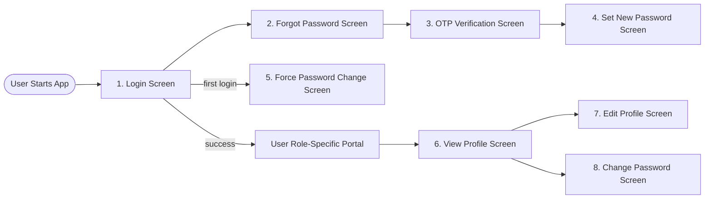

### 2. HQ Admin Portal Screen Flow
A desktop portal enabling administrative personnel to manage employees, global menus, vouchers, customer records, global settings, and view brand-wide reports. The portal is shared by the three HQ roles, each seeing only its permitted modules: `ceoviewer` (read-only HQ reports), `businessadmin` (menu, category, voucher, and CRM management), and `ssadmin` (user provisioning, central system settings, and branch lifecycle).


### 3. Store Manager Console Screen Flow
A tablet or desktop dashboard for local store management overseeing logistics, inventory items, audits, scheduling, and store-specific performance logs.

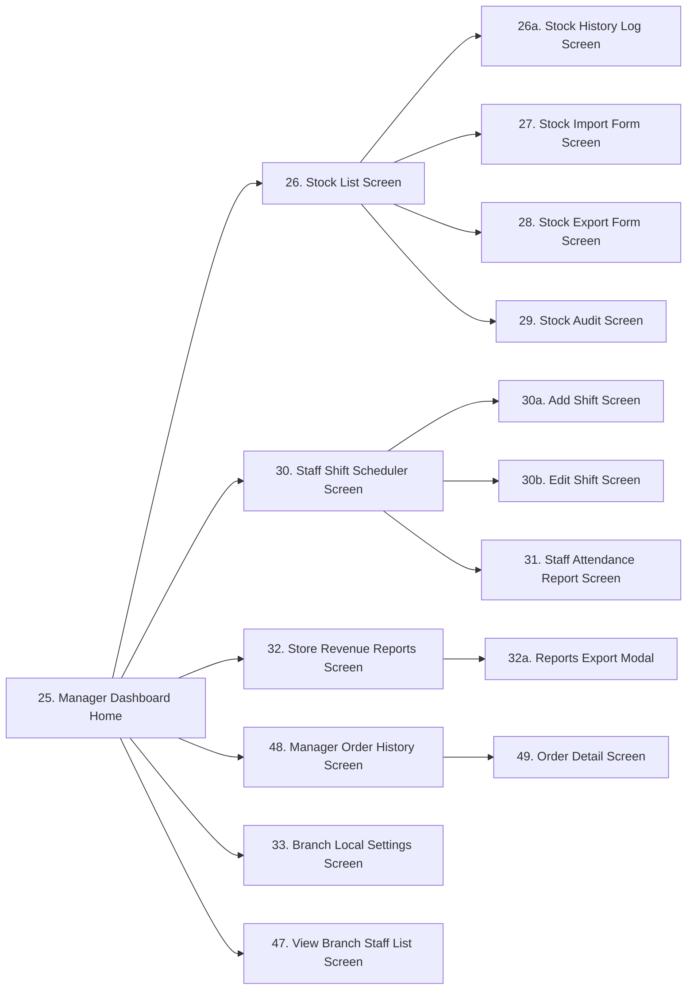

### 4. Cashier POS Terminal Screen Flow
An optimized touchscreen terminal interface designed to handle shift controls, scan items, search memberships, apply coupon codes, process transaction payments, print invoices, and initiate supervisor overrides.

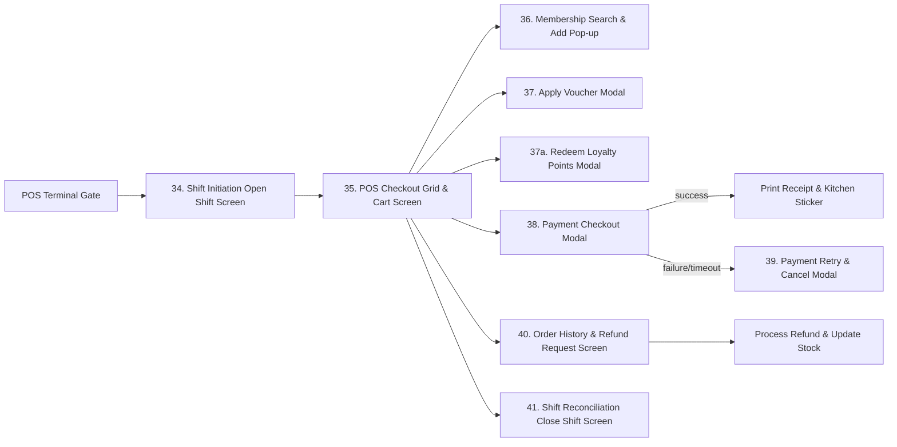

### 5. Barista Queue Monitor Screen Flow
An interactive tablet console in the preparation zone to manage product lines, change order processing flags, print cup stickers, and trigger item issue warnings.

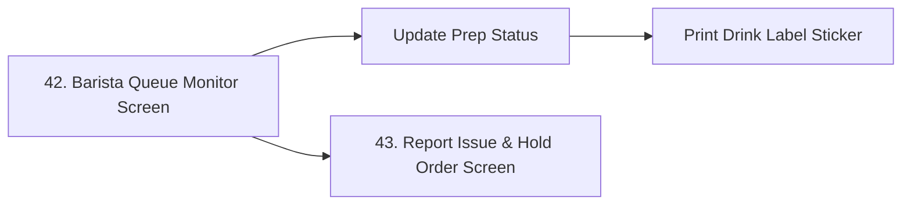

---

## 3.1.2 Screen Descriptions
The system comprises the following screens across its user portals:

| # | Feature | Screen | Description |
|---|---|---|---|
| 1 | System Access & Security | Login Screen | Allows staff to securely access the system using their credentials. |
| | | Logout | Allow users to log out the system. |
| | | Forgot Password Screen | When users forget their password, they can retrieve it. |
| | | OTP Verification Screen | Verify user account via 6-digit OTP code. |
| | | Set New Password Screen | Allow users to set a new password after OTP verification. |
| | | Force Password Change Screen | Forces first-time login users to replace their temporary password before accessing the system. |
| | | View Profile Screen | Allow users to view personal information. |
| | | Edit Profile Screen | Allow users to update personal information. |
| | | Change Password Screen | Allows users to change their password. |
| 2 | User Account Management | Admin Dashboard Home | Shared HQ portal home screen; each HQ role (ceoviewer, businessadmin, ssadmin) sees navigation to only its permitted modules. |
| | | Account Management List Screen | Allows System Admin to view all employee accounts. |
| | | Add User Account Form | Enables System Admin to create and register new employee profiles. |
| | | Edit User Account Form | Allows System Admin to edit employee details and roles. |
| | | User Detail & Audit Logs Screen | Displays profile details and historical activity records. |
| 3 | Menu & Category Management | Menu & Categories Management Screen | Main catalog panel to review product categories and menu listings. |
| | | Add Category Screen | Form to add a new category to the menu structure. |
| | | Edit Category Screen | Form to edit category details and visibility. |
| | | Add Menu Item Form | Form to create a new beverage or food entry with prices and recipes. |
| | | Edit Menu Item Form | Form to modify drink pricing, availability, or recipes. |
| 4 | Voucher Management | Vouchers & Promotions List Screen | Grid of active discount promotions, codes, and usage metrics. |
| | | Add Voucher Form | Form to configure new vouchers with discount rates and limits. |
| | | Edit Voucher Form | Form to modify voucher dates or total usage limits. |
| 5 | Customer Management | Customer List & Loyalty History Screen | Customer registry for searching and registering membership details. |
| 6 | Reports & Analytics | HQ Business Reports Screen | HQ dashboard comparing revenue, best-sellers, and store metrics. |
| | | Store Revenue Reports Screen | Local branch dashboard showing retail sales, shift closures, and payment metrics. |
| | | Reports Export Modal | Modal to export branch sales and inventory reports to PDF/Excel. |
| 7 | System Configuration | Central System Settings Screen | Central configuration screen for tax rates and brand settings. |
| | | Branch Local Settings Screen | Local settings screen for branch hardware and POS registers. |
| | | Branch Management List Screen | Lists all store branches with status indicators for System Admin management. |
| | | Add Branch Form | Form for System Admin to register a new store branch with name, address, and phone. |
| | | Edit / Deactivate Branch Screen | Form to modify branch details or deactivate (close) a branch. |
| 8 | Inventory Management | Manager Dashboard Home | Store Manager portal home screen with navigation to all manager modules. |
| | | Stock List Screen | Displays branch inventory quantities and alert flags. |
| | | Stock History Log Screen | Displays historical ledger logs of all stock imports/exports. |
| | | Stock Import Form Screen | Form to record supplier inventory imports. |
| | | Stock Export Form Screen | Form to log physical stock exports, wastage, or damage. |
| | | Stock Audit Screen | Grid to count physical stock and reconcile discrepancies. |
| 9 | Staff & Shift Management | Staff Shift Scheduler Screen | Calendar to schedule cashiers and baristas into shift blocks. |
| | | Add Shift Screen | Form to schedule a cashier or barista to a new shift. |
| | | Edit Shift Screen | Form to modify or delete an existing staff shift. |
| | | Staff Attendance Report Screen | Logs check-in/out times and attendance details. |
| | | View Branch Staff List Screen | Roster directory showing assigned branch staff contact details and operational roles. |
| 10 | POS Sales & Billing | Shift Initiation Open Shift Screen | Prompts cashier for register ID and starting cash float. |
| | | POS Checkout Grid & Cart Screen | Main sales screen with catalog search and cart grid. |
| | | Membership Search & Add Pop-up | Modal to look up or register membership customers. |
| | | Apply Voucher Modal | Modal to select active vouchers matching cart values. |
| | | Redeem Loyalty Points Modal | Modal to input points count for customer cash discount redemptions. |
| | | Payment Checkout Modal | Modal to process card, cash, or dynamic QR code payments. |
| | | Payment Retry & Cancel Modal | Modal to handle payment failures and gateway timeouts. |
| | | Order History & Refund Request Screen | Logs local terminal transactions for refund requests. |
| | | Shift Reconciliation Close Shift Screen | Prompts cashier for counted closing cash drawer float input. |
| | | Manager Order History Screen | Displays list of orders processed at the branch with filters. |
| | | Order Detail Screen | Displays item details, payment transactions, and fulfillment logs for a specific order, allowing managers, cashiers, and baristas to view it, and managers to cancel/refund pending orders directly. |
| 11 | Order Prep & Queue | Barista Queue Monitor Screen | Live prep queue for Baristas showing order status columns. |
| | | Report Issue & Hold Order Screen | Modal to flag drink prep issues to cashiers and managers. |
---

## 3.1.3 Screen Authorization
The table below specifies access control policies across all 60 screens. The single former "Admin" column is split into the three HQ roles (`ceoviewer`, `businessadmin`, `ssadmin`) per the authoritative RBAC matrix in §3.2.0 of [03_2 System Access & Security](03_2_system_access_security.md):

| Screen Name | ceoviewer | businessadmin | ssadmin | Store Manager | Cashier | Barista |
|---|:---:|:---:|:---:|:---:|:---:|:---:|
| 1. Login Screen | Yes | Yes | Yes | Yes | Yes | Yes |
| 2. Forgot Password Screen | Yes | Yes | Yes | Yes | Yes | Yes |
| 3. OTP Verification Screen | Yes | Yes | Yes | Yes | Yes | Yes |
| 4. Set New Password Screen | Yes | Yes | Yes | Yes | Yes | Yes |
| 5. Force Password Change Screen | Yes | Yes | Yes | Yes | Yes | Yes |
| 6. View Profile Screen | Yes | Yes | Yes | Yes | Yes | Yes |
| 7. Edit Profile Screen | Yes | Yes | Yes | Yes | Yes | Yes |
| 8. Change Password Screen | Yes | Yes | Yes | Yes | Yes | Yes |
| Logout Screen/Action | Yes | Yes | Yes | Yes | Yes | Yes |
| 9. Admin Dashboard Home | **Yes** | **Yes** | **Yes** | No | No | No |
| 10. Account Management List | No | No | **Yes** | No | No | No |
| 11. Add User Account Form | No | No | **Yes** | No | No | No |
| 12. Edit User Account Form | No | No | **Yes** | No | No | No |
| 13. User Detail & Audit Logs | No | No | **Yes** | No | No | No |
| 14. Menu & Categories Management | No | **Yes** | No | No | No | No |
| 15. Add Category Screen | No | **Yes** | No | No | No | No |
| 16. Edit Category Screen | No | **Yes** | No | No | No | No |
| 17. Add Menu Item Form | No | **Yes** | No | No | No | No |
| 18. Edit Menu Item Form | No | **Yes** | No | No | No | No |
| 19. Vouchers & Promotions List | No | **Yes** | No | No | No | No |
| 20. Add Voucher Form | No | **Yes** | No | No | No | No |
| 21. Edit Voucher Form | No | **Yes** | No | No | No | No |
| 22. Customer List & Loyalty History | No | **Yes** | No | **Yes** | **Yes** | No |
| 23. HQ Business Reports | **Yes** | No | No | No | No | No |
| 24. Central System Settings | No | No | **Yes** | No | No | No |
| 25. Manager Dashboard Home | No | No | No | **Yes** | No | No |
| 26. Stock List Screen | No | No | No | **Yes** | No | No |
| 26a. Stock History Log Screen | No | No | No | **Yes** | No | No |
| 27. Stock Import Form | No | No | No | **Yes** | No | No |
| 28. Stock Export Form | No | No | No | **Yes** | No | No |
| 29. Stock Audit Screen | No | No | No | **Yes** | No | No |
| 30. Staff Shift Scheduler | No | No | No | **Yes** | No | No |
| 30a. Add Shift Screen | No | No | No | **Yes** | No | No |
| 30b. Edit Shift Screen | No | No | No | **Yes** | No | No |
| 31. Staff Attendance Report | No | No | No | **Yes** | No | No |
| 32. Store Revenue Reports Screen | No | No | No | **Yes** | No | No |
| 32a. Reports Export Modal | No | No | No | **Yes** | No | No |
| 33. Branch Local Settings | No | No | No | **Yes** | No | No |
| 34. Shift Initiation Open Shift | No | No | No | No | **Yes** | No |
| 35. POS Checkout Grid & Cart | No | No | No | No | **Yes** | No |
| 36. Membership Search & Add | No | No | No | No | **Yes** | No |
| 37. Apply Voucher Modal | No | No | No | No | **Yes** | No |
| 37a. Redeem Loyalty Points Modal | No | No | No | No | **Yes** | No |
| 38. Payment Checkout Modal | No | No | No | No | **Yes** | No |
| 39. Payment Retry & Cancel Modal | No | No | No | No | **Yes** | No |
| 40. Order History & Refund Request | No | No | No | No | **Yes** | No |
| 41. Shift Reconciliation Close Shift | No | No | No | No | **Yes** | No |
| 42. Barista Queue Monitor | No | No | No | Yes | Yes | **Yes** |
| 43. Report Issue & Hold Order | No | No | No | No | No | **Yes** |
| 44. Branch Management List | No | No | **Yes** | No | No | No |
| 45. Add Branch Form | No | No | **Yes** | No | No | No |
| 46. Edit / Deactivate Branch | No | No | **Yes** | No | No | No |
| 47. View Branch Staff List Screen | No | No | No | **Yes** | No | No |
| 48. Manager Order History Screen | No | No | No | **Yes** | No | No |
| 49. Order Detail Screen | No | No | No | **Yes** | **Yes** | **Yes** |
| 50. Raw Material Master | No | **Yes** | No | No | No | No |
| 51. Refund / Comp Modal (post-PENDING) | No | No | No | **Yes** | **Yes** | No |
| 52. COGS / Margin & Shrinkage Report | **Yes** | No | No | **Yes** | No | No |
| 53. Price & Voucher Change History | **Yes** | No | No | No | No | No |
| 54. Loyalty Liability & Movement Report | **Yes** | No | No | No | No | No |
| 55. Labour Hours vs Revenue Report | **Yes** | No | No | **Yes** | No | No |
| 56. Worked-Hours Export | No | No | No | **Yes** | No | No |
| 57. Daily Z-Report | No | No | No | **Yes** | No | No |
| 58. HQ MFA Challenge (login step) | **Yes** | **Yes** | **Yes** | No | No | No |
| 59. Cashier Void/Refund Anomaly Report | **Yes** | No | No | **Yes** | No | No |
| 60. User Account Change & Access Review Report | **Yes** | No | No | No | No | No |

> **Note on inventory access (two layers):** **Branch stock quantities** (Stock List/History/Import/Export/Audit, screens 26–29) are owned exclusively by the `storemanager`. The previous "Admin = Read (auditing)" access on Stock List/History (screens 26/26a) is removed — no HQ role has direct access to branch stock screens; chain-wide stock visibility reaches `ceoviewer` only through consolidated HQ reports. Separately, the **Raw Material Master** (screen 50, UC-74) is a chain-wide *catalog* — defining which materials exist — owned by the `businessadmin`; it carries no per-branch quantities. There is no central warehouse.

---

## 3.1.4 Non-Screen Functions
These automated backend processes do not require direct human interaction:

| # | Feature | System Function | Description |
|---|---|---|---|
| 1 | System Access & Security | Logout | Invalidate the current user session or token and clear client-side storage. |
| 2 | System Access & Security | Silent Token Refresh | Automatically refresh JWT token in the background when it is close to expiration and client is active. |
| 3 | Inventory Management | Recipe-Based Stock Deduction | Automatically deduct stock ingredients based on menu recipes when an order moves to the PREPARING state. |
| 4 | Inventory Management | Low Stock Notification Engine | Evaluates active stock levels against thresholds in real-time, displaying alert badges and sending nightly aggregated emails at 22:00. |
| 5 | POS Transaction | Auto-Close Abandoned Shifts | Nightly scheduler runs at 11:59 PM to automatically close active cashier shifts left open, logging discrepancies. |
| 6 | POS Transaction | Order Timeout Handler | Automatically cancels orders that are in a pending payment state for more than 15 minutes. |


---

## 3.1.5 Entity Relationship Diagram (ERD)
The entity relationships are structured as follows:

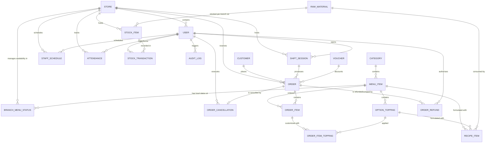

---

### Entities Description

| # | Entity | Description |
|---|---|---|
| 1 | users | Stores login credentials and role-based permissions for employees (CEO Viewer, Business Admin, System Admin, Store Manager, Cashier, Barista) within the system. |
| 2 | categories | Represents main food and beverage groups to organize the product catalog. |
| 3 | menu_items | Holds individual beverage and food listings, including catalog pricing, barcodes, chain-wide active status, and image references. |
| 3a | branch_menu_status | Manages item availability status independently per branch store. |
| 4 | option_toppings | Stores customizable add-ons that can be added to menu items. |
| 5 | customers | Registry of all enrolled loyalty membership customers, tracking points. |
| 6 | shift_sessions | Tracks active work sessions of POS cashier registers, including opening/closing float values. |
| 7 | orders | Represents sales transactions, linking customers, shifts, payment statuses, and fulfillment statuses. |
| 8 | order_items | Line items detailing the specific menu products and quantities purchased in an order. |
| 9 | order_item_toppings | Tracks specific toppings applied to ordered menu items. |
| 10 | raw_materials | Chain-wide master catalog of raw materials/ingredients owned by Business Admin (UC-74); the canonical source for recipe formulations (§3.3) and for the item dropdowns on every branch's Import/Export Stock screens. |
| 10a | stock_items | Branch-level on-hand quantities of a master raw material (references `raw_materials` by FK); scoped per branch. |
| 11 | stock_transactions | Historical ledger recording inventory imports, exports, physical audits, and wastage logs. |
| 12 | vouchers | Stores promotional discount rules, coupon codes, validation dates, and customer usage limits. |
| 13 | recipe_items | Defines the raw stock ingredient quantity consumed to produce one unit of a menu item or topping. |
| 14 | stores | Represents physical store branches and geographic coffee shop locations. |
| 15 | staff_schedules | Stores assigned employee work shifts, scheduled date blocks, and register terminals allocations. |
| 16 | attendances | Logs employee clock-in/out timestamps, date records, snapshot photos, and lateness metadata. |
| 17 | audit_logs | Central security audit logs for critical database updates. |

---

### 3.1.6 Entity Details

### 1. `USER`
Represents employees and system administrators.

| # | Attribute name | PK | Type | Mandatory | Description |
|---|---|---|---|---|---|
| 1 | id | x | Unique ID (UUID) | Yes | Unique identifier for the user. |
| 2 | username | | Text (Max 50 characters) | Yes | Account login name, unique. |
| 3 | password_hash | | Text (Max 255 characters) | Yes | Securely hashed password. |
| 4 | role | | Selection (Role: CEOVIEWER, BUSINESSADMIN, SSADMIN, STOREMANAGER, CASHIER, BARISTA) | Yes | User role. |
| 5 | full_name | | Text (Max 100 characters) | Yes | Employee full name. |
| 6 | is_active | | Yes/No (Boolean) | Yes | Current status of the account. |
| 7 | email | | Text (Max 100 characters) | Yes | Employee contact email address, unique. |
| 8 | phone | | Text (Max 20 characters) | Yes | Employee contact phone number, unique. |
| 9 | store_id | | Unique ID (UUID) | No | Foreign Key (FK) - references store/branch. Null for HQ roles (ceoviewer / businessadmin / ssadmin). |
| 10 | created_at | | Date & Time | Yes | Account creation timestamp. |
| 11 | last_login_at | | Date & Time | No | Timestamp of the most recent successful login. |
| 12 | must_change_password | | Yes/No (Boolean) | Yes | Flag indicating if the user must reset their password upon next login. Default: true. |

### 2. `CATEGORY`
Main food and beverage groups.

| # | Attribute name | PK | Type | Mandatory | Description |
|---|---|---|---|---|---|
| 1 | id | x | Unique ID (UUID) | Yes | Unique identifier for the category. |
| 2 | name | | Text (Max 100 characters) | Yes | Category name (e.g., "Coffee", "Tea", "Pastry"). |
| 3 | description | | Long Text | No | Details of the category. |
| 4 | is_active | | Yes/No (Boolean) | Yes | Visibility flag. |

### 3. `MENU_ITEM`
Individual food/beverage listings.

| # | Attribute name | PK | Type | Mandatory | Description |
|---|---|---|---|---|---|
| 1 | id | x | Unique ID (UUID) | Yes | Unique identifier for the menu item. |
| 2 | category_id | | Unique ID (UUID) | No | Foreign Key (FK) - references CATEGORY(id). Nullable to set NULL on category deletion. |
| 3 | name | | Text (Max 100 characters) | Yes | Name of the food or beverage (e.g., "Espresso", "Peach Tea"). |
| 4 | price | | Decimal (Currency/VND) | Yes | Base price. |
| 5 | description | | Long Text | No | Description of the item. |
| 6 | is_active | | Yes/No (Boolean) | Yes | Visibility flag for entire chain, decided by Business Admin at HQ (default: true). |
| 7 | image_url | | Text (Max 255 characters) | No | URL path to the product image file. |
| 8 | barcode | | Text (Max 50 characters) | No | Barcode or SKU for POS barcode scanner lookup (unique). |
| 9 | abbreviation | | Text (Max 50 characters) | Yes | Auto-generated abbreviation (e.g. cfd). |
| 10 | created_at | | Date & Time | Yes | Date and time the item was added to the catalog. |
| 11 | is_deleted | | Yes/No (Boolean) | Yes | Soft-delete status flag. Default: false. |

### 3a. `BRANCH_MENU_STATUS`
Manages item availability status independently per branch store.

| # | Attribute name | PK | Type | Mandatory | Description |
|---|---|---|---|---|---|
| 1 | store_id | x | Unique ID (UUID) | Yes | Foreign Key (FK) - references STORE(id). |
| 2 | menu_item_id | x | Unique ID (UUID) | Yes | Foreign Key (FK) - references MENU_ITEM(id). |
| 3 | is_available | | Yes/No (Boolean) | Yes | Availability status of menu item in this specific branch store. |

### 4. `OPTION_TOPPING`
Add-ons like extra espresso shots, milk options, or tapioca pearls.

| # | Attribute name | PK | Type | Mandatory | Description |
|---|---|---|---|---|---|
| 1 | id | x | Unique ID (UUID) | Yes | Unique identifier for the option/topping. |
| 2 | menu_item_id | | Unique ID (UUID) | No | Foreign Key (FK) - references MENU_ITEM(id). Optional link, null for global toppings. |
| 3 | name | | Text (Max 100 characters) | Yes | Option or topping name (e.g., "Extra Espresso Shot", "Oat Milk"). |
| 4 | price | | Decimal (Currency/VND) | Yes | Add-on cost in VND. |
| 5 | is_active | | Yes/No (Boolean) | Yes | Active/inactive visibility status. |

### 5. `CUSTOMER`
Registered membership details.

| # | Attribute name | PK | Type | Mandatory | Description |
|---|---|---|---|---|---|
| 1 | id | x | Unique ID (UUID) | Yes | Unique identifier for the customer. |
| 2 | phone | | Text (Max 20 characters) | Yes | Primary lookup identifier (phone number, unique). |
| 3 | full_name | | Text (Max 100 characters) | Yes | Customer's full name. |
| 4 | points | | Whole Number | Yes | Loyalty points accrued. |
| 5 | email | | Text (Max 100 characters) | No | Customer contact email. |
| 6 | created_at | | Date & Time | Yes | Date and time of membership enrollment. |

### 6. `SHIFT_SESSION`
Tracks cashier sessions at POS terminals.

| # | Attribute name | PK | Type | Mandatory | Description |
|---|---|---|---|---|---|
| 1 | id | x | Unique ID (UUID) | Yes | Unique identifier for the shift session. |
| 2 | store_id | | Unique ID (UUID) | Yes | Foreign Key (FK) - references store branch. |
| 3 | user_id | | Unique ID (UUID) | Yes | Foreign Key (FK) - references USER(id). The cashier who opened the shift. |
| 4 | start_time | | Date & Time | Yes | Timestamp when the shift started. |
| 5 | end_time | | Date & Time | No | Timestamp when the shift was closed. |
| 6 | starting_cash | | Decimal (Currency/VND) | Yes | Float cash amount in cash drawer at start. |
| 7 | ending_cash | | Decimal (Currency/VND) | No | Actual cash counted in drawer at close. |
| 8 | status | | Selection (Shift Status: OPEN, CLOSED) | Yes | Shift session status. |
| 9 | pos_register_id | | Text (Max 50 characters) | Yes | Identifier of the POS terminal/register (e.g., "POS-01"). |

### 7. `ORDER`
Sales transactions.

| # | Attribute name | PK | Type | Mandatory | Description |
|---|---|---|---|---|---|
| 1 | id | x | Unique ID (UUID) | Yes | Unique identifier for the order. |
| 2 | store_id | | Unique ID (UUID) | Yes | Foreign Key (FK) - references store branch. |
| 3 | order_number | | Text (Max 50 characters) | Yes | Short 3-digit order sequence (e.g., `#001`), reset daily per branch. If the count exceeds 999, it continues to 1000 without truncating. |
| 4 | shift_session_id | | Unique ID (UUID) | No | Foreign Key (FK) - references SHIFT_SESSION(id). Null for online delivery orders. |
| 5 | customer_id | | Unique ID (UUID) | No | Foreign Key (FK) - references CUSTOMER(id). Null for guest orders. |
| 6 | voucher_id | | Unique ID (UUID) | No | Foreign Key (FK) - references VOUCHER(id). Null if no discount applied. |
| 7 | order_type | | Selection (Order Type: DINE_IN, TAKE_AWAY, DELIVERY) | Yes | Order type. |
| 8 | subtotal | | Decimal (Currency/VND) | Yes | Total price before discounts. |
| 9 | discount | | Decimal (Currency/VND) | Yes | Total discount amount subtracted. |
| 10 | tax_amount | | Decimal (Currency/VND) | Yes | The VAT amount calculated for this order based on global config. |
| 11 | total | | Decimal (Currency/VND) | Yes | Net payable amount. |
| 12 | payment_method | | Selection (Payment Method: CASH, CARD, VIETQR) | Yes | Payment method. |
| 13 | payment_status | | Selection (Payment Status: PENDING, COMPLETED, FAILED, REFUNDED, PARTIALLY_REFUNDED) | Yes | Payment status. |
| 14 | order_status | | Selection (Fulfillment Status: PENDING, PREPARING, HOLD, READY, COMPLETED, CANCELLED, ABANDONED) | Yes | Fulfillment status. |
| 15 | created_at | | Date & Time | Yes | Date and time the order was placed. |

### 7a. `ORDER_CANCELLATION`
Fulfillment cancellation and refund audits logs.

| # | Attribute name | PK | Type | Mandatory | Description |
|---|---|---|---|---|---|
| 1 | id | x | Unique ID (UUID) | Yes | Unique identifier for the cancellation. |
| 2 | order_id | | Unique ID (UUID) | Yes | Foreign Key (FK) - references ORDER(id). |
| 3 | cashier_id | | Unique ID (UUID) | Yes | Foreign Key (FK) - references USER(id). The cashier who cancelled. |
| 4 | reason | | Text (Max 100 characters) | Yes | Reason string. |
| 5 | notes | | Long Text | Yes | Detailed comments. |
| 6 | created_at | | Date & Time | Yes | Timestamp of cancellation. |

### 7b. `ORDER_REFUND`
Post-`PENDING` refund / comp audit log, Store-Manager authorised (UC-75 / BR-67).

| # | Attribute name | PK | Type | Mandatory | Description |
|---|---|---|---|---|---|
| 1 | id | x | Unique ID (UUID) | Yes | Unique identifier for the refund/comp record. |
| 2 | order_id | | Unique ID (UUID) | Yes | Foreign Key (FK) - references ORDER(id). |
| 3 | sm_id | | Unique ID (UUID) | Yes | Foreign Key (FK) - references USER(id). The Store Manager who authorised. |
| 4 | cashier_id | | Unique ID (UUID) | Yes | Foreign Key (FK) - references USER(id). The cashier who initiated. |
| 5 | shift_session_id | | Unique ID (UUID) | No | FK - the open shift drawer charged for cash refunds (BR-09). |
| 6 | refund_type | | Selection (`REFUND`, `COMP_REMAKE`) | Yes | Refund (money returned) or Comp/Remake (zero-charge replacement). |
| 7 | amount | | Decimal (Currency/VND) | Yes | Refunded amount (0 for comp/remake). Supports partial refunds. |
| 8 | reason | | Text (Max 100 characters) | Yes | Reason string. |
| 9 | notes | | Long Text | Yes | Detailed comments. |
| 10 | created_at | | Date & Time | Yes | Timestamp of the refund/comp. |

### 8. `ORDER_ITEM`
Line items in an order.

| # | Attribute name | PK | Type | Mandatory | Description |
|---|---|---|---|---|---|
| 1 | id | x | Unique ID (UUID) | Yes | Unique identifier for the order line item. |
| 2 | order_id | | Unique ID (UUID) | Yes | Foreign Key (FK) - references ORDER(id). |
| 3 | menu_item_id | | Unique ID (UUID) | Yes | Foreign Key (FK) - references MENU_ITEM(id). |
| 4 | quantity | | Whole Number | Yes | Quantity purchased. |
| 5 | unit_price | | Decimal (Currency/VND) | Yes | Price of the item at the time of purchase. |

### 9. `ORDER_ITEM_TOPPING`
Toppings attached to a specific order line item.

| # | Attribute name | PK | Type | Mandatory | Description |
|---|---|---|---|---|---|
| 1 | id | x | Unique ID (UUID) | Yes | Unique identifier for the order item topping. |
| 2 | order_item_id | | Unique ID (UUID) | Yes | Foreign Key (FK) - references ORDER_ITEM(id). |
| 3 | topping_id | | Unique ID (UUID) | Yes | Foreign Key (FK) - references OPTION_TOPPING(id). |
| 4 | quantity | | Whole Number | Yes | Quantity of the topping applied. |
| 5 | unit_price | | Decimal (Currency/VND) | Yes | Price of the topping at the time of purchase. |

### 10. `RAW_MATERIAL`
Chain-wide master catalog of raw materials/ingredients, owned exclusively by the Business Admin (UC-74 / §3.5.0). The canonical source for recipe formulations (§3.3) and for branch Import/Export stock dropdowns (UC-32/33). See BR-63/BR-64.

| # | Attribute name | PK | Type | Mandatory | Description |
|---|---|---|---|---|---|
| 1 | id | x | Unique ID (UUID) | Yes | Unique identifier for the raw material. |
| 2 | code | | Text (Max 20 characters) | Yes | Unique chain-wide material code (e.g., "STK-01"). Immutable after creation. |
| 3 | name | | Text (Max 100 characters) | Yes | Display name of the raw material (e.g., "Coffee Beans", "Fresh Milk"). |
| 4 | unit | | Text (Max 20 characters) | Yes | Unit of measurement (e.g., "kg", "liter", "ml", "piece"). Locked once any stock transaction references the material. |
| 5 | suggested_min_threshold | | Decimal (Quantity) | No | Default low-stock threshold proposed to branches (each branch may override locally). |
| 6 | standard_cost | | Decimal (Currency/VND) | No | Standard unit cost per master unit, maintained by Business Admin; basis for chain-wide COGS & margin (BR-66). |
| 7 | is_active | | Yes/No (Boolean) | Yes | Active status flag. Soft-delete: `Inactive` hides the material from new recipe/import selections (BR-64). |
| 8 | category | | Selection (Material Category: INGREDIENTS, PACKAGING) | Yes | Grouping label to classify raw materials centrally. |

### 10a. `STOCK_ITEM`
Branch-level on-hand quantity of a master raw material (e.g., Coffee Beans, Milk, Paper Cups) scoped per branch.

| # | Attribute name | PK | Type | Mandatory | Description |
|---|---|---|---|---|---|
| 1 | id | x | Unique ID (UUID) | Yes | Unique identifier for the stock item. |
| 2 | store_id | | Unique ID (UUID) | Yes | Foreign Key (FK) - references store branch. |
| 3 | raw_material_id | | Unique ID (UUID) | Yes | Foreign Key (FK) - references RAW_MATERIAL(id). Name and unit derive from the master (BR-63). |
| 4 | current_quantity | | Decimal (Quantity) | Yes | Remaining physical amount in stock. |
| 5 | min_alert_threshold | | Decimal (Quantity) | Yes | Branch-local threshold triggering low stock alert (defaults from the master's suggested minimum). |

### 11. `STOCK_TRANSACTION`
Historical ledger of stock modifications.

| # | Attribute name | PK | Type | Mandatory | Description |
|---|---|---|---|---|---|
| 1 | id | x | Unique ID (UUID) | Yes | Unique identifier for the stock transaction. |
| 2 | stock_item_id | | Unique ID (UUID) | Yes | Foreign Key (FK) - references STOCK_ITEM(id). |
| 3 | manager_id | | Unique ID (UUID) | No | Foreign Key (FK) - references USER(id). The manager who logged it. Null for system-triggered automated recipe deductions. |
| 4 | transaction_type | | Selection (Transaction Type: IMPORT, EXPORT, AUDIT_ADJUSTMENT) | Yes | Transaction type. |
| 5 | quantity | | Decimal (Quantity) | Yes | Volume of stock moved. |
| 6 | reason | | Long Text | No | Reason details (e.g., "Weekly Restock", "Soured Milk Disposal"). |
| 7 | created_at | | Date & Time | Yes | Date and time of the transaction. |

### 12. `VOUCHER`
Marketing and promotional discount codes.

| # | Attribute name | PK | Type | Mandatory | Description |
|---|---|---|---|---|---|
| 1 | id | x | Unique ID (UUID) | Yes | Unique identifier for the voucher. |
| 2 | code | | Text (Max 50 characters) | Yes | Unique alphanumeric code (e.g., "COFFEE20"). |
| 3 | discount_type | | Selection (Discount Type: PERCENTAGE, FIXED_AMOUNT) | Yes | Discount type. |
| 4 | discount_value | | Decimal | Yes | Value of discount: percentage (e.g., 10.0 for 10%) or flat amount in VND, depending on discount_type. |
| 5 | min_order_value | | Decimal (Currency/VND) | Yes | Minimum subtotal value required to apply voucher. |
| 6 | start_date | | Date & Time | Yes | Voucher validity start date and time. |
| 7 | end_date | | Date & Time | Yes | Voucher expiration date and time. |
| 8 | is_active | | Yes/No (Boolean) | Yes | Active status flag. |
| 9 | usage_limit_per_customer | | Whole Number | No | Maximum usage count per customer (null for unlimited). |
| 10 | total_usage_count | | Whole Number | Yes | Total redemptions count across all customers. Default: 0. |
| 11 | max_total_uses | | Whole Number | No | Overall maximum total uses cap (null for unlimited). |
| 12 | max_discount_amount | | Decimal (Currency/VND) | No | Maximum discount amount cap for percentage vouchers. |

### 13. `RECIPE_ITEM`
Defines the ingredients/stock consumed to produce menu items and toppings.

| # | Attribute name | PK | Type | Mandatory | Description |
|---|---|---|---|---|---|
| 1 | id | x | Unique ID (UUID) | Yes | Unique identifier for the recipe item. |
| 2 | menu_item_id | | Unique ID (UUID) | No | Foreign Key (FK) - references MENU_ITEM(id). Nullable if linked to topping instead. |
| 3 | option_topping_id | | Unique ID (UUID) | No | Foreign Key (FK) - references OPTION_TOPPING(id). Nullable if linked to menu item instead. |
| 4 | raw_material_id | | Unique ID (UUID) | Yes | Foreign Key (FK) - references RAW_MATERIAL(id) being consumed. Recipes reference the chain-wide master, not branch stock (BR-63). |
| 5 | quantity_required | | Decimal (Quantity) | Yes | Ingredient quantity required to produce one unit of menu item or topping. |

### 14. `STORE`
Represents physical store branches and geographic coffee shop locations.

| # | Attribute name | PK | Type | Mandatory | Description |
|---|---|---|---|---|---|
| 1 | id | x | Unique ID (UUID) | Yes | Unique identifier for the store branch. |
| 2 | name | | Text (Max 100 characters) | Yes | Store/Branch name (e.g. "Nguyen Du Branch"). |
| 3 | address | | Text (Max 255 characters) | Yes | Physical address of the branch store. |
| 4 | phone | | Text (Max 20 characters) | Yes | Branch contact phone number. |
| 5 | is_active | | Yes/No (Boolean) | Yes | Flag indicating if store is active. Default: true. |
| 6 | created_at | | Date & Time | Yes | Timestamp of store registration. |

### 15. `STAFF_SCHEDULE`
Stores assigned employee work shifts, scheduled date blocks, and register terminals allocations.

| # | Attribute name | PK | Type | Mandatory | Description |
|---|---|---|---|---|---|
| 1 | id | x | Unique ID (UUID) | Yes | Unique identifier for the schedule slot. |
| 2 | store_id | | Unique ID (UUID) | Yes | Foreign Key (FK) - references STORE(id). Scopes schedule to branch. |
| 3 | user_id | | Unique ID (UUID) | Yes | Foreign Key (FK) - references USER(id). The scheduled employee. |
| 4 | shift_date | | Date | Yes | Date of the scheduled shift. |
| 5 | shift_type | | Selection (Shift Block: MORNING, AFTERNOON, FULL_DAY) | Yes | Shift type block. |
| 6 | pos_register_id | | Text (Max 50 characters) | No | Reference to register terminal ID, if register allocated. |
| 7 | created_at | | Date & Time | Yes | Timestamp when schedule slot was created. |

### 16. `ATTENDANCE`
Logs employee clock-in/out timestamps, date records, and lateness metadata.

| # | Attribute name | PK | Type | Mandatory | Description |
|---|---|---|---|---|---|
| 1 | id | x | Unique ID (UUID) | Yes | Unique identifier for the attendance slot. |
| 2 | store_id | | Unique ID (UUID) | Yes | Foreign Key (FK) - references STORE(id). Scopes attendance to branch. |
| 3 | user_id | | Unique ID (UUID) | Yes | Foreign Key (FK) - references USER(id). The employee user profile. |
| 4 | shift_date | | Date | Yes | Date of the recorded attendance. |
| 5 | check_in_at | | Date & Time | No | Actual clock-in timestamp (null if absent). |
| 6 | check_out_at | | Date & Time | No | Actual clock-out timestamp (null if absent or active shift). |
| 7 | lateness_minutes | | Whole Number | Yes | Calculated late check-in minutes relative to shift. Default: 0. |
| 8 | status | | Selection (Attendance Status: ON_TIME, LATE, ABSENT) | Yes | Attendance status. |
| 9 | photo_url | | Text (Max 255 characters) | No | URL to staff check-in camera snapshot photo. |

### 17. `AUDIT_LOG`
Central security audit logs for critical database updates.

| # | Attribute name | PK | Type | Mandatory | Description |
|---|---|---|---|---|---|
| 1 | id | x | Unique ID (UUID) | Yes | Unique identifier for the audit log. |
| 2 | user_id | | Unique ID (UUID) | Yes | Foreign Key (FK) - references USER(id). |
| 3 | action_type | | Selection (Action Type: CREATE, UPDATE, DELETE) | Yes | Action type. |
| 4 | entity_affected | | Text (Max 100 characters) | Yes | Affected database table name. |
| 5 | old_value_json | | Long Text | No | Previous state of record in JSON format. |
| 6 | new_value_json | | Long Text | No | Updated state of record in JSON format. |
| 7 | created_at | | Date & Time | Yes | Timestamp of log event. |


---

# 3.2 System Access & Security

This section details the functional requirements for authentication, user profiles, and employee account administration.

---

## 3.2.0 Role-Based Access Control (RBAC) Overview

The system defines six user roles with strictly separated permissions. The table below is the authoritative reference for all access decisions.

| Role Identifier | Display Name | Scope | Permitted Actions |
|---|---|---|---|
| `ceoviewer` | CEO / Executive Viewer | HQ | **Read-only** access to HQ Dashboard and all chain-wide reports. Cannot create, edit, or delete any data (menu items, vouchers, user accounts, etc.). |
| `businessadmin` | Ops & Marketing Admin | HQ | Full CRUD on chain-wide menu, recipe formulas, categories, vouchers, and CRM customer data. Cannot access system configuration or user account provisioning. |
| `ssadmin` | IT System Admin | HQ | System configuration (hardware, VietQR/OTP integration, license, `MAX_ACTIVE_BRANCHES`). Cannot access sales or CRM data. |
| `storemanager` | Store Manager | Branch | Inventory import/export/audit for own branch, staff schedule management, shift close approval, temporary item deactivation via `branch_menu_status`. |
| `cashier` | POS Cashier | Branch | POS checkout, open/close shift (own user session only), customer lookup, order history for own branch. |
| `barista` | Barista | Branch | Barista KDS queue view, START PREP, READY (one-touch), REPORT ISSUE, print cup stickers. |

### Permission Matrix Summary

| Feature | ceoviewer | businessadmin | ssadmin | storemanager | cashier | barista |
|---|:---:|:---:|:---:|:---:|:---:|:---:|
| HQ Dashboard / Chain Reports | Read | — | — | — | — | — |
| Menu & Recipe Management | — | CRUD | — | — | — | — |
| Voucher & CRM Management | — | CRUD | — | — | — | — |
| System Configuration | — | — | CRUD | — | — | — |
| User Account Provisioning | — | — | — | — | — | — |
| Branch Inventory | — | — | — | CRUD | — | — |
| Branch Menu Status (temp. disable) | — | — | — | Write | — | — |
| Staff Scheduling | — | — | — | CRUD | — | — |
| Shift Close Approval | — | — | — | Approve | — | — |
| POS Checkout / Shift Open | — | — | — | — | Write | — |
| Barista KDS / Cup Stickers | — | — | — | — | — | Write |

> **Note**: User account provisioning (create/edit employee accounts, assign roles) is restricted to `ssadmin` for HQ-level accounts and to `ssadmin` + `storemanager` (read-only view) for branch accounts. `businessadmin` does **not** have user management access.

---

## 3.2.1 F01 - Login / UC-01 Login

### 3.2.1.1 Screen Mock-up (Mobile Portrait)
```
+------------------------------------+
|               Login                |
|                                    |
|  [Logo Coffee Shop]                |
|                                    |
|  User Name                         |
|  [ Username                      ] |
|                                    |
|  Password                          |
|  [ **********                    ] |
|                                    |
|         [      LOGIN      ]        |
|                                    |
|         _Forgot Password?_         |
|                                    |
+------------------------------------+
```

#### Table 3-1: Screen Definition
| # | Field Name | Type | Mandatory | Max Length | Description |
|---|---|---|---|---|---|
| 1 | User Name | Text | Yes | 50 | Account login name. |
| 2 | Password | Password | Yes | 255 | Masked input field for password entry. |
| 3 | Login | Button | | | Triggers credential verification and logs the user in. |
| 4 | Forgot Password | Link | | | Navigates user to Forgot Password flow. |

### 3.2.1.2 Use Case Description

| Use Case ID | UC-01 | Use Case Name | Login |
|---|---|---|---|
| **Author** | Antigravity | **Version** | 1.0 |
| **Date** | 2026-05-24 | | |

| Field | Description |
|---|---|
| **Actor** | CEO Viewer, Business Admin, System Admin, Store Manager, Cashier, Barista |
| **Description** | Allows authorized staff members to authenticate and access their specific operational portals. |
| **Precondition** | User account is active and user is not currently logged in. |
| **Trigger** | User opens the application and lands on the Login screen. |
| **Post-Condition** | User is successfully authenticated, session is established, and user is redirected to their homepage. |

#### Main Flows
| Step | Actor | Action |
|---|---|---|
| 1 | User | Enters Username and Password, and clicks the "Login" button. |
| 2 | Portal | Verifies the credentials and checks account status. |
| 2a | Portal | **If the account is an HQ role** (`ceoviewer` / `businessadmin` / `ssadmin`) and `HQ_MFA_REQUIRED` is on, challenges for a second factor before establishing the session (BR-83 — see AT4). |
| 3 | Portal | Validates successful login (and MFA if required) and redirects the user to the interface matching their role. |

#### Alternative Flows
##### AT1: Invalid Credentials
- **Trigger**: At step 2, the user enters incorrect username or password.

| Sub-step | Actor | Action |
|---|---|---|
| 2.1 | Portal | Displays warning message: `"Incorrect username or password. Remaining attempts: {count}."` (MSG02) |

##### AT2: Mandatory Password Reset
- **Trigger**: At step 3, the account is flagged for mandatory password change.

| Sub-step | Actor | Action |
|---|---|---|
| 3.1 | Portal | Redirects the user immediately to the Force Password Change screen and restricts access to other areas. |

##### AT3: Too Many Failed Login Attempts
- **Trigger**: At step 2, 5 consecutive failed login attempts occur.

| Sub-step | Actor | Action |
|---|---|---|
| 2.1 | Portal | Suspends the user account from login attempts for 15 minutes, unless manually unlocked by a Store Manager (for branch staff) or System Admin (for any user). |

##### AT4: HQ Multi-Factor Authentication (MFA)
- **Trigger**: At step 2a, password is valid for an HQ-role account (`ceoviewer` / `businessadmin` / `ssadmin`) and `HQ_MFA_REQUIRED` is on.

| Sub-step | Actor | Action |
|---|---|---|
| 2a.1 | Portal | Sends a 6-digit MFA code to the account's registered email (reusing the OTP channel) **or** prompts for the current TOTP authenticator code, and shows the MFA Challenge screen (screen 58). |
| 2a.2 | User | Enters the second-factor code and submits. |
| 2a.3 | Portal | On match, establishes the session (step 3). On 3 failed attempts, applies the same lockout as AT3 (BR-17 reuse) and does **not** establish the session. |

#### Business Rules
| ID | Rule Description |
|---|---|
| BR-10 | Accounts with `is_active = false` must be blocked from logging in. |
| BR-11 | Account suspension lasts exactly 15 minutes after 5 consecutive failed attempts. |
| BR-12 | Mandatory password change flag blocks navigation to any other module. |
| BR-83 | **Mandatory MFA for HQ Roles**: Login by an HQ role (`ceoviewer` / `businessadmin` / `ssadmin`) requires a **second factor** after the password — a 6-digit email OTP (reusing the UC-03/04 OTP infrastructure) or a TOTP authenticator code — governed by the parameter `HQ_MFA_REQUIRED` (default **true**). Branch/POS roles (`storemanager`, `cashier`, `barista`) are **exempt** to avoid interrupting shared-terminal shift operations (they rely on password + attendance PIN per BR-53). Three failed MFA attempts trigger the standard lockout (BR-17) and block the session. (RV-S05) |

---

## 3.2.2 F02 - Logout / UC-02 Logout

### 3.2.2.1 Screen Mock-up (Mobile Portrait Confirmation)
```
+------------------------------------+
|        Logout Confirmation         |
|                                    |
|                                    |
|   Are you sure you want to log     |
|   out of the application?          |
|                                    |
|                                    |
|      [ Cancel ]     [ Log Out ]    |
|                                    |
+------------------------------------+
```

#### Table 3-2: Screen Definition
| # | Field Name | Type | Mandatory | Max Length | Description |
|---|---|---|---|---|---|
| 1 | Cancel | Button | | | Aborts logout flow and returns to current active page. |
| 2 | Log Out | Button | | | Clears active session, logs action, and returns to Login. |

### 3.2.2.2 Use Case Description

| Use Case ID | UC-02 | Use Case Name | Logout |
|---|---|---|---|
| **Author** | Antigravity | **Version** | 1.0 |
| **Date** | 2026-05-24 | | |

| Field | Description |
|---|---|
| **Actor** | CEO Viewer, Business Admin, System Admin, Store Manager, Cashier, Barista |
| **Description** | Safely terminates the active user session. |
| **Precondition** | User is authenticated. |
| **Trigger** | User clicks the "Logout" button/link. |
| **Post-Condition** | Active session tokens are cleared, logout is logged, and user is returned to Login screen. |

#### Main Flows
| Step | Actor | Action |
|---|---|---|
| 1 | User | Clicks the Logout option. |
| 2 | Portal | Displays logout confirmation modal. |
| 3 | User | Clicks "Log Out" button. |
| 4 | Portal | Terminates active session, records timestamp, and redirects to Login screen. |

#### Alternative Flows
##### AT1: Logout With Active Shift Session
- **Trigger**: At step 2, Cashier has an active POS shift session open on the terminal.

| Sub-step | Actor | Action |
|---|---|---|
| 2.1 | Portal | Displays confirmation: `"Your personal session will be closed. The POS shift session on this terminal will remain open so another cashier can continue."` |
| 2.2 | Cashier | Confirms logout. Portal terminates the **User Session** token only. The **Shift Session** on the POS register remains active and unaffected. |

> **Design Note**: User Session and Shift Session are independent lifecycle objects. A cashier may log out of their personal account (e.g. short break, mid-shift role change) without triggering cash-drawer reconciliation. The shift remains open on the terminal register under its assigned POS register ID until explicitly closed via UC-53.

#### Business Rules
| ID | Rule Description |
|---|---|
| BR-13 | Logout time must be logged upon termination of user session. |
| BR-60 | **User Session / Shift Session Independence**: Terminating a cashier's User Session does not close the active Shift Session on the POS terminal. The Shift Session persists until explicitly closed by a cashier (UC-53) and approved by the Store Manager. |

---

## 3.2.3 F03 - Change Password / UC-09 Change Password

### 3.2.3.1 Screen Mock-up (Mobile Portrait)
```
+------------------------------------+
|          Change Password           |
|                                    |
|  Current Password                  |
|  [ **********                    ] |
|                                    |
|  New Password                      |
|  [ **********                    ] |
|                                    |
|  Confirm New Password              |
|  [ **********                    ] |
|                                    |
|         [ SAVE CHANGES ]           |
|                                    |
+------------------------------------+
```

#### Table 3-3: Screen Definition
| # | Field Name | Type | Mandatory | Max Length | Description |
|---|---|---|---|---|---|
| 1 | Current Password | Password | Yes | 255 | Current masked password. |
| 2 | New Password | Password | Yes | 255 | New password adhering to complexity requirements. |
| 3 | Confirm New Password | Password | Yes | 255 | Re-enter new password to verify match. |
| 4 | Save Changes | Button | | | Submits change request. |

### 3.2.3.2 Use Case Description

| Use Case ID | UC-09 | Use Case Name | Change Password |
|---|---|---|---|
| **Author** | Antigravity | **Version** | 1.0 |
| **Date** | 2026-05-24 | | |

| Field | Description |
|---|---|
| **Actor** | CEO Viewer, Business Admin, System Admin, Store Manager, Cashier, Barista |
| **Description** | Allows logged-in users to update their password. |
| **Precondition** | User is authenticated. |
| **Trigger** | User navigates to Change Password screen in settings. |
| **Post-Condition** | User's password is changed successfully. |

#### Main Flows
| Step | Actor | Action |
|---|---|---|
| 1 | User | Inputs Current Password, New Password, and Confirm Password, then clicks "Save Changes". |
| 2 | Portal | Verifies that Current Password is correct and New Password matches Confirm Password. |
| 3 | Portal | Saves new password, displays success message, and terminates other active sessions. |

#### Alternative Flows
##### AT1: Current Password Incorrect
- **Trigger**: At step 2, Current Password does not match recorded password.

| Sub-step | Actor | Action |
|---|---|---|
| 2.1 | Portal | Displays error message: `"The current password entered is incorrect."` |

##### AT2: Password Complexity Failed
- **Trigger**: At step 2, New Password does not meet complexity guidelines.

| Sub-step | Actor | Action |
|---|---|---|
| 2.1 | Portal | Displays error message: `"Password must be at least 8 characters long and contain uppercase, lowercase, numeric, and special characters."` |

##### AT3: Password Mismatch
- **Trigger**: At step 2, New Password and Confirm Password do not match.

| Sub-step | Actor | Action |
|---|---|---|
| 2.1 | Portal | Displays error message: `"Confirm password does not match the new password."` |

#### Business Rules
| ID | Rule Description |
|---|---|
| BR-14 | New passwords must be at least 8 characters, containing at least one uppercase letter, one lowercase letter, one number, and one special character. |
| BR-15 | New passwords cannot match the current password. |

---

## 3.2.4 F04 - Forgot Password / UC-03 Forgot Password

### 3.2.4.1 Screen Mock-up (Mobile Portrait)
```
+------------------------------------+
|          Forgot Password           |
|                                    |
|  Enter your registered email to    |
|  receive a verification OTP code.  |
|                                    |
|  Email Address                     |
|  [ email@example.com             ] |
|                                    |
|         [   SEND OTP   ]           |
|                                    |
|         _Back to Login_            |
+------------------------------------+
```

#### Table 3-4: Screen Definition
| # | Field Name | Type | Mandatory | Max Length | Description |
|---|---|---|---|---|---|
| 1 | Email Address | Text | Yes | 100 | Registered work email address. |
| 2 | Send OTP | Button | | | Triggers sending verification OTP code to email. |
| 3 | Back to Login | Link | | | Navigates user back to Login screen. |

### 3.2.4.2 Use Case Description

| Use Case ID | UC-03 | Use Case Name | Forgot Password |
|---|---|---|---|
| **Author** | Antigravity | **Version** | 1.0 |
| **Date** | 2026-05-24 | | |

| Field | Description |
|---|---|
| **Actor** | CEO Viewer, Business Admin, System Admin, Store Manager, Cashier, Barista |
| **Description** | Initiates password recovery when a user forgets their credentials. |
| **Precondition** | User is not logged in. |
| **Trigger** | User clicks the "Forgot Password" link on the Login screen. |
| **Post-Condition** | If email is valid, OTP code is emailed and user is sent to OTP verification view. |

#### Main Flows
| Step | Actor | Action |
|---|---|---|
| 1 | User | Enters registered email address and clicks "Send OTP". |
| 2 | Portal | Checks if the email is associated with an active user account. |
| 3 | Portal | Generates a 6-digit OTP code (valid for 10 minutes), emails it to the user, and redirects user to OTP Verification screen. |

#### Alternative Flows
##### AT1: Non-existent Email
- **Trigger**: At step 2, email address is not found.

| Sub-step | Actor | Action |
|---|---|---|
| 2.1 | Portal | Displays standard confirmation message to prevent account harvesting: `"If this email is registered, you will receive a reset OTP shortly."` |

#### Business Rules
| ID | Rule Description |
|---|---|
| BR-16 | OTP validity duration is exactly 10 minutes. |

---

## 3.2.5 F05 - Verify OTP / UC-04 Verify OTP

### 3.2.5.1 Screen Mock-up (Mobile Portrait)
```
+------------------------------------+
|             Verify OTP             |
|                                    |
|  Enter the 6-digit verification    |
|  code sent to your email.          |
|                                    |
|  Verification Code                 |
|  [ _ _ _ _ _ _ ]                   |
|                                    |
|         [  VERIFY CODE  ]          |
|                                    |
|         _Resend Code (59s)_        |
+------------------------------------+
```

#### Table 3-5: Screen Definition
| # | Field Name | Type | Mandatory | Max Length | Description |
|---|---|---|---|---|---|
| 1 | Verification Code | Text | Yes | 6 | 6-digit numeric recovery code. |
| 2 | Verify Code | Button | | | Submits OTP for validation. |
| 3 | Resend Code | Link | | | Resends OTP (disabled during 60-second cooldown). |

### 3.2.5.2 Use Case Description

| Use Case ID | UC-04 | Use Case Name | Verify OTP |
|---|---|---|---|
| **Author** | Antigravity | **Version** | 1.0 |
| **Date** | 2026-05-24 | | |

| Field | Description |
|---|---|
| **Actor** | CEO Viewer, Business Admin, System Admin, Store Manager, Cashier, Barista |
| **Description** | Validates the 6-digit verification code sent during password recovery. |
| **Precondition** | Forgot password request has been initiated. |
| **Trigger** | Redirected from Forgot Password view. |
| **Post-Condition** | Code is validated, and user is sent to Set New Password screen. |

#### Main Flows
| Step | Actor | Action |
|---|---|---|
| 1 | User | Enters the 6-digit OTP code and clicks "Verify Code". |
| 2 | Portal | Validates OTP match and checks expiration timeline. |
| 3 | Portal | Flags session as verified and redirects to Set New Password screen. |

#### Alternative Flows
##### AT1: Code Mismatch or Expired
- **Trigger**: At step 2, code is incorrect or older than 10 minutes.

| Sub-step | Actor | Action |
|---|---|---|
| 2.1 | Portal | Displays warning message: `"Invalid or expired verification code. Please request a new one."` |

##### AT2: Limit Exceeded
- **Trigger**: At step 2, 3 failed OTP submissions occur.

| Sub-step | Actor | Action |
|---|---|---|
| 2.1 | Portal | Disables recovery session, displaying message to restart forgot password flow. |

#### Business Rules
| ID | Rule Description |
|---|---|
| BR-17 | Maximum of 3 OTP attempts before recovery session is locked. |

---

## 3.2.6 F06 - Set New Password / UC-05 Set New Password

### 3.2.6.1 Screen Mock-up (Mobile Portrait)
```
+------------------------------------+
|          Set New Password          |
|                                    |
|  Create a new password for your    |
|  account.                          |
|                                    |
|  New Password                      |
|  [ **********                    ] |
|                                    |
|  Confirm Password                  |
|  [ **********                    ] |
|                                    |
|         [ RESET PASSWORD ]         |
|                                    |
+------------------------------------+
```

#### Table 3-6: Screen Definition
| # | Field Name | Type | Mandatory | Max Length | Description |
|---|---|---|---|---|---|
| 1 | New Password | Password | Yes | 255 | New password adhering to complexity requirements. |
| 2 | Confirm Password | Password | Yes | 255 | Re-enter new password to verify match. |
| 3 | Reset Password | Button | | | Submits password update. |

### 3.2.6.2 Use Case Description

| Use Case ID | UC-05 | Use Case Name | Set New Password |
|---|---|---|---|
| **Author** | Antigravity | **Version** | 1.0 |
| **Date** | 2026-05-24 | | |

| Field | Description |
|---|---|
| **Actor** | CEO Viewer, Business Admin, System Admin, Store Manager, Cashier, Barista |
| **Description** | Finalizes password recovery flow by configuring a new password. |
| **Precondition** | User session has a validated recovery status. |
| **Trigger** | Redirected from OTP Verification page. |
| **Post-Condition** | Password is updated and user redirected to Login. |

#### Main Flows
| Step | Actor | Action |
|---|---|---|
| 1 | User | Enters new password, confirms it, and clicks "Reset Password". |
| 2 | Portal | Validates password complexity and match. |
| 3 | Portal | Updates account password, sets `must_change_password = false`, closes all active sessions elsewhere, and displays: `"Password reset successful. Please login with your new credentials."` |

#### Alternative Flows
##### AT1: Validation Failure
- **Trigger**: At step 2, inputs fail complexity or mismatch check.

| Sub-step | Actor | Action |
|---|---|---|
| 2.1 | Portal | Displays appropriate error message (same as Change Password errors). |

#### Business Rules
| ID | Rule Description |
|---|---|
| BR-14 | New passwords must be at least 8 characters, containing at least one uppercase letter, one lowercase letter, one number, and one special character. |
| BR-18 | Password change or setting status to Inactive terminates active session tokens on all other devices immediately. |

---

## 3.2.7 F06.1 - Force Password Change / UC-06 Force Password Change

### 3.2.7.1 Screen Mock-up (Mobile Portrait)
```
+------------------------------------+
|       Force Password Change        |
|                                    |
|  For security, you must change your|
|  temporary password before using   |
|  the system.                       |
|                                    |
|  New Password                      |
|  [ **********                    ] |
|                                    |
|  Confirm New Password              |
|  [ **********                    ] |
|                                    |
|         [ CHANGE PASSWORD ]        |
|                                    |
+------------------------------------+
```

#### Table 3-7: Screen Definition
| # | Field Name | Type | Mandatory | Max Length | Description |
|---|---|---|---|---|---|
| 1 | New Password | Password | Yes | 255 | Password input adhering to security requirements. |
| 2 | Confirm New Password | Password | Yes | 255 | Password input confirming the new password. |
| 3 | Change Password | Button | | | Submits the new password. |

### 3.2.7.2 Use Case Description

| Use Case ID | UC-06 | Use Case Name | Force Password Change |
|---|---|---|---|
| **Author** | Antigravity | **Version** | 1.0 |
| **Date** | 2026-05-24 | | |

| Field | Description |
|---|---|
| **Actor** | User (Base Staff) |
| **Description** | Forces a first-time logged-in user to replace their temporary password before accessing the system. |
| **Precondition** | User has logged in successfully using a temporary password. |
| **Trigger** | Portal detects that the user is logging in for the first time or has a flag to force password change. |
| **Post-Condition** | User's temporary password is replaced and user is redirected to the home screen. |

#### Main Flows
| Step | Actor | Action |
|---|---|---|
| 1 | Portal | Displays the Force Password Change screen. |
| 2 | User | Enters a new secure password and confirms it. |
| 3 | User | Clicks "Change Password". |
| 4 | Portal | Validates that the password conforms to security standards and both entries match. |
| 5 | Portal | Updates the password, clears the force change flag, and redirects the user to their portal home. |

#### Alternative Flows
##### AT1: Validation Errors
- **Trigger**: Passwords do not match or fail security strength check.

| Sub-step | Actor | Action |
|---|---|---|
| 4.1 | Portal | Displays warning message: `"Passwords do not match."` or `"Password must be at least 8 characters long and include numbers."` |

#### Business Rules
| ID | Rule Description |
|---|---|
| BR-12 | Mandatory password change flag blocks navigation to any other module. User cannot bypass the Force Password Change screen. |

---

## 3.2.8 F07 - View Profile / UC-07 View Profile

### 3.2.8.1 Screen Mock-up (Mobile Portrait)
```
+------------------------------------+
|            My Profile              |
|                                    |
|  ID: EMP-042                       |
|  Name: Nguyen Van A                |
|  Username: nva_cashier             |
|  Role: Cashier                     |
|  Email: nva@coffeezone.com         |
|  Phone: 0987654321                 |
|  Store: Coffee Zone - Branch 1     |
|  Date Joined: 2026-01-15           |
|                                    |
|         [ EDIT PROFILE ]           |
|                                    |
+------------------------------------+
```

#### Table 3-8: Screen Definition
| # | Field Name | Type | Mandatory | Max Length | Description |
|---|---|---|---|---|---|
| 1 | Edit Profile | Button | | | Navigates to Edit Profile screen. |

### 3.2.8.2 Use Case Description

| Use Case ID | UC-07 | Use Case Name | View Profile |
|---|---|---|---|
| **Author** | Antigravity | **Version** | 1.0 |
| **Date** | 2026-05-24 | | |

| Field | Description |
|---|---|
| **Actor** | CEO Viewer, Business Admin, System Admin, Store Manager, Cashier, Barista |
| **Description** | Allows logged-in staff to view their personal detail cards. |
| **Precondition** | User is authenticated. |
| **Trigger** | User selects the "Profile" option in settings/menu. |
| **Post-Condition** | Employee profile cards are displayed. |

#### Main Flows
| Step | Actor | Action |
|---|---|---|
| 1 | User | Navigates to Profile view. |
| 2 | Portal | Retrieves employee ID, name, role, store, contact detail, and displays them. |

---

## 3.2.9 F08 - Update Profile / UC-08 Update Profile

### 3.2.9.1 Screen Mock-up (Mobile Portrait)
```
+------------------------------------+
|           Edit Profile             |
|                                    |
|  Contact Email                     |
|  [ nva@coffeezone.com            ] |
|                                    |
|  Contact Phone                     |
|  [ 0987654321                    ] |
|                                    |
|         [  SAVE PROFILE  ]         |
|                                    |
|         [     CANCEL     ]         |
+------------------------------------+
```

#### Table 3-9: Screen Definition
| # | Field Name | Type | Mandatory | Max Length | Description |
|---|---|---|---|---|---|
| 1 | Contact Email | Text | Yes | 100 | Active contact email. |
| 2 | Contact Phone | Text | Yes | 20 | Phone number format (10-11 digits). |
| 3 | Save Profile | Button | | | Saves modifications and updates profile. |
| 4 | Cancel | Button | | | Discards edits and returns to View Profile screen. |

### 3.2.9.2 Use Case Description

| Use Case ID | UC-08 | Use Case Name | Update Profile |
|---|---|---|---|
| **Author** | Antigravity | **Version** | 1.0 |
| **Date** | 2026-05-24 | | |

| Field | Description |
|---|---|
| **Actor** | CEO Viewer, Business Admin, System Admin, Store Manager, Cashier, Barista |
| **Description** | Allows staff to modify their personal contact details. |
| **Precondition** | User is authenticated. |
| **Trigger** | User clicks the "Edit Profile" button. |
| **Post-Condition** | Profile info is modified. |

#### Main Flows
| Step | Actor | Action |
|---|---|---|
| 1 | User | Edits Email or Phone, and clicks "Save Profile". |
| 2 | Portal | Validates inputs (conformance to email/phone format patterns, and checks uniqueness in the database; email and phone must not be registered to another active user account). |
| 3 | Portal | Updates account details and returns to View Profile screen. |

#### Alternative Flows
##### AT1: Validation Errors
- **Trigger**: At step 2, email or phone is invalid.

| Sub-step | Actor | Action |
|---|---|---|
| 2.1 | Portal | Displays error message: `"Please enter a valid email and phone number."` |

##### AT2: Duplicate Fields
- **Trigger**: At step 2, the entered email or phone number is already registered to another user account in the system.

| Sub-step | Actor | Action |
|---|---|---|
| 2.1 | Portal | Displays error message: `"This email address or phone number is already in use by another account."` |

#### Business Rules
| ID | Rule Description |
|---|---|
| BR-19 | Cashiers and Baristas can only change their own contact email and phone. The System Admin (`ssadmin`) updates administrative parameters (e.g. roles, branch assignment) via the account management tools; no other role can change roles. |

---

## 3.2.10 F09 - List User Account / UC-10 View User Account List

### 3.2.10.1 Screen Mock-up (Desktop Landscape)
```
+---------------------------------------------------------------------------------+
| HQ Portal > Employee Account Management                                      |
+---------------------------------------------------------------------------------+
|  Search: [ nva_cashier          ]   Role: [ All Roles ] [v]   Status: [Active]v |
|                                                                                 |
|  +-----+------------+---------------+---------+--------------------+---------+  |
|  | ID  | Username   | Full Name     | Role    | Email              | Status  |  |
|  +-----+------------+---------------+---------+--------------------+---------+  |
|  | 001 | nva_cashier| Nguyen Van A  | Cashier | nva@coffeezone.com | Active  |  |
|  | 002 | ssadmin_hq | Tran Thi B    | System Admin | admin@coffee.com | Active |  |
|  +-----+------------+---------------+---------+--------------------+---------+  |
|  [Page 1 of 5]                                              [ + Add Account ]  |
+---------------------------------------------------------------------------------+
```

#### Table 3-10: Screen Definition
| # | Field Name | Type | Mandatory | Max Length | Description |
|---|---|---|---|---|---|
| 1 | Search | Text | No | 100 | Search criteria (Name, Username, Role). |
| 2 | Role | Dropdown | No | | Filters grid by employee role. |
| 3 | Status | Dropdown | No | | Filters grid by status (`Active` / `Inactive`). |
| 4 | Add Account | Button | | | Navigates to Add User Account view. |

### 3.2.10.2 Use Case Description

| Use Case ID | UC-10 | Use Case Name | View User Account List |
|---|---|---|---|
| **Author** | Antigravity | **Version** | 1.0 |
| **Date** | 2026-05-24 | | |

| Field | Description |
|---|---|
| **Actor** | System Admin |
| **Description** | Provides an administrative directory of all system accounts. |
| **Precondition** | System Admin is logged in. |
| **Trigger** | System Admin opens the Employee Account Management menu. |
| **Post-Condition** | Active grid of employee accounts is displayed. |

#### Main Flows
| Step | Actor | Action |
|---|---|---|
| 1 | System Admin | Accesses Employee Account Management panel. |
| 2 | Portal | Displays filters and user listing grid (defaults to active accounts). |
| 3 | System Admin | Enters query or filter selection to search profiles. |

#### Business Rules
| ID | Rule Description |
|---|---|
| BR-20 | User accounts list supports pagination (default: 20 records per page). |

---

## 3.2.11 F10 - View User Details & History / UC-13 View User Account Detail

### 3.2.11.1 Screen Mock-up (Desktop Landscape)
```
+---------------------------------------------------------------------------------+
| HQ Portal > Employee Account Management > View Account Details               |
+---------------------------------------------------------------------------------+
|  ID: EMP-001          Full Name: Nguyen Van A          Role: Cashier            |
|  Username: nva        Email: nva@coffeezone.com        Phone: 0987654321        |
|  Status: Active       Joined: 2026-01-15               Branch: Store 1          |
|                                                                                 |
|  Activity History Log (Last 5 logins / actions):                                |
|  - 2026-05-24 08:00:15 - Successful Login                                       |
|  - 2026-05-23 22:01:00 - Closed Shift (Session ID: #104)                        |
|                                                                                 |
|                                                  [ Edit User ]    [ Back ]      |
+---------------------------------------------------------------------------------+
```

#### Table 3-11: Screen Definition
| # | Field Name | Type | Mandatory | Max Length | Description |
|---|---|---|---|---|---|
| 1 | Edit User | Button | | | Navigates to Update User Account view. |
| 2 | Back | Button | | | Returns to Employee Account List. |

### 3.2.11.2 Use Case Description

| Use Case ID | UC-13 | Use Case Name | View User Account Detail |
|---|---|---|---|
| **Author** | Antigravity | **Version** | 1.0 |
| **Date** | 2026-05-24 | | |

| Field | Description |
|---|---|
| **Actor** | System Admin |
| **Description** | Displays full account profile details and operational history of a selected user. |
| **Precondition** | System Admin is logged in. |
| **Trigger** | System Admin selects a user account from the grid. |
| **Post-Condition** | Selected user's profile card and action history are displayed. |

#### Main Flows
| Step | Actor | Action |
|---|---|---|
| 1 | System Admin | Selects an employee row. |
| 2 | Portal | Displays detailed profile information and activity history log. |

#### Business Rules
| ID | Rule Description |
|---|---|
| BR-21 | Activity history displays the last 50 logins, shift history, and changes made by the user. |

---

## 3.2.12 F11 - Add User Account / UC-11 Add User Account

### 3.2.12.1 Screen Mock-up (Desktop Landscape)
```
+---------------------------------------------------------------------------------+
| HQ Portal > Employee Account Management > Add Account                        |
+---------------------------------------------------------------------------------+
|  Username: [ nva_cashier      ]   Full Name:   [ Nguyen Van A             ]     |
|  Email:    [ nva@coffee.com   ]   Phone:       [ 0987654321               ]     |
|  Role:     [ Cashier      ] [v]   Branch Store:[ Branch 1             ] [v]     |
|                                                                                 |
|                                                [ Save Account ]    [ Cancel ]   |
+---------------------------------------------------------------------------------+
```

#### Table 3-12: Screen Definition
| # | Field Name | Type | Mandatory | Max Length | Description |
|---|---|---|---|---|---|
| 1 | Username | Text | Yes | 50 | Account login name (unique). |
| 2 | Full Name | Text | Yes | 100 | Employee's full name. |
| 3 | Email | Text | Yes | 100 | Contact work email address (unique). |
| 4 | Phone | Text | Yes | 20 | Contact phone number. |
| 5 | Role | Dropdown | Yes | | Selects role: `ceoviewer` (CEO / Executive Viewer), `businessadmin` (Ops & Marketing), `ssadmin` (IT System Admin), `storemanager` (Store Manager), `cashier` (POS Cashier), `barista`. |
| 6 | Branch Store | Dropdown | Conditional | | Scopes storemanager / cashier / barista to a branch. **Leave blank (NULL) for HQ roles** (`ceoviewer`, `businessadmin`, `ssadmin`). |
| 7 | (None) | | | | Temporary password is auto-generated by the system (not entered by the System Admin). |
| 8 | Save Account | Button | | | Submits details to create account. |
| 9 | Cancel | Button | | | Discards details and returns to Employee list. |

### 3.2.12.2 Use Case Description

| Use Case ID | UC-11 | Use Case Name | Add User Account |
|---|---|---|---|
| **Author** | Antigravity | **Version** | 1.0 |
| **Date** | 2026-05-24 | | |

| Field | Description |
|---|---|
| **Actor** | System Admin |
| **Description** | Provisions a new employee account. |
| **Precondition** | System Admin is logged in. |
| **Trigger** | System Admin clicks "+ Add Account" on user list view. |
| **Post-Condition** | New user account created and login activation email is sent. |

#### Main Flows
| Step | Actor | Action |
|---|---|---|
| 1 | System Admin | Fills out employee fields, assigns role and branch, and clicks "Save Account". |
| 2 | Portal | Validates constraints (username uniqueness, email uniqueness, phone uniqueness, and syntax format). |
| 3 | Portal | Registers account as active, auto-generates a secure random temporary password, sets the `must_change_password` flag to true, sends an activation welcome email with these credentials to the user, **writes a create-account entry to the immutable `AUDIT_LOG` (actor `ssadmin_id`, target user, assigned role, timestamp — BR-81)**, and returns to list view. |

#### Alternative Flows
##### AT1: Validation Errors
- **Trigger**: At step 2, checks fail.

| Sub-step | Actor | Action |
|---|---|---|
| 2.1 | Portal | Displays error message: `"Username or email already exists, or password complexity criteria not met."` |

#### Business Rules
| ID | Rule Description |
|---|---|
| BR-22 | Created accounts default status to active, and force a password change on next login. |
| BR-81 | **User Account Change Audit & Access Review**: Every account **create** (UC-11), **role / status change or deactivation** (UC-12/14), and **PIN/credential reset** writes an immutable `AUDIT_LOG` entry (actor `ssadmin_id`, target user, before/after role + status, timestamp). Because `ssadmin` (IT) can provision business-role accounts without a second approver (no maker-checker, consistent with BR-68), this audit trail plus the periodic **Access Review report** (UC-83, surfaced read-only to `ceoviewer`) is the compensating Segregation-of-Duties control. (RV-S03) |
| BR-82 | **Privilege Bootstrap & Self-Escalation Prevention**: (a) The **first** `ssadmin` account is provisioned via a secure one-time installation/seed process — never through the in-app user-management UI (resolves the chicken-and-egg bootstrap). (b) **No user may change their own role, permissions, or active status**; any role/status change to an account (especially HQ roles) must be performed by a *different* `ssadmin`. (c) All such changes are audit-logged per BR-81. Extends the last-admin protection (BR-23). (RV-S04) |
| BR-57 | **Employee ID Auto-Allocation**: When creating a new employee, the system must automatically allocate a unique sequential Employee ID with the format `EMP-{Sequence}` (e.g. `EMP-043` for the 43rd employee record). |
| BR-58 | **Real-time Username Generation**: The system must automatically generate a proposed username when the System Admin enters the employee's full name. The generation algorithm uses the formula: `[Normalized Main Name in Lowercase][Initials of Middle & Family Names][Clean Sequence ID]`. Vietnamese characters must be converted to plain English alphabet. The first letter of the main name must be lowercase (e.g. "Nguyễn Văn An" with sequence ID 43 -> "anNV43"). |


---

## 3.2.13 F12 - Update User Account / UC-12 Update User Account

### 3.2.13.1 Screen Mock-up (Desktop Landscape)
```
+---------------------------------------------------------------------------------+
| HQ Portal > Employee Account Management > Edit Account                       |
+---------------------------------------------------------------------------------+
|  Username: nva_cashier (Read-only)  Full Name:   [ Nguyen Van A             ]   |
|  Email:    [ nva@coffee.com   ]     Phone:       [ 0987654321               ]   |
|  Role:     [ Cashier      ] [v]     Branch Store:[ Branch 1             ] [v]   |
|  Status:   [ Active       ] [v]                                                 |
|                                                                                 |
|                                                [ Save Changes ]    [ Cancel ]   |
+---------------------------------------------------------------------------------+
```

#### Table 3-13: Screen Definition
| # | Field Name | Type | Mandatory | Max Length | Description |
|---|---|---|---|---|---|
| 1 | Username | Label | | | Account username (cannot be modified). |
| 2 | Full Name | Text | Yes | 100 | Employee's name. |
| 3 | Email | Text | Yes | 100 | Contact email. |
| 4 | Phone | Text | Yes | 20 | Contact phone. |
| 5 | Role | Dropdown | Yes | | Account role. |
| 6 | Branch Store | Dropdown | No | | Store assignment. |
| 7 | Status | Dropdown | Yes | | Status selection (`Active` / `Inactive`). |
| 8 | Save Changes | Button | | | Submits updates. |
| 9 | Cancel | Button | | | Discards updates and returns to details. |

### 3.2.13.2 Use Case Description

| Use Case ID | UC-12, UC-14 | Use Case Name | Update & Deactivate User Account |
|---|---|---|---|
| **Author** | Antigravity | **Version** | 1.0 |
| **Date** | 2026-05-24 | | |

| Field | Description |
|---|---|
| **Actor** | System Admin |
| **Description** | Modifies employee account details or deactivates them to revoke access. |
| **Precondition** | System Admin is logged in. |
| **Trigger** | System Admin clicks "Edit User" on details page. |
| **Post-Condition** | Account parameters are updated and active tokens invalidated if deactivated. |

#### Main Flows
| Step | Actor | Action |
|---|---|---|
| 1 | System Admin | Modifies employee parameters (name, contact, role) or sets status to Inactive (deactivating account), and clicks "Save Changes". |
| 2 | Portal | Validates inputs and flags. |
| 3 | Portal | Saves changes to USER registry, **writes a change entry to the immutable `AUDIT_LOG` (actor, target, before/after role + status, timestamp — BR-81)**. If deactivated, terminates active session tokens on all devices immediately (BR-18). |

#### Alternative Flows
##### AT1: Attempting to Deactivate Last System Admin
- **Trigger**: At step 2, the System Admin attempts to set the status of the last active `ssadmin` account to `Inactive` or to change its role.

| Sub-step | Actor | Action |
|---|---|---|
| 2.1 | Portal | Displays error message: `"Cannot deactivate the last remaining System Admin account."` |

##### AT3: Self-Escalation Blocked
- **Trigger**: At step 2, the System Admin attempts to change **their own** role, permissions, or active status.

| Sub-step | Actor | Action |
|---|---|---|
| 2.1 | Portal | Blocks the change and displays: `"You cannot change your own role or status. Another System Admin must perform this action."` (BR-82) |

##### AT2: Unlock Suspended User
- **Trigger**: System Admin (via Edit User) or Store Manager (via Branch Staff Details) views a user account currently suspended due to 5 failed login attempts.

| Sub-step | Actor | Action |
|---|---|---|
| 1 | Actor | Clicks "Unlock Account" button on the employee details screen. |
| 2 | Portal | Resets the failed login attempts counter to 0 and immediately unlocks the account. |

#### Business Rules
| ID | Rule Description |
|---|---|
| BR-23 | System must block any attempt to deactivate or change the role of the last active System Admin (`ssadmin`) account. |
| BR-18 | Password change or setting status to Inactive terminates active session tokens on all other devices immediately. |

---

## 3.2.14 F12.1 - HQ Multi-Factor Authentication Challenge / (part of UC-01)

### 3.2.14.1 Screen Mock-up (Desktop / Mobile)
```
+------------------------------------+
|        Verify It's You (MFA)       |
|                                    |
|  HQ account: biz_an                |
|  A 6-digit code was sent to your   |
|  registered email. Enter it below: |
|                                    |
|  Code: [ _ _ _ _ _ _ ]             |
|                                    |
|        [   VERIFY   ]              |
|   _Resend code (60s cooldown)_     |
+------------------------------------+
```

#### Table 3-70: Screen Definition
| # | Field Name | Type | Mandatory | Max Length | Description |
|---|---|---|---|---|---|
| 1 | HQ account | Label | | | The HQ-role username being authenticated. |
| 2 | Code | Text | Yes | 6 | Second-factor code: email OTP (UC-03/04 channel) or TOTP authenticator code. |
| 3 | Verify | Button | | | Submits the second factor; on match the session is established (UC-01 step 3). |
| 4 | Resend code | Link | | | Resends the email OTP (60-second cooldown); hidden for TOTP. |

> This screen appears only for HQ roles (`ceoviewer` / `businessadmin` / `ssadmin`) when `HQ_MFA_REQUIRED` is on (BR-83). It is part of the UC-01 login flow (AT4), not a standalone use case. Three failed attempts trigger the BR-17 lockout.

---

## 3.2.15 F12.2 - User Account Change & Access Review Report / UC-83 View Access Review Report

### 3.2.15.1 Screen Mock-up (Desktop Landscape)
```
+---------------------------------------------------------------------------------+
| HQ Admin Portal > Reports > User Account Change & Access Review                 |
+---------------------------------------------------------------------------------+
|  Period: [ 2026-04-01 ] to [ 2026-06-30 ]   Role: [ All v ]      [ Export ]     |
|                                                                                 |
|  -- Current HQ-role accounts (for attestation) --                               |
|  +-----------+----------------+----------+----------+                           |
|  | Username  | Role           | Status   | Created  |                           |
|  | biz_an    | businessadmin  | Active   | 2026-01  |                           |
|  | ss_root   | ssadmin        | Active   | 2026-01  |                           |
|  | ceo_v     | ceoviewer      | Active   | 2026-02  |                           |
|  +-----------+----------------+----------+----------+                           |
|                                                                                 |
|  -- Account changes in period (AUDIT_LOG) --                                    |
|  | 2026-05-12 | ss_root created biz_lan (businessadmin)                         |
|  | 2026-05-20 | ss_root changed mgr_d1 role: cashier -> storemanager            |
|  | 2026-06-02 | ss_root deactivated bar_07 (barista)                            |
+---------------------------------------------------------------------------------+
```

#### Table 3-71: Screen Definition
| # | Field Name | Type | Mandatory | Max Length | Description |
|---|---|---|---|---|---|
| 1 | Period | Date Picker | Yes | | Reporting window for account changes. |
| 2 | Role | Dropdown | No | | Filter by role, or `All`. |
| 3 | Current HQ accounts grid | Grid | | | Read-only list of active `ceoviewer` / `businessadmin` / `ssadmin` accounts for periodic attestation. |
| 4 | Account changes grid | Grid | | | Read-only `AUDIT_LOG` entries for create / role-change / status-change / deactivate / credential-reset (BR-81). |

### 3.2.15.2 Use Case Description

| Use Case ID | UC-83 | Use Case Name | View User Account Change & Access Review Report |
|---|---|---|---|
| **Author** | Antigravity | **Version** | 1.0 |
| **Date** | 2026-06-14 | | |

| Field | Description |
|---|---|
| **Actor** | CEO Viewer (read-only) |
| **Description** | A read-only Segregation-of-Duties control: lists current HQ-role accounts for **periodic attestation** and every account create / role-change / deactivation / credential-reset from `AUDIT_LOG` (BR-81). Because `ssadmin` (IT) can provision business-role accounts unilaterally, this report lets the CEO detect inappropriate provisioning or privilege drift. |
| **Precondition** | CEO Viewer is logged in. |
| **Trigger** | CEO Viewer opens the Access Review report (e.g. quarterly attestation). |
| **Post-Condition** | Current HQ accounts and the account-change log are displayed; exportable via UC-29. |

#### Main Flows
| Step | Actor | Action |
|---|---|---|
| 1 | CEO Viewer | Selects a period and optional role filter. |
| 2 | Portal | Retrieves current HQ-role accounts and matching `AUDIT_LOG` account-change entries. |
| 3 | Portal | Displays the attestation list and the change log. |

#### Business Rules
| ID | Rule Description |
|---|---|
| BR-81 | **User Account Change Audit & Access Review** (defined in §3.2.12): account create/role-change/deactivate/credential-reset are immutably logged; this report is the read-only attestation surface for `ceoviewer`. |


---

# 3.3 Menu Management

This section details specifications for viewing, adding, updating, and deactivating menu items and optional toppings.

> **Recipe ingredients source:** When a menu item's recipe (UC-18) is defined, its ingredients are selected from the chain-wide **Raw Material Master** maintained by the Business Admin (see §3.5.0 / UC-74). Recipes reference master materials by code; they do not define new materials.

### Two-Level Item Availability Model

Menu item availability is controlled at two independent levels to separate HQ chain decisions from branch-level operational reality:
- **Chain-wide Status**: An active status flag on each menu item representing its general availability in the global catalog (managed by the Business Admin). If set to inactive, the item is hidden from all POS registers and online ordering channels in the chain.
- **Branch-specific Status**: A mapping between branches and menu items indicating local availability (managed by the local Store Manager). If marked unavailable at a branch, the item is shown as "Out of Stock" at that branch only. The system also tracks the identity of the manager who last updated this status and the timestamp of the modification.

An item is only available for sale at a specific branch if **both** the chain-wide status is active and the branch-specific status is available. If either flag is false, the item is considered unavailable (Out of Stock) at that branch. The menu catalog does not maintain a central availability flag.

---

## 3.3.1 F13 - View Menu Item List / UC-15 View Menu & Categories List

### 3.3.1.1 Screen Mock-up (Desktop Landscape)
```
+---------------------------------------------------------------------------------+
| HQ Admin Portal > Menu Management                                               |
+---------------------------------------------------------------------------------+
|  Search: [ Espresso            ]   Category: [ All Categories ] [v]             |
|                                                                                 |
|  +-----+-------------------+-----------------+------------+------------------+  |
|  | ID  | Product Name      | Category        | Price      | Availability     |  |
|  +-----+-------------------+-----------------+------------+------------------+  |
|  | 001 | Espresso          | Coffee          | 30,000 VND | Available        |  |
|  | 002 | Peach Tea         | Tea             | 35,000 VND | Out of Stock     |  |
|  +-----+-------------------+-----------------+------------+------------------+  |
|  [Page 1 of 3]                                            [ + Add Menu Item ]  |
+---------------------------------------------------------------------------------+
```

#### Table 3-14: Screen Definition
| # | Field Name | Type | Mandatory | Max Length | Description |
|---|---|---|---|---|---|
| 1 | Search | Text | No | 100 | Filter catalog items by product name or code. |
| 2 | Category | Dropdown | No | | Filter catalog items by selected product category. |
| 3 | Menu Grid | Grid | | | Displays item listings including name, category, price, and status. |
| 4 | Add Menu Item | Button | | | Navigates to Add Menu Item view. |

### 3.3.1.2 Use Case Description

| Use Case ID | UC-15 | Use Case Name | View Menu & Categories List |
|---|---|---|---|
| **Author** | Antigravity | **Version** | 1.0 |
| **Date** | 2026-05-24 | | |

| Field | Description |
|---|---|
| **Actor** | Business Admin, Cashier (POS View) |
| **Description** | Allows users to view the complete catalog of beverages and food items. |
| **Precondition** | User is logged in. |
| **Trigger** | User opens the product catalog list view. |
| **Post-Condition** | Complete list of active catalog items is displayed. |

#### Main Flows
| Step | Actor | Action |
|---|---|---|
| 1 | User | Opens the Menu list screen. |
| 2 | Portal | Displays the complete menu catalog grid with pricing, categories, and status indicators. |
| 3 | User | Filters by category or searches by keyword query. |

#### Business Rules
| ID | Rule Description |
|---|---|
| BR-24 | Items list shows search autocomplete results and real-time category filtering. |
| BR-25 | Availability states must indicate `Available` or `Out of Stock` based on the two-level model: Chain-wide active status AND Branch-specific availability status. An item appears as `Out of Stock` at a branch if either status is false. See Two-Level Item Availability Model under §3.3 for details. |

---

## 3.3.2 F14 - View Menu Item Detail / UC-15 View Menu & Categories List

### 3.3.2.1 Screen Mock-up (Desktop Landscape Detail Card)
```
+---------------------------------------------------------------------------------+
| HQ Admin Portal > Menu Management > Item Details                                |
+---------------------------------------------------------------------------------+
|  Name: Espresso          Category: Coffee          Price: 30,000 VND            |
|  Barcode: 89311111111    Abbreviation: esp         Status: Available            |
|  Image: espresso.png                                                            |
|                                                                                 |
|  Description: Strong traditional black coffee...                                |
|  Recipe Formulation:                                                            |
|  - 18g Espresso Beans (Stock Item ID: STK-01)                                   |
|  Associated Toppings: Extra Shot, Milk Option.                                  |
|                                                                                 |
|                                                  [ Edit Item ]    [ Back ]      |
+---------------------------------------------------------------------------------+
```

#### Table 3-15: Screen Definition
| # | Field Name | Type | Mandatory | Max Length | Description |
|---|---|---|---|---|---|
| 1 | Edit Item | Button | | | Navigates to Edit Menu Item view. |
| 2 | Back | Button | | | Returns to Menu Item List screen. |

### 3.3.2.2 Use Case Description

| Use Case ID | UC-68 | Use Case Name | View Menu Item Detail |
|---|---|---|---|
| **Author** | Antigravity | **Version** | 1.0 |
| **Date** | 2026-05-24 | | |

| Field | Description |
|---|---|
| **Actor** | Business Admin |
| **Description** | Displays the detailed card of a specific menu item, including its ingredients recipe and options. |
| **Precondition** | Business Admin is logged in. |
| **Trigger** | Business Admin clicks on a specific product listing row. |
| **Post-Condition** | Product recipe details, unit cost, and toppings mappings are displayed. |

#### Main Flows
| Step | Actor | Action |
|---|---|---|
| 1 | Business Admin | Selects an item from the menu grid. |
| 2 | Portal | Displays detailed properties: pricing, description, abbreviation, custom toppings list, and recipe mappings. |

---

## 3.3.3 F15 - Add Menu Item / UC-18 Add Menu Item & Recipe

### 3.3.3.1 Screen Mock-up (Desktop Landscape)
```
+---------------------------------------------------------------------------------+
| HQ Admin Portal > Menu Management > Add Menu Item                               |
+---------------------------------------------------------------------------------+
|  Product Name:  [                              ]   Category: [ Coffee     ] [v] |
|  Variants/Sizes (e.g. S, M, L) and Prices:                                       |
|  [x] S / Regular: [ 30,000 ] VND   [ ] L / Large:   [ 40,000 ] VND               |
|  Barcode:       [ 8930000000000  ]                                               |
|                                                                                 |
|  Description:                                                                   |
|  +---------------------------------------------------------------------------+  |
|  | Rich traditional Vietnamese drip coffee...                                |  |
|  +---------------------------------------------------------------------------+  |
|                                                                                 |
|  [ ] Active (Show on POS)                                                       |
|  Image Upload:  [ Choose File ] (No file chosen)                                |
|                                                                                 |
|  Linked Toppings:                                                               |
|  [x] Extra Espresso Shot (+10k)    [ ] Oat Milk (+10k)    [ ] Tapioca (+5k)     |
|                                                                                 |
|                                [ Save Item ]    [ Cancel ]                      |
+---------------------------------------------------------------------------------+
```

#### Table 3-16: Screen Definition
| # | Field Name | Type | Mandatory | Max Length | Description |
|---|---|---|---|---|---|
| 1 | Product Name | Text | Yes | 100 | Name of the food or beverage. |
| 2 | Category | Dropdown | Yes | | Category selection from existing categories list. |
| 3 | Prices/Variants | Grid | Yes | | Multiple variants/sizes configuration (e.g. S, M, L) and prices. |
| 4 | Barcode | Text | No | 50 | Optional barcode for scanner check. |
| 5 | Description | Text | No | 500 | Description of the item. |
| 6 | Available | Checkbox | Yes | | Flag indicating if item is active for sale (Default: Checked). |
| 7 | Image Upload | File | No | | Upload item thumbnail (formats: png, jpg; max 2MB). |
| 8 | Linked Toppings | Checkboxes | No | | Selection list of modifiers allowed for this item. |
| 9 | Save Item | Button | | | Submits details and adds product to central catalog. |
| 10 | Cancel | Button | | | Returns to Menu Item List without saving. |

### 3.3.3.2 Use Case Description

| Use Case ID | UC-18 | Use Case Name | Add Menu Item & Recipe |
|---|---|---|---|
| **Author** | Antigravity | **Version** | 1.0 |
| **Date** | 2026-05-24 | | |

| Field | Description |
|---|---|
| **Actor** | Business Admin |
| **Description** | Adds a new product to the central sales catalog. |
| **Precondition** | Business Admin is logged in. |
| **Trigger** | Business Admin clicks "+ Add Menu Item". |
| **Post-Condition** | New menu item registers in the system. |

#### Main Flows
| Step | Actor | Action |
|---|---|---|
| 1 | Business Admin | Enters Name, configures variants/sizes and prices, enters Category, and checks associated toppings. Clicks "Save Item". |
| 2 | Portal | Validates uniqueness of product name and positive prices. |
| 3 | Portal | Saves new item and variants, auto-generates search abbreviation, and returns to menu list. |

#### Alternative Flows
##### AT1: Validation Errors
- **Trigger**: At step 2, price is non-positive or name duplicates an existing item.

| Sub-step | Actor | Action |
|---|---|---|
| 2.1 | Portal | Displays error message: `"Price must be a positive number greater than zero."` or `"A menu item with this name already exists."` |

##### AT2: Recipe Unit Mismatch
- **Trigger**: At step 2, a recipe line specifies a measurement unit that differs from the referenced `RAW_MATERIAL`'s master stock-keeping unit (BR-73).

| Sub-step | Actor | Action |
|---|---|---|
| 2.1 | Portal | Rejects the save and displays: `"Recipe quantity for {material} must be entered in its master unit ({master_unit}). Unit conversion is not supported."` |

#### Business Rules
| ID | Rule Description |
|---|---|
| BR-26 | Abbreviation is automatically created based on first letters of words in the unsignified name (e.g. "Cà phê đá" -> "cfd") and updates if name is modified. |
| BR-73 | **Recipe Unit Consistency**: Every recipe line (base item recipe via UC-18/19 **and** topping recipe via §3.3.6) must express its quantity in the **exact master stock-keeping unit** of the referenced `RAW_MATERIAL` (UC-74). The system performs no kg↔g / l↔ml conversion: a unit other than the master unit is rejected at save. This guarantees deduction (UC-62) and standard-cost COGS (BR-66) operate on like units and prevents silent count corruption (e.g. subtracting "18 g" from a kg balance). |

---

## 3.3.4 F16 - Update Menu Item / UC-19 Update Menu Item & Recipe

### 3.3.4.1 Screen Mock-up (Desktop Landscape)
```
+---------------------------------------------------------------------------------+
| HQ Admin Portal > Menu Management > Edit Menu Item                              |
+---------------------------------------------------------------------------------+
|  Product Name:  [ Espresso                   ]   Category: [ Coffee     ] [v] |
|  Variants/Sizes (e.g. S, M, L) and Prices:                                       |
|  [x] S / Regular: [ 30,000 ] VND   [ ] L / Large:   [ 40,000 ] VND               |
|  Barcode:       [ 89311111111    ]                                               |
|                                                                                 |
|  Description:                                                                   |
|  +---------------------------------------------------------------------------+  |
|  | Strong traditional black coffee...                                        |  |
|  +---------------------------------------------------------------------------+  |
|                                                                                 |
|  [x] Active (Show on POS)                                                       |
|  Image Upload:  [ Choose File ] (espresso.png)                                  |
|                                                                                 |
|  Linked Toppings:                                                               |
|  [x] Extra Espresso Shot (+10k)    [ ] Oat Milk (+10k)    [ ] Tapioca (+5k)     |
|                                                                                 |
|                                [ Save Changes ]    [ Cancel ]                   |
+---------------------------------------------------------------------------------+
```

#### Table 3-17: Screen Definition
| # | Field Name | Type | Mandatory | Max Length | Description |
|---|---|---|---|---|---|
| 1 | Product Name | Text | Yes | 100 | Name of the food or beverage. |
| 2 | Category | Dropdown | Yes | | Category selection. |
| 3 | Prices/Variants | Grid | Yes | | Multiple variants/sizes and prices. |
| 4 | Barcode | Text | No | 50 | Barcode/SKU value. |
| 5 | Description | Text | No | 500 | Description. |
| 6 | Active | Checkbox | Yes | | Active status globally (Business Admin only). Branch availability status toggle (Store Manager only - updates `branch_menu_status` mapping). |
| 7 | Image Upload | File | No | | Upload/replace image. |
| 8 | Linked Toppings | Checkboxes | No | | Modifier selections. |
| 9 | Save Changes | Button | | | Saves modified properties. |
| 10 | Cancel | Button | | | Discards edits. |

### 3.3.4.2 Use Case Description

| Use Case ID | UC-19 | Use Case Name | Update Menu Item & Recipe |
|---|---|---|---|
| **Author** | Antigravity | **Version** | 1.0 |
| **Date** | 2026-05-24 | | |

| Field | Description |
|---|---|
| **Actor** | Business Admin, Store Manager |
| **Description** | Modifies properties of an existing item (Business Admin) or toggles local branch availability (Store Manager). |
| **Precondition** | Menu item exists. |
| **Trigger** | Business Admin clicks "Edit Item" on detail panel. Store Manager accesses the item to toggle its branch availability (`branch_menu_status.is_available`). |
| **Post-Condition** | Product listings or availability mapping are modified. |

#### Main Flows
| Step | Actor | Action |
|---|---|---|
| 1 | Actor | Business Admin edits product fields and clicks "Save Changes". Alternatively, Store Manager toggles branch-level item availability and clicks "Save Changes". |
| 2 | Portal | Validates inputs. |
| 3 | Portal | Updates parameters (or `branch_menu_status` record), re-generates abbreviation if name changed, and returns to detail card. |

#### Alternative Flows
##### AT1: Validation Errors
- **Trigger**: At step 2, name duplicates another product or price <= 0.

| Sub-step | Actor | Action |
|---|---|---|
| 2.1 | Portal | Displays error message: `"Price must be a positive number greater than zero."` or `"A menu item with this name already exists."` |

#### Business Rules
| ID | Rule Description |
|---|---|
| BR-27 | [RESERVED / DELETED] |
| BR-26 | Abbreviation is automatically created based on first letters of words in the unsignified (diacritic-removed) name (e.g. "Cà phê đá" → "cfd") and updates if name is modified. **Collision handling:** If the generated abbreviation already exists in the catalog, a numeric suffix is appended incrementally (e.g. "cfd2", "cfd3") until a unique value is found. |
| BR-68 | *(Applies — defined in §3.12.5)* Every change to a menu item's **selling price** is written to the immutable `AUDIT_LOG` (actor, timestamp, before/after) and is reviewable by `ceoviewer` via the Price & Voucher Change History report (UC-77). |

---

## 3.3.5 F17 - Delete Menu Item / UC-72 Delete Menu Item

### 3.3.5.1 Screen Mock-up (Desktop Landscape Modal)
```
+--------------------------------------------------------+
| Delete Menu Item Confirmation                          |
|                                                        |
|   Are you sure you want to delete 'Espresso'?          |
|   This item will be soft-deleted to preserve           |
|   historical sales reports.                            |
|                                                        |
|                [ Cancel ]     [ Confirm Delete ]       |
+--------------------------------------------------------+
```

#### Table 3-18: Screen Definition
| # | Field Name | Type | Mandatory | Max Length | Description |
|---|---|---|---|---|---|
| 1 | Cancel | Button | | | Cancels soft deletion and closes modal. |
| 2 | Confirm Delete | Button | | | Performs soft delete. |

### 3.3.5.2 Use Case Description

| Use Case ID | UC-72 | Use Case Name | Delete Menu Item |
|---|---|---|---|
| **Author** | Antigravity | **Version** | 1.0 |
| **Date** | 2026-05-24 | | |

| Field | Description |
|---|---|
| **Actor** | Business Admin |
| **Description** | Performs a soft delete (sets availability and visibility flag to false) on a menu item. |
| **Precondition** | Menu item exists. |
| **Trigger** | Business Admin clicks "Delete Menu Item" button. |
| **Post-Condition** | Product is removed from catalogs but retained in audit tables. |

#### Main Flows
| Step | Actor | Action |
|---|---|---|
| 1 | Business Admin | Clicks "Delete" button. |
| 2 | Portal | Displays Delete Menu Item Confirmation modal. |
| 3 | Business Admin | Clicks "Confirm Delete". |
| 4 | Portal | Deactivates visibility, removes from active POS/web registers, and redirects to list. |

#### Business Rules
| ID | Rule Description |
|---|---|
| BR-28 | Menu items are never permanently deleted from database to preserve historical sales reports. |

---

## 3.3.6 F18 - Manage Toppings & Options / UC-18/19 Topping Setup

### 3.3.6.1 Screen Mock-up (Desktop Landscape)
```
+---------------------------------------------------------------------------------+
| HQ Admin Portal > Menu Management > Manage Toppings                             |
+---------------------------------------------------------------------------------+
|  + Add New Topping:                                                             |
|  Name: [ Tapioca Pearls     ]  Price: [ 5,000 VND    ]                          |
|  Recipe: [ Tapioca (STK-07) v   Qty: 30 g ]  [ + add ingredient ]               |
|                                                       [ Add Topping ]           |
|                                                                                 |
|  Active Modifier list:                                                          |
|  1. Extra Espresso Shot (Price: 10,000 VND | Recipe: 9g beans)      [ Delete ]  |
|  2. Oat Milk (Price: 10,000 VND | Recipe: 120ml oat milk)           [ Delete ]  |
|  3. Tapioca Pearls (Price: 5,000 VND | Recipe: 30g tapioca)         [ Delete ]  |
+---------------------------------------------------------------------------------+
```

#### Table 3-19: Screen Definition
| # | Field Name | Type | Mandatory | Max Length | Description |
|---|---|---|---|---|---|
| 1 | Name | Text | Yes | 100 | Name of the topping option. |
| 2 | Price | Decimal | Yes | | Price of the topping modifier in VND. |
| 3 | Recipe / Ingredients | Grid | No | | One or more `RAW_MATERIAL` + quantity consumed per topping unit. Feeds automatic stock deduction (UC-62) and standard-cost COGS (BR-66). Quantities use the material's master unit. May be empty for zero-material options (e.g. "No Ice"). |
| 4 | Add Topping | Button | | | Saves topping modifier and its recipe. |
| 5 | Delete | Button | | | Soft deletes specific topping modifier. |

### 3.3.6.2 Use Case Description

| Use Case ID | UC-71 | Use Case Name | Manage Toppings & Options |
|---|---|---|---|
| **Author** | Antigravity | **Version** | 1.0 |
| **Date** | 2026-05-24 | | |

| Field | Description |
|---|---|
| **Actor** | Business Admin |
| **Description** | Configures modifiers that customers can add to their drinks. |
| **Precondition** | Business Admin is logged in. |
| **Trigger** | Business Admin navigates to Toppings and Options management page. |
| **Post-Condition** | Toppings options list is updated. |

#### Main Flows
| Step | Actor | Action |
|---|---|---|
| 1 | Business Admin | Enters Name, Price, and (optionally) the recipe ingredients (raw material + quantity), then clicks "Add Topping". |
| 2 | Portal | Validates inputs (non-negative price, non-empty name; each recipe line references an active raw material with quantity in its **master unit** — a mismatched unit is rejected per BR-73). |
| 3 | Portal | Saves the topping with its recipe and updates grid list. |

#### Business Rules
| ID | Rule Description |
|---|---|
| BR-29 | Price can be 0 for standard options (e.g. "No Ice", "No Sugar"). Toppings can be linked globally or selectively to drinks. |
| BR-65 | **Topping Recipe & Deduction**: A topping/option may carry its own recipe (`RECIPE_ITEM` linked via `option_topping_id` → `RAW_MATERIAL`). When an order enters `PREPARING`, UC-62 deducts the recipes of the base item **and** of every selected topping. Toppings with material cost therefore consume stock and contribute to COGS (BR-66); only truly material-free options (e.g. "No Ice") may have an empty recipe. |


---

# 3.4 Category Management

This section details specifications for managing product categories.

---

## 3.4.1 F19 - View Category List / UC-15 View Menu & Categories List

### 3.4.1.1 Screen Mock-up (Desktop Landscape)
```
+---------------------------------------------------------------------------------+
| HQ Admin Portal > Category Management                                           |
+---------------------------------------------------------------------------------+
|                                                             [ + Add Category ]  |
|                                                                                 |
|  +-----+-------------------+-----------------------------------+-------------+  |
|  | ID  | Category Name     | Description                       | Item Count  |  |
|  +-----+-------------------+-----------------------------------+-------------+  |
|  | 001 | Coffee            | Traditional and espresso-based... | 14          |  |
|  | 002 | Fruit Tea         | Freshly brewed teas with fruit... | 8           |  |
|  +-----+-------------------+-----------------------------------+-------------+  |
|  [Page 1 of 1]                                                                  |
+---------------------------------------------------------------------------------+
```

#### Table 3-20: Screen Definition
| # | Field Name | Type | Mandatory | Max Length | Description |
|---|---|---|---|---|---|
| 1 | Add Category | Button | | | Navigates to Add Category view. |
| 2 | Grid | Grid | | | Lists category listings including ID, name, description, and count. |

### 3.4.1.2 Use Case Description

| Use Case ID | UC-69 | Use Case Name | View Categories List |
|---|---|---|---|
| **Author** | Antigravity | **Version** | 1.0 |
| **Date** | 2026-05-24 | | |

| Field | Description |
|---|---|
| **Actor** | Business Admin |
| **Description** | Displays all product categories. |
| **Precondition** | Business Admin is logged in. |
| **Trigger** | Business Admin opens the Category Management section. |
| **Post-Condition** | Product categories list is displayed. |

#### Main Flows
| Step | Actor | Action |
|---|---|---|
| 1 | Business Admin | Opens Category Management. |
| 2 | Portal | Displays current categories and associated item count metrics. |

---

## 3.4.2 F20 - Add Category / UC-16 Add Category

### 3.4.2.1 Screen Mock-up (Desktop Landscape)
```
+---------------------------------------------------------------------------------+
| HQ Admin Portal > Category Management > Add Category                            |
+---------------------------------------------------------------------------------+
|  Category Name: [ Coffee                       ]                                |
|                                                                                 |
|  Description:                                                                   |
|  +---------------------------------------------------------------------------+  |
|  | Traditional and espresso-based coffee beverages.                          |  |
|  +---------------------------------------------------------------------------+  |
|                                                                                 |
|                                                [ Save Category ]    [ Cancel ]  |
+---------------------------------------------------------------------------------+
```

#### Table 3-21: Screen Definition
| # | Field Name | Type | Mandatory | Max Length | Description |
|---|---|---|---|---|---|
| 1 | Category Name | Text | Yes | 50 | Unique name of the category. |
| 2 | Description | Text | No | 250 | General description. |
| 3 | Save Category | Button | | | Saves category to database. |
| 4 | Cancel | Button | | | Returns to Category list view without saving. |

### 3.4.2.2 Use Case Description

| Use Case ID | UC-16 | Use Case Name | Add Category |
|---|---|---|---|
| **Author** | Antigravity | **Version** | 1.0 |
| **Date** | 2026-05-24 | | |

| Field | Description |
|---|---|
| **Actor** | Business Admin |
| **Description** | Creates a new product category node. |
| **Precondition** | Business Admin is logged in. |
| **Trigger** | Business Admin clicks "+ Add Category". |
| **Post-Condition** | Category is registered. |

#### Main Flows
| Step | Actor | Action |
|---|---|---|
| 1 | Business Admin | Enters Name and Description, and clicks "Save Category". |
| 2 | Portal | Validates uniqueness and non-empty name. |
| 3 | Portal | Saves the category and returns to list view. |

#### Alternative Flows
##### AT1: Validation Errors
- **Trigger**: At step 2, name duplicates or is blank.

| Sub-step | Actor | Action |
|---|---|---|
| 2.1 | Portal | Displays error message: `"Category name cannot be empty and must be unique."` |

---

## 3.4.3 F21 - Update Category / UC-17 Update Category

### 3.4.3.1 Screen Mock-up (Desktop Landscape)
```
+---------------------------------------------------------------------------------+
| HQ Admin Portal > Category Management > Edit Category                           |
+---------------------------------------------------------------------------------+
|  Category Name: [ Coffee                       ]                                |
|                                                                                 |
|  Description:                                                                   |
|  +---------------------------------------------------------------------------+  |
|  | Traditional and espresso-based beverages.                                 |  |
|  +---------------------------------------------------------------------------+  |
|                                                                                 |
|                                                [ Save Changes ]    [ Cancel ]   |
+---------------------------------------------------------------------------------+
```

#### Table 3-22: Screen Definition
| # | Field Name | Type | Mandatory | Max Length | Description |
|---|---|---|---|---|---|
| 1 | Category Name | Text | Yes | 50 | Unique name of the category. |
| 2 | Description | Text | No | 250 | General description. |
| 3 | Save Changes | Button | | | Saves modified category. |
| 4 | Cancel | Button | | | Discards modifications. |

### 3.4.3.2 Use Case Description

| Use Case ID | UC-17 | Use Case Name | Update Category |
|---|---|---|---|
| **Author** | Antigravity | **Version** | 1.0 |
| **Date** | 2026-05-24 | | |

| Field | Description |
|---|---|
| **Actor** | Business Admin |
| **Description** | Edits category name or description details. |
| **Precondition** | Category exists. |
| **Trigger** | Business Admin clicks edit icon on list page. |
| **Post-Condition** | Category details are updated. |

#### Main Flows
| Step | Actor | Action |
|---|---|---|
| 1 | Business Admin | Edits Name or Description, and clicks "Save Changes". |
| 2 | Portal | Validates inputs. |
| 3 | Portal | Updates details, syncs with active sales screens, and returns to list. |

#### Business Rules
| ID | Rule Description |
|---|---|
| BR-30 | Category updates propagate immediately to POS sales screen catalogs. |

---

## 3.4.4 F22 - Delete Category / UC-70 Delete Category

### 3.4.4.1 Screen Mock-up (Desktop Landscape Modal)
```
+--------------------------------------------------------+
| Delete Category Confirmation                           |
|                                                        |
|   Are you sure you want to delete 'Coffee'?            |
|   This will permanently remove the category.           |
|                                                        |
|                [ Cancel ]     [ Confirm Delete ]       |
+--------------------------------------------------------+
```

#### Table 3-23: Screen Definition
| # | Field Name | Type | Mandatory | Max Length | Description |
|---|---|---|---|---|---|
| 1 | Cancel | Button | | | Closes modal without deleting. |
| 2 | Confirm Delete | Button | | | Deletes product category. |

### 3.4.4.2 Use Case Description

| Use Case ID | UC-70 | Use Case Name | Delete Category |
|---|---|---|---|
| **Author** | Antigravity | **Version** | 1.0 |
| **Date** | 2026-05-24 | | |

| Field | Description |
|---|---|
| **Actor** | Business Admin |
| **Description** | Deactivates/deletes an empty category. |
| **Precondition** | Category contains no active items. |
| **Trigger** | Business Admin clicks delete icon on list page. |
| **Post-Condition** | Category is removed. |

#### Main Flows
| Step | Actor | Action |
|---|---|---|
| 1 | Business Admin | Clicks delete on a row. |
| 2 | Portal | Displays Delete Category Confirmation modal. |
| 3 | Business Admin | Clicks "Confirm Delete". |
| 4 | Portal | Deletes category and returns to list view. |

#### Alternative Flows
##### AT1: Category Contains Active Menu Items
- **Trigger**: At step 2, category contains linked menu items that are active (not soft-deleted).

| Sub-step | Actor | Action |
|---|---|---|
| 2.1 | Portal | Displays error message: `"Cannot delete category. Please move, delete, or deactivate the associated active menu items first."` |

#### Business Rules
| ID | Rule Description |
|---|---|
| BR-31 | Cannot delete a category if it contains active menu items. A category can only be deleted if it is empty or all its items are soft-deleted. Upon deletion, any menu items previously belonging to this category will automatically become uncategorized (per BR-62). |
| BR-62 | **Category Soft-Delete Handling**: When a category is soft-deleted/archived, all menu items belonging to it have their category association removed (become uncategorized) to preserve historical sales data and prevent catalog issues. Uncategorized items appear as "Uncategorized" in the HQ menu management view and POS catalogs. |


---

# 3.5 Inventory & Stock Management

This section details specifications for the chain-wide raw-material master catalog, viewing inventory, managing imports/exports, and reconciling discrepancies.

> **Scope note (two layers):** The **Raw Material Master** (§3.5.0, UC-74) is a chain-wide catalog owned by the **Business Admin** at HQ — it defines *which* raw materials exist (name, unit, code). The **branch stock** screens (§3.5.1–§3.5.5) are owned by the **Store Manager** and track *quantities* of those materials per branch. There is **no central warehouse**: branches import directly from third-party suppliers (UC-32). Branches cannot create new material types — they only transact quantities of materials defined in the master.

---

## 3.5.0 F22.1 - Manage Raw Material Master / UC-74 Manage Raw Material Master

### 3.5.0.1 Screen Mock-up (Desktop Landscape)
```
+-------------------------------------------------------------+
|   Raw Material Master (Chain-wide)      [ + Add Material ]   |
|                                                             |
|  Search: [ milk                                       ]     |
|                                                             |
|  +--------+----------------------+--------+--------+------+ |
|  | Code   | Material Name        | Unit   | Min(*) | Stat | |
|  +--------+----------------------+--------+--------+------+ |
|  | STK-01 | Coffee Beans         | kg     | 5.0    | Active| |
|  | STK-02 | Fresh Milk           | liter  | 6.0    | Active| |
|  | STK-03 | Peach Syrup          | ml     | 500    | Active| |
|  +--------+----------------------+--------+--------+------+ |
|  (*) Suggested minimum threshold (default for new branches) |
+-------------------------------------------------------------+
```

#### Table 3-23a: Screen Definition
| # | Field Name | Type | Mandatory | Max Length | Description |
|---|---|---|---|---|---|
| 1 | Search | Text | No | 50 | Filter the master list by material name or code. |
| 2 | Add Material | Button | | | Opens the Add/Edit Material form. |
| 3 | Material Code | Text | Yes | 20 | Unique chain-wide identifier (e.g. `STK-01`). Immutable after creation. |
| 4 | Material Name | Text | Yes | 100 | Display name of the raw material / ingredient. |
| 5 | Unit | Dropdown | Yes | | Unit of measure (`kg`, `liter`, `ml`, `gram`, `piece`, ...). Locked once any stock transaction references the material. |
| 6 | Suggested Minimum | Text | No | 10 | Default low-stock threshold proposed to branches (each branch may override locally). |
| 7 | Standard Cost | Decimal (Currency/VND) | No | | Standard unit cost per **Unit** (e.g. VND per kg). The chain-wide reference cost used to compute recipe COGS and gross margin (BR-66). Maintained by Business Admin; not a per-branch purchase price. |
| 8 | Status | Toggle | | | `Active` / `Inactive` (soft delete). |

### 3.5.0.2 Use Case Description

| Use Case ID | UC-74 | Use Case Name | Manage Raw Material Master |
|---|---|---|---|
| **Author** | Antigravity | **Version** | 1.0 |
| **Date** | 2026-06-09 | | |

| Field | Description |
|---|---|
| **Actor** | Business Admin |
| **Description** | Maintains the chain-wide catalog of raw materials/ingredients (the canonical source for recipe formulations and for the item dropdowns on every branch's Import/Export Stock screens). Supports view, add, edit, and deactivate. |
| **Precondition** | Business Admin is logged in. |
| **Trigger** | Business Admin opens the Raw Material Master screen. |
| **Post-Condition** | The master catalog is updated; changes propagate to recipe selection and branch stock dropdowns. |

#### Main Flows
| Step | Actor | Action |
|---|---|---|
| 1 | Business Admin | Opens Raw Material Master and reviews the existing catalog. |
| 2 | Business Admin | Clicks "+ Add Material" (or edits a row): enters Code, Name, Unit, and optional Suggested Minimum. |
| 3 | Portal | Validates that the Material Code is unique chain-wide and the unit is selected. |
| 4 | Portal | Saves the master record; it becomes selectable in recipes (§3.3) and branch Import/Export dropdowns (UC-32/33). |

#### Alternative Flows
##### AT1: Duplicate Material Code
- **Trigger**: At step 3, the entered Material Code already exists.

| Sub-step | Actor | Action |
|---|---|---|
| 3.1 | Portal | Displays error message: `"A raw material with this code already exists."` |

##### AT2: Deactivate a Referenced Material
- **Trigger**: Business Admin sets a material to `Inactive` while it is still linked to active recipes or has branch stock on hand.

| Sub-step | Actor | Action |
|---|---|---|
| 1 | Portal | Soft-deletes the material (sets `Inactive`): it is hidden from new recipe/import selections but retained for history. Displays an info notice listing the active recipes still referencing it, prompting the Business Admin to update those recipes. |

#### Business Rules
| ID | Rule Description |
|---|---|
| BR-63 | **Raw Material Master Ownership**: The raw-material catalog is chain-wide and maintained exclusively by the `businessadmin`. Branch `STOCK_ITEM` records reference a master material by foreign key; Store Managers may transact quantities (UC-32/33/34) but cannot create, rename, or delete material types. |
| BR-64 | **Raw Material Soft-Delete**: Raw materials are never hard-deleted — they are set `Inactive` to preserve recipe links and historical stock transactions. An inactive material is hidden from new recipe and import selections but remains visible in history and existing branch stock. |
| BR-66 | **Standard-Cost COGS**: Each `RAW_MATERIAL` carries a chain-wide `standard_cost` per master unit, maintained by `businessadmin`. The cost of a menu item or topping is computed as Σ(`RECIPE_ITEM.quantity_required` × `RAW_MATERIAL.standard_cost`) across its recipe lines. Gross margin = selling price − computed cost. Standard cost (not per-branch purchase price) is the single basis for chain-wide COGS, margin, and ingredient-shrinkage reporting (see §3.12). Recipe quantities must be expressed in the material's master unit. |

---

## 3.5.1 F23 - View Stock List / UC-31 View Stock List

### 3.5.1.1 Screen Mock-up (Mobile Portrait)
```
+------------------------------------+
|            Stock List              |
|                                    |
|  Search: [ CoffeeBeans           ] |
|  [x] Low Stock Only                |
|                                    |
|  - Coffee Beans (STK-01)           |
|    Qty: 1.2 kg  (Min: 5.0 kg) [LOW]|
|                                    |
|  - Fresh Milk (STK-02)             |
|    Qty: 12.0 liters  (Min: 6.0 l)  |
|                                    |
|         [ IMPORT ]    [ EXPORT ]   |
+------------------------------------+
```

#### Table 3-24: Screen Definition
| # | Field Name | Type | Mandatory | Max Length | Description |
|---|---|---|---|---|---|
| 1 | Search | Text | No | 50 | Filter stock list by item name. |
| 2 | Low Stock Only | Checkbox | Yes | | Toggles display to only show items below alert threshold. |
| 3 | Import | Button | | | Navigates to Import Stock screen. |
| 4 | Export | Button | | | Navigates to Export Stock screen. |

### 3.5.1.2 Use Case Description

| Use Case ID | UC-31 | Use Case Name | View Stock List |
|---|---|---|---|
| **Author** | Antigravity | **Version** | 1.0 |
| **Date** | 2026-05-24 | | |

| Field | Description |
|---|---|
| **Actor** | Store Manager |
| **Description** | Displays the current physical inventory count of ingredients and store supplies. |
| **Precondition** | Store Manager is logged in and assigned to store. |
| **Trigger** | Manager navigates to Stock List view. |
| **Post-Condition** | Displays local inventory item counts and safety statuses. |

#### Main Flows
| Step | Actor | Action |
|---|---|---|
| 1 | Manager | Opens the Stock List screen. |
| 2 | Portal | Displays current stock items list including quantity, unit type, threshold level, and alert flag. |

---

## 3.5.2 F24 - Import Stock / UC-32 Import Stock

### 3.5.2.1 Screen Mock-up (Desktop Landscape / Multi-line Grid)
```
+-------------------------------------------------------------+
|                        Import Stock                         |
|                                                             |
|  Supplier: [ Highlands Supplier                       ]     |
|  Invoice No: [ INV-2026-001                           ]     |
|                                                             |
|  +---------------------+------------+------------+-------+  |
|  | Item Name           | Qty        | Unit Price | Total |  |
|  +---------------------+------------+------------+-------+  |
|  | [ Coffee Beans  ][v]| [ 15.0  ]  | [ 180,000] | 2.7M  |  |
|  | [ Fresh Milk    ][v]| [ 10.0  ]  | [  25,000] | 250k  |  |
|  +---------------------+------------+------------+-------+  |
|  [ + Add Line Item ]                                        |
|                                                             |
|  Grand Total: 2,950,000 VND                                 |
|  Notes:                                                     |
|  [ Restock materials                                  ]     |
|                                                             |
|                 [ SUBMIT ]      [ CANCEL ]                  |
+-------------------------------------------------------------+
```

#### Table 3-25: Screen Definition
| # | Field Name | Type | Mandatory | Max Length | Description |
|---|---|---|---|---|---|
| 1 | Supplier | Text | Yes | 100 | Supplier source name. |
| 2 | Invoice No | Text | No | 50 | Supplier invoice number for audit trace. |
| 3 | Import Grid | Grid | Yes | | Dynamic table of imported items containing dropdown for Item Name, text fields for Qty and Unit Price, and displaying line Totals. |
| 4 | Add Line Item | Button | | | Adds a new empty row to the Import Grid. |
| 5 | Grand Total | Label | | | Displays total calculated invoice cost dynamically. |
| 6 | Notes | Text | No | 250 | General transaction notes. |
| 7 | Submit | Button | | | Submits batch transaction and increases stock quantities. |
| 8 | Cancel | Button | | | Discards edits and returns to Stock list screen. |

### 3.5.2.2 Use Case Description

| Use Case ID | UC-32 | Use Case Name | Import Stock |
|---|---|---|---|
| **Author** | Antigravity | **Version** | 1.1 |
| **Date** | 2026-06-03 | | |

| Field | Description |
|---|---|
| **Actor** | Store Manager |
| **Description** | Records incoming batch of items received from suppliers to replenish local inventory levels in a single transaction. |
| **Precondition** | Manager is logged in. |
| **Trigger** | Manager clicks "Import" button. |
| **Post-Condition** | Stock is replenished. |

#### Main Flows
| Step | Actor | Action |
|---|---|---|
| 1 | Manager | Enters Supplier, Invoice No, notes, and adds line items in the Import Grid (specifying item, quantity, unit price). |
| 2 | Portal | Calculates dynamic line totals and grand total. Validates all quantities and prices are positive numbers. |
| 3 | Portal | Increments stock quantities of all listed items and records a batch transaction log. |

#### Alternative Flows
##### AT1: Validation Errors
- **Trigger**: At step 2, input checks fail.

| Sub-step | Actor | Action |
|---|---|---|
| 2.1 | Portal | Displays error message: `"Please enter positive numeric values for quantity and unit price."` |

---

## 3.5.3 F25 - Export Stock / UC-33 Export Stock

### 3.5.3.1 Screen Mock-up (Mobile Portrait)
```
+------------------------------------+
|            Export Stock            |
|                                    |
|  Item Name                         |
|  [ Fresh Milk                  ][v]|
|                                    |
|  Quantity (liters)                 |
|  [ 2.0                           ] |
|                                    |
|  Reason                            |
|  [ Damage/Spoilage             ][v]|
|                                    |
|  Notes                             |
|  [ Discarded sour milk           ] |
|                                    |
|        [ SUBMIT ]   [ CANCEL ]     |
+------------------------------------+
```

#### Table 3-26: Screen Definition
| # | Field Name | Type | Mandatory | Max Length | Description |
|---|---|---|---|---|---|
| 1 | Item Name | Dropdown | Yes | | Scopes stock items list. |
| 2 | Quantity | Text | Yes | 10 | Decimal quantity. |
| 3 | Reason | Dropdown | Yes | | Reason (`Daily Operations Usage`, `Damage/Spoilage`, `Loss/Theft`). |
| 4 | Notes | Text | No | 250 | Optional notes. |
| 5 | Submit | Button | | | Submits export request. |
| 6 | Cancel | Button | | | Discards edits. |

### 3.5.3.2 Use Case Description

| Use Case ID | UC-33 | Use Case Name | Export Stock |
|---|---|---|---|
| **Author** | Antigravity | **Version** | 1.0 |
| **Date** | 2026-05-24 | | |

| Field | Description |
|---|---|
| **Actor** | Store Manager |
| **Description** | Records manual stock removals for internal usage or wastage disposal. |
| **Precondition** | Manager is logged in. |
| **Trigger** | Manager clicks "Export" button. |
| **Post-Condition** | Stock is reduced. |

#### Main Flows
| Step | Actor | Action |
|---|---|---|
| 1 | Manager | Selects item, inputs quantity and reason, then clicks "Submit". |
| 2 | Portal | Validates quantity does not exceed current safety stock counts. |
| 3 | Portal | Decrements stock quantity and logs transaction details. |

#### Alternative Flows
##### AT1: Insufficient Stock
- **Trigger**: At step 2, quantity exceeds **current total stock** level.

| Sub-step | Actor | Action |
|---|---|---|
| 2.1 | Portal | Displays error message: `"Cannot export quantity. Current stock level is too low."` |

> **Note:** Validation checks against the item's **current total stock quantity** (not the safety threshold). The safety threshold triggers a low-stock warning (MSG07) but does not block exports.

---

## 3.5.4 F26 - View Import/Export History / UC-61 View Import/Export History

### 3.5.4.1 Screen Mock-up (Mobile Portrait)
```
+------------------------------------+
|         Stock Transactions         |
|                                    |
|  Filter: [ All Types ] [v]         |
|                                    |
|  - 2026-05-24 09:15                |
|    IMPORT: Coffee Beans (+15.0 kg) |
|                                    |
|  - 2026-05-23 18:30                |
|    EXPORT: Fresh Milk (-2.0 l)     |
|    Reason: Damage/Spoilage         |
|                                    |
|                        [ Back ]    |
+------------------------------------+
```

#### Table 3-27: Screen Definition
| # | Field Name | Type | Mandatory | Max Length | Description |
|---|---|---|---|---|---|
| 1 | Filter | Dropdown | Yes | | Filters by transaction type (`IMPORT`, `EXPORT`, `AUDIT`). |
| 2 | Back | Button | | | Returns to Stock List screen. |

### 3.5.4.2 Use Case Description

| Use Case ID | UC-61 | Use Case Name | View Import/Export History |
|---|---|---|---|
| **Author** | Antigravity | **Version** | 1.0 |
| **Date** | 2026-05-24 | | |

| Field | Description |
|---|---|
| **Actor** | Store Manager |
| **Description** | Displays a chronological list of all stock transactions. |
| **Precondition** | Manager is logged in. |
| **Trigger** | Manager opens the transaction history log panel. |
| **Post-Condition** | Displays transaction logs. |

#### Main Flows
| Step | Actor | Action |
|---|---|---|
| 1 | Manager | Opens transaction history screen. |
| 2 | Portal | Retrieves and displays stock logs list. |

---

## 3.5.5 F27 - Perform Inventory Audit / UC-34 Perform Inventory Audit

### 3.5.5.1 Screen Mock-up (Mobile Portrait)
```
+------------------------------------+
|          Inventory Audit           |
|                                    |
|  Active Item: Coffee Beans         |
|  Expected: 1.2 kg                  |
|                                    |
|  Actual Count:                     |
|  [ 1.0                           ] |
|                                    |
|  Discrepancy Notes (Mandatory if   |
|  there is a difference):           |
|  [ Spill waste during prep       ] |
|                                    |
|        [ SUBMIT ]   [ CANCEL ]     |
+------------------------------------+
```

#### Table 3-28: Screen Definition
| # | Field Name | Type | Mandatory | Max Length | Description |
|---|---|---|---|---|---|
| 1 | Actual Count | Text | Yes | 10 | Physically counted quantity of the stock item. |
| 2 | Discrepancy Notes | Text | No | 250 | Mandatory explanation if discrepancy exists. |
| 3 | Submit | Button | | | Submits audit adjustment. |
| 4 | Cancel | Button | | | Returns to Stock list. |

### 3.5.5.2 Use Case Description

| Use Case ID | UC-34 | Use Case Name | Perform Inventory Audit |
|---|---|---|---|
| **Author** | Antigravity | **Version** | 1.0 |
| **Date** | 2026-05-24 | | |

| Field | Description |
|---|---|
| **Actor** | Store Manager |
| **Description** | Reconciles discrepancies between physical counts and system values. |
| **Precondition** | Manager is logged in. |
| **Trigger** | Manager clicks Audit for specific item. |
| **Post-Condition** | Inventory records are updated. |

#### Main Flows
| Step | Actor | Action |
|---|---|---|
| 1 | Manager | Enters physically counted quantity and notes discrepancy. |
| 2 | Manager | Clicks "Submit". |
| 3 | Portal | Reconciles quantity and logs audit adjustment. |

#### Alternative Flows
##### AT1: Negative Quantity Input
- **Trigger**: At step 2, Manager enters a negative value for the actual counted quantity.

| Sub-step | Actor | Action |
|---|---|---|
| 2.1 | Portal | Displays error message: `"Actual counted quantity must be a non-negative numeric value."` |

#### Business Rules
| ID | Rule Description |
|---|---|
| BR-32 | Explanatory notes are mandatory if physically counted actual quantity does not match expected value. |

---

## 3.5.6 F27.1 - Auto-Deduct Stock on Prep Start / UC-62 Auto-Deduct Inventory on Prep Start

### 3.5.6.1 Use Case Description

| Use Case ID | UC-62 | Use Case Name | Auto-Deduct Inventory on Prep Start |
|---|---|---|---|
| **Author** | Antigravity | **Version** | 1.1 |
| **Date** | 2026-06-01 | | |

| Field | Description |
|---|---|
| **Actor** | System (automated) |
| **Description** | Automatically deducts ingredient quantities from stock based on the recipe formulation of each menu item **and each selected topping** (BR-65) when an order transitions to the `PREPARING` state. |
| **Precondition** | Order status transitions from `PENDING` to `PREPARING`. Menu items in the order have linked recipe ingredient mappings. |
| **Trigger** | Barista clicks "START PREP" on the kitchen queue display, transitioning the order to `PREPARING`. |
| **Post-Condition** | Stock quantities for all associated ingredients are reduced according to each item's recipe. A stock transaction log entry of type `AUTO` is created. |

#### Main Flows
| Step | Actor | Action |
|---|---|---|
| 1 | Barista | Taps "START PREP" on an order in the queue. |
| 2 | System | Retrieves the recipe formulation (ingredient quantities) for each menu item **and each topping selected** on the order's line items. |
| 3 | System | Deducts the corresponding quantities from each ingredient's stock count. |
| 4 | System | Logs each deduction as a stock transaction record (type: `AUTO`, linked to Order ID). |
| 5 | System | If any ingredient falls below the safety threshold after deduction, triggers MSG07 low-stock notification to the Store Manager. |

#### Alternative Flows
##### AT1: Ingredient Quantity Insufficient
- **Trigger**: At step 3, the required ingredient quantity exceeds the current available stock.

| Sub-step | Actor | Action |
|---|---|---|
| 3.1 | System | Records the **full recipe deduction** even if it drives the balance below zero — the `STOCK_ITEM` balance is allowed to go **negative**, and the shortfall is captured as a `phantom_usage` ledger entry rather than being clamped to 0 (BR-89). This preserves the true consumption signal for shrinkage audit. |
| 3.2 | System | Sends MSG07 critical low-stock alert to the Store Manager immediately. |

> **Note:** The system does **not** block order preparation due to insufficient stock. Operational continuity takes priority; the negative balance / phantom usage is flagged for manual audit by the Store Manager (it is **not** silently reset to zero — clamping would hide theft/over-pour and corrupt the count).

#### Business Rules
| ID | Rule Description |
|---|---|
| BR-32 | *(Applies)* Any discrepancy between expected and actual counts must be noted. |
| BR-07 | **Inventory Deduction Timing**: Recipe-based stock for an order is deducted exactly once, when the order transitions from `PENDING` to `PREPARING` (UC-62, Barista taps "START PREP"). Every saleable item in the catalog is a prepared beverage/item that passes through the Barista queue, so this single trigger covers all stock movement — the chain sells no packaged/ready-to-serve goods that bypass preparation. Because cancellation is only permitted while the order is still `PENDING` (BR-05), no deduction has occurred at cancellation time, so no replenishment is ever required. |
| BR-89 | **Negative-Stock / Phantom-Usage Ledger**: When a deduction would exceed the available balance, the system records the full deduction and lets the `STOCK_ITEM` balance go **negative**, logging the shortfall as a `phantom_usage` stock-transaction entry (never clamping to 0). Negative balances surface in the low-stock alert (MSG07) and the COGS/shrinkage report (UC-76) so the loss signal is auditable and not silently erased. (RV-O16) |


---

# 3.6 POS Transaction

This section details specifications for cashier POS checkout sessions, order processing, and cash reconciliation.

---

## 3.6.1 F28 - Open Shift / UC-44 Open Shift

### 3.6.1.1 Screen Mock-up (Mobile Portrait)
```
+------------------------------------+
|             Open Shift             |
|                                    |
|  Register ID                       |
|  [ REG-01                      ][v]|
|                                    |
|  Starting Cash Float (VND)         |
|  [ 1,000,000                     ] |
|                                    |
|         [ START SESSION ]          |
|                                    |
+------------------------------------+
```

#### Table 3-29: Screen Definition
| # | Field Name | Type | Mandatory | Max Length | Description |
|---|---|---|---|---|---|
| 1 | Register ID | Dropdown | Yes | | POS Terminal/Register selection. |
| 2 | Starting Cash Float | Text | Yes | 15 | Opening cash drawer float amount in VND. |
| 3 | Start Session | Button | | | Opens the shift session and registers terminal. |

### 3.6.1.2 Use Case Description

| Use Case ID | UC-44 | Use Case Name | Open Shift |
|---|---|---|---|
| **Author** | Antigravity | **Version** | 1.0 |
| **Date** | 2026-05-24 | | |

| Field | Description |
|---|---|
| **Actor** | Cashier |
| **Description** | Commences a cashier's work session and registers the opening drawer float. |
| **Precondition** | Cashier has no active open shifts, and the selected register is free. |
| **Trigger** | Cashier signs into POS terminal. |
| **Post-Condition** | A new shift session is initialized. |

#### Main Flows
| Step | Actor | Action |
|---|---|---|
| 1 | Cashier | Selects register ID, enters starting cash float, and clicks "Start Session". |
| 2 | Portal | Validates register is free, and starting cash is positive/zero. |
| 3 | Portal | Opens the work session, records starting cash float and timestamp, and redirects to sales grid. |

#### Alternative Flows
##### AT1: Register Already Busy
- **Trigger**: At step 2, register has another active open shift session.

| Sub-step | Actor | Action |
|---|---|---|
| 2.1 | Portal | Displays error message: `"POS register [ID] already has an active open shift. Please close the active shift first."` |

#### Business Rules
| ID | Rule Description |
|---|---|
| BR-33 | Starting cash float must be greater than or equal to zero. |
| BR-95 | **Separation of User and Shift Sessions**: A cashier is allowed to log out of their personal user account session (terminating their User Session token) without being forced to close the POS cash drawer ca làm việc (Shift Session). The active shift session remains open on the terminal register under its assigned POS register ID, allowing another cashier to log in and continue transaction checkout. |

---

## 3.6.2 F29 - POS Checkout Grid / UC-45 Add Item, UC-46 Update Cart, UC-47 Search Item

### 3.6.2.1 Screen Mock-up (Mobile Portrait)
```
+------------------------------------+
| POS POS-01 [Search item/SKU...] [s] |
+------------------------------------+
| [Menu Category Grid]               |
| [ Coffee ] [ Tea ] [ Pastry ]      |
|                                    |
| +--------------------------------+ |
| | Espresso              30k  [+] | |
| | Peach Tea             35k  [+] | |
| +--------------------------------+ |
|                                    |
| Items Cart:                        |
| - Espresso x 1 (No sugar)      30k |
|                                    |
| Subtotal:                   30,000 |
| Discount:                        0 |
| Net Total:                  30,000 |
|                                    |
|   [ Customer ]   [ Promo ] [ PAY ] |
+------------------------------------+
```

#### Table 3-30: Screen Definition
| # | Field Name | Type | Mandatory | Max Length | Description |
|---|---|---|---|---|---|
| 1 | Search/SKU | Text | No | 100 | Fast search autocomplete or barcode scan lookup. |
| 2 | Plus [+] | Button | | | Adds selected item to checkout cart. |
| 3 | Customer | Button | | | Opens Customer Search modal. |
| 4 | Promo | Button | | | Opens Apply Voucher modal. |
| 5 | PAY | Button | | | Navigates to Payment screen. |

### 3.6.2.2 Use Case Description

| Use Case ID | UC-45 | Use Case Name | Add Item to Order |
|---|---|---|---|
| **Author** | Antigravity | **Version** | 1.0 |
| **Date** | 2026-05-24 | | |

| Field | Description |
|---|---|
| **Actor** | Cashier |
| **Description** | Assembles products and customizations into the active checkout basket. |
| **Precondition** | Active shift session is open. |
| **Trigger** | Cashier taps menu item or scans barcode. |
| **Post-Condition** | Cart subtotal and items details are updated. |

#### Main Flows
| Step | Actor | Action |
|---|---|---|
| 1 | Cashier | Selects product, sets customizations/modifiers, and adds to cart. |
| 2 | Portal | Validates availability, updates cart contents, and recalculates totals. |

---

## 3.6.3 F30 - Lookup Customer Membership / UC-50 Lookup Customer Membership

### 3.6.3.1 Screen Mock-up (Mobile Portrait Modal)
```
+------------------------------------+
|         Customer Search            |
|                                    |
|  Phone Number                      |
|  [ 0987654321                    ] |
|                                    |
|         [ SEARCH CUSTOMER ]        |
|                                    |
|  Result:                           |
|  Name: Nguyen Van A                |
|  Points: 340                       |
|                                    |
|         [ LINK TO CART ]           |
|         [ ADD NEW CUSTOMER ]       |
|         [ CANCEL ]                 |
+------------------------------------+
```

#### Table 3-31: Screen Definition
| # | Field Name | Type | Mandatory | Max Length | Description |
|---|---|---|---|---|---|
| 1 | Phone Number | Text | Yes | 20 | Look up membership details using phone number. |
| 2 | Search Customer | Button | | | Executes search registry lookup. |
| 3 | Link to Cart | Button | | | Links identified customer to current order checkout. |
| 4 | Add New Customer | Button | | | Opens Add Customer view modal. |
| 5 | Cancel | Button | | | Closes modal window. |

### 3.6.3.2 Use Case Description

| Use Case ID | UC-50 | Use Case Name | Lookup Customer Membership |
|---|---|---|---|
| **Author** | Antigravity | **Version** | 1.1 |
| **Date** | 2026-06-03 | | |

| Field | Description |
|---|---|
| **Actor** | Cashier |
| **Description** | Identifies customer loyalty profiles to track and redeem points. |
| **Precondition** | Order cart is active. |
| **Trigger** | Cashier clicks "Customer" link button. |
| **Post-Condition** | Customer loyalty details are linked to order. |

#### Main Flows
| Step | Actor | Action |
|---|---|---|
| 1 | Cashier | Enters customer phone number and clicks "Search Customer". |
| 2 | Portal | Performs registry lookup. |
| 3 | Portal | Displays profile details (Name, Points) and Cashier clicks "Link to Cart" to link customer to the cart. |

#### Alternative Flows
##### AT1: Customer Offline Fallback
- **Trigger**: At step 2, POS terminal has no internet connection.

| Sub-step | Actor | Action |
|---|---|---|
| 2.1 | Portal | Looks up number in local offline cache storage. |
| 2.2 | Portal | If missing, cashier enters phone number to save locally for retroactive point accumulation once online. |

---

## 3.6.4 F31 - Apply Voucher / UC-48 Apply Discount Code

### 3.6.4.1 Screen Mock-up (Mobile Portrait Modal)
```
+------------------------------------+
|           Apply Voucher            |
|                                    |
|  Enter Voucher Code                |
|  [ COFFEE20                      ] |
|                                    |
|         [ VALIDATE & APPLY ]       |
|                                    |
|  Active Promos:                    |
|  [ ] COFFEE10 (10% off)            |
|  [ ] SPRING50 (Flat 50k off)       |
|                                    |
|         [ CONFIRM ]   [ CLOSE ]    |
+------------------------------------+
```

#### Table 3-32: Screen Definition
| # | Field Name | Type | Mandatory | Max Length | Description |
|---|---|---|---|---|---|
| 1 | Voucher Code | Text | No | 50 | Alphanumeric coupon code. |
| 2 | Validate & Apply | Button | | | Verifies voucher parameters and applies discount. |
| 3 | Confirm | Button | | | Saves voucher link. |
| 4 | Close | Button | | | Closes modal window. |

### 3.6.4.2 Use Case Description

| Use Case ID | UC-48 | Use Case Name | Apply Discount Code |
|---|---|---|---|
| **Author** | Antigravity | **Version** | 1.0 |
| **Date** | 2026-05-24 | | |

| Field | Description |
|---|---|
| **Actor** | Cashier |
| **Description** | Validates and applies voucher parameters to the transaction cart. |
| **Precondition** | Order cart is active. |
| **Trigger** | Cashier clicks "Promo" button. |
| **Post-Condition** | Discount rate is applied to subtotal. |

#### Main Flows
| Step | Actor | Action |
|---|---|---|
| 1 | Cashier | Enters coupon code (or selects active listing) and clicks "Validate & Apply". |
| 2 | Portal | Validates dates, minimum totals, and customer usage limits. |
| 3 | Portal | Updates order net total to reflect discount. |

#### Alternative Flows
##### AT1: Minimum Order Value Not Met
- **Trigger**: At step 2, subtotal is lower than voucher threshold.

| Sub-step | Actor | Action |
|---|---|---|
| 2.1 | Portal | Displays warning message: `"Order value does not meet the minimum requirement of [X] VND for this voucher."` |

##### AT2: Offline Mode Voucher Processing
- **Trigger**: At step 2, the POS terminal has lost internet connection.

| Sub-step | Actor | Action |
|---|---|---|
| 2.1 | Portal | Bypasses online validation APIs. Only validates against preloaded local offline voucher codes in local storage. |
| 2.2 | Portal | If the code is not found locally, displays warning: `"Online validation unavailable. Voucher not recognized locally."` |

---

## 3.6.5 F31.1 - Redeem Loyalty Points / UC-49 Redeem Loyalty Points

### 3.6.5.1 Screen Mock-up (Mobile Portrait Modal)
```
+------------------------------------+
|        Redeem Loyalty Points       |
|                                    |
|  Customer: Nguyen Van A            |
|  Available Points: 340             |
|                                    |
|  Points to Redeem (100pt = 10k):   |
|  [ 100                           ] |
|  = Equivalent Discount: 10,000 VND |
|                                    |
|         [ APPLY DISCOUNT ]         |
|         [ CANCEL ]                 |
+------------------------------------+
```

#### Table 3-33: Screen Definition
| # | Field Name | Type | Mandatory | Max Length | Description |
|---|---|---|---|---|---|
| 1 | Customer Info | Label | | | Displays linked customer name. |
| 2 | Available Points | Label | | | Displays customer's available points balance. |
| 3 | Points to Redeem | Text | Yes | 6 | Input field for loyalty points to redeem (multiples of 100). |
| 4 | Apply Discount | Button | | | Submits points redemption discount to cart. |
| 5 | Cancel | Button | | | Closes modal window without changes. |

### 3.6.5.2 Use Case Description

| Use Case ID | UC-49 | Use Case Name | Redeem Loyalty Points |
|---|---|---|---|
| **Author** | Antigravity | **Version** | 1.1 |
| **Date** | 2026-06-03 | | |

| Field | Description |
|---|---|
| **Actor** | Cashier |
| **Description** | Redeems customer loyalty points for a cash discount at checkout. |
| **Precondition** | Customer membership is looked up, linked to the cart, and has at least **100** points. |
| **Trigger** | Cashier clicks "Redeem Points" button from cart options. |
| **Post-Condition** | Equivalent points discount is applied to checkout total. |

#### Main Flows
| Step | Actor | Action |
|---|---|---|
| 1 | Cashier | Enters quantity of points to redeem (e.g. 100) and clicks "Apply Discount". |
| 2 | Portal | Validates point balance is sufficient and value is a multiple of 100. |
| 3 | Portal | Computes equivalent cash discount based on `LOYALTY_REDEMPTION_VALUE_PER_POINT` (default: 100 VND per point) and deducts points from active totals. |

#### Alternative Flows
##### AT1: Insufficient Points
- **Trigger**: At step 2, entered points exceed available balance.

| Sub-step | Actor | Action |
|---|---|---|
| 2.1 | Portal | Displays error message: `"Insufficient points balance."` (MSG11) |

##### AT2: Invalid Points Multiple
- **Trigger**: At step 2, entered points value is not a multiple of 100.

| Sub-step | Actor | Action |
|---|---|---|
| 2.1 | Portal | Displays error message: `"Redemption points must be in multiples of 100."` (MSG14) |

#### Business Rules
| ID | Rule Description |
|---|---|
| BR-02 | Points can be redeemed for cash discount at checkout. By default, 100 points can be redeemed for a 10,000 VND discount (1 point = 100 VND as per `LOYALTY_REDEMPTION_VALUE_PER_POINT`), and point redemption must be in multiples of 100, subject to the configured maximum discount percentage (`LOYALTY_MAX_REDEMPTION_PERCENT`) and maximum absolute discount amount per order (`LOYALTY_MAX_REDEMPTION_LIMIT`). |
| BR-74 | **Loyalty Redemption Value & Rounding**: The point-to-cash conversion is the system parameter `LOYALTY_REDEMPTION_VALUE_PER_POINT` (default **100 VND per point**), maintained in Central System Settings (UC-30). Redeemed points must be a whole **multiple of 100** (MSG14). The raw discount `Redeemed Points × LOYALTY_REDEMPTION_VALUE_PER_POINT` is then **floored to the nearest whole VND** before the %/absolute caps in §3.6.6.3 step 3 are applied. This is the single definition of redemption value used by checkout (§3.6.6.3) and the loyalty-liability report (UC-78). |

---

## 3.6.6 F32 - Process Payment / UC-51 Process Payment

### 3.6.6.1 Screen Mock-up (Mobile Portrait)
```
+------------------------------------+
|              Payment               |
|                                    |
|  Total Amount: 30,000 VND          |
|                                    |
|  Payment Method:                   |
|  ( ) Cash    ( ) Card              |
|  (x) VietQR                        |
|                                    |
|  +------------------------------+  |
|  |                              |  |
|  |         [ VietQR QR ]        |  |
|  |         Dynamic QR           |  |
|  |                              |  |
|  +------------------------------+  |
|                                    |
|     [ CANCEL ]    [ RETRY QR ]     |
+------------------------------------+
```

#### Table 3-34: Screen Definition
| # | Field Name | Type | Mandatory | Max Length | Description |
|---|---|---|---|---|---|
| 1 | Payment Method | Radio | Yes | | Selects method: `CASH`, `CARD`, `VIETQR`. |
| 2 | Cash Received | Text | Yes | 15 | Mandatory only for Cash method to compute change. |
| 3 | Cancel | Button | | | Cancels active payment flow and returns to cart. |
| 4 | Retry QR | Button | | | Regenerates dynamic payment code request. |

### 3.6.6.2 Use Case Description

| Use Case ID | UC-51 | Use Case Name | Process Payment |
|---|---|---|---|
| **Author** | Antigravity | **Version** | 1.0 |
| **Date** | 2026-05-24 | | |

| Field | Description |
|---|---|
| **Actor** | Cashier |
| **Description** | Records order payment and updates transactional status. |
| **Precondition** | Order cart is finalized. |
| **Trigger** | Cashier taps "PAY" button. |
| **Post-Condition** | Order payment is recorded, points accumulated, and printing triggered. |

#### Main Flows
| Step | Actor | Action |
|---|---|---|
| 1 | Cashier | Selects payment method and initiates transaction. |
| 2 | Portal | Generates payment gateway endpoint (for QR/Wallet) bound to the `order_id`, or registers Cash drawer float logic. |
| 2a | Portal | **VietQR auto-confirm**: on receiving the gateway settlement callback for that `order_id`, the Portal **automatically** marks the payment confirmed (no manual cashier confirmation needed) — the 60-second timeout (AT1) is the error fallback, not the normal path (BR-84). |
| 3 | Portal | Verifies successful receipt confirmation, calculates and awards loyalty points to the linked customer's account (as per Section 3.6.6.3 Order of Calculations and BR-01), records the transaction, and prints the invoice. |

#### Alternative Flows
##### AT1: Gateway Timeout
- **Trigger**: At step 2, online payment callback is not received within 60 seconds.

| Sub-step | Actor | Action |
|---|---|---|
| 2.1 | Portal | Displays warning message: `"Payment gateway timeout. Please check customer transaction status or retry."` |

##### AT2: Retry QR (idempotency)
- **Trigger**: Cashier taps "RETRY QR" after a timeout/no-show callback.

| Sub-step | Actor | Action |
|---|---|---|
| 2.1 | Portal | Voids the previous QR request and issues a new one for the **same `order_id`**. The gateway accepts **at most one settlement per `order_id`** — if both the old and new QR are paid, the second is auto-flagged for refund/reconciliation (BR-84/BR-85). No double-charge is recorded against the order. |

##### AT3: Late Callback (payment after cancel/timeout)
- **Trigger**: A VietQR settlement callback arrives for an `order_id` that was already cancelled or timed-out.

| Sub-step | Actor | Action |
|---|---|---|
| 3.1 | Portal | Does **not** revive the order. It records the funds in a **payment-reconciliation queue**, marks them for **refund**, and alerts the Store Manager (BR-85). |

##### AT4: Offline / Gateway Down (cash-only degraded mode)
- **Trigger**: At step 1, the network or payment gateway is unreachable.

| Sub-step | Actor | Action |
|---|---|---|
| 1.1 | Portal | Disables `CARD` and `VIETQR`, allowing **cash only**. Orders and cash transactions are queued locally and synced when connectivity returns; loyalty accrual/redemption and online voucher checks are suspended (only preloaded local vouchers verify). Banner: `"Offline mode — cash only. Card/QR resume when online."` (BR-86, §4.2.2) |

#### Business Rules
| ID | Rule Description |
|---|---|
| BR-84 | **VietQR Settlement Idempotency & Auto-Confirm**: A VietQR request is bound to its `order_id`; the gateway settles **at most once per `order_id`** (auto-confirmed on callback — the 60s timeout is only the error fallback). "RETRY QR" voids the prior QR and reissues for the same order; any duplicate settlement is auto-flagged for refund (BR-85), so a retry can never double-charge the order. (RV-O02/O06) |
| BR-85 | **VietQR Late-Callback Reconciliation**: A settlement callback for an already-cancelled / timed-out `order_id` does **not** revive the order. The funds are placed in a payment-reconciliation queue, flagged for refund, and surfaced to the Store Manager. No order is silently resurrected and no money lands on a void order unreconciled. (RV-O01) |
| BR-86 | **Offline Degraded Mode (Cash-Only)**: When the branch is offline or the gateway is down, the POS operates **cash-only** — `CARD`/`VIETQR` are disabled (no offline card auth). Orders + cash sales are recorded to a local queue and synced on reconnect; loyalty accrual/redemption and online voucher verification are suspended, only preloaded local vouchers verify (subject to later reconciliation/clawback). Full offline behaviour (ID strategy, conflict resolution, max duration) is specified in §4.2.2. (RV-C19/O05/O11) |

---

### 3.6.6.3 Discount Priority & Stacking Rules

This section outlines the business logic for calculating and applying discounts at checkout when multiple offers, vouchers, or points-redemptions overlap. The fixed evaluation order below is authoritative and is codified as **BR-70** (Discount & Tax Stacking Order); the **Net Total Payable** it produces is the single accrual base defined in **BR-69**.

### 1. Stacking Rules & Restrictions
- **Voucher and Loyalty Point Redemption Stackability**: Percentage-based or flat-rate **Voucher discounts** and **Loyalty Point Redemption discounts** can stack together directly. **At most one voucher per order** may be applied; the voucher is evaluated before point redemption (BR-70), and the **combined** voucher + point discount is capped so Net Total Payable ≥ 0 VND (BR-50). _(This is the authoritative answer to whether points and vouchers may be combined — RV-F04.)_
- **Order of Calculations** (BR-70 — applied strictly in this sequence: **Voucher → Loyalty redemption → VAT extraction → accrual**):
  1. **Gross Subtotal**: Sum of the base prices of all selected menu items plus any applied custom toppings or option modifiers.
  2. **Voucher Discount**:
     - If a voucher is applied, compute: `Voucher Discount (VND) = (type == PERCENT) ? Gross Subtotal × Value / 100 : Flat VND Amount`.
     - `Discounted Subtotal = Gross Subtotal - Voucher Discount (VND)`.
  3. **Loyalty Point Redemption**:
     - Compute redemption value: `Raw Point Discount = floor(Redeemed Points * LOYALTY_REDEMPTION_VALUE_PER_POINT)` to the nearest whole VND (where `LOYALTY_REDEMPTION_VALUE_PER_POINT` is configured globally, default 100 VND per point — BR-74; redeemed points are a multiple of 100).
     - Apply config-based limits:
       - Limit by maximum percentage: `Max Point Discount % = Discounted Subtotal * (LOYALTY_MAX_REDEMPTION_PERCENT / 100)`.
       - `Point Discount Value = Min(Raw Point Discount, Max Point Discount %)`
       - Limit by maximum absolute discount: `Point Discount Value = Min(Point Discount Value, LOYALTY_MAX_REDEMPTION_LIMIT)`.
     - `Final Taxable Subtotal = Max(0, Discounted Subtotal - Point Discount Value)`.
  4. **Tax Calculations (10% VAT)**:
     - The active VAT rate (configured globally between 0% and 20%) is applied.
     - VAT is **inclusive** in final retail menu pricing. The stored `tax_amount` field is extracted as follows:
       - `tax_amount = Final Taxable Subtotal * (VAT_Rate / (100 + VAT_Rate))`
       - For standard 10% VAT: `tax_amount = Final Taxable Subtotal * 10/110`
       - `Net Total Payable = Final Taxable Subtotal` (representing the total cash/card/QR amount collected).
  5. **Discount Cap (BR-50)**: Net Total Payable cannot be negative. If the combined discounts exceed Gross Subtotal, Net Total Payable is set to 0 VND.
  6. **Loyalty Point Accrual (BR-01 / BR-69)**: If a customer membership is linked to the order, loyalty points are earned on the **Net Total Payable** — i.e. the VAT-**inclusive** amount actually collected, *after* the voucher discount and *after* loyalty-point redemption (steps 2–3): `points_earned = floor(Net Total Payable * (LOYALTY_ACCRUAL_PERCENTAGE / 100))`. Because Net Total Payable is already net of the redeemed value, accrual does not apply to the portion of the order covered by loyalty-point redemption (BR-01). The result is then capped per the per-order accrual limit (§3.10).

### 2. Checkout Discount Audit (BR-80)
Every **voucher application** and every **loyalty-point redemption** applied at checkout is written to the immutable `AUDIT_LOG` with `cashier_id`, `order_id`, timestamp, the voucher code / redeemed points, and the resulting discount amount (BR-80). This closes the gap where `order_cancellations` was the only POS-side audit: voucher/comp abuse for acquaintances is now traceable per cashier, and the records feed the Cashier Void/Refund Anomaly report (UC-82).

---

## 3.6.8 F33 - Issue Invoice / UC-52 Issue Invoice

### 3.6.8.1 Screen Mock-up (Mobile Portrait Print Confirmation)
```
+------------------------------------+
|           Invoice Print            |
|                                    |
|         Printing Invoice...        |
|         Order Number: #012         |
|                                    |
|  +------------------------------+  |
|  | COFFEE ZONE                    |  |
|  | Store #1 - 123 Street          |  |
|  | order: #012 (UUID: ...789)     |  |
|  | 1x Espresso            27,273  |  |
|  | ------------------------------ |  |
|  | Subtotal (excl. VAT):  27,273  |  |
|  | VAT (10%):              2,727  |  |
|  | Total:                 30,000  |  |
|  +------------------------------+  |
|                                    |
|         [ DONE ]   [ REPRINT ]     |
+------------------------------------+
```

#### Table 3-35: Screen Definition
| # | Field Name | Type | Mandatory | Max Length | Description |
|---|---|---|---|---|---|
| 1 | Done | Button | | | Completes order flow and opens blank checkout screen. |
| 2 | Reprint | Button | | | Resends ticket parameters to print queue. |

### 3.6.8.2 Use Case Description

| Use Case ID | UC-52 | Use Case Name | Issue Invoice |
|---|---|---|---|
| **Author** | Antigravity | **Version** | 1.0 |
| **Date** | 2026-05-24 | | |

| Field | Description |
|---|---|
| **Actor** | Cashier |
| **Description** | Generates and prints the receipt and sequential stickers for the customer. |
| **Precondition** | Order payment is successfully completed. |
| **Trigger** | Auto-triggered upon successful payment completion. |
| **Post-Condition** | Physical print queue receives transaction layout. |

#### Main Flows
| Step | Actor | Action |
|---|---|---|
| 1 | Portal | Sends ticket details (Store title, Order number, items count, cashier ID, loyalty summaries) to printer. |
| 2 | Cashier | Hands receipt printout to customer. |

---

## 3.6.9 F34 - Close Shift / UC-53 Close Shift

### 3.6.9.1 Screen Mock-up (Mobile Portrait)
```
+------------------------------------+
|            Close Shift             |
|                                    |
|  Cashier ID: cashier_01            |
|  Register: REG-01                  |
|                                    |
|  Expected Cash: 2,500,000 VND      |
|  Actual Cash Counted:              |
|  [ 2,500,000                     ] |
|                                    |
|  Discrepancy Notes:                |
|  [                               ] |
|                                    |
|         [ CLOSE SESSION ]          |
+------------------------------------+
```

#### Table 3-36: Screen Definition
| # | Field Name | Type | Mandatory | Max Length | Description |
|---|---|---|---|---|---|
| 1 | Actual Cash Counted | Text | Yes | 15 | Drawer cash count in VND at end of shift. |
| 2 | Discrepancy Notes | Text | No | 250 | Mandatory input if expected cash does not match actual cash. |
| 3 | Close Session | Button | | | Logs close timestamps and shifts cashier status. |

### 3.6.9.2 Use Case Description

| Use Case ID | UC-53 | Use Case Name | Close Shift |
|---|---|---|---|
| **Author** | Antigravity | **Version** | 1.0 |
| **Date** | 2026-05-24 | | |

| Field | Description |
|---|---|
| **Actor** | Cashier |
| **Description** | Ends the cashier session, records ending cash drawer float, and audits discrepancies. |
| **Precondition** | All shift orders must be in final states (`COMPLETED` or `CANCELLED`). |
| **Trigger** | Cashier logs out of shift menu. |
| **Post-Condition** | Session status is CLOSED. |

#### Main Flows
| Step | Actor | Action |
|---|---|---|
| 1 | Cashier | Counts cash, enters Actual Cash Counted, and inputs discrepancy explanation notes (if any). |
| 2 | Cashier | Taps "Close Session". |
| 3 | Portal | Closes shift, records data, and prints shift reports. |

#### Alternative Flows
##### AT1: Cashier Disputes Discrepancy
- **Trigger**: At step 1, the actual counted cash does not match the expected cash count calculated by the system.

| Sub-step | Actor | Action |
|---|---|---|
| 1.1 | Portal | Flags the discrepancy. Displays expected cash value and counted float input box. |
| 1.2 | Cashier | Enters counted cash, and inputs detailed discrepancy/dispute explanations in the mandatory discrepancy notes field. |
| 1.3 | Cashier | Submits shift closure. The system logs the disputed amount, closes the shift, and immediately escalates a discrepancy alert to the Store Manager (BR-04). |

#### Business Rules
| ID | Rule Description |
|---|---|
| BR-03 | A cashier cannot close a shift unless all orders associated with their shift ID are marked with terminal states (`COMPLETED` or `CANCELLED`). Cashier cannot close shift if there are active order queue items pending preparation. |
| BR-04 | Any cash discrepancy exceeding 100,000 VND must be flagged and automatically emailed to the Store Manager. |


---

# 3.7 Order Management

This section details specifications for tracking orders, barista queue controls, stickers printing, and cancellation flows.

### Order Status State Machine

All orders follow the state transitions below:

```
[PENDING] --(Barista: START PREP)---> [PREPARING]
             \--(Cashier cancel)------> [CANCELLED]

[PREPARING] --(Barista: READY)--------> [READY]
             \--(Barista: REPORT ISSUE)-> [HOLD]

[HOLD] ----(Barista: RESUME PREP)--> [PREPARING]

[READY] -----(Cashier: handover/pickup)-> [COMPLETED]
        \----(auto-expiry / SM force-close)-> [ABANDONED]

[COMPLETED] → Terminal state (no further transitions)
[CANCELLED]  → Terminal state (no further transitions)
[ABANDONED]  → Terminal state (uncollected READY order; stock already deducted at PREPARING)
```

> **Note on COMPLETED state:** For DINE_IN and TAKE_AWAY orders, the transition from READY to COMPLETED is triggered by the Cashier confirming the order handover (customer pickup). For DELIVERY orders, it is triggered by delivery partner API sales report reconciliation.

> **Note on ABANDONED state (RV-O03):** A `READY` order that is never collected would otherwise block end-of-day shift close (BR-03 forbids closing while non-terminal orders exist). After `READY_ABANDON_TIMEOUT` (configurable) the system marks it `ABANDONED`, and the Store Manager may force-close remaining `READY` orders to `ABANDONED` at shift close (BR-88). Stock was already deducted at `PREPARING` (UC-62/BR-07), so no stock reversal occurs; the order is excluded from sales as uncollected.

> **HOLD state:** Triggered by the Barista via the "Report Issue" action when a preparation problem occurs (missing ingredient, equipment fault, etc.). A HOLD order remains visible in the Barista queue with a highlighted warning indicator. The Store Manager must be notified. The Barista can resume preparation (→ PREPARING) once the issue is resolved.

---

## 3.7.1 F35 - View Order List / UC-54 View Local Order History

### 3.7.1.1 Screen Mock-up (Mobile Portrait)
```
+------------------------------------+
|             Order List             |
|                                    |
|  Search: [ #012                  ] |
|  Status: [ All Statuses      ][v]  |
|                                    |
|  - Order #012 (Dine-in)       30k  |
|    Status: Preparing  (09:15)      |
|                                    |
|  - Order #011 (Take-away)    120k  |
|    Status: Ready      (09:05)      |
|                                    |
|                        [ Back ]    |
+------------------------------------+
```

#### Table 3-37: Screen Definition
| # | Field Name | Type | Mandatory | Max Length | Description |
|---|---|---|---|---|---|
| 1 | Search | Text | No | 50 | Search by Order ID, sequence number, or customer name. |
| 2 | Status | Dropdown | Yes | | Filters list by order status. |
| 3 | Back | Button | | | Returns to dashboard portal. |

### 3.7.1.2 Use Case Description

| Use Case ID | UC-54 | Use Case Name | View Local Order History |
|---|---|---|---|
| **Author** | Antigravity | **Version** | 1.0 |
| **Date** | 2026-05-24 | | |

| Field | Description |
|---|---|
| **Actor** | Cashier, Store Manager, Barista |
| **Description** | Displays local branch orders processed during the current shift. |
| **Precondition** | User is logged in. |
| **Trigger** | User navigates to Order History. |
| **Post-Condition** | Displays local order list grid. |

#### Main Flows
| Step | Actor | Action |
|---|---|---|
| 1 | User | Opens Order History screen. |
| 2 | Portal | Displays current branch orders list. |

#### Business Rules
| ID | Rule Description |
|---|---|
| BR-88 | **READY Order Auto-Abandon & Shift Close**: A `READY` order uncollected for longer than the configurable `READY_ABANDON_TIMEOUT` is auto-transitioned to the terminal state `ABANDONED`. At shift close, BR-03 still forbids closing while non-terminal orders exist, but the Store Manager may **force-close** any remaining `READY` orders to `ABANDONED` (logged with the approving manager). Because stock was deducted at `PREPARING` (UC-62/BR-07), no stock reversal occurs; `ABANDONED` orders are reported separately as uncollected and excluded from net sales. |

---

## 3.7.2 F36 - View Order Detail / UC-73 View Order Detail

### 3.7.2.1 Screen Mock-up (Mobile Portrait)
```
+------------------------------------+
|            Order Detail            |
|                                    |
|  Order Number: #012                |
|  ID: ORD-7890                      |
|  Type: Dine-in   Time: 09:15       |
|  Status: Preparing                 |
|                                    |
|  Items:                            |
|  - 1x Espresso (No sugar)      30k |
|                                    |
|  Total Paid: 30,000 VND (VietQR)   |
|                                    |
|       [ CANCEL ]    [ REPRINT ]    |
|                 [ BACK ]           |
+------------------------------------+
```

#### Table 3-38: Screen Definition
| # | Field Name | Type | Mandatory | Max Length | Description |
|---|---|---|---|---|---|
| 1 | Cancel | Button | | | Opens Cancel Order view screen. |
| 2 | Reprint | Button | | | Resends ticket template data to receipt printer. |
| 3 | Back | Button | | | Returns to Order List screen. |

### 3.7.2.2 Use Case Description

| Use Case ID | UC-73 | Use Case Name | View Order Detail |
|---|---|---|---|
| **Author** | Antigravity | **Version** | 1.0 |
| **Date** | 2026-05-24 | | |

| Field | Description |
|---|---|
| **Actor** | Cashier, Store Manager, Barista |
| **Description** | Displays receipt details, payments, and fulfillment tracking metrics for an order. |
| **Precondition** | Order exists. |
| **Trigger** | User taps an order row. |
| **Post-Condition** | Displays detail card. |

#### Main Flows
| Step | Actor | Action |
|---|---|---|
| 1 | User | Taps on specific order. |
| 2 | Portal | Displays details, payments log, and order item list. |

---

## 3.7.3 F37 - View Order Queue Display / UC-57 View Order Queue

### 3.7.3.1 Screen Mock-up (Mobile Landscape / Tablet)
```
+------------------------------------+
|           Barista Queue            |
|                                    |
|  - [ Preparing ] Order #012 (09:15)|
|    1x Espresso (No sugar)          |
|    [ READY ]      [ REPORT ISSUE ] |
|                                    |
|  - [ Pending ] Order #013   (09:20)|
|    1x Latte (Oat Milk)             |
|    [ START PREP ]                  |
+------------------------------------+
```

#### Table 3-39: Screen Definition
| # | Field Name | Type | Mandatory | Max Length | Description |
|---|---|---|---|---|---|
| 1 | START PREP | Button | | | Transitions order status from Pending to Preparing. |
| 2 | READY | Button | | | One-touch action. Transitions order status from Preparing to Ready and prints stickers without requiring any PIN or employee authentication. |
| 3 | REPORT ISSUE | Button | | | Puts order on Hold due to prep issue. |

### 3.7.3.2 Use Case Description

| Use Case ID | UC-57 | Use Case Name | View Order Queue Display |
|---|---|---|---|
| **Author** | Antigravity | **Version** | 1.0 |
| **Date** | 2026-05-24 | | |

| Field | Description |
|---|---|
| **Actor** | Barista |
| **Description** | Displays queue of active preparation orders sorted by oldest first. |
| **Precondition** | Barista is logged in. |
| **Trigger** | Barista accesses the queue dashboard. |
| **Post-Condition** | Queue is displayed. |

#### Main Flows
| Step | Actor | Action |
|---|---|---|
| 1 | Barista | Opens the queue display. |
| 2 | Portal | Displays pending, preparing, and ready orders. |

#### Business Rules
| ID | Rule Description |
|---|---|
| BR-61 | **KDS KPI Aggregation Scope**: Barista performance indicators (e.g., average preparation time, orders completed per shift) are calculated and reported at the branch and shift session level. No performance metric is recorded per individual barista user ID for each beverage item. Reports expose aggregate throughput only. |
| BR-87 | **KDS / Sticker-Printer Offline Fallback**: If the Kitchen Display System or sticker printer is unreachable, orders are **not** lost — new tickets queue locally and are (re)dispatched on reconnect, and the POS exposes a **manual fallback** (on-screen ticket list + reprint, UC-56/UC-57) so the Barista can keep working during peak hours. A printer/KDS outage never blocks taking or preparing orders. |

---

## 3.7.4 F38 - Print Drink Label Sticker / UC-59 Print Drink Label Sticker

### 3.7.4.1 Screen Mock-up (Mobile Portrait Popup)
```
+------------------------------------+
|            Print Label             |
|                                    |
|       Print Sticker for drink:     |
|       Espresso - Order #012        |
|                                    |
|         [ PRINT ]   [ CLOSE ]      |
+------------------------------------+
```

#### Table 3-40: Screen Definition
| # | Field Name | Type | Mandatory | Max Length | Description |
|---|---|---|---|---|---|
| 1 | Print | Button | | | Dispatches print job to sticker printer. |
| 2 | Close | Button | | | Closes modal window. |

### 3.7.4.2 Use Case Description

| Use Case ID | UC-59 | Use Case Name | Print Drink Label Sticker |
|---|---|---|---|
| **Author** | Antigravity | **Version** | 1.0 |
| **Date** | 2026-05-24 | | |

| Field | Description |
|---|---|
| **Actor** | Barista |
| **Description** | Prints cup stickers to identify beverage customization details. |
| **Precondition** | Order details are loaded. |
| **Trigger** | Barista clicks Print Sticker for drink item. |
| **Post-Condition** | Label is printed. |

#### Main Flows
| Step | Actor | Action |
|---|---|---|
| 1 | Barista | Taps Print Sticker. |
| 2 | Portal | Dispatches item properties (Order number, modifications, time) to printer. |

---

## 3.7.5 F39 - Cancel Order / UC-55 Request Transaction Refund & Cancellation

### 3.7.5.1 Screen Mock-up (Mobile Portrait)
```
+------------------------------------+
|            Cancel Order            |
|                                    |
|  Reason for Cancellation *         |
|  [ Out of Milk ingredient      ][v]|
|                                    |
|  Notes *                           |
|  [ Discarded order, customer refund] |
|                                    |
|                                    |
|   [ HỦY BỎ ]     [ XÁC NHẬN HỦY ]  |
+------------------------------------+
```

#### Table 3-41: Screen Definition
| # | Field Name | Type | Mandatory | Max Length | Description |
|---|---|---|---|---|---|
| 1 | Reason | Dropdown | Yes | | Cancellation reason mapping. |
| 2 | Notes | Text | Yes | 250 | Audit explanation. |
| 3 | Confirm | Button | | | Confirms cancellation, processes refund immediately, and returns to history. |
| 4 | Cancel | Button | | | Cancels the action and returns to the previous screen. |

### 3.7.5.2 Use Case Description

| Use Case ID | UC-55 | Use Case Name | Request Transaction Refund |
|---|---|---|---|
| **Author** | Antigravity | **Version** | 1.3 |
| **Date** | 2026-06-02 | | |

| Field | Description |
|---|---|
| **Actor** | Cashier |
| **Description** | Voids a pending order and processes payment refund. |
| **Precondition** | Order is in `PENDING` state. |
| **Trigger** | Cashier clicks Cancel Order. |
| **Post-Condition** | Order is cancelled, stock rollbacked, and refund completed. |

#### Main Flows
| Step | Actor | Action |
|---|---|---|
| 1 | Cashier | Selects a PENDING order, taps Cancel, inputs reason and detailed notes. |
| 2 | Cashier | Taps **Xác nhận hủy**. |
| 3 | Portal | Updates order status to `CANCELLED`, reverses vouchers/points (BR-08), records inventory wastage logs (BR-07), and saves cancellation audit logs. |
| 4 | Portal | Displays success notification and returns to order history screen. |

#### Business Rules
| ID | Rule Description |
|---|---|
| BR-05 | **Order Cancellation Rules**: Cancellation (voiding an order before preparation) is strictly restricted to the `PENDING` status; once the order transitions to `PREPARING`, the cancellation action is disabled for all users. Post-preparation complaints (wrong/spilled/slow) are **not** handled by cancellation — they use the Store-Manager-authorised Refund/Comp path (UC-75 / BR-67). |
| BR-06 | [RESERVED / DELETED] |
| BR-07 | **Inventory Deduction Timing**: Recipe-based stock for an order is deducted exactly once, when the order transitions from `PENDING` to `PREPARING` (UC-62, Barista taps "START PREP"). Every saleable item in the catalog is a prepared beverage/item that passes through the Barista queue, so this single trigger covers all stock movement — the chain sells no packaged/ready-to-serve goods that bypass preparation. Because cancellation is only permitted while the order is still `PENDING` (BR-05), no deduction has occurred at cancellation time, so no replenishment is ever required. |
| BR-08 | **Loyalty & Voucher Rollback**: Order cancellation reverses used vouchers (restoring total and customer limits) and adjusts loyalty points (gained points are deducted, and redeemed points are refunded to the customer balance). |

#### Data Requirements
To support cancellation auditing, the system must record:
- **Order Cancellation Logs**: Capturing the canceled order, the cashier who executed the cancellation, a mandatory cancellation reason, detailed notes, and the timestamp.

---

## 3.7.5a F39.1 - Refund / Comp After Preparation / UC-75 Store-Manager Refund or Comp

### 3.7.5a.1 Screen Mock-up (Mobile Portrait Modal)
```
+------------------------------------+
|        Refund / Comp Order         |
|        Order #A-1042  (READY)      |
|                                    |
|  Items:                            |
|   1x Peach Tea (L)      45,000 VND |
|   1x Espresso           30,000 VND |
|                                    |
|  Action:                           |
|   (x) Refund    ( ) Comp / Remake  |
|  Refund amount:                    |
|   (x) Full (75,000)  ( ) Item [v]  |
|                                    |
|  Reason: [ Wrong item         ][v] |
|  Notes:  [ Customer got latte    ] |
|                                    |
|  --- Store Manager authorisation --|
|  SM PIN: [ ____ ]    or [ SM Login ]|
|                                    |
|      [ Confirm ]      [ Cancel ]   |
+------------------------------------+
```

#### Table 3-63: Screen Definition
| # | Field Name | Type | Mandatory | Max Length | Description |
|---|---|---|---|---|---|
| 1 | Action | Radio | Yes | | `Refund` (return money) or `Comp / Remake` (zero-charge replacement). |
| 2 | Refund amount | Radio + Selector | Conditional | | `Full` or a specific line item (partial refund). Required when Action = Refund. |
| 3 | Reason | Dropdown | Yes | | Complaint reason (Wrong item, Spilled, Too slow, Quality, Other). |
| 4 | Notes | Text | No | 255 | Free-text detail for the audit record. |
| 5 | SM PIN / SM Login | Auth | Yes | | Store Manager authorisation — 4-digit SM PIN or SM login. Recorded as `sm_id` (BR-67). |
| 6 | Confirm | Button | | | Processes the refund/comp and writes the `ORDER_REFUND` audit record. |
| 7 | Cancel | Button | | | Closes the modal with no change. |

### 3.7.5a.2 Use Case Description

| Use Case ID | UC-75 | Use Case Name | Store-Manager Refund or Comp |
|---|---|---|---|
| **Author** | Antigravity | **Version** | 1.0 |
| **Date** | 2026-06-13 | | |

| Field | Description |
|---|---|
| **Actor** | Store Manager (authoriser); Cashier may initiate the request |
| **Description** | Handles customer complaints that arise **after** preparation has started — when the order is `PREPARING`, `READY`, or already `COMPLETED` and therefore cannot be cancelled (BR-05). The Store Manager authorises either a **Refund** (return money) or a **Comp / Remake** (replacement at no charge). The order's preparation/sales history is preserved; a refund record is attached. |
| **Precondition** | Order is in `PREPARING`, `READY`, or `COMPLETED`; payment was captured. A Store Manager is available to authorise. |
| **Trigger** | Cashier opens Order Detail of a post-`PENDING` order and taps **Refund / Comp**. |
| **Post-Condition** | A refund/comp record is logged with the approving `sm_id`; money and loyalty effects are applied per BR-67. |

#### Main Flows
| Step | Actor | Action |
|---|---|---|
| 1 | Cashier | Opens the order in Order Detail and taps **Refund / Comp**. |
| 2 | Store Manager | Authorises via SM login or SM PIN. |
| 3 | Store Manager | Selects type — **Refund** (full or partial amount) or **Comp / Remake** — and enters reason + notes. |
| 4 | Portal | If **Refund**: returns money per BR-67 (cash → currently-open shift drawer per BR-09; card/VietQR → payment gateway) and reverses loyalty per BR-08. If **Comp / Remake**: pushes a new zero-charge line to the Barista queue (which deducts stock again at its `PREPARING` per UC-62). |
| 5 | Portal | Writes an `order_refunds` audit record (`order_id`, `sm_id`, `cashier_id`, type, amount, reason, notes) and surfaces it on the Store Manager dashboard. |

#### Business Rules
| BR-67 | **Store-Manager Refund / Comp (post-PENDING)**: Orders past `PENDING` cannot be cancelled (BR-05) but may be refunded or comped with **Store Manager authorisation** (SM login or SM PIN), always logged with the approving `sm_id`. Cash refunds debit the currently-open shift drawer (BR-09; card/VietQR refunds go through the payment gateway. A refund reverses accrued loyalty points and restores redeemed points proportionally to the refunded amount (per BR-08). **Partial / single-line-item refunds are permitted.** A Comp / Remake issues a zero-charge replacement that re-enters the prep queue and deducts stock again (UC-62). The original order's prep/sales history is preserved (not voided). |

#### Data Requirements
To support refund/comp auditing, the system must record:
- **Order Refund/Comp Logs**: For Store-Manager authorized refunds or comps past the PENDING state, capturing the order, the authorizing Store Manager, the initiating cashier, the active shift session (for cash refunds), the refund type (standard refund or comp remake), the refund amount, the reason, notes, and the timestamp.


---

# 3.8 Customer & Membership Management

This section details specifications for loyalty membership profiles search, enrollment, and history views.

---

### 3.8.1.1 Screen Mock-up (Mobile Portrait)
```
+------------------------------------+
|             Customers              |
|                                    |
|  Search: [ 0987654321            ] |
|                                    |
|  - Nguyen Van A                    |
|    Phone: 0987654321  (340 pts)    |
|                                    |
|  - Tran Thi B                      |
|    Phone: 0912345678  (120 pts)    |
|                                    |
|          [ + Add Customer ]        |
+------------------------------------+
```

#### Table 3-42: Screen Definition
| # | Field Name | Type | Mandatory | Max Length | Description |
|---|---|---|---|---|---|
| 1 | Search | Text | No | 50 | Filter members by phone number or name. |
| 2 | Add Customer | Button | | | Navigates to Add Customer registration screen. |

### 3.8.1.2 Use Case Description

| Use Case ID | UC-24 | Use Case Name | View Customer List |
|---|---|---|---|
| **Author** | Antigravity | **Version** | 1.1 |
| **Date** | 2026-06-03 | | |

| Field | Description |
|---|---|
| **Actor** | Cashier, Store Manager, Business Admin |
| **Description** | Displays the register of all enrolled loyalty members. |
| **Precondition** | User is logged in. |
| **Trigger** | User navigates to Customers module. |
| **Post-Condition** | Displays membership registry. |

#### Main Flows
| Step | Actor | Action |
|---|---|---|
| 1 | User | Opens Customers directory. |
| 2 | Portal | Displays listing grid of enrolled members and their points balance. |

---

## 3.8.2 F41 - Add Customer / UC-25 Add Customer

### 3.8.2.1 Screen Mock-up (Mobile Portrait)
```
+------------------------------------+
|            Add Customer            |
|                                    |
|  Full Name                         |
|  [ Nguyen Van A                  ] |
|                                    |
|  Phone Number                      |
|  [ 0987654321                    ] |
|                                    |
|  Contact Email (Optional)          |
|  [ nva@example.com               ] |
|                                    |
|        [ REGISTER ]   [ CANCEL ]   |
+------------------------------------+
```

#### Table 3-43: Screen Definition
| # | Field Name | Type | Mandatory | Max Length | Description |
|---|---|---|---|---|---|
| 1 | Full Name | Text | Yes | 100 | Customer's full name. |
| 2 | Phone Number | Text | Yes | 20 | Customer phone number lookup key. |
| 3 | Contact Email | Text | No | 100 | Customer email address. |
| 4 | Register | Button | | | Submits details to enroll customer. |
| 5 | Cancel | Button | | | Returns to Customers list. |

### 3.8.2.2 Use Case Description

| Use Case ID | UC-25 | Use Case Name | Add Customer |
|---|---|---|---|
| **Author** | Antigravity | **Version** | 1.0 |
| **Date** | 2026-05-24 | | |

|---|---|
| **Actor** | Cashier, Store Manager, Business Admin |
| **Description** | Registers a new customer into the membership loyalty program. |
| **Precondition** | Customer is not enrolled. |
| **Trigger** | User clicks "+ Add Customer". |
| **Post-Condition** | Customer is registered as a loyalty member. |

#### Main Flows
| Step | Actor | Action |
|---|---|---|
| 1 | User | Enters customer Name, Phone, and optional Email, and confirms the customer has **consented** to enrolment and to processing of their personal data for the loyalty program (BR-71). Clicks "Register". |
| 2 | Portal | Validates phone syntax format and checks for duplicates. |
| 3 | Portal | Saves new customer record with 0 starting points, stamping `consent_at` and `consent_version`, and returning to list view. |
#### Alternative Flows
##### AT1: Phone Number Duplicate
- **Trigger**: At step 2, phone number is already registered.

| Sub-step | Actor | Action |
|---|---|---|
| 2.1 | Portal | Displays warning message: `"A member with this phone number is already registered."` |

##### AT2: Invalid Phone Format
- **Trigger**: At step 2, phone number does not fit 10-11 digits pattern.

| Sub-step | Actor | Action |
|---|---|---|
| 2.1 | Portal | Displays warning message: `"Please enter a valid phone number (10-11 digits)."` |

##### AT3: Consent Not Given
- **Trigger**: At step 1, the consent confirmation is not checked.

| Sub-step | Actor | Action |
|---|---|---|
| 1.1 | Portal | Disables "Register" and displays: `"Customer consent is required to enrol a member and store their personal data."` |

#### Business Rules
| ID | Rule Description |
|---|---|
| BR-71 | **Customer PII Consent (PDPA / Decree 13/2023)**: Enrolling a customer requires recorded consent to process their personal data (phone, optional email, purchase history) for the loyalty program. The system stamps `consent_at` (timestamp) and `consent_version` on the `CUSTOMER` record at registration. A customer may later withdraw consent, which triggers the erasure/anonymisation flow in BR-72. |
| BR-72 | **Personal Data Retention & Erasure**: Customer PII is retained for **24 months from the last transaction**, after which the record is **anonymised** (phone/email/name irreversibly hashed or nulled; aggregate sales history retained without PII). Attendance camera snapshots (`photo_url`) are auto-deleted **90 days** after capture (`photo_purge_at`), with the attendance row preserved for payroll. The system supports an **on-request erasure/anonymisation** action for a specific customer (data-subject request) ahead of the 24-month window. Erasure must preserve legally mandated financial records (orders/payments per §4.2.6) by detaching PII rather than deleting the transaction. |

---

## 3.8.3 F42 - Update Customer / UC-26 Update Customer

### 3.8.3.1 Screen Mock-up (Mobile Portrait)
```
+------------------------------------+
|           Edit Customer            |
|                                    |
|  Full Name                         |
|  [ Nguyen Van A                  ] |
|                                    |
|  Phone: 0987654321  (Read-only)    |
|                                    |
|  Contact Email                     |
|  [ nva@example.com               ] |
|                                    |
|  Adjust Points (Business Admin):   |
|  Points: [ 340      ]              |
|  Reason: [ Dispute Resolution    ] |
|                                    |
|        [ SAVE ]   [ CANCEL ]       |
+------------------------------------+
```

#### Table 3-44: Screen Definition
| # | Field Name | Type | Mandatory | Max Length | Description |
|---|---|---|---|---|---|
| 1 | Full Name | Text | Yes | 100 | Customer's full name (editable). |
| 2 | Phone | Label | | | Customer phone number lookup key (read-only/locked). |
| 3 | Contact Email | Text | Yes | 100 | Customer email address. |
| 4 | Points | Text | Conditional | 6 | **Visible and editable only when Actor = Business Admin.** Hidden/read-only for Cashier and Store Manager roles. |
| 5 | Reason | Text | Conditional | 250 | **Mandatory when Points value is changed (Business Admin only).** Explanation comment for manual points adjustment. |
| 6 | Save | Button | | | Saves customer details changes. |
| 7 | Cancel | Button | | | Returns to list page. |

### 3.8.3.2 Use Case Description

| Use Case ID | UC-26 | Use Case Name | Update Customer |
|---|---|---|---|
| **Author** | Antigravity | **Version** | 1.0 |
| **Date** | 2026-05-24 | | |

| Field | Description |
|---|---|
| **Actor** | Cashier, Store Manager, Business Admin |
| **Description** | Modifies membership contact details or adjusts points logs. |
| **Precondition** | Customer profile exists. |
| **Trigger** | User clicks edit row icon on list view. |
| **Post-Condition** | Customer metadata is updated. |

#### Main Flows
| Step | Actor | Action |
|---|---|---|
| 1 | User | Modifies Full Name or Contact Email (or Business Admin inputs point changes) and clicks "Save". |
| 2 | Portal | Validates inputs. |
| 3 | Portal | Updates details, logs adjust audit notes (if point changes occur), and returns. |

#### Alternative Flows
##### AT1: Non-Business-Admin Actor — Points Fields Hidden
- **Trigger**: Cashier or Store Manager opens the Edit Customer screen.

| Sub-step | Actor | Action |
|---|---|---|
| 1 | Portal | The "Points" and "Reason" fields are hidden from the form. Only "Contact Email" is editable. |

##### AT2: Points Changed Without Reason
- **Trigger**: Business Admin modifies the Points value but leaves Reason blank.

| Sub-step | Actor | Action |
|---|---|---|
| 2.1 | Portal | Displays error message: `"A reason is required when manually adjusting customer points."` |

#### Business Rules
| ID | Rule Description |
|---|---|
| BR-49 | Manual points adjustments require a recorded reason and are locked to Business Admin role. |

## 3.8.4 F43 - View Customer History / UC-27 View Customer History

### 3.8.4.1 Screen Mock-up (Mobile Portrait)
```
+------------------------------------+
|          Customer History          |
|                                    |
|  Customer: Nguyen Van A            |
|  Phone: 0987654321  Points: 340    |
|                                    |
|  Completed Orders:                 |
|  - 2026-05-24: #012  (Total: 30k)  |
|    +3 points accumulated.          |
|                                    |
|  - 2026-05-20: #005  (Total: 70k)  |
|    +7 points accumulated.          |
|                                    |
|                        [ Back ]    |
+------------------------------------+
```

#### Table 3-45: Screen Definition
| # | Field Name | Type | Mandatory | Max Length | Description |
|---|---|---|---|---|---|
| 1 | Back | Button | | | Returns to Customer card. |

### 3.8.4.2 Use Case Description

| Use Case ID | UC-27 | Use Case Name | View Customer History |
|---|---|---|---|
| **Author** | Antigravity | **Version** | 1.1 |
| **Date** | 2026-06-03 | | |

| Field | Description |
|---|---|
| **Actor** | Cashier, Store Manager, Business Admin |
| **Description** | Lists all historical orders completed by the customer. |
| **Precondition** | Customer is selected. |
| **Trigger** | User navigates to Transaction History view in profile card. |
| **Post-Condition** | Customer order logs are displayed. |

#### Main Flows
| Step | Actor | Action |
|---|---|---|
| 1 | User | Opens customer transaction history screen. |
| 2 | Portal | Retrieves and displays order details, item names, and points earned. |

#### Business Rules
| ID | Rule Description |
|---|---|
| BR-34 | **[RESERVED / DELETED]** (Previously: Real-Time Membership Tier Levels). |
| BR-35 | **Loyalty Points Expiry**: Loyalty points expire after 12 months of customer inactivity (no new transactions made by the customer). |


---

# 3.9 Staff Management

This section details specifications for staff shifts assignment, schedules views, and schedules cancellations.

---

## 3.9.1 F44 - Create Staff Schedule / UC-36 Create Staff Schedule

### 3.9.1.1 Screen Mock-up (Mobile Portrait)
```
+------------------------------------+
|          Create Schedule           |
|                                    |
|  Employee                          |
|  [ Nguyen Van A                ][v]|
|                                    |
|  Date                              |
|  [ 2026-05-25                    ] |
|                                    |
|  Shift Type                        |
|  [ Morning (06:00 - 14:00)     ][v]|
|                                    |
|  Allocated POS Register            |
|  [ REG-01                      ][v]|
|                                    |
|         [ ASSIGN ]   [ CANCEL ]    |
+------------------------------------+
```

#### Table 3-46: Screen Definition
| # | Field Name | Type | Mandatory | Max Length | Description |
|---|---|---|---|---|---|
| 1 | Employee | Dropdown | Yes | | Active employee user accounts list. |
| 2 | Date | Date | Yes | | Target scheduling date calendar. |
| 3 | Shift Type | Dropdown | Yes | | Shift duration (`Morning`, `Afternoon`, `Full-Day`). |
| 4 | Allocated POS Register | Dropdown | Conditional | | POS terminal register allocation. **Mandatory when Employee role = `CASHIER`; Optional (leave blank) when role = `BARISTA` or `STORE_MANAGER`.** |
| 5 | Assign | Button | | | Submits details to schedule shift. |
| 6 | Cancel | Button | | | Returns to Shift Schedule view. |

### 3.9.1.2 Use Case Description

| Use Case ID | UC-36 | Use Case Name | Create Staff Schedule |
|---|---|---|---|
| **Author** | Antigravity | **Version** | 1.0 |
| **Date** | 2026-05-24 | | |

| Field | Description |
|---|---|
| **Actor** | Store Manager |
| **Description** | Assigns employee to an operational work shift. |
| **Precondition** | Manager is logged in. |
| **Trigger** | Manager taps "Assign Shift" button on calendar scheduler. |
| **Post-Condition** | Shift schedule is updated. |

#### Main Flows
| Step | Actor | Action |
|---|---|---|
| 1 | Manager | Selects Employee, Date, **Start/End time** (or Shift Type), POS Register, and **target Branch** (defaults to the manager's own branch; may be another branch for cross-branch help — BR-90), then clicks "Assign". |
| 2 | Portal | Validates schedule availability (conflict check) **and** labour constraints — max daily/weekly hours, minimum rest between shifts, and the branch labour-hour budget (BR-92). |
| 3 | Portal | Saves the shift session and updates the schedule calendar. If the target branch differs from the employee's home branch, writes a cross-branch assignment audit entry (BR-90). |

#### Alternative Flows
##### AT1: Schedule Conflict
- **Trigger**: At step 2, target employee is already assigned to a shift on that date.

| Sub-step | Actor | Action |
|---|---|---|
| 2.1 | Portal | Displays conflict error message: "Employee shift conflict. The employee is already scheduled..." (MSG12). |

##### AT2: Labour Constraint Exceeded
- **Trigger**: At step 2, the assignment would breach max daily/weekly hours, the minimum-rest gap, or the branch labour-hour budget.

| Sub-step | Actor | Action |
|---|---|---|
| 2.1 | Portal | Warns the Manager: `"This shift exceeds {max hours / rest gap / labour budget}. Adjust or confirm override."` Hard limits (max hours, rest) block; the labour-budget cap is a soft warning the Manager may override with a reason (logged). (BR-92) |

##### AT3: Cross-Branch Assignment
- **Trigger**: At step 1, the Manager selects a target branch other than the employee's home branch.

| Sub-step | Actor | Action |
|---|---|---|
| 3.1 | Portal | Creates the shift at the target branch, audit-logs the cross-branch assignment (`employee_id`, home `store_id`, target `store_id`, actor SM, date), and makes the borrowed employee visible to the **host** branch's Store Manager for that shift (BR-90 / BR-59 exception). No host approval is required. |

---

## 3.9.2 F45 - View Staff Schedule / UC-35 View Staff Schedule

### 3.9.2.1 Screen Mock-up (Mobile Portrait)
```
+------------------------------------+
|           Shift Schedule           |
|                                    |
|  Filter: [ All Roles           ][v]  |
|  Date: [ 2026-05-25            ]   |
|                                    |
|  - Nguyen Van A (Cashier)          |
|    Morning (06:00 - 14:00) - REG-01|
|                                    |
|  - Tran Thi B (Barista)            |
|    Morning (06:00 - 14:00)         |
|                                    |
|        [ + Add ]   [ Back ]        |
+------------------------------------+
```

#### Table 3-47: Screen Definition
| # | Field Name | Type | Mandatory | Max Length | Description |
|---|---|---|---|---|---|
| 1 | Filter | Dropdown | Yes | | Filters list by employee roles. |
| 2 | Date | Date | Yes | | Jumps display date. |
| 3 | Add | Button | | | Navigates to Create Staff Schedule view. |
| 4 | Back | Button | | | Returns to dashboard. |

### 3.9.2.2 Use Case Description

| Use Case ID | UC-35 | Use Case Name | View Staff Schedule |
|---|---|---|---|
| **Author** | Antigravity | **Version** | 1.0 |
| **Date** | 2026-05-24 | | |

| Field | Description |
|---|---|
| **Actor** | Store Manager, Cashier, Barista |
| **Description** | Displays shift assignments in calendar format. |
| **Precondition** | User is logged in. |
| **Trigger** | User opens shift schedule calendar menu. |
| **Post-Condition** | Displays shift schedule list. |

#### Main Flows
| Step | Actor | Action |
|---|---|---|
| 1 | User | Opens schedule dashboard view. |
| 2 | Portal | Retrieves active schedules for selected role/date filters and displays them. |

---

## 3.9.3 F46 - Update/Delete Staff Schedule / UC-37, UC-38 Edit/Remove Shift

### 3.9.3.1 Screen Mock-up (Mobile Portrait)
```
+------------------------------------+
|           Modify Shift             |
|                                    |
|  Employee: Nguyen Van A            |
|  Date: 2026-05-25                  |
|                                    |
|  Shift Type                        |
|  [ Afternoon (14:00-22:00)     ][v]|
|                                    |
|  Register                          |
|  [ REG-01                      ][v]|
|                                    |
|        [ SAVE ]   [ DELETE ]       |
|               [ CANCEL ]           |
+------------------------------------+
```

#### Table 3-48: Screen Definition
| # | Field Name | Type | Mandatory | Max Length | Description |
|---|---|---|---|---|---|
| 1 | Shift Type | Dropdown | Yes | | Select shift hours. |
| 2 | Register | Dropdown | Yes | | Select target register. |
| 3 | Save | Button | | | Submits modifications to scheduled shift. |
| 4 | Delete | Button | | | Deletes shift scheduling. |
| 5 | Cancel | Button | | | Discards changes. |

### 3.9.3.2 Use Case Description

| Use Case ID | UC-37 | Use Case Name | Update Staff Schedule |
|---|---|---|---|
| **Author** | Antigravity | **Version** | 1.0 |
| **Date** | 2026-05-24 | | |

| Field | Description |
|---|---|
| **Actor** | Store Manager |
| **Description** | Modifies or deletes shift assignments. |
| **Precondition** | Shift schedule is scheduled in the future. |
| **Trigger** | Manager taps on a scheduled shift row on the calendar. |
| **Post-Condition** | Shift schedule details are updated. |

#### Main Flows
| Step | Actor | Action |
|---|---|---|
| 1 | Manager | Selects scheduled shift cell, modifies values, and taps "Save" (or clicks "Delete"). |
| 2 | Portal | Validates inputs. |
| 3 | Portal | Updates shift schedule calendar view and syncs notifications. |

#### Business Rules
| ID | Rule Description |
|---|---|
| BR-36 | Cannot modify schedules that occurred in the past. |
| BR-37 | Deletion removes the shift and sends notification alerts to affected employees. |

---

## 3.9.4 F46.1 - View Staff Attendance Report / UC-39 View Staff Attendance Report

### 3.9.4.1 Screen Mock-up (Mobile Portrait)
```
+------------------------------------+
|         Attendance Report          |
|                                    |
|  Date: [ 2026-05-24 ]              |
|  Filter: [ Late Only           ][v]  |
|                                    |
|  - Nguyen Van A (Cashier)          |
|    Check-in: 06:15 AM (Late 15m)   |
|    Check-out: 14:02 PM             |
|                                    |
|  - Tran Thi B (Barista)            |
|    Check-in: 05:58 AM (On Time)    |
|    Check-out: 14:00 PM             |
|                                    |
|                        [ Back ]    |
+------------------------------------+
```

#### Table 3-49: Screen Definition
| # | Field Name | Type | Mandatory | Max Length | Description |
|---|---|---|---|---|---|
| 1 | Date | Date | Yes | | Target scheduling date calendar. |
| 2 | Filter | Dropdown | Yes | | Filters list by attendance categories (`All`, `Late Only`, `Absent`). |
| 3 | Back | Button | | | Returns to Shift Schedule view. |

### 3.9.4.2 Use Case Description

| Use Case ID | UC-39 | Use Case Name | View Staff Attendance Report |
|---|---|---|---|
| **Author** | Antigravity | **Version** | 1.0 |
| **Date** | 2026-05-24 | | |

| Field | Description |
|---|---|
| **Actor** | Store Manager |
| **Description** | Accesses and reviews daily check-in and check-out logs for store staff. |
| **Precondition** | Store Manager is logged in. |
| **Trigger** | Store Manager clicks "View Attendance Report" button from the Shift Schedule screen. |
| **Post-Condition** | Attendance logs for the selected date are displayed. |

#### Main Flows
| Step | Actor | Action |
|---|---|---|
| 1 | Store Manager | Selects a date and filter option. |
| 2 | Portal | Retrieves attendance records for the selected filters. |
| 3 | Portal | Displays employee name, actual check-in/out times, and calculated lateness. |

#### Business Rules
| ID | Rule Description |
|---|---|
| BR-38 | **Attendance Log Recording**: The system records check-in and check-out entries under the local branch where the attendance action was taken. At check-in, the system snapshots the scheduled shift's start time (which may be empty for cross-branch walk-in employees with no schedule) so lateness can be calculated historically even if the schedule is later edited. |
| BR-39 | **Lateness Calculation**: Lateness is calculated dynamically as the duration between the actual check-in time and the scheduled shift start time. Both times must be converted to the local branch's timezone before calculation. Check-ins at or before the scheduled start time incur zero lateness. Lateness is not calculated for walk-in shifts that have no scheduled start time. |
| BR-53 | **Attendance Check-in & Check-out**: Staff check-in and check-out are performed via a dedicated attendance popup by entering a personal 4-digit PIN and taking a camera snapshot. This action is independent of the active terminal session login — the shared POS session on the terminal is not interrupted. |
| BR-90 | **Cross-Branch Shift Assignment**: A Store Manager may assign one of their own-branch employees to a shift at another branch directly (no host approval) via UC-36. The assignment is audit-logged (capturing the employee, home and target branches, assigning manager, and date) and makes the borrowed employee visible to the host Store Manager for that shift's duration (BR-59 exception). Worked hours follow the employee for payroll, and branch labor costs are attributed to the branch where the shift was physically worked (BR-53a). (RV-C04) |
| BR-91 | **Absence & OT / Early-Leave Derivation**: From scheduled shifts vs attendance entries, the system derives, per employee per day: **Absence** = a scheduled shift with no check-in; **Overtime** = worked hours beyond the scheduled shift length; **Early-Leave** = check-out before the scheduled end. These are non-monetary metrics surfaced on the attendance and worked-hours reports — payroll processing remains external (§1.2) and no in-system leave-request workflow is provided. (RV-C06) |
| BR-92 | **Labour Budget & Working-Time Validation**: At scheduling, the system enforces configurable working-time limits — maximum daily/weekly working hours and minimum rest hours between consecutive shifts (hard blocks) — and a per-branch labor hour budget per period (soft warning the Store Manager may override with a logged reason). |
| BR-93 | **Attendance PIN Uniqueness & Mandatory Photo**: An attendance PIN must be unique within its branch and is locked after a configurable number of failed entries. The camera snapshot is mandatory at check-in/out; if the camera is unavailable, the action is queued and flagged for Store Manager confirmation rather than recorded without a photo — closing the buddy-punching gap. (RV-C08) |

### 3.9.4.3 Attendance Logs Data Requirements

To support attendance logging, fraud prevention, and compliance, the system must record:
- **Attendance Records**: Capturing the employee, the physical branch where the action was taken, the optional scheduled shift, a snapshot of the shift's scheduled start time (captured at check-in), the action type (check-in or check-out), and the timestamp. Storing the scheduled start time at check-in ensures historical lateness calculations are immune to subsequent roster edits.
- **Biometric Photo Auditing & Erasure**: Storing the camera snapshot URL taken during the attendance action (required for clock-in fraud prevention), and a scheduled erasure date for the snapshot (set to capture date + 90 days). The photo URL must be deleted automatically after 90 days (per BR-72) while preserving the attendance log row (times and lateness data) for payroll history.

---

## 3.9.5 F46.2 - View Branch Staff List / UC-66 View Branch Staff List

### 3.9.5.1 Screen Mock-up (Mobile Portrait)
```
+------------------------------------+
|            Branch Staff            |
|                      [Nguyen Du]   |
|                                    |
|  [ 8 ]      [ 3 ]      [ 4 ]       |
|  Total      Cashier    Barista     |
|                                    |
|  Filter: [ All ][ Cashier ][ Barista ]
|                                    |
|  - Nguyen Van An (Cashier)     [C] |
|    Phone: 0901 234 567             |
|    Status: Active                  |
|                                    |
|  - Tran Thi Binh (Cashier)     [C] |
|    Phone: 0912 345 678             |
|    Status: Active                  |
|                                    |
|                           [ Back ] |
+------------------------------------+
```

#### Table 3-50: Screen Definition
| # | Field Name | Type | Mandatory | Max Length | Description |
|---|---|---|---|---|---|
| 1 | Stats Grid | Display | - | | Shows counts of Total Staff, Cashiers, Baristas, Managers. |
| 2 | Filter Tabs | Button Row | Yes | | Filters list by roles (`All`, `Cashier`, `Barista`, `Manager`). |
| 3 | Call Action (C) | Button | No | | Triggers mobile native phone call to the staff member. |
| 4 | Staff Card Click | Interactive | - | | Opens detailed information modal overlay. |
| 5 | Back | Button | - | | Returns to Manager Dashboard console. |

### 3.9.5.2 Use Case Description

| Use Case ID | UC-66 | Use Case Name | View Branch Staff List |
|---|---|---|---|
| **Author** | Antigravity | **Version** | 1.0 |
| **Date** | 2026-06-02 | | |

| Field | Description |
|---|---|
| **Actor** | Store Manager |
| **Description** | Reviews the roster list and contact profiles of staff assigned to their branch. |
| **Precondition** | Manager is logged in and viewing their local branch dashboard. |
| **Trigger** | Manager taps the "Nhân Viên" menu button on the Dashboard. |
| **Post-Condition** | Displays active/inactive local branch employee profiles. |

#### Main Flows
| Step | Actor | Action |
|---|---|---|
| 1 | Store Manager | Opens the Branch Staff list module. |
| 2 | Portal | Retrieves active and deactivated users whose assigned branch matches the manager's branch. |
| 3 | Portal | Shows aggregated stats and lists cards containing Names, Roles, Contacts and Badges. |
| 4 | Store Manager | (Optional) Taps on a Staff Card to open detail modal or triggers instant call link. |

#### Business Rules
| ID | Rule Description |
|---|---|
| BR-59 | **Branch Staff Isolation & Read-Only**: A Store Manager can only view, search, and call their local staff. All mutation capabilities (create, modify role, deactivate user, update PIN) are restricted to the System Admin (`ssadmin`). A Store Manager must not view rosters or contact details of staff registered at other branches — **except** an employee currently assigned a cross-branch shift at the manager's branch, who becomes visible to that host Store Manager for the duration of the assignment (BR-90). |

---

## 3.9.6 F46.3 - Export Worked-Hours Report / UC-80 Export Worked-Hours Report

### 3.9.6.1 Screen Mock-up (Mobile / Tablet Portrait)
```
+------------------------------------+
|       Worked-Hours Export          |
|                                    |
|  Branch: District 1 (yours)        |
|  Period: [2026-05-01]–[2026-05-31] |
|                                    |
|  Employee        Days  Hours  Flag |
|  Nguyen Van An    24   188.5    -  |
|  Tran Thi Binh    22   171.0   (1) |
|  Le Van Cuong     20   152.5    -  |
|  ........................          |
|  (1) = 1 day with missing checkout |
|                                    |
|  [ Export CSV ]   [ Export PDF ]   |
+------------------------------------+
```

#### Table 3-69: Screen Definition
| # | Field Name | Type | Mandatory | Max Length | Description |
|---|---|---|---|---|---|
| 1 | Period | Date Picker | Yes | | Pay-period window (branch-local, §5.2.2). |
| 2 | Employee rows | Grid | | | Per employee: days worked, total worked-hours (BR-77), and a flag count of days with missing/unpaired checkout. |
| 3 | Missing-checkout flag | Indicator | | | Days with a `CHECK_IN` but no matching `CHECK_OUT` are flagged for manual correction and **excluded** from the hours total (BR-77). |
| 4 | Export CSV / PDF | Button | | | Generates the worked-hours file to feed the external payroll/accounting system (§1.2). |

### 3.9.6.2 Use Case Description

| Use Case ID | UC-80 | Use Case Name | Export Worked-Hours Report |
|---|---|---|---|
| **Author** | Antigravity | **Version** | 1.0 |
| **Date** | 2026-06-14 | | |

| Field | Description |
|---|---|
| **Actor** | Store Manager (own branch only) |
| **Description** | Produces a per-employee **worked-hours** summary for a pay period at the manager's branch, exportable as CSV/PDF to feed the **external** payroll system. The system computes hours only — it does **not** calculate or pay wages (§1.2). Cross-branch shifts are attributed per BR-53a (payroll hours follow `employee_id`). |
| **Precondition** | Store Manager is logged in and viewing their own branch. |
| **Trigger** | Store Manager opens "Worked-Hours Export" and selects a period. |
| **Post-Condition** | A worked-hours file is generated; days needing correction are flagged. |

#### Main Flows
| Step | Actor | Action |
|---|---|---|
| 1 | Store Manager | Selects the pay period. |
| 2 | Portal | Pairs each `CHECK_IN` with its next `CHECK_OUT` per employee per day and sums the durations (BR-77). |
| 3 | Portal | Lists per-employee days and total hours, flagging any day with a missing checkout. |
| 4 | Store Manager | Clicks Export CSV / PDF to download the file for external payroll. |

#### Alternative Flows
##### AT1: Missing Checkout
- **Trigger**: At step 2, an employee has a `CHECK_IN` with no matching `CHECK_OUT` for that day.

| Sub-step | Actor | Action |
|---|---|---|
| 2.1 | Portal | Flags that day, excludes it from the hours total, and surfaces it for manual correction before export. |

#### Business Rules
| ID | Rule Description |
|---|---|
| BR-77 | **Worked-Hours Computation**: For each employee, worked hours are calculated per business day as the sum of all paired check-in and check-out durations. Any incomplete attendance entry (missing check-in or check-out) is flagged for manager review and excluded from calculations. The system aggregates worked hours per employee to support payroll processing (BR-53a), but does not perform currency-based wage calculations (§1.2). The reports feed an external payroll system. |


---

# 3.10 Promotion & Campaign Management

This section details specifications for managing discount codes and promotional campaigns.

---

## 3.10.1 F47 - List Voucher / UC-20 View Vouchers List

### 3.10.1.1 Screen Mock-up (Desktop Landscape)
```
+---------------------------------------------------------------------------------+
| HQ Admin Portal > Promotions & Vouchers                                         |
+---------------------------------------------------------------------------------+
|  Filter: [ Active     ] [v]                                 [ + Add Voucher ]   |
|                                                                                 |
|  +-----+------------+---------------+------------+------------+---------------+  |
|  | ID  | Code       | Type          | Value      | Min Order  | Expiry Date   |  |
|  +-----+------------+---------------+------------+------------+---------------+  |
|  | 001 | COFFEE20   | Percentage    | 20%        | 50,000 VND | 2026-06-30    |  |
|  | 002 | WELCOME50  | Fixed Amount  | 50,000 VND | 100,000 VND| 2026-12-31    |  |
|  +-----+------------+---------------+------------+------------+---------------+  |
|  [Page 1 of 2]                                                                  |
+---------------------------------------------------------------------------------+
```

#### Table 3-51: Screen Definition
| # | Field Name | Type | Mandatory | Max Length | Description |
|---|---|---|---|---|---|
| 1 | Filter | Dropdown | Yes | | Filters list by voucher status (`Active`, `Scheduled`, `Expired`). |
| 2 | Add Voucher | Button | | | Navigates to Add Voucher view. |
| 3 | Grid | Grid | | | Displays voucher code campaigns. |

### 3.10.1.2 Use Case Description

| Use Case ID | UC-20 | Use Case Name | View Vouchers List |
|---|---|---|---|
| **Author** | Antigravity | **Version** | 1.0 |
| **Date** | 2026-05-24 | | |

| Field | Description |
|---|---|
| **Actor** | Business Admin |
| **Description** | Lists all promotional campaigns, active codes, and loyalty discount rules. |
| **Precondition** | Business Admin is logged in. |
| **Trigger** | Business Admin opens the Promotions module. |
| **Post-Condition** | Grid list of vouchers is displayed. |

#### Main Flows
| Step | Actor | Action |
|---|---|---|
| 1 | Business Admin | Opens Promotions list. |
| 2 | Portal | Retrieves active campaigns list and displays codes, types, and stats. |

---

## 3.10.2 F48 - Add Voucher / UC-21 Add Voucher

### 3.10.2.1 Screen Mock-up (Desktop Landscape)
```
+---------------------------------------------------------------------------------+
| HQ Admin Portal > Promotions & Vouchers > Add Voucher                           |
+---------------------------------------------------------------------------------+
|  Voucher Code: [ COFFEE20       ]   Discount Type: [ Percentage     ] [v]       |
|  Discount Val: [ 20             ]   Max Disc Amount: [ 30,000 VND     ]         |
|  Min Order Val: [ 50,000 VND       ]   Start Date:      [ 2026-05-24     ]      |
|  End Date:     [ 2026-06-30       ]                                             |
|  Usage Limit per Customer: [ 1  ]   Max Total Uses: [ 100             ]       |
|                                                                                 |
|  Description:                                                                   |
|  +---------------------------------------------------------------------------+  |
|  | 20% discount on coffee beverages.                                         |  |
|  +---------------------------------------------------------------------------+  |
|                                                                                 |
|                                                  [ Save Voucher ]  [ Cancel ]   |
+---------------------------------------------------------------------------------+
```

#### Table 3-52: Screen Definition
| # | Field Name | Type | Mandatory | Max Length | Description |
|---|---|---|---|---|---|
| 1 | Voucher Code | Text | Yes | 50 | Alphanumeric code (e.g. "COFFEE20"). |
| 2 | Discount Type | Dropdown | Yes | | Discount type (`Percentage`, `Fixed Amount`). |
| 3 | Discount Val | Text | Yes | 10 | Percentage discount or flat VND value. |
| 4 | Max Disc Amount | Text | No | 15 | Maximum discount amount cap in VND. Mandatory if Discount Type = Percentage. |
| 5 | Min Order Val | Text | Yes | 15 | Minimum order subtotal threshold in VND. |
| 6 | Start Date | Date | Yes | | Validity start timestamp. |
| 7 | End Date | Date | Yes | | Validity expiration timestamp. |
| 7 | Usage Limit | Text | No | 5 | Max usages per customer profile (guest checkout blocked if set). |
| 8 | Max Total Uses | Text | No | 5 | Overall maximum total uses cap (null for unlimited). |
| 9 | Description | Text | No | 250 | Promotion description text details. |
| 10 | Save Voucher | Button | | | Saves promotional discount parameters. |
| 11 | Cancel | Button | | | Returns to list page. |

### 3.10.2.2 Use Case Description

| Use Case ID | UC-21 | Use Case Name | Add Voucher |
|---|---|---|---|
| **Author** | Antigravity | **Version** | 1.0 |
| **Date** | 2026-05-24 | | |

| Field | Description |
|---|---|
| **Actor** | Business Admin |
| **Description** | Creates a new promotional campaign or discount code. |
| **Precondition** | Business Admin is logged in. |
| **Trigger** | Business Admin clicks "+ Add Voucher" button. |
| **Post-Condition** | New voucher configuration is saved. |

#### Main Flows
| Step | Actor | Action |
|---|---|---|
| 1 | Business Admin | Enters code, value, date limits, and customer usage limits. Clicks "Save Voucher". |
| 2 | Portal | Validates code uniqueness, positive values, and date ranges. |
| 3 | Portal | Saves new voucher configurations. |

#### Alternative Flows
##### AT1: Validation Errors
- **Trigger**: At step 2, code exists or values are invalid.

| Sub-step | Actor | Action |
|---|---|---|
| 2.1 | Portal | Displays error message: `"Voucher code already exists."` or `"End date must be after the start date."` or `"Discount value must be positive."` |

---

## 3.10.3 F49 - Update/Delete Voucher / UC-22, UC-23 Update & Deactivate Voucher

### 3.10.3.1 Screen Mock-up (Desktop Landscape)
```
+---------------------------------------------------------------------------------+
| HQ Admin Portal > Promotions & Vouchers > Edit Voucher                          |
+---------------------------------------------------------------------------------+
|  Voucher Code: COFFEE20 (Read-only) Discount Type: [ Percentage     ] [v]       |
|  Discount Val: [ 20             ]   Max Disc Amount: [ 30,000 VND     ]         |
|  Min Order Val: [ 50,000 VND       ]   Start Date:      [ 2026-05-24     ]      |
|  End Date:     [ 2026-06-30       ]                                             |
|  Usage Limit per Customer: [ 1  ]   Max Total Uses: [ 100             ]       |
|                                                                                 |
|                                [ Save Changes ]   [ Deactivate ]   [ Cancel ]   |
+---------------------------------------------------------------------------------+
```

#### Table 3-53: Screen Definition
| # | Field Name | Type | Mandatory | Max Length | Description |
|---|---|---|---|---|---|
| 1 | Voucher Code | Text | | | Read-only. Alphanumeric code — cannot be modified after creation (BR-40). |
| 2 | Discount Type | Dropdown | Yes | | Discount type (`Percentage`, `Fixed Amount`). |
| 3 | Discount Val | Text | Yes | 10 | Updated percentage discount or flat VND value. |
| 4 | Max Disc Amount | Text | No | 15 | Updated maximum discount amount cap in VND. |
| 5 | Min Order Val | Text | Yes | 15 | Updated minimum order subtotal threshold in VND. |
| 6 | Start Date | Date | Yes | | Updated validity start date. |
| 7 | End Date | Date | Yes | | Updated validity expiration date. Must be after Start Date. |
| 7 | Usage Limit per Customer | Text | No | 5 | Updated max usages per customer. |
| 8 | Max Total Uses | Text | No | 5 | Updated overall maximum total uses cap. |
| 9 | Save Changes | Button | | | Saves updated voucher values. |
| 10 | Deactivate | Button | | | Immediately deactivates voucher (sets status to INACTIVE). |
| 11 | Cancel | Button | | | Returns to list page without saving. |

### 3.10.3.2 Use Case Description

| Use Case ID | UC-22 | Use Case Name | Update Voucher |
|---|---|---|---|
| **Author** | Antigravity | **Version** | 1.0 |
| **Date** | 2026-05-24 | | |

| Field | Description |
|---|---|
| **Actor** | Business Admin |
| **Description** | Modifies code parameters or deactivates campaigns. |
| **Precondition** | Voucher exists. |
| **Trigger** | Business Admin clicks edit icon on voucher row. |
| **Post-Condition** | Voucher updates are stored. |

#### Main Flows
| Step | Actor | Action |
|---|---|---|
| 1 | Business Admin | Adjusts validity dates, usage limit, or values. Clicks "Save Changes" (or "Deactivate"). |
| 2 | Portal | Validates inputs. |
| 3 | Portal | Updates configuration settings (or sets active status to inactive). |

#### Business Rules
| ID | Rule Description |
|---|---|
| BR-40 | Alphanumeric Voucher Code string value cannot be modified after saving. |
| BR-41 | Deactivating a voucher immediately stops all checkout redemptions. |
| BR-42 | **Voucher Percentage Discount Cap**: When `discount_type = PERCENTAGE` and `max_discount_amount` is configured, the discount amount applied at checkout is capped at this limit: `applied_discount = min(subtotal * discount_value / 100, max_discount_amount)`. |
| BR-52 | **Voucher Status Definitions**: A voucher's display status is computed as follows: `SCHEDULED` = current date is before `Start Date`; `ACTIVE` = current date is between `Start Date` and `End Date` inclusive, and voucher is not deactivated; `EXPIRED` = current date is after `End Date` or voucher has been manually deactivated. |
| BR-68 | *(Applies — defined in §3.12.5)* Every voucher create / update / delete is written to the immutable `AUDIT_LOG` (actor, timestamp, before/after) and is reviewable by `ceoviewer` via the Price & Voucher Change History report (UC-77). |

---

## 3.10.4 Loyalty Points Program Configuration

The loyalty program parameters are managed globally by the System Admin via central configuration parameters:

- **LOYALTY_ACCRUAL_PERCENTAGE**: The percentage of the Net Total Payable value of the invoice earned as points. E.g., `LOYALTY_ACCRUAL_PERCENTAGE = 1.0%` means a customer earns 1 point for every 10,000 VND spent (10,000 * 1% = 1 pt).
- **LOYALTY_MAX_ACC_POINTS_PER_ORDER**: The maximum points limit that a customer can accrue in a single order transaction (e.g. capped at 100 points per invoice).
- **LOYALTY_MAX_REDEMPTION_PERCENTAGE**: The maximum percentage of the order subtotal that can be paid using redeemed points (e.g. customer cannot pay more than 50% of the invoice using loyalty points).
- **LOYALTY_MAX_REDEMPTION_AMOUNT_PER_ORDER**: The maximum absolute cash discount in VND that can be redeemed using points per order (e.g. capped at 100,000 VND discount).


---

# 3.12 Dashboard & Reporting

This section details specifications for business reports views, sales analytics dashboards, and export spreadsheets.

---

## 3.12.1 F51 - HQ Revenue Dashboard / UC-28 View Consolidated Business Reports

### 3.12.1.1 Screen Mock-up (Desktop Landscape)
```
+---------------------------------------------------------------------------------+
| HQ Admin Portal > Business Reports & Analytics                                  |
+---------------------------------------------------------------------------------+
|  Date Range: [ 2026-05-01 ] to [ 2026-05-24 ]               [ Export Report ]   |
|                                                                                 |
|  Consolidated Sales Summary (VND):                                              |
|  +----------------------+----------------------+----------------------+        |
|  | Total Revenue        | Total Orders         | Avg Transaction Val  |        |
|  | 450,000,000 VND      | 12,500               | 36,000 VND           |        |
|  +----------------------+----------------------+----------------------+        |
|                                                                                 |
|  Branch Comparison:                                                             |
|  1. Branch 1: 250,000,000 VND  (6,800 orders)                                   |
|  2. Branch 2: 200,000,000 VND  (5,700 orders)                                   |
|                                                                                 |
|  Best Sellers: [1] Peach Tea (3.4k sold)  [2] Espresso (2.9k sold)              |
+---------------------------------------------------------------------------------+
```

#### Table 3-55: Screen Definition
| # | Field Name | Type | Mandatory | Max Length | Description |
|---|---|---|---|---|---|
| 1 | Date Range | Date Picker | Yes | | Sets start and end range boundaries for search query. |
| 2 | Export Report | Button | | | Navigates to Export Report modal screen. |

### 3.12.1.2 Use Case Description

| Use Case ID | UC-28 | Use Case Name | View Consolidated Business Reports |
|---|---|---|---|
| **Author** | Antigravity | **Version** | 1.0 |
| **Date** | 2026-05-24 | | |

| Field | Description |
|---|---|
| **Actor** | CEO Viewer |
| **Description** | Accesses centralized reports aggregating data from all store branches. |
| **Precondition** | CEO Viewer is logged in. |
| **Trigger** | CEO Viewer opens the Business Reports & Analytics dashboard. |
| **Post-Condition** | Consolidated metrics charts and grids are displayed. |

#### Main Flows
| Step | Actor | Action |
|---|---|---|
| 1 | CEO Viewer | Selects date range filter boundaries. |
| 2 | Portal | Retrieves sales data, computes totals, calculates averages, and displays dashboard. |

---

## 3.12.2 F52 - Export Report / UC-29, UC-41 Export Reports

### 3.12.2.1 Screen Mock-up (Desktop Landscape Modal)
```
+------------------------------------+
|           Export Report            |
|                                    |
|  Export Format:                    |
|  ( ) Excel (.xlsx)                 |
|  (x) PDF Document                  |
|  ( ) CSV Spreadsheet               |
|                                    |
|  Data Scopes:                      |
|  [ Sales Revenue Report        ][v]|
|                                    |
|       [ DOWNLOAD ]  [ CANCEL ]     |
+------------------------------------+
```

#### Table 3-56: Screen Definition
| # | Field Name | Type | Mandatory | Max Length | Description |
|---|---|---|---|---|---|
| 1 | Export Format | Radio | Yes | | Select target file format (`Excel`, `PDF`, `CSV`). |
| 2 | Data Scopes | Dropdown | Yes | | Select target data scope (e.g. Sales, Shift discrepancy, Inventory waste). |
| 3 | Download | Button | | | Triggers generation and file download. |
| 4 | Cancel | Button | | | Closes modal window. |

### 3.12.2.2 Use Case Description

| Use Case ID | UC-29 | Use Case Name | Export HQ Reports |
|---|---|---|---|
| **Author** | Antigravity | **Version** | 1.0 |
| **Date** | 2026-05-24 | | |

| Field | Description |
|---|---|
| **Actor** | CEO Viewer, Store Manager |
| **Description** | Generates and downloads data report files. |
| **Precondition** | User has reporting privileges. |
| **Trigger** | User clicks "Export Report" button on dashboard. |
| **Post-Condition** | Report file downloads to user local storage. |

#### Main Flows
| Step | Actor | Action |
|---|---|---|
| 1 | User | Selects Format and Data Scope, and clicks "Download". |
| 2 | Portal | Generates sheet details and downloads report files. |

#### Business Rules
| ID | Rule Description |
|---|---|
| BR-44 | Store Managers can only view and export reports scoped to their assigned branch. CEO Viewers can access and export consolidated brand reports. |

---

## 3.12.3 F51.1 - Store Revenue Reports / UC-40 View Store Revenue Reports

### 3.12.3.1 Screen Mock-up (Mobile Portrait)
```
+------------------------------------+
|      Store Revenue Reports         |
|                                    |
|  From: [ 2026-05-01 ]              |
|  To:   [ 2026-05-24 ]              |
|                                    |
|         [ Export Report ]          |
|                                    |
|  Local Branch Sales Summary:       |
|  - Net Revenue:                    |
|    12,450,000 VND                  |
|  - Completed Orders: 345           |
|  - Discrepancy Total: 0 VND        |
|                                    |
|  Payment Method Breakdown:         |
|  - Cash:    4,500,000 VND          |
|  - Card:    3,950,000 VND          |
|  - VietQR:  4,000,000 VND          |
|                                    |
|  [Page 1 of 1]       [ Back ]      |
+------------------------------------+
```

#### Table 3-57: Screen Definition
| # | Field Name | Type | Mandatory | Max Length | Description |
|---|---|---|---|---|---|
| 1 | From Date | Date Picker | Yes | | Start of the target date range for local store reports. |
| 2 | To Date | Date Picker | Yes | | End of the target date range. Must be on or after From Date. Defaults to today. |
| 3 | Export Report | Button | | | Navigates to Export Report modal screen. |

### 3.12.3.2 Use Case Description

| Use Case ID | UC-40 | Use Case Name | View Store Revenue Reports |
|---|---|---|---|
| **Author** | Antigravity | **Version** | 1.0 |
| **Date** | 2026-05-24 | | |

| Field | Description |
|---|---|
| **Actor** | Store Manager |
| **Description** | Accesses and reviews local branch revenue, cash drawer reconciliation summaries, and sales payment types. |
| **Precondition** | Store Manager is logged in. |
| **Trigger** | Store Manager navigates to local store reports panel. |
| **Post-Condition** | Local sales dashboard metrics are displayed. |

#### Main Flows
| Step | Actor | Action |
|---|---|---|
| 1 | Store Manager | Selects date or date range. |
| 2 | Portal | Retrieves local shift sessions, orders, and payment records. |
| 3 | Portal | Computes totals and displays local branch sales metrics. |

#### Business Rules
| ID | Rule Description |
|---|---|
| BR-44 | Store Managers can only view and export reports scoped to their assigned branch. CEO Viewers can access and export consolidated brand reports. |

---

## 3.12.4 F51.2 - COGS / Margin & Ingredient Shrinkage Report / UC-76 View COGS & Shrinkage Report

### 3.12.4.1 Screen Mock-up (Desktop Landscape)
```
+---------------------------------------------------------------------------------+
| HQ Admin Portal > Reports > COGS / Margin & Shrinkage                            |
+---------------------------------------------------------------------------------+
|  Date Range: [ 2026-05-01 ] to [ 2026-05-31 ]  Branch: [ All v ]  [ Export ]    |
|                                                                                 |
|  Margin per Item (standard-cost COGS — BR-66):                                  |
|  +-----------------+--------+---------+----------+---------+                     |
|  | Item            | Price  | COGS    | Margin   | Margin% |                     |
|  +-----------------+--------+---------+----------+---------+                     |
|  | Espresso        | 30,000 |  8,500  |  21,500  |   72%   |                     |
|  | Peach Tea (L)   | 45,000 | 16,200  |  28,800  |   64%   |                     |
|  | Topping: Oat Milk| 10,000|  6,000  |   4,000  |   40%   |                     |
|  +-----------------+--------+---------+----------+---------+                     |
|                                                                                 |
|  Ingredient Shrinkage (theoretical vs audited @ standard cost):                 |
|  +-----------------+----------+---------+----------+-----------+                 |
|  | Material        | Theoret. | Actual  | Variance | Loss VND  |                 |
|  +-----------------+----------+---------+----------+-----------+                 |
|  | Fresh Milk (L)  |  120.0   |  131.5  |  -11.5   |  230,000  | (!)             |
|  | Coffee Beans(kg)|   18.0   |   18.4  |   -0.4   |   60,000  |                 |
|  +-----------------+----------+---------+----------+-----------+                 |
+---------------------------------------------------------------------------------+
```

#### Table 3-64: Screen Definition
| # | Field Name | Type | Mandatory | Max Length | Description |
|---|---|---|---|---|---|
| 1 | Date Range | Date Picker | Yes | | Reporting period boundaries. |
| 2 | Branch | Dropdown | No | | Filter to a single branch or `All` (consolidated). Store Manager is locked to own branch (BR-44). |
| 3 | Export | Button | | | Exports the report via the Export Report modal (UC-29). |
| 4 | Margin per Item grid | Grid | | | Price, standard-cost COGS, gross margin and margin% per menu item / topping (BR-66). |
| 5 | Ingredient Shrinkage grid | Grid | | | Theoretical (recipe deductions) vs audited usage per material, variance valued at standard cost; abnormal variances flagged `(!)`. |

### 3.12.4.2 Use Case Description

| Use Case ID | UC-76 | Use Case Name | View COGS / Margin & Ingredient Shrinkage Report |
|---|---|---|---|
| **Author** | Antigravity | **Version** | 1.0 |
| **Date** | 2026-06-13 | | |

| Field | Description |
|---|---|
| **Actor** | CEO Viewer (read-only); Store Manager sees own-branch scope (per BR-44) |
| **Description** | Surfaces the chain's unit economics that branch-scoped screens cannot: (a) **gross margin per menu item** = selling price − standard-cost COGS (BR-66), chain-wide and per branch; (b) **ingredient shrinkage** = theoretical consumption (recipe deductions, UC-62) vs actual usage from physical audits (UC-34), valued at standard cost, by raw material and branch. This is the consolidated path by which HQ regains chain-wide stock/cost visibility (there is no HQ stock screen — see §3.1 note). |
| **Precondition** | CEO Viewer is logged in; menu recipes and `RAW_MATERIAL.standard_cost` are populated. |
| **Trigger** | CEO Viewer opens the COGS & Shrinkage report and selects a date range. |
| **Post-Condition** | Margin and shrinkage tables are displayed; exportable via UC-29. |

#### Main Flows
| Step | Actor | Action |
|---|---|---|
| 1 | CEO Viewer | Selects date range and (optionally) a branch filter. |
| 2 | Portal | Computes per-item COGS = Σ(recipe qty × standard_cost) and gross margin vs price (BR-66). |
| 3 | Portal | Computes shrinkage = (theoretical deductions − audited actual usage) × standard_cost, grouped by raw material and branch. |
| 4 | Portal | Displays margin and shrinkage tables; flags items/materials with abnormal shrinkage. |

#### Business Rules
| ID | Rule Description |
|---|---|
| BR-66 | *(Applies — defined in §3.5.0)* Standard-cost basis for COGS and margin. |

---

## 3.12.5 F51.3 - Price & Voucher Change History / UC-77 View Price & Voucher Change History

### 3.12.5.1 Screen Mock-up (Desktop Landscape)
```
+---------------------------------------------------------------------------------+
| HQ Admin Portal > Reports > Price & Voucher Change History                      |
+---------------------------------------------------------------------------------+
|  Date Range: [ 2026-05-01 ] to [ 2026-05-31 ]  Type: [ All v ]  Actor: [ All v ]|
|                                                                                 |
|  +---------------------+-----------+-------------------+-----------+-----------+ |
|  | Timestamp           | Actor     | Entity            | Old       | New       | |
|  +---------------------+-----------+-------------------+-----------+-----------+ |
|  | 2026-05-12 09:14    | biz_an    | Price: Espresso   | 28,000    | 30,000    | |
|  | 2026-05-10 16:40    | biz_an    | Voucher: SUMMER   | (created) | 20% / cap | |
|  | 2026-05-08 11:02    | biz_lan   | Voucher: TET      | active    | deleted   | |
|  +---------------------+-----------+-------------------+-----------+-----------+ |
|  [Page 1 of 8]                                                                  |
+---------------------------------------------------------------------------------+
```

#### Table 3-65: Screen Definition
| # | Field Name | Type | Mandatory | Max Length | Description |
|---|---|---|---|---|---|
| 1 | Date Range | Date Picker | Yes | | Reporting period boundaries. |
| 2 | Type | Dropdown | No | | Filter: `Menu Price`, `Voucher`, or `All`. |
| 3 | Actor | Dropdown | No | | Filter by the `businessadmin` account that made the change. |
| 4 | Change History grid | Grid | | | Read-only `AUDIT_LOG` entries: timestamp, actor, entity, old value, new value (BR-68). Append-only; not editable. |

### 3.12.5.2 Use Case Description

| Use Case ID | UC-77 | Use Case Name | View Price & Voucher Change History |
|---|---|---|---|
| **Author** | Antigravity | **Version** | 1.0 |
| **Date** | 2026-06-13 | | |

| Field | Description |
|---|---|
| **Actor** | CEO Viewer (read-only) |
| **Description** | A read-only audit trail of every chain-wide **menu price change** and every **voucher create / update / delete**, sourced from `AUDIT_LOG` (BR-68). Acts as the compensating control for keeping `businessadmin` as a single unilateral role (no maker-checker): the CEO can review who changed what, when, and the before/after values. |
| **Precondition** | CEO Viewer is logged in. |
| **Trigger** | CEO Viewer opens the Price & Voucher Change History report. |
| **Post-Condition** | Chronological change log is displayed and exportable (UC-29). |

#### Main Flows
| Step | Actor | Action |
|---|---|---|
| 1 | CEO Viewer | Selects date range, entity type (Menu Price / Voucher), and optional actor filter. |
| 2 | Portal | Retrieves matching `AUDIT_LOG` entries (actor, timestamp, before/after). |
| 3 | Portal | Displays the change history table. |

#### Business Rules
| ID | Rule Description |
|---|---|
| BR-68 | **Mandatory Audit Log for Price & Voucher Changes**: Because `businessadmin` has unilateral CRUD on selling price and vouchers (no second-approver workflow), every menu **price change** and every voucher **create / update / delete** must be written to the immutable `AUDIT_LOG` with the actor's `user_id`, timestamp, and before/after values. These records are surfaced read-only to `ceoviewer` via this report (UC-77). |

---

## 3.12.6 F51.4 - Loyalty Liability & Movement Report / UC-78 View Loyalty Liability & Movement Report

### 3.12.6.1 Screen Mock-up (Desktop Landscape)
```
+---------------------------------------------------------------------------------+
| HQ Admin Portal > Reports > Loyalty Points Liability & Movement                 |
+---------------------------------------------------------------------------------+
|  Period: [ 2026-05-01 ] to [ 2026-05-31 ]   Branch: [ All v ]    [ Export ]     |
|                                                                                 |
|  Outstanding Points Balance (chain, as of period end):     1,284,500 pts        |
|                                                                                 |
|  +----------------------------+-------------------+                             |
|  | Movement (selected period) |        Points     |                             |
|  +----------------------------+-------------------+                             |
|  | Opening balance            |       1,190,000   |                             |
|  | (+) Points Issued          |         210,500   |                             |
|  | (-) Points Redeemed        |         (98,000)  |                             |
|  | (-) Points Expired (BR-35) |         (18,000)  |                             |
|  | = Closing balance          |       1,284,500   |                             |
|  +----------------------------+-------------------+                             |
|                                                                                 |
|  Note: Liability is reported in POINTS only (not VND). Per-point value is set   |
|        by LOYALTY_REDEMPTION_VALUE_PER_POINT (BR-74) if a VND estimate is needed.|
+---------------------------------------------------------------------------------+
```

#### Table 3-66: Screen Definition
| # | Field Name | Type | Mandatory | Max Length | Description |
|---|---|---|---|---|---|
| 1 | Period | Date Picker | Yes | | Movement reporting window. |
| 2 | Branch | Dropdown | No | | Filter movement by branch, or `All` (chain). Outstanding balance is chain-wide. |
| 3 | Outstanding Points Balance | Label | | | Total un-redeemed, un-expired points across all active customers at period end. |
| 4 | Movement grid | Grid | | | Opening balance, points issued, redeemed, expired (BR-35), closing balance — in points (BR-75). |
| 5 | Export | Button | | | Exports via the Export Report modal (UC-29). |

### 3.12.6.2 Use Case Description

| Use Case ID | UC-78 | Use Case Name | View Loyalty Liability & Movement Report |
|---|---|---|---|
| **Author** | Antigravity | **Version** | 1.0 |
| **Date** | 2026-06-14 | | |

| Field | Description |
|---|---|
| **Actor** | CEO Viewer (read-only) |
| **Description** | Surfaces the chain's **outstanding loyalty-point liability** (total un-redeemed, un-expired points) plus a period **movement** breakdown (issued / redeemed / expired). Reported in **points** so the CEO can monitor whether the loyalty programme's exposure is growing; a VND estimate can be derived externally via `LOYALTY_REDEMPTION_VALUE_PER_POINT` (BR-74). |
| **Precondition** | CEO Viewer is logged in. |
| **Trigger** | CEO Viewer opens the Loyalty Liability & Movement report. |
| **Post-Condition** | Outstanding balance and movement table are displayed; exportable via UC-29. |

#### Main Flows
| Step | Actor | Action |
|---|---|---|
| 1 | CEO Viewer | Selects a period and optional branch filter. |
| 2 | Portal | Computes the outstanding points balance at period end and the issued / redeemed / expired movement for the period. |
| 3 | Portal | Displays the outstanding balance and the movement table. |

#### Business Rules
| ID | Rule Description |
|---|---|
| BR-75 | **Loyalty Liability Reporting**: The outstanding loyalty liability is the **sum of all customers' current point balances** (points that are neither redeemed nor expired per BR-35), reported in **points** (not converted to VND). The movement table reconciles `Opening + Issued − Redeemed − Expired = Closing` for the selected period. Issuance follows BR-01/BR-69 (accrual), redemption follows BR-02/BR-74, expiry follows BR-35 (12-month inactivity). |

---

## 3.12.7 F51.5 - Labour Hours vs Revenue Report / UC-79 View Labour Hours vs Revenue Report

### 3.12.7.1 Screen Mock-up (Desktop Landscape)
```
+---------------------------------------------------------------------------------+
| HQ Admin Portal > Reports > Labour Hours vs Revenue                             |
+---------------------------------------------------------------------------------+
|  Period: [ 2026-05-01 ] to [ 2026-05-31 ]   Branch: [ All v ]    [ Export ]     |
|                                                                                 |
|  +-----------------+-------------+-------------+----------------+--------------+ |
|  | Branch          | Labour Hrs  | Net Sales   | Hrs / 1M VND   | VND / Hr     | |
|  +-----------------+-------------+-------------+----------------+--------------+ |
|  | District 1      |      612.5  | 248,400,000 |          2.47  |   405,551    | |
|  | Thu Duc         |      488.0  | 171,900,000 |          2.84  |   352,254    | |
|  | (Chain total)   |    1,100.5  | 420,300,000 |          2.62  |   381,917    | |
|  +-----------------+-------------+-------------+----------------+--------------+ |
|                                                                                 |
|  Note: Productivity metric only — no wage/payroll amounts (payroll is external, |
|        §1.2). Labour hours sourced from attendance worked-hours (BR-77).        |
+---------------------------------------------------------------------------------+
```

#### Table 3-67: Screen Definition
| # | Field Name | Type | Mandatory | Max Length | Description |
|---|---|---|---|---|---|
| 1 | Period | Date Picker | Yes | | Reporting window. |
| 2 | Branch | Dropdown | No | | `All` (chain, CEO Viewer) or a single branch. A Store Manager sees only their own branch. |
| 3 | Labour Hrs | Label | | | Total worked-hours for the branch in the period (BR-77). |
| 4 | Net Sales | Label | | | Net sales (Net Total Payable summed) for the branch in the period. |
| 5 | Hrs / 1M VND | Label | | | Labour intensity = Labour Hrs ÷ (Net Sales / 1,000,000). |
| 6 | VND / Hr | Label | | | Revenue productivity = Net Sales ÷ Labour Hrs. |

### 3.12.7.2 Use Case Description

| Use Case ID | UC-79 | Use Case Name | View Labour Hours vs Revenue Report |
|---|---|---|---|
| **Author** | Antigravity | **Version** | 1.0 |
| **Date** | 2026-06-14 | | |

| Field | Description |
|---|---|
| **Actor** | CEO Viewer (chain, read-only); Store Manager (own branch only) |
| **Description** | Relates **labour hours worked** to **revenue earned** per branch, as a staffing-efficiency KPI. Deliberately a **non-monetary** labour metric (hours, not wages) because payroll calculation is out of scope and handled by external accounting (§1.2). Lets the chain spot over/under-staffed branches relative to sales. |
| **Precondition** | Actor is logged in (CEO Viewer or Store Manager). |
| **Trigger** | Actor opens the Labour Hours vs Revenue report. |
| **Post-Condition** | Per-branch labour-intensity and revenue-productivity figures are displayed; exportable via UC-29/UC-41. |

#### Main Flows
| Step | Actor | Action |
|---|---|---|
| 1 | Actor | Selects a period (and branch, if CEO Viewer). |
| 2 | Portal | Sums worked-hours (BR-77) and Net Sales per branch for the period and computes the ratios. |
| 3 | Portal | Displays the per-branch table (CEO Viewer sees all branches + chain total; Store Manager sees their branch only). |

#### Business Rules
| ID | Rule Description |
|---|---|
| BR-76 | **Labour Productivity Metric (non-monetary)**: Labour efficiency is reported as **Labour Hours vs Net Sales** — `Hours per 1,000,000 VND` and `Net Sales per Labour Hour` — using worked-hours (BR-77) and Net Sales (BR-69). The system stores **no wage/salary rate** and converts no hours to money; payroll cost remains external (§1.2). Branch labour hours are attributed by the terminal `store_id` where the shift was worked (BR-53a). |

---

## 3.12.8 F51.6 - Daily Z-Report / UC-81 View Daily Z-Report

### 3.12.8.1 Screen Mock-up (Desktop / Tablet Landscape)
```
+---------------------------------------------------------------------------------+
| Store Manager Portal > Reports > Daily Z-Report                                 |
+---------------------------------------------------------------------------------+
|  Business Day: [ 2026-05-24 ]   Branch: District 1            [ Export / Print ] |
|                                                                                 |
|  Sales                              | Tender Breakdown                          |
|  Gross Sales            58,200,000  | Cash                  21,400,000          |
|  (-) Voucher Discounts  (1,900,000) | Card                  15,800,000          |
|  (-) Point Redemptions    (640,000) | VietQR                19,820,000          |
|  = Net Sales            55,660,000  | --------------------------------          |
|  VAT (incl, 10/110)      5,060,000  | Total Collected       57,020,000          |
|  (-) Refunds            (1,360,000) |                                           |
|                                     | Orders Completed: 412   Refunds: 6        |
|  Shifts in day: 3 (all CLOSED)      | Cancellations (PENDING): 11               |
+---------------------------------------------------------------------------------+
```

#### Table 3-68: Screen Definition
| # | Field Name | Type | Mandatory | Max Length | Description |
|---|---|---|---|---|---|
| 1 | Business Day | Date Picker | Yes | | The calendar business day (branch-local, §5.2.2) to summarise. |
| 2 | Sales block | Label group | | | Gross sales, voucher discounts, point redemptions, net sales, VAT, refunds. |
| 3 | Tender Breakdown | Label group | | | Amount collected by tender type (cash / card / VietQR) and total collected. |
| 4 | Counters | Label group | | | Orders completed, refund count, PENDING cancellation count, number of shifts. |
| 5 | Export / Print | Button | | | Exports / prints the Z-report (UC-41 / UC-29). |

### 3.12.8.2 Use Case Description

| Use Case ID | UC-81 | Use Case Name | View Daily Z-Report |
|---|---|---|---|
| **Author** | Antigravity | **Version** | 1.0 |
| **Date** | 2026-06-14 | | |

| Field | Description |
|---|---|
| **Actor** | Store Manager (own branch) |
| **Description** | A consolidated **end-of-day** summary for one branch and one business day — aggregating **all shift sessions** in that day into a single statement of sales, discounts, VAT, refunds, and tender breakdown. Complements the per-shift Close-Shift report (UC-53) with a day/branch total the manager reconciles and the chain can audit. |
| **Precondition** | Store Manager is logged in; the business day has at least one shift session. |
| **Trigger** | Store Manager opens the Daily Z-Report for a chosen business day. |
| **Post-Condition** | The day's consolidated totals are displayed; exportable / printable. |

#### Main Flows
| Step | Actor | Action |
|---|---|---|
| 1 | Store Manager | Selects a business day. |
| 2 | Portal | Aggregates every shift session of that day (branch-local) into gross sales, voucher/point discounts, net sales, VAT, refunds, and tender totals (BR-78). |
| 3 | Portal | Displays the Z-report and offers export/print. |

#### Alternative Flows
##### AT1: Open Shift in the Day
- **Trigger**: At step 2, the selected business day still has an `OPEN` shift session.

| Sub-step | Actor | Action |
|---|---|---|
| 2.1 | Portal | Displays the totals so far with a banner: `"Provisional — 1 shift still open. Figures finalise when all shifts are closed."` |

#### Business Rules
| ID | Rule Description |
|---|---|
| BR-78 | **Daily Z-Report Composition**: The Z-report aggregates **all shift sessions** of one branch for one business day (branch-local, §5.2.2) into: Gross Sales, Voucher Discounts, Point Redemptions, Net Sales (BR-69), VAT (inclusive, 10/110), Refunds (`ORDER_REFUND`, BR-67), tender breakdown (cash / card / VietQR), and counters (orders completed, refund count, PENDING cancellation count). It is read-only and reconciles to the sum of that day's Close-Shift reports (UC-53). |

---

## 3.12.9 F51.7 - Cashier Void/Refund Anomaly Report / UC-82 View Cashier Void/Refund Anomaly Report

### 3.12.9.1 Screen Mock-up (Desktop / Tablet Landscape)
```
+---------------------------------------------------------------------------------+
| Reports > Cashier Void / Refund Anomaly                                         |
+---------------------------------------------------------------------------------+
|  Period: [ 2026-05-01 ]–[ 2026-05-31 ]   Branch: [ District 1 v ]   [ Export ]  |
|                                                                                 |
|  +-----------+--------+----------+---------+----------+--------+---------------+ |
|  | Cashier   | Orders | Cancels  | Refunds | Vouchers | Comps  | Flag          | |
|  +-----------+--------+----------+---------+----------+--------+---------------+ |
|  | An (C)    |   612  |  8 (1.3%)|  3      |  41      |  2     |  -            | |
|  | Binh (C)  |   470  | 39 (8.3%)| 17      |  88      |  9     | ⚠ HIGH cancel | |
|  | Cuong (C) |   388  |  5 (1.3%)|  2      |  30      |  1     |  -            | |
|  +-----------+--------+----------+---------+----------+--------+---------------+ |
|                                                                                 |
|  ⚠ rows exceed CANCEL_REFUND_ALERT_THRESHOLD — review for void/comp abuse.      |
+---------------------------------------------------------------------------------+
```

#### Table 3-72: Screen Definition
| # | Field Name | Type | Mandatory | Max Length | Description |
|---|---|---|---|---|---|
| 1 | Period | Date Picker | Yes | | Reporting window. |
| 2 | Branch | Dropdown | No | | Store Manager: own branch only. CEO Viewer: any branch or `All` (chain). |
| 3 | Per-cashier grid | Grid | | | Per cashier: orders, cancellations (count + % of orders), refunds, vouchers applied, comps — sourced from `order_cancellations` (BR-51), `ORDER_REFUND` (BR-67), and the checkout discount log (BR-80). |
| 4 | Flag | Indicator | | | ⚠ when a cashier's cancel or refund rate exceeds `CANCEL_REFUND_ALERT_THRESHOLD` (BR-79). |
| 5 | Export | Button | | | Exports via the Export Report modal (UC-29/UC-41). |

### 3.12.9.2 Use Case Description

| Use Case ID | UC-82 | Use Case Name | View Cashier Void/Refund Anomaly Report |
|---|---|---|---|
| **Author** | Antigravity | **Version** | 1.0 |
| **Date** | 2026-06-14 | | |

| Field | Description |
|---|---|
| **Actor** | Store Manager (own branch); CEO Viewer (chain, read-only) |
| **Description** | Surfaces per-cashier **cancellation, refund, voucher and comp activity** so abnormal patterns (e.g. a cashier voiding cash orders or over-applying vouchers/comps for acquaintances) are visible. PENDING cancellation stays no-PIN (BR-05) and every refund already requires Store-Manager authorisation (BR-67); this report is the **detective control** that complements those, flagging outliers against a configurable threshold (BR-79). |
| **Precondition** | Actor is logged in (Store Manager or CEO Viewer). |
| **Trigger** | Actor opens the Cashier Void/Refund Anomaly report. |
| **Post-Condition** | Per-cashier activity is displayed with anomaly flags; exportable via UC-29/UC-41. |

#### Main Flows
| Step | Actor | Action |
|---|---|---|
| 1 | Actor | Selects a period (and branch, if CEO Viewer). |
| 2 | Portal | Aggregates per-cashier cancellations (BR-51), refunds (BR-67), voucher/point applications and comps (BR-80) for the period. |
| 3 | Portal | Computes cancel/refund rates and flags cashiers exceeding `CANCEL_REFUND_ALERT_THRESHOLD` (BR-79). |

#### Business Rules
| ID | Rule Description |
|---|---|
| BR-79 | **Cancellation & Refund Anomaly Monitoring**: The system tracks, per cashier per period, the count and value of order cancellations (BR-51), refunds (BR-67), vouchers applied and comps (BR-80), and flags any cashier whose cancellation or refund rate exceeds the configurable parameter `CANCEL_REFUND_ALERT_THRESHOLD`. Flags are surfaced to the Store Manager (own branch) and CEO Viewer (chain) via UC-82. This is a detective control; it does not block transactions (PENDING cancel stays no-PIN per BR-05, refunds stay SM-authorised per BR-67). (RV-S01) |
| BR-80 | **Checkout Discount Audit**: Every voucher application and every loyalty-point redemption at checkout writes an immutable `AUDIT_LOG` entry with `cashier_id`, `order_id`, timestamp, voucher code / redeemed points, and discount amount. Closes the gap where `order_cancellations` was the only POS-side audit; feeds UC-82. (§3.6.6.3, RV-S02) |


---

# 3.13 System Configuration

This section details specifications for system settings, store branding profiles, taxation rules, invoice layouts, and local hardware connections.

---

## 3.13.1 F53 - Central System Settings / UC-30 Configure Central System Settings

### 3.13.1.1 Screen Mock-up (Desktop Landscape)
```
+---------------------------------------------------------------------------------+
| HQ Admin Portal > Central System Settings                                       |
+---------------------------------------------------------------------------------+
|  Brand Name:    [ Coffee Zone                  ]                                |
|  License Key:   [ CZ-2026-X892-K981            ] (Read-only)                    |
|  Currency:      [ VND (Vietnamese Dong)        ] (Read-only)                    |
|                                                                                 |
|  Global Tax & Invoice Settings:                                                 |
|  Default VAT:   [ 10.0         ] %                                              |
|  Header Title:  [ Welcome to Coffee Zone                                      ] |
|  Footer Message:[ Thank you! See you again.                                   ] |
|  Max Active Branches: [ 5      ]                                                |
|                                                                                 |
|  Loyalty Points Program Settings:                                               |
|  Accrual Rate:  [ 1.0          ] %   Redeem Value:  [ 100          ] VND/point  |
|  Max Redeem:    [ 50           ] %   Max Discount:  [ 100,000      ] VND/order  |
|                                                                                 |
|  Security & Fraud Settings:                                                     |
|  HQ MFA Required: [x]   Cancel/Refund Alert Threshold: [ 5.0 ] % of orders      |
|                                                                                 |
|                                                     [ Save Settings ] [ Cancel ] |
+---------------------------------------------------------------------------------+
```

#### Table 3-58: Screen Definition
| # | Field Name | Type | Mandatory | Max Length | Description |
|---|---|---|---|---|---|
| 1 | Brand Name | Text | Yes | 100 | The name of the brand/HQ coffee shop. |
| 2 | License Key | Text | | | Software activation license key (read-only). |
| 3 | Currency | Text | | | Base currency system symbol (read-only). |
| 4 | Default VAT | Decimal | Yes | 5 | Percentage value for VAT rate calculation (0% to 20%). |
| 5 | Header Title | Text | Yes | 150 | Text printed at the top of POS receipts. |
| 6 | Footer Message | Text | Yes | 250 | Text printed at the bottom of POS receipts. |
| 7 | Max Active Branches | Number | Yes | 3 | Maximum number of active store branches allowed simultaneously. |
| 8 | Accrual Rate | Decimal | Yes | 5 | Percentage of net total payable earned as points (0% to 100%). |
| 9 | Redeem Value | Number | Yes | 6 | Cash value per point in VND (must be > 0). |
| 10 | Max Redeem | Decimal | Yes | 5 | Max percentage of order subtotal paid via points (0% to 100%). |
| 11 | Max Discount | Number | Yes | 8 | Max absolute discount amount in VND via points per order (must be >= 0). |
| 12 | HQ MFA Required | Toggle | Yes | | `HQ_MFA_REQUIRED` — when on, HQ-role logins (ceoviewer/businessadmin/ssadmin) require a second factor (BR-83). Default on. |
| 13 | Cancel/Refund Alert Threshold | Decimal | Yes | 5 | `CANCEL_REFUND_ALERT_THRESHOLD` — per-cashier cancel/refund rate (% of orders) above which the anomaly report flags the cashier (BR-79). |
| 14 | Save Settings | Button | | | Commits and saves global brand changes. |
| 15 | Cancel | Button | | | Discards edits and returns to dashboard home. |

### 3.13.1.2 Use Case Description

| Use Case ID | UC-30 | Use Case Name | Configure Central System Settings |
|---|---|---|---|
| **Author** | Antigravity | **Version** | 1.1 |
| **Date** | 2026-06-03 | | |

| Field | Description |
|---|---|
| **Actor** | System Admin |
| **Description** | Configures global parameters including brand name, tax rate, receipt templates, and loyalty points configuration settings. |
| **Precondition** | System Admin is logged in. |
| **Trigger** | System Admin navigates to Central System Settings. |
| **Post-Condition** | Central configuration parameters are updated. |

#### Main Flows
| Step | Actor | Action |
|---|---|---|
| 1 | System Admin | Updates the Brand Name, Default VAT, Header Title, Footer Message, Max Active Branches, Loyalty Points Program Settings (Accrual Rate, Redeem Value, Max Redeem, Max Discount), or Security & Fraud Settings (HQ MFA Required, Cancel/Refund Alert Threshold). |
| 2 | System Admin | Clicks "Save Settings". |
| 3 | Portal | Validates the input values. |
| 4 | Portal | Saves the updated configurations. |

#### Alternative Flows
##### AT1: Validation Errors
- **Trigger**: System Admin inputs invalid values.

| Sub-step | Actor | Action |
|---|---|---|
| 3.1 | Portal | If Brand Name is empty, displays message: `"Brand name cannot be empty."` |
| 3.2 | Portal | If Default VAT is not between 0 and 20, displays message: `"VAT rate must be a numeric value between 0 and 20."` |
| 3.3 | Portal | If Accrual Rate is not between 0 and 100, displays message: `"Accrual rate must be a numeric value between 0 and 100."` |
| 3.4 | Portal | If Redeem Value is not greater than 0, displays message: `"Redeem value must be a numeric value greater than 0."` |
| 3.5 | Portal | If Max Redeem is not between 0 and 100, displays message: `"Max redeem percentage must be a numeric value between 0 and 100."` |
| 3.6 | Portal | If Max Discount is not greater than or equal to 0, displays message: `"Max discount must be a numeric value greater than or equal to 0."` |
| 3.7 | Portal | If Max Active Branches is empty or not greater than 0, displays message: `"Max active branches must be a numeric value greater than 0."` |
| 3.8 | Portal | If Cancel/Refund Alert Threshold is not between 0 and 100, displays message: `"Cancel/refund alert threshold must be a numeric value between 0 and 100."` |

#### Business Rules
| ID | Rule Description |
|---|---|
| BR-45 | Default VAT rate must be between 0% and 20%. |
| BR-46 | Saving changes updates the receipt calculation engine and template layouts immediately. **VAT rate changes and loyalty config changes apply to new orders created after the save action. Orders already in progress (PENDING, PREPARING, READY) within the current shift session retain the parameters that were active when they were created.** |
| BR-94 | **Loyalty Config Parameters**: The loyalty engine must use central system parameters: `LOYALTY_ACCRUAL_PERCENTAGE` (Accrual Rate), `LOYALTY_REDEMPTION_VALUE_PER_POINT` (Redeem Value per Point, default 100 VND/point — see BR-74), `LOYALTY_MAX_REDEMPTION_PERCENT` (Max Redeem), and `LOYALTY_MAX_REDEMPTION_LIMIT` (Max Discount) for calculations at checkout. _(Renumbered from a duplicate "BR-57" which canonically denotes Employee ID Auto-Allocation.)_ |

---

## 3.13.2 F54 - Branch Local Settings / UC-42 Configure Local Branch Settings

### 3.13.2.1 Screen Mock-up (Mobile Portrait)
```
+------------------------------------+
|       Branch Local Settings        |
|                                    |
|  Branch Name                       |
|  [ Coffee Zone - District 1      ] |
|                                    |
|  Timezone                          |
|  [ Asia/Ho_Chi_Minh           ][v] |
|                                    |
|  Hotline Phone                     |
|  [ 0283930001                    ] |
|                                    |
|  Email                             |
|  [ d1@coffeezone.vn              ] |
|                                    |
|  Address                           |
|  [ 123 Nguyen Hue, District 1... ] |
|                                    |
|  Logo Image                        |
|  [ Choose File ] (logo_d1.png)     |
|  [ x Delete Logo ]                 |
|                                    |
|  Hardware Configuration:           |
|  POS Printer IP/Port:              |
|  [ 192.168.1.150                 ] |
|         [ Test POS Printer ]       |
|                                    |
|  Kitchen Label IP/Port:            |
|  [ COM3                          ] |
|      [ Test Kitchen Printer ]      |
|                                    |
|  [ Save Settings ]  [ Cancel ]     |
+------------------------------------+
```

#### Table 3-59: Screen Definition
| # | Field Name | Type | Mandatory | Max Length | Description |
|---|---|---|---|---|---|
| 1 | Branch Name | Text | Yes | 100 | Local name for the branch. |
| 2 | Timezone | Dropdown | Yes | | Standard timezone ID for local time conversions (e.g. `Asia/Ho_Chi_Minh`). |
| 3 | Hotline Phone | Text | Yes | 12 | The local contact phone number (10-12 digits). |
| 4 | Email | Text | Yes | 100 | The local email address (must be valid email format). |
| 5 | Address | Text | Yes | 200 | The physical address of the store branch. |
| 6 | Logo Image | File | No | | Upload logo image (formats: PNG, JPG; max 2MB). |
| 7 | POS Printer | Text | No | 50 | IP Address or COM port of POS printer. |
| 8 | Test POS Printer | Button | | | Sends test print slip to verification port. |
| 9 | Kitchen Label | Text | No | 50 | IP Address or COM port of kitchen drink sticker printer. |
| 10 | Test Kitchen Printer | Button | | | Sends test print sticker to kitchen printer. |
| 11 | Save Settings | Button | | | Commits and saves branch-specific changes. |
| 12 | Cancel | Button | | | Discards edits and returns to dashboard. |

### 3.13.2.2 Use Case Description

| Use Case ID | UC-42 | Use Case Name | Configure Local Branch Settings |
|---|---|---|---|
| **Author** | Antigravity | **Version** | 1.0 |
| **Date** | 2026-05-24 | | |

| Field | Description |
|---|---|
| **Actor** | Store Manager |
| **Description** | Manages local branch contact details, timezone settings, and hardware devices. |
| **Precondition** | Store Manager is logged in. |
| **Trigger** | Store Manager navigates to Branch Local Settings. |
| **Post-Condition** | Local branch settings and device profiles are updated. |

#### Main Flows
| Step | Actor | Action |
|---|---|---|
| 1 | Store Manager | Modifies local contact details, address, or printer device attributes. |
| 2 | Store Manager | Clicks "Save Settings". |
| 3 | Portal | Validates inputs (e.g. hotline length, email structure). |
| 4 | Portal | Saves the updated branch-level configurations. |

#### Alternative Flows
##### AT1: Validation Errors
- **Trigger**: Store Manager inputs invalid contact info.

| Sub-step | Actor | Action |
|---|---|---|
| 3.1 | Portal | If Hotline is not 10-12 digits, displays message: `"Please enter a valid store hotline number."` |
| 3.2 | Portal | If Branch Name or Address is empty, displays message: `"Store name and address cannot be empty."` |
| 3.3 | Portal | If Email is invalid, displays message: `"Please enter a valid email address."` |

##### AT2: Hardware Connection Test
- **Trigger**: Store Manager clicks connection test.

| Sub-step | Actor | Action |
|---|---|---|
| 1 | Store Manager | Clicks "Test POS Printer" or "Test Kitchen Printer". |
| 2 | Portal | Sends print packet command to the configured IP/COM port. |
| 3 | Portal | If connection is successful, device prints slip: `"PRINTER CONNECTION OK"`. |
| 4 | Portal | If connection fails, displays message: `"Unable to connect to printer at [IP/Port]. Please check device power and connection."` |

#### Business Rules
| ID | Rule Description |
|---|---|
| BR-47 | Store Managers configure their own branch's local operational settings (timezone, hardware, logo) via UC-42 Branch Local Settings. The System Admin (`ssadmin`) does not edit branch local settings; the System Admin's branch authority is limited to the Branch Management lifecycle — create, view, and deactivate branches (UC-63 to UC-65). |
| BR-48 | Device configuration fields can accept TCP/IP addresses or Serial COM ports. |

---

## 3.13.3 Branch Management

This section specifies the branch lifecycle management functionality available exclusively to the System Admin. It covers viewing, adding, and updating/deactivating store branches.

> [!IMPORTANT]
> Branch Management is a System Admin-only function for managing the store lifecycle (create, view, deactivate). It is distinct from **UC-42 Branch Local Settings**, which allows Store Managers to configure operational parameters (timezone, hardware, logo) for their assigned branch.

---

### 3.13.3.1 F55 - View Branch List / UC-63 View Branch List

#### Screen Mock-up (Desktop Landscape)
```
+---------------------------------------------------------------------------------+
| HQ Admin Portal > Branch Management                                             |
+---------------------------------------------------------------------------------+
|  Search: [ Nguyen Du            ]         Status: [ All Statuses ] [v]          |
|                                                                                 |
|  +-----+------------------------+--------------------------+----------+-------+ |
|  | ID  | Branch Name            | Address                  | Phone    | Status| |
|  +-----+------------------------+--------------------------+----------+-------+ |
|  | 001 | Coffee Zone - Dist 1   | 123 Nguyen Hue, D1       | 02839300 | Active| |
|  | 002 | Coffee Zone - Dist 7   | 45 Nguyen Thi Thap, D7   | 02839301 | Active| |
|  | 003 | Coffee Zone - Thu Duc  | 78 Vo Van Ngan, Thu Duc   | 02839302 | Closed| |
|  +-----+------------------------+--------------------------+----------+-------+ |
|  Active: 2 / MAX_ACTIVE_BRANCHES                          [ + Add Branch ]     |
+---------------------------------------------------------------------------------+
```

#### Table 3-60: Screen Definition
| # | Field Name | Type | Mandatory | Max Length | Description |
|---|---|---|---|---|---|
| 1 | Search | Text | No | 100 | Filter branches by name or address. |
| 2 | Status | Dropdown | No | | Filter by status: `Active`, `Inactive`, `All`. |
| 3 | Branch Grid | Grid | | | Displays branch listings including ID, name, address, phone, and status. |
| 4 | Active Counter | Label | | | Shows `Active: X / MAX_ACTIVE_BRANCHES` to indicate capacity utilization. |
| 5 | Add Branch | Button | | | Navigates to Add Branch form. Disabled when `MAX_ACTIVE_BRANCHES` active branches already exist. |

#### Use Case Description

| Use Case ID | UC-63 | Use Case Name | View Branch List |
|---|---|---|---|
| **Author** | Antigravity | **Version** | 1.0 |
| **Date** | 2026-06-02 | | |

| Field | Description |
|---|---|
| **Actor** | System Admin |
| **Description** | Displays all registered store branches and their operational statuses. |
| **Precondition** | System Admin is logged in. |
| **Trigger** | System Admin opens the Central System Settings Screen and clicks the "Quản lý Chi nhánh" button. |
| **Post-Condition** | Complete list of branches with statuses is displayed. |

#### Main Flows
| Step | Actor | Action |
|---|---|---|
| 1 | System Admin | Navigates to Branch Management. |
| 2 | Portal | Retrieves all branches from STORE table and displays grid with name, address, phone, and `is_active` status. Shows count of active branches vs. the configured maximum capacity (`MAX_ACTIVE_BRANCHES`). |
| 3 | System Admin | Optionally filters by status or searches by keyword. |

---

### 3.13.3.2 F56 - Add Branch / UC-64 Add Branch

#### Screen Mock-up (Desktop Landscape)
```
+---------------------------------------------------------------------------------+
| HQ Admin Portal > Branch Management > Add Branch                               |
+---------------------------------------------------------------------------------+
|  Branch Name:    [ Coffee Zone - Binh Thanh                                   ] |
|  Address:        [ 200 Dien Bien Phu, Binh Thanh                              ] |
|  Phone:          [ 0283930005                                                 ] |
|                                                                                 |
|                                            [ Save Branch ]       [ Cancel ]     |
+---------------------------------------------------------------------------------+
```

#### Table 3-61: Screen Definition
| # | Field Name | Type | Mandatory | Max Length | Description |
|---|---|---|---|---|---|
| 1 | Branch Name | Text | Yes | 100 | Name of the new store branch. |
| 2 | Address | Text | Yes | 255 | Physical address of the branch. |
| 3 | Phone | Text | Yes | 20 | Branch contact phone number (10-12 digits). |
| 4 | Save Branch | Button | | | Submits details to register new branch. |
| 5 | Cancel | Button | | | Discards form and returns to Branch List. |

#### Use Case Description

| Use Case ID | UC-64 | Use Case Name | Add Branch |
|---|---|---|---|
| **Author** | Antigravity | **Version** | 1.0 |
| **Date** | 2026-06-02 | | |

| Field | Description |
|---|---|
| **Actor** | System Admin |
| **Description** | Registers a new store branch in the system. |
| **Precondition** | System Admin is logged in. Total active branches is less than the configured maximum capacity (`MAX_ACTIVE_BRANCHES`). |
| **Trigger** | System Admin clicks "+ Add Branch" on Branch List screen. |
| **Post-Condition** | New branch is created with `is_active = true` and appears in the branch list. |

#### Main Flows
| Step | Actor | Action |
|---|---|---|
| 1 | System Admin | Enters Branch Name, Address, and Phone, then clicks "Save Branch". |
| 2 | Portal | Validates inputs: name is not empty, address is not empty, phone is 10-12 digits, and branch name is unique. |
| 3 | Portal | Creates new STORE record with `is_active = true`, records `created_at` timestamp, and returns to Branch List view. Displays confirmation: `"Branch successfully created."` (MSG15). |

#### Alternative Flows
##### AT1: Maximum Branch Capacity Reached
- **Trigger**: At step 2, the number of active branches already equals the configured `MAX_ACTIVE_BRANCHES` limit.

| Sub-step | Actor | Action |
|---|---|---|
| 2.1 | Portal | Displays error message: `"Maximum branch capacity reached. Please deactivate an existing branch or increase the limit before adding a new one."` (MSG16) |

##### AT2: Validation Errors
- **Trigger**: At step 2, input validation fails.

| Sub-step | Actor | Action |
|---|---|---|
| 2.1 | Portal | If Branch Name is empty, displays message: `"Branch name cannot be empty."` |
| 2.2 | Portal | If Address is empty, displays message: `"Branch address cannot be empty."` |
| 2.3 | Portal | If Phone is not 10-12 digits, displays message: `"Please enter a valid phone number (10-12 digits)."` |
| 2.4 | Portal | If Branch Name is duplicated, displays message: `"A branch with this name already exists."` |

#### Business Rules
| ID | Rule Description |
|---|---|
| BR-54 | **Maximum Active Branch Capacity**: The system supports a dynamic number of active branches simultaneously, configured via the system parameter `MAX_ACTIVE_BRANCHES`. Deactivated branches do not count toward this limit. |

---

### 3.13.3.3 F57 - Update / Deactivate Branch / UC-65 Update / Deactivate Branch

#### Screen Mock-up (Desktop Landscape)
```
+---------------------------------------------------------------------------------+
| HQ Admin Portal > Branch Management > Edit Branch                              |
+---------------------------------------------------------------------------------+
|  Branch ID: STR-001  (Read-only)       Created: 2026-01-15 (Read-only)          |
|                                                                                 |
|  Branch Name:    [ Coffee Zone - District 1                                   ] |
|  Address:        [ 123 Nguyen Hue, District 1                                 ] |
|  Phone:          [ 0283930001                                                 ] |
|  Status:         [ Active          ] [v]                                        |
|                                                                                 |
|                                            [ Save Changes ]      [ Cancel ]     |
+---------------------------------------------------------------------------------+
```

#### Table 3-62: Screen Definition
| # | Field Name | Type | Mandatory | Max Length | Description |
|---|---|---|---|---|---|
| 1 | Branch ID | Label | | | Unique branch identifier (read-only). |
| 2 | Created | Label | | | Branch registration date (read-only). |
| 3 | Branch Name | Text | Yes | 100 | Store branch name. |
| 4 | Address | Text | Yes | 255 | Physical address. |
| 5 | Phone | Text | Yes | 20 | Branch contact phone number (10-12 digits). |
| 6 | Status | Dropdown | Yes | | Branch status: `Active` / `Inactive`. |
| 7 | Save Changes | Button | | | Saves modifications to branch record. |
| 8 | Cancel | Button | | | Discards edits and returns to Branch List. |

#### Use Case Description

| Use Case ID | UC-65 | Use Case Name | Update / Deactivate Branch |
|---|---|---|---|
| **Author** | Antigravity | **Version** | 1.0 |
| **Date** | 2026-06-02 | | |

| Field | Description |
|---|---|
| **Actor** | System Admin |
| **Description** | Modifies branch information or deactivates (closes) a branch, triggering cascading effects on associated staff and schedules. |
| **Precondition** | System Admin is logged in. Branch record exists. |
| **Trigger** | System Admin clicks on a branch row in the Branch List to open the edit form. |
| **Post-Condition** | Branch details are updated. If deactivated: staff accounts are disabled, future schedules are cancelled. |

#### Main Flows
| Step | Actor | Action |
|---|---|---|
| 1 | System Admin | Modifies branch name, address, phone, or sets Status to `Inactive`. Clicks "Save Changes". |
| 2 | Portal | Validates inputs (same rules as Add Branch form). |
| 3 | Portal | If only contact details were changed (no status change), saves updates and returns to Branch List. |

#### Alternative Flows
##### AT1: Deactivation Cascade — Branch Closure
- **Trigger**: At step 1, System Admin sets Status from `Active` to `Inactive`.

| Sub-step | Actor | Action |
|---|---|---|
| 1.1 | Portal | Checks preconditions: verifies no `SHIFT_SESSION` with `status = OPEN` exists for this branch, and no `ORDER` in non-terminal state (`PENDING`, `PREPARING`, `HOLD`, `READY`) exists for this branch. |
| 1.2 | Portal | If preconditions fail, displays error: `"Cannot deactivate branch. Please close all active shifts and complete or cancel all pending orders first."` |
| 1.3 | Portal | If preconditions pass, displays confirmation dialog: `"Deactivating this branch will disable all staff accounts assigned to it and cancel all future scheduled shifts. This action can be reversed by reactivating the branch. Proceed?"` |
| 1.4 | System Admin | Clicks "Confirm Deactivate". |
| 1.5 | Portal | Sets `STORE.is_active = false`. |
| 1.6 | Portal | Sets `USER.is_active = false` for all users where `store_id` matches the deactivated branch. Terminates their active session tokens (BR-18). |
| 1.7 | Portal | Deletes all `STAFF_SCHEDULE` entries with `shift_date > current_date` for this branch. Sends notification alerts to affected employees (BR-37). |
| 1.8 | Portal | Returns to Branch List with confirmation message: `"Branch has been deactivated."` |

##### AT2: Reactivation
- **Trigger**: At step 1, System Admin sets Status from `Inactive` to `Active`.

| Sub-step | Actor | Action |
|---|---|---|
| 1.1 | Portal | Checks that total active branches after reactivation does not exceed `MAX_ACTIVE_BRANCHES` (BR-54). |
| 1.2 | Portal | If limit would be exceeded, displays error: `"Maximum branch capacity (MAX_ACTIVE_BRANCHES) reached. Please deactivate another branch first."` (MSG16) |
| 1.3 | Portal | If within capacity, sets `STORE.is_active = true`. |
| 1.4 | Portal | Displays info message: `"Branch reactivated. Note: Staff accounts for this branch remain inactive and must be individually reactivated by the System Admin."` |

##### AT3: Validation Errors
- **Trigger**: At step 2, input validation fails (same validation as AT2 in UC-64).

| Sub-step | Actor | Action |
|---|---|---|
| 2.1 | Portal | Displays appropriate validation error message (empty name, empty address, invalid phone, or duplicate name). |

#### Business Rules
| ID | Rule Description |
|---|---|
| BR-54 | **Maximum Active Branch Capacity**: The system supports a dynamic number of active branches simultaneously, configured via the system parameter `MAX_ACTIVE_BRANCHES`. Deactivated branches do not count toward this limit. |
| BR-55 | **Branch Deactivation Preconditions**: A branch cannot be deactivated if it has any open shift sessions (`SHIFT_SESSION.status = OPEN`) or any orders in non-terminal states (`PENDING`, `PREPARING`, `HOLD`, `READY`). All shifts must be closed and all orders must reach terminal states (`COMPLETED` or `CANCELLED`) before deactivation is permitted. |
| BR-56 | **Branch Deactivation Cascade Effects**: When a branch is deactivated: (1) All `USER` accounts with matching `store_id` are set to `is_active = false` and their session tokens are terminated (per BR-18); (2) All future `STAFF_SCHEDULE` entries (`shift_date > current_date`) for the branch are deleted and notification alerts are sent to affected employees (per BR-37); (3) Existing historical data (`ORDER`, `STOCK_ITEM`, `ATTENDANCE`, `SHIFT_SESSION`) is preserved as read-only for reporting purposes. |


---

# 4. Non-Functional Requirements

This section describes system behaviors, attributes, constraints, and external interface properties that the Coffee Shop Management System must satisfy.

## 4.1 External Interfaces

This section provides information to ensure that the system will communicate properly with users and with external hardware or software/system elements.

### 4.1.1 User Interfaces
- **POS Terminal**: Touchscreen-optimized interface designed for high-speed cashier operations. Form layouts, buttons, and checkout workflows must fit fully on a single screen without vertical or horizontal scrolling.
- **Admin & Manager Portals**: Web-based responsive dashboards with clear menus, tables, and forms, supporting dark/light mode toggles and structured navigation grids.

### 4.1.2 Hardware Interfaces
- **POS Receipt Printer**: Connection via standard USB port or local network port using receipt print formatting.
- **Barista Label Sticker Printer**: Connection via USB or network port to print beverage and item sticker details.
- **POS Cash Drawer**: Placed in the cashier area, connected directly to the POS receipt printer via standard ports, popping open automatically upon cash transactions validation.

### 4.1.3 Software & API Interfaces
- **Payment Gateways**: API integration with bank systems (dynamic VietQR bank transfers) and payment services to receive instant payment confirmations.


---

## 4.2 Quality Attributes

This section details the required system characteristics and quality standards.

### 4.2.1 Usability

This section includes all requirements affecting usability, user productivity, task efficiency, and usability standards.

- **User Training & Productivity**:
  - **Normal Users (Cashiers, Baristas)**: A normal user must be able to operate basic features (e.g., login, select item, apply voucher, payment, or update preparation queue) productively after **less than 15 minutes** of training.
  - **Power Users (Store Managers, HQ Admins)**: A power user must be able to perform scheduling, inventory logs, and view sales metrics productively after **less than 1 hour** of training.
- **Measurable Task Times (Typical Tasks)**:
  - **POS checkout**: Cashier selects items, applies loyalty lookup, and opens payment options: **under 15 seconds** (typical task time).
  - **Menu lookup**: Filtering menu catalog items: **under 1 second**.
  - **Generate local reports**: Loading sales summaries on screen: **under 2 seconds**.
- **Usability Standards**:
  - All touchscreen interfaces must conform to standard touchscreen usability guidelines, with interactive buttons measuring at least **48x48 pixels** to prevent accidental clicks.
  - Form fields must feature inline validation messages and keyboard tabbing layouts in conformity with common desktop interface design standards.

### 4.2.2 Reliability

Requirements for system reliability, availability, fault tolerance, and bug rates.

- **Availability**:
  - **System Availability**: The cloud system and APIs must maintain at least **99.9% uptime**, **measured excluding the scheduled maintenance window** below (so planned maintenance does not consume the error budget). This reconciles the SLA with the maintenance allowance — the two no longer contradict (RV-C17).
  - **Maintenance Access**: System maintenance is scheduled during low-traffic periods (02:00 AM to 04:00 AM on Sundays), must not exceed **2 hours per month**, and is announced in advance; downtime inside this window is excluded from the 99.9% measurement.
  - **Degraded Mode Operations (Offline POS — cash-only)** *(RV-C19, aligns with BR-86)*:
    > [!IMPORTANT]
    > If the local store internet connection or the payment gateway drops, the POS cashier terminal must continue to function in a **cash-only** degraded mode, storing orders in secure local storage.
    - **Tender**: **Cash only.** `CARD` and `VIETQR` are disabled while offline — there is **no offline card authorisation** (avoids decline/chargeback risk).
    - **Promotions**: Loyalty accrual/redemption and online voucher verification are suspended; only preloaded local vouchers verify, flagged for reconciliation/clawback on reconnect (e.g. single-use voucher spent twice offline is detected and reversed).
    - **Identifier strategy**: Offline orders/payments are keyed by **client-generated UUIDs** so they never collide with server IDs; the server accepts them idempotently on sync (no renumbering, no duplicates).
    - **Conflict resolution**: On reconnect, queued transactions sync **append-only** in client-timestamp order; server-authoritative records (stock balances, voucher usage counters) are recomputed centrally, and any conflict (e.g. voucher over-use, negative stock per BR-89) is surfaced to the Store Manager rather than silently merged.
    - **Max offline duration**: The terminal may operate offline for up to `MAX_OFFLINE_HOURS` (configurable); beyond it, the terminal warns and requires reconnection/manual reconciliation before continuing.
    - **Sync**: Queued offline orders sync to the cloud automatically within **60 seconds** of connectivity recovery.
- **System Stability & Crash-free Rate**:
  - The crash-free session rate for both POS client applications and server-side components must be at least **99.9%** (measured over any 30-day window).
- **Mean Time To Repair (MTTR)**:
  - In the event of a system failure, the MTTR for critical cloud services must be **under 2 hours**.
  - The MTTR for cashier hardware errors at a branch (e.g., POS printer failure) must be **under 15 minutes** using backup local devices.
- **Accuracy**:
  - All monetary and pricing calculations must be 100% accurate, rounded to the nearest integer for VND currency values.
  - Loyalty point accrual must calculate to exactly two decimal places before being rounded down to the nearest integer.
- **Defect Escape Rate**:
  - The defect escape rate (bugs found in production vs. total bugs found) must be **under 5%**, and there must be **zero critical or blocker defects** in any production release.
- **Defect Severity Categorization**:
  - **Minor**: Minor alignment issues, spelling typos, or cosmetic errors.
  - **Significant**: A functional feature has a workaround but doesn't block the core sales path (e.g., optional image thumbnail not displaying).
  - **Critical**: Defect causing complete data loss, security breach, or total inability to use core system features (e.g., POS checkout not responding, login page crashing). No critical bugs are permitted in production releases.

### 4.2.3 Performance

The system's performance characteristics, transaction response times, and capacity metrics.

- **Transaction Response Times**:
  - **UC-01 Login**: Average response time **under 1.0 second**, maximum response time **under 3.0 seconds**.
  - **UC-45 Add Item to Order**: Adding catalog items to POS checkout cart must respond in **under 100 milliseconds**.
  - **UC-51 Process Payment**: Processing cash checkout or starting QR code display must respond in **under 1.5 seconds**, with payment gateway callback validation in **under 5.0 seconds**.
  - **UC-28 View Consolidated Business Reports**: Central report compilation and display must load in **under 2.0 seconds** average, **under 5.0 seconds** maximum.
- **Throughput**:
  - The backend APIs must handle a minimum throughput of **100 transactions per second (TPS)** globally without degradation.
- **Capacity** *(expressed per-branch × `MAX_ACTIVE_BRANCHES`, not as fixed totals — RV-C16)*:
  - **Per branch**: at least **50 concurrent active POS/staff sessions** and **2,000 order transactions per day** (consistent with the §4.2.5 single-branch floor).
  - **Chain total**: scales as `per-branch capacity × MAX_ACTIVE_BRANCHES`. The architecture must scale with `MAX_ACTIVE_BRANCHES` without redesign — there is **no hardcoded chain-wide ceiling** (the former fixed "100 sessions / 10,000 orders" figures are removed).
- **Resource Utilization**:
  - **POS client memory**: The active application must consume **less than 512MB RAM** on terminal devices.
  - **Local storage disk footprint**: Local cached orders and master catalog data must require **less than 2GB of disk storage**.
  - **Network bandwidth**: API communications must be compressed, consuming **less than 10KB of payload data** per standard order transaction.

### 4.2.4 Security & Compliance
- **Data Encryption**: All network traffic must run over HTTPS using TLS 1.3 protocol. Passwords must be securely hashed before being saved.
- **Session Tokens & Silent Refresh**: 
  - Expiration limits of 8 hours for cashiers/baristas and 2 hours for administrators.
  - To prevent active cashiers from being logged out mid-shift, a background token refresh request executes every time the token has less than 30 minutes of remaining validity, provided there is active user interaction. If the user is idle for more than 30 minutes, they will be automatically logged out.
- **Access Control**: Strict role-based access control (RBAC) enforced on all resource endpoints. Unauthorised attempts to access administrative features will return access denied errors.

### 4.2.5 Scalability
- The system architecture must support horizontal scaling to accommodate a dynamic number of branches (configured via `MAX_ACTIVE_BRANCHES`) without requiring architectural redesign.
- A single branch deployment must handle at least **2,000 transactions per day** and **50 concurrent active users** without performance degradation; chain-wide capacity scales as this per-branch figure × `MAX_ACTIVE_BRANCHES` (per §4.2.3, RV-C16).

### 4.2.6 Data Retention & Archival
- **Transaction Records** (Orders, Payments): Retained for a minimum of **5 years** to comply with financial audit requirements.
- **Audit Logs**: Retained for a minimum of **2 years**.
- **Shift Sessions**: Retained for **1 year**, then archived to cold storage.
- **Customer PII** (phone, email, name): Retained for **24 months from the customer's last transaction**, then irreversibly anonymised; aggregate sales history is preserved without PII (BR-72).
- **Attendance camera snapshots** (`attendance_logs.photo_url`): Auto-deleted **90 days** after capture via the `photo_purge_at` job (BR-72); the attendance row (times, lateness inputs) is retained for payroll with `photo_url` nulled.
- Data older than retention limits may be archived to a read-only cold storage tier and will not appear in active reports.

#### 4.2.6.1 Personal Data Protection (PDPA / Decree 13/2023)
- **Consent**: Customer enrolment captures explicit consent (`consent_at`, `consent_version`) before any PII is stored (BR-71). Attendance biometrics-adjacent photos are collected solely for clock-in fraud prevention and are subject to the 90-day purge above.
- **Right to erasure**: The system must support a data-subject erasure/anonymisation request for a specific customer ahead of the 24-month window (BR-72). Erasure detaches PII from legally mandated financial records (5-year orders/payments) rather than deleting the transaction itself.
- **Lawful basis & minimisation**: Only the data fields specified in §3.8 (customer) and §3.9 (attendance) are collected; `ceoviewer` exports are restricted to aggregate, non-row-level PII (see RV-S12 backlog).

### 4.2.7 Backup & Disaster Recovery
- **Recovery Point Objective (RPO)**: Maximum data loss tolerance is **1 hour**. Automated database backups must run every 60 minutes.
- **Recovery Time Objective (RTO)**: System must be restorable and operational within **4 hours** of a declared disaster event.
- Backups must be stored in a geographically separate location from the primary server.

### 4.2.8 Browser & Device Support
- **Admin Dashboard**: Must support the latest two stable versions of Google Chrome, Mozilla Firefox, and Microsoft Edge on Windows/macOS desktop.
- **POS Terminal & Mobile Application**: Built using Flutter, supporting:
  - Android mobile and tablet devices (Android 9.0 / API 28 and above).
  - iOS mobile and tablet devices (iOS 14.0 and above).
  - Windows 10+ for desktop touchscreen terminals.
- **Minimum Screen Resolution**:
  - Mobile (Portrait): 720×1280px.
  - Tablet (Landscape): 1280×800px.
  - Desktop Terminal: 1366×768px.


---

# 5. Requirement Appendix & Mapping

This section contains business rules, global requirements, common application messages, and the Feature-Actor Mapping Matrix.

---

## 5.1 Business Rules

| ID | Rule Definition |
|---|---|
| BR-01 | **Membership Point Accrual**: Customers accumulate loyalty points as a percentage of the **Net Total Payable** value of their invoice, up to a maximum points accrual limit per order (configurable via system parameters). Points are not accrued for the portion of the order covered by loyalty points redemption. |
| BR-02 | **Membership Point Redemption**: Points can be redeemed for discounts at checkout, subject to point balance validation, with a limit on the maximum percentage of the invoice value that can be paid using points, and a maximum discount amount per order (configurable via central system parameters). |
| BR-03 | **Shift Session Closing**: A cashier cannot close a shift unless all orders associated with their shift ID are marked with terminal states (`COMPLETED` or `CANCELLED`). Cashier cannot close shift if there are active order queue items pending preparation. |
| BR-04 | **Shift Discrepancy Alert**: Any cash discrepancy exceeding 100,000 VND must be flagged and automatically emailed to the Store Manager. If email delivery fails, an in-app push notification is sent to the Store Manager's dashboard as a fallback. |
| BR-05 | **Order Cancellation Rules**: Order cancellation is strictly restricted to the `PENDING` status. Once the order transitions to `PREPARING` (preparation started), the cancellation action is disabled for all users, including Cashiers and Managers. |
| BR-06 | [RESERVED / DELETED] |
| BR-07 | **Inventory Action on Cancellation**: For packaged/ready-to-serve products, stock is deducted immediately at payment checkout (UC-51). If the order is cancelled while in the `PENDING` state, these items are auto-replenished. For freshly prepared items, stock is only deducted when the order transitions to the `PREPARING` state (UC-62). If cancelled while in the `PENDING` state, no stock deduction has occurred yet, so no replenishment is needed. |
| BR-08 | **Loyalty & Voucher Rollback**: Order cancellation reverses used vouchers (restoring total and customer limits) and adjusts loyalty points (gained points are deducted, and redeemed points are refunded to the customer balance). |
| BR-09 | **Refund Authorization & Execution**: Refunds for orders in the `PENDING` status can be performed directly by the Cashier without manager approval. All refunds must occur within **7 days** of the original purchase. **Cash refunds** are paid from, and recorded against, the **currently open Shift Session** on the terminal at the moment of refund (the drawer that physically pays out) — regardless of which shift the original order belonged to — reducing that shift's expected cash for reconciliation (BR-03). If **no** shift is open at the time, a cash refund cannot be processed until a shift is opened. **Card/VietQR refunds** invoke the payment gateway's refund API and have no cash-drawer impact, so they are independent of the shift session. |
| BR-10 | **Inactive Accounts Block**: Inactive accounts must be blocked from logging into the system. |
| BR-11 | **Account Suspension**: Account suspension lasts exactly 15 minutes after 5 consecutive failed attempts. |
| BR-12 | **Force Password Change Block**: Mandatory password change flag blocks navigation to any other module. User cannot bypass the Force Password Change screen. |
| BR-13 | **Logout Session Logging**: Logout time must be logged upon termination of user session. |
| BR-14 | **Password Complexity**: New passwords must be at least 8 characters, containing at least one uppercase letter, one lowercase letter, one number, and one special character. |
| BR-15 | **Password Uniqueness**: New passwords cannot match the current password. |
| BR-16 | **OTP Validity Duration**: OTP validity duration is exactly 10 minutes. |
| BR-17 | **OTP Attempt Limit**: Maximum of 3 OTP attempts before recovery session is locked. |
| BR-18 | **Session Token Invalidation**: Password change or setting status to Inactive terminates active session tokens on all other devices immediately. |
| BR-19 | **Profile Field Scopes**: Cashiers and Baristas can only change their contact email and phone. Only the System Admin (`ssadmin`) can update administrative parameters (e.g. role, branch assignment, account status) via the User Account Management tools. |
| BR-20 | **User List Pagination**: User accounts list supports pagination (default: 20 records per page). |
| BR-21 | **Activity History Scope**: Activity history displays the last 50 logins, shift history, and changes made by the user. |
| BR-22 | **Default Active Status**: Created accounts default status to active, and force a password change on next login. |
| BR-23 | **Last System Admin Account Protection**: System must block any attempt to deactivate or change the role of the last active System Admin (`ssadmin`) account, since `ssadmin` is the only role able to provision users and manage system access. |
| BR-24 | **Menu Items Autocomplete & Filters**: Items list shows search autocomplete results and real-time category filtering. |
| BR-25 | **Menu Item Availability Status**: Availability states must indicate `Available` or `Out of Stock` based on active quantities or flags. |
| BR-26 | **Menu Item Abbreviation Generation**: Abbreviation is automatically created based on first letters of words in the unsignified name (e.g. "Cà phê đá" -> "cfd") and updates if name is modified. |
| BR-27 | [RESERVED / DELETED] |
| BR-28 | **Menu Items Soft Delete**: Menu items are never permanently deleted from database to preserve historical sales reports. |
| BR-29 | **Topping Pricing & Linkage**: Price can be 0 for standard options (e.g. "No Ice", "No Sugar"). Toppings can be linked globally or selectively to drinks. |
| BR-30 | **Category Sales propagation**: Category updates propagate immediately to POS sales screen catalogs. |
| BR-31 | **Category Deletion Restriction**: Cannot delete a category if it contains active menu items. A category can only be deleted if it is empty or all its items are soft-deleted. Upon deletion, any menu items previously belonging to this category will automatically become uncategorized (per BR-62). |
| BR-32 | **Audit Discrepancy Note**: Explanatory notes are mandatory if physically counted actual quantity does not match expected value. |
| BR-33 | **Cash Float Limit**: Starting cash float must be greater than or equal to zero. |
| BR-34 | **[RESERVED / DELETED]** (Previously: Real-Time Membership Tier Levels) |
| BR-35 | **Loyalty Points Expiry**: Loyalty points expire after 12 months of customer inactivity (no new transactions made by the customer). |
| BR-36 | **Past Schedules Block**: Cannot modify schedules that occurred in the past. |
| BR-37 | **Schedules Deletion Notify**: Deletion removes the shift and sends notification alerts to affected employees. |
| BR-38 | **Attendance Log Recording** (authoritative; single definition — see §3.9.4.2): Check-in and check-out times must be recorded manually via the terminal attendance popup (using a 4-digit PIN and taking a camera snapshot) at the physical branch where the action occurs. These entries are never automatically created from the POS terminal login session. At check-in, the scheduled shift start time is snapshotted (which may be empty for cross-branch walk-in employees) so lateness can be calculated historically. _(RV-C05: this is the one BR-38; the prior duplicate "PIN Verification" wording is merged here.)_ |
| BR-39 | **Lateness Computation (branch-local, derived)**: Lateness is not stored; it is derived as `max(0, recorded_at − scheduled_start)` with **both timestamps converted to the branch-local timezone** (§5.2.2) first. Check-in at/before `scheduled_start` = 0; `NULL` when `scheduled_start` is `NULL`. (RV-C03; mirrors §3.9.4.2) |
| BR-40 | **Read-Only Voucher Code**: Alphanumeric Voucher Code string value cannot be modified after saving. |
| BR-41 | **Deactivation Redemption Block**: Deactivating a voucher immediately stops all checkout redemptions. |
| BR-42 | **Voucher Percentage Discount Cap**: When `discount_type = PERCENTAGE` and `max_discount_amount` is configured, the discount amount applied at checkout is capped at this limit: `applied_discount = min(subtotal * discount_value / 100, max_discount_amount)`. |
| BR-43 | [RESERVED / DELETED] |
| BR-44 | **Reports & Metrics Scope**: Store Managers can only view and export reports scoped to their assigned branch. CEO Viewers can access and export consolidated brand reports. |
| BR-45 | **VAT Configuration Limits**: Default VAT rate must be between 0% and 20%. |
| BR-46 | **Config Sync propagation**: Saving changes updates the receipt calculation engine and template layouts immediately. |
| BR-47 | **Branch Config Scope**: Store Managers configure their own branch's local operational settings (timezone, hardware, logo) via UC-42 Branch Local Settings. The System Admin (`ssadmin`) does not edit branch local settings; the System Admin's branch authority is limited to the Branch Management lifecycle — create, view, and deactivate branches (UC-63 to UC-65). |
| BR-48 | **IP/COM Printer Port Validation**: Device configuration fields can accept TCP/IP addresses or Serial COM ports. |
| BR-49 | **Manual Points Adjustment Limitations**: Manual points adjustments require a recorded reason and are locked to Business Admin role. |
| BR-50 | **Discount Cap**: The Net Total Payable after all discounts (voucher discount and point redemption) cannot be negative. Minimum Net Total Payable is 0 VND. The system caps the combined discount value at the Gross Subtotal. |
| BR-51 | **Order Cancellation Logging**: Every order cancellation action must record the cashier's identity, timestamp, cancellation reason, and detailed notes in the `order_cancellations` log. No manager PIN or override code verification is required. |
| BR-52 | **Voucher Status Definitions**: A voucher's display status is computed dynamically: `SCHEDULED` = current date is before `Start Date`; `ACTIVE` = current date is between `Start Date` and `End Date` inclusive and voucher has not been manually deactivated; `EXPIRED` = current date is after `End Date` or voucher has been manually deactivated. |
| BR-53 | **Attendance Check-in & Check-out**: Staff check-in and check-out are performed via a dedicated attendance popup by entering a personal 4-digit PIN and taking a camera snapshot. This action is independent of the active terminal session login. |
| BR-53a | **Cross-Branch Attendance Attribution**: Every attendance log records both the employee identity and the specific branch terminal where the check-in or check-out physically occurred. Payroll reports aggregate worked hours per employee across all branches (so employees are paid for all shifts worked anywhere), whereas branch labor-cost reports attribute hours to the branch where the shift was physically worked. |
| BR-54 | **Maximum Active Branch Capacity**: The system supports a dynamic number of active branches simultaneously, configured via the system parameter `MAX_ACTIVE_BRANCHES`. Deactivated branches (`is_active = false`) do not count toward this limit. The "Add Branch" button is disabled when the limit is reached. |
| BR-55 | **Branch Deactivation Preconditions**: A branch cannot be deactivated if it has any open shift sessions (`SHIFT_SESSION.status = OPEN`) or any orders in non-terminal states (`PENDING`, `PREPARING`, `HOLD`, `READY`). All shifts must be closed and all orders must reach terminal states (`COMPLETED` or `CANCELLED`) before deactivation is permitted. |
| BR-56 | **Branch Deactivation Cascade Effects**: When a branch is deactivated: (1) All staff accounts registered at that branch are deactivated and their active login sessions are terminated (per BR-18); (2) All future scheduled shifts for the branch are deleted, and affected employees are notified automatically (per BR-37); (3) Existing historical records (orders, local stock inventory, attendance logs, shift history) are preserved as read-only for reporting and auditing. |
| BR-57 | **Employee ID Auto-Allocation**: When creating a new employee, the system must automatically allocate a unique sequential Employee ID with the format `EMP-{Sequence}` (e.g. `EMP-043` for the 43rd employee record). |
| BR-58 | **Real-time Username Generation**: The system must automatically generate a proposed username when the System Admin enters the employee's full name. The generation algorithm uses the formula: `[Normalized Main Name in Lowercase][Initials of Middle & Family Names][Clean Sequence ID]`. Vietnamese characters must be converted to plain English alphabet. E.g. "Nguyễn Văn An" with sequence ID 43 -> "AnNV43". |
| BR-59 | **Branch Staff Isolation & Read-Only**: A Store Manager can only view, search, and call their local staff. All mutation capabilities (create, modify role, deactivate user, update PIN) are restricted to the System Admin (`ssadmin`). A Store Manager must not be allowed to view rosters or contact details of staff registered at other branch facilities. |
| BR-60 | **User Session / Shift Session Independence**: Terminating a cashier's User Session does not close the active Shift Session on the POS terminal. The Shift Session persists until explicitly closed by a cashier (UC-53) and approved by the Store Manager. |
| BR-61 | **KDS KPI Aggregation Scope**: Barista performance indicators (average preparation time, orders completed per shift) are calculated at the `store_id + shift_session_id` level. No per-barista per-drink metric is recorded. |
| BR-62 | **Category Soft-Delete Handling**: When a category is soft-deleted/archived, all menu items belonging to it have their category association removed (become uncategorized) to preserve historical sales data and prevent catalog issues. Uncategorized items appear as "Uncategorized" in the POS catalogs. |
| BR-63 | **Raw Material Master Ownership**: The raw-material catalog is chain-wide and maintained exclusively by the `businessadmin` (UC-74). Branch `STOCK_ITEM` records reference a master material by foreign key; Store Managers may transact quantities (UC-32/33/34) but cannot create, rename, or delete material types. There is no central warehouse — branches import directly from third-party suppliers. |
| BR-64 | **Raw Material Soft-Delete**: Raw materials are never hard-deleted — they are set `Inactive` to preserve recipe links and historical stock transactions. An inactive material is hidden from new recipe and import selections but remains visible in history and existing branch stock. |
| BR-65 | **Topping Recipe & Deduction**: A topping/option may carry its own recipe (`RECIPE_ITEM` via `option_topping_id` → `RAW_MATERIAL`). UC-62 deducts the recipes of the base item **and** every selected topping at `PREPARING`. Only material-free options (e.g. "No Ice") may have an empty recipe. (§3.3.6) |
| BR-66 | **Standard-Cost COGS**: Each `RAW_MATERIAL` carries a chain-wide `standard_cost` (per master unit), maintained by `businessadmin`. Item/topping cost = Σ(recipe qty × standard_cost); gross margin = price − cost. Standard cost (not per-branch purchase price) is the single basis for chain-wide COGS, margin, and ingredient-shrinkage reporting. (§3.5.0, §3.12.4) |
| BR-67 | **Store-Manager Refund/Comp (post-PENDING)**: Orders past `PENDING` cannot be cancelled (BR-05) but may be refunded or comped with **Store Manager authorisation** (SM login or PIN), logged in `ORDER_REFUND` with the approving `sm_id`. Cash refunds debit the currently-open shift drawer (BR-09); card/VietQR via gateway. Refund reverses loyalty per BR-08; partial/line-item refunds allowed; Comp/Remake re-enters the prep queue (UC-62). Original prep/sales history preserved. (UC-75, §3.7.5a) |
| BR-68 | **Mandatory Audit Log for Price & Voucher Changes**: As `businessadmin` has unilateral CRUD on selling price and vouchers (no maker-checker), every menu price change and every voucher create/update/delete is written to the immutable `AUDIT_LOG` (actor, timestamp, before/after) and surfaced read-only to `ceoviewer` via UC-77. (§3.12.5) |
| BR-69 | **Loyalty Accrual Base ("Net Total Payable")**: The loyalty accrual base is the **Net Total Payable** — the VAT-**inclusive** amount actually collected, computed *after* voucher discount and *after* loyalty-point redemption (Gross Subtotal − voucher − point redemption, floored at 0 per BR-50). It includes toppings/option modifiers (part of Gross Subtotal) and the VAT portion, but excludes the value covered by redeemed points (BR-01). This single definition governs accrual everywhere (§3.6.6.3 step 6, §3.10.4). |
| BR-70 | **Discount & Tax Stacking Order**: At checkout, calculations are applied in a fixed sequence: (1) Gross Subtotal → (2) Voucher discount → (3) Loyalty-point redemption (with %/absolute caps) → (4) VAT extraction (inclusive) → (5) accrual on Net Total Payable. Voucher and point redemption may stack (≤1 voucher per order); the combined discount is capped at Gross Subtotal so Net Total Payable ≥ 0 (BR-50). Authoritative procedure: §3.6.6.3. |
| BR-71 | **Customer PII Consent (PDPA / Decree 13/2023)**: Enrolling a customer requires recorded consent to process their personal data (phone, optional email, purchase history) for the loyalty program; the system stamps `consent_at` and `consent_version` on the `CUSTOMER` record at registration (UC-25). Consent may be withdrawn, triggering BR-72. (§3.8, §4.2.6.1) |
| BR-72 | **Personal Data Retention & Erasure**: Customer PII is retained **24 months from the last transaction**, then irreversibly anonymised (PII hashed/nulled; aggregate sales history kept). Attendance camera snapshots are auto-deleted **90 days** after capture (`photo_purge_at`), the attendance row preserved for payroll. The system supports on-request data-subject erasure ahead of the window, detaching PII from the 5-year financial records rather than deleting the transaction. (§3.8, §3.9, §4.2.6) |
| BR-73 | **Recipe Unit Consistency**: Every recipe line (base item via UC-18/19 and topping via §3.3.6) must use the **exact master stock-keeping unit** of the referenced `RAW_MATERIAL`; no kg↔g / l↔ml conversion is performed and a mismatched unit is rejected at save. Guarantees stock deduction (UC-62) and standard-cost COGS (BR-66) operate on like units. (§3.3, §3.5) |
| BR-74 | **Loyalty Redemption Value & Rounding**: The point-to-cash conversion is the parameter `LOYALTY_REDEMPTION_VALUE_PER_POINT` (default **100 VND/point**, Central System Settings / UC-30). Redeemed points must be a whole **multiple of 100** (MSG14); the raw discount `points × value` is **floored to the nearest whole VND** before the %/absolute caps (§3.6.6.3 step 3). Single definition used by checkout and the loyalty-liability report (UC-78). (§3.6.5, §3.13) |
| BR-75 | **Loyalty Liability Reporting**: Outstanding loyalty liability = **sum of all customers' current point balances** (neither redeemed nor expired per BR-35), reported in **points** (not VND). The movement table reconciles `Opening + Issued − Redeemed − Expired = Closing` for the period (issuance per BR-01/BR-69, redemption per BR-02/BR-74, expiry per BR-35). Surfaced read-only to `ceoviewer` via UC-78. (§3.12.6) |
| BR-76 | **Labour Productivity Metric (non-monetary)**: Labour efficiency is reported as **Labour Hours vs Net Sales** (`Hours per 1,000,000 VND` and `Net Sales per Labour Hour`) using worked hours (BR-77) and Net Sales (BR-69). The system stores no wage or salary rates and does not calculate financial labor costs; payroll processing remains external (§1.2). Branch labor hours are attributed to the branch where the shift was physically worked (BR-53a). Visible to CEO Viewer (chain) and Store Manager (own branch) via UC-79. (§3.12.7) |
| BR-77 | **Worked-Hours Computation**: For each employee, worked hours are calculated per business day as the sum of all paired check-in and check-out durations. Any incomplete attendance entry (missing check-in or check-out) is flagged for manager review and excluded from calculations. The system aggregates worked hours per employee to support payroll processing (BR-53a), but does not perform currency-based wage calculations (§1.2). The reports can be exported by the Store Manager to feed external payroll systems. (§3.9.6) |
| BR-78 | **Daily Z-Report Composition**: The Z-report aggregates **all shift sessions** of one branch for one business day (branch-local) into Gross Sales, Voucher Discounts, Point Redemptions, Net Sales (BR-69), VAT (inclusive 10/110), Refunds (`ORDER_REFUND`, BR-67), tender breakdown (cash/card/VietQR), and counters (orders completed, refunds, PENDING cancellations). Read-only; reconciles to the day's Close-Shift reports (UC-53). Store Manager via UC-81. (§3.12.8) |
| BR-79 | **Cancellation & Refund Anomaly Monitoring**: The system tracks, per cashier per period, the count/value of cancellations (BR-51), refunds (BR-67), vouchers applied and comps (BR-80), and flags any cashier whose cancel/refund rate exceeds the configurable `CANCEL_REFUND_ALERT_THRESHOLD`. Surfaced to Store Manager (own branch) + CEO Viewer (chain) via UC-82. Detective control only — does not block (PENDING cancel stays no-PIN per BR-05; refunds stay SM-authorised per BR-67). (§3.12.9, RV-S01) |
| BR-80 | **Checkout Discount Audit**: Every voucher application and every loyalty-point redemption at checkout writes an immutable `AUDIT_LOG` entry (`cashier_id`, `order_id`, timestamp, voucher code / redeemed points, discount amount). Closes the gap where `order_cancellations` was the only POS-side audit; feeds UC-82. (§3.6.6.3, RV-S02) |
| BR-81 | **User Account Change Audit & Access Review**: Account create (UC-11), role/status change or deactivation (UC-12/14), and credential/PIN reset write an immutable `AUDIT_LOG` entry (actor `ssadmin_id`, target, before/after role+status, timestamp). With no maker-checker on provisioning (consistent with BR-68), this audit + the periodic **Access Review report** (UC-83, read-only to `ceoviewer`) is the SoD compensating control. (§3.2.12/3.2.15, RV-S03) |
| BR-82 | **Privilege Bootstrap & Self-Escalation Prevention**: (a) The first `ssadmin` is provisioned via a secure one-time install/seed process, never the in-app UI; (b) no user may change their own role/permissions/active status — such changes require a *different* `ssadmin`; (c) all changes audit-logged (BR-81). Extends last-admin protection (BR-23). (§3.2.13, RV-S04) |
| BR-83 | **Mandatory MFA for HQ Roles**: Login by `ceoviewer` / `businessadmin` / `ssadmin` requires a second factor after password — 6-digit email OTP (reusing UC-03/04 infra) or TOTP — governed by `HQ_MFA_REQUIRED` (default true). Branch/POS roles are exempt to avoid disrupting shared-terminal operations. Three failed MFA attempts trigger the BR-17 lockout. (§3.2.1/3.2.14, RV-S05) |
| BR-84 | **VietQR Settlement Idempotency & Auto-Confirm**: A VietQR request is bound to its `order_id`; the gateway settles **at most once per `order_id`** (auto-confirmed on callback — the 60s timeout is only the error fallback). "RETRY QR" voids the prior QR and reissues for the same order; any duplicate settlement is auto-flagged for refund (BR-85), so a retry never double-charges. (§3.6.6, RV-O02/O06) |
| BR-85 | **VietQR Late-Callback Reconciliation**: A settlement callback for an already-cancelled / timed-out `order_id` does **not** revive the order; funds go to a payment-reconciliation queue, are flagged for refund, and surfaced to the Store Manager. No order is silently resurrected and no money lands unreconciled on a void order. (§3.6.6, RV-O01) |
| BR-86 | **Offline Degraded Mode (Cash-Only)**: When offline or the gateway is down, the POS is **cash-only** (`CARD`/`VIETQR` disabled, no offline card auth). Orders + cash queue locally (client-UUID keyed) and sync on reconnect; loyalty and online voucher checks suspend, only preloaded local vouchers verify (with reconciliation/clawback). Full offline semantics — ID strategy, conflict resolution, `MAX_OFFLINE_HOURS` — in §4.2.2. (RV-C19/O05/O11) |
| BR-87 | **KDS / Sticker-Printer Offline Fallback**: If the KDS or sticker printer is unreachable, tickets queue locally and re-dispatch on reconnect, and the POS exposes a manual on-screen ticket list + reprint (UC-56/57). A printer/KDS outage never blocks taking or preparing orders. (§3.7.7, RV-O04) |
| BR-88 | **READY Order Auto-Abandon & Shift Close**: A `READY` order uncollected beyond `READY_ABANDON_TIMEOUT` auto-transitions to terminal state `ABANDONED`; at shift close the Store Manager may force-close remaining `READY` orders to `ABANDONED` (logged). Stock was deducted at `PREPARING` (BR-07) so no reversal; abandoned orders are reported as uncollected and excluded from net sales. (§3.7, RV-O03) |
| BR-89 | **Negative-Stock / Phantom-Usage Ledger**: When a deduction exceeds the available balance, the system records the full deduction and lets the `STOCK_ITEM` balance go **negative**, logging the shortfall as a `phantom_usage` transaction (never clamped to 0). Negative balances surface in MSG07 and the COGS/shrinkage report (UC-76) so loss signals are auditable. (§3.5.6, RV-O16) |
| BR-90 | **Cross-Branch Shift Assignment**: A Store Manager may assign an own-branch employee to a shift at another branch directly (no host approval) via UC-36. The assignment is audit-logged (capturing the employee, home and target branches, assigning manager, and date) and makes the borrowed employee visible to the host Store Manager for that shift's duration (BR-59 exception). Worked hours follow the employee for payroll, and branch labor costs are attributed to the branch where the shift was physically worked (BR-53a). (§3.9.1, RV-C04) |
| BR-91 | **Absence & OT / Early-Leave Derivation**: From scheduled shifts vs `attendance_logs`, the system derives per employee per day: Absence (scheduled, no `CHECK_IN`), Overtime (worked beyond scheduled length), Early-Leave (`CHECK_OUT` before scheduled end). Non-monetary flags surfaced on attendance/worked-hours reports (UC-67/UC-80); no in-system leave-request workflow this release. (§3.9, RV-C06) |
| BR-92 | **Labour Budget & Working-Time Validation**: At scheduling (UC-36) the system enforces `MAX_DAILY_HOURS`, `MAX_WEEKLY_HOURS`, `MIN_REST_HOURS` (hard blocks) and a per-branch `LABOUR_HOUR_BUDGET` per period (soft, override-with-reason logged). (§3.9.1, RV-C07) |
| BR-93 | **Attendance PIN Uniqueness & Mandatory Photo**: An attendance PIN must be unique within its branch and is locked after a configurable number of failed entries. The camera snapshot is mandatory at check-in/out; if the camera is unavailable, the action is queued and flagged for Store Manager confirmation rather than recorded without a photo — closing the buddy-punching gap. (§3.9.4, RV-C08) |
| BR-94 | **Loyalty Config Parameters**: The loyalty engine uses central system parameters `LOYALTY_ACCRUAL_PERCENTAGE`, `LOYALTY_REDEMPTION_VALUE_PER_POINT` (default 100 VND/point, BR-74), `LOYALTY_MAX_REDEMPTION_PERCENT`, and `LOYALTY_MAX_REDEMPTION_LIMIT` for checkout calculations. (§3.13.1) _(Was mis-numbered "BR-57" in §3.13, which collided with Employee ID Auto-Allocation — renumbered here.)_ |
## 5.2 Common Requirements

### 5.2.1 Audit Logging
- **Rule**: All modifications to crucial records (user accounts, stock levels, tax rates, menu prices) must log an audit entry.
- **Audit Format**: `Timestamp`, `User ID`, `Action Type` (`CREATE`, `UPDATE`, `DELETE`), `Entity affected`, `Old Value JSON`, `New Value JSON`.

### 5.2.2 Datetime Formatting
- **Standard**: All date and time data must be recorded in UTC, but displayed in the store's configured local timezone (e.g., `Asia/Ho_Chi_Minh` - UTC+7) on all POS screens, reports, and invoices.

---

## 5.3 Application Messages List

The table below lists the standardized messages. 

> [!NOTE]
> **Localization & Central Management**: The message list is centrally managed via a dedicated translation dictionary (e.g., i18n JSON files). Application messages are referenced in code by their `Message Code` to allow dynamic localization and easier updates without requiring application recompilation.

| # | Message code | Message Type | Context | Content |
|---|---|---|---|---|
| 1 | MSG01 | Toast message | Authenticating employee entry successfully | *Login successful. Welcome back, {full_name}!* |
| 2 | MSG02 | In red, under the text box | Entering incorrect password or username on login | *Incorrect username or password. Remaining attempts: {count}.* |
| 3 | MSG03 | Dialog pop-up | Authenticating a suspended or deactivated account | *Account suspended. Please contact your administrator.* |
| 4 | MSG04 | Dialog pop-up | Session token expires or is cleared from client storage | *Session expired. Please login again.* |
| 5 | MSG05 | Toast message | Creating and registering a new product item successfully | *New item successfully added to menu.* |
| 6 | MSG06 | Toast message | Completing checkout transaction successfully | *Transaction completed. Change due: {amount}.* |
| 7 | MSG07 | Notification badge | Stock level of raw material falls below safety threshold | *Warning: Stock level for {item} is below safety threshold.* |
| 8 | MSG08 | Dialog pop-up | User attempts to access a restricted screen or feature | *Unauthorized action. You do not have permission to access this page.* |
| 9 | MSG09 | In red / Toast message | Voucher code input is invalid, expired, or doesn't meet minimum order value | *Voucher code is invalid or has expired.* |
| 10 | MSG10 | In red / Toast message | Entering incorrect or expired OTP recovery code | *Incorrect or expired OTP. Please check your email and try again.* |
| 11 | MSG11 | Toast message / Pop-up | Customer doesn't have enough loyalty points to redeem | *Insufficient points balance.* |
| 12 | MSG12 | Toast message / Pop-up | Assigning employee to a shift that conflicts with their existing scheduled shifts | *Employee shift conflict. The employee is already scheduled for another shift during this time block.* |
| 13 | MSG13 | [RESERVED / DELETED] | *[Reserved for future use]* | *[Reserved for future use]* |
| 14 | MSG14 | In red / Toast message | Entering points value that is not a multiple of 100 | *Redemption points must be in multiples of 100.* |
| 15 | MSG15 | Toast message | System Admin successfully creates a new branch | *Branch successfully created.* |
| 16 | MSG16 | Dialog pop-up | System Admin attempts to add a branch when maximum configured capacity is reached | *Maximum branch capacity reached. Please deactivate an existing branch or increase the limit before adding a new one.* |
| 17 | MSG17 | Dialog pop-up | Cashier attempts to log out with an active open shift | *You have an active shift session open. You must close your shift (UC-53) before logging out.* |


---

## 5.4 Feature-Actor Mapping Matrix

The matrix below maps operational modules and system features to employee roles, defining their precise access permissions.

### Access Level Legend:
- **C**: Create
- **R**: Read
- **U**: Update
- **D**: Delete
- **—**: No Access (Unauthorized)

> **HQ role split**: The former single "HQ Admin" column is now three columns per the §3.2.0 RBAC model — **CEO Viewer** (`ceoviewer`, read-only HQ reports), **Business Admin** (`businessadmin`, catalog/category/voucher/CRM), and **System Admin** (`ssadmin`, users/config/branches). Branch inventory is owned solely by the Store Manager — no HQ role has stock access (per the §3.1 Screen Authorization note).

| Feature / Functional Module | CEO Viewer | Business Admin | System Admin | Store Manager | POS Cashier | Barista |
|---|:---:|:---:|:---:|:---:|:---:|:---:|
| **User Account Management (CRUD)** | — | — | C / R / U / D | — | — | — |
| **Branch Staff Profile List** | — | — | — | R (Read-Only) | — | — |
| **Catalog Menu & Category (CRUD)** | — | C / R / U / D | — | R (Read-Only) | R (Read-Only) | R (Read-Only) |
| **Raw Material Master (chain-wide)** | — | C / R / U / D | — | R (via stock dropdowns) | — | — |
| **Menu Availability Status toggle** | — | C / R / U | — | C / R / U | — | — |
| **Voucher & Campaign (CRUD)** | — | C / R / U / D | — | — | — | — |
| **Customer Loyalty Registry** | — | C / R / U / D | — | C / R / U | C / R / U | — |
| **Staff Scheduling & Shift planner** | — | — | — | C / R / U / D | R (Read-Only) | R (Read-Only) |
| **Staff Attendance Logs & Reports** | — | — | — | C / R / U | — | — |
| **Inventory Stock Management** | — | — | — | C / R / U | — | — |
| **POS Shift Session Control** | — | — | — | U (Override) | C / R / U | — |
| **POS Checkout & Invoicing** | — | — | — | U (Override) | C / R / U | — |
| **Order Refund / Comp (post-PENDING)** | — | — | — | C / R (authorise) | C / R (initiate) | — |
| **Order Prep & Kitchen Queue** | — | — | — | R (Read-Only) | R (Read-Only) | C / R / U |
| **HQ Consolidated Business Reports** | R (Read-Only) | — | — | — | — | — |
| **Branch Revenue & Sales Reports** | R (Consolidated) | — | — | C / R / U | — | — |
| **COGS / Margin & Ingredient Shrinkage Report** | R (Consolidated) | — | — | R (own branch) | — | — |
| **Price & Voucher Change History (audit)** | R (Read-Only) | — | — | — | — | — |
| **Loyalty Liability & Movement Report** | R (Read-Only) | — | — | — | — | — |
| **Labour Hours vs Revenue Report** | R (Consolidated) | — | — | R (own branch) | — | — |
| **Worked-Hours Export (payroll feed)** | — | — | — | R (own branch) | — | — |
| **Daily Z-Report (store EOD)** | — | — | — | R (own branch) | — | — |
| **Cashier Void/Refund Anomaly Report** | R (Consolidated) | — | — | R (own branch) | — | — |
| **User Account Change & Access Review** | R (Read-Only) | — | — | — | — | — |
| **Central System Configurations** | — | — | C / R / U / D | — | — | — |
| **Branch Local Settings** | — | — | — | C / R / U | — | — |
| **Branch Management (Lifecycle)** | — | — | C / R / U | — | — | — |


---


