# SOFTWARE REQUIREMENT SPECIFICATION
## Coffee Shop Management System

---

# I. Record of Changes

This section tracks the revision history and modifications made to the Software Requirements Specification (SRS) document.

| Version | Date | Description of Change | Author | Reviewer / Approved By |
|---|---|---|---|---|
| **1.0** | 2026-05-23 | Initial drafting of the SRS including product scope, actors, use case flows, functional features (Sections 3.2 - 3.13), and non-functional specifications. | Software Engineering Team | Store Management / Product Owner |
| **1.1** | 2026-05-23 | Revised SRS according to srs_business_review.md. Synchronized currency to VND, resolved rules conflicts, detailised delivery, refund, offline mode, and multi-branch specs. | Software Engineering Team | Store Management / Product Owner |
| **1.2** | 2026-05-24 | Fixed 8 technical issues: standardized branch capacity to 5, renamed duplicate UC-31b to UC-61, added missing schema fields, documented offline voucher and order overflow edge cases, added notification fallback to BR-04, and added i18n notes to messages list. | Software Engineering Team | Store Management / Product Owner |
| **1.3** | 2026-05-24 | Resolved 15 schema, visual, and logic defects (N-01 to N-10, X-01 to X-10): added Section 3.6.6 Stacking Rules, defined tier point thresholds, added inclusive VAT to F33 mockup, resolved orphan UC-14, added stores, staff schedules, and attendances database tables, fixed manager_id nullability, and added Section 5.4 Feature-Actor Mapping Matrix. | Software Engineering Team | Store Management / Product Owner |
| **1.4** | 2026-05-24 | Resolved comprehensive review v1.3 issues: defined UC-49 Redeem Loyalty Points, fixed UTF-8 encoding in product scope, matched Login failure alert with MSG02, expanded messages dictionary (MSG09-MSG13), specified tier downgrades (BR-34) and 12-month inactivity point expiry (BR-35), detailed delivery order rejection flow (BR-42), and added new alternative flows for negative audit input and close shift disputes. | Software Engineering Team | Store Management / Product Owner |
| **1.5** | 2026-05-24 | Resolved comprehensive review v1.4 issues: added full Section 3.6.5 F31.1 for UC-49 (containing mock-up, field definition, and alternate flows), updated the Table of Contents, fully synchronized BR-42 in Section 5.1, and standardized MSG12 to pure English dictionary key text. | Software Engineering Team | Store Management / Product Owner |
| **1.6** | 2026-05-24 | Addressed final review feedback: mapped Redeem Loyalty Points Modal (37a) in functional overview and authorization matrix, assigned MSG14 for invalid loyalty redemption multiples, and updated POS transactions flow AT3. | Software Engineering Team | Store Management / Product Owner |
| **1.7** | 2026-06-02 | Added Branch Management functionality (Section 3.13.3): UC-63 View Branch List, UC-64 Add Branch, UC-65 Update/Deactivate Branch. Added 3 new screens (45-47) to Admin Portal flow, updated screen authorization matrix, Feature-Actor Mapping Matrix, and added business rules BR-54, BR-55, BR-56. Added application messages MSG15, MSG16. | Software Engineering Team | Store Management / Product Owner |

# Table of Contents

1. [Product Overview](#1-product-overview)
   - 1.1 Product Purpose & Objectives
   - 1.2 Product Scope
   - 1.3 System Context Diagram

2. [User Requirements](#2-user-requirements)
   - 2.1 Actors
   - 2.2 Use Cases
     - 2.2.1 General User & Authentication Use Cases
     - 2.2.2 Admin Use Cases
     - 2.2.3 Store Manager Use Cases
     - 2.2.4 Cashier Use Cases
     - 2.2.5 Barista Use Cases

3. [Software Features](#31-functional-overview)

   - **3.1 Functional Overview**
     - 3.1.1 Screens Flow
     - 3.1.2 Screen Descriptions
     - 3.1.3 Screen Authorization
     - 3.1.4 Non-Screen Functions
     - 3.1.5 Entity Relationship Diagram
     - 3.1.6 Entity Details

   - **3.2 System Access & Security**
     - 3.2.1 Login
     - 3.2.2 Logout
     - 3.2.3 Change Password
     - 3.2.4 Forgot Password
     - 3.2.5 Verify OTP
     - 3.2.6 Set New Password
     - 3.2.7 Force Password Change
     - 3.2.8 View Profile
     - 3.2.9 Update Profile
     - 3.2.10 List User Account
     - 3.2.11 View User Details & History
     - 3.2.12 Add User Account
     - 3.2.13 Update/Deactivate User Account

   - **3.3 Menu Management**
     - 3.3.1 View Menu Item List
     - 3.3.2 View Menu Item Detail
     - 3.3.3 Add Menu Item
     - 3.3.4 Update Menu Item
     - 3.3.5 Delete Menu Item
     - 3.3.6 Manage Toppings & Options

   - **3.4 Category Management**
     - 3.4.1 View Category List
     - 3.4.2 Add Category
     - 3.4.3 Update Category
     - 3.4.4 Delete Category

   - **3.5 Inventory & Stock Management**
     - 3.5.1 View Stock List
     - 3.5.2 Import Stock (Nhập kho)
     - 3.5.3 Export Stock (Xuất kho)
     - 3.5.4 View Import/Export History
     - 3.5.5 Perform Inventory Audit (Kiểm kho)
     - 3.5.6 Low Stock Alert
     - 3.5.7 Automated Recipe-Based Stock Deduction

    - **3.6 POS Transaction**
      - 3.6.1 Open Shift
      - 3.6.2 POS Checkout Grid
      - 3.6.3 Lookup Customer Membership
      - 3.6.4 Apply Voucher (Discount Code)
      - 3.6.5 Redeem Loyalty Points
      - 3.6.6 Process Payment
      - 3.6.7 Discount Priority & Stacking Rules
      - 3.6.8 Issue Invoice
      - 3.6.9 Close Shift

   - **3.7 Order Management**
     - 3.7.1 View Order List
     - 3.7.2 View Order Detail
     - 3.7.3 Update Order Status
     - 3.7.4 Print Drink Label (Sticker)
     - 3.7.5 View Order Queue Display
     - 3.7.6 Cancel Order
     - 3.7.7 Export Order List

   - **3.8 Customer & Membership Management**
     - 3.8.1 List Customer
     - 3.8.2 Add Customer
     - 3.8.3 Update Customer
     - 3.8.4 View Customer History

   - **3.9 Staff Management**
     - 3.9.1 Create Staff Schedule / Shift
     - 3.9.2 View Staff Schedule
     - 3.9.3 Update/Delete Staff Schedule
     - 3.9.4 View Staff Attendance Report
     - 3.9.5 View Branch Staff List

   - **3.10 Promotion & Campaign Management**
     - 3.10.1 List Voucher / Promotion
     - 3.10.2 Add Voucher / Promotion
     - 3.10.3 Update/Delete Voucher / Promotion

   - **3.11 Delivery Partner Integration**
     - 3.11.1 Pending Delivery Order Review
     - 3.11.2 Sync Menu & Stock Availability
     - 3.11.3 Update Order Preparation Status
     - 3.11.4 Delivery Partner Authentication
     - 3.11.5 Error Handling & Retry Policy

   - **3.12 Dashboard & Reporting**
     - 3.12.1 HQ Revenue Dashboard
     - 3.12.2 Export Report
     - 3.12.3 Store Revenue Reports

   - **3.13 System Configuration**
     - 3.13.1 Central System Settings
     - 3.13.2 Branch Local Settings
     - 3.13.3 Branch Management (Add / Edit / Deactivate Branch)

4. [Non-Functional Requirements](#4-non-functional-requirements)
   - 4.1 External Interfaces
     - 4.1.1 User Interfaces
     - 4.1.2 Hardware Interfaces
     - 4.1.3 Software & API Interfaces
   - 4.2 Quality Attributes
     - 4.2.1 Usability
     - 4.2.2 Reliability
     - 4.2.3 Performance
     - 4.2.4 Security & Compliance
     - 4.2.5 Scalability
     - 4.2.6 Data Retention & Archival
     - 4.2.7 Backup & Disaster Recovery
     - 4.2.8 Browser & Device Support

5. [Requirement Appendix & Mapping](#5-requirement-appendix--mapping)
   - 5.1 Business Rules
   - 5.2 Common Requirements
     - 5.2.1 Audit Logging
     - 5.2.2 Datetime Formatting
   - 5.3 Application Messages List


---

# 1. Product Overview

The Coffee Shop Management System is an integrated software solution designed to streamline the operations of a modern coffee shop. This section details the objectives, scope, and system context of the product.

## 1.1 Product Purpose & Objectives
The primary purpose of the Coffee Shop Management System is to automate, coordinate, and optimize daily coffee shop operations. The system aims to achieve the following key objectives:
- **Operational Efficiency**: Accelerate order taking, processing, and checkout workflows at the Point of Sale (POS).
- **Inventory Control**: Real-time tracking of ingredients, automated low-stock alerts, and structured audit procedures to minimize wastage and stockouts.
- **Role-based Access & Security**: Establish clear operational boundaries and authorization levels for admins, managers, cashiers, and baristas.
- **Data-Driven Insights**: Deliver comprehensive financial, inventory, and staff performance reports to enable management to make informed business decisions.
- **Omnichannel Integration**: Seamlessly synchronize in-store sales and online orders from third-party delivery platforms.

## 1.2 Product Scope
The system will manage the following core domains:
- **Authentication & Security**: Multi-role login, profile updates, and secure account creation/management.
- **Catalog & Promotion**: Dynamic category and menu creation, pricing adjustments, options/toppings management, and voucher configurations.
- **Inventory Audit & Logistics**: Standardized stock import (nhập kho), stock export (xuất kho), low-stock monitoring, and audit logs.
- **POS & Order Transactions**: Efficient shift management, barcode/text menu search, order line assembly, automatic discount calculations, tax/invoice generation, and order queues.
- **Human Resources**: Barista and cashier schedule creation, viewable shift schedules, and staff attendance reports.
- **Customer CRM**: Member point accumulation, lookup, and historical purchase data.
- **Reporting**: Monthly store revenue charts, consolidated business reports, and export options.

### Out of Scope
The system will *not* support:
- **Direct Logistics Dispatch**: Actual courier dispatching or routing. Instead, it relies on API integrations with third-party Delivery Partners.
- **Payroll Calculation & Payouts**: The system will track staff schedules and attendance reports, but financial payroll calculations and payroll payouts are handled by external accounting systems.

---

## 1.3 System Context Diagram
The system context diagram below illustrates the external entities interacting with the Coffee Shop Management System and the primary data flows between them.

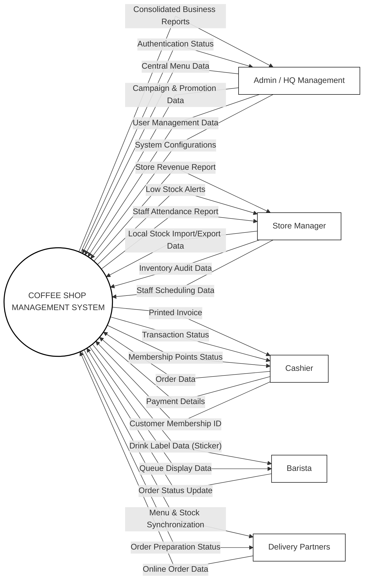


---

# 2. User Requirements

This section defines the system actors and maps their operational use cases within the Coffee Shop Management System. The use cases are partitioned into separate, clear diagrams per role to prevent overlapping paths and ensure clean software design boundaries.

---

## 2.1 Actors
The system defines the following roles (actors), structured under a generalization hierarchy where all roles inherit basic account privileges from a base `User` actor:

1. **User (Base Actor)**:
   - The generalization of all employee roles. Contains basic access control, profile viewing, and password management.
2. **Admin (HQ Management)**:
   - Inherits from `User`. Manages master data (users, vouchers, menu) and views brand-level business reports.
3. **Store Manager**:
   - Inherits from `User`. Manages local inventory logistics, shift scheduling, and views local store revenue audits.
4. **Cashier**:
   - Inherits from `User`. Operates the POS terminal for order-taking, member lookups, checkout, and receipt printing.
5. **Barista**:
   - Inherits from `User`. Coordinates drink preparation using the queue monitor and prints label stickers.
6. **Delivery Partner**:
   - An external API actor that automates online order ingestion and availability syncs.

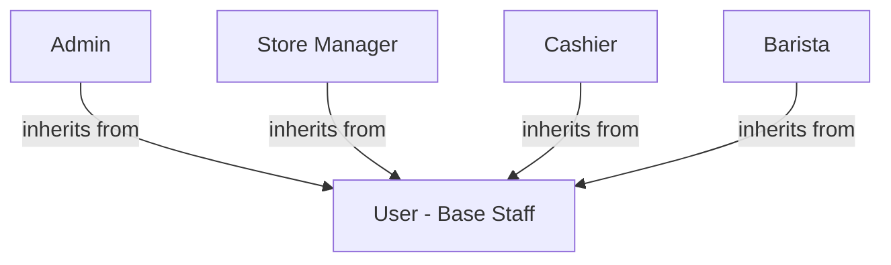

---

## 2.2 Use Cases

### 2.2.1 General User & Authentication Use Cases
This diagram defines common access operations available to any authenticated employee.

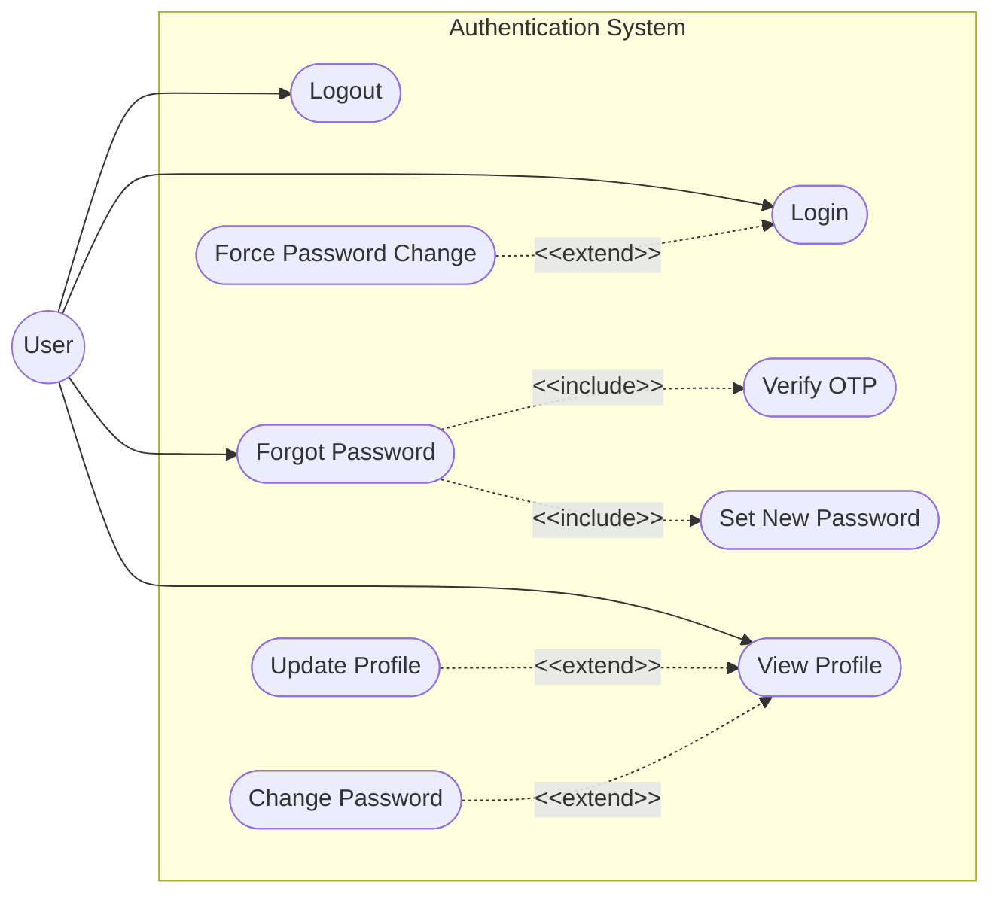

---

### 2.2.2 Admin Use Cases
The Admin actor manages central catalog assets, customer accounts, vouchers, and reviews consolidated brand reports.

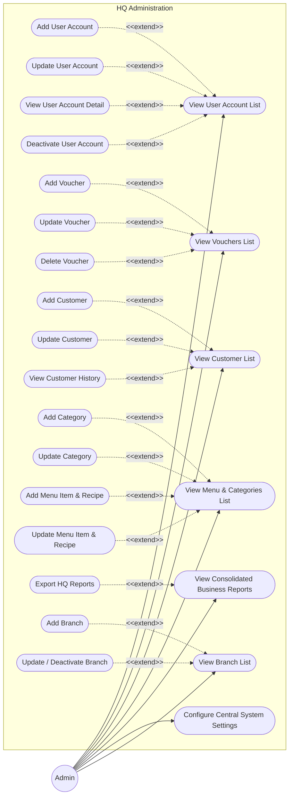


---

### 2.2.3 Store Manager Use Cases
The Store Manager oversees local inventory adjustments, scheduling staff shifts, and local store financial reports.

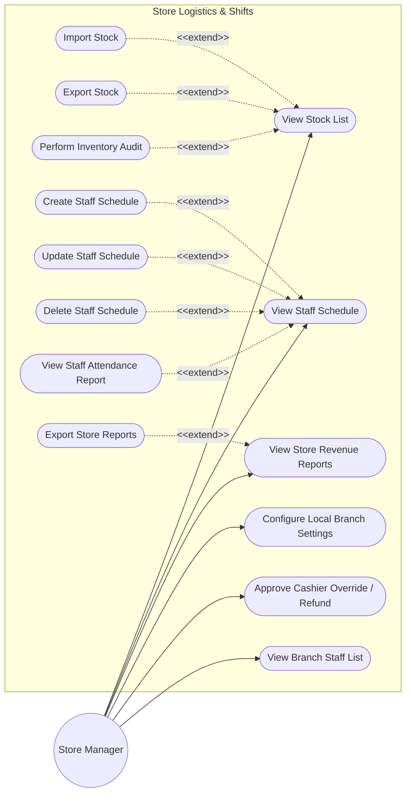


---

### 2.2.4 Cashier Use Cases
The Cashier uses the POS terminal to process orders, apply vouchers, lookup customer memberships, and print receipts.

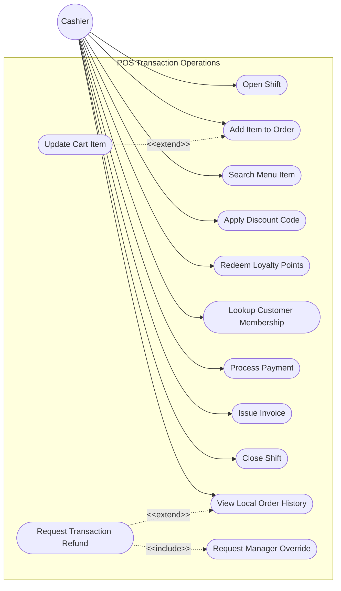


---

### 2.2.5 Barista Use Cases
The Barista tracks drink prep status, prints cup labels, and escalates preparation issues in the beverage preparation area.

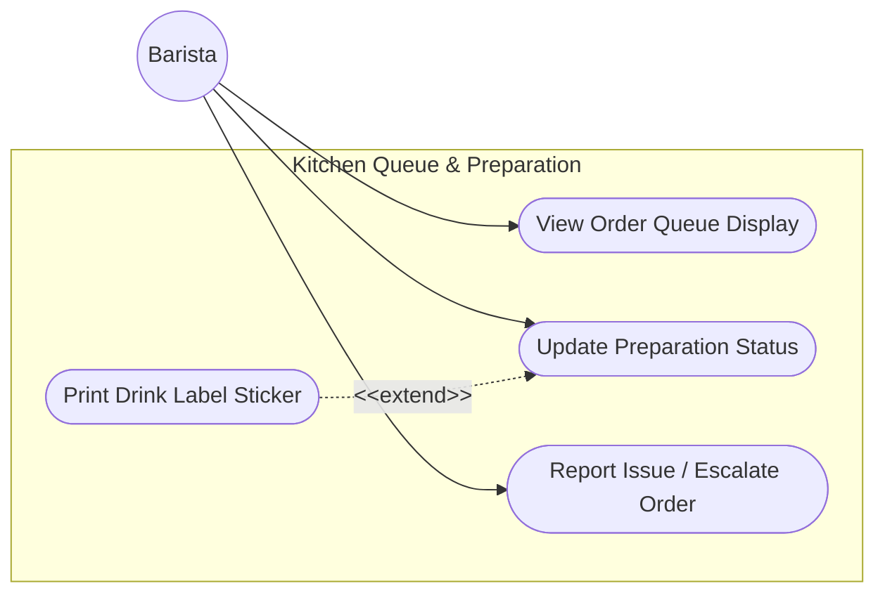

---

## 2.3 Use Case Descriptions
This part describes the use cases & their main flow (the list of the user actions and corresponding system responses that will take place during execution of the use case under normal, expected conditions), using the table format below.

| ID | Group function | Use Case | Actors | Use Case Description & Main Flow |
|---|---|---|---|---|
| **UC-01** | Authentication & Profile | Login | User (Base Staff) | **Description**: Authenticates employee entry to the application.<br>**Main Flow**:<br>1. User enters username and password.<br>2. User accesses the system and is directed to their operational portal. |
| **UC-02** | Authentication & Profile | Logout | User (Base Staff) | **Description**: Terminates active session.<br>**Main Flow**:<br>1. User signs out of the application.<br>2. User is redirected back to the login gateway. |
| **UC-03** | Authentication & Profile | Forgot Password | User (Base Staff) | **Description**: Requests password recovery details.<br>**Main Flow**:<br>1. User submits their email address.<br>2. User receives a verification code via email. |
| **UC-04** | Authentication & Profile | Verify OTP | User (Base Staff) | **Description**: Validates the recovery code.<br>**Main Flow**:<br>1. User submits the verification code.<br>2. User is permitted to configure a new password. |
| **UC-05** | Authentication & Profile | Set New Password | User (Base Staff) | **Description**: Creates a new secure password.<br>**Main Flow**:<br>1. User submits the new password.<br>2. User is returned to the login page to sign in again. |
| **UC-06** | Authentication & Profile | Force Password Change | User (Base Staff) | **Description**: Mandates password update upon first sign-in.<br>**Main Flow**:<br>1. User signs in with initial temporary credentials.<br>2. User is immediately prompted to replace the temporary password with a personal one before performing work. |
| **UC-07** | Authentication & Profile | View Profile | User (Base Staff) | **Description**: Accesses employee details.<br>**Main Flow**:<br>1. User opens their profile details.<br>2. User views their contact details, assigned branch, and operational role. |
| **UC-08** | Authentication & Profile | Update Profile | User (Base Staff) | **Description**: Edits employee contact information.<br>**Main Flow**:<br>1. User updates contact details (e.g., phone or email) and saves.<br>2. The profile displays the updated information. |
| **UC-09** | Authentication & Profile | Change Password | User (Base Staff) | **Description**: Modifies active password.<br>**Main Flow**:<br>1. User enters current password and a new secure password.<br>2. User receives a password change confirmation. |
| **UC-10** | User Management | View User Account List | Admin | **Description**: Lists employee user accounts.<br>**Main Flow**:<br>1. Admin opens the employee list.<br>2. Admin views active, suspended, and role-categorized profiles. |
| **UC-11** | User Management | Add User Account | Admin | **Description**: Registers a new employee profile.<br>**Main Flow**:<br>1. Admin submits new employee info, role, and branch assignment.<br>2. A new staff profile is created, enabling them to log in. |
| **UC-12** | User Management | Update User Account | Admin | **Description**: Modifies employee details.<br>**Main Flow**:<br>1. Admin edits employee details and saves.<br>2. The employee profile is updated. |
| **UC-13** | User Management | View User Account Detail | Admin | **Description**: Audits employee history.<br>**Main Flow**:<br>1. Admin selects a user profile.<br>2. Admin reviews profile metadata and activity records. |
| **UC-14** | User Management | Deactivate User Account | Admin | **Description**: Revokes employee system access.<br>**Main Flow**:<br>1. Admin suspends employee profile.<br>2. Active access is revoked, preventing further login. |
| **UC-15** | Menu & Categories | View Menu & Categories List | Admin | **Description**: Reviews catalog items.<br>**Main Flow**:<br>1. Admin opens the product catalog.<br>2. Admin reviews categories, active dishes/beverages, and prices. |
| **UC-16** | Menu & Categories | Add Category | Admin | **Description**: Creates a new product category.<br>**Main Flow**:<br>1. Admin inputs category details and saves.<br>2. New category is added to the menu configuration. |
| **UC-17** | Menu & Categories | Update Category | Admin | **Description**: Modifies category settings.<br>**Main Flow**:<br>1. Admin updates category details or visibility.<br>2. The category parameters are updated. |
| **UC-18** | Menu & Categories | Add Menu Item & Recipe | Admin | **Description**: Creates a new product and links its raw recipe.<br>**Main Flow**:<br>1. Admin inputs name, price, barcode, and raw ingredient list.<br>2. The product and recipe are registered, making them available for checkout. |
| **UC-19** | Menu & Categories | Update Menu Item & Recipe | Admin | **Description**: Edits product details or recipes.<br>**Main Flow**:<br>1. Admin alters item pricing, availability, or raw material recipe counts.<br>2. Adjustments are saved, instantly modifying local POS catalogs. |
| **UC-20** | Voucher Management | View Vouchers List | Admin | **Description**: Lists active discount promotions.<br>**Main Flow**:<br>1. Admin opens promotions list.<br>2. Admin views campaign details, voucher codes, and usage metrics. |
| **UC-21** | Voucher Management | Add Voucher | Admin | **Description**: Configures new promotional discount.<br>**Main Flow**:<br>1. Admin submits voucher code, discount values, minimum caps, and active dates.<br>2. The voucher configuration is saved. |
| **UC-22** | Voucher Management | Update Voucher | Admin | **Description**: Edits voucher parameters.<br>**Main Flow**:<br>1. Admin adjusts campaign dates, total usage caps, or customer limits.<br>2. The voucher rules are updated. |
| **UC-23** | Voucher Management | Delete Voucher | Admin | **Description**: Deactivates or removes a voucher code.<br>**Main Flow**:<br>1. Admin selects voucher and deactivates it.<br>2. The voucher code is disabled, preventing further usage at checkout. |
| **UC-24** | Customer Management | View Customer List | Admin | **Description**: Reviews membership registry.<br>**Main Flow**:<br>1. Admin views customer directory.<br>2. Admin reviews list of active members and membership levels. |
| **UC-25** | Customer Management | Add Customer | Admin | **Description**: Registers a new membership customer.<br>**Main Flow**:<br>1. Admin enters member details (name, phone, email) and saves.<br>2. Customer is registered as a Bronze loyalty member. |
| **UC-26** | Customer Management | Update Customer | Admin | **Description**: Modifies customer details.<br>**Main Flow**:<br>1. Admin edits member details and saves.<br>2. The membership profile is updated. |
| **UC-27** | Customer Management | View Customer History | Admin | **Description**: Reviews membership loyalty records.<br>**Main Flow**:<br>1. Admin opens member profile.<br>2. Admin reviews historical orders, point accumulation ledger, and milestones. |
| **UC-28** | Reports & Analytics | View Consolidated Business Reports | Admin | **Description**: Accesses centralized reports.<br>**Main Flow**:<br>1. Admin opens consolidation dashboard.<br>2. Admin reviews global brand revenue, compares branch performance, and views best-seller charts. |
| **UC-29** | Reports & Analytics | Export HQ Reports | Admin | **Description**: Downloads brand report sheets.<br>**Main Flow**:<br>1. Admin triggers export.<br>2. The report files are generated and downloaded. |
| **UC-30** | System Configuration | Configure Central System Settings | Admin | **Description**: Configures central parameters.<br>**Main Flow**:<br>1. Admin modifies tax rates, loyalty points rates, or API credentials.<br>2. Changes to central configurations are saved. |
| **UC-31** | Inventory Management | View Stock List | Store Manager | **Description**: Reviews store stock levels.<br>**Main Flow**:<br>1. Manager opens branch inventory list.<br>2. Manager reviews raw materials quantities and low stock indicators. |
| **UC-32** | Inventory Management | Import Stock | Store Manager | **Description**: Logs raw material receipt from suppliers.<br>**Main Flow**:<br>1. Manager inputs invoice detail, items, and quantities received.<br>2. Stock counts are updated and import actions are recorded. |
| **UC-33** | Inventory Management | Export Stock | Store Manager | **Description**: Logs physical material withdrawal.<br>**Main Flow**:<br>1. Manager selects items, inputs quantities, and reasons (e.g., wastage/damage).<br>2. Stock counts are updated and export actions are recorded. |
| **UC-34** | Inventory Management | Perform Inventory Audit | Store Manager | **Description**: Conducts physical inventory audit.<br>**Main Flow**:<br>1. Manager inputs physically counted stock quantities.<br>2. Any discrepancy is calculated, stock counts are reconciled, and stock balances are updated. |
| **UC-35** | Staff & Schedule | View Staff Schedule | Store Manager | **Description**: Displays shift calendar.<br>**Main Flow**:<br>1. Manager accesses scheduling calendar.<br>2. Manager reviews cashier and barista shift assignments. |
| **UC-36** | Staff & Schedule | Create Staff Schedule | Store Manager | **Description**: Assigns employee to shift.<br>**Main Flow**:<br>1. Manager assigns employee, date, and shift time.<br>2. The shift is registered and the calendar is updated. |
| **UC-37** | Staff & Schedule | Update Staff Schedule | Store Manager | **Description**: Modifies schedule assignments.<br>**Main Flow**:<br>1. Manager adjusts shift dates or employee assignments on the calendar.<br>2. The scheduling calendar is updated. |
| **UC-38** | Staff & Schedule | Delete Staff Schedule | Store Manager | **Description**: Removes shift assignments.<br>**Main Flow**:<br>1. Manager deletes a shift assignment.<br>2. The shift assignment is removed and the calendar is updated. |
| **UC-39** | Staff & Schedule | View Staff Attendance Report | Store Manager | **Description**: Accesses attendance sheets.<br>**Main Flow**:<br>1. Manager displays attendance details.<br>2. Manager reviews check-in/out logs, showing late times. |
| **UC-66** | Staff & Schedule | View Branch Staff List | Store Manager | **Description**: Reviews the roster list and contact profiles of staff assigned to their branch.<br>**Main Flow**:<br>1. Store Manager opens the Branch Staff list module.<br>2. Portal retrieves active and deactivated users whose assigned branch matches the manager's branch.<br>3. Portal shows aggregated stats and lists cards containing Names, Roles, Contacts and Badges. |
| **UC-40** | Reports & Analytics | View Store Revenue Reports | Store Manager | **Description**: Accesses local branch reports.<br>**Main Flow**:<br>1. Manager opens store report panel.<br>2. Manager reviews local sales revenue, shift closures, and payment breakdowns. |
| **UC-41** | Reports & Analytics | Export Store Reports | Store Manager | **Description**: Exports store-specific files.<br>**Main Flow**:<br>1. Manager exports local sales and inventory spreadsheets.<br>2. Report files are generated and downloaded. |
| **UC-42** | System Configuration | Configure Local Branch Settings | Store Manager | **Description**: Manages branch-level hardware/network.<br>**Main Flow**:<br>1. Manager configures printer IPs or local POS register IDs.<br>2. Branch configurations are saved. |
| **UC-43** | POS Sales & Billing | Approve Cashier Override / Refund | Store Manager | **Description**: Approves cashier transactions.<br>**Main Flow**:<br>1. Cashier triggers auth prompt on POS; Manager scans badge or enters passcode.<br>2. Manager reviews override details and confirms transaction. |
| **UC-44** | POS Sales & Billing | Open Shift | Cashier | **Description**: Opens cashier POS session.<br>**Main Flow**:<br>1. Cashier inputs POS register ID and opening drawer cash float (VND).<br>2. The shift state is validated and the session is opened. |
| **UC-45** | POS Sales & Billing | Add Item to Order | Cashier | **Description**: Adds product to checkout cart.<br>**Main Flow**:<br>1. Cashier clicks a menu item or scans SKU barcode.<br>2. Availability is validated and the item is added to the order cart. |
| **UC-46** | POS Sales & Billing | Update Cart Item | Cashier | **Description**: Modifies quantity or toppings in cart.<br>**Main Flow**:<br>1. Cashier adjusts quantity or selects option toppings.<br>2. The cart items are updated and the subtotal is recalculated. |
| **UC-47** | POS Sales & Billing | Search Menu Item | Cashier | **Description**: Quick item lookup.<br>**Main Flow**:<br>1. Cashier inputs search text or scans barcode.<br>2. The menu grid is filtered by name, abbreviation, or SKU. |
| **UC-48** | POS Sales & Billing | Apply Discount Code | Cashier | **Description**: Applies coupon code to cart.<br>**Main Flow**:<br>1. Cashier inputs voucher code or selects matching code.<br>2. Constraints are validated and the order total is updated. |
| **UC-49** | POS Sales & Billing | Redeem Loyalty Points | Cashier | **Description**: Redeems customer loyalty points for a cash discount at checkout.<br>**Main Flow**:<br>1. Cashier checks customer's available points balance.<br>2. Cashier enters points amount to redeem, applying a corresponding discount to the order. |
| **UC-50** | POS Sales & Billing | Lookup Customer Membership | Cashier | **Description**: Finds membership details for cart.<br>**Main Flow**:<br>1. Cashier inputs customer phone number.<br>2. Customer details are retrieved, and active discount rates are applied. |
| **UC-51** | POS Sales & Billing | Process Payment | Cashier | **Description**: Completes order transaction.<br>**Main Flow**:<br>1. Cashier selects payment method (dynamic VietQR/cash/card).<br>2. Payment is processed and the payment status is updated. |
| **UC-52** | POS Sales & Billing | Issue Invoice | Cashier | **Description**: Prints receipt and kitchen sticker.<br>**Main Flow**:<br>1. The receipt is printed upon payment completion.<br>2. Cashier hands invoice and sequential order sticker to client. |
| **UC-53** | POS Sales & Billing | Close Shift | Cashier | **Description**: Closes POS session.<br>**Main Flow**:<br>1. Cashier counts cash and inputs closing float.<br>2. Discrepancies are calculated and flagged, and the session is closed. |
| **UC-54** | POS Sales & Billing | View Local Order History | Cashier | **Description**: Displays local branch orders.<br>**Main Flow**:<br>1. Cashier opens order history grid.<br>2. Cash drawer orders processed during the current shift are displayed. |
| **UC-55** | POS Sales & Billing | Request Transaction Refund | Cashier | **Description**: Initiates refund process.<br>**Main Flow**:<br>1. Cashier selects order and clicks Refund Request.<br>2. The manager override credentials prompt is displayed. |
| **UC-56** | POS Sales & Billing | Request Manager Override | Cashier | **Description**: Requests authorization override.<br>**Main Flow**:<br>1. Cashier triggers manager approval modal on POS screen.<br>2. Cashier waits for Manager to enter credentials to bypass restriction. |
| **UC-57** | Order Prep & Queue | View Order Queue Display | Barista | **Description**: Monitors preparation queue.<br>**Main Flow**:<br>1. Barista opens queue display.<br>2. Pending, preparing, and ready orders are displayed. |
| **UC-58** | Order Prep & Queue | Update Preparation Status | Barista | **Description**: Modifies preparation flags.<br>**Main Flow**:<br>1. Barista selects active order and moves it to preparing/ready.<br>2. Timestamps are logged and the cashier status is updated. |
| **UC-59** | Order Prep & Queue | Print Drink Label Sticker | Barista | **Description**: Prints label stickers for cups.<br>**Main Flow**:<br>1. Barista clicks Print Sticker for drink item.<br>2. The label parameters are sent to the local printer. |
| **UC-60** | Order Prep & Queue | Report Issue / Escalate Order | Barista | **Description**: Flags order preparation errors.<br>**Main Flow**:<br>1. Barista reports machine/ingredient issue.<br>2. The order is marked with an issue flag, notifying POS cashiers. |
| **UC-61** | Inventory Management | View Import/Export History | Store Manager | **Description**: Reviews past stock movements.<br>**Main Flow**:<br>1. Manager opens history logs.<br>2. Details of stock imports and exports are displayed. |
| **UC-62** | Inventory Management | Auto-Deduct Inventory on Order Completion | System (automated) | **Description**: Automatically deducts ingredient quantities from stock based on the recipe formulation when an order transitions to the PREPARING state.<br>**Main Flow**:<br>1. Barista taps "START PREP" on an order.<br>2. System retrieves recipes for each menu item.<br>3. System deducts corresponding ingredient quantities and logs transactions. |
| **UC-63** | Branch Management | View Branch List | Admin | **Description**: Lists all registered branches and their statuses.<br>**Main Flow**:<br>1. Admin opens the Branch Management panel.<br>2. Admin views all branches with name, address, phone, and active/inactive status. |
| **UC-64** | Branch Management | Add Branch | Admin | **Description**: Registers a new store branch.<br>**Main Flow**:<br>1. Admin enters branch name, address, and phone number, then clicks "Save".<br>2. A new branch is created with active status and appears in the branch list. |
| **UC-65** | Branch Management | Update / Deactivate Branch | Admin | **Description**: Updates branch information or deactivates (closes) a branch.<br>**Main Flow**:<br>1. Admin edits branch details or sets status to Inactive, then clicks "Save".<br>2. Branch information is updated. If deactivated, all associated staff accounts are disabled and future schedules are cancelled. |


---

# 3.1 Functional Overview

This section outlines the application's design system structure, screen flows, security mappings, and the underlying data schema representing the system entities.

## 3.1.1 Screens Flow
The Coffee Shop Management System consists of distinct application interfaces mapped to roles. The screen transitions flow within role-specific portals as detailed below:

### 1. Common Authentication & Profile Screen Flow
Provides secure application entry, password recovery, mandatory first-time password resets, and profile management for all employees.


### 2. HQ Admin Portal Screen Flow
A desktop portal enabling administrative personnel to manage employees, global menus, vouchers, customer records, global settings, and view brand-wide reports.

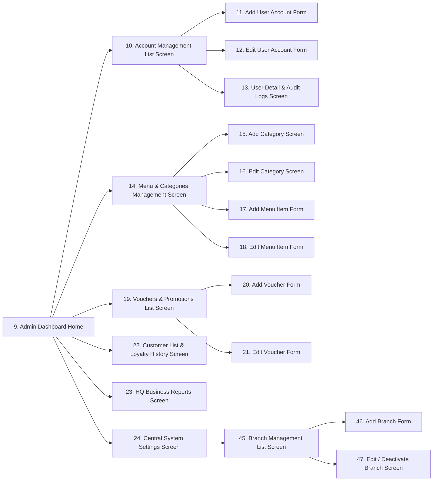

### 3. Store Manager Console Screen Flow
A tablet or desktop dashboard for local store management overseeing logistics, inventory items, audits, scheduling, and store-specific performance logs.

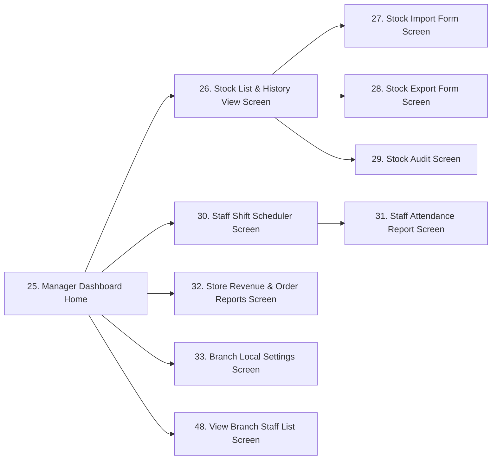

### 4. Cashier POS Terminal Screen Flow
An optimized touchscreen terminal interface designed to handle shift controls, scan items, search memberships, apply coupon codes, process transaction payments, print invoices, and initiate supervisor overrides.

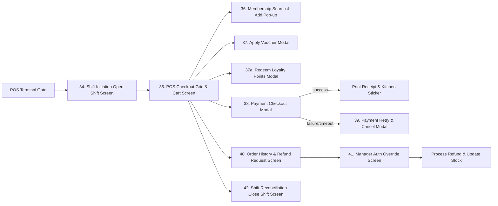

### 5. Barista Queue Monitor Screen Flow
An interactive tablet console in the preparation zone to manage product lines, change order processing flags, print cup stickers, and trigger item issue warnings.


---

## 3.1.2 Screen Descriptions
The system comprises the following screens across its user portals:

| # | Feature | Screen | Description |
|---|---|---|---|
| 1 | System Access & Security | Login Screen | Allows staff to securely access the system using their credentials. |
| | | Logout | Allow users to log out the system. |
| | | Forgot Password Screen | When users forget their password, they can retrieve it. |
| | | OTP Verification Screen | Verify user account via 6-digit OTP code. |
| | | Set New Password Screen | Allow users to set a new password after OTP verification. |
| | | Force Password Change Screen | Forces first-time login users to replace their temporary password before accessing the system. |
| | | View Profile Screen | Allow users to view personal information. |
| | | Edit Profile Screen | Allow users to update personal information. |
| | | Change Password Screen | Allows users to change their password. |
| 2 | User Account Management | Admin Dashboard Home | HQ Admin portal home screen with navigation to all administrative modules. |
| | | Account Management List Screen | Allows Admin to view all employee accounts. |
| | | Add User Account Form | Enables Admin to create and register new employee profiles. |
| | | Edit User Account Form | Allows Admin to edit employee details and roles. |
| | | User Detail & Audit Logs Screen | Displays profile details and historical activity records. |
| 3 | Menu & Category Management | Menu & Categories Management Screen | Main catalog panel to review product categories and menu listings. |
| | | Add Category Screen | Form to add a new category to the menu structure. |
| | | Edit Category Screen | Form to edit category details and visibility. |
| | | Add Menu Item Form | Form to create a new beverage or food entry with prices and recipes. |
| | | Edit Menu Item Form | Form to modify drink pricing, availability, or recipes. |
| 4 | Voucher Management | Vouchers & Promotions List Screen | Grid of active discount promotions, codes, and usage metrics. |
| | | Add Voucher Form | Form to configure new vouchers with discount rates and limits. |
| | | Edit Voucher Form | Form to modify voucher dates or total usage limits. |
| 5 | Customer Management | Customer List & Loyalty History Screen | Customer registry for searching and registering membership details. |
| 6 | Reports & Analytics | HQ Business Reports Screen | HQ dashboard comparing revenue, best-sellers, and store metrics. |
| | | Store Revenue & Order Reports Screen | Local branch dashboard showing sales, shift closures, and cash reports. |
| 7 | System Configuration | Central System Settings Screen | Central configuration screen for tax rates and brand settings. |
| | | Branch Local Settings Screen | Local settings screen for branch hardware and POS registers. |
| | | Branch Management List Screen | Lists all store branches with status indicators for Admin management. |
| | | Add Branch Form | Form for Admin to register a new store branch with name, address, and phone. |
| | | Edit / Deactivate Branch Screen | Form to modify branch details or deactivate (close) a branch. |
| 8 | Inventory Management | Manager Dashboard Home | Store Manager portal home screen with navigation to all manager modules. |
| | | Stock List & History View Screen | Displays branch inventory quantities and historical ledger logs. |
| | | Stock Import Form Screen | Form to record supplier inventory imports. |
| | | Stock Export Form Screen | Form to log physical stock exports, wastage, or damage. |
| | | Stock Audit Screen | Grid to count physical stock and reconcile discrepancies. |
| 9 | Staff & Shift Management | Staff Shift Scheduler Screen | Calendar to schedule cashiers and baristas into shift blocks. |
| | | Staff Attendance Report Screen | Logs check-in/out times and attendance details. |
| | | View Branch Staff List Screen | Roster directory showing assigned branch staff contact details and operational roles. |
| 10 | POS Sales & Billing | Shift Initiation Open Shift Screen | Prompts cashier for register ID and starting cash float. |
| | | POS Checkout Grid & Cart Screen | Main sales screen with catalog search and cart grid. |
| | | Membership Search & Add Pop-up | Modal to look up or register membership customers. |
| | | Apply Voucher Modal | Modal to select active vouchers matching cart values. |
| | | Redeem Loyalty Points Modal | Modal to input points count for customer cash discount redemptions. |
| | | Payment Checkout Modal | Modal to process card, cash, or dynamic QR code payments. |
| | | Payment Retry & Cancel Modal | Modal to handle payment failures and gateway timeouts. |
| | | Order History & Refund Request Screen | Logs local terminal transactions for refund requests. |
| | | Manager Auth Override Screen | Gate for manager credential validation during overrides. |
| | | Shift Reconciliation Close Shift Screen | Prompts cashier for counted closing cash drawer float input. |
| 11 | Order Prep & Queue | Barista Queue Monitor Screen | Live prep queue for Baristas showing order status columns. |
| | | Report Issue & Hold Order Screen | Modal to flag drink prep issues to cashiers and managers. |
---

## 3.1.3 Screen Authorization
The table below specifies access control policies across all 48 screens:

| Screen Name | Admin | Store Manager | Cashier | Barista |
|---|:---:|:---:|:---:|:---:|
| 1. Login Screen | Yes | Yes | Yes | Yes |
| 2. Forgot Password Screen | Yes | Yes | Yes | Yes |
| 3. OTP Verification Screen | Yes | Yes | Yes | Yes |
| 4. Set New Password Screen | Yes | Yes | Yes | Yes |
| 5. Force Password Change Screen | Yes | Yes | Yes | Yes |
| 6. View Profile Screen | Yes | Yes | Yes | Yes |
| 7. Edit Profile Screen | Yes | Yes | Yes | Yes |
| 8. Change Password Screen | Yes | Yes | Yes | Yes |
| Logout Screen/Action | Yes | Yes | Yes | Yes |
| 9. Admin Dashboard Home | **Yes** | No | No | No |
| 10. Account Management List | **Yes** | No | No | No |
| 11. Add User Account Form | **Yes** | No | No | No |
| 12. Edit User Account Form | **Yes** | No | No | No |
| 13. User Detail & Audit Logs | **Yes** | No | No | No |
| 14. Menu & Categories Management | **Yes** | No | No | No |
| 15. Add Category Screen | **Yes** | No | No | No |
| 16. Edit Category Screen | **Yes** | No | No | No |
| 17. Add Menu Item Form | **Yes** | No | No | No |
| 18. Edit Menu Item Form | **Yes** | No | No | No |
| 19. Vouchers & Promotions List | **Yes** | No | No | No |
| 20. Add Voucher Form | **Yes** | No | No | No |
| 21. Edit Voucher Form | **Yes** | No | No | No |
| 22. Customer List & Loyalty History | **Yes** | **Yes** | **Yes** | No |
| 23. HQ Business Reports | **Yes** | No | No | No |
| 24. Central System Settings | **Yes** | No | No | No |
| 25. Manager Dashboard Home | No | **Yes** | No | No |
| 26. Stock List & History View | **Yes** | **Yes** | No | No |
| 27. Stock Import Form | No | **Yes** | No | No |
| 28. Stock Export Form | No | **Yes** | No | No |
| 29. Stock Audit Screen | No | **Yes** | No | No |
| 30. Staff Shift Scheduler | No | **Yes** | No | No |
| 31. Staff Attendance Report | No | **Yes** | No | No |
| 32. Store Revenue & Order Reports | No | **Yes** | No | No |
| 33. Branch Local Settings | No | **Yes** | No | No |
| 34. Shift Initiation Open Shift | No | No | **Yes** | No |
| 35. POS Checkout Grid & Cart | No | No | **Yes** | No |
| 36. Membership Search & Add | No | No | **Yes** | No |
| 37. Apply Voucher Modal | No | No | **Yes** | No |
| 37a. Redeem Loyalty Points Modal | No | No | **Yes** | No |
| 38. Payment Checkout Modal | No | No | **Yes** | No |
| 39. Payment Retry & Cancel Modal | No | No | **Yes** | No |
| 40. Order History & Refund Request | No | No | **Yes** | No |
| 41. Manager Auth Override | **Yes** | **Yes** | No | No |
| 42. Shift Reconciliation Close Shift | No | No | **Yes** | No |
| 43. Barista Queue Monitor | No | Yes | Yes | **Yes** |
| 44. Report Issue & Hold Order | No | No | No | **Yes** |
| 45. Branch Management List | **Yes** | No | No | No |
| 46. Add Branch Form | **Yes** | No | No | No |
| 47. Edit / Deactivate Branch | **Yes** | No | No | No |
| 48. View Branch Staff List Screen | No | **Yes** | No | No |

---

## 3.1.4 Non-Screen Functions
These automated backend processes do not require direct human interaction:

| # | Feature | System Function | Description |
|---|---|---|---|
| 1 | System Access & Security | Logout | Invalidate the current user session or token and clear client-side storage. |
| 2 | System Access & Security | Silent Token Refresh | Automatically refresh JWT token in the background when it is close to expiration and client is active. |
| 3 | Inventory Management | Recipe-Based Stock Deduction | Automatically deduct stock ingredients based on menu recipes when an order moves to the PREPARING state. |
| 4 | Inventory Management | Low Stock Notification Engine | Evaluates active stock levels against thresholds in real-time, displaying alert badges and sending nightly aggregated emails at 22:00. |
| 5 | POS Transaction | Auto-Close Abandoned Shifts | Nightly scheduler runs at 11:59 PM to automatically close active cashier shifts left open, logging discrepancies. |
| 6 | POS Transaction | Order Timeout Handler | Automatically cancels orders that are in a pending payment state for more than 15 minutes. |
| 7 | Delivery Partner Integration | Auto-Sync Scheduler | Periodic background task running every 15 minutes to synchronize menu items, availability status, and inventory metrics with delivery partners. |
| 8 | Delivery Partner Integration | Real-time Out-of-Stock Webhooks | Immediately pushes out-of-stock statuses of menu items to third-party delivery partners when stock is depleted. |

---

## 3.1.5 Entity Relationship Diagram (ERD)
The entity relationships are structured as follows:

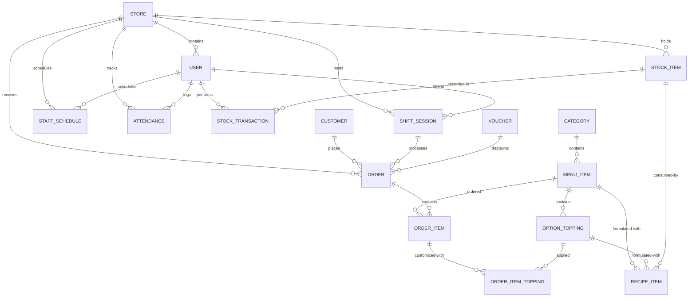

---

### Entities Description

| # | Entity | Description |
|---|---|---|
| 1 | users | Stores login credentials and role-based permissions for employees (Admin, Manager, Cashier, Barista) within the system. |
| 2 | categories | Represents main food and beverage groups to organize the product catalog. |
| 3 | menu_items | Holds individual beverage and food listings, including catalog pricing, barcodes, availability status, and image references. |
| 4 | option_toppings | Stores customizable add-ons that can be added to menu items. |
| 5 | customers | Registry of all enrolled loyalty membership customers, tracking membership tiers and accrued points. |
| 6 | shift_sessions | Tracks active work sessions of POS cashier registers, including opening/closing float values. |
| 7 | orders | Represents sales transactions, linking customers, shifts, payment statuses, and fulfillment statuses. |
| 8 | order_items | Line items detailing the specific menu products and quantities purchased in an order. |
| 9 | order_item_toppings | Tracks specific toppings applied to ordered menu items. |
| 10 | stock_items | Raw materials and shop supplies inventory quantities scoped per branch. |
| 11 | stock_transactions | Historical ledger recording inventory imports, exports, physical audits, and wastage logs. |
| 12 | vouchers | Stores promotional discount rules, coupon codes, validation dates, and customer usage limits. |
| 13 | recipe_items | Defines the raw stock ingredient quantity consumed to produce one unit of a menu item or topping. |
| 14 | stores | Represents physical store branches and geographic coffee shop locations. |
| 15 | staff_schedules | Stores assigned employee work shifts, scheduled date blocks, and register terminals allocations. |
| 16 | attendances | Logs employee clock-in/out timestamps, date records, and lateness metadata. |

---

### 3.1.6 Entity Details

### 1. `USER`
Represents employees and system administrators.

| # | Attribute name | PK | Type | Mandatory | Description |
|---|---|---|---|---|---|
| 1 | id | x | UUID | Yes | Unique identifier for the user. |
| 2 | username | | VARCHAR(50) | Yes | Account login name, unique. |
| 3 | password_hash | | VARCHAR(255) | Yes | Securely hashed password. |
| 4 | role | | Enum | Yes | User role: `ADMIN`, `STORE_MANAGER`, `CASHIER`, `BARISTA`. |
| 5 | full_name | | VARCHAR(100) | Yes | Employee full name. |
| 6 | is_active | | BOOLEAN | Yes | Current status of the account. |
| 7 | email | | VARCHAR(100) | Yes | Employee contact email address, unique. |
| 8 | phone | | VARCHAR(20) | Yes | Employee contact phone number. |
| 9 | store_id | | UUID | No | Foreign Key (FK) - references store/branch. Null for HQ Admin. |
| 10 | created_at | | TIMESTAMP | Yes | Account creation timestamp. |
| 11 | last_login_at | | TIMESTAMP | No | Timestamp of the most recent successful login. |
| 12 | must_change_password | | BOOLEAN | Yes | Flag indicating if the user must reset their password upon next login. Default: true. |

### 2. `CATEGORY`
Main food and beverage groups.

| # | Attribute name | PK | Type | Mandatory | Description |
|---|---|---|---|---|---|
| 1 | id | x | UUID | Yes | Unique identifier for the category. |
| 2 | name | | VARCHAR(100) | Yes | Category name (e.g., "Coffee", "Tea", "Pastry"). |
| 3 | description | | TEXT | No | Details of the category. |
| 4 | is_active | | BOOLEAN | Yes | Visibility flag. |

### 3. `MENU_ITEM`
Individual food/beverage listings.

| # | Attribute name | PK | Type | Mandatory | Description |
|---|---|---|---|---|---|
| 1 | id | x | UUID | Yes | Unique identifier for the menu item. |
| 2 | category_id | | UUID | Yes | Foreign Key (FK) - references CATEGORY(id). |
| 3 | name | | VARCHAR(100) | Yes | Name of the food or beverage (e.g., "Espresso", "Peach Tea"). |
| 4 | price | | DECIMAL(12,2) | Yes | Base price. |
| 5 | description | | TEXT | No | Description of the item. |
| 6 | is_available | | BOOLEAN | Yes | Availability status in stock. |
| 7 | image_url | | VARCHAR(255) | No | URL path to the product image file. |
| 8 | barcode | | VARCHAR(50) | No | Barcode or SKU for POS barcode scanner lookup (unique). |
| 9 | abbreviation | | VARCHAR(50) | Yes | Auto-generated abbreviation (e.g. cfd). |
| 10 | created_at | | TIMESTAMP | Yes | Date and time the item was added to the catalog. |
| 11 | is_deleted | | BOOLEAN | Yes | Soft-delete status flag. Default: false. |

### 4. `OPTION_TOPPING`
Add-ons like extra espresso shots, milk options, or tapioca pearls.

| # | Attribute name | PK | Type | Mandatory | Description |
|---|---|---|---|---|---|
| 1 | id | x | UUID | Yes | Unique identifier for the option/topping. |
| 2 | menu_item_id | | UUID | No | Foreign Key (FK) - references MENU_ITEM(id). Optional link, null for global toppings. |
| 3 | name | | VARCHAR(100) | Yes | Option or topping name (e.g., "Extra Espresso Shot", "Oat Milk"). |
| 4 | price | | DECIMAL(12,2) | Yes | Add-on cost in VND. |
| 5 | is_active | | BOOLEAN | Yes | Active/inactive visibility status. |

### 5. `CUSTOMER`
Registered membership details.

| # | Attribute name | PK | Type | Mandatory | Description |
|---|---|---|---|---|---|
| 1 | id | x | UUID | Yes | Unique identifier for the customer. |
| 2 | phone | | VARCHAR(20) | Yes | Primary lookup identifier (phone number, unique). |
| 3 | full_name | | VARCHAR(100) | Yes | Customer's full name. |
| 4 | points | | INTEGER | Yes | Loyalty points accrued. |
| 5 | membership_tier | | Enum | Yes | Loyalty tier: `BRONZE`, `SILVER`, `GOLD`, `DIAMOND`. |
| 6 | email | | VARCHAR(100) | No | Customer contact email. |
| 7 | created_at | | TIMESTAMP | Yes | Date and time of membership enrollment. |

### 6. `SHIFT_SESSION`
Tracks cashier sessions at POS terminals.

| # | Attribute name | PK | Type | Mandatory | Description |
|---|---|---|---|---|---|
| 1 | id | x | UUID | Yes | Unique identifier for the shift session. |
| 2 | store_id | | UUID | Yes | Foreign Key (FK) - references store branch. |
| 3 | user_id | | UUID | Yes | Foreign Key (FK) - references USER(id). The cashier who opened the shift. |
| 4 | start_time | | TIMESTAMP | Yes | Timestamp when the shift started. |
| 5 | end_time | | TIMESTAMP | No | Timestamp when the shift was closed. |
| 6 | starting_cash | | DECIMAL(12,2) | Yes | Float cash amount in cash drawer at start. |
| 7 | ending_cash | | DECIMAL(12,2) | No | Actual cash counted in drawer at close. |
| 8 | status | | Enum | Yes | Shift session status: `OPEN`, `CLOSED`. |
| 9 | pos_register_id | | VARCHAR(50) | Yes | Identifier of the POS terminal/register (e.g., "POS-01"). |

### 7. `ORDER`
Sales transactions.

| # | Attribute name | PK | Type | Mandatory | Description |
|---|---|---|---|---|---|
| 1 | id | x | UUID | Yes | Unique identifier for the order. |
| 2 | store_id | | UUID | Yes | Foreign Key (FK) - references store branch. |
| 3 | order_number | | VARCHAR(50) | Yes | Short 3-digit order sequence (e.g., `#001`), reset daily per branch. If the count exceeds 999, it continues to 1000 without truncating. |
| 4 | shift_session_id | | UUID | No | Foreign Key (FK) - references SHIFT_SESSION(id). Null for online delivery orders. |
| 5 | customer_id | | UUID | No | Foreign Key (FK) - references CUSTOMER(id). Null for guest orders. |
| 6 | voucher_id | | UUID | No | Foreign Key (FK) - references VOUCHER(id). Null if no discount applied. |
| 7 | order_type | | Enum | Yes | Order type: `DINE_IN`, `TAKE_AWAY`, `DELIVERY`. |
| 8 | subtotal | | DECIMAL(12,2) | Yes | Total price before discounts. |
| 9 | discount | | DECIMAL(12,2) | Yes | Total discount amount subtracted. |
| 10 | tax_amount | | DECIMAL(12,2) | Yes | The VAT amount calculated for this order based on global config. |
| 11 | total | | DECIMAL(12,2) | Yes | Net payable amount. |
| 12 | payment_method | | Enum | Yes | Payment method: `CASH`, `CARD`, `VIETQR`, `E_WALLET`, `DELIVERY_PLATFORM`. |
| 13 | payment_status | | Enum | Yes | Payment status: `PENDING`, `COMPLETED`, `FAILED`, `REFUNDED`. |
| 14 | order_status | | Enum | Yes | Fulfillment status: `PENDING`, `PREPARING`, `HOLD`, `READY`, `COMPLETED`, `CANCELLED`. |
| 15 | created_at | | TIMESTAMP | Yes | Date and time the order was placed. |

### 8. `ORDER_ITEM`
Line items in an order.

| # | Attribute name | PK | Type | Mandatory | Description |
|---|---|---|---|---|---|
| 1 | id | x | UUID | Yes | Unique identifier for the order line item. |
| 2 | order_id | | UUID | Yes | Foreign Key (FK) - references ORDER(id). |
| 3 | menu_item_id | | UUID | Yes | Foreign Key (FK) - references MENU_ITEM(id). |
| 4 | quantity | | INTEGER | Yes | Quantity purchased. |
| 5 | unit_price | | DECIMAL(12,2) | Yes | Price of the item at the time of purchase. |

### 9. `ORDER_ITEM_TOPPING`
Toppings attached to a specific order line item.

| # | Attribute name | PK | Type | Mandatory | Description |
|---|---|---|---|---|---|
| 1 | id | x | UUID | Yes | Unique identifier for the order item topping. |
| 2 | order_item_id | | UUID | Yes | Foreign Key (FK) - references ORDER_ITEM(id). |
| 3 | topping_id | | UUID | Yes | Foreign Key (FK) - references OPTION_TOPPING(id). |
| 4 | quantity | | INTEGER | Yes | Quantity of the topping applied. |
| 5 | unit_price | | DECIMAL(12,2) | Yes | Price of the topping at the time of purchase. |

### 10. `STOCK_ITEM`
Raw inventory tracking (e.g., Coffee Beans, Milk, Paper Cups) scoped per branch.

| # | Attribute name | PK | Type | Mandatory | Description |
|---|---|---|---|---|---|
| 1 | id | x | UUID | Yes | Unique identifier for the stock item. |
| 2 | store_id | | UUID | Yes | Foreign Key (FK) - references store branch. |
| 3 | name | | VARCHAR(100) | Yes | Item name (e.g., "Coffee Beans", "Milk"). |
| 4 | unit | | VARCHAR(20) | Yes | Unit of measurement (e.g., "kg", "liter", "piece"). |
| 5 | current_quantity | | DECIMAL(12,4) | Yes | Remaining physical amount in stock. |
| 6 | min_alert_threshold | | DECIMAL(12,4) | Yes | Threshold triggering low stock alert. |
| 7 | category | | VARCHAR(50) | Yes | Grouping label (e.g., "Ingredients", "Packaging"). |

### 11. `STOCK_TRANSACTION`
Historical ledger of stock modifications.

| # | Attribute name | PK | Type | Mandatory | Description |
|---|---|---|---|---|---|
| 1 | id | x | UUID | Yes | Unique identifier for the stock transaction. |
| 2 | stock_item_id | | UUID | Yes | Foreign Key (FK) - references STOCK_ITEM(id). |
| 3 | manager_id | | UUID | No | Foreign Key (FK) - references USER(id). The manager who logged it. Null for system-triggered automated recipe deductions. |
| 4 | transaction_type | | Enum | Yes | Transaction type: `IMPORT`, `EXPORT`, `AUDIT_ADJUSTMENT`. |
| 5 | quantity | | DECIMAL(12,4) | Yes | Volume of stock moved. |
| 6 | reason | | TEXT | No | Reason details (e.g., "Weekly Restock", "Soured Milk Disposal"). |
| 7 | created_at | | TIMESTAMP | Yes | Date and time of the transaction. |

### 12. `VOUCHER`
Marketing and promotional discount codes.

| # | Attribute name | PK | Type | Mandatory | Description |
|---|---|---|---|---|---|
| 1 | id | x | UUID | Yes | Unique identifier for the voucher. |
| 2 | code | | VARCHAR(50) | Yes | Unique alphanumeric code (e.g., "COFFEE20"). |
| 3 | discount_type | | Enum | Yes | Discount type: `PERCENTAGE`, `FIXED_AMOUNT`. |
| 4 | discount_value | | DECIMAL(12,2) | Yes | Value of discount (percentage or flat amount). |
| 5 | min_order_value | | DECIMAL(12,2) | Yes | Minimum subtotal value required to apply voucher. |
| 6 | start_date | | TIMESTAMP | Yes | Voucher validity start date and time. |
| 7 | end_date | | TIMESTAMP | Yes | Voucher expiration date and time. |
| 8 | is_active | | BOOLEAN | Yes | Active status flag. |
| 9 | usage_limit_per_customer | | INTEGER | No | Maximum usage count per customer (null for unlimited). |
| 10 | total_usage_count | | INTEGER | Yes | Total redemptions count across all customers. Default: 0. |
| 11 | max_total_uses | | INTEGER | No | Overall maximum total uses cap (null for unlimited). |

### 13. `RECIPE_ITEM`
Defines the ingredients/stock consumed to produce menu items and toppings.

| # | Attribute name | PK | Type | Mandatory | Description |
|---|---|---|---|---|---|
| 1 | id | x | UUID | Yes | Unique identifier for the recipe item. |
| 2 | menu_item_id | | UUID | No | Foreign Key (FK) - references MENU_ITEM(id). Nullable if linked to topping instead. |
| 3 | option_topping_id | | UUID | No | Foreign Key (FK) - references OPTION_TOPPING(id). Nullable if linked to menu item instead. |
| 4 | stock_item_id | | UUID | Yes | Foreign Key (FK) - references STOCK_ITEM(id) being consumed. |
| 5 | quantity_required | | DECIMAL(12,4) | Yes | Ingredient quantity required to produce one unit of menu item or topping. |

### 14. `STORE`
Represents physical store branches and geographic coffee shop locations.

| # | Attribute name | PK | Type | Mandatory | Description |
|---|---|---|---|---|---|
| 1 | id | x | UUID | Yes | Unique identifier for the store branch. |
| 2 | name | | VARCHAR(100) | Yes | Store/Branch name (e.g. "Nguyen Du Branch"). |
| 3 | address | | VARCHAR(255) | Yes | Physical address of the branch store. |
| 4 | phone | | VARCHAR(20) | Yes | Branch contact phone number. |
| 5 | is_active | | BOOLEAN | Yes | Flag indicating if store is active. Default: true. |
| 6 | created_at | | TIMESTAMP | Yes | Timestamp of store registration. |

### 15. `STAFF_SCHEDULE`
Stores assigned employee work shifts, scheduled date blocks, and register terminals allocations.

| # | Attribute name | PK | Type | Mandatory | Description |
|---|---|---|---|---|---|
| 1 | id | x | UUID | Yes | Unique identifier for the schedule slot. |
| 2 | store_id | | UUID | Yes | Foreign Key (FK) - references STORE(id). Scopes schedule to branch. |
| 3 | user_id | | UUID | Yes | Foreign Key (FK) - references USER(id). The scheduled employee. |
| 4 | shift_date | | DATE | Yes | Date of the scheduled shift. |
| 5 | shift_type | | Enum | Yes | Shift type block: `MORNING`, `AFTERNOON`, `FULL_DAY`. |
| 6 | pos_register_id | | VARCHAR(50) | No | Reference to register terminal ID, if register allocated. |
| 7 | created_at | | TIMESTAMP | Yes | Timestamp when schedule slot was created. |

### 16. `ATTENDANCE`
Logs employee clock-in/out timestamps, date records, and lateness metadata.

| # | Attribute name | PK | Type | Mandatory | Description |
|---|---|---|---|---|---|
| 1 | id | x | UUID | Yes | Unique identifier for the attendance slot. |
| 2 | store_id | | UUID | Yes | Foreign Key (FK) - references STORE(id). Scopes attendance to branch. |
| 3 | user_id | | UUID | Yes | Foreign Key (FK) - references USER(id). The employee user profile. |
| 4 | shift_date | | DATE | Yes | Date of the recorded attendance. |
| 5 | check_in_at | | TIMESTAMP | No | Actual clock-in timestamp (null if absent). |
| 6 | check_out_at | | TIMESTAMP | No | Actual clock-out timestamp (null if absent or active shift). |
| 7 | lateness_minutes | | INTEGER | Yes | Calculated late check-in minutes relative to shift. Default: 0. |
| 8 | status | | Enum | Yes | Attendance status: `ON_TIME`, `LATE`, `ABSENT`. Default: `ABSENT`. |


---

# 3.2 System Access & Security

This section details the functional requirements for authentication, user profiles, and employee account administration.

---

## 3.2.1 F01 - Login / UC-01 Login

### 3.2.1.1 Screen Mock-up (Mobile Portrait)
```
+------------------------------------+
|               Login                |
|                                    |
|  [Logo Coffee Shop]                |
|                                    |
|  User Name                         |
|  [ Username                      ] |
|                                    |
|  Password                          |
|  [ **********                    ] |
|                                    |
|         [      LOGIN      ]        |
|                                    |
|         _Forgot Password?_         |
|                                    |
+------------------------------------+
```

#### Table 3-1: Screen Definition
| # | Field Name | Type | Mandatory | Max Length | Description |
|---|---|---|---|---|---|
| 1 | User Name | Text | Yes | 50 | Account login name. |
| 2 | Password | Password | Yes | 255 | Masked input field for password entry. |
| 3 | Login | Button | | | Triggers credential verification and logs the user in. |
| 4 | Forgot Password | Link | | | Navigates user to Forgot Password flow. |

### 3.2.1.2 Use Case Description

| Use Case ID | UC-01 | Use Case Name | Login |
|---|---|---|---|
| **Author** | Antigravity | **Version** | 1.0 |
| **Date** | 2026-05-24 | | |

| Field | Description |
|---|---|
| **Actor** | Admin, Store Manager, Cashier, Barista |
| **Description** | Allows authorized staff members to authenticate and access their specific operational portals. |
| **Precondition** | User account is active and user is not currently logged in. |
| **Trigger** | User opens the application and lands on the Login screen. |
| **Post-Condition** | User is successfully authenticated, session is established, and user is redirected to their homepage. |

#### Main Flows
| Step | Actor | Action |
|---|---|---|
| 1 | User | Enters Username and Password, and clicks the "Login" button. |
| 2 | Portal | Verifies the credentials and checks account status. |
| 3 | Portal | Validates successful login and redirects the user to the interface matching their role. |

#### Alternative Flows
##### AT1: Invalid Credentials
- **Trigger**: At step 2, the user enters incorrect username or password.

| Sub-step | Actor | Action |
|---|---|---|
| 2.1 | Portal | Displays warning message: `"Incorrect username or password. Remaining attempts: {count}."` (MSG02) |

##### AT2: Mandatory Password Reset
- **Trigger**: At step 3, the account is flagged for mandatory password change.

| Sub-step | Actor | Action |
|---|---|---|
| 3.1 | Portal | Redirects the user immediately to the Force Password Change screen and restricts access to other areas. |

##### AT3: Too Many Failed Login Attempts
- **Trigger**: At step 2, 5 consecutive failed login attempts occur.

| Sub-step | Actor | Action |
|---|---|---|
| 2.1 | Portal | Suspends the user account from login attempts for 15 minutes. |

#### Business Rules
| ID | Rule Description |
|---|---|
| BR-10 | Accounts with `is_active = false` must be blocked from logging in. |
| BR-11 | Account suspension lasts exactly 15 minutes after 5 consecutive failed attempts. |
| BR-12 | Mandatory password change flag blocks navigation to any other module. |

---

## 3.2.2 F02 - Logout / UC-02 Logout

### 3.2.2.1 Screen Mock-up (Mobile Portrait Confirmation)
```
+------------------------------------+
|        Logout Confirmation         |
|                                    |
|                                    |
|   Are you sure you want to log     |
|   out of the application?          |
|                                    |
|                                    |
|      [ Cancel ]     [ Log Out ]    |
|                                    |
+------------------------------------+
```

#### Table 3-2: Screen Definition
| # | Field Name | Type | Mandatory | Max Length | Description |
|---|---|---|---|---|---|
| 1 | Cancel | Button | | | Aborts logout flow and returns to current active page. |
| 2 | Log Out | Button | | | Clears active session, logs action, and returns to Login. |

### 3.2.2.2 Use Case Description

| Use Case ID | UC-02 | Use Case Name | Logout |
|---|---|---|---|
| **Author** | Antigravity | **Version** | 1.0 |
| **Date** | 2026-05-24 | | |

| Field | Description |
|---|---|
| **Actor** | Admin, Store Manager, Cashier, Barista |
| **Description** | Safely terminates the active user session. |
| **Precondition** | User is authenticated. |
| **Trigger** | User clicks the "Logout" button/link. |
| **Post-Condition** | Active session tokens are cleared, logout is logged, and user is returned to Login screen. |

#### Main Flows
| Step | Actor | Action |
|---|---|---|
| 1 | User | Clicks the Logout option. |
| 2 | Portal | Displays logout confirmation modal. |
| 3 | User | Clicks "Log Out" button. |
| 4 | Portal | Terminates active session, records timestamp, and redirects to Login screen. |

#### Alternative Flows
##### AT1: Active Shift Check
- **Trigger**: At step 2, Cashier has an active POS shift open.

| Sub-step | Actor | Action |
|---|---|---|
| 2.1 | Portal | Displays warning message: `"You have an active shift session open. Please close your shift before logging out."` |
| 2.2 | Cashier | Chooses to proceed with logout anyway, or cancels to close shift first. |

#### Business Rules
| ID | Rule Description |
|---|---|
| BR-13 | Logout time must be logged upon termination of user session. |

---

## 3.2.3 F03 - Change Password / UC-09 Change Password

### 3.2.3.1 Screen Mock-up (Mobile Portrait)
```
+------------------------------------+
|          Change Password           |
|                                    |
|  Current Password                  |
|  [ **********                    ] |
|                                    |
|  New Password                      |
|  [ **********                    ] |
|                                    |
|  Confirm New Password              |
|  [ **********                    ] |
|                                    |
|         [ SAVE CHANGES ]           |
|                                    |
+------------------------------------+
```

#### Table 3-3: Screen Definition
| # | Field Name | Type | Mandatory | Max Length | Description |
|---|---|---|---|---|---|
| 1 | Current Password | Password | Yes | 255 | Current masked password. |
| 2 | New Password | Password | Yes | 255 | New password adhering to complexity requirements. |
| 3 | Confirm New Password | Password | Yes | 255 | Re-enter new password to verify match. |
| 4 | Save Changes | Button | | | Submits change request. |

### 3.2.3.2 Use Case Description

| Use Case ID | UC-09 | Use Case Name | Change Password |
|---|---|---|---|
| **Author** | Antigravity | **Version** | 1.0 |
| **Date** | 2026-05-24 | | |

| Field | Description |
|---|---|
| **Actor** | Admin, Store Manager, Cashier, Barista |
| **Description** | Allows logged-in users to update their password. |
| **Precondition** | User is authenticated. |
| **Trigger** | User navigates to Change Password screen in settings. |
| **Post-Condition** | User's password is changed successfully. |

#### Main Flows
| Step | Actor | Action |
|---|---|---|
| 1 | User | Inputs Current Password, New Password, and Confirm Password, then clicks "Save Changes". |
| 2 | Portal | Verifies that Current Password is correct and New Password matches Confirm Password. |
| 3 | Portal | Saves new password, displays success message, and terminates other active sessions. |

#### Alternative Flows
##### AT1: Current Password Incorrect
- **Trigger**: At step 2, Current Password does not match recorded password.

| Sub-step | Actor | Action |
|---|---|---|
| 2.1 | Portal | Displays error message: `"The current password entered is incorrect."` |

##### AT2: Password Complexity Failed
- **Trigger**: At step 2, New Password does not meet complexity guidelines.

| Sub-step | Actor | Action |
|---|---|---|
| 2.1 | Portal | Displays error message: `"Password must be at least 8 characters long and contain uppercase, lowercase, numeric, and special characters."` |

##### AT3: Password Mismatch
- **Trigger**: At step 2, New Password and Confirm Password do not match.

| Sub-step | Actor | Action |
|---|---|---|
| 2.1 | Portal | Displays error message: `"Confirm password does not match the new password."` |

#### Business Rules
| ID | Rule Description |
|---|---|
| BR-14 | New passwords must be at least 8 characters, containing at least one uppercase letter, one lowercase letter, one number, and one special character. |
| BR-15 | New passwords cannot match the current password. |

---

## 3.2.4 F04 - Forgot Password / UC-03 Forgot Password

### 3.2.4.1 Screen Mock-up (Mobile Portrait)
```
+------------------------------------+
|          Forgot Password           |
|                                    |
|  Enter your registered email to    |
|  receive a verification OTP code.  |
|                                    |
|  Email Address                     |
|  [ email@example.com             ] |
|                                    |
|         [   SEND OTP   ]           |
|                                    |
|         _Back to Login_            |
+------------------------------------+
```

#### Table 3-4: Screen Definition
| # | Field Name | Type | Mandatory | Max Length | Description |
|---|---|---|---|---|---|
| 1 | Email Address | Text | Yes | 100 | Registered work email address. |
| 2 | Send OTP | Button | | | Triggers sending verification OTP code to email. |
| 3 | Back to Login | Link | | | Navigates user back to Login screen. |

### 3.2.4.2 Use Case Description

| Use Case ID | UC-03 | Use Case Name | Forgot Password |
|---|---|---|---|
| **Author** | Antigravity | **Version** | 1.0 |
| **Date** | 2026-05-24 | | |

| Field | Description |
|---|---|
| **Actor** | Admin, Store Manager, Cashier, Barista |
| **Description** | Initiates password recovery when a user forgets their credentials. |
| **Precondition** | User is not logged in. |
| **Trigger** | User clicks the "Forgot Password" link on the Login screen. |
| **Post-Condition** | If email is valid, OTP code is emailed and user is sent to OTP verification view. |

#### Main Flows
| Step | Actor | Action |
|---|---|---|
| 1 | User | Enters registered email address and clicks "Send OTP". |
| 2 | Portal | Checks if the email is associated with an active user account. |
| 3 | Portal | Generates a 6-digit OTP code (valid for 10 minutes), emails it to the user, and redirects user to OTP Verification screen. |

#### Alternative Flows
##### AT1: Non-existent Email
- **Trigger**: At step 2, email address is not found.

| Sub-step | Actor | Action |
|---|---|---|
| 2.1 | Portal | Displays standard confirmation message to prevent account harvesting: `"If this email is registered, you will receive a reset OTP shortly."` |

#### Business Rules
| ID | Rule Description |
|---|---|
| BR-16 | OTP validity duration is exactly 10 minutes. |

---

## 3.2.5 F05 - Verify OTP / UC-04 Verify OTP

### 3.2.5.1 Screen Mock-up (Mobile Portrait)
```
+------------------------------------+
|             Verify OTP             |
|                                    |
|  Enter the 6-digit verification    |
|  code sent to your email.          |
|                                    |
|  Verification Code                 |
|  [ _ _ _ _ _ _ ]                   |
|                                    |
|         [  VERIFY CODE  ]          |
|                                    |
|         _Resend Code (59s)_        |
+------------------------------------+
```

#### Table 3-5: Screen Definition
| # | Field Name | Type | Mandatory | Max Length | Description |
|---|---|---|---|---|---|
| 1 | Verification Code | Text | Yes | 6 | 6-digit numeric recovery code. |
| 2 | Verify Code | Button | | | Submits OTP for validation. |
| 3 | Resend Code | Link | | | Resends OTP (disabled during 60-second cooldown). |

### 3.2.5.2 Use Case Description

| Use Case ID | UC-04 | Use Case Name | Verify OTP |
|---|---|---|---|
| **Author** | Antigravity | **Version** | 1.0 |
| **Date** | 2026-05-24 | | |

| Field | Description |
|---|---|
| **Actor** | Admin, Store Manager, Cashier, Barista |
| **Description** | Validates the 6-digit verification code sent during password recovery. |
| **Precondition** | Forgot password request has been initiated. |
| **Trigger** | Redirected from Forgot Password view. |
| **Post-Condition** | Code is validated, and user is sent to Set New Password screen. |

#### Main Flows
| Step | Actor | Action |
|---|---|---|
| 1 | User | Enters the 6-digit OTP code and clicks "Verify Code". |
| 2 | Portal | Validates OTP match and checks expiration timeline. |
| 3 | Portal | Flags session as verified and redirects to Set New Password screen. |

#### Alternative Flows
##### AT1: Code Mismatch or Expired
- **Trigger**: At step 2, code is incorrect or older than 10 minutes.

| Sub-step | Actor | Action |
|---|---|---|
| 2.1 | Portal | Displays warning message: `"Invalid or expired verification code. Please request a new one."` |

##### AT2: Limit Exceeded
- **Trigger**: At step 2, 3 failed OTP submissions occur.

| Sub-step | Actor | Action |
|---|---|---|
| 2.1 | Portal | Disables recovery session, displaying message to restart forgot password flow. |

#### Business Rules
| ID | Rule Description |
|---|---|
| BR-17 | Maximum of 3 OTP attempts before recovery session is locked. |

---

## 3.2.6 F06 - Set New Password / UC-05 Set New Password

### 3.2.6.1 Screen Mock-up (Mobile Portrait)
```
+------------------------------------+
|          Set New Password          |
|                                    |
|  Create a new password for your    |
|  account.                          |
|                                    |
|  New Password                      |
|  [ **********                    ] |
|                                    |
|  Confirm Password                  |
|  [ **********                    ] |
|                                    |
|         [ RESET PASSWORD ]         |
|                                    |
+------------------------------------+
```

#### Table 3-6: Screen Definition
| # | Field Name | Type | Mandatory | Max Length | Description |
|---|---|---|---|---|---|
| 1 | New Password | Password | Yes | 255 | New password adhering to complexity requirements. |
| 2 | Confirm Password | Password | Yes | 255 | Re-enter new password to verify match. |
| 3 | Reset Password | Button | | | Submits password update. |

### 3.2.6.2 Use Case Description

| Use Case ID | UC-05 | Use Case Name | Set New Password |
|---|---|---|---|
| **Author** | Antigravity | **Version** | 1.0 |
| **Date** | 2026-05-24 | | |

| Field | Description |
|---|---|
| **Actor** | Admin, Store Manager, Cashier, Barista |
| **Description** | Finalizes password recovery flow by configuring a new password. |
| **Precondition** | User session has a validated recovery status. |
| **Trigger** | Redirected from OTP Verification page. |
| **Post-Condition** | Password is updated and user redirected to Login. |

#### Main Flows
| Step | Actor | Action |
|---|---|---|
| 1 | User | Enters new password, confirms it, and clicks "Reset Password". |
| 2 | Portal | Validates password complexity and match. |
| 3 | Portal | Updates account password, closes all active sessions elsewhere, and displays: `"Password reset successful. Please login with your new credentials."` |

#### Alternative Flows
##### AT1: Validation Failure
- **Trigger**: At step 2, inputs fail complexity or mismatch check.

| Sub-step | Actor | Action |
|---|---|---|
| 2.1 | Portal | Displays appropriate error message (same as Change Password errors). |

#### Business Rules
| ID | Rule Description |
|---|---|
| BR-14 | New passwords must be at least 8 characters, containing at least one uppercase letter, one lowercase letter, one number, and one special character. |
| BR-18 | Password change or setting status to Inactive terminates active session tokens on all other devices immediately. |

---

## 3.2.7 F06.1 - Force Password Change / UC-06 Force Password Change

### 3.2.7.1 Screen Mock-up (Mobile Portrait)
```
+------------------------------------+
|       Force Password Change        |
|                                    |
|  For security, you must change your|
|  temporary password before using   |
|  the system.                       |
|                                    |
|  New Password                      |
|  [ **********                    ] |
|                                    |
|  Confirm New Password              |
|  [ **********                    ] |
|                                    |
|         [ CHANGE PASSWORD ]        |
|                                    |
+------------------------------------+
```

#### Table 3-7: Screen Definition
| # | Field Name | Type | Mandatory | Max Length | Description |
|---|---|---|---|---|---|
| 1 | New Password | Password | Yes | 255 | Password input adhering to security requirements. |
| 2 | Confirm New Password | Password | Yes | 255 | Password input confirming the new password. |
| 3 | Change Password | Button | | | Submits the new password. |

### 3.2.7.2 Use Case Description

| Use Case ID | UC-06 | Use Case Name | Force Password Change |
|---|---|---|---|
| **Author** | Antigravity | **Version** | 1.0 |
| **Date** | 2026-05-24 | | |

| Field | Description |
|---|---|
| **Actor** | User (Base Staff) |
| **Description** | Forces a first-time logged-in user to replace their temporary password before accessing the system. |
| **Precondition** | User has logged in successfully using a temporary password. |
| **Trigger** | Portal detects that the user is logging in for the first time or has a flag to force password change. |
| **Post-Condition** | User's temporary password is replaced and user is redirected to the home screen. |

#### Main Flows
| Step | Actor | Action |
|---|---|---|
| 1 | Portal | Displays the Force Password Change screen. |
| 2 | User | Enters a new secure password and confirms it. |
| 3 | User | Clicks "Change Password". |
| 4 | Portal | Validates that the password conforms to security standards and both entries match. |
| 5 | Portal | Updates the password, clears the force change flag, and redirects the user to their portal home. |

#### Alternative Flows
##### AT1: Validation Errors
- **Trigger**: Passwords do not match or fail security strength check.

| Sub-step | Actor | Action |
|---|---|---|
| 4.1 | Portal | Displays warning message: `"Passwords do not match."` or `"Password must be at least 8 characters long and include numbers."` |

#### Business Rules
| ID | Rule Description |
|---|---|
| BR-12 | Mandatory password change flag blocks navigation to any other module. User cannot bypass the Force Password Change screen. |

---

## 3.2.8 F07 - View Profile / UC-07 View Profile

### 3.2.8.1 Screen Mock-up (Mobile Portrait)
```
+------------------------------------+
|            My Profile              |
|                                    |
|  ID: EMP-042                       |
|  Name: Nguyen Van A                |
|  Username: nva_cashier             |
|  Role: Cashier                     |
|  Email: nva@coffeezone.com         |
|  Phone: 0987654321                 |
|  Store: Coffee Zone - Branch 1     |
|  Date Joined: 2026-01-15           |
|                                    |
|         [ EDIT PROFILE ]           |
|                                    |
+------------------------------------+
```

#### Table 3-8: Screen Definition
| # | Field Name | Type | Mandatory | Max Length | Description |
|---|---|---|---|---|---|
| 1 | Edit Profile | Button | | | Navigates to Edit Profile screen. |

### 3.2.8.2 Use Case Description

| Use Case ID | UC-07 | Use Case Name | View Profile |
|---|---|---|---|
| **Author** | Antigravity | **Version** | 1.0 |
| **Date** | 2026-05-24 | | |

| Field | Description |
|---|---|
| **Actor** | Admin, Store Manager, Cashier, Barista |
| **Description** | Allows logged-in staff to view their personal detail cards. |
| **Precondition** | User is authenticated. |
| **Trigger** | User selects the "Profile" option in settings/menu. |
| **Post-Condition** | Employee profile cards are displayed. |

#### Main Flows
| Step | Actor | Action |
|---|---|---|
| 1 | User | Navigates to Profile view. |
| 2 | Portal | Retrieves employee ID, name, role, store, contact detail, and displays them. |

---

## 3.2.9 F08 - Update Profile / UC-08 Update Profile

### 3.2.9.1 Screen Mock-up (Mobile Portrait)
```
+------------------------------------+
|           Edit Profile             |
|                                    |
|  Contact Email                     |
|  [ nva@coffeezone.com            ] |
|                                    |
|  Contact Phone                     |
|  [ 0987654321                    ] |
|                                    |
|         [  SAVE PROFILE  ]         |
|                                    |
|         [     CANCEL     ]         |
+------------------------------------+
```

#### Table 3-9: Screen Definition
| # | Field Name | Type | Mandatory | Max Length | Description |
|---|---|---|---|---|---|
| 1 | Contact Email | Text | Yes | 100 | Active contact email. |
| 2 | Contact Phone | Text | Yes | 20 | Phone number format (10-11 digits). |
| 3 | Save Profile | Button | | | Saves modifications and updates profile. |
| 4 | Cancel | Button | | | Discards edits and returns to View Profile screen. |

### 3.2.9.2 Use Case Description

| Use Case ID | UC-08 | Use Case Name | Update Profile |
|---|---|---|---|
| **Author** | Antigravity | **Version** | 1.0 |
| **Date** | 2026-05-24 | | |

| Field | Description |
|---|---|
| **Actor** | Admin, Store Manager, Cashier, Barista |
| **Description** | Allows staff to modify their personal contact details. |
| **Precondition** | User is authenticated. |
| **Trigger** | User clicks the "Edit Profile" button. |
| **Post-Condition** | Profile info is modified. |

#### Main Flows
| Step | Actor | Action |
|---|---|---|
| 1 | User | Edits Email or Phone, and clicks "Save Profile". |
| 2 | Portal | Validates inputs. |
| 3 | Portal | Updates account details and returns to View Profile screen. |

#### Alternative Flows
##### AT1: Validation Errors
- **Trigger**: At step 2, email or phone is invalid.

| Sub-step | Actor | Action |
|---|---|---|
| 2.1 | Portal | Displays error message: `"Please enter a valid email and phone number."` |

#### Business Rules
| ID | Rule Description |
|---|---|
| BR-19 | Cashiers and Baristas can only change their contact email and phone. Admins and Managers can update administrative parameters (e.g. roles) via admin tools. |

---

## 3.2.10 F09 - List User Account / UC-10 View User Account List

### 3.2.10.1 Screen Mock-up (Desktop Landscape)
```
+---------------------------------------------------------------------------------+
| Admin Portal > Employee Account Management                                      |
+---------------------------------------------------------------------------------+
|  Search: [ nva_cashier          ]   Role: [ All Roles ] [v]   Status: [Active]v |
|                                                                                 |
|  +-----+------------+---------------+---------+--------------------+---------+  |
|  | ID  | Username   | Full Name     | Role    | Email              | Status  |  |
|  +-----+------------+---------------+---------+--------------------+---------+  |
|  | 001 | nva_cashier| Nguyen Van A  | Cashier | nva@coffeezone.com | Active  |  |
|  | 002 | admin_hq   | Tran Thi B    | Admin   | admin@coffee.com   | Active  |  |
|  +-----+------------+---------------+---------+--------------------+---------+  |
|  [Page 1 of 5]                                              [ + Add Account ]  |
+---------------------------------------------------------------------------------+
```

#### Table 3-10: Screen Definition
| # | Field Name | Type | Mandatory | Max Length | Description |
|---|---|---|---|---|---|
| 1 | Search | Text | No | 100 | Search criteria (Name, Username, Role). |
| 2 | Role | Dropdown | No | | Filters grid by employee role. |
| 3 | Status | Dropdown | No | | Filters grid by status (`Active` / `Inactive`). |
| 4 | Add Account | Button | | | Navigates to Add User Account view. |

### 3.2.10.2 Use Case Description

| Use Case ID | UC-10 | Use Case Name | View User Account List |
|---|---|---|---|
| **Author** | Antigravity | **Version** | 1.0 |
| **Date** | 2026-05-24 | | |

| Field | Description |
|---|---|
| **Actor** | Admin |
| **Description** | Provides an administrative directory of all system accounts. |
| **Precondition** | Admin is logged in. |
| **Trigger** | Admin opens the Employee Account Management menu. |
| **Post-Condition** | Active grid of employee accounts is displayed. |

#### Main Flows
| Step | Actor | Action |
|---|---|---|
| 1 | Admin | Accesses Employee Account Management panel. |
| 2 | Portal | Displays filters and user listing grid (defaults to active accounts). |
| 3 | Admin | Enters query or filter selection to search profiles. |

#### Business Rules
| ID | Rule Description |
|---|---|
| BR-20 | User accounts list supports pagination (default: 20 records per page). |

---

## 3.2.11 F10 - View User Details & History / UC-13 View User Account Detail

### 3.2.11.1 Screen Mock-up (Desktop Landscape)
```
+---------------------------------------------------------------------------------+
| Admin Portal > Employee Account Management > View Account Details               |
+---------------------------------------------------------------------------------+
|  ID: EMP-001          Full Name: Nguyen Van A          Role: Cashier            |
|  Username: nva        Email: nva@coffeezone.com        Phone: 0987654321        |
|  Status: Active       Joined: 2026-01-15               Branch: Store 1          |
|                                                                                 |
|  Activity History Log (Last 5 logins / actions):                                |
|  - 2026-05-24 08:00:15 - Successful Login                                       |
|  - 2026-05-23 22:01:00 - Closed Shift (Session ID: #104)                        |
|                                                                                 |
|                                                  [ Edit User ]    [ Back ]      |
+---------------------------------------------------------------------------------+
```

#### Table 3-11: Screen Definition
| # | Field Name | Type | Mandatory | Max Length | Description |
|---|---|---|---|---|---|
| 1 | Edit User | Button | | | Navigates to Update User Account view. |
| 2 | Back | Button | | | Returns to Employee Account List. |

### 3.2.11.2 Use Case Description

| Use Case ID | UC-13 | Use Case Name | View User Account Detail |
|---|---|---|---|
| **Author** | Antigravity | **Version** | 1.0 |
| **Date** | 2026-05-24 | | |

| Field | Description |
|---|---|
| **Actor** | Admin |
| **Description** | Displays full account profile details and operational history of a selected user. |
| **Precondition** | Admin is logged in. |
| **Trigger** | Admin selects a user account from the grid. |
| **Post-Condition** | Selected user's profile card and action history are displayed. |

#### Main Flows
| Step | Actor | Action |
|---|---|---|
| 1 | Admin | Selects an employee row. |
| 2 | Portal | Displays detailed profile information and activity history log. |

#### Business Rules
| ID | Rule Description |
|---|---|
| BR-21 | Activity history displays the last 50 logins, shift history, and changes made by the user. |

---

## 3.2.12 F11 - Add User Account / UC-11 Add User Account

### 3.2.12.1 Screen Mock-up (Desktop Landscape)
```
+---------------------------------------------------------------------------------+
| Admin Portal > Employee Account Management > Add Account                        |
+---------------------------------------------------------------------------------+
|  Username: [ nva_cashier      ]   Full Name:   [ Nguyen Van A             ]     |
|  Email:    [ nva@coffee.com   ]   Phone:       [ 0987654321               ]     |
|  Role:     [ Cashier      ] [v]   Branch Store:[ Branch 1             ] [v]     |
|  Password: [ *************    ]                                                 |
|                                                                                 |
|                                                [ Save Account ]    [ Cancel ]   |
+---------------------------------------------------------------------------------+
```

#### Table 3-12: Screen Definition
| # | Field Name | Type | Mandatory | Max Length | Description |
|---|---|---|---|---|---|
| 1 | Username | Text | Yes | 50 | Account login name (unique). |
| 2 | Full Name | Text | Yes | 100 | Employee's full name. |
| 3 | Email | Text | Yes | 100 | Contact work email address (unique). |
| 4 | Phone | Text | Yes | 20 | Contact phone number. |
| 5 | Role | Dropdown | Yes | | Selects role (`ADMIN`, `STORE_MANAGER`, `CASHIER`, `BARISTA`). |
| 6 | Branch Store | Dropdown | No | | Scopes cashier/barista/manager to branch (Null for HQ Admins). |
| 7 | Password | Password | Yes | 255 | Temporary password for first-time use. |
| 8 | Save Account | Button | | | Submits details to create account. |
| 9 | Cancel | Button | | | Discards details and returns to Employee list. |

### 3.2.12.2 Use Case Description

| Use Case ID | UC-11 | Use Case Name | Add User Account |
|---|---|---|---|
| **Author** | Antigravity | **Version** | 1.0 |
| **Date** | 2026-05-24 | | |

| Field | Description |
|---|---|
| **Actor** | Admin |
| **Description** | Provisions a new employee account. |
| **Precondition** | Admin is logged in. |
| **Trigger** | Admin clicks "+ Add Account" on user list view. |
| **Post-Condition** | New user account created and login activation email is sent. |

#### Main Flows
| Step | Actor | Action |
|---|---|---|
| 1 | Admin | Fills out employee fields, assigns role and branch, and clicks "Save Account". |
| 2 | Portal | Validates constraints (username uniqueness, email syntax, password complexity). |
| 3 | Portal | Registers account as active, sets password-reset flag, sends welcome email with credentials, and returns to list view. |

#### Alternative Flows
##### AT1: Validation Errors
- **Trigger**: At step 2, checks fail.

| Sub-step | Actor | Action |
|---|---|---|
| 2.1 | Portal | Displays error message: `"Username or email already exists, or password complexity criteria not met."` |

#### Business Rules
| ID | Rule Description |
|---|---|
| BR-22 | Created accounts default status to active, and force a password change on next login. |
| BR-57 | **Employee ID Auto-Allocation**: When creating a new employee, the system must automatically allocate a unique sequential Employee ID with the format `EMP-{Sequence}` (e.g. `EMP-043` for the 43rd employee record). |
| BR-58 | **Real-time Username Generation**: The system must automatically generate a proposed username when the Admin enters the employee's full name. The generation algorithm uses the formula: `[Normalized Main Name in Lowercase][Initials of Middle & Family Names][Clean Sequence ID]`. Vietnamese characters must be converted to plain English alphabet. E.g. "Nguyễn Văn An" with sequence ID 43 -> "AnNV43". |


---

## 3.2.13 F12 - Update User Account / UC-12 Update User Account

### 3.2.13.1 Screen Mock-up (Desktop Landscape)
```
+---------------------------------------------------------------------------------+
| Admin Portal > Employee Account Management > Edit Account                       |
+---------------------------------------------------------------------------------+
|  Username: nva_cashier (Read-only)  Full Name:   [ Nguyen Van A             ]   |
|  Email:    [ nva@coffee.com   ]     Phone:       [ 0987654321               ]   |
|  Role:     [ Cashier      ] [v]     Branch Store:[ Branch 1             ] [v]   |
|  Status:   [ Active       ] [v]                                                 |
|                                                                                 |
|                                                [ Save Changes ]    [ Cancel ]   |
+---------------------------------------------------------------------------------+
```

#### Table 3-13: Screen Definition
| # | Field Name | Type | Mandatory | Max Length | Description |
|---|---|---|---|---|---|
| 1 | Username | Label | | | Account username (cannot be modified). |
| 2 | Full Name | Text | Yes | 100 | Employee's name. |
| 3 | Email | Text | Yes | 100 | Contact email. |
| 4 | Phone | Text | Yes | 20 | Contact phone. |
| 5 | Role | Dropdown | Yes | | Account role. |
| 6 | Branch Store | Dropdown | No | | Store assignment. |
| 7 | Status | Dropdown | Yes | | Status selection (`Active` / `Inactive`). |
| 8 | Save Changes | Button | | | Submits updates. |
| 9 | Cancel | Button | | | Discards updates and returns to details. |

### 3.2.13.2 Use Case Description

| Use Case ID | UC-12, UC-14 | Use Case Name | Update & Deactivate User Account |
|---|---|---|---|
| **Author** | Antigravity | **Version** | 1.0 |
| **Date** | 2026-05-24 | | |

| Field | Description |
|---|---|
| **Actor** | Admin |
| **Description** | Modifies employee account details or deactivates them to revoke access. |
| **Precondition** | Admin is logged in. |
| **Trigger** | Admin clicks "Edit User" on details page. |
| **Post-Condition** | Account parameters are updated and active tokens invalidated if deactivated. |

#### Main Flows
| Step | Actor | Action |
|---|---|---|
| 1 | Admin | Modifies employee parameters (name, contact, role) or sets status to Inactive (deactivating account), and clicks "Save Changes". |
| 2 | Portal | Validates inputs and flags. |
| 3 | Portal | Saves changes to USER registry. If deactivated, terminates active session tokens on all devices immediately (BR-18). |

#### Alternative Flows
##### AT1: Attempting to Deactivate Last Admin
- **Trigger**: At step 2, Admin attempts to set status of last Admin to `Inactive` or change role.

| Sub-step | Actor | Action |
|---|---|---|
| 2.1 | Portal | Displays error message: `"Cannot deactivate the last remaining Admin account."` |

#### Business Rules
| ID | Rule Description |
|---|---|
| BR-23 | System must block any attempt to deactivate or change the role of the last active Admin account. |
| BR-18 | Password change or setting status to Inactive terminates active session tokens on all other devices immediately. |


---

# 3.3 Menu Management

This section details specifications for viewing, adding, updating, and deactivating menu items and optional toppings.

---

## 3.3.1 F13 - View Menu Item List / UC-15 View Menu & Categories List

### 3.3.1.1 Screen Mock-up (Desktop Landscape)
```
+---------------------------------------------------------------------------------+
| HQ Admin Portal > Menu Management                                               |
+---------------------------------------------------------------------------------+
|  Search: [ Espresso            ]   Category: [ All Categories ] [v]             |
|                                                                                 |
|  +-----+-------------------+-----------------+------------+------------------+  |
|  | ID  | Product Name      | Category        | Price      | Availability     |  |
|  +-----+-------------------+-----------------+------------+------------------+  |
|  | 001 | Espresso          | Coffee          | 30,000 VND | Available        |  |
|  | 002 | Peach Tea         | Tea             | 35,000 VND | Out of Stock     |  |
|  +-----+-------------------+-----------------+------------+------------------+  |
|  [Page 1 of 3]                                            [ + Add Menu Item ]  |
+---------------------------------------------------------------------------------+
```

#### Table 3-14: Screen Definition
| # | Field Name | Type | Mandatory | Max Length | Description |
|---|---|---|---|---|---|
| 1 | Search | Text | No | 100 | Filter catalog items by product name or code. |
| 2 | Category | Dropdown | No | | Filter catalog items by selected product category. |
| 3 | Menu Grid | Grid | | | Displays item listings including name, category, price, and status. |
| 4 | Add Menu Item | Button | | | Navigates to Add Menu Item view. |

### 3.3.1.2 Use Case Description

| Use Case ID | UC-15 | Use Case Name | View Menu & Categories List |
|---|---|---|---|
| **Author** | Antigravity | **Version** | 1.0 |
| **Date** | 2026-05-24 | | |

| Field | Description |
|---|---|
| **Actor** | Admin, Cashier (POS View) |
| **Description** | Allows users to view the complete catalog of beverages and food items. |
| **Precondition** | User is logged in. |
| **Trigger** | User opens the product catalog list view. |
| **Post-Condition** | Complete list of active catalog items is displayed. |

#### Main Flows
| Step | Actor | Action |
|---|---|---|
| 1 | User | Opens the Menu list screen. |
| 2 | Portal | Displays the complete menu catalog grid with pricing, categories, and status indicators. |
| 3 | User | Filters by category or searches by keyword query. |

#### Business Rules
| ID | Rule Description |
|---|---|
| BR-24 | Items list shows search autocomplete results and real-time category filtering. |
| BR-25 | Availability states must indicate `Available` or `Out of Stock` based on active quantities or flags. |

---

## 3.3.2 F14 - View Menu Item Detail / UC-15 View Menu & Categories List

### 3.3.2.1 Screen Mock-up (Desktop Landscape Detail Card)
```
+---------------------------------------------------------------------------------+
| HQ Admin Portal > Menu Management > Item Details                                |
+---------------------------------------------------------------------------------+
|  Name: Espresso          Category: Coffee          Price: 30,000 VND            |
|  Barcode: 89311111111    Abbreviation: esp         Status: Available            |
|  Image: espresso.png                                                            |
|                                                                                 |
|  Description: Strong traditional black coffee...                                |
|  Recipe Formulation:                                                            |
|  - 18g Espresso Beans (Stock Item ID: STK-01)                                   |
|  Associated Toppings: Extra Shot, Milk Option.                                  |
|                                                                                 |
|                                                  [ Edit Item ]    [ Back ]      |
+---------------------------------------------------------------------------------+
```

#### Table 3-15: Screen Definition
| # | Field Name | Type | Mandatory | Max Length | Description |
|---|---|---|---|---|---|
| 1 | Edit Item | Button | | | Navigates to Edit Menu Item view. |
| 2 | Back | Button | | | Returns to Menu Item List screen. |

### 3.3.2.2 Use Case Description

| Use Case ID | UC-15a | Use Case Name | View Menu Item Detail |
|---|---|---|---|
| **Author** | Antigravity | **Version** | 1.0 |
| **Date** | 2026-05-24 | | |

| Field | Description |
|---|---|
| **Actor** | Admin |
| **Description** | Displays the detailed card of a specific menu item, including its ingredients recipe and options. |
| **Precondition** | Admin is logged in. |
| **Trigger** | Admin clicks on a specific product listing row. |
| **Post-Condition** | Product recipe details, unit cost, and toppings mappings are displayed. |

#### Main Flows
| Step | Actor | Action |
|---|---|---|
| 1 | Admin | Selects an item from the menu grid. |
| 2 | Portal | Displays detailed properties: pricing, description, abbreviation, custom toppings list, and recipe mappings. |

---

## 3.3.3 F15 - Add Menu Item / UC-18 Add Menu Item & Recipe

### 3.3.3.1 Screen Mock-up (Desktop Landscape)
```
+---------------------------------------------------------------------------------+
| HQ Admin Portal > Menu Management > Add Menu Item                               |
+---------------------------------------------------------------------------------+
|  Product Name:  [                              ]   Category: [ Coffee     ] [v] |
|  Base Price:    [ 35,000 VND                   ]   Barcode:  [ 8930000000000  ] |
|                                                                                 |
|  Description:                                                                   |
|  +---------------------------------------------------------------------------+  |
|  | Rich traditional Vietnamese drip coffee...                                |  |
|  +---------------------------------------------------------------------------+  |
|                                                                                 |
|  [ ] Available (Show on POS & Delivery Apps)                                    |
|  Image Upload:  [ Choose File ] (No file chosen)                                |
|                                                                                 |
|  Linked Toppings:                                                               |
|  [x] Extra Espresso Shot (+10k)    [ ] Oat Milk (+10k)    [ ] Tapioca (+5k)     |
|                                                                                 |
|                                [ Save Item ]    [ Cancel ]                      |
+---------------------------------------------------------------------------------+
```

#### Table 3-16: Screen Definition
| # | Field Name | Type | Mandatory | Max Length | Description |
|---|---|---|---|---|---|
| 1 | Product Name | Text | Yes | 100 | Name of the food or beverage. |
| 2 | Category | Dropdown | Yes | | Category selection from existing categories list. |
| 3 | Base Price | Decimal | Yes | | Base sales price in VND. |
| 4 | Barcode | Text | No | 50 | Optional barcode for scanner check. |
| 5 | Description | Text | No | 500 | Description of the item. |
| 6 | Available | Checkbox | Yes | | Flag indicating if item is active for sale (Default: Checked). |
| 7 | Image Upload | File | No | | Upload item thumbnail (formats: png, jpg; max 2MB). |
| 8 | Linked Toppings | Checkboxes | No | | Selection list of modifiers allowed for this item. |
| 9 | Save Item | Button | | | Submits details and adds product to central catalog. |
| 10 | Cancel | Button | | | Returns to Menu Item List without saving. |

### 3.3.3.2 Use Case Description

| Use Case ID | UC-18 | Use Case Name | Add Menu Item & Recipe |
|---|---|---|---|
| **Author** | Antigravity | **Version** | 1.0 |
| **Date** | 2026-05-24 | | |

| Field | Description |
|---|---|
| **Actor** | Admin |
| **Description** | Adds a new product to the central sales catalog. |
| **Precondition** | Admin is logged in. |
| **Trigger** | Admin clicks "+ Add Menu Item". |
| **Post-Condition** | New menu item registers in the system. |

#### Main Flows
| Step | Actor | Action |
|---|---|---|
| 1 | Admin | Enters Name, Base Price, Category, and checks associated toppings. Clicks "Save Item". |
| 2 | Portal | Validates uniqueness of product name and positive price. |
| 3 | Portal | Saves new item, auto-generates search abbreviation, and returns to menu list. |

#### Alternative Flows
##### AT1: Validation Errors
- **Trigger**: At step 2, price is non-positive or name duplicates an existing item.

| Sub-step | Actor | Action |
|---|---|---|
| 2.1 | Portal | Displays error message: `"Price must be a positive number greater than zero."` or `"A menu item with this name already exists."` |

#### Business Rules
| ID | Rule Description |
|---|---|
| BR-26 | Abbreviation is automatically created based on first letters of words in the unsignified name (e.g. "Cà phê đá" -> "cfd") and updates if name is modified. |

---

## 3.3.4 F16 - Update Menu Item / UC-19 Update Menu Item & Recipe

### 3.3.4.1 Screen Mock-up (Desktop Landscape)
```
+---------------------------------------------------------------------------------+
| HQ Admin Portal > Menu Management > Edit Menu Item                              |
+---------------------------------------------------------------------------------+
|  Product Name:  [ Espresso                   ]   Category: [ Coffee     ] [v] |
|  Base Price:    [ 30,000 VND                 ]   Barcode:  [ 89311111111    ] |
|                                                                                 |
|  Description:                                                                   |
|  +---------------------------------------------------------------------------+  |
|  | Strong traditional black coffee...                                        |  |
|  +---------------------------------------------------------------------------+  |
|                                                                                 |
|  [x] Available (Show on POS & Delivery Apps)                                    |
|  Image Upload:  [ Choose File ] (espresso.png)                                  |
|                                                                                 |
|  Linked Toppings:                                                               |
|  [x] Extra Espresso Shot (+10k)    [ ] Oat Milk (+10k)    [ ] Tapioca (+5k)     |
|                                                                                 |
|                                [ Save Changes ]    [ Cancel ]                   |
+---------------------------------------------------------------------------------+
```

#### Table 3-17: Screen Definition
| # | Field Name | Type | Mandatory | Max Length | Description |
|---|---|---|---|---|---|
| 1 | Product Name | Text | Yes | 100 | Name of the food or beverage. |
| 2 | Category | Dropdown | Yes | | Category selection. |
| 3 | Base Price | Decimal | Yes | | Unit price in VND. |
| 4 | Barcode | Text | No | 50 | Barcode/SKU value. |
| 5 | Description | Text | No | 500 | Description. |
| 6 | Available | Checkbox | Yes | | Availability status. |
| 7 | Image Upload | File | No | | Upload/replace image. |
| 8 | Linked Toppings | Checkboxes | No | | Modifier selections. |
| 9 | Save Changes | Button | | | Saves modified properties. |
| 10 | Cancel | Button | | | Discards edits. |

### 3.3.4.2 Use Case Description

| Use Case ID | UC-19 | Use Case Name | Update Menu Item & Recipe |
|---|---|---|---|
| **Author** | Antigravity | **Version** | 1.0 |
| **Date** | 2026-05-24 | | |

| Field | Description |
|---|---|
| **Actor** | Admin, Store Manager |
| **Description** | Modifies properties of an existing item. |
| **Precondition** | Menu item exists. |
| **Trigger** | Admin clicks "Edit Item" on detail panel. Store Manager may toggle item Availability only. |
| **Post-Condition** | Product listings are modified. |

#### Main Flows
| Step | Actor | Action |
|---|---|---|
| 1 | Admin | Edits product fields and clicks "Save Changes". |
| 2 | Portal | Validates inputs. |
| 3 | Portal | Updates parameters, re-generates abbreviation if name changed, and returns to detail card. |

#### Alternative Flows
##### AT1: Validation Errors
- **Trigger**: At step 2, name duplicates another product or price <= 0.

| Sub-step | Actor | Action |
|---|---|---|
| 2.1 | Portal | Displays error message: `"Price must be a positive number greater than zero."` or `"A menu item with this name already exists."` |

#### Business Rules
| ID | Rule Description |
|---|---|
| BR-27 | Deactivating (`Availability = false`) triggers automatic removal from online delivery partner channels. |
| BR-26 | Abbreviation is automatically created based on first letters of words in the unsignified (diacritic-removed) name (e.g. "Cà phê đá" → "cfd") and updates if name is modified. **Collision handling:** If the generated abbreviation already exists in the catalog, a numeric suffix is appended incrementally (e.g. "cfd2", "cfd3") until a unique value is found. |

---

## 3.3.5 F17 - Delete Menu Item / UC-19 Update Menu Item & Recipe

### 3.3.5.1 Screen Mock-up (Desktop Landscape Modal)
```
+--------------------------------------------------------+
| Delete Menu Item Confirmation                          |
|                                                        |
|   Are you sure you want to delete 'Espresso'?          |
|   This item will be soft-deleted to preserve           |
|   historical sales reports.                            |
|                                                        |
|                [ Cancel ]     [ Confirm Delete ]       |
+--------------------------------------------------------+
```

#### Table 3-18: Screen Definition
| # | Field Name | Type | Mandatory | Max Length | Description |
|---|---|---|---|---|---|
| 1 | Cancel | Button | | | Cancels soft deletion and closes modal. |
| 2 | Confirm Delete | Button | | | Performs soft delete. |

### 3.3.5.2 Use Case Description

| Use Case ID | UC-19a | Use Case Name | Delete Menu Item |
|---|---|---|---|
| **Author** | Antigravity | **Version** | 1.0 |
| **Date** | 2026-05-24 | | |

| Field | Description |
|---|---|
| **Actor** | Admin |
| **Description** | Performs a soft delete (sets availability and visibility flag to false) on a menu item. |
| **Precondition** | Menu item exists. |
| **Trigger** | Admin clicks "Delete Menu Item" button. |
| **Post-Condition** | Product is removed from catalogs but retained in audit tables. |

#### Main Flows
| Step | Actor | Action |
|---|---|---|
| 1 | Admin | Clicks "Delete" button. |
| 2 | Portal | Displays Delete Menu Item Confirmation modal. |
| 3 | Admin | Clicks "Confirm Delete". |
| 4 | Portal | Deactivates visibility, removes from active POS/web registers, and redirects to list. |

#### Business Rules
| ID | Rule Description |
|---|---|
| BR-28 | Menu items are never permanently deleted from database to preserve historical sales reports. |

---

## 3.3.6 F18 - Manage Toppings & Options / UC-18/19 Topping Setup

### 3.3.6.1 Screen Mock-up (Desktop Landscape)
```
+---------------------------------------------------------------------------------+
| HQ Admin Portal > Menu Management > Manage Toppings                             |
+---------------------------------------------------------------------------------+
|  + Add New Topping:                                                             |
|  Name: [ Tapioca Pearls     ]  Price: [ 5,000 VND    ]  [ Add Topping ]         |
|                                                                                 |
|  Active Modifier list:                                                          |
|  1. Extra Espresso Shot (Price: 10,000 VND)                         [ Delete ]  |
|  2. Oat Milk (Price: 10,000 VND)                                    [ Delete ]  |
|  3. Tapioca Pearls (Price: 5,000 VND)                               [ Delete ]  |
+---------------------------------------------------------------------------------+
```

#### Table 3-19: Screen Definition
| # | Field Name | Type | Mandatory | Max Length | Description |
|---|---|---|---|---|---|
| 1 | Name | Text | Yes | 100 | Name of the topping option. |
| 2 | Price | Decimal | Yes | | Price of the topping modifier in VND. |
| 3 | Add Topping | Button | | | Saves topping modifier. |
| 4 | Delete | Button | | | Soft deletes specific topping modifier. |

### 3.3.6.2 Use Case Description

| Use Case ID | UC-18a | Use Case Name | Manage Toppings & Options |
|---|---|---|---|
| **Author** | Antigravity | **Version** | 1.0 |
| **Date** | 2026-05-24 | | |

| Field | Description |
|---|---|
| **Actor** | Admin |
| **Description** | Configures modifiers that customers can add to their drinks. |
| **Precondition** | Admin is logged in. |
| **Trigger** | Admin navigates to Toppings and Options management page. |
| **Post-Condition** | Toppings options list is updated. |

#### Main Flows
| Step | Actor | Action |
|---|---|---|
| 1 | Admin | Enters Name and Price, and clicks "Add Topping". |
| 2 | Portal | Validates inputs (non-negative price, non-empty name). |
| 3 | Portal | Saves new topping and updates grid list. |

#### Business Rules
| ID | Rule Description |
|---|---|
| BR-29 | Price can be 0 for standard options (e.g. "No Ice", "No Sugar"). Toppings can be linked globally or selectively to drinks. |


---

# 3.4 Category Management

This section details specifications for managing product categories.

---

## 3.4.1 F19 - View Category List / UC-15 View Menu & Categories List

### 3.4.1.1 Screen Mock-up (Desktop Landscape)
```
+---------------------------------------------------------------------------------+
| HQ Admin Portal > Category Management                                           |
+---------------------------------------------------------------------------------+
|                                                             [ + Add Category ]  |
|                                                                                 |
|  +-----+-------------------+-----------------------------------+-------------+  |
|  | ID  | Category Name     | Description                       | Item Count  |  |
|  +-----+-------------------+-----------------------------------+-------------+  |
|  | 001 | Coffee            | Traditional and espresso-based... | 14          |  |
|  | 002 | Fruit Tea         | Freshly brewed teas with fruit... | 8           |  |
|  +-----+-------------------+-----------------------------------+-------------+  |
|  [Page 1 of 1]                                                                  |
+---------------------------------------------------------------------------------+
```

#### Table 3-20: Screen Definition
| # | Field Name | Type | Mandatory | Max Length | Description |
|---|---|---|---|---|---|
| 1 | Add Category | Button | | | Navigates to Add Category view. |
| 2 | Grid | Grid | | | Lists category listings including ID, name, description, and count. |

### 3.4.1.2 Use Case Description

| Use Case ID | UC-15b | Use Case Name | View Categories List |
|---|---|---|---|
| **Author** | Antigravity | **Version** | 1.0 |
| **Date** | 2026-05-24 | | |

| Field | Description |
|---|---|
| **Actor** | Admin |
| **Description** | Displays all product categories. |
| **Precondition** | Admin is logged in. |
| **Trigger** | Admin opens the Category Management section. |
| **Post-Condition** | Product categories list is displayed. |

#### Main Flows
| Step | Actor | Action |
|---|---|---|
| 1 | Admin | Opens Category Management. |
| 2 | Portal | Displays current categories and associated item count metrics. |

---

## 3.4.2 F20 - Add Category / UC-16 Add Category

### 3.4.2.1 Screen Mock-up (Desktop Landscape)
```
+---------------------------------------------------------------------------------+
| HQ Admin Portal > Category Management > Add Category                            |
+---------------------------------------------------------------------------------+
|  Category Name: [ Coffee                       ]                                |
|                                                                                 |
|  Description:                                                                   |
|  +---------------------------------------------------------------------------+  |
|  | Traditional and espresso-based coffee beverages.                          |  |
|  +---------------------------------------------------------------------------+  |
|                                                                                 |
|                                                [ Save Category ]    [ Cancel ]  |
+---------------------------------------------------------------------------------+
```

#### Table 3-21: Screen Definition
| # | Field Name | Type | Mandatory | Max Length | Description |
|---|---|---|---|---|---|
| 1 | Category Name | Text | Yes | 50 | Unique name of the category. |
| 2 | Description | Text | No | 250 | General description. |
| 3 | Save Category | Button | | | Saves category to database. |
| 4 | Cancel | Button | | | Returns to Category list view without saving. |

### 3.4.2.2 Use Case Description

| Use Case ID | UC-16 | Use Case Name | Add Category |
|---|---|---|---|
| **Author** | Antigravity | **Version** | 1.0 |
| **Date** | 2026-05-24 | | |

| Field | Description |
|---|---|
| **Actor** | Admin |
| **Description** | Creates a new product category node. |
| **Precondition** | Admin is logged in. |
| **Trigger** | Admin clicks "+ Add Category". |
| **Post-Condition** | Category is registered. |

#### Main Flows
| Step | Actor | Action |
|---|---|---|
| 1 | Admin | Enters Name and Description, and clicks "Save Category". |
| 2 | Portal | Validates uniqueness and non-empty name. |
| 3 | Portal | Saves the category and returns to list view. |

#### Alternative Flows
##### AT1: Validation Errors
- **Trigger**: At step 2, name duplicates or is blank.

| Sub-step | Actor | Action |
|---|---|---|
| 2.1 | Portal | Displays error message: `"Category name cannot be empty and must be unique."` |

---

## 3.4.3 F21 - Update Category / UC-17 Update Category

### 3.4.3.1 Screen Mock-up (Desktop Landscape)
```
+---------------------------------------------------------------------------------+
| HQ Admin Portal > Category Management > Edit Category                           |
+---------------------------------------------------------------------------------+
|  Category Name: [ Coffee                       ]                                |
|                                                                                 |
|  Description:                                                                   |
|  +---------------------------------------------------------------------------+  |
|  | Traditional and espresso-based beverages.                                 |  |
|  +---------------------------------------------------------------------------+  |
|                                                                                 |
|                                                [ Save Changes ]    [ Cancel ]   |
+---------------------------------------------------------------------------------+
```

#### Table 3-22: Screen Definition
| # | Field Name | Type | Mandatory | Max Length | Description |
|---|---|---|---|---|---|
| 1 | Category Name | Text | Yes | 50 | Unique name of the category. |
| 2 | Description | Text | No | 250 | General description. |
| 3 | Save Changes | Button | | | Saves modified category. |
| 4 | Cancel | Button | | | Discards modifications. |

### 3.4.3.2 Use Case Description

| Use Case ID | UC-17 | Use Case Name | Update Category |
|---|---|---|---|
| **Author** | Antigravity | **Version** | 1.0 |
| **Date** | 2026-05-24 | | |

| Field | Description |
|---|---|
| **Actor** | Admin |
| **Description** | Edits category name or description details. |
| **Precondition** | Category exists. |
| **Trigger** | Admin clicks edit icon on list page. |
| **Post-Condition** | Category details are updated. |

#### Main Flows
| Step | Actor | Action |
|---|---|---|
| 1 | Admin | Edits Name or Description, and clicks "Save Changes". |
| 2 | Portal | Validates inputs. |
| 3 | Portal | Updates details, syncs with active sales screens, and returns to list. |

#### Business Rules
| ID | Rule Description |
|---|---|
| BR-30 | Category updates propagate immediately to POS sales screen catalogs. |

---

## 3.4.4 F22 - Delete Category / UC-17 Update Category

### 3.4.4.1 Screen Mock-up (Desktop Landscape Modal)
```
+--------------------------------------------------------+
| Delete Category Confirmation                           |
|                                                        |
|   Are you sure you want to delete 'Coffee'?            |
|   This will permanently remove the category.           |
|                                                        |
|                [ Cancel ]     [ Confirm Delete ]       |
+--------------------------------------------------------+
```

#### Table 3-23: Screen Definition
| # | Field Name | Type | Mandatory | Max Length | Description |
|---|---|---|---|---|---|
| 1 | Cancel | Button | | | Closes modal without deleting. |
| 2 | Confirm Delete | Button | | | Deletes product category. |

### 3.4.4.2 Use Case Description

| Use Case ID | UC-17a | Use Case Name | Delete Category |
|---|---|---|---|
| **Author** | Antigravity | **Version** | 1.0 |
| **Date** | 2026-05-24 | | |

| Field | Description |
|---|---|
| **Actor** | Admin |
| **Description** | Deactivates/deletes an empty category. |
| **Precondition** | Category contains no active items. |
| **Trigger** | Admin clicks delete icon on list page. |
| **Post-Condition** | Category is removed. |

#### Main Flows
| Step | Actor | Action |
|---|---|---|
| 1 | Admin | Clicks delete on a row. |
| 2 | Portal | Displays Delete Category Confirmation modal. |
| 3 | Admin | Clicks "Confirm Delete". |
| 4 | Portal | Deletes category and returns to list view. |

#### Alternative Flows
##### AT1: Category Not Empty
- **Trigger**: At step 2, category contains linked menu items.

| Sub-step | Actor | Action |
|---|---|---|
| 2.1 | Portal | Displays error message: `"Cannot delete category. Please move or delete the associated menu items first."` |

#### Business Rules
| ID | Rule Description |
|---|---|
| BR-31 | Cannot delete a category if it currently contains active menu items. |


---

# 3.5 Inventory & Stock Management

This section details specifications for viewing inventory, managing imports/exports, and reconciling discrepancies.

---

## 3.5.1 F23 - View Stock List / UC-31 View Stock List

### 3.5.1.1 Screen Mock-up (Mobile Portrait)
```
+------------------------------------+
|            Stock List              |
|                                    |
|  Search: [ CoffeeBeans           ] |
|  [x] Low Stock Only                |
|                                    |
|  - Coffee Beans (STK-01)           |
|    Qty: 1.2 kg  (Min: 5.0 kg) [LOW]|
|                                    |
|  - Fresh Milk (STK-02)             |
|    Qty: 12.0 liters  (Min: 6.0 l)  |
|                                    |
|         [ IMPORT ]    [ EXPORT ]   |
+------------------------------------+
```

#### Table 3-24: Screen Definition
| # | Field Name | Type | Mandatory | Max Length | Description |
|---|---|---|---|---|---|
| 1 | Search | Text | No | 50 | Filter stock list by item name. |
| 2 | Low Stock Only | Checkbox | Yes | | Toggles display to only show items below alert threshold. |
| 3 | Import | Button | | | Navigates to Import Stock screen. |
| 4 | Export | Button | | | Navigates to Export Stock screen. |

### 3.5.1.2 Use Case Description

| Use Case ID | UC-31 | Use Case Name | View Stock List |
|---|---|---|---|
| **Author** | Antigravity | **Version** | 1.0 |
| **Date** | 2026-05-24 | | |

| Field | Description |
|---|---|
| **Actor** | Store Manager |
| **Description** | Displays the current physical inventory count of ingredients and store supplies. |
| **Precondition** | Store Manager is logged in and assigned to store. |
| **Trigger** | Manager navigates to Stock List view. |
| **Post-Condition** | Displays local inventory item counts and safety statuses. |

#### Main Flows
| Step | Actor | Action |
|---|---|---|
| 1 | Manager | Opens the Stock List screen. |
| 2 | Portal | Displays current stock items list including quantity, unit type, threshold level, and alert flag. |

---

## 3.5.2 F24 - Import Stock / UC-32 Import Stock

### 3.5.2.1 Screen Mock-up (Mobile Portrait)
```
+------------------------------------+
|            Import Stock            |
|                                    |
|  Item Name                         |
|  [ Coffee Beans                ][v]|
|                                    |
|  Quantity (kg)                     |
|  [ 15.0                          ] |
|                                    |
|  Supplier                          |
|  [ Highlands Supplier            ] |
|                                    |
|  Unit Price (VND)                  |
|  [ 180,000                       ] |
|                                    |
|  Notes                             |
|  [ Restock coffee beans          ] |
|                                    |
|        [ SUBMIT ]   [ CANCEL ]     |
+------------------------------------+
```

#### Table 3-25: Screen Definition
| # | Field Name | Type | Mandatory | Max Length | Description |
|---|---|---|---|---|---|
| 1 | Item Name | Dropdown | Yes | | Scopes stock items list available for branch. |
| 2 | Quantity | Text | Yes | 10 | Import decimal volume. |
| 3 | Supplier | Text | No | 100 | Supplier source name. |
| 4 | Unit Price | Text | Yes | 15 | Purchase cost per unit in VND. |
| 5 | Notes | Text | No | 250 | Transaction notes. |
| 6 | Submit | Button | | | Submits transaction and increases inventory levels. |
| 7 | Cancel | Button | | | Discards edits and returns to Stock list. |

### 3.5.2.2 Use Case Description

| Use Case ID | UC-32 | Use Case Name | Import Stock |
|---|---|---|---|
| **Author** | Antigravity | **Version** | 1.0 |
| **Date** | 2026-05-24 | | |

| Field | Description |
|---|---|
| **Actor** | Store Manager |
| **Description** | Records incoming items received from suppliers to replenish local inventory levels. |
| **Precondition** | Manager is logged in. |
| **Trigger** | Manager clicks "Import" button. |
| **Post-Condition** | Stock is replenished. |

#### Main Flows
| Step | Actor | Action |
|---|---|---|
| 1 | Manager | Selects item, inputs quantity, supplier, unit cost, and notes, then clicks "Submit". |
| 2 | Portal | Validates quantity and cost are positive. |
| 3 | Portal | Increments stock quantity and records transaction logs. |

#### Alternative Flows
##### AT1: Validation Errors
- **Trigger**: At step 2, input checks fail.

| Sub-step | Actor | Action |
|---|---|---|
| 2.1 | Portal | Displays error message: `"Please enter a positive numeric quantity and cost."` |

---

## 3.5.3 F25 - Export Stock / UC-33 Export Stock

### 3.5.3.1 Screen Mock-up (Mobile Portrait)
```
+------------------------------------+
|            Export Stock            |
|                                    |
|  Item Name                         |
|  [ Fresh Milk                  ][v]|
|                                    |
|  Quantity (liters)                 |
|  [ 2.0                           ] |
|                                    |
|  Reason                            |
|  [ Damage/Spoilage             ][v]|
|                                    |
|  Notes                             |
|  [ Discarded sour milk           ] |
|                                    |
|        [ SUBMIT ]   [ CANCEL ]     |
+------------------------------------+
```

#### Table 3-26: Screen Definition
| # | Field Name | Type | Mandatory | Max Length | Description |
|---|---|---|---|---|---|
| 1 | Item Name | Dropdown | Yes | | Scopes stock items list. |
| 2 | Quantity | Text | Yes | 10 | Decimal quantity. |
| 3 | Reason | Dropdown | Yes | | Reason (`Daily Operations Usage`, `Damage/Spoilage`, `Loss/Theft`). |
| 4 | Notes | Text | No | 250 | Optional notes. |
| 5 | Submit | Button | | | Submits export request. |
| 6 | Cancel | Button | | | Discards edits. |

### 3.5.3.2 Use Case Description

| Use Case ID | UC-33 | Use Case Name | Export Stock |
|---|---|---|---|
| **Author** | Antigravity | **Version** | 1.0 |
| **Date** | 2026-05-24 | | |

| Field | Description |
|---|---|
| **Actor** | Store Manager |
| **Description** | Records manual stock removals for internal usage or wastage disposal. |
| **Precondition** | Manager is logged in. |
| **Trigger** | Manager clicks "Export" button. |
| **Post-Condition** | Stock is reduced. |

#### Main Flows
| Step | Actor | Action |
|---|---|---|
| 1 | Manager | Selects item, inputs quantity and reason, then clicks "Submit". |
| 2 | Portal | Validates quantity does not exceed current safety stock counts. |
| 3 | Portal | Decrements stock quantity and logs transaction details. |

#### Alternative Flows
##### AT1: Insufficient Stock
- **Trigger**: At step 2, quantity exceeds **current total stock** level.

| Sub-step | Actor | Action |
|---|---|---|
| 2.1 | Portal | Displays error message: `"Cannot export quantity. Current stock level is too low."` |

> **Note:** Validation checks against the item's **current total stock quantity** (not the safety threshold). The safety threshold triggers a low-stock warning (MSG07) but does not block exports.

---

## 3.5.4 F26 - View Import/Export History / UC-61 View Import/Export History

### 3.5.4.1 Screen Mock-up (Mobile Portrait)
```
+------------------------------------+
|         Stock Transactions         |
|                                    |
|  Filter: [ All Types ] [v]         |
|                                    |
|  - 2026-05-24 09:15                |
|    IMPORT: Coffee Beans (+15.0 kg) |
|                                    |
|  - 2026-05-23 18:30                |
|    EXPORT: Fresh Milk (-2.0 l)     |
|    Reason: Damage/Spoilage         |
|                                    |
|                        [ Back ]    |
+------------------------------------+
```

#### Table 3-27: Screen Definition
| # | Field Name | Type | Mandatory | Max Length | Description |
|---|---|---|---|---|---|
| 1 | Filter | Dropdown | Yes | | Filters by transaction type (`IMPORT`, `EXPORT`, `AUDIT`). |
| 2 | Back | Button | | | Returns to Stock List screen. |

### 3.5.4.2 Use Case Description

| Use Case ID | UC-61 | Use Case Name | View Import/Export History |
|---|---|---|---|
| **Author** | Antigravity | **Version** | 1.0 |
| **Date** | 2026-05-24 | | |

| Field | Description |
|---|---|
| **Actor** | Store Manager |
| **Description** | Displays a chronological list of all stock transactions. |
| **Precondition** | Manager is logged in. |
| **Trigger** | Manager opens the transaction history log panel. |
| **Post-Condition** | Displays transaction logs. |

#### Main Flows
| Step | Actor | Action |
|---|---|---|
| 1 | Manager | Opens transaction history screen. |
| 2 | Portal | Retrieves and displays stock logs list. |

---

## 3.5.5 F27 - Perform Inventory Audit / UC-34 Perform Inventory Audit

### 3.5.5.1 Screen Mock-up (Mobile Portrait)
```
+------------------------------------+
|          Inventory Audit           |
|                                    |
|  Active Item: Coffee Beans         |
|  Expected: 1.2 kg                  |
|                                    |
|  Actual Count:                     |
|  [ 1.0                           ] |
|                                    |
|  Discrepancy Notes (Mandatory if   |
|  there is a difference):           |
|  [ Spill waste during prep       ] |
|                                    |
|        [ SUBMIT ]   [ CANCEL ]     |
+------------------------------------+
```

#### Table 3-28: Screen Definition
| # | Field Name | Type | Mandatory | Max Length | Description |
|---|---|---|---|---|---|
| 1 | Actual Count | Text | Yes | 10 | Physically counted quantity of the stock item. |
| 2 | Discrepancy Notes | Text | No | 250 | Mandatory explanation if discrepancy exists. |
| 3 | Submit | Button | | | Submits audit adjustment. |
| 4 | Cancel | Button | | | Returns to Stock list. |

### 3.5.5.2 Use Case Description

| Use Case ID | UC-34 | Use Case Name | Perform Inventory Audit |
|---|---|---|---|
| **Author** | Antigravity | **Version** | 1.0 |
| **Date** | 2026-05-24 | | |

| Field | Description |
|---|---|
| **Actor** | Store Manager |
| **Description** | Reconciles discrepancies between physical counts and system values. |
| **Precondition** | Manager is logged in. |
| **Trigger** | Manager clicks Audit for specific item. |
| **Post-Condition** | Inventory records are updated. |

#### Main Flows
| Step | Actor | Action |
|---|---|---|
| 1 | Manager | Enters physically counted quantity and notes discrepancy. |
| 2 | Manager | Clicks "Submit". |
| 3 | Portal | Reconciles quantity and logs audit adjustment. |

#### Alternative Flows
##### AT1: Negative Quantity Input
- **Trigger**: At step 2, Manager enters a negative value for the actual counted quantity.

| Sub-step | Actor | Action |
|---|---|---|
| 2.1 | Portal | Displays error message: `"Actual counted quantity must be a non-negative numeric value."` |

#### Business Rules
| ID | Rule Description |
|---|---|
| BR-32 | Explanatory notes are mandatory if physically counted actual quantity does not match expected value. |

---

## 3.5.6 F27.1 - Auto-Deduct Stock on Sale / UC-62 Auto-Deduct Inventory on Order Completion

### 3.5.6.1 Use Case Description

| Use Case ID | UC-62 | Use Case Name | Auto-Deduct Inventory on Order Completion |
|---|---|---|---|
| **Author** | Antigravity | **Version** | 1.1 |
| **Date** | 2026-06-01 | | |

| Field | Description |
|---|---|
| **Actor** | System (automated) |
| **Description** | Automatically deducts ingredient quantities from stock based on the menu item recipe formulation when an order transitions to the `PREPARING` state. |
| **Precondition** | Order status transitions from `PENDING` to `PREPARING`. Menu items in the order have linked recipe ingredient mappings. |
| **Trigger** | Barista clicks "START PREP" on the kitchen queue display, transitioning the order to `PREPARING`. |
| **Post-Condition** | Stock quantities for all associated ingredients are reduced according to each item's recipe. A stock transaction log entry of type `AUTO` is created. |

#### Main Flows
| Step | Actor | Action |
|---|---|---|
| 1 | Barista | Taps "START PREP" on an order in the queue. |
| 2 | System | Retrieves the recipe formulation (ingredient quantities) for each menu item in the order. |
| 3 | System | Deducts the corresponding quantities from each ingredient's stock count. |
| 4 | System | Logs each deduction as a stock transaction record (type: `AUTO`, linked to Order ID). |
| 5 | System | If any ingredient falls below the safety threshold after deduction, triggers MSG07 low-stock notification to the Store Manager. |

#### Alternative Flows
##### AT1: Ingredient Quantity Insufficient
- **Trigger**: At step 3, the required ingredient quantity exceeds the current available stock.

| Sub-step | Actor | Action |
|---|---|---|
| 3.1 | System | Logs a stock discrepancy warning. Deduction proceeds to zero (stock cannot go negative). |
| 3.2 | System | Sends MSG07 critical low-stock alert to the Store Manager immediately. |

> **Note:** The system does **not** block order preparation due to insufficient stock. Operational continuity takes priority; the discrepancy is flagged for manual audit by the Store Manager.

#### Business Rules
| ID | Rule Description |
|---|---|
| BR-32 | *(Applies)* Any discrepancy between expected and actual counts must be noted. |
| BR-07 | If an order is cancelled in `PREPARING` or `READY` state, stock is **not** restored (consumed ingredients are logged as operational waste). If cancelled in `PENDING` state (before stock deduction occurs), no deduction was made, so no rollback is needed. |


---

# 3.6 POS Transaction

This section details specifications for cashier POS checkout sessions, order processing, and cash reconciliation.

---

## 3.6.1 F28 - Open Shift / UC-44 Open Shift

### 3.6.1.1 Screen Mock-up (Mobile Portrait)
```
+------------------------------------+
|             Open Shift             |
|                                    |
|  Register ID                       |
|  [ REG-01                      ][v]|
|                                    |
|  Starting Cash Float (VND)         |
|  [ 1,000,000                     ] |
|                                    |
|         [ START SESSION ]          |
|                                    |
+------------------------------------+
```

#### Table 3-29: Screen Definition
| # | Field Name | Type | Mandatory | Max Length | Description |
|---|---|---|---|---|---|
| 1 | Register ID | Dropdown | Yes | | POS Terminal/Register selection. |
| 2 | Starting Cash Float | Text | Yes | 15 | Opening cash drawer float amount in VND. |
| 3 | Start Session | Button | | | Opens the shift session and registers terminal. |

### 3.6.1.2 Use Case Description

| Use Case ID | UC-44 | Use Case Name | Open Shift |
|---|---|---|---|
| **Author** | Antigravity | **Version** | 1.0 |
| **Date** | 2026-05-24 | | |

| Field | Description |
|---|---|
| **Actor** | Cashier |
| **Description** | Commences a cashier's work session and registers the opening drawer float. |
| **Precondition** | Cashier has no active open shifts, and the selected register is free. |
| **Trigger** | Cashier signs into POS terminal. |
| **Post-Condition** | A new shift session is initialized. |

#### Main Flows
| Step | Actor | Action |
|---|---|---|
| 1 | Cashier | Selects register ID, enters starting cash float, and clicks "Start Session". |
| 2 | Portal | Validates register is free, and starting cash is positive/zero. |
| 3 | Portal | Opens the work session, records starting cash float and timestamp, and redirects to sales grid. |

#### Alternative Flows
##### AT1: Register Already Busy
- **Trigger**: At step 2, register has another active open shift session.

| Sub-step | Actor | Action |
|---|---|---|
| 2.1 | Portal | Displays error message: `"POS register [ID] already has an active open shift. Please close the active shift first."` |

#### Business Rules
| ID | Rule Description |
|---|---|
| BR-33 | Starting cash float must be greater than or equal to zero. |

---

## 3.6.2 F29 - POS Checkout Grid / UC-45 Add Item, UC-46 Update Cart, UC-47 Search Item

### 3.6.2.1 Screen Mock-up (Mobile Portrait)
```
+------------------------------------+
| POS POS-01 [Search item/SKU...] [s] |
+------------------------------------+
| [Menu Category Grid]               |
| [ Coffee ] [ Tea ] [ Pastry ]      |
|                                    |
| +--------------------------------+ |
| | Espresso              30k  [+] | |
| | Peach Tea             35k  [+] | |
| +--------------------------------+ |
|                                    |
| Items Cart:                        |
| - Espresso x 1 (No sugar)      30k |
|                                    |
| Subtotal:                   30,000 |
| Discount:                        0 |
| Net Total:                  30,000 |
|                                    |
|   [ Customer ]   [ Promo ] [ PAY ] |
+------------------------------------+
```

#### Table 3-30: Screen Definition
| # | Field Name | Type | Mandatory | Max Length | Description |
|---|---|---|---|---|---|
| 1 | Search/SKU | Text | No | 100 | Fast search autocomplete or barcode scan lookup. |
| 2 | Plus [+] | Button | | | Adds selected item to checkout cart. |
| 3 | Customer | Button | | | Opens Customer Search modal. |
| 4 | Promo | Button | | | Opens Apply Voucher modal. |
| 5 | PAY | Button | | | Navigates to Payment screen. |

### 3.6.2.2 Use Case Description

| Use Case ID | UC-45 | Use Case Name | Add Item to Order |
|---|---|---|---|
| **Author** | Antigravity | **Version** | 1.0 |
| **Date** | 2026-05-24 | | |

| Field | Description |
|---|---|
| **Actor** | Cashier |
| **Description** | Assembles products and customizations into the active checkout basket. |
| **Precondition** | Active shift session is open. |
| **Trigger** | Cashier taps menu item or scans barcode. |
| **Post-Condition** | Cart subtotal and items details are updated. |

#### Main Flows
| Step | Actor | Action |
|---|---|---|
| 1 | Cashier | Selects product, sets customizations/modifiers, and adds to cart. |
| 2 | Portal | Validates availability, updates cart contents, and recalculates totals. |

---

## 3.6.3 F30 - Lookup Customer Membership / UC-50 Lookup Customer Membership

### 3.6.3.1 Screen Mock-up (Mobile Portrait Modal)
```
+------------------------------------+
|         Customer Search            |
|                                    |
|  Phone Number                      |
|  [ 0987654321                    ] |
|                                    |
|         [ SEARCH CUSTOMER ]        |
|                                    |
|  Result:                           |
|  Name: Nguyen Van A                |
|  Tier: Gold (10% Tier Discount)    |
|  Points: 340                       |
|                                    |
|         [ LINK TO CART ]           |
|         [ ADD NEW CUSTOMER ]       |
|         [ CANCEL ]                 |
+------------------------------------+
```

#### Table 3-31: Screen Definition
| # | Field Name | Type | Mandatory | Max Length | Description |
|---|---|---|---|---|---|
| 1 | Phone Number | Text | Yes | 20 | Look up membership details using phone number. |
| 2 | Search Customer | Button | | | Executes search registry lookup. |
| 3 | Link to Cart | Button | | | Links identified customer to current order checkout. |
| 4 | Add New Customer | Button | | | Opens Add Customer view modal. |
| 5 | Cancel | Button | | | Closes modal window. |

### 3.6.3.2 Use Case Description

| Use Case ID | UC-50 | Use Case Name | Lookup Customer Membership |
|---|---|---|---|
| **Author** | Antigravity | **Version** | 1.0 |
| **Date** | 2026-05-24 | | |

| Field | Description |
|---|---|
| **Actor** | Cashier |
| **Description** | Identifies customer loyalty profiles to track points and apply tier-based discounts. |
| **Precondition** | Order cart is active. |
| **Trigger** | Cashier clicks "Customer" link button. |
| **Post-Condition** | Customer loyalty details are linked to order. |

#### Main Flows
| Step | Actor | Action |
|---|---|---|
| 1 | Cashier | Enters customer phone number and clicks "Search Customer". |
| 2 | Portal | Performs registry lookup. |
| 3 | Portal | Displays profile details (Name, Tier, Points) and Cashier clicks "Link to Cart" to apply discounts. |

#### Alternative Flows
##### AT1: Customer Offline Fallback
- **Trigger**: At step 2, POS terminal has no internet connection.

| Sub-step | Actor | Action |
|---|---|---|
| 2.1 | Portal | Looks up number in local offline cache storage. |
| 2.2 | Portal | If missing, cashier enters phone number to save locally for retroactive point accumulation once online. |

---

## 3.6.4 F31 - Apply Voucher / UC-48 Apply Discount Code

### 3.6.4.1 Screen Mock-up (Mobile Portrait Modal)
```
+------------------------------------+
|           Apply Voucher            |
|                                    |
|  Enter Voucher Code                |
|  [ COFFEE20                      ] |
|                                    |
|         [ VALIDATE & APPLY ]       |
|                                    |
|  Active Promos:                    |
|  [ ] COFFEE10 (10% off)            |
|  [ ] SPRING50 (Flat 50k off)       |
|                                    |
|         [ CONFIRM ]   [ CLOSE ]    |
+------------------------------------+
```

#### Table 3-32: Screen Definition
| # | Field Name | Type | Mandatory | Max Length | Description |
|---|---|---|---|---|---|
| 1 | Voucher Code | Text | No | 50 | Alphanumeric coupon code. |
| 2 | Validate & Apply | Button | | | Verifies voucher parameters and applies discount. |
| 3 | Confirm | Button | | | Saves voucher link. |
| 4 | Close | Button | | | Closes modal window. |

### 3.6.4.2 Use Case Description

| Use Case ID | UC-48 | Use Case Name | Apply Discount Code |
|---|---|---|---|
| **Author** | Antigravity | **Version** | 1.0 |
| **Date** | 2026-05-24 | | |

| Field | Description |
|---|---|
| **Actor** | Cashier |
| **Description** | Validates and applies voucher parameters to the transaction cart. |
| **Precondition** | Order cart is active. |
| **Trigger** | Cashier clicks "Promo" button. |
| **Post-Condition** | Discount rate is applied to subtotal. |

#### Main Flows
| Step | Actor | Action |
|---|---|---|
| 1 | Cashier | Enters coupon code (or selects active listing) and clicks "Validate & Apply". |
| 2 | Portal | Validates dates, minimum totals, and customer usage limits. |
| 3 | Portal | Updates order net total to reflect discount. |

#### Alternative Flows
##### AT1: Minimum Order Value Not Met
- **Trigger**: At step 2, subtotal is lower than voucher threshold.

| Sub-step | Actor | Action |
|---|---|---|
| 2.1 | Portal | Displays warning message: `"Order value does not meet the minimum requirement of [X] VND for this voucher."` |

##### AT2: Offline Mode Voucher Processing
- **Trigger**: At step 2, the POS terminal has lost internet connection.

| Sub-step | Actor | Action |
|---|---|---|
| 2.1 | Portal | Bypasses online validation APIs. Only validates against preloaded local offline voucher codes in local storage. |
| 2.2 | Portal | If the code is not found locally, displays warning: `"Online validation unavailable. Voucher not recognized locally."` |

---

## 3.6.5 F31.1 - Redeem Loyalty Points / UC-49 Redeem Loyalty Points

### 3.6.5.1 Screen Mock-up (Mobile Portrait Modal)
```
+------------------------------------+
|        Redeem Loyalty Points       |
|                                    |
|  Customer: Nguyen Van A (Gold)     |
|  Available Points: 340             |
|                                    |
|  Points to Redeem (100pt = 10k):   |
|  [ 100                           ] |
|  = Equivalent Discount: 10,000 VND |
|                                    |
|         [ APPLY DISCOUNT ]         |
|         [ CANCEL ]                 |
+------------------------------------+
```

#### Table 3-33: Screen Definition
| # | Field Name | Type | Mandatory | Max Length | Description |
|---|---|---|---|---|---|
| 1 | Customer Info | Label | | | Displays linked customer name and active membership tier. |
| 2 | Available Points | Label | | | Displays customer's available points balance. |
| 3 | Points to Redeem | Text | Yes | 6 | Input field for loyalty points to redeem (multiples of 100). |
| 4 | Apply Discount | Button | | | Submits points redemption discount to cart. |
| 5 | Cancel | Button | | | Closes modal window without changes. |

### 3.6.5.2 Use Case Description

| Use Case ID | UC-49 | Use Case Name | Redeem Loyalty Points |
|---|---|---|---|
| **Author** | Antigravity | **Version** | 1.0 |
| **Date** | 2026-05-24 | | |

| Field | Description |
|---|---|
| **Actor** | Cashier |
| **Description** | Redeems customer loyalty points for a cash discount at checkout. |
| **Precondition** | Customer membership is looked up, linked to the cart, has reached at least the **Silver** tier, and has at least **100** points. |
| **Trigger** | Cashier clicks "Redeem Points" button from cart options. |
| **Post-Condition** | Equivalent points discount is applied to checkout total. |

#### Main Flows
| Step | Actor | Action |
|---|---|---|
| 1 | Cashier | Enters quantity of points to redeem (e.g. 100) and clicks "Apply Discount". |
| 2 | Portal | Validates point balance is sufficient, user is at least Silver tier, and value is a multiple of 100. |
| 3 | Portal | Computes equivalent cash discount (10,000 VND per 100 points) and deducts points from active totals. |

#### Alternative Flows
##### AT1: Insufficient Points
- **Trigger**: At step 2, entered points exceed available balance.

| Sub-step | Actor | Action |
|---|---|---|
| 2.1 | Portal | Displays error message: `"Insufficient points balance."` (MSG11) |

##### AT2: Ineligible Membership Tier
- **Trigger**: At step 2, the linked customer is in the Bronze membership tier.

| Sub-step | Actor | Action |
|---|---|---|
| 2.1 | Portal | Displays error message: `"Insufficient points balance or membership tier ineligible for redemption."` (MSG11) |

##### AT3: Invalid Points Multiple
- **Trigger**: At step 2, entered points value is not a multiple of 100.

| Sub-step | Actor | Action |
|---|---|---|
| 2.1 | Portal | Displays error message: `"Redemption points must be in multiples of 100."` (MSG14) |

#### Business Rules
| ID | Rule Description |
|---|---|
| BR-02 | 100 points can be redeemed for 10,000 VND discount at checkout, applicable only for customers who have reached at least the **Silver** tier. Point redemption must be in multiples of 100. |

---

## 3.6.6 F32 - Process Payment / UC-51 Process Payment

### 3.6.6.1 Screen Mock-up (Mobile Portrait)
```
+------------------------------------+
|              Payment               |
|                                    |
|  Total Amount: 30,000 VND          |
|                                    |
|  Payment Method:                   |
|  ( ) Cash    ( ) Card              |
|  (x) VietQR  ( ) E-Wallet          |
|                                    |
|  +------------------------------+  |
|  |                              |  |
|  |         [ VietQR QR ]        |  |
|  |         Dynamic QR           |  |
|  |                              |  |
|  +------------------------------+  |
|                                    |
|     [ CANCEL ]    [ RETRY QR ]     |
+------------------------------------+
```

#### Table 3-34: Screen Definition
| # | Field Name | Type | Mandatory | Max Length | Description |
|---|---|---|---|---|---|
| 1 | Payment Method | Radio | Yes | | Selects method: `CASH`, `CARD`, `VIETQR`, `E_WALLET`. |
| 2 | Cash Received | Text | Yes | 15 | Mandatory only for Cash method to compute change. |
| 3 | Cancel | Button | | | Cancels active payment flow and returns to cart. |
| 4 | Retry QR | Button | | | Regenerates dynamic payment code request. |

### 3.6.6.2 Use Case Description

| Use Case ID | UC-51 | Use Case Name | Process Payment |
|---|---|---|---|
| **Author** | Antigravity | **Version** | 1.0 |
| **Date** | 2026-05-24 | | |

| Field | Description |
|---|---|
| **Actor** | Cashier |
| **Description** | Records order payment and updates transactional status. |
| **Precondition** | Order cart is finalized. |
| **Trigger** | Cashier taps "PAY" button. |
| **Post-Condition** | Order payment is recorded, points accumulated, and printing triggered. |

#### Main Flows
| Step | Actor | Action |
|---|---|---|
| 1 | Cashier | Selects payment method and initiates transaction. |
| 2 | Portal | Generates payment gateway endpoint (for QR/Wallet) or registers Cash drawer float logic. |
| 3 | Portal | Verifies successful receipt confirmation, records transaction, and prints invoice. |

#### Alternative Flows
##### AT1: Gateway Timeout
- **Trigger**: At step 2, online payment callback is not received within 60 seconds.

| Sub-step | Actor | Action |
|---|---|---|
| 2.1 | Portal | Displays warning message: `"Payment gateway timeout. Please check customer transaction status or retry."` |

---

## 3.6.7 Discount Priority & Stacking Rules

This section outlines the business logic for calculating and applying discounts at checkout when multiple offers, vouchers, or points-redemptions overlap.

### 1. Stacking Rules & Restrictions
- **Voucher and Membership Tier Discount Exclusivity**: Percentage-based or flat-rate **Voucher discounts** and **Membership Tier discounts** DO NOT stack. 
  - The system compares the discount value of the linked membership tier against the active voucher discount and applies the one that yields the higher discount value.
  - **Both discount types must first be converted to VND before comparison:** `Tier Discount (VND) = Gross Subtotal × Tier Percent / 100`; `Voucher Discount (VND) = (type == PERCENT) ? Gross Subtotal × Value / 100 : Flat VND Amount`.
  - If a customer applies a voucher but the membership tier discount is higher, the system applies the membership tier discount instead.
  - **Tie-breaking rule**: If `Tier Discount (VND) == Voucher Discount (VND)`, the Voucher discount takes priority.
- **Loyalty Point Redemption Stackability**: Loyalty point redemptions (e.g. redeeming 100 points for a flat 10,000 VND discount) CAN stack with either a membership tier discount OR an active voucher discount.
- **Order of Calculations**:
  1. **Gross Subtotal**: Sum of the base prices of all selected menu items plus any applied custom toppings or option modifiers.
  2. **Campaign / Tier Discount (Exclusivity applied)**:
     - `Tier Discount (VND) = Gross Subtotal × Tier Percent / 100`
     - `Voucher Discount (VND) = (type == PERCENT) ? Gross Subtotal × Value / 100 : Flat VND`
     - `Selected Discount = Max(Tier Discount VND, Voucher Discount VND)` *(Voucher wins on tie)*
     - `Discounted Subtotal = Gross Subtotal - Selected Discount`
  3. **Loyalty Point Redemption**:
     - `Point Discount Value = (Redeemed Points / 100) * 10,000 VND`
     - `Final Taxable Subtotal = Max(0, Discounted Subtotal - Point Discount Value)`
  4. **Tax Calculations (10% VAT)**:
     - The active VAT rate (configured globally between 0% and 20%) is applied.
     - VAT is **inclusive** in final retail menu pricing. The stored `tax_amount` field is extracted as follows:
       - `tax_amount = Final Taxable Subtotal * (VAT_Rate / (100 + VAT_Rate))`
       - For standard 10% VAT: `tax_amount = Final Taxable Subtotal * 10/110`
       - `Net Total Payable = Final Taxable Subtotal` (representing the total cash/card/QR amount collected).
  5. **Discount Cap (BR-50)**: Net Total Payable cannot be negative. If the combined discounts exceed Gross Subtotal, Net Total Payable is set to 0 VND.

---

## 3.6.8 F33 - Issue Invoice / UC-52 Issue Invoice

### 3.6.8.1 Screen Mock-up (Mobile Portrait Print Confirmation)
```
+------------------------------------+
|           Invoice Print            |
|                                    |
|         Printing Invoice...        |
|         Order Number: #012         |
|                                    |
|  +------------------------------+  |
|  | COFFEE ZONE                    |  |
|  | Store #1 - 123 Street          |  |
|  | order: #012 (UUID: ...789)     |  |
|  | 1x Espresso            27,273  |  |
|  | ------------------------------ |  |
|  | Subtotal (excl. VAT):  27,273  |  |
|  | VAT (10%):              2,727  |  |
|  | Total:                 30,000  |  |
|  +------------------------------+  |
|                                    |
|         [ DONE ]   [ REPRINT ]     |
+------------------------------------+
```

#### Table 3-35: Screen Definition
| # | Field Name | Type | Mandatory | Max Length | Description |
|---|---|---|---|---|---|
| 1 | Done | Button | | | Completes order flow and opens blank checkout screen. |
| 2 | Reprint | Button | | | Resends ticket parameters to print queue. |

### 3.6.8.2 Use Case Description

| Use Case ID | UC-52 | Use Case Name | Issue Invoice |
|---|---|---|---|
| **Author** | Antigravity | **Version** | 1.0 |
| **Date** | 2026-05-24 | | |

| Field | Description |
|---|---|
| **Actor** | Cashier |
| **Description** | Generates and prints the receipt and sequential stickers for the customer. |
| **Precondition** | Order payment is successfully completed. |
| **Trigger** | Auto-triggered upon successful payment completion. |
| **Post-Condition** | Physical print queue receives transaction layout. |

#### Main Flows
| Step | Actor | Action |
|---|---|---|
| 1 | Portal | Sends ticket details (Store title, Order number, items count, cashier ID, loyalty summaries) to printer. |
| 2 | Cashier | Hands receipt printout to customer. |

---

## 3.6.9 F34 - Close Shift / UC-53 Close Shift

### 3.6.9.1 Screen Mock-up (Mobile Portrait)
```
+------------------------------------+
|            Close Shift             |
|                                    |
|  Cashier ID: cashier_01            |
|  Register: REG-01                  |
|                                    |
|  Expected Cash: 2,500,000 VND      |
|  Actual Cash Counted:              |
|  [ 2,500,000                     ] |
|                                    |
|  Discrepancy Notes:                |
|  [                               ] |
|                                    |
|         [ CLOSE SESSION ]          |
+------------------------------------+
```

#### Table 3-36: Screen Definition
| # | Field Name | Type | Mandatory | Max Length | Description |
|---|---|---|---|---|---|
| 1 | Actual Cash Counted | Text | Yes | 15 | Drawer cash count in VND at end of shift. |
| 2 | Discrepancy Notes | Text | No | 250 | Mandatory input if expected cash does not match actual cash. |
| 3 | Close Session | Button | | | Logs close timestamps and shifts cashier status. |

### 3.6.9.2 Use Case Description

| Use Case ID | UC-53 | Use Case Name | Close Shift |
|---|---|---|---|
| **Author** | Antigravity | **Version** | 1.0 |
| **Date** | 2026-05-24 | | |

| Field | Description |
|---|---|
| **Actor** | Cashier |
| **Description** | Ends the cashier session, records ending cash drawer float, and audits discrepancies. |
| **Precondition** | All shift orders must be in final states (`COMPLETED` or `CANCELLED`). |
| **Trigger** | Cashier logs out of shift menu. |
| **Post-Condition** | Session status is CLOSED. |

#### Main Flows
| Step | Actor | Action |
|---|---|---|
| 1 | Cashier | Counts cash, enters Actual Cash Counted, and inputs discrepancy explanation notes (if any). |
| 2 | Cashier | Taps "Close Session". |
| 3 | Portal | Closes shift, records data, and prints shift reports. |

#### Alternative Flows
##### AT1: Cashier Disputes Discrepancy
- **Trigger**: At step 1, the actual counted cash does not match the expected cash count calculated by the system.

| Sub-step | Actor | Action |
|---|---|---|
| 1.1 | Portal | Flags the discrepancy. Displays expected cash value and counted float input box. |
| 1.2 | Cashier | Enters counted cash, and inputs detailed discrepancy/dispute explanations in the mandatory discrepancy notes field. |
| 1.3 | Cashier | Submits shift closure. The system logs the disputed amount, closes the shift, and immediately escalates a discrepancy alert to the Store Manager (BR-04). |

#### Business Rules
| ID | Rule Description |
|---|---|
| BR-03 | A cashier cannot close a shift unless all orders associated with their shift ID are marked with terminal states (`COMPLETED` or `CANCELLED`). Cashier cannot close shift if there are active order queue items pending preparation/delivery. |
| BR-04 | Any cash discrepancy exceeding 100,000 VND must be flagged and automatically emailed to the Store Manager. |


---

# 3.7 Order Management

This section details specifications for tracking orders, barista queue controls, stickers printing, and cancellation flows.

### Order Status State Machine

All orders follow the state transitions below:

```
[PENDING] ---(Barista: START PREP)---> [PREPARING]
             \--(Cashier cancel)------> [CANCELLED]

[PREPARING] --(Barista: READY)--------> [READY]
             \--(Manager/Admin cancel)-> [CANCELLED]
             \--(Barista: REPORT ISSUE)-> [ON_HOLD]

[ON_HOLD] ----(Barista: RESUME PREP)--> [PREPARING]
           \--(Manager/Admin cancel)---> [CANCELLED]

[READY] -----(Cashier: payment done)--> [COMPLETED]
         \--(Manager/Admin cancel)------> [CANCELLED]

[COMPLETED] → Terminal state (no further transitions)
[CANCELLED]  → Terminal state (no further transitions)
```

> **ON_HOLD state:** Triggered by the Barista via the "Report Issue" action when a preparation problem occurs (missing ingredient, equipment fault, etc.). An ON_HOLD order remains visible in the Barista queue with a highlighted warning indicator. The Store Manager or Admin must be notified. The Barista can resume preparation (→ PREPARING) once the issue is resolved, or the Manager/Admin can cancel the order.

---

## 3.7.1 F35 - View Order List / UC-54 View Local Order History

### 3.7.1.1 Screen Mock-up (Mobile Portrait)
```
+------------------------------------+
|             Order List             |
|                                    |
|  Search: [ #012                  ] |
|  Status: [ All Statuses      ][v]  |
|                                    |
|  - Order #012 (Dine-in)       30k  |
|    Status: Preparing  (09:15)      |
|                                    |
|  - Order #011 (Take-away)    120k  |
|    Status: Ready      (09:05)      |
|                                    |
|                        [ Back ]    |
+------------------------------------+
```

#### Table 3-37: Screen Definition
| # | Field Name | Type | Mandatory | Max Length | Description |
|---|---|---|---|---|---|
| 1 | Search | Text | No | 50 | Search by Order ID, sequence number, or customer name. |
| 2 | Status | Dropdown | Yes | | Filters list by order status. |
| 3 | Back | Button | | | Returns to dashboard portal. |

### 3.7.1.2 Use Case Description

| Use Case ID | UC-54 | Use Case Name | View Local Order History |
|---|---|---|---|
| **Author** | Antigravity | **Version** | 1.0 |
| **Date** | 2026-05-24 | | |

| Field | Description |
|---|---|
| **Actor** | Cashier, Store Manager, Barista |
| **Description** | Displays local branch orders processed during the current shift. |
| **Precondition** | User is logged in. |
| **Trigger** | User navigates to Order History. |
| **Post-Condition** | Displays local order list grid. |

#### Main Flows
| Step | Actor | Action |
|---|---|---|
| 1 | User | Opens Order History screen. |
| 2 | Portal | Displays current branch orders list. |

---

## 3.7.2 F36 - View Order Detail / UC-54b View Order Detail

### 3.7.2.1 Screen Mock-up (Mobile Portrait)
```
+------------------------------------+
|            Order Detail            |
|                                    |
|  Order Number: #012                |
|  ID: ORD-7890                      |
|  Type: Dine-in   Time: 09:15       |
|  Status: Preparing                 |
|                                    |
|  Items:                            |
|  - 1x Espresso (No sugar)      30k |
|                                    |
|  Total Paid: 30,000 VND (VietQR)   |
|                                    |
|       [ CANCEL ]    [ REPRINT ]    |
|                 [ BACK ]           |
+------------------------------------+
```

#### Table 3-38: Screen Definition
| # | Field Name | Type | Mandatory | Max Length | Description |
|---|---|---|---|---|---|
| 1 | Cancel | Button | | | Opens Cancel Order view screen. |
| 2 | Reprint | Button | | | Resends ticket template data to receipt printer. |
| 3 | Back | Button | | | Returns to Order List screen. |

### 3.7.2.2 Use Case Description

| Use Case ID | UC-54b | Use Case Name | View Order Detail |
|---|---|---|---|
| **Author** | Antigravity | **Version** | 1.0 |
| **Date** | 2026-05-24 | | |

| Field | Description |
|---|---|
| **Actor** | Cashier, Store Manager, Barista |
| **Description** | Displays receipt details, payments, and fulfillment tracking metrics for an order. |
| **Precondition** | Order exists. |
| **Trigger** | User taps an order row. |
| **Post-Condition** | Displays detail card. |

#### Main Flows
| Step | Actor | Action |
|---|---|---|
| 1 | User | Taps on specific order. |
| 2 | Portal | Displays details, payments log, and order item list. |

---

## 3.7.3 F37 - View Order Queue Display / UC-57 View Order Queue

### 3.7.3.1 Screen Mock-up (Mobile Landscape / Tablet)
```
+------------------------------------+
|           Barista Queue            |
|                                    |
|  - [ Preparing ] Order #012 (09:15)|
|    1x Espresso (No sugar)          |
|    [ READY ]      [ REPORT ISSUE ] |
|                                    |
|  - [ Pending ] Order #013   (09:20)|
|    1x Latte (Oat Milk)             |
|    [ START PREP ]                  |
+------------------------------------+
```

#### Table 3-39: Screen Definition
| # | Field Name | Type | Mandatory | Max Length | Description |
|---|---|---|---|---|---|
| 1 | START PREP | Button | | | Transitions order status from Pending to Preparing. |
| 2 | READY | Button | | | Transitions order status from Preparing to Ready and prints stickers. |
| 3 | REPORT ISSUE | Button | | | Puts order on Hold due to prep issue. |

### 3.7.3.2 Use Case Description

| Use Case ID | UC-57 | Use Case Name | View Order Queue Display |
|---|---|---|---|
| **Author** | Antigravity | **Version** | 1.0 |
| **Date** | 2026-05-24 | | |

| Field | Description |
|---|---|
| **Actor** | Barista |
| **Description** | Displays queue of active preparation orders sorted by oldest first. |
| **Precondition** | Barista is logged in. |
| **Trigger** | Barista accesses the queue dashboard. |
| **Post-Condition** | Queue is displayed. |

#### Main Flows
| Step | Actor | Action |
|---|---|---|
| 1 | Barista | Opens the queue display. |
| 2 | Portal | Displays pending, preparing, and ready orders. |

---

## 3.7.4 F38 - Print Drink Label Sticker / UC-59 Print Drink Label Sticker

### 3.7.4.1 Screen Mock-up (Mobile Portrait Popup)
```
+------------------------------------+
|            Print Label             |
|                                    |
|       Print Sticker for drink:     |
|       Espresso - Order #012        |
|                                    |
|         [ PRINT ]   [ CLOSE ]      |
+------------------------------------+
```

#### Table 3-40: Screen Definition
| # | Field Name | Type | Mandatory | Max Length | Description |
|---|---|---|---|---|---|
| 1 | Print | Button | | | Dispatches print job to sticker printer. |
| 2 | Close | Button | | | Closes modal window. |

### 3.7.4.2 Use Case Description

| Use Case ID | UC-59 | Use Case Name | Print Drink Label Sticker |
|---|---|---|---|
| **Author** | Antigravity | **Version** | 1.0 |
| **Date** | 2026-05-24 | | |

| Field | Description |
|---|---|
| **Actor** | Barista |
| **Description** | Prints cup stickers to identify beverage customization details. |
| **Precondition** | Order details are loaded. |
| **Trigger** | Barista clicks Print Sticker for drink item. |
| **Post-Condition** | Label is printed. |

#### Main Flows
| Step | Actor | Action |
|---|---|---|
| 1 | Barista | Taps Print Sticker. |
| 2 | Portal | Dispatches item properties (Order number, modifications, time) to printer. |

---

## 3.7.5 F39 - Cancel Order / UC-43, UC-55 Request Refund & Cancellation

### 3.7.5.1 Screen Mock-up (Mobile Portrait)
```
+------------------------------------+
|            Cancel Order            |
|                                    |
|  Reason for Cancellation           |
|  [ Out of Milk ingredient      ][v]|
|                                    |
|  Notes:                            |
|  [ Discarded order, customer refund] |
|                                    |
|  Manager Pin Code:                 |
|  [ ****                          ] |
|                                    |
|       [ CONFIRM ]   [ CLOSE ]      |
+------------------------------------+
```

#### Table 3-41: Screen Definition
| # | Field Name | Type | Mandatory | Max Length | Description |
|---|---|---|---|---|---|
| 1 | Reason | Dropdown | Yes | | Cancellation reason mapping. |
| 2 | Notes | Text | Yes | 250 | Audit explanation. |
| 3 | Manager Pin Code | Password | Yes | 4 | Required for cashier overrides or refunds. |
| 4 | Confirm | Button | | | Confirms cancellation and refunds payment. |
| 5 | Close | Button | | | Closes modal window. |

### 3.7.5.2 Use Case Description

| Use Case ID | UC-55 | Use Case Name | Request Transaction Refund |
|---|---|---|---|
| **Author** | Antigravity | **Version** | 1.1 |
| **Date** | 2026-06-01 | | |

| Field | Description |
|---|---|
| **Actor** | Cashier, Store Manager |
| **Description** | Voids an active order and processes payment refund. |
| **Precondition** | **For Cashier:** Order is in `PENDING` state (before kitchen queue entry). **For Store Manager / Admin:** Order is in `PENDING`, `PREPARING`, `ON_HOLD`, or `READY` state (not `COMPLETED`). |
| **Trigger** | Cashier clicks Cancel Order. |
| **Post-Condition** | Order is cancelled, stock rollbacked/marked waste, and refund completed. |

#### Main Flows
| Step | Actor | Action |
|---|---|---|
| 1 | Cashier | Taps Cancel, inputs reason, and requests manager override credentials. |
| 2 | Manager | Enters PIN code credentials. |
| 3 | Portal | Updates order state to Cancelled, updates stock counts, and processes refund. |

#### Business Rules
| ID | Rule Description |
|---|---|
| BR-05 | **Cashier Cancellation Limit**: Cashiers can cancel orders only while they are in the `PENDING` state (prior to kitchen queue entry). |
| BR-06 | **Manager/Admin Cancellation Limit**: Store Managers or Admins can cancel orders at any status except `COMPLETED` (including `PENDING`, `PREPARING`, `ON_HOLD`, and `READY`). |
| BR-07 | **Inventory Action on Cancellation**: Inventory is auto-replenished only if the order is cancelled in the `PENDING` state. If cancelled during `PREPARING`, `ON_HOLD`, or `READY`, stock is considered wasted and is not restored (logged as operational waste). |
| BR-08 | **Loyalty & Voucher Rollback**: Order cancellation reverses used vouchers (restoring total and customer limits) and adjusts loyalty points (gained points are deducted, and redeemed points are refunded to the customer balance). |

---

## 3.7.6 Manager Override PIN

Manager Override PIN is a 4-digit numeric credential used to authorize cashier actions that exceed their standard permissions (e.g., cancelling a non-PENDING order, processing a post-payment refund).

### Configuration
- Each Store Manager account has a dedicated Override PIN set by the Admin via the User Account Management panel (UC-12).
- The Override PIN is stored as a salted hash — it is separate from the account login password.
- The PIN can be changed by the Admin or by the Store Manager themselves via their profile settings.

### Usage at POS
- When a Cashier initiates a cancel or refund action requiring Manager authorization, the POS screen displays a PIN entry prompt.
- The Store Manager (or Admin if on-site) enters their 4-digit PIN.
- The system validates the PIN hash against the manager's stored credential.
- On success, the action proceeds. On failure after 3 attempts, the override session is locked for 5 minutes.

#### Business Rules
| ID | Rule Description |
|---|---|
| BR-51 | **Manager Override PIN**: Each Store Manager account has a 4-digit Override PIN, stored as a salted hash, separate from the login password. The PIN is required for Cashier-initiated cancel/refund actions. Failed PIN entry is limited to 3 consecutive attempts before a 5-minute lockout. |


---

# 3.8 Customer & Membership Management

This section details specifications for loyalty membership profiles search, enrollment, and history views.

---

## 3.8.1 F40 - List Customer / UC-24 View Customer List

### 3.8.1.1 Screen Mock-up (Mobile Portrait)
```
+------------------------------------+
|             Customers              |
|                                    |
|  Search: [ 0987654321            ] |
|  Tier: [ All Tiers           ][v]  |
|                                    |
|  - Nguyen Van A (Gold)             |
|    Phone: 0987654321  (340 pts)    |
|                                    |
|  - Tran Thi B (Silver)             |
|    Phone: 0912345678  (120 pts)    |
|                                    |
|          [ + Add Customer ]        |
+------------------------------------+
```

#### Table 3-42: Screen Definition
| # | Field Name | Type | Mandatory | Max Length | Description |
|---|---|---|---|---|---|
| 1 | Search | Text | No | 50 | Filter members by phone number or name. |
| 2 | Tier | Dropdown | Yes | | Filter members list by loyalty tier. |
| 3 | Add Customer | Button | | | Navigates to Add Customer registration screen. |

### 3.8.1.2 Use Case Description

| Use Case ID | UC-24 | Use Case Name | View Customer List |
|---|---|---|---|
| **Author** | Antigravity | **Version** | 1.0 |
| **Date** | 2026-05-24 | | |

| Field | Description |
|---|---|
| **Actor** | Cashier, Store Manager, Admin |
| **Description** | Displays the register of all enrolled loyalty members. |
| **Precondition** | User is logged in. |
| **Trigger** | User navigates to Customers module. |
| **Post-Condition** | Displays membership registry. |

#### Main Flows
| Step | Actor | Action |
|---|---|---|
| 1 | User | Opens Customers directory. |
| 2 | Portal | Displays listing grid of enrolled members, tiers, and points. |

---

## 3.8.2 F41 - Add Customer / UC-25 Add Customer

### 3.8.2.1 Screen Mock-up (Mobile Portrait)
```
+------------------------------------+
|            Add Customer            |
|                                    |
|  Full Name                         |
|  [ Nguyen Van A                  ] |
|                                    |
|  Phone Number                      |
|  [ 0987654321                    ] |
|                                    |
|  Contact Email (Optional)          |
|  [ nva@example.com               ] |
|                                    |
|        [ REGISTER ]   [ CANCEL ]   |
+------------------------------------+
```

#### Table 3-43: Screen Definition
| # | Field Name | Type | Mandatory | Max Length | Description |
|---|---|---|---|---|---|
| 1 | Full Name | Text | Yes | 100 | Customer's full name. |
| 2 | Phone Number | Text | Yes | 20 | Customer phone number lookup key. |
| 3 | Contact Email | Text | No | 100 | Customer email address. |
| 4 | Register | Button | | | Submits details to enroll customer. |
| 5 | Cancel | Button | | | Returns to Customers list. |

### 3.8.2.2 Use Case Description

| Use Case ID | UC-25 | Use Case Name | Add Customer |
|---|---|---|---|
| **Author** | Antigravity | **Version** | 1.0 |
| **Date** | 2026-05-24 | | |

| Field | Description |
|---|---|
| **Actor** | Cashier, Store Manager, Admin |
| **Description** | Registers a new customer into the membership loyalty program. |
| **Precondition** | Customer is not enrolled. |
| **Trigger** | User clicks "+ Add Customer". |
| **Post-Condition** | Customer is registered as a Bronze loyalty member. |

#### Main Flows
| Step | Actor | Action |
|---|---|---|
| 1 | User | Enters customer Name, Phone, and optional Email. Clicks "Register". |
| 2 | Portal | Validates phone syntax format and checks for duplicates. |
| 3 | Portal | Saves new customer record with 0 starting points and status Bronze, returning to list view. |

#### Alternative Flows
##### AT1: Phone Number Duplicate
- **Trigger**: At step 2, phone number is already registered.

| Sub-step | Actor | Action |
|---|---|---|
| 2.1 | Portal | Displays warning message: `"A member with this phone number is already registered."` |

##### AT2: Invalid Phone Format
- **Trigger**: At step 2, phone number does not fit 10-11 digits pattern.

| Sub-step | Actor | Action |
|---|---|---|
| 2.1 | Portal | Displays warning message: `"Please enter a valid phone number (10-11 digits)."` |

---

## 3.8.3 F42 - Update Customer / UC-26 Update Customer

### 3.8.3.1 Screen Mock-up (Mobile Portrait)
```
+------------------------------------+
|           Edit Customer            |
|                                    |
|  Full Name: Nguyen Van A           |
|  Phone: 0987654321                 |
|                                    |
|  Contact Email                     |
|  [ nva@example.com               ] |
|                                    |
|  Adjust Points (Admin only):       |
|  Points: [ 340      ]              |
|  Reason: [ Dispute Resolution    ] |
|                                    |
|        [ SAVE ]   [ CANCEL ]       |
+------------------------------------+
```

#### Table 3-44: Screen Definition
| # | Field Name | Type | Mandatory | Max Length | Description |
|---|---|---|---|---|---|
| 1 | Contact Email | Text | Yes | 100 | Customer email address. |
| 2 | Points | Text | Conditional | 6 | **Visible and editable only when Actor = Admin.** Hidden/read-only for Cashier and Store Manager roles. |
| 3 | Reason | Text | Conditional | 250 | **Mandatory when Points value is changed (Admin only).** Explanation comment for manual points adjustment. |
| 4 | Save | Button | | | Saves customer details changes. |
| 5 | Cancel | Button | | | Returns to list page. |

### 3.8.3.2 Use Case Description

| Use Case ID | UC-26 | Use Case Name | Update Customer |
|---|---|---|---|
| **Author** | Antigravity | **Version** | 1.0 |
| **Date** | 2026-05-24 | | |

| Field | Description |
|---|---|
| **Actor** | Cashier, Store Manager, Admin |
| **Description** | Modifies membership contact details or adjusts points logs. |
| **Precondition** | Customer profile exists. |
| **Trigger** | User clicks edit row icon on list view. |
| **Post-Condition** | Customer metadata is updated. |

#### Main Flows
| Step | Actor | Action |
|---|---|---|
| 1 | User | Modifies contact details (or Admin inputs point changes) and clicks "Save". |
| 2 | Portal | Validates inputs. |
| 3 | Portal | Updates details, logs adjust audit notes (if point changes occur), and returns. |

#### Alternative Flows
##### AT1: Non-Admin Actor — Points Fields Hidden
- **Trigger**: Cashier or Store Manager opens the Edit Customer screen.

| Sub-step | Actor | Action |
|---|---|---|
| 1 | Portal | The "Points" and "Reason" fields are hidden from the form. Only "Contact Email" is editable. |

##### AT2: Points Changed Without Reason
- **Trigger**: Admin modifies the Points value but leaves Reason blank.

| Sub-step | Actor | Action |
|---|---|---|
| 2.1 | Portal | Displays error message: `"A reason is required when manually adjusting customer points."` |

#### Business Rules
| ID | Rule Description |
|---|---|
| BR-49 | Manual points adjustments require a recorded reason and are locked to Admin role. |

---

## 3.8.4 F43 - View Customer History / UC-27 View Customer History

### 3.8.4.1 Screen Mock-up (Mobile Portrait)
```
+------------------------------------+
|          Customer History          |
|                                    |
|  Customer: Nguyen Van A (Gold)     |
|  Phone: 0987654321  Points: 340    |
|                                    |
|  Completed Orders:                 |
|  - 2026-05-24: #012  (Total: 30k)  |
|    +3 points accumulated.          |
|                                    |
|  - 2026-05-20: #005  (Total: 70k)  |
|    +7 points accumulated.          |
|                                    |
|                        [ Back ]    |
+------------------------------------+
```

#### Table 3-45: Screen Definition
| # | Field Name | Type | Mandatory | Max Length | Description |
|---|---|---|---|---|---|
| 1 | Back | Button | | | Returns to Customer card. |

### 3.8.4.2 Use Case Description

| Use Case ID | UC-27 | Use Case Name | View Customer History |
|---|---|---|---|
| **Author** | Antigravity | **Version** | 1.0 |
| **Date** | 2026-05-24 | | |

| Field | Description |
|---|---|
| **Actor** | Cashier, Store Manager, Admin |
| **Description** | Lists all historical orders completed by the customer. |
| **Precondition** | Customer is selected. |
| **Trigger** | User navigates to Transaction History view in profile card. |
| **Post-Condition** | Customer order logs are displayed. |

#### Main Flows
| Step | Actor | Action |
|---|---|---|
| 1 | User | Opens customer transaction history screen. |
| 2 | Portal | Retrieves and displays order details, item names, and points earned. |

#### Business Rules
| ID | Rule Description |
|---|---|
| BR-34 | Real-time membership tier levels are updated instantly as soon as point thresholds are crossed: **Bronze** (0 - 99 points, 0% discount), **Silver** (100 - 499 points, 5% discount), **Gold** (500 - 999 points, 10% discount), and **Diamond** (1000+ points, 15% discount). **Tier Downgrade**: If order cancellation or refund causes points to drop below the active threshold, the customer's tier is immediately downgraded. |
| BR-35 | **Annual Points Expiry & Audit**: Safety points audits run annually on December 31st. Loyalty points accumulated expire after **12 months of customer inactivity** (no purchases made in 12 months), and active tier thresholds are re-evaluated. |


---

# 3.9 Staff Management

This section details specifications for staff shifts assignment, schedules views, and schedules cancellations.

---

## 3.9.1 F44 - Create Staff Schedule / UC-36 Create Staff Schedule

### 3.9.1.1 Screen Mock-up (Mobile Portrait)
```
+------------------------------------+
|          Create Schedule           |
|                                    |
|  Employee                          |
|  [ Nguyen Van A                ][v]|
|                                    |
|  Date                              |
|  [ 2026-05-25                    ] |
|                                    |
|  Shift Type                        |
|  [ Morning (06:00 - 14:00)     ][v]|
|                                    |
|  Allocated POS Register            |
|  [ REG-01                      ][v]|
|                                    |
|         [ ASSIGN ]   [ CANCEL ]    |
+------------------------------------+
```

#### Table 3-46: Screen Definition
| # | Field Name | Type | Mandatory | Max Length | Description |
|---|---|---|---|---|---|
| 1 | Employee | Dropdown | Yes | | Active employee user accounts list. |
| 2 | Date | Date | Yes | | Target scheduling date calendar. |
| 3 | Shift Type | Dropdown | Yes | | Shift duration (`Morning`, `Afternoon`, `Full-Day`). |
| 4 | Allocated POS Register | Dropdown | Conditional | | POS terminal register allocation. **Mandatory when Employee role = `CASHIER`; Optional (leave blank) when role = `BARISTA` or `STORE_MANAGER`.** |
| 5 | Assign | Button | | | Submits details to schedule shift. |
| 6 | Cancel | Button | | | Returns to Shift Schedule view. |

### 3.9.1.2 Use Case Description

| Use Case ID | UC-36 | Use Case Name | Create Staff Schedule |
|---|---|---|---|
| **Author** | Antigravity | **Version** | 1.0 |
| **Date** | 2026-05-24 | | |

| Field | Description |
|---|---|
| **Actor** | Store Manager |
| **Description** | Assigns employee to an operational work shift. |
| **Precondition** | Manager is logged in. |
| **Trigger** | Manager taps "Assign Shift" button on calendar scheduler. |
| **Post-Condition** | Shift schedule is updated. |

#### Main Flows
| Step | Actor | Action |
|---|---|---|
| 1 | Manager | Selects Employee, Date, Shift Type, and POS Register, and clicks "Assign". |
| 2 | Portal | Validates employee schedule availability (conflicts check). |
| 3 | Portal | Saves the shift session and updates schedule calendar. |

#### Alternative Flows
##### AT1: Schedule Conflict
- **Trigger**: At step 2, target employee is already assigned to a shift on that date.

| Sub-step | Actor | Action |
|---|---|---|
| 2.1 | Portal | Displays warning message: `"Employee is already assigned to another shift on this day."` |

---

## 3.9.2 F45 - View Staff Schedule / UC-35 View Staff Schedule

### 3.9.2.1 Screen Mock-up (Mobile Portrait)
```
+------------------------------------+
|           Shift Schedule           |
|                                    |
|  Filter: [ All Roles           ][v]  |
|  Date: [ 2026-05-25            ]   |
|                                    |
|  - Nguyen Van A (Cashier)          |
|    Morning (06:00 - 14:00) - REG-01|
|                                    |
|  - Tran Thi B (Barista)            |
|    Morning (06:00 - 14:00)         |
|                                    |
|        [ + Add ]   [ Back ]        |
+------------------------------------+
```

#### Table 3-47: Screen Definition
| # | Field Name | Type | Mandatory | Max Length | Description |
|---|---|---|---|---|---|
| 1 | Filter | Dropdown | Yes | | Filters list by employee roles. |
| 2 | Date | Date | Yes | | Jumps display date. |
| 3 | Add | Button | | | Navigates to Create Staff Schedule view. |
| 4 | Back | Button | | | Returns to dashboard. |

### 3.9.2.2 Use Case Description

| Use Case ID | UC-35 | Use Case Name | View Staff Schedule |
|---|---|---|---|
| **Author** | Antigravity | **Version** | 1.0 |
| **Date** | 2026-05-24 | | |

| Field | Description |
|---|---|
| **Actor** | Store Manager, Cashier, Barista |
| **Description** | Displays shift assignments in calendar format. |
| **Precondition** | User is logged in. |
| **Trigger** | User opens shift schedule calendar menu. |
| **Post-Condition** | Displays shift schedule list. |

#### Main Flows
| Step | Actor | Action |
|---|---|---|
| 1 | User | Opens schedule dashboard view. |
| 2 | Portal | Retrieves active schedules for selected role/date filters and displays them. |

---

## 3.9.3 F46 - Update/Delete Staff Schedule / UC-37, UC-38 Edit/Remove Shift

### 3.9.3.1 Screen Mock-up (Mobile Portrait)
```
+------------------------------------+
|           Modify Shift             |
|                                    |
|  Employee: Nguyen Van A            |
|  Date: 2026-05-25                  |
|                                    |
|  Shift Type                        |
|  [ Afternoon (14:00-22:00)     ][v]|
|                                    |
|  Register                          |
|  [ REG-01                      ][v]|
|                                    |
|        [ SAVE ]   [ DELETE ]       |
|               [ CANCEL ]           |
+------------------------------------+
```

#### Table 3-48: Screen Definition
| # | Field Name | Type | Mandatory | Max Length | Description |
|---|---|---|---|---|---|
| 1 | Shift Type | Dropdown | Yes | | Select shift hours. |
| 2 | Register | Dropdown | Yes | | Select target register. |
| 3 | Save | Button | | | Submits modifications to scheduled shift. |
| 4 | Delete | Button | | | Deletes shift scheduling. |
| 5 | Cancel | Button | | | Discards changes. |

### 3.9.3.2 Use Case Description

| Use Case ID | UC-37 | Use Case Name | Update Staff Schedule |
|---|---|---|---|
| **Author** | Antigravity | **Version** | 1.0 |
| **Date** | 2026-05-24 | | |

| Field | Description |
|---|---|
| **Actor** | Store Manager |
| **Description** | Modifies or deletes shift assignments. |
| **Precondition** | Shift schedule is scheduled in the future. |
| **Trigger** | Manager taps on a scheduled shift row on the calendar. |
| **Post-Condition** | Shift schedule details are updated. |

#### Main Flows
| Step | Actor | Action |
|---|---|---|
| 1 | Manager | Selects scheduled shift cell, modifies values, and taps "Save" (or clicks "Delete"). |
| 2 | Portal | Validates inputs. |
| 3 | Portal | Updates shift schedule calendar view and syncs notifications. |

#### Business Rules
| ID | Rule Description |
|---|---|
| BR-36 | Cannot modify schedules that occurred in the past. |
| BR-37 | Deletion removes the shift and sends notification alerts to affected employees. |

---

## 3.9.4 F46.1 - View Staff Attendance Report / UC-39 View Staff Attendance Report

### 3.9.4.1 Screen Mock-up (Mobile Portrait)
```
+------------------------------------+
|         Attendance Report          |
|                                    |
|  Date: [ 2026-05-24 ]              |
|  Filter: [ Late Only           ][v]  |
|                                    |
|  - Nguyen Van A (Cashier)          |
|    Check-in: 06:15 AM (Late 15m)   |
|    Check-out: 14:02 PM             |
|                                    |
|  - Tran Thi B (Barista)            |
|    Check-in: 05:58 AM (On Time)    |
|    Check-out: 14:00 PM             |
|                                    |
|                        [ Back ]    |
+------------------------------------+
```

#### Table 3-49: Screen Definition
| # | Field Name | Type | Mandatory | Max Length | Description |
|---|---|---|---|---|---|
| 1 | Date | Date | Yes | | Target scheduling date calendar. |
| 2 | Filter | Dropdown | Yes | | Filters list by attendance categories (`All`, `Late Only`, `Absent`). |
| 3 | Back | Button | | | Returns to Shift Schedule view. |

### 3.9.4.2 Use Case Description

| Use Case ID | UC-39 | Use Case Name | View Staff Attendance Report |
|---|---|---|---|
| **Author** | Antigravity | **Version** | 1.0 |
| **Date** | 2026-05-24 | | |

| Field | Description |
|---|---|
| **Actor** | Store Manager |
| **Description** | Accesses and reviews daily check-in and check-out logs for store staff. |
| **Precondition** | Store Manager is logged in. |
| **Trigger** | Store Manager clicks "View Attendance Report" button from the Shift Schedule screen. |
| **Post-Condition** | Attendance logs for the selected date are displayed. |

#### Main Flows
| Step | Actor | Action |
|---|---|---|
| 1 | Store Manager | Selects a date and filter option. |
| 2 | Portal | Retrieves attendance records for the selected filters. |
| 3 | Portal | Displays employee name, actual check-in/out times, and calculated lateness. |

#### Business Rules
| ID | Rule Description |
|---|---|
| BR-38 | **Attendance Check-in Registration**: A check-in record is automatically created based on the employee's first successful login at a local terminal station within their scheduled shift time window. Subsequent logins within the same shift window do not create duplicate check-in records. If no scheduled shift exists for the login time, no check-in record is created. |
| BR-39 | Lateness is calculated relative to the scheduled shift start time (e.g. check-in after 06:00 AM for a morning shift). |
| BR-53 | **Attendance Check-out Registration**: A check-out record is automatically recorded when the employee closes their active POS shift session (UC-53 Close Shift) or logs out of the system. The last recorded logout or shift-close time within the shift window is used as the check-out timestamp. |

---

## 3.9.5 F46.2 - View Branch Staff List / UC-66 View Branch Staff List

### 3.9.5.1 Screen Mock-up (Mobile Portrait)
```
+------------------------------------+
|            Branch Staff            |
|                      [Nguyen Du]   |
|                                    |
|  [ 8 ]      [ 3 ]      [ 4 ]       |
|  Total      Cashier    Barista     |
|                                    |
|  Filter: [ All ][ Cashier ][ Barista ]
|                                    |
|  - Nguyen Van An (Cashier)     [C] |
|    Phone: 0901 234 567             |
|    Status: Active                  |
|                                    |
|  - Tran Thi Binh (Cashier)     [C] |
|    Phone: 0912 345 678             |
|    Status: Active                  |
|                                    |
|                           [ Back ] |
+------------------------------------+
```

#### Table 3-50: Screen Definition
| # | Field Name | Type | Mandatory | Max Length | Description |
|---|---|---|---|---|---|
| 1 | Stats Grid | Display | - | | Shows counts of Total Staff, Cashiers, Baristas, Managers. |
| 2 | Filter Tabs | Button Row | Yes | | Filters list by roles (`All`, `Cashier`, `Barista`, `Manager`). |
| 3 | Call Action (C) | Button | No | | Triggers mobile native phone call to the staff member. |
| 4 | Staff Card Click | Interactive | - | | Opens detailed information modal overlay. |
| 5 | Back | Button | - | | Returns to Manager Dashboard console. |

### 3.9.5.2 Use Case Description

| Use Case ID | UC-66 | Use Case Name | View Branch Staff List |
|---|---|---|---|
| **Author** | Antigravity | **Version** | 1.0 |
| **Date** | 2026-06-02 | | |

| Field | Description |
|---|---|
| **Actor** | Store Manager |
| **Description** | Reviews the roster list and contact profiles of staff assigned to their branch. |
| **Precondition** | Manager is logged in and viewing their local branch dashboard. |
| **Trigger** | Manager taps the "Nhân Viên" menu button on the Dashboard. |
| **Post-Condition** | Displays active/inactive local branch employee profiles. |

#### Main Flows
| Step | Actor | Action |
|---|---|---|
| 1 | Store Manager | Opens the Branch Staff list module. |
| 2 | Portal | Retrieves active and deactivated users whose assigned branch matches the manager's branch. |
| 3 | Portal | Shows aggregated stats and lists cards containing Names, Roles, Contacts and Badges. |
| 4 | Store Manager | (Optional) Taps on a Staff Card to open detail modal or triggers instant call link. |

#### Business Rules
| ID | Rule Description |
|---|---|
| BR-59 | **Branch Staff Isolation & Read-Only**: A Store Manager can only view, search, and call their local staff. All mutation capabilities (create, modify role, deactivate user, update PIN) are restricted to HQ Admin. A Store Manager must not be allowed to view rosters or contact details of staff registered at other branch facilities. |


---

# 3.10 Promotion & Campaign Management

This section details specifications for managing discount codes and promotional campaigns.

---

## 3.10.1 F47 - List Voucher / UC-20 View Vouchers List

### 3.10.1.1 Screen Mock-up (Desktop Landscape)
```
+---------------------------------------------------------------------------------+
| HQ Admin Portal > Promotions & Vouchers                                         |
+---------------------------------------------------------------------------------+
|  Filter: [ Active     ] [v]                                 [ + Add Voucher ]   |
|                                                                                 |
|  +-----+------------+---------------+------------+------------+---------------+  |
|  | ID  | Code       | Type          | Value      | Min Order  | Expiry Date   |  |
|  +-----+------------+---------------+------------+------------+---------------+  |
|  | 001 | COFFEE20   | Percentage    | 20%        | 50,000 VND | 2026-06-30    |  |
|  | 002 | WELCOME50  | Fixed Amount  | 50,000 VND | 100,000 VND| 2026-12-31    |  |
|  +-----+------------+---------------+------------+------------+---------------+  |
|  [Page 1 of 2]                                                                  |
+---------------------------------------------------------------------------------+
```

#### Table 3-51: Screen Definition
| # | Field Name | Type | Mandatory | Max Length | Description |
|---|---|---|---|---|---|
| 1 | Filter | Dropdown | Yes | | Filters list by voucher status (`Active`, `Scheduled`, `Expired`). |
| 2 | Add Voucher | Button | | | Navigates to Add Voucher view. |
| 3 | Grid | Grid | | | Displays voucher code campaigns. |

### 3.10.1.2 Use Case Description

| Use Case ID | UC-20 | Use Case Name | View Vouchers List |
|---|---|---|---|
| **Author** | Antigravity | **Version** | 1.0 |
| **Date** | 2026-05-24 | | |

| Field | Description |
|---|---|
| **Actor** | Admin |
| **Description** | Lists all promotional campaigns, active codes, and loyalty discount rules. |
| **Precondition** | Admin is logged in. |
| **Trigger** | Admin opens the Promotions module. |
| **Post-Condition** | Grid list of vouchers is displayed. |

#### Main Flows
| Step | Actor | Action |
|---|---|---|
| 1 | Admin | Opens Promotions list. |
| 2 | Portal | Retrieves active campaigns list and displays codes, types, and stats. |

---

## 3.10.2 F48 - Add Voucher / UC-21 Add Voucher

### 3.10.2.1 Screen Mock-up (Desktop Landscape)
```
+---------------------------------------------------------------------------------+
| HQ Admin Portal > Promotions & Vouchers > Add Voucher                           |
+---------------------------------------------------------------------------------+
|  Voucher Code: [ COFFEE20       ]   Discount Type: [ Percentage     ] [v]       |
|  Discount Val: [ 20             ]   Min Order Val: [ 50,000 VND       ]       |
|  Start Date:   [ 2026-05-24     ]   End Date:      [ 2026-06-30       ]       |
|  Usage Limit per Customer: [ 1  ]   Max Total Uses: [ 100             ]       |
|                                                                                 |
|  Description:                                                                   |
|  +---------------------------------------------------------------------------+  |
|  | 20% discount on coffee beverages.                                         |  |
|  +---------------------------------------------------------------------------+  |
|                                                                                 |
|                                                  [ Save Voucher ]  [ Cancel ]   |
+---------------------------------------------------------------------------------+
```

#### Table 3-52: Screen Definition
| # | Field Name | Type | Mandatory | Max Length | Description |
|---|---|---|---|---|---|
| 1 | Voucher Code | Text | Yes | 50 | Alphanumeric code (e.g. "COFFEE20"). |
| 2 | Discount Type | Dropdown | Yes | | Discount type (`Percentage`, `Fixed Amount`). |
| 3 | Discount Val | Text | Yes | 10 | Percentage discount or flat VND value. |
| 4 | Min Order Val | Text | Yes | 15 | Minimum order subtotal threshold in VND. |
| 5 | Start Date | Date | Yes | | Validity start timestamp. |
| 6 | End Date | Date | Yes | | Validity expiration timestamp. |
| 7 | Usage Limit | Text | No | 5 | Max usages per customer profile (guest checkout blocked if set). |
| 8 | Max Total Uses | Text | No | 5 | Overall maximum total uses cap (null for unlimited). |
| 9 | Description | Text | No | 250 | Promotion description text details. |
| 10 | Save Voucher | Button | | | Saves promotional discount parameters. |
| 11 | Cancel | Button | | | Returns to list page. |

### 3.10.2.2 Use Case Description

| Use Case ID | UC-21 | Use Case Name | Add Voucher |
|---|---|---|---|
| **Author** | Antigravity | **Version** | 1.0 |
| **Date** | 2026-05-24 | | |

| Field | Description |
|---|---|
| **Actor** | Admin |
| **Description** | Creates a new promotional campaign or discount code. |
| **Precondition** | Admin is logged in. |
| **Trigger** | Admin clicks "+ Add Voucher" button. |
| **Post-Condition** | New voucher configuration is saved. |

#### Main Flows
| Step | Actor | Action |
|---|---|---|
| 1 | Admin | Enters code, value, date limits, and customer usage limits. Clicks "Save Voucher". |
| 2 | Portal | Validates code uniqueness, positive values, and date ranges. |
| 3 | Portal | Saves new voucher configurations. |

#### Alternative Flows
##### AT1: Validation Errors
- **Trigger**: At step 2, code exists or values are invalid.

| Sub-step | Actor | Action |
|---|---|---|
| 2.1 | Portal | Displays error message: `"Voucher code already exists."` or `"End date must be after the start date."` or `"Discount value must be positive."` |

---

## 3.10.3 F49 - Update/Delete Voucher / UC-22, UC-23 Update & Deactivate Voucher

### 3.10.3.1 Screen Mock-up (Desktop Landscape)
```
+---------------------------------------------------------------------------------+
| HQ Admin Portal > Promotions & Vouchers > Edit Voucher                          |
+---------------------------------------------------------------------------------+
|  Voucher Code: COFFEE20 (Read-only) Discount Type: [ Percentage     ] [v]       |
|  Discount Val: [ 20             ]   Min Order Val: [ 50,000 VND       ]       |
|  Start Date:   [ 2026-05-24     ]   End Date:      [ 2026-06-30       ]       |
|  Usage Limit per Customer: [ 1  ]   Max Total Uses: [ 100             ]       |
|                                                                                 |
|                                [ Save Changes ]   [ Deactivate ]   [ Cancel ]   |
+---------------------------------------------------------------------------------+
```

#### Table 3-53: Screen Definition
| # | Field Name | Type | Mandatory | Max Length | Description |
|---|---|---|---|---|---|
| 1 | Voucher Code | Text | | | Read-only. Alphanumeric code — cannot be modified after creation (BR-40). |
| 2 | Discount Type | Dropdown | Yes | | Discount type (`Percentage`, `Fixed Amount`). |
| 3 | Discount Val | Text | Yes | 10 | Updated percentage discount or flat VND value. |
| 4 | Min Order Val | Text | Yes | 15 | Updated minimum order subtotal threshold in VND. |
| 5 | Start Date | Date | Yes | | Updated validity start date. |
| 6 | End Date | Date | Yes | | Updated validity expiration date. Must be after Start Date. |
| 7 | Usage Limit per Customer | Text | No | 5 | Updated max usages per customer. |
| 8 | Max Total Uses | Text | No | 5 | Updated overall maximum total uses cap. |
| 9 | Save Changes | Button | | | Saves updated voucher values. |
| 10 | Deactivate | Button | | | Immediately deactivates voucher (sets status to INACTIVE). |
| 11 | Cancel | Button | | | Returns to list page without saving. |

### 3.10.3.2 Use Case Description

| Use Case ID | UC-22 | Use Case Name | Update Voucher |
|---|---|---|---|
| **Author** | Antigravity | **Version** | 1.0 |
| **Date** | 2026-05-24 | | |

| Field | Description |
|---|---|
| **Actor** | Admin |
| **Description** | Modifies code parameters or deactivates campaigns. |
| **Precondition** | Voucher exists. |
| **Trigger** | Admin clicks edit icon on voucher row. |
| **Post-Condition** | Voucher updates are stored. |

#### Main Flows
| Step | Actor | Action |
|---|---|---|
| 1 | Admin | Adjusts validity dates, usage limit, or values. Clicks "Save Changes" (or "Deactivate"). |
| 2 | Portal | Validates inputs. |
| 3 | Portal | Updates configuration settings (or sets active status to inactive). |

#### Business Rules
| ID | Rule Description |
|---|---|
| BR-40 | Alphanumeric Voucher Code string value cannot be modified after saving. |
| BR-41 | Deactivating a voucher immediately stops all checkout redemptions. |
| BR-52 | **Voucher Status Definitions**: A voucher's display status is computed as follows: `SCHEDULED` = current date is before `Start Date`; `ACTIVE` = current date is between `Start Date` and `End Date` inclusive, and voucher is not deactivated; `EXPIRED` = current date is after `End Date` or voucher has been manually deactivated. |


---

# 3.11 Delivery Partner Integration

This section details specifications for background order synchronization and manual review screens for delivery partners.

---

## 3.11.1 F50 - Pending Delivery Order Review / UC-11.1 Online Order

### 3.11.1.1 Screen Mock-up (Mobile Portrait Modal)
```
+------------------------------------+
|      Pending Delivery Order        |
|                                    |
|  Partner: GrabFood                 |
|  Timer Remaining: [ 01:45 ]        |
|                                    |
|  Ordered Items:                    |
|  - 1x Milk Tea  (Gold Topping)     |
|  * Status: IN STOCK                |
|                                    |
|  - 1x Peach Tea (Peach slices)     |
|  * Status: OUT OF STOCK [!]        |
|                                    |
|     [ CALL CUSTOMER/RIDER ]        |
|     [ ACCEPT PARTIAL ]  [ REJECT ] |
+------------------------------------+
```

#### Table 3-54: Screen Definition
| # | Field Name | Type | Mandatory | Max Length | Description |
|---|---|---|---|---|---|
| 1 | Call Customer/Rider | Button | | | Triggers phone call connection using the rider/customer hotline. |
| 2 | Accept Partial | Button | | | Submits edited order payload excluding unavailable items. |
| 3 | Reject | Button | | | Rejects order immediately. |

### 3.11.1.2 Use Case Description

| Use Case ID | UC-11.1 | Use Case Name | Receive Online Order |
|---|---|---|---|
| **Author** | Antigravity | **Version** | 1.1 |
| **Date** | 2026-06-01 | | |

| Field | Description |
|---|---|
| **Actor** | System (automated), Cashier (manual review only) |
| **Description** | Processes incoming delivery partner orders. Automatically accepts orders when all items are in stock; triggers manual review when out-of-stock items are detected. |
| **Precondition** | A valid delivery order webhook payload has been received and authenticated. |
| **Trigger** | Webhook request receives order payload from delivery partner API. |
| **Post-Condition** | Order is either auto-accepted into the kitchen queue, or manually resolved (partial accept / reject) by the Cashier. |

#### Main Flows (Auto-Accept — All Items In Stock)
| Step | Actor | Action |
|---|---|---|
| 1 | System | Receives and validates webhook payload from delivery partner. |
| 2 | System | Checks stock availability for all items in the order. |
| 3 | System | All items are in stock: automatically accepts the order and sends acceptance payload to the delivery partner API. |
| 4 | System | Creates a new order record (type: `DELIVERY`) and pushes it directly to the Barista kitchen queue in `PENDING` state. |

#### Alternative Flows
##### AT1: Out-of-Stock Item Detected (Manual Review Required)
- **Trigger**: At step 2, one or more items are out of stock.

| Step | Actor | Action |
|---|---|---|
| 1 | System | Flags the order on the POS Cashier screen with a countdown timer (BR-42: 2 minutes). |
| 2 | Cashier | Reviews out-of-stock items, contacts customer/rider if needed, and either: |
| 2a | Cashier | Clicks "Accept Partial" — removes unavailable items from the cart and sends a partial acceptance payload back to the partner API. The adjusted order is pushed to the kitchen queue. |
| 2b | Cashier | Clicks "Reject" — sends an immediate rejection payload to the delivery partner. The order is not created locally. |

##### AT2: Timer Expired (Auto-Reject)
- **Trigger**: Countdown timer reaches 0 with no Cashier action.

| Sub-step | Actor | Action |
|---|---|---|
| 1 | System | Sends automatic rejection payload to delivery partner API (BR-42). |
| 2 | System | Logs the auto-rejection event for audit. |

#### Business Rules
| ID | Rule Description |
|---|---|
| BR-42 | Review countdown timer is set to exactly 2 minutes; if it expires, the order is automatically rejected. **Rejection Notification**: Upon manual rejection or auto-timeout rejection, the system sends an immediate API rejection payload callback to the third-party delivery partner (e.g., GrabFood, ShopeeFood). The delivery partner platform is responsible for notifying both the delivery rider and the end customer via their respective mobile applications. |
| BR-43 | Delivery orders bypass individual cashier shift sessions drawer cash totals. |

---

## 3.11.2 Sync Menu & Stock Availability
- **Description**: Synchronizes active store prices and ingredient/item availability to delivery partner applications.
- **Process**:
  - When an item is marked "Out of stock" locally, the status is synchronized with the delivery applications.
  - This temporarily disables the item on the delivery partner's catalog.

---

## 3.11.3 Update Order Preparation Status
- **Description**: Notifies delivery riders and platforms of kitchen status changes.
- **Process**:
  - Updating the order state to "Preparing" or "Ready" automatically synchronizes the status with the delivery partner.
  - Coordinates rider arrival with kitchen order completion.

---

## 3.11.4 Delivery Partner Integration Authentication
- **Method**: Secure access tokens are used to authenticate each registered delivery partner.
- **Validation**: Incoming integration requests must include a valid authorization token. Unauthorized requests are rejected.

---

## 3.11.5 Error Handling & Retry Policy
- **Timeout**: If no response is received from the delivery partner within 10 seconds, the request is considered timed out.
- **Retry Policy**: Failed outbound synchronization requests are retried up to 3 times. After 3 failures, the issue is logged and the Store Manager is notified.
- **Failed Synchronizations**: Failed events that exhaust all retries are logged for manual review by the Administrator.
- **Offline Handling**: If the local store is offline, synchronization events are queued locally and sent chronologically once connectivity is restored.


---

# 3.12 Dashboard & Reporting

This section details specifications for business reports views, sales analytics dashboards, and export spreadsheets.

---

## 3.12.1 F51 - HQ Revenue Dashboard / UC-28 View Consolidated Business Reports

### 3.12.1.1 Screen Mock-up (Desktop Landscape)
```
+---------------------------------------------------------------------------------+
| HQ Admin Portal > Business Reports & Analytics                                  |
+---------------------------------------------------------------------------------+
|  Date Range: [ 2026-05-01 ] to [ 2026-05-24 ]               [ Export Report ]   |
|                                                                                 |
|  Consolidated Sales Summary (VND):                                              |
|  +----------------------+----------------------+----------------------+        |
|  | Total Revenue        | Total Orders         | Avg Transaction Val  |        |
|  | 450,000,000 VND      | 12,500               | 36,000 VND           |        |
|  +----------------------+----------------------+----------------------+        |
|                                                                                 |
|  Branch Comparison:                                                             |
|  1. Branch 1: 250,000,000 VND  (6,800 orders)                                   |
|  2. Branch 2: 200,000,000 VND  (5,700 orders)                                   |
|                                                                                 |
|  Best Sellers: [1] Peach Tea (3.4k sold)  [2] Espresso (2.9k sold)              |
+---------------------------------------------------------------------------------+
```

#### Table 3-55: Screen Definition
| # | Field Name | Type | Mandatory | Max Length | Description |
|---|---|---|---|---|---|
| 1 | Date Range | Date Picker | Yes | | Sets start and end range boundaries for search query. |
| 2 | Export Report | Button | | | Navigates to Export Report modal screen. |

### 3.12.1.2 Use Case Description

| Use Case ID | UC-28 | Use Case Name | View Consolidated Business Reports |
|---|---|---|---|
| **Author** | Antigravity | **Version** | 1.0 |
| **Date** | 2026-05-24 | | |

| Field | Description |
|---|---|
| **Actor** | Admin |
| **Description** | Accesses centralized reports aggregating data from all store branches. |
| **Precondition** | Admin is logged in. |
| **Trigger** | Admin opens the Business Reports & Analytics dashboard. |
| **Post-Condition** | Consolidated metrics charts and grids are displayed. |

#### Main Flows
| Step | Actor | Action |
|---|---|---|
| 1 | Admin | Selects date range filter boundaries. |
| 2 | Portal | Retrieves sales data, computes totals, calculates averages, and displays dashboard. |

---

## 3.12.2 F52 - Export Report / UC-29, UC-41 Export Reports

### 3.12.2.1 Screen Mock-up (Desktop Landscape Modal)
```
+------------------------------------+
|           Export Report            |
|                                    |
|  Export Format:                    |
|  ( ) Excel (.xlsx)                 |
|  (x) PDF Document                  |
|  ( ) CSV Spreadsheet               |
|                                    |
|  Data Scopes:                      |
|  [ Sales Revenue Report        ][v]|
|                                    |
|       [ DOWNLOAD ]  [ CANCEL ]     |
+------------------------------------+
```

#### Table 3-56: Screen Definition
| # | Field Name | Type | Mandatory | Max Length | Description |
|---|---|---|---|---|---|
| 1 | Export Format | Radio | Yes | | Select target file format (`Excel`, `PDF`, `CSV`). |
| 2 | Data Scopes | Dropdown | Yes | | Select target data scope (e.g. Sales, Shift discrepancy, Inventory waste). |
| 3 | Download | Button | | | Triggers generation and file download. |
| 4 | Cancel | Button | | | Closes modal window. |

### 3.12.2.2 Use Case Description

| Use Case ID | UC-29 | Use Case Name | Export HQ Reports |
|---|---|---|---|
| **Author** | Antigravity | **Version** | 1.0 |
| **Date** | 2026-05-24 | | |

| Field | Description |
|---|---|
| **Actor** | Admin, Store Manager |
| **Description** | Generates and downloads data report files. |
| **Precondition** | User has reporting privileges. |
| **Trigger** | User clicks "Export Report" button on dashboard. |
| **Post-Condition** | Report file downloads to user local storage. |

#### Main Flows
| Step | Actor | Action |
|---|---|---|
| 1 | User | Selects Format and Data Scope, and clicks "Download". |
| 2 | Portal | Generates sheet details and downloads report files. |

#### Business Rules
| ID | Rule Description |
|---|---|
| BR-44 | Store Managers can only view and export reports scoped to their assigned branch. Admins can access and export consolidated brand reports. |

---

## 3.12.3 F51.1 - Store Revenue Reports / UC-40 View Store Revenue Reports

### 3.12.3.1 Screen Mock-up (Mobile Portrait)
```
+------------------------------------+
|      Store Revenue Reports         |
|                                    |
|  From: [ 2026-05-01 ]              |
|  To:   [ 2026-05-24 ]              |
|                                    |
|         [ Export Report ]          |
|                                    |
|  Local Branch Sales Summary:       |
|  - Net Revenue:                    |
|    12,450,000 VND                  |
|  - Completed Orders: 345           |
|  - Discrepancy Total: 0 VND        |
|                                    |
|  Payment Method Breakdown:         |
|  - Cash:    4,500,000 VND          |
|  - Card:    3,950,000 VND          |
|  - VietQR:  4,000,000 VND          |
|                                    |
|  [Page 1 of 1]       [ Back ]      |
+------------------------------------+
```

#### Table 3-57: Screen Definition
| # | Field Name | Type | Mandatory | Max Length | Description |
|---|---|---|---|---|---|
| 1 | From Date | Date Picker | Yes | | Start of the target date range for local store reports. |
| 2 | To Date | Date Picker | Yes | | End of the target date range. Must be on or after From Date. Defaults to today. |
| 3 | Export Report | Button | | | Navigates to Export Report modal screen. |

### 3.12.3.2 Use Case Description

| Use Case ID | UC-40 | Use Case Name | View Store Revenue Reports |
|---|---|---|---|
| **Author** | Antigravity | **Version** | 1.0 |
| **Date** | 2026-05-24 | | |

| Field | Description |
|---|---|
| **Actor** | Store Manager |
| **Description** | Accesses and reviews local branch revenue, cash drawer reconciliation summaries, and sales payment types. |
| **Precondition** | Store Manager is logged in. |
| **Trigger** | Store Manager navigates to local store reports panel. |
| **Post-Condition** | Local sales dashboard metrics are displayed. |

#### Main Flows
| Step | Actor | Action |
|---|---|---|
| 1 | Store Manager | Selects date or date range. |
| 2 | Portal | Retrieves local shift sessions, orders, and payment records. |
| 3 | Portal | Computes totals and displays local branch sales metrics. |

#### Business Rules
| ID | Rule Description |
|---|---|
| BR-44 | Store Managers can only view and export reports scoped to their assigned branch. Admins can access and export consolidated brand reports. |


---

# 3.13 System Configuration

This section details specifications for system settings, store branding profiles, taxation rules, invoice layouts, and local hardware connections.

---

## 3.13.1 F53 - Central System Settings / UC-30 Configure Central System Settings

### 3.13.1.1 Screen Mock-up (Desktop Landscape)
```
+---------------------------------------------------------------------------------+
| HQ Admin Portal > Central System Settings                                       |
+---------------------------------------------------------------------------------+
|  Brand Name:    [ Coffee Zone                  ]                                |
|  License Key:   [ CZ-2026-X892-K981            ] (Read-only)                    |
|  Currency:      [ VND (Vietnamese Dong)        ] (Read-only)                    |
|                                                                                 |
|  Global Tax & Invoice Settings:                                                 |
|  Default VAT:   [ 10.0         ] %                                              |
|  Header Title:  [ Welcome to Coffee Zone                                      ] |
|  Footer Message:[ Thank you! See you again.                                   ] |
|                                                                                 |
|                                                     [ Save Settings ] [ Cancel ] |
+---------------------------------------------------------------------------------+
```

#### Table 3-58: Screen Definition
| # | Field Name | Type | Mandatory | Max Length | Description |
|---|---|---|---|---|---|
| 1 | Brand Name | Text | Yes | 100 | The name of the brand/HQ coffee shop. |
| 2 | License Key | Text | | | Software activation license key (read-only). |
| 3 | Currency | Text | | | Base currency system symbol (read-only). |
| 4 | Default VAT | Decimal | Yes | 5 | Percentage value for VAT rate calculation (0% to 20%). |
| 5 | Header Title | Text | Yes | 150 | Text printed at the top of POS receipts. |
| 6 | Footer Message | Text | Yes | 250 | Text printed at the bottom of POS receipts. |
| 7 | Save Settings | Button | | | Commits and saves global brand changes. |
| 8 | Cancel | Button | | | Discards edits and returns to dashboard home. |

### 3.13.1.2 Use Case Description

| Use Case ID | UC-30 | Use Case Name | Configure Central System Settings |
|---|---|---|---|
| **Author** | Antigravity | **Version** | 1.0 |
| **Date** | 2026-05-24 | | |

| Field | Description |
|---|---|
| **Actor** | Admin |
| **Description** | Configures global parameters including brand name, tax rate, and receipt templates. |
| **Precondition** | Admin is logged in. |
| **Trigger** | Admin navigates to Central System Settings. |
| **Post-Condition** | Central configuration parameters are updated. |

#### Main Flows
| Step | Actor | Action |
|---|---|---|
| 1 | Admin | Updates the Brand Name, Default VAT, Header Title, or Footer Message. |
| 2 | Admin | Clicks "Save Settings". |
| 3 | Portal | Validates the input values. |
| 4 | Portal | Saves the updated configurations. |

#### Alternative Flows
##### AT1: Validation Errors
- **Trigger**: Admin inputs invalid values.

| Sub-step | Actor | Action |
|---|---|---|
| 3.1 | Portal | If Brand Name is empty, displays message: `"Brand name cannot be empty."` |
| 3.2 | Portal | If Default VAT is not between 0 and 20, displays message: `"VAT rate must be a numeric value between 0 and 20."` |

#### Business Rules
| ID | Rule Description |
|---|---|
| BR-45 | Default VAT rate must be between 0% and 20%. |
| BR-46 | Saving changes updates the receipt calculation engine and template layouts immediately. **VAT rate changes apply to new orders created after the save action. Orders already in progress (PENDING, PREPARING, READY) within the current shift session retain the VAT rate that was active when they were created.** |

---

## 3.13.2 F54 - Branch Local Settings / UC-42 Configure Local Branch Settings

### 3.13.2.1 Screen Mock-up (Mobile Portrait)
```
+------------------------------------+
|       Branch Local Settings        |
|                                    |
|  Branch Name                       |
|  [ Coffee Zone - District 1      ] |
|                                    |
|  Timezone                          |
|  [ Asia/Ho_Chi_Minh           ][v] |
|                                    |
|  Hotline Phone                     |
|  [ 0283930001                    ] |
|                                    |
|  Email                             |
|  [ d1@coffeezone.vn              ] |
|                                    |
|  Address                           |
|  [ 123 Nguyen Hue, District 1... ] |
|                                    |
|  Logo Image                        |
|  [ Choose File ] (logo_d1.png)     |
|  [ x Delete Logo ]                 |
|                                    |
|  Hardware Configuration:           |
|  POS Printer IP/Port:              |
|  [ 192.168.1.150                 ] |
|         [ Test POS Printer ]       |
|                                    |
|  Kitchen Label IP/Port:            |
|  [ COM3                          ] |
|      [ Test Kitchen Printer ]      |
|                                    |
|  [ Save Settings ]  [ Cancel ]     |
+------------------------------------+
```

#### Table 3-59: Screen Definition
| # | Field Name | Type | Mandatory | Max Length | Description |
|---|---|---|---|---|---|
| 1 | Branch Name | Text | Yes | 100 | Local name for the branch. |
| 2 | Timezone | Dropdown | Yes | | Standard timezone ID for local time conversions (e.g. `Asia/Ho_Chi_Minh`). |
| 3 | Hotline Phone | Text | Yes | 12 | The local contact phone number (10-12 digits). |
| 4 | Email | Text | Yes | 100 | The local email address (must be valid email format). |
| 5 | Address | Text | Yes | 200 | The physical address of the store branch. |
| 6 | Logo Image | File | No | | Upload logo image (formats: PNG, JPG; max 2MB). |
| 7 | POS Printer | Text | No | 50 | IP Address or COM port of POS printer. |
| 8 | Test POS Printer | Button | | | Sends test print slip to verification port. |
| 9 | Kitchen Label | Text | No | 50 | IP Address or COM port of kitchen drink sticker printer. |
| 10 | Test Kitchen Printer | Button | | | Sends test print sticker to kitchen printer. |
| 11 | Save Settings | Button | | | Commits and saves branch-specific changes. |
| 12 | Cancel | Button | | | Discards edits and returns to dashboard. |

### 3.13.2.2 Use Case Description

| Use Case ID | UC-42 | Use Case Name | Configure Local Branch Settings |
|---|---|---|---|
| **Author** | Antigravity | **Version** | 1.0 |
| **Date** | 2026-05-24 | | |

| Field | Description |
|---|---|
| **Actor** | Store Manager |
| **Description** | Manages local branch contact details, timezone settings, and hardware devices. |
| **Precondition** | Store Manager is logged in. |
| **Trigger** | Store Manager navigates to Branch Local Settings. |
| **Post-Condition** | Local branch settings and device profiles are updated. |

#### Main Flows
| Step | Actor | Action |
|---|---|---|
| 1 | Store Manager | Modifies local contact details, address, or printer device attributes. |
| 2 | Store Manager | Clicks "Save Settings". |
| 3 | Portal | Validates inputs (e.g. hotline length, email structure). |
| 4 | Portal | Saves the updated branch-level configurations. |

#### Alternative Flows
##### AT1: Validation Errors
- **Trigger**: Store Manager inputs invalid contact info.

| Sub-step | Actor | Action |
|---|---|---|
| 3.1 | Portal | If Hotline is not 10-12 digits, displays message: `"Please enter a valid store hotline number."` |
| 3.2 | Portal | If Branch Name or Address is empty, displays message: `"Store name and address cannot be empty."` |
| 3.3 | Portal | If Email is invalid, displays message: `"Please enter a valid email address."` |

##### AT2: Hardware Connection Test
- **Trigger**: Store Manager clicks connection test.

| Sub-step | Actor | Action |
|---|---|---|
| 1 | Store Manager | Clicks "Test POS Printer" or "Test Kitchen Printer". |
| 2 | Portal | Sends print packet command to the configured IP/COM port. |
| 3 | Portal | If connection is successful, device prints slip: `"PRINTER CONNECTION OK"`. |
| 4 | Portal | If connection fails, displays message: `"Unable to connect to printer at [IP/Port]. Please check device power and connection."` |

#### Business Rules
| ID | Rule Description |
|---|---|
| BR-47 | Store Managers have access to configure branch settings. Admins also have permissions to view and update branch configurations. |
| BR-48 | Device configuration fields can accept TCP/IP addresses or Serial COM ports. |

---

## 3.13.3 Branch Management

This section specifies the branch lifecycle management functionality available exclusively to the HQ Admin. It covers viewing, adding, and updating/deactivating store branches.

> [!IMPORTANT]
> Branch Management is an Admin-only function for managing the store lifecycle (create, view, deactivate). It is distinct from **UC-42 Branch Local Settings**, which allows Store Managers to configure operational parameters (timezone, hardware, logo) for their assigned branch.

---

### 3.13.3.1 F55 - View Branch List / UC-63 View Branch List

#### Screen Mock-up (Desktop Landscape)
```
+---------------------------------------------------------------------------------+
| HQ Admin Portal > Branch Management                                             |
+---------------------------------------------------------------------------------+
|  Search: [ Nguyen Du            ]         Status: [ All Statuses ] [v]          |
|                                                                                 |
|  +-----+------------------------+--------------------------+----------+-------+ |
|  | ID  | Branch Name            | Address                  | Phone    | Status| |
|  +-----+------------------------+--------------------------+----------+-------+ |
|  | 001 | Coffee Zone - Dist 1   | 123 Nguyen Hue, D1       | 02839300 | Active| |
|  | 002 | Coffee Zone - Dist 7   | 45 Nguyen Thi Thap, D7   | 02839301 | Active| |
|  | 003 | Coffee Zone - Thu Duc  | 78 Vo Van Ngan, Thu Duc   | 02839302 | Closed| |
|  +-----+------------------------+--------------------------+----------+-------+ |
|  Active: 2 / 5 Max                                        [ + Add Branch ]     |
+---------------------------------------------------------------------------------+
```

#### Table 3-60: Screen Definition
| # | Field Name | Type | Mandatory | Max Length | Description |
|---|---|---|---|---|---|
| 1 | Search | Text | No | 100 | Filter branches by name or address. |
| 2 | Status | Dropdown | No | | Filter by status: `Active`, `Inactive`, `All`. |
| 3 | Branch Grid | Grid | | | Displays branch listings including ID, name, address, phone, and status. |
| 4 | Active Counter | Label | | | Shows `Active: X / 5 Max` to indicate capacity utilization. |
| 5 | Add Branch | Button | | | Navigates to Add Branch form. Disabled when 5 active branches already exist. |

#### Use Case Description

| Use Case ID | UC-63 | Use Case Name | View Branch List |
|---|---|---|---|
| **Author** | Antigravity | **Version** | 1.0 |
| **Date** | 2026-06-02 | | |

| Field | Description |
|---|---|
| **Actor** | Admin |
| **Description** | Displays all registered store branches and their operational statuses. |
| **Precondition** | Admin is logged in. |
| **Trigger** | Admin opens the Central System Settings Screen and clicks the "Quản lý Chi nhánh" button. |
| **Post-Condition** | Complete list of branches with statuses is displayed. |

#### Main Flows
| Step | Actor | Action |
|---|---|---|
| 1 | Admin | Navigates to Branch Management. |
| 2 | Portal | Retrieves all branches from STORE table and displays grid with name, address, phone, and `is_active` status. Shows count of active branches vs. maximum capacity (5). |
| 3 | Admin | Optionally filters by status or searches by keyword. |

---

### 3.13.3.2 F56 - Add Branch / UC-64 Add Branch

#### Screen Mock-up (Desktop Landscape)
```
+---------------------------------------------------------------------------------+
| HQ Admin Portal > Branch Management > Add Branch                               |
+---------------------------------------------------------------------------------+
|  Branch Name:    [ Coffee Zone - Binh Thanh                                   ] |
|  Address:        [ 200 Dien Bien Phu, Binh Thanh                              ] |
|  Phone:          [ 0283930005                                                 ] |
|                                                                                 |
|                                            [ Save Branch ]       [ Cancel ]     |
+---------------------------------------------------------------------------------+
```

#### Table 3-61: Screen Definition
| # | Field Name | Type | Mandatory | Max Length | Description |
|---|---|---|---|---|---|
| 1 | Branch Name | Text | Yes | 100 | Name of the new store branch. |
| 2 | Address | Text | Yes | 255 | Physical address of the branch. |
| 3 | Phone | Text | Yes | 20 | Branch contact phone number (10-12 digits). |
| 4 | Save Branch | Button | | | Submits details to register new branch. |
| 5 | Cancel | Button | | | Discards form and returns to Branch List. |

#### Use Case Description

| Use Case ID | UC-64 | Use Case Name | Add Branch |
|---|---|---|---|
| **Author** | Antigravity | **Version** | 1.0 |
| **Date** | 2026-06-02 | | |

| Field | Description |
|---|---|
| **Actor** | Admin |
| **Description** | Registers a new store branch in the system. |
| **Precondition** | Admin is logged in. Total active branches is less than the maximum capacity (5). |
| **Trigger** | Admin clicks "+ Add Branch" on Branch List screen. |
| **Post-Condition** | New branch is created with `is_active = true` and appears in the branch list. |

#### Main Flows
| Step | Actor | Action |
|---|---|---|
| 1 | Admin | Enters Branch Name, Address, and Phone, then clicks "Save Branch". |
| 2 | Portal | Validates inputs: name is not empty, address is not empty, phone is 10-12 digits, and branch name is unique. |
| 3 | Portal | Creates new STORE record with `is_active = true`, records `created_at` timestamp, and returns to Branch List view. Displays confirmation: `"Branch successfully created."` (MSG15). |

#### Alternative Flows
##### AT1: Maximum Branch Capacity Reached
- **Trigger**: At step 2, the number of active branches already equals 5.

| Sub-step | Actor | Action |
|---|---|---|
| 2.1 | Portal | Displays error message: `"Maximum branch capacity (5) reached. Please deactivate an existing branch before adding a new one."` (MSG16) |

##### AT2: Validation Errors
- **Trigger**: At step 2, input validation fails.

| Sub-step | Actor | Action |
|---|---|---|
| 2.1 | Portal | If Branch Name is empty, displays message: `"Branch name cannot be empty."` |
| 2.2 | Portal | If Address is empty, displays message: `"Branch address cannot be empty."` |
| 2.3 | Portal | If Phone is not 10-12 digits, displays message: `"Please enter a valid phone number (10-12 digits)."` |
| 2.4 | Portal | If Branch Name is duplicated, displays message: `"A branch with this name already exists."` |

#### Business Rules
| ID | Rule Description |
|---|---|
| BR-54 | **Maximum Active Branch Capacity**: The system supports a maximum of 5 active branches simultaneously (aligned with NFR 4.2.3 Performance and 4.2.5 Scalability). Deactivated branches do not count toward this limit. The "Add Branch" button is disabled when the limit is reached. |

---

### 3.13.3.3 F57 - Update / Deactivate Branch / UC-65 Update / Deactivate Branch

#### Screen Mock-up (Desktop Landscape)
```
+---------------------------------------------------------------------------------+
| HQ Admin Portal > Branch Management > Edit Branch                              |
+---------------------------------------------------------------------------------+
|  Branch ID: STR-001  (Read-only)       Created: 2026-01-15 (Read-only)          |
|                                                                                 |
|  Branch Name:    [ Coffee Zone - District 1                                   ] |
|  Address:        [ 123 Nguyen Hue, District 1                                 ] |
|  Phone:          [ 0283930001                                                 ] |
|  Status:         [ Active          ] [v]                                        |
|                                                                                 |
|                                            [ Save Changes ]      [ Cancel ]     |
+---------------------------------------------------------------------------------+
```

#### Table 3-62: Screen Definition
| # | Field Name | Type | Mandatory | Max Length | Description |
|---|---|---|---|---|---|
| 1 | Branch ID | Label | | | Unique branch identifier (read-only). |
| 2 | Created | Label | | | Branch registration date (read-only). |
| 3 | Branch Name | Text | Yes | 100 | Store branch name. |
| 4 | Address | Text | Yes | 255 | Physical address. |
| 5 | Phone | Text | Yes | 20 | Branch contact phone number (10-12 digits). |
| 6 | Status | Dropdown | Yes | | Branch status: `Active` / `Inactive`. |
| 7 | Save Changes | Button | | | Saves modifications to branch record. |
| 8 | Cancel | Button | | | Discards edits and returns to Branch List. |

#### Use Case Description

| Use Case ID | UC-65 | Use Case Name | Update / Deactivate Branch |
|---|---|---|---|
| **Author** | Antigravity | **Version** | 1.0 |
| **Date** | 2026-06-02 | | |

| Field | Description |
|---|---|
| **Actor** | Admin |
| **Description** | Modifies branch information or deactivates (closes) a branch, triggering cascading effects on associated staff and schedules. |
| **Precondition** | Admin is logged in. Branch record exists. |
| **Trigger** | Admin clicks on a branch row in the Branch List to open the edit form. |
| **Post-Condition** | Branch details are updated. If deactivated: staff accounts are disabled, future schedules are cancelled. |

#### Main Flows
| Step | Actor | Action |
|---|---|---|
| 1 | Admin | Modifies branch name, address, phone, or sets Status to `Inactive`. Clicks "Save Changes". |
| 2 | Portal | Validates inputs (same rules as Add Branch form). |
| 3 | Portal | If only contact details were changed (no status change), saves updates and returns to Branch List. |

#### Alternative Flows
##### AT1: Deactivation Cascade — Branch Closure
- **Trigger**: At step 1, Admin sets Status from `Active` to `Inactive`.

| Sub-step | Actor | Action |
|---|---|---|
| 1.1 | Portal | Checks preconditions: verifies no `SHIFT_SESSION` with `status = OPEN` exists for this branch, and no `ORDER` in non-terminal state (`PENDING`, `PREPARING`, `HOLD`, `READY`) exists for this branch. |
| 1.2 | Portal | If preconditions fail, displays error: `"Cannot deactivate branch. Please close all active shifts and complete or cancel all pending orders first."` |
| 1.3 | Portal | If preconditions pass, displays confirmation dialog: `"Deactivating this branch will disable all staff accounts assigned to it and cancel all future scheduled shifts. This action can be reversed by reactivating the branch. Proceed?"` |
| 1.4 | Admin | Clicks "Confirm Deactivate". |
| 1.5 | Portal | Sets `STORE.is_active = false`. |
| 1.6 | Portal | Sets `USER.is_active = false` for all users where `store_id` matches the deactivated branch. Terminates their active session tokens (BR-18). |
| 1.7 | Portal | Deletes all `STAFF_SCHEDULE` entries with `shift_date > current_date` for this branch. Sends notification alerts to affected employees (BR-37). |
| 1.8 | Portal | Returns to Branch List with confirmation message: `"Branch has been deactivated."` |

##### AT2: Reactivation
- **Trigger**: At step 1, Admin sets Status from `Inactive` to `Active`.

| Sub-step | Actor | Action |
|---|---|---|
| 1.1 | Portal | Checks that total active branches after reactivation does not exceed 5 (BR-54). |
| 1.2 | Portal | If limit would be exceeded, displays error: `"Maximum branch capacity (5) reached. Please deactivate another branch first."` (MSG16) |
| 1.3 | Portal | If within capacity, sets `STORE.is_active = true`. |
| 1.4 | Portal | Displays info message: `"Branch reactivated. Note: Staff accounts for this branch remain inactive and must be individually reactivated by the Admin."` |

##### AT3: Validation Errors
- **Trigger**: At step 2, input validation fails (same validation as AT2 in UC-64).

| Sub-step | Actor | Action |
|---|---|---|
| 2.1 | Portal | Displays appropriate validation error message (empty name, empty address, invalid phone, or duplicate name). |

#### Business Rules
| ID | Rule Description |
|---|---|
| BR-54 | **Maximum Active Branch Capacity**: The system supports a maximum of 5 active branches simultaneously. Deactivated branches do not count toward this limit. |
| BR-55 | **Branch Deactivation Preconditions**: A branch cannot be deactivated if it has any open shift sessions (`SHIFT_SESSION.status = OPEN`) or any orders in non-terminal states (`PENDING`, `PREPARING`, `HOLD`, `READY`). All shifts must be closed and all orders must reach terminal states (`COMPLETED` or `CANCELLED`) before deactivation is permitted. |
| BR-56 | **Branch Deactivation Cascade Effects**: When a branch is deactivated: (1) All `USER` accounts with matching `store_id` are set to `is_active = false` and their session tokens are terminated (per BR-18); (2) All future `STAFF_SCHEDULE` entries (`shift_date > current_date`) for the branch are deleted and notification alerts are sent to affected employees (per BR-37); (3) Existing historical data (`ORDER`, `STOCK_ITEM`, `ATTENDANCE`, `SHIFT_SESSION`) is preserved as read-only for reporting purposes. |


---

# 4. Non-Functional Requirements

This section describes system behaviors, attributes, constraints, and external interface properties that the Coffee Shop Management System must satisfy.

## 4.1 External Interfaces

This section provides information to ensure that the system will communicate properly with users and with external hardware or software/system elements.

### 4.1.1 User Interfaces
- **POS Terminal**: Touchscreen-optimized interface designed for high-speed cashier operations. Form layouts, buttons, and checkout workflows must fit fully on a single screen without vertical or horizontal scrolling.
- **Admin & Manager Portals**: Web-based responsive dashboards with clear menus, tables, and forms, supporting dark/light mode toggles and structured navigation grids.

### 4.1.2 Hardware Interfaces
- **POS Receipt Printer**: Connection via standard USB port or local network port using receipt print formatting.
- **Barista Label Sticker Printer**: Connection via USB or network port to print beverage and item sticker details.
- **POS Cash Drawer**: Placed in the cashier area, connected directly to the POS receipt printer via standard ports, popping open automatically upon cash transactions validation.

### 4.1.3 Software & API Interfaces
- **Payment Gateways**: API integration with bank systems (dynamic VietQR bank transfers) and payment services to receive instant payment confirmations.
- **Third-Party Delivery APIs**: Webhook endpoints integration to receive orders and sync catalog menu availability details.

---

## 4.2 Quality Attributes

This section details the required system characteristics and quality standards.

### 4.2.1 Usability

This section includes all requirements affecting usability, user productivity, task efficiency, and usability standards.

- **User Training & Productivity**:
  - **Normal Users (Cashiers, Baristas)**: A normal user must be able to operate basic features (e.g., login, select item, apply voucher, payment, or update preparation queue) productively after **less than 15 minutes** of training.
  - **Power Users (Store Managers, HQ Admins)**: A power user must be able to perform scheduling, inventory logs, and view sales metrics productively after **less than 1 hour** of training.
- **Measurable Task Times (Typical Tasks)**:
  - **POS checkout**: Cashier selects items, applies loyalty lookup, and opens payment options: **under 15 seconds** (typical task time).
  - **Menu lookup**: Filtering menu catalog items: **under 1 second**.
  - **Generate local reports**: Loading sales summaries on screen: **under 2 seconds**.
- **Usability Standards**:
  - All touchscreen interfaces must conform to standard touchscreen usability guidelines, with interactive buttons measuring at least **48x48 pixels** to prevent accidental clicks.
  - Form fields must feature inline validation messages and keyboard tabbing layouts in conformity with common desktop interface design standards.

### 4.2.2 Reliability

Requirements for system reliability, availability, fault tolerance, and bug rates.

- **Availability**:
  - **System Availability**: The cloud system and APIs must maintain at least **99.9% uptime** over a 24/7/365 operational schedule.
  - **Maintenance Access**: System maintenance must be scheduled during low-traffic periods (02:00 AM to 04:00 AM on Sundays) and must not exceed **2 hours** per month.
  - **Degraded Mode Operations (Offline POS)**:
    > [!IMPORTANT]
    > If the local store internet connection drops, the POS cashier terminal must continue to function. It will store orders locally in secure local storage.
    - Offline operations allow cash and card checkouts. Online wallet validation and live VietQR transfers are suspended.
    - Loyalty points redemptions and online voucher verifications are suspended; only preloaded local vouchers can be verified.
    - Synchronizing queued offline orders to the cloud database must trigger automatically within **60 seconds** after internet connection recovery.
- **Mean Time Between Failures (MTBF)**:
  - The MTBF for POS client applications must be at least **8,000 hours** of continuous run-time.
  - The MTBF for server-side components must be at least **10,000 hours**.
- **Mean Time To Repair (MTTR)**:
  - In the event of a system failure, the MTTR for critical cloud services must be **under 2 hours**.
  - The MTTR for cashier hardware errors at a branch (e.g., POS printer failure) must be **under 15 minutes** using backup local devices.
- **Accuracy**:
  - All monetary and pricing calculations must be 100% accurate, rounded to the nearest integer for VND currency values.
  - Loyalty point accrual must calculate to exactly two decimal places before being rounded down to the nearest integer.
- **Maximum Bug & Defect Rate**:
  - The software release must not exceed **0.5 bugs per thousand lines of code (KLOC)** prior to deployment.
- **Defect Severity Categorization**:
  - **Minor**: Minor alignment issues, spelling typos, or cosmetic errors.
  - **Significant**: A functional feature has a workaround but doesn't block the core sales path (e.g., optional image thumbnail not displaying).
  - **Critical**: Defect causing complete data loss, security breach, or total inability to use core system features (e.g., POS checkout not responding, login page crashing). No critical bugs are permitted in production releases.

### 4.2.3 Performance

The system's performance characteristics, transaction response times, and capacity metrics.

- **Transaction Response Times**:
  - **UC-01 Login**: Average response time **under 1.0 second**, maximum response time **under 3.0 seconds**.
  - **UC-45 Add Item to Order**: Adding catalog items to POS checkout cart must respond in **under 100 milliseconds**.
  - **UC-51 Process Payment**: Processing cash checkout or starting QR code display must respond in **under 1.5 seconds**, with payment gateway callback validation in **under 5.0 seconds**.
  - **UC-28 View Consolidated Business Reports**: Central report compilation and display must load in **under 2.0 seconds** average, **under 5.0 seconds** maximum.
- **Throughput**:
  - The backend APIs must handle a minimum throughput of **100 transactions per second (TPS)** globally without degradation.
- **Capacity**:
  - The system must accommodate up to **5 branches** and **100 concurrent active cashier POS sessions**.
  - The central database must handle up to **10,000 daily order transactions**.
- **Resource Utilization**:
  - **POS client memory**: The active application must consume **less than 512MB RAM** on terminal devices.
  - **Local storage disk footprint**: Local cached orders and master catalog data must require **less than 2GB of disk storage**.
  - **Network bandwidth**: API communications must be compressed, consuming **less than 10KB of payload data** per standard order transaction.

### 4.2.4 Security & Compliance
- **Data Encryption**: All network traffic must run over HTTPS using TLS 1.3 protocol. Passwords must be securely hashed before being saved.
- **Session Tokens & Silent Refresh**: 
  - Expiration limits of 8 hours for cashiers/baristas and 2 hours for administrators.
  - To prevent active cashiers from being logged out mid-shift, a background token refresh request executes every time the token has less than 30 minutes of remaining validity, provided there is active user interaction. If the user is idle for more than 30 minutes, they will be automatically logged out.
- **Access Control**: Strict role-based access control (RBAC) enforced on all resource endpoints. Unauthorised attempts to access administrative features will return access denied errors.

### 4.2.5 Scalability
- The system architecture must support horizontal scaling to accommodate up to **5 branches** without requiring architectural redesign.
- A single branch deployment must handle a minimum of **500 transactions per day** and **50 concurrent active users** without performance degradation.

### 4.2.6 Data Retention & Archival
- **Transaction Records** (Orders, Payments): Retained for a minimum of **5 years** to comply with financial audit requirements.
- **Audit Logs**: Retained for a minimum of **2 years**.
- **Shift Sessions**: Retained for **1 year**, then archived to cold storage.
- Data older than retention limits may be archived to a read-only cold storage tier and will not appear in active reports.

### 4.2.7 Backup & Disaster Recovery
- **Recovery Point Objective (RPO)**: Maximum data loss tolerance is **1 hour**. Automated database backups must run every 60 minutes.
- **Recovery Time Objective (RTO)**: System must be restorable and operational within **4 hours** of a declared disaster event.
- Backups must be stored in a geographically separate location from the primary server.

### 4.2.8 Browser & Device Support
- **Admin Dashboard**: Must support the latest two stable versions of Google Chrome, Mozilla Firefox, and Microsoft Edge on Windows/macOS desktop.
- **POS Terminal & Mobile Application**: Built using Flutter, supporting:
  - Android mobile and tablet devices (Android 9.0 / API 28 and above).
  - iOS mobile and tablet devices (iOS 14.0 and above).
  - Windows 10+ for desktop touchscreen terminals.
- **Minimum Screen Resolution**:
  - Mobile (Portrait): 720×1280px.
  - Tablet (Landscape): 1280×800px.
  - Desktop Terminal: 1366×768px.


---

# 5. Requirement Appendix & Mapping

This section contains business rules, global requirements, common application messages, and the Feature-Actor Mapping Matrix.

---

## 5.1 Business Rules

| ID | Rule Definition |
|---|---|
| BR-01 | **Membership Point Accrual**: Customers accumulate 1 point for every 10,000 VND of **Net Total Payable** (after all discounts and point redemptions are applied) spent, rounded down to the nearest whole integer. Formula: `points_earned = floor(netTotalPayable / 10000)`. Points are not accrued for the portion of the order covered by point redemption discounts. |
| BR-02 | **Membership Point Redemption**: 100 points can be redeemed for 10,000 VND discount at checkout, applicable only for customers who have reached at least the **Silver** tier. |
| BR-03 | **Shift Session Closing**: A cashier cannot close a shift unless all orders associated with their shift ID are marked with terminal states (`COMPLETED` or `CANCELLED`). Cashier cannot close shift if there are active order queue items pending preparation/delivery. |
| BR-04 | **Shift Discrepancy Alert**: Any cash discrepancy exceeding 100,000 VND must be flagged and automatically emailed to the Store Manager. If email delivery fails, an in-app push notification is sent to the Admin dashboard as a fallback. |
| BR-05 | **Cashier Cancellation Limit**: Cashiers can cancel orders only while they are in the `PENDING` state (prior to kitchen queue entry). |
| BR-06 | **Manager/Admin Cancellation Limit**: Store Managers or Admins can cancel orders at any status except `COMPLETED` (including `PENDING`, `PREPARING`, `ON_HOLD`, and `READY`). |
| BR-07 | **Inventory Action on Cancellation**: Inventory is auto-replenished only if the order is cancelled in the `PENDING` state (before stock deduction by UC-62). If cancelled during `PREPARING`, `ON_HOLD`, or `READY`, stock is considered wasted and is not restored (logged as operational waste). |
| BR-08 | **Loyalty & Voucher Rollback**: Order cancellation reverses used vouchers (restoring total and customer limits) and adjusts loyalty points (gained points are deducted, and redeemed points are refunded to the customer balance). |
| BR-09 | **Refund Authorization & Execution**: Cash refunds are paid directly from the cash drawer. Card/Wallet payments invoke the payment gateway's refund API. All refunds must be authorized using **Store Manager** or **Admin** credentials at the POS, within **7 days** of the original purchase. |
| BR-10 | **Inactive Accounts Block**: Accounts with `is_active = false` must be blocked from logging in. |
| BR-11 | **Account Suspension**: Account suspension lasts exactly 15 minutes after 5 consecutive failed attempts. |
| BR-12 | **Force Password Change Block**: Mandatory password change flag blocks navigation to any other module. User cannot bypass the Force Password Change screen. |
| BR-13 | **Logout Session Logging**: Logout time must be logged upon termination of user session. |
| BR-14 | **Password Complexity**: New passwords must be at least 8 characters, containing at least one uppercase letter, one lowercase letter, one number, and one special character. |
| BR-15 | **Password Uniqueness**: New passwords cannot match the current password. |
| BR-16 | **OTP Validity Duration**: OTP validity duration is exactly 10 minutes. |
| BR-17 | **OTP Attempt Limit**: Maximum of 3 OTP attempts before recovery session is locked. |
| BR-18 | **Session Token Invalidation**: Password change or setting status to Inactive terminates active session tokens on all other devices immediately. |
| BR-19 | **Profile Field Scopes**: Cashiers and Baristas can only change their contact email and phone. Admins and Managers can update administrative parameters (e.g. roles) via admin tools. |
| BR-20 | **User List Pagination**: User accounts list supports pagination (default: 20 records per page). |
| BR-21 | **Activity History Scope**: Activity history displays the last 50 logins, shift history, and changes made by the user. |
| BR-22 | **Default Active Status**: Created accounts default status to active, and force a password change on next login. |
| BR-23 | **Last Admin Account Protection**: System must block any attempt to deactivate or change the role of the last active Admin account. |
| BR-24 | **Menu Items Autocomplete & Filters**: Items list shows search autocomplete results and real-time category filtering. |
| BR-25 | **Menu Item Availability Status**: Availability states must indicate `Available` or `Out of Stock` based on active quantities or flags. |
| BR-26 | **Menu Item Abbreviation Generation**: Abbreviation is automatically created based on first letters of words in the unsignified name (e.g. "Cà phê đá" -> "cfd") and updates if name is modified. |
| BR-27 | **Delivery Partner Catalog Sync**: Deactivating (`Availability = false`) triggers automatic removal from online delivery partner channels. |
| BR-28 | **Menu Items Soft Delete**: Menu items are never permanently deleted from database to preserve historical sales reports. |
| BR-29 | **Topping Pricing & Linkage**: Price can be 0 for standard options (e.g. "No Ice", "No Sugar"). Toppings can be linked globally or selectively to drinks. |
| BR-30 | **Category Sales propagation**: Category updates propagate immediately to POS sales screen catalogs. |
| BR-31 | **Category Deletion Restriction**: Cannot delete a category if it currently contains active menu items. |
| BR-32 | **Audit Discrepancy Note**: Explanatory notes are mandatory if physically counted actual quantity does not match expected value. |
| BR-33 | **Cash Float Limit**: Starting cash float must be greater than or equal to zero. |
| BR-34 | **Real-Time Membership Tier Levels**: Real-time membership tier levels are updated instantly as soon as point thresholds are crossed: **Bronze** (0 - 99 points, 0% discount), **Silver** (100 - 499 points, 5% discount), **Gold** (500 - 999 points, 10% discount), and **Diamond** (1000+ points, 15% discount). **Tier Downgrade**: If order cancellation or refund causes points to drop below the active threshold, the customer's tier is immediately downgraded. |
| BR-35 | **Annual Points Expiry & Audit**: Safety points audits run annually on December 31st. Loyalty points accumulated expire after **12 months of customer inactivity** (no purchases made in 12 months), and active tier thresholds are re-evaluated. |
| BR-36 | **Past Schedules Block**: Cannot modify schedules that occurred in the past. |
| BR-37 | **Schedules Deletion Notify**: Deletion removes the shift and sends notification alerts to affected employees. |
| BR-38 | **Attendance Login Registration**: Check-in records are automatically created based on employee logins at local terminal stations. |
| BR-39 | **Lateness Calculation Rule**: Lateness is calculated relative to the scheduled shift start time (e.g. check-in after 06:00 AM for a morning shift). |
| BR-40 | **Read-Only Voucher Code**: Alphanumeric Voucher Code string value cannot be modified after saving. |
| BR-41 | **Deactivation Redemption Block**: Deactivating a voucher immediately stops all checkout redemptions. |
| BR-42 | **Delivery Partner Review Timer**: Review countdown timer is set to exactly 2 minutes; if it expires, the order is automatically rejected. **Rejection Notification**: Upon manual rejection or auto-timeout rejection, the system sends an immediate API rejection payload callback to the third-party delivery partner (e.g., GrabFood, ShopeeFood). The delivery partner platform is responsible for notifying both the delivery rider and the end customer via their respective mobile applications. |
| BR-43 | **Delivery Drawer Separation**: Delivery orders bypass individual cashier shift sessions drawer cash totals. |
| BR-44 | **Reports & Metrics Scope**: Store Managers can only view and export reports scoped to their assigned branch. Admins can access and export consolidated brand reports. |
| BR-45 | **VAT Configuration Limits**: Default VAT rate must be between 0% and 20%. |
| BR-46 | **Config Sync propagation**: Saving changes updates the receipt calculation engine and template layouts immediately. |
| BR-47 | **Manager Config scope**: Store Managers have access to configure branch settings. Admins also have permissions to view and update branch configurations. |
| BR-48 | **IP/COM Printer Port Validation**: Device configuration fields can accept TCP/IP addresses or Serial COM ports. |
| BR-49 | **Manual Points Adjustment Limitations**: Manual points adjustments require a recorded reason and are locked to Admin role. |
| BR-50 | **Discount Cap**: The Net Total Payable after all discounts (tier discount, voucher discount, and point redemption) cannot be negative. Minimum Net Total Payable is 0 VND. The system caps the combined discount value at the Gross Subtotal. |
| BR-51 | **Manager Override PIN**: Each Store Manager account has a 4-digit numeric Override PIN, stored as a salted hash, separate from the login password. The PIN is configured by the Admin via the User Account Management panel and can be changed by the Manager via profile settings. Failed PIN entry at the POS is limited to 3 consecutive attempts before a 5-minute lockout is applied. |
| BR-52 | **Voucher Status Definitions**: A voucher's display status is computed dynamically: `SCHEDULED` = current date is before `Start Date`; `ACTIVE` = current date is between `Start Date` and `End Date` inclusive and voucher has not been manually deactivated; `EXPIRED` = current date is after `End Date` or voucher has been manually deactivated. |
| BR-53 | **Attendance Check-out Registration**: A check-out record is automatically recorded when the employee closes their active POS shift session (UC-53 Close Shift) or logs out of the system. The last recorded logout or shift-close time within the shift window is used as the check-out timestamp. |
| BR-54 | **Maximum Active Branch Capacity**: The system supports a maximum of 5 active branches simultaneously (aligned with NFR 4.2.3 Performance and 4.2.5 Scalability). Deactivated branches (`is_active = false`) do not count toward this limit. The "Add Branch" button is disabled when the limit is reached. |
| BR-55 | **Branch Deactivation Preconditions**: A branch cannot be deactivated if it has any open shift sessions (`SHIFT_SESSION.status = OPEN`) or any orders in non-terminal states (`PENDING`, `PREPARING`, `HOLD`, `READY`). All shifts must be closed and all orders must reach terminal states (`COMPLETED` or `CANCELLED`) before deactivation is permitted. |
| BR-56 | **Branch Deactivation Cascade Effects**: When a branch is deactivated: (1) All `USER` accounts with matching `store_id` are set to `is_active = false` and their session tokens are terminated (per BR-18); (2) All future `STAFF_SCHEDULE` entries (`shift_date > current_date`) for the branch are deleted and notification alerts are sent to affected employees (per BR-37); (3) Existing historical data (`ORDER`, `STOCK_ITEM`, `ATTENDANCE`, `SHIFT_SESSION`) is preserved as read-only for reporting purposes. |
| BR-57 | **Employee ID Auto-Allocation**: When creating a new employee, the system must automatically allocate a unique sequential Employee ID with the format `EMP-{Sequence}` (e.g. `EMP-043` for the 43rd employee record). |
| BR-58 | **Real-time Username Generation**: The system must automatically generate a proposed username when the Admin enters the employee's full name. The generation algorithm uses the formula: `[Normalized Main Name in Lowercase][Initials of Middle & Family Names][Clean Sequence ID]`. Vietnamese characters must be converted to plain English alphabet. E.g. "Nguyễn Văn An" with sequence ID 43 -> "AnNV43". |
| BR-59 | **Branch Staff Isolation & Read-Only**: A Store Manager can only view, search, and call their local staff. All mutation capabilities (create, modify role, deactivate user, update PIN) are restricted to HQ Admin. A Store Manager must not be allowed to view rosters or contact details of staff registered at other branch facilities. |


## 5.2 Common Requirements

### 5.2.1 Audit Logging
- **Rule**: All modifications to crucial records (user accounts, stock levels, tax rates, menu prices) must log an audit entry.
- **Audit Format**: `Timestamp`, `User ID`, `Action Type` (`CREATE`, `UPDATE`, `DELETE`), `Entity affected`, `Old Value JSON`, `New Value JSON`.

### 5.2.2 Datetime Formatting
- **Standard**: All date and time data must be recorded in UTC, but displayed in the store's configured local timezone (e.g., `Asia/Ho_Chi_Minh` - UTC+7) on all POS screens, reports, and invoices.

---

## 5.3 Application Messages List

The table below lists the standardized messages. 

> [!NOTE]
> **Localization & Central Management**: The message list is centrally managed via a dedicated translation dictionary (e.g., i18n JSON files). Application messages are referenced in code by their `Message Code` to allow dynamic localization and easier updates without requiring application recompilation.

| # | Message code | Message Type | Context | Content |
|---|---|---|---|---|
| 1 | MSG01 | Toast message | Authenticating employee entry successfully | *Login successful. Welcome back, {full_name}!* |
| 2 | MSG02 | In red, under the text box | Entering incorrect password or username on login | *Incorrect username or password. Remaining attempts: {count}.* |
| 3 | MSG03 | Dialog pop-up | Authenticating a suspended or deactivated account | *Account suspended. Please contact your administrator.* |
| 4 | MSG04 | Dialog pop-up | Session token expires or is cleared from client storage | *Session expired. Please login again.* |
| 5 | MSG05 | Toast message | Creating and registering a new product item successfully | *New item successfully added to menu.* |
| 6 | MSG06 | Toast message | Completing checkout transaction successfully | *Transaction completed. Change due: {amount}.* |
| 7 | MSG07 | Notification badge | Stock level of raw material falls below safety threshold | *Warning: Stock level for {item} is below safety threshold.* |
| 8 | MSG08 | Dialog pop-up | User attempts to access a restricted screen or feature | *Unauthorized action. You do not have permission to access this page.* |
| 9 | MSG09 | In red / Toast message | Voucher code input is invalid, expired, or doesn't meet minimum order value | *Voucher code is invalid or has expired.* |
| 10 | MSG10 | In red / Toast message | Entering incorrect or expired OTP recovery code | *Incorrect or expired OTP. Please check your email and try again.* |
| 11 | MSG11 | Toast message / Pop-up | Customer doesn't have enough loyalty points to redeem or is below Silver tier | *Insufficient points balance or membership tier ineligible for redemption.* |
| 12 | MSG12 | Toast message / Pop-up | Assigning employee to a shift that conflicts with their existing scheduled shifts | *Employee shift conflict. The employee is already scheduled for another shift during this time block.* |
| 13 | MSG13 | Notification badge / Banner | API integration or webhook sync with third-party delivery partner fails | *Delivery partner channel sync error. Bypassing online sync.* |
| 14 | MSG14 | In red / Toast message | Cashier enters points count not in multiples of 100 for loyalty points redemption | *Redemption points must be entered in multiples of 100.* |
| 15 | MSG15 | Toast message | Admin successfully creates a new branch | *Branch successfully created.* |
| 16 | MSG16 | Dialog pop-up | Admin attempts to add a branch when maximum capacity (5) is reached | *Maximum branch capacity (5) reached. Please deactivate an existing branch before adding a new one.* |


---

## 5.4 Feature-Actor Mapping Matrix

The matrix below maps operational modules and system features to employee roles, defining their precise access permissions.

### Access Level Legend:
- **C**: Create
- **R**: Read
- **U**: Update
- **D**: Delete
- **—**: No Access (Unauthorized)

| Feature / Functional Module | HQ Admin | Store Manager | POS Cashier | Barista |
|---|:---:|:---:|:---:|:---:|
| **User Account Management (CRUD)** | C / R / U / D | — | — | — |
| **Branch Staff Profile List** | — | R (Read-Only) | — | — |
| **Catalog Menu & Category (CRUD)** | C / R / U / D | R (Read-Only) | R (Read-Only) | R (Read-Only) |
| **Menu Availability Status toggle** | C / R / U | C / R / U | — | — |
| **Voucher & Campaign (CRUD)** | C / R / U / D | — | — | — |
| **Customer Loyalty Registry** | C / R / U / D | C / R / U | C / R / U | — |
| **Staff Scheduling & Shift planner** | — | C / R / U / D | R (Read-Only) | R (Read-Only) |
| **Staff Attendance Logs & Reports** | — | C / R / U | — | — |
| **Inventory Stock Management** | R (Auditing) | C / R / U / D | — | — |
| **POS Shift Session Control** | — | U (Override) | C / R / U | — |
| **POS Checkout & Invoicing** | — | U (Override) | C / R / U | — |
| **Order Prep & Kitchen Queue** | — | R (Read-Only) | R (Read-Only) | C / R / U |
| **HQ Consolidated Business Reports** | C / R / U / D | — | — | — |
| **Branch Revenue & Sales Reports** | R (Consolidated) | C / R / U | — | — |
| **Central System Configurations** | C / R / U / D | — | — | — |
| **Branch Local Settings** | C / R / U | C / R / U | — | — |
| **Branch Management (Lifecycle)** | C / R / U | — | — | — |


---


