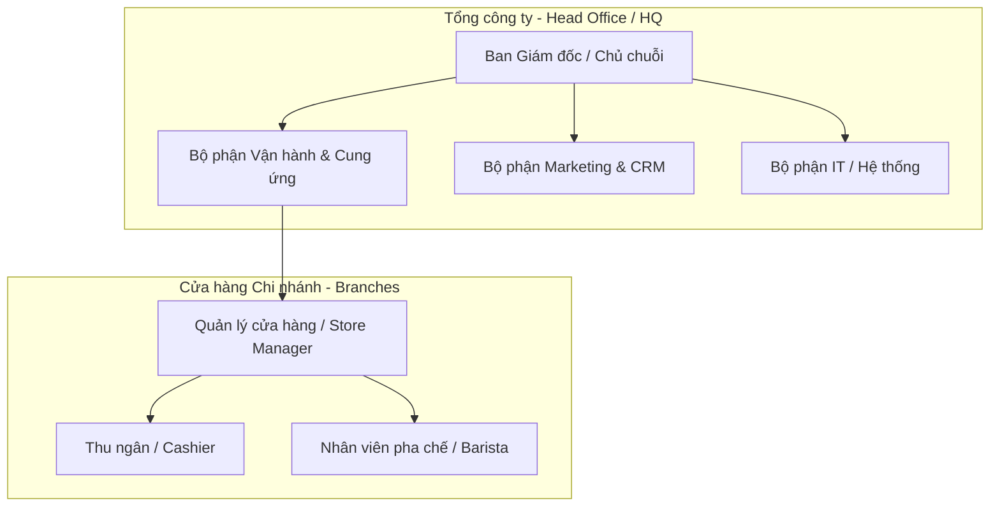
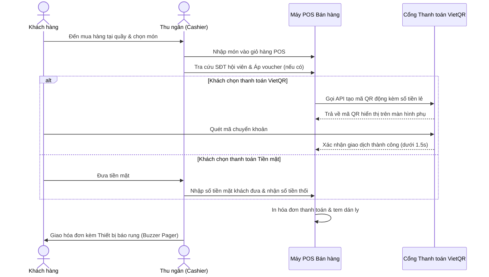
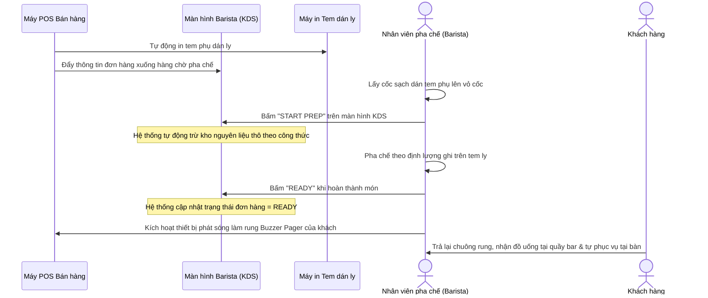

# KIẾN TRÚC HỆ THỐNG & QUY TRÌNH VẬN HÀNH TỐI ƯU
## Hệ thống Quản lý Chuỗi Cà phê Tự phục vụ Khoga Café

Tài liệu này trình bày chi tiết về **Cơ cấu tổ chức**, **Các quy trình kinh doanh cốt lõi**, và **Giải pháp ứng dụng phần mềm** được thiết kế riêng cho chuỗi cửa hàng cà phê tự phục vụ **Khoga Café**.

---

## I. Cơ cấu Tổ chức Chuỗi Cửa hàng (Organizational Structure)

Mô hình chuỗi Khoga Café được quản lý và vận hành theo cơ cấu phân cấp từ Tổng công ty (HQ) xuống từng Chi nhánh (Branch):

### 1. Phân cấp quản lý và vai trò chi tiết

*   **Ban Giám đốc / Chủ chuỗi (Executive Viewer):**
    *   **Thực tế vận hành:** Ban Giám đốc là cấp quản lý tối cao nhưng *không tham gia trực tiếp vào việc cấu hình hệ thống hay nhập liệu hàng ngày* (không tự tạo menu, không tự tạo voucher).
    *   **Tài khoản trên hệ thống:** Chỉ được cấp tài khoản **Xem báo cáo (Read-Only / Dashboard Viewer)**. Họ sử dụng tài khoản này để truy cập HQ Dashboard xem biểu đồ doanh số thực tế, tỷ suất lợi nhuận toàn chuỗi, so sánh hiệu quả giữa các chi nhánh, và xuất file báo cáo tổng hợp phục vụ cho các cuộc họp quản trị.
*   **Bộ phận Vận hành & Cung ứng (Ops & Supply Chain - `businessadmin`):**
    *   Quản lý danh mục thực đơn toàn chuỗi, thiết lập giá bán cơ sở, xây dựng định lượng công thức món (Recipe).
    *   Giám sát tồn kho tổng và điều phối nguồn nguyên vật liệu cung ứng cho các chi nhánh.
*   **Bộ phận Marketing & CRM (`businessadmin`):**
    *   Thiết lập các chương trình khuyến mãi, quản lý và phát hành Vouchers toàn hệ thống.
    *   Quản lý danh sách thành viên thân thiết, cấu hình cơ chế tích điểm và khấu trừ điểm loyalty.
*   **Bộ phận IT / Hệ thống (`ssadmin`):**
    *   Bảo trì máy chủ Cloud, quản lý License hệ thống, tích hợp các cổng thanh toán ngân hàng (API VietQR) và email/SMS OTP.
    *   Cấu hình thông số kỹ thuật hệ thống, tạo và phân quyền tài khoản cho bộ phận Ops/Marketing.
*   **Quản lý cửa hàng (Store Manager):**
    *   Chịu trách nhiệm vận hành tại một chi nhánh.
    *   Xếp ca làm việc cho nhân viên, quản lý xuất/nhập/kiểm kho tại quán, đối soát quỹ tiền mặt khi đóng ca, và giải quyết các sự cố vận hành tại chỗ.
*   **Nhân viên cửa hàng (Cashier & Barista):**
    *   *Thu ngân (Cashier):* Thực hiện order tại quầy, nhận thanh toán từ khách, in hóa đơn và bàn giao thẻ rung/số thứ tự.
    *   *Pha chế (Barista):* Tiếp nhận đơn từ màn hình KDS, thực hiện pha chế theo tem dán trên ly, dán nhãn ly, bấm hoàn thành món để báo hiệu cho khách nhận đồ.

---

## II. Các Quy trình Kinh doanh Cốt lõi (Core Business Processes)

Chuỗi Khoga Café vận hành dựa trên 4 quy trình nghiệp vụ khép kín sau:

### 1. Quy trình Bán hàng tại quầy (POS Sales Flow)

### 2. Quy trình Pha chế & Cung cấp Dịch vụ (Kitchen & Pick-up Flow)

### 3. Quy trình Quản lý Kho chi nhánh (Store Inventory Flow)
*   **Nhập kho:** Store Manager lập phiếu nhập kho (`UC-32`) ghi nhận nguyên vật liệu chuyển từ kho tổng hoặc nhà cung cấp trực tiếp (sữa, cà phê, hạt, cốc giấy...). Dữ liệu tồn kho tăng lên.
*   **Xuất kho:** Ghi nhận nguyên vật liệu hỏng, hết hạn, hoặc bị hao hụt ngoài ý muốn (`UC-33`). Dữ liệu tồn kho giảm xuống.
*   **Tự động trừ kho (Auto-deduction):** Khi Barista bấm "START PREP" trên KDS, phần mềm tự động phân tích công thức pha chế của các món trong hóa đơn để trừ trực tiếp nguyên vật liệu tương ứng (e.g. trừ 20g cà phê hạt, 30ml sữa đặc).
*   **Kiểm kho định kỳ (Inventory Audit):** Định kỳ hàng tuần/tháng, Store Manager đếm số lượng nguyên liệu thực tế tại quán và nhập vào hệ thống (`UC-34`). Phần mềm tự động đối chiếu với số lượng lý thuyết trên app để xuất báo cáo chênh lệch, giúp phát hiện thất thoát nguyên liệu.

### 4. Quy trình Quản lý Ca & Đối soát két tiền (Shift & Cash Reconciliation)
*   **Mở ca (Open Shift):** Đầu ngày hoặc đầu ca, Thu ngân đăng nhập POS, nhập số tiền mặt ban đầu bỏ két (Starting cash float) để làm tiền thối.
*   **Vận hành ca:** POS ghi nhận chi tiết mọi giao dịch tiền mặt, VietQR, thẻ phát sinh trong ca.
*   **Đóng ca (Close Shift):** Cuối ca, Thu ngân đếm toàn bộ tiền mặt thực tế trong két và nhập con số thực tế vào POS.
*   **Đối soát tự động:** Phần mềm tự động tính toán số tiền mặt lý thuyết trong két (Tiền ban đầu + Doanh thu tiền mặt trong ca - Tiền hoàn trả). 
    *   Nếu chênh lệch giữa tiền thực tế và tiền lý thuyết **vượt quá 100.000 VND**, phần mềm lập tức khóa ca kèm cờ cảnh báo (Flagged Log), đồng thời tự động gửi email/thông báo khẩn tới Store Manager để vào duyệt đối soát và xử lý giải trình.

---

## III. Tính phù hợp của Phần mềm & Các tính năng cốt lõi của App

Việc đưa phần mềm Khoga Café vào áp dụng cho chuỗi quán tự phục vụ mang lại sự tối ưu hóa vượt trội, giải quyết các bài toán đau đầu của chủ doanh nghiệp:

### 1. Phần mềm phù hợp ở những điểm nào đối với mô hình chuỗi tự phục vụ?

*   **Giải quyết bài toán thất thoát nguyên liệu (Rò rỉ lớn nhất của ngành F&B):** Ở quán cafe truyền thống, rất khó kiểm soát nhân viên pha chế dư tay sữa, syrup hoặc tự ý pha nước uống riêng. Phần mềm giải quyết bằng cơ chế **Trừ kho tự động dựa trên công thức (Recipe-based Auto-deduction)** kết hợp phiếu đối soát kiểm kho định kỳ. Chủ chuỗi biết ngay nguyên liệu nào đang bị hao hụt nhiều nhất để điều chỉnh.
*   **Tăng tốc độ phục vụ giờ cao điểm (Speed of Service):** Quy trình in tem dán ly tự động và đẩy đơn xuống màn hình KDS giúp cắt bỏ hoàn toàn việc nhân viên thu ngân phải chạy vào quầy bar gửi order giấy, hoặc Barista phải đọc hóa đơn dài dòng. Nhân viên làm việc độc lập, trơn tru.
*   **Kiểm soát tài chính từ xa, chống gian lận:** Tiền mặt tại các chi nhánh được kiểm soát chặt chẽ qua tính năng **Mở/Đóng ca bắt buộc** và tự động đối soát két tiền mặt. Ban Giám đốc có thể xem báo cáo doanh thu thực tế phát sinh của mọi chi nhánh theo thời gian thực mà không cần có mặt tại quán.
*   **Tính nhất quán toàn chuỗi (Standardized Catalog):** Đảm bảo tất cả chi nhánh bán đúng danh mục món, đúng mức giá quy định và áp dụng thống nhất các chương trình khuyến mãi/CRM do tổng công ty đưa xuống.

---

### 2. Các tính năng cốt lõi của ứng dụng (App làm được gì?)

#### A. Phân hệ Máy POS Thu ngân (Cashier App)
*   Mở/Đóng ca làm việc và nhập két tiền.
*   Tra cứu thông tin thành viên qua SĐT, tự động áp dụng chiết khấu hạng thành viên.
*   Áp dụng mã giảm giá Voucher trực tuyến hoặc ngoại tuyến.
*   Tích hợp thanh toán QR động: Tự động hiển thị mã VietQR chứa đúng số tiền đơn hàng trên màn hình phụ để khách quét, hệ thống tự động xác nhận đã nhận tiền sau 1.5 giây mà không cần thu ngân chụp ảnh màn hình chuyển khoản của khách.
*   Yêu cầu hủy đơn hàng (hoàn tiền) trực tiếp đối với các đơn hàng chưa pha chế (`PENDING`).

#### B. Phân hệ Màn hình quầy Barista (Barista KDS App)
*   Hiển thị hàng chờ pha chế theo thời gian thực (real-time queue).
*   Cung cấp thông tin chi tiết từng món cần làm kèm các ghi chú tùy chọn (sugar/ice/topping).
*   Nút cập nhật trạng thái chuẩn bị món: "START PREP" (Bắt đầu pha chế $\rightarrow$ kích hoạt trừ kho), "READY" (Hoàn thành $\rightarrow$ chuyển trạng thái đơn hàng và kích hoạt chuông rung báo khách).

#### C. Phân hệ Quản lý Chi nhánh (Store Manager Web App)
*   Lập phiếu Nhập/Xuất kho nguyên vật liệu nội bộ chi nhánh.
*   Lập biên bản Kiểm kho thực tế và đối chiếu chênh lệch kho.
*   Xếp lịch phân ca làm việc tuần cho nhân viên chi nhánh.
*   Xem và duyệt báo cáo đóng ca của thu ngân, giải quyết các ca đóng lệch tiền.
*   Bật/Tắt tính năng ngắt món tạm thời tại chi nhánh khi hết nguyên liệu phục vụ món đó (`branch_menu_status`).
*   Xem báo cáo doanh số, doanh thu, cơ cấu thanh toán của chi nhánh mình phụ trách.

#### D. Phân hệ Quản trị Trung tâm (HQ Admin Portal)
*   *System Admin (`ssadmin`):* Cấu hình tham số hệ thống toàn chuỗi, quản lý bản quyền phần mềm, kết nối API VietQR/OTP, tạo và khóa/mở khóa các tài khoản cấp quản lý, cấu hình giới hạn chi nhánh (`MAX_ACTIVE_BRANCHES`).
*   *Business Admin (`businessadmin`):* Quản lý danh mục menu và giá bán toàn chuỗi, cấu hình định lượng công thức pha chế, tạo và phát hành các chương trình khuyến mãi/Voucher, quản lý hạng thành viên CRM.
*   *Ban Giám đốc (CEO/Owner - Read-Only):* Đăng nhập giao diện HQ Dashboard để theo dõi các báo cáo tổng hợp, biểu đồ so sánh doanh số, doanh thu và xuất báo cáo kinh doanh tổng hợp.
